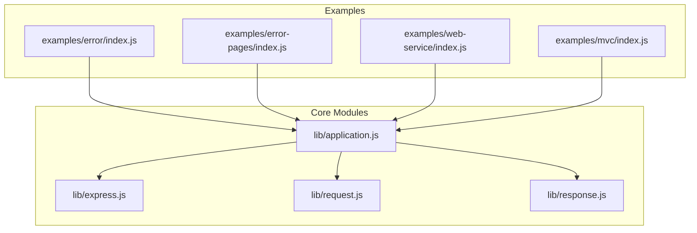
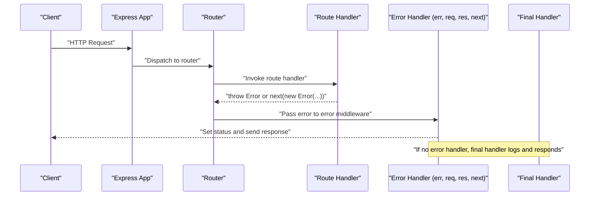
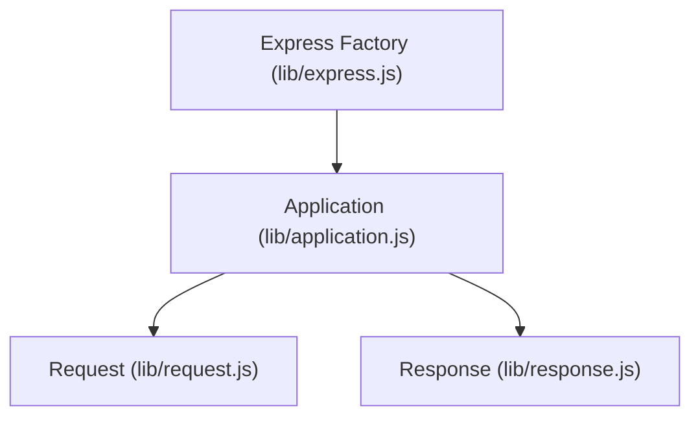

# Error Handling

<cite>
**Referenced Files in This Document**
- [index.js](file://examples/error/index.js)
- [index.js](file://examples/error-pages/index.js)
- [index.js](file://examples/web-service/index.js)
- [index.js](file://examples/mvc/index.js)
- [index.js](file://examples/mvc/controllers/pet/index.js)
- [index.js](file://examples/mvc/controllers/user/index.js)
- [index.js](file://lib/application.js)
- [index.js](file://lib/express.js)
- [index.js](file://lib/request.js)
- [index.js](file://lib/response.js)
- [index.js](file://test/app.routes.error.js)
- [index.js](file://test/app.router.js)
- [index.js](file://test/app.route.js)
- [index.js](file://examples/error-pages/views/500.ejs)
</cite>

## Table of Contents
1. [Introduction](#introduction)
2. [Project Structure](#project-structure)
3. [Core Components](#core-components)
4. [Architecture Overview](#architecture-overview)
5. [Detailed Component Analysis](#detailed-component-analysis)
6. [Dependency Analysis](#dependency-analysis)
7. [Performance Considerations](#performance-considerations)
8. [Troubleshooting Guide](#troubleshooting-guide)
9. [Conclusion](#conclusion)

## Introduction
This document explains robust error handling in Express.js using patterns demonstrated in the repository’s examples and core modules. It covers synchronous and asynchronous error propagation, error middleware with the four-parameter signature, error object structure, custom error types, error classification, response formatting, error page rendering, logging integration, and debugging strategies for development and production. Practical examples are linked to specific files for hands-on learning.

## Project Structure
The repository organizes error handling demonstrations across examples and core modules:
- Examples demonstrate error middleware placement, error object usage, and error page rendering.
- Core modules show how Express handles requests, routes, and final error logging.

**Diagram sources**
- [index.js:1-54](file://examples/error/index.js#L1-L54)
- [index.js:1-104](file://examples/error-pages/index.js#L1-L104)
- [index.js:1-118](file://examples/web-service/index.js#L1-L118)
- [index.js:1-96](file://examples/mvc/index.js#L1-L96)
- [index.js:152-178](file://lib/application.js#L152-L178)
- [index.js:36-56](file://lib/express.js#L36-L56)
- [index.js:30-37](file://lib/request.js#L30-L37)
- [index.js:42-49](file://lib/response.js#L42-L49)

**Section sources**
- [index.js:1-54](file://examples/error/index.js#L1-L54)
- [index.js:1-104](file://examples/error-pages/index.js#L1-L104)
- [index.js:1-118](file://examples/web-service/index.js#L1-L118)
- [index.js:1-96](file://examples/mvc/index.js#L1-L96)
- [index.js:152-178](file://lib/application.js#L152-L178)

## Core Components
- Error middleware signature: A middleware with four parameters (err, req, res, next) is treated as error-handling middleware. It receives errors passed by previous middleware or route handlers.
- Error object structure: Errors can carry a numeric status property (e.g., 403, 404, 500) and a message. Some examples set err.status to classify errors.
- Response formatting: Error handlers can set status codes and send structured JSON or render HTML templates depending on the environment and preferences.
- Logging integration: Express logs errors via a dedicated function during final handling, and examples demonstrate console logging in middleware.

Key references:
- Error middleware placement and signature: [index.js:14-27](file://examples/error/index.js#L14-L27)
- Error object with status and next(err): [index.js:41-51](file://examples/error-pages/index.js#L41-L51)
- Error handler responding with JSON: [index.js:98-103](file://examples/web-service/index.js#L98-L103)
- Final error logging hook: [index.js:154-157](file://lib/application.js#L154-L157), [index.js:615-618](file://lib/application.js#L615-L618)

**Section sources**
- [index.js:14-27](file://examples/error/index.js#L14-L27)
- [index.js:41-51](file://examples/error-pages/index.js#L41-L51)
- [index.js:98-103](file://examples/web-service/index.js#L98-L103)
- [index.js:154-157](file://lib/application.js#L154-L157)
- [index.js:615-618](file://lib/application.js#L615-L618)

## Architecture Overview
Express routes requests through middleware and route handlers. Errors thrown synchronously or passed asynchronously via next(err) propagate through the middleware chain until an error-handling middleware matches the four-parameter signature. If no error handler is reached, Express invokes a final handler that logs and responds.

**Diagram sources**
- [index.js:152-178](file://lib/application.js#L152-L178)
- [index.js:29-47](file://examples/error/index.js#L29-L47)
- [index.js:63-97](file://examples/error-pages/index.js#L63-L97)

**Section sources**
- [index.js:152-178](file://lib/application.js#L152-L178)
- [index.js:29-47](file://examples/error/index.js#L29-L47)
- [index.js:63-97](file://examples/error-pages/index.js#L63-L97)

## Detailed Component Analysis

### Error Middleware Implementation
- Four-parameter signature: Middleware with (err, req, res, next) is recognized as error handling. It runs only when an error is present.
- Placement matters: Place error middleware after all routes and regular middleware so it can catch errors from them.
- Environment-aware behavior: Examples toggle logging and verbose error settings based on environment.

References:
- Signature and placement: [index.js:14-18](file://examples/error/index.js#L14-L18), [index.js:44-47](file://examples/error/index.js#L44-L47)
- Error handler responding with text: [index.js:20-27](file://examples/error/index.js#L20-L27)
- Error handler responding with JSON: [index.js:98-103](file://examples/web-service/index.js#L98-L103)
- 404 fallback and 403/500 triggers: [index.js:34-51](file://examples/error-pages/index.js#L34-L51), [index.js:63-97](file://examples/error-pages/index.js#L63-L97)

**Section sources**
- [index.js:14-18](file://examples/error/index.js#L14-L18)
- [index.js:20-27](file://examples/error/index.js#L20-L27)
- [index.js:44-47](file://examples/error/index.js#L44-L47)
- [index.js:98-103](file://examples/web-service/index.js#L98-L103)
- [index.js:34-51](file://examples/error-pages/index.js#L34-L51)
- [index.js:63-97](file://examples/error-pages/index.js#L63-L97)

### Error Object Structure and Classification
- Standard Error: Thrown or created with new Error("message").
- Status classification: Setting err.status allows handlers to respond with appropriate HTTP status codes.
- Type and custom properties: Some examples demonstrate adding custom properties (e.g., type) to errors for richer handling.

References:
- Creating and passing errors: [index.js:41-51](file://examples/error-pages/index.js#L41-L51)
- Using err.status in handlers: [index.js:95-96](file://examples/error-pages/index.js#L95-L96), [index.js:15-19](file://examples/web-service/index.js#L15-L19), [index.js:101-102](file://examples/web-service/index.js#L101-L102)

**Section sources**
- [index.js:41-51](file://examples/error-pages/index.js#L41-L51)
- [index.js:95-96](file://examples/error-pages/index.js#L95-L96)
- [index.js:15-19](file://examples/web-service/index.js#L15-L19)
- [index.js:101-102](file://examples/web-service/index.js#L101-L102)

### Error Response Formatting and Rendering
- JSON responses: Handlers can send structured JSON with error details.
- Template rendering: Handlers can render HTML templates for errors, optionally toggling verbose output based on settings.
- Content negotiation: Use res.format to respond with HTML, JSON, or plain text depending on Accept headers.

References:
- JSON error response: [index.js:98-103](file://examples/web-service/index.js#L98-L103)
- Template rendering for 500: [index.js:91-97](file://examples/error-pages/index.js#L91-L97), [500.ejs:1-8](file://examples/error-pages/views/500.ejs#L1-L8)
- 404 fallback with content negotiation: [index.js:63-77](file://examples/error-pages/index.js#L63-L77)

**Section sources**
- [index.js:98-103](file://examples/web-service/index.js#L98-L103)
- [index.js:91-97](file://examples/error-pages/index.js#L91-L97)
- [500.ejs:1-8](file://examples/error-pages/views/500.ejs#L1-L8)
- [index.js:63-77](file://examples/error-pages/index.js#L63-L77)

### Logging Integration
- Console logging in middleware: Examples log error stacks in development.
- Final error logging hook: Express uses a final handler that logs errors via a dedicated function.

References:
- Console logging in error middleware: [index.js:21-22](file://examples/error/index.js#L21-L22)
- Final error logging: [index.js:154-157](file://lib/application.js#L154-L157), [index.js:615-618](file://lib/application.js#L615-L618)

**Section sources**
- [index.js:21-22](file://examples/error/index.js#L21-L22)
- [index.js:154-157](file://lib/application.js#L154-L157)
- [index.js:615-618](file://lib/application.js#L615-L618)

### Asynchronous Error Propagation and Promise Handling
- Async operations: Errors can be passed to next() from async callbacks (e.g., timers, I/O).
- Promises: Rejected promises propagate errors through the same chain. Tests demonstrate rejected promises and chained error handlers.

References:
- Async next(err) with process.nextTick: [index.js:34-42](file://examples/error/index.js#L34-L42)
- Promise rejection handling in tests: [index.js:70-81](file://test/app.route.js#L70-L81), [index.js:970-976](file://test/app.router.js#L970-L976)
- Chained error handling for promises: [index.js:133-144](file://test/app.route.js#L133-L144), [index.js:1029-1039](file://test/app.router.js#L1029-L1039)

**Section sources**
- [index.js:34-42](file://examples/error/index.js#L34-L42)
- [index.js:70-81](file://test/app.route.js#L70-L81)
- [index.js:970-976](file://test/app.router.js#L970-L976)
- [index.js:133-144](file://test/app.route.js#L133-L144)
- [index.js:1029-1039](file://test/app.router.js#L1029-L1039)

### MVC Controllers and Error Flow
- Controller-level error handling: Controllers can call next('route') to skip to next matching route or next(err) to propagate errors.
- Centralized error handling: A global error handler renders error pages or sends JSON.

References:
- Controller calling next('route'): [index.js](file://examples/mvc/controllers/user/index.js#L18), [index.js](file://examples/mvc/controllers/pet/index.js#L13)
- Global error handler: [index.js:78-84](file://examples/mvc/index.js#L78-L84)

**Section sources**
- [index.js](file://examples/mvc/controllers/user/index.js#L18)
- [index.js](file://examples/mvc/controllers/pet/index.js#L13)
- [index.js:78-84](file://examples/mvc/index.js#L78-L84)

### Practical Examples Index
- Basic error middleware and synchronous error: [index.js:20-47](file://examples/error/index.js#L20-L47)
- Error pages with 404/403/500 handling: [index.js:28-97](file://examples/error-pages/index.js#L28-L97)
- Web service with typed errors and JSON responses: [index.js:15-103](file://examples/web-service/index.js#L15-L103)
- MVC with centralized error handling and 404 fallback: [index.js:78-89](file://examples/mvc/index.js#L78-L89)

**Section sources**
- [index.js:20-47](file://examples/error/index.js#L20-L47)
- [index.js:28-97](file://examples/error-pages/index.js#L28-L97)
- [index.js:15-103](file://examples/web-service/index.js#L15-L103)
- [index.js:78-89](file://examples/mvc/index.js#L78-L89)

## Dependency Analysis
Express composes application, request, and response prototypes. The application module orchestrates middleware and routes, invoking a final handler when errors are not handled earlier.

**Diagram sources**
- [index.js:36-56](file://lib/express.js#L36-L56)
- [index.js:40-83](file://lib/application.js#L40-L83)
- [index.js:30-37](file://lib/request.js#L30-L37)
- [index.js:42-49](file://lib/response.js#L42-L49)

**Section sources**
- [index.js:36-56](file://lib/express.js#L36-L56)
- [index.js:40-83](file://lib/application.js#L40-L83)
- [index.js:30-37](file://lib/request.js#L30-L37)
- [index.js:42-49](file://lib/response.js#L42-L49)

## Performance Considerations
- Keep error handlers efficient: Avoid heavy computations in error paths; log minimally in hot paths.
- Prefer early exits: Throw or next(err) as soon as an error is detected to avoid unnecessary processing.
- Use environment flags: Disable verbose error details in production to reduce payload sizes and avoid leaking internal information.

## Troubleshooting Guide
Common issues and remedies:
- Error not caught by middleware:
  - Ensure error middleware is placed after routes and regular middleware.
  - Verify the middleware signature is four-parameter.
  - References: [index.js:44-47](file://examples/error/index.js#L44-L47), [index.js:63-97](file://examples/error-pages/index.js#L63-L97)

- Incorrect status code:
  - Set err.status on custom errors or use res.status() in handlers.
  - References: [index.js:43-45](file://examples/error-pages/index.js#L43-L45), [index.js:101-102](file://examples/web-service/index.js#L101-L102)

- Asynchronous errors not surfaced:
  - Pass errors to next() from async callbacks.
  - References: [index.js:34-42](file://examples/error/index.js#L34-L42)

- Promise rejections:
  - Rejected promises propagate through the chain; add error handlers to catch and respond.
  - References: [index.js:70-81](file://test/app.route.js#L70-L81), [index.js:970-976](file://test/app.router.js#L970-L976)

- Verbose vs concise error pages:
  - Toggle verbose errors via app settings; production should disable verbose errors.
  - References: [index.js:17-24](file://examples/error-pages/index.js#L17-L24), [500.ejs:3-6](file://examples/error-pages/views/500.ejs#L3-L6)

**Section sources**
- [index.js:34-47](file://examples/error/index.js#L34-L47)
- [index.js:17-24](file://examples/error-pages/index.js#L17-L24)
- [index.js:43-45](file://examples/error-pages/index.js#L43-L45)
- [index.js:63-97](file://examples/error-pages/index.js#L63-L97)
- [index.js:101-102](file://examples/web-service/index.js#L101-L102)
- [index.js:70-81](file://test/app.route.js#L70-L81)
- [index.js:970-976](file://test/app.router.js#L970-L976)
- [500.ejs:3-6](file://examples/error-pages/views/500.ejs#L3-L6)

## Conclusion
Robust Express error handling relies on correctly placing four-parameter error middleware, structuring errors with meaningful status codes and messages, and choosing appropriate response formats (JSON or HTML). The repository demonstrates these patterns across examples and core modules, including asynchronous error propagation, promise rejection handling, and environment-aware logging and rendering. Adopting these patterns ensures predictable error behavior, clear debugging signals, and graceful degradation across development and production environments.