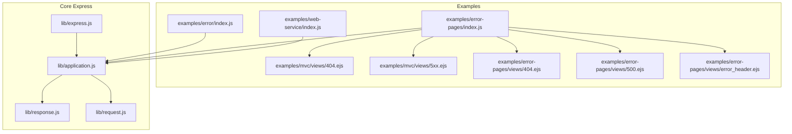
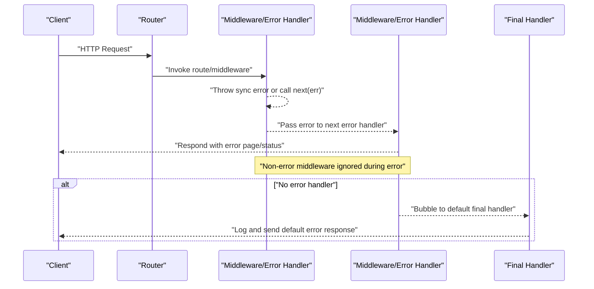
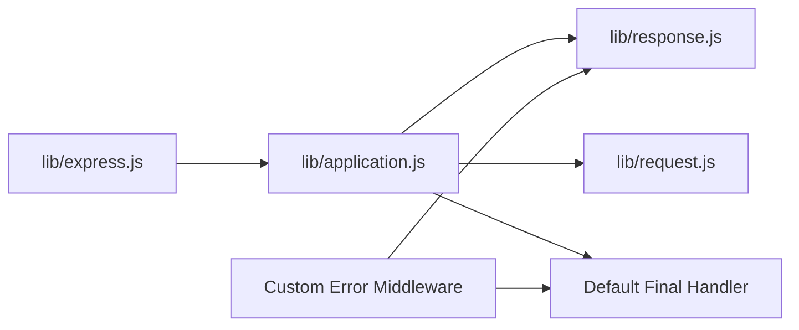

# Error Handling

<cite>
**Referenced Files in This Document**
- [index.js](file://examples/error/index.js)
- [index.js](file://examples/error-pages/index.js)
- [index.js](file://examples/web-service/index.js)
- [index.js](file://examples/mvc/views/404.ejs)
- [index.js](file://examples/mvc/views/5xx.ejs)
- [index.js](file://examples/error-pages/views/404.ejs)
- [index.js](file://examples/error-pages/views/500.ejs)
- [index.js](file://examples/error-pages/views/error_header.ejs)
- [application.js](file://lib/application.js)
- [express.js](file://lib/express.js)
- [response.js](file://lib/response.js)
- [request.js](file://lib/request.js)
- [app.routes.error.js](file://test/app.routes.error.js)
- [app.router.js](file://test/app.router.js)
- [res.status.js](file://test/res.status.js)
- [res.sendStatus.js](file://test/res.sendStatus.js)
- [Route.js](file://test/Route.js)
</cite>

## Table of Contents
1. [Introduction](#introduction)
2. [Project Structure](#project-structure)
3. [Core Components](#core-components)
4. [Architecture Overview](#architecture-overview)
5. [Detailed Component Analysis](#detailed-component-analysis)
6. [Dependency Analysis](#dependency-analysis)
7. [Performance Considerations](#performance-considerations)
8. [Troubleshooting Guide](#troubleshooting-guide)
9. [Conclusion](#conclusion)
10. [Appendices](#appendices)

## Introduction
This document explains Express.js error handling strategies using concrete examples and core implementation files from the repository. It covers synchronous and asynchronous error propagation, error middleware signatures, custom error types, error logging, debugging techniques, error page rendering, status code handling, and response formatting. It also outlines production-grade patterns, monitoring integration, and graceful degradation strategies.

## Project Structure
The repository provides multiple examples demonstrating different error handling approaches:
- A minimal synchronous and asynchronous error example
- A structured error-pages example with HTML templates and environment-aware verbosity
- A web service example focused on JSON error responses
- MVC-style views for 404 and 5xx pages
- Core Express internals that implement the request/response lifecycle and error propagation

**Diagram sources**
- [index.js:1-54](file://examples/error/index.js#L1-L54)
- [index.js:1-104](file://examples/error-pages/index.js#L1-L104)
- [index.js:96-117](file://examples/web-service/index.js#L96-L117)
- [index.js:1-14](file://examples/mvc/views/404.ejs#L1-L14)
- [index.js:1-14](file://examples/mvc/views/5xx.ejs#L1-L14)
- [index.js:1-4](file://examples/error-pages/views/404.ejs#L1-L4)
- [index.js:1-9](file://examples/error-pages/views/500.ejs#L1-L9)
- [index.js:1-10](file://examples/error-pages/views/error_header.ejs#L1-L10)
- [application.js:152-178](file://lib/application.js#L152-L178)
- [express.js:36-56](file://lib/express.js#L36-L56)
- [response.js:64-76](file://lib/response.js#L64-L76)
- [request.js:63-83](file://lib/request.js#L63-L83)

**Section sources**
- [index.js:1-54](file://examples/error/index.js#L1-L54)
- [index.js:1-104](file://examples/error-pages/index.js#L1-L104)
- [index.js:96-117](file://examples/web-service/index.js#L96-L117)
- [application.js:152-178](file://lib/application.js#L152-L178)
- [express.js:36-56](file://lib/express.js#L36-L56)

## Core Components
- Error middleware signature: A middleware with four arguments (err, req, res, next) is recognized as an error handler. It runs only when an error is passed to next() or thrown synchronously.
- Default error logging: Express logs unhandled errors via a default final handler that prints the error stack in non-test environments.
- Status code handling: The response object validates and sets HTTP status codes, raising errors for invalid values.
- Error propagation: Errors propagate through the middleware chain until handled by an error handler; otherwise they reach the default final handler.

Key implementation references:
- Error middleware placement and behavior
- Default final handler and logging
- Response status validation and error signaling
- Route-level error propagation tests

**Section sources**
- [index.js:14-27](file://examples/error/index.js#L14-L27)
- [application.js:152-178](file://lib/application.js#L152-L178)
- [application.js:615-618](file://lib/application.js#L615-L618)
- [response.js:64-76](file://lib/response.js#L64-L76)
- [app.routes.error.js:9-23](file://test/app.routes.error.js#L9-L23)

## Architecture Overview
Express error handling follows a predictable pipeline:
- Synchronous errors thrown inside route or middleware are caught and passed to the next error handler.
- Asynchronous errors are passed via next(err).
- Non-error middleware is skipped when an error is present; only error handlers execute.
- If no error handler handles the error, the default final handler logs and responds.

**Diagram sources**
- [application.js:152-178](file://lib/application.js#L152-L178)
- [index.js:29-42](file://examples/error/index.js#L29-L42)
- [app.router.js:926-931](file://test/app.router.js#L926-L931)

**Section sources**
- [application.js:152-178](file://lib/application.js#L152-L178)
- [index.js:29-42](file://examples/error/index.js#L29-L42)
- [app.router.js:926-931](file://test/app.router.js#L926-L931)

## Detailed Component Analysis

### Error Middleware Patterns
- Single global error handler: A single error handler placed after routes handles all unhandled errors.
- Environment-aware verbosity: An application setting toggles verbose error details in templates.
- Content negotiation for errors: Use res.format to respond with HTML, JSON, or plain text depending on Accept headers.

Implementation highlights:
- Global error handler signature and status assignment
- Environment-based verbose errors toggle
- Content negotiation for 404 and 500 responses
- Template rendering for error pages

**Section sources**
- [index.js:20-27](file://examples/error/index.js#L20-L27)
- [index.js:17-24](file://examples/error-pages/index.js#L17-L24)
- [index.js:63-97](file://examples/error-pages/index.js#L63-L97)
- [index.js:3-7](file://examples/error-pages/views/500.ejs#L3-L7)

### Synchronous vs Asynchronous Error Handling
- Synchronous errors: Throwing inside a route or middleware propagates immediately to error handlers.
- Asynchronous errors: Using next(new Error(...)) inside callbacks or timers ensures proper propagation.
- Promise rejections: Rejected promises in middleware are treated as errors and routed to error handlers.

Patterns demonstrated:
- Throwing in a route handler
- Passing errors via next() from async operations
- Promise rejection handling in middleware

**Section sources**
- [index.js:29-32](file://examples/error/index.js#L29-L32)
- [index.js:34-42](file://examples/error/index.js#L34-L42)
- [app.router.js:966-983](file://test/app.router.js#L966-L983)
- [app.routes.error.js:9-23](file://test/app.routes.error.js#L9-L23)

### Custom Error Types and Properties
- Standard Error instances with custom status: Setting err.status allows explicit HTTP status codes.
- Template-driven verbosity: The application setting controls whether stack traces are included in error pages.
- Status code semantics: Use appropriate status codes (e.g., 403 for forbidden, 404 for not found, 500 for internal error).

Practical examples:
- Creating a 403 error with a custom status
- Triggering a generic 500 error
- Rendering environment-aware error details

**Section sources**
- [index.js:41-51](file://examples/error-pages/index.js#L41-L51)
- [index.js:3-7](file://examples/error-pages/views/500.ejs#L3-L7)
- [index.js:1-4](file://examples/error-pages/views/404.ejs#L1-L4)

### Error Logging and Debugging
- Default logging: The default final handler logs errors to the console in non-test environments.
- Middleware logging: Error handlers can log errors before responding.
- Debugging helpers: Use console.error with err.stack for detailed diagnostics.

References:
- Default error logging function
- Console logging in error middleware
- Verbose error templates for stack inspection

**Section sources**
- [application.js:615-618](file://lib/application.js#L615-L618)
- [index.js:21-22](file://examples/error/index.js#L21-L22)
- [index.js:3-7](file://examples/error-pages/views/500.ejs#L3-L7)

### Error Page Rendering and Response Formatting
- HTML error pages: Render EJS templates for 404 and 500 with environment-specific verbosity.
- JSON error responses: Return structured JSON bodies for APIs.
- Content negotiation: Use res.format to tailor responses to client capabilities.

Examples:
- 404 handling with res.format and template rendering
- 500 handling with template rendering and error object
- JSON error middleware for REST APIs

**Section sources**
- [index.js:63-97](file://examples/error-pages/index.js#L63-L97)
- [index.js:1-4](file://examples/error-pages/views/404.ejs#L1-L4)
- [index.js:1-9](file://examples/error-pages/views/500.ejs#L1-L9)
- [index.js:98-111](file://examples/web-service/index.js#L98-L111)

### Status Code Handling and Validation
- Response status validation: The res.status method enforces integer status codes within the 100–999 range, throwing descriptive errors otherwise.
- Default messages: res.sendStatus maps numeric codes to standard messages.
- Test coverage: Assertions validate both valid and invalid status code behavior.

**Section sources**
- [response.js:64-76](file://lib/response.js#L64-L76)
- [res.status.js:120-203](file://test/res.status.js#L120-L203)
- [res.sendStatus.js:32-42](file://test/res.sendStatus.js#L32-L42)

### Route-Level Error Propagation
- Route dispatch: Errors thrown inside route callbacks propagate to error handlers.
- Mixed middleware: Only error handlers execute when an error is present; normal middleware is skipped.
- Error handler chaining: Error handlers can modify the error object and decide whether to recover or pass onward.

**Section sources**
- [Route.js:252-259](file://test/Route.js#L252-L259)
- [app.routes.error.js:25-60](file://test/app.routes.error.js#L25-L60)
- [app.router.js:938-962](file://test/app.router.js#L938-L962)

## Dependency Analysis
Express’s error handling relies on:
- Application handle method to orchestrate the request lifecycle and attach a default final handler
- Response methods to validate and set status codes
- Router middleware to route requests and errors through the chain

**Diagram sources**
- [express.js:36-56](file://lib/express.js#L36-L56)
- [application.js:152-178](file://lib/application.js#L152-L178)
- [response.js:64-76](file://lib/response.js#L64-L76)
- [request.js:63-83](file://lib/request.js#L63-L83)

**Section sources**
- [express.js:36-56](file://lib/express.js#L36-L56)
- [application.js:152-178](file://lib/application.js#L152-L178)
- [response.js:64-76](file://lib/response.js#L64-L76)
- [request.js:63-83](file://lib/request.js#L63-L83)

## Performance Considerations
- Keep error handlers efficient: Avoid heavy computations in error paths; log asynchronously if needed.
- Minimize error handler count: Prefer a single robust error handler that delegates to environment-specific templates or serializers.
- Avoid redundant middleware: Place error handlers after all non-error middleware to prevent unnecessary execution.
- Use res.format judiciously: Content negotiation adds overhead; ensure it aligns with client needs.

## Troubleshooting Guide
Common issues and resolutions:
- Invalid status code: Ensure res.status receives an integer within 100–999; otherwise Express throws a validation error.
- Unhandled errors: Add a global error handler after all routes to prevent fallback to default final handler behavior.
- Async errors not surfacing: Verify next(new Error(...)) is called inside callbacks or timers; avoid swallowing errors silently.
- 404 ambiguity: Place a 404 handler after all routes to ensure it executes only when no route responds.
- Template verbosity: Toggle verbose errors via app settings to control stack exposure in production.

Diagnostic references:
- Status code validation and error messages
- Default final handler logging behavior
- Route-level error propagation tests

**Section sources**
- [res.status.js:120-203](file://test/res.status.js#L120-L203)
- [application.js:615-618](file://lib/application.js#L615-L618)
- [app.routes.error.js:9-23](file://test/app.routes.error.js#L9-L23)
- [app.router.js:926-931](file://test/app.router.js#L926-L931)

## Conclusion
Express provides a robust, extensible error handling model. By leveraging error middleware, validating status codes, and structuring error responses (HTML, JSON, or plain text), applications can deliver clear, actionable feedback. Production readiness involves environment-aware verbosity, structured logging, and resilient error handlers that maintain service stability.

## Appendices

### Practical Implementation References
- Minimal error middleware and synchronous/asynchronous error propagation
- Environment-aware error pages and content negotiation
- JSON error responses for REST APIs
- Core status validation and default final handler behavior

**Section sources**
- [index.js:14-47](file://examples/error/index.js#L14-L47)
- [index.js:17-97](file://examples/error-pages/index.js#L17-L97)
- [index.js:98-111](file://examples/web-service/index.js#L98-L111)
- [application.js:152-178](file://lib/application.js#L152-L178)
- [response.js:64-76](file://lib/response.js#L64-L76)