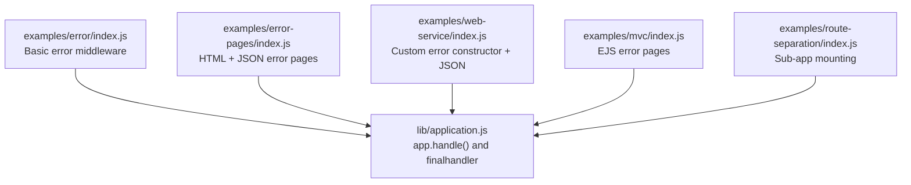
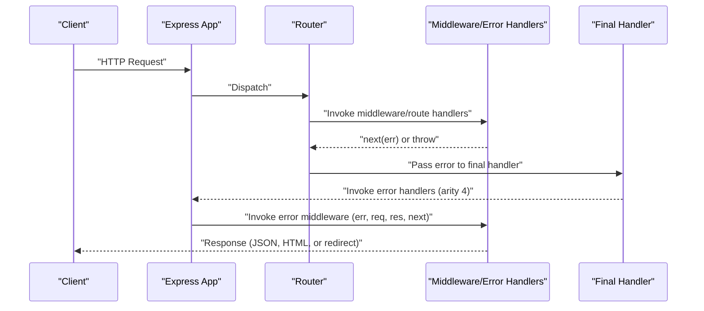
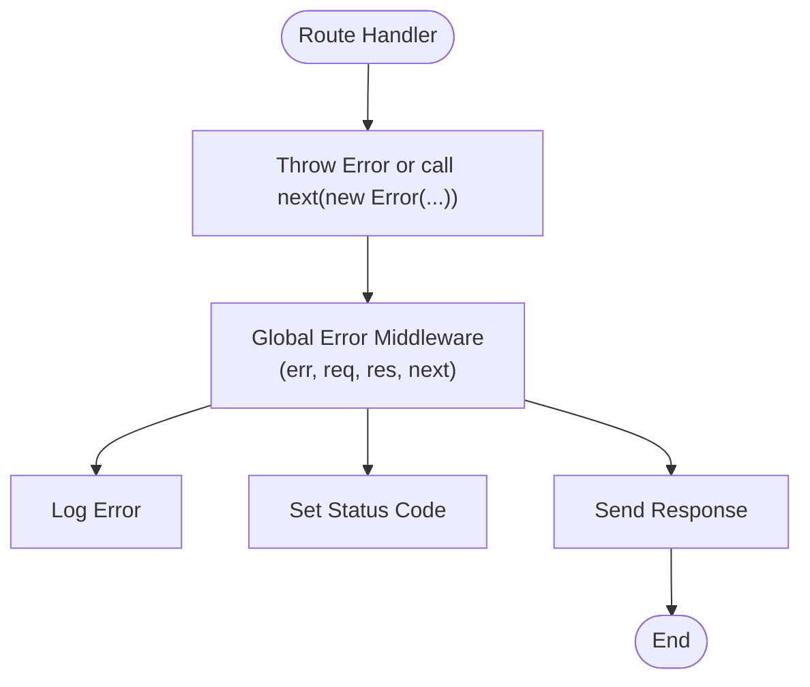
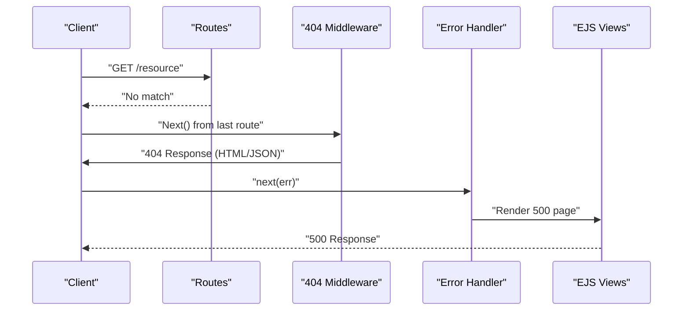
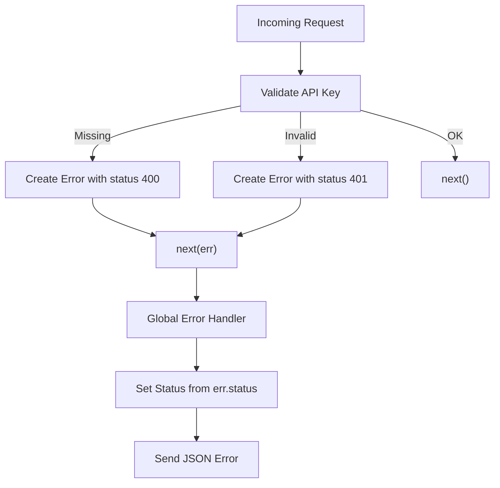
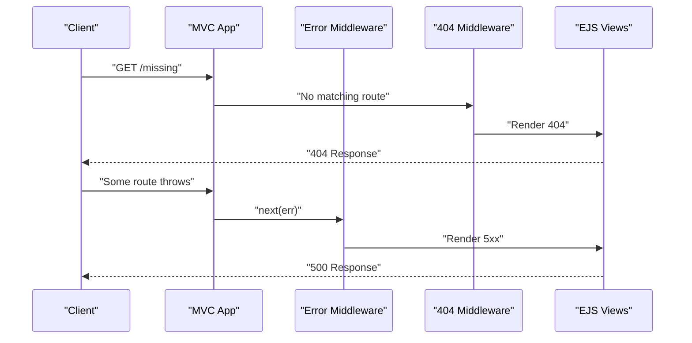
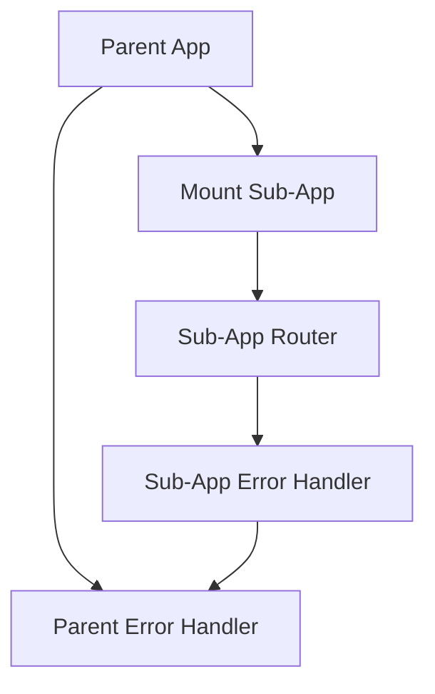
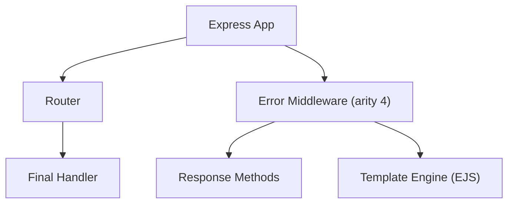

# Error Middleware Implementation

<cite>
**Referenced Files in This Document**
- [index.js](file://examples/error/index.js)
- [index.js](file://examples/error-pages/index.js)
- [index.js](file://examples/web-service/index.js)
- [index.js](file://examples/mvc/index.js)
- [index.js](file://examples/mvc/views/404.ejs)
- [index.js](file://examples/mvc/views/5xx.ejs)
- [index.js](file://examples/error-pages/views/404.ejs)
- [index.js](file://examples/error-pages/views/500.ejs)
- [application.js](file://lib/application.js)
- [app.routes.error.js](file://test/app.routes.error.js)
- [error.js](file://test/acceptance/error.js)
- [index.js](file://examples/route-separation/index.js)
</cite>

## Table of Contents
1. [Introduction](#introduction)
2. [Project Structure](#project-structure)
3. [Core Components](#core-components)
4. [Architecture Overview](#architecture-overview)
5. [Detailed Component Analysis](#detailed-component-analysis)
6. [Dependency Analysis](#dependency-analysis)
7. [Performance Considerations](#performance-considerations)
8. [Troubleshooting Guide](#troubleshooting-guide)
9. [Conclusion](#conclusion)

## Introduction
This document explains Express.js error middleware implementation with the four-parameter signature (err, req, res, next). It covers registration patterns, execution order, scope, error object properties and status codes, response formatting, custom error classes, transformation, and logging integration. Practical examples demonstrate global error handlers, route-specific error handling, and sub-application error handling. Best practices for API responses, HTML error pages, and debugging information are included.

## Project Structure
The repository includes multiple examples demonstrating error middleware usage:
- Basic error middleware and throwing errors in routes
- Content negotiation for 404/500 responses with HTML and JSON
- Web service error handling with custom error constructors and JSON responses
- MVC-style application with dedicated error and 404 pages
- Route separation and sub-application mounting with error propagation

**Diagram sources**
- [index.js:14-47](file://examples/error/index.js#L14-L47)
- [index.js:53-97](file://examples/error-pages/index.js#L53-L97)
- [index.js:93-111](file://examples/web-service/index.js#L93-L111)
- [index.js:78-89](file://examples/mvc/index.js#L78-L89)
- [index.js:13-32](file://examples/route-separation/index.js#L13-L32)
- [application.js:152-178](file://lib/application.js#L152-L178)

**Section sources**
- [index.js:1-54](file://examples/error/index.js#L1-L54)
- [index.js:1-104](file://examples/error-pages/index.js#L1-L104)
- [index.js:1-118](file://examples/web-service/index.js#L1-L118)
- [index.js:1-96](file://examples/mvc/index.js#L1-L96)
- [index.js:1-56](file://examples/route-separation/index.js#L1-L56)
- [application.js:152-178](file://lib/application.js#L152-L178)

## Core Components
- Four-parameter error middleware signature: (err, req, res, next). These are recognized by arity and intercept errors passed downstream.
- Registration patterns:
  - Global error handler registered after routes and other middleware.
  - Route-specific error handlers within route stacks.
  - Sub-application error handlers when mounting apps under paths.
- Execution order:
  - Express invokes only error-handling middleware with arity 4 when an error is passed via next(err).
  - Regular middleware is skipped during error dispatch.
  - Order matters: later error handlers can recover or transform errors.
- Scope:
  - Global error handlers catch unhandled errors from any route or middleware.
  - Route-specific error handlers apply to a subset of routes.
  - Sub-applications propagate errors to parent error handlers unless handled locally.

Key behaviors demonstrated:
- Throwing synchronous errors in route handlers and passing exceptions to next().
- Using res.status() and sending appropriate responses (text, JSON, or rendering views).
- Leveraging err.status to set HTTP status codes.
- Rendering HTML error pages with EJS templates.
- Returning JSON error payloads for APIs.

**Section sources**
- [index.js:14-47](file://examples/error/index.js#L14-L47)
- [index.js:53-97](file://examples/error-pages/index.js#L53-L97)
- [index.js:93-111](file://examples/web-service/index.js#L93-L111)
- [index.js:78-89](file://examples/mvc/index.js#L78-L89)
- [application.js:152-178](file://lib/application.js#L152-L178)

## Architecture Overview
The Express application pipeline routes requests through middleware and routes. When an error occurs, the router invokes the final handler and then only error-handling middleware with arity 4. Error middleware can:
- Log the error
- Transform the error (e.g., normalize status codes)
- Respond with structured JSON for APIs
- Render HTML error pages for web UI
- Recover by calling next() without an error

**Diagram sources**
- [application.js:152-178](file://lib/application.js#L152-L178)
- [index.js:53-97](file://examples/error-pages/index.js#L53-L97)
- [index.js:93-111](file://examples/web-service/index.js#L93-L111)

## Detailed Component Analysis

### Basic Error Middleware (examples/error)
- Demonstrates synchronous throwing in a route and asynchronous passing via next().
- Registers a global error handler after routes.
- Logs errors and responds with a fixed status and message.

**Diagram sources**
- [index.js:29-47](file://examples/error/index.js#L29-L47)

**Section sources**
- [index.js:14-47](file://examples/error/index.js#L14-L47)

### Content-Negotiation Error Pages (examples/error-pages)
- Uses a 404 middleware after all routes to detect misses.
- Renders HTML error pages with EJS and supports JSON responses.
- A global error handler sets status from err.status or defaults to 500 and renders a 500 page.

**Diagram sources**
- [index.js:53-97](file://examples/error-pages/index.js#L53-L97)
- [index.js:1-4](file://examples/error-pages/views/404.ejs#L1-L4)
- [index.js:1-9](file://examples/error-pages/views/500.ejs#L1-L9)

**Section sources**
- [index.js:53-97](file://examples/error-pages/index.js#L53-L97)
- [index.js:1-4](file://examples/error-pages/views/404.ejs#L1-L4)
- [index.js:1-9](file://examples/error-pages/views/500.ejs#L1-L9)

### Web Service Error Handling (examples/web-service)
- Defines a custom error constructor that attaches a status property.
- Validates API keys and passes custom errors to next().
- Global error handler responds with JSON, using err.status or defaulting to 500.

**Diagram sources**
- [index.js:15-42](file://examples/web-service/index.js#L15-L42)
- [index.js:93-111](file://examples/web-service/index.js#L93-L111)

**Section sources**
- [index.js:15-42](file://examples/web-service/index.js#L15-L42)
- [index.js:93-111](file://examples/web-service/index.js#L93-L111)

### MVC Error Pages (examples/mvc)
- Renders dedicated 404 and 5xx pages using EJS.
- Global error handler logs and renders the 5xx page.
- A 404 handler renders the 404 page when no route matches.

**Diagram sources**
- [index.js:78-89](file://examples/mvc/index.js#L78-L89)
- [index.js:1-14](file://examples/mvc/views/404.ejs#L1-L14)
- [index.js:1-14](file://examples/mvc/views/5xx.ejs#L1-L14)

**Section sources**
- [index.js:78-89](file://examples/mvc/index.js#L78-L89)
- [index.js:1-14](file://examples/mvc/views/404.ejs#L1-L14)
- [index.js:1-14](file://examples/mvc/views/5xx.ejs#L1-L14)

### Route-Specific and Sub-Application Error Handling
- Route-specific error handlers can be defined within a route stack; they run only for that route’s chain.
- Sub-applications propagate errors to parent error handlers unless handled locally; mounting wraps fn.handle and restores prototypes.

**Diagram sources**
- [application.js:225-241](file://lib/application.js#L225-L241)
- [index.js:13-32](file://examples/route-separation/index.js#L13-L32)

**Section sources**
- [application.js:225-241](file://lib/application.js#L225-L241)
- [index.js:13-32](file://examples/route-separation/index.js#L13-L32)

## Dependency Analysis
- Error middleware depends on:
  - Express application handle() to dispatch to final handler and error handlers.
  - Router to invoke middleware and routes, and to pass errors to error handlers.
  - Template engines (EJS) for HTML error pages.
  - HTTP status codes and response methods (res.status(), res.send(), res.json(), res.render()).

**Diagram sources**
- [application.js:152-178](file://lib/application.js#L152-L178)
- [index.js:53-97](file://examples/error-pages/index.js#L53-L97)
- [index.js:78-89](file://examples/mvc/index.js#L78-L89)

**Section sources**
- [application.js:152-178](file://lib/application.js#L152-L178)
- [index.js:53-97](file://examples/error-pages/index.js#L53-L97)
- [index.js:78-89](file://examples/mvc/index.js#L78-L89)

## Performance Considerations
- Keep error logging efficient; avoid heavy synchronous I/O in error handlers.
- Prefer structured logging with minimal allocations.
- Cache template lookups for error pages in production.
- Avoid transforming errors excessively; keep transformations deterministic and fast.
- Use err.status to minimize branching in error handlers.

## Troubleshooting Guide
Common issues and resolutions:
- Error not caught by global handler:
  - Ensure the error handler is registered after routes and middleware.
  - Verify that next(err) is called with an Error object.
- 404 not handled:
  - Place a 404 middleware after all routes; it should not respond until no route matches.
- Status code not applied:
  - Set err.status on custom errors or explicitly call res.status().
- HTML vs JSON responses:
  - Use content negotiation or explicit checks to send appropriate formats.
- Sub-application errors not handled:
  - Ensure parent app has an error handler; verify mounting wrapper behavior.

Validation references:
- Tests confirm that error handlers are invoked when next(err) is used and that route-specific error handlers run within their route stack.
- Tests also confirm promise rejections propagate as errors to error handlers.

**Section sources**
- [app.routes.error.js:25-60](file://test/app.routes.error.js#L25-L60)
- [error.js:1-30](file://test/acceptance/error.js#L1-L30)
- [application.js:152-178](file://lib/application.js#L152-L178)

## Conclusion
Express error middleware with the four-parameter signature (err, req, res, next) provides a robust mechanism to centralize error handling, logging, and response formatting. By registering global, route-specific, and sub-application error handlers, applications can tailor error responses for APIs and HTML pages while maintaining predictable execution order and scope. Proper use of err.status, content negotiation, and structured logging ensures maintainable and user-friendly error handling across diverse deployment scenarios.