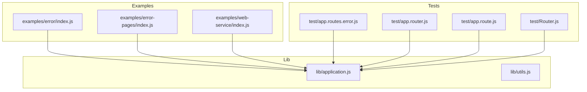
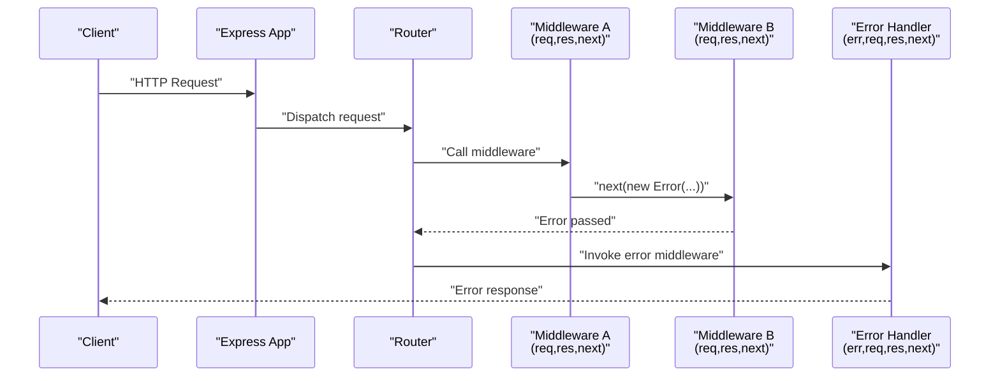
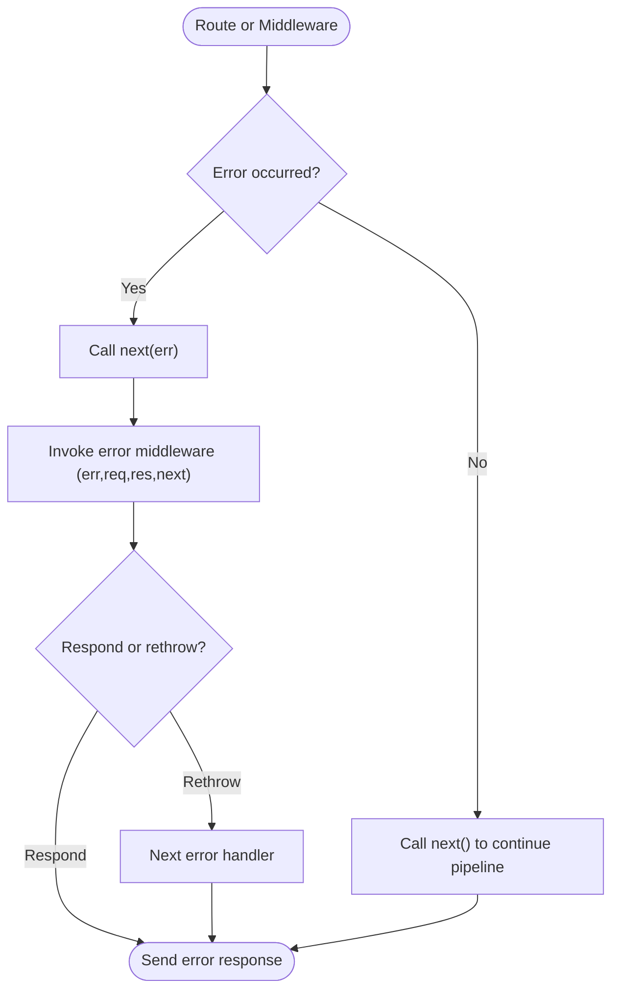
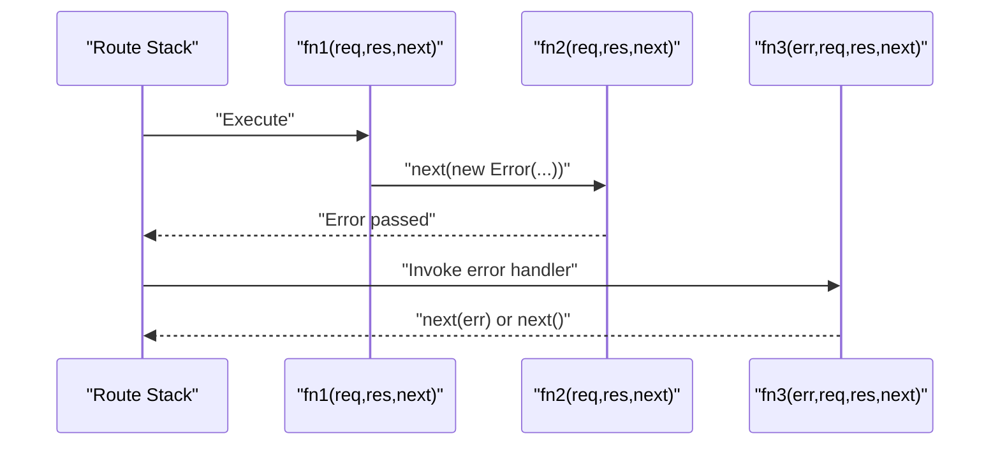
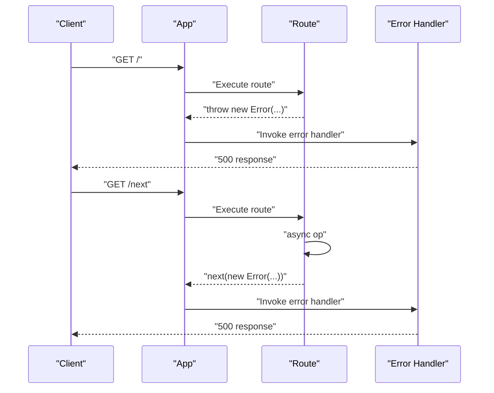
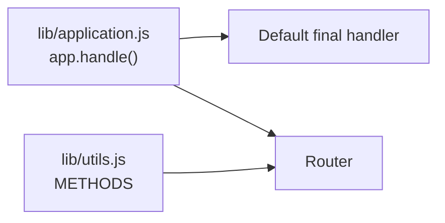

# Error Middleware

<cite>
**Referenced Files in This Document**
- [examples/error/index.js](file://examples/error/index.js)
- [examples/error-pages/index.js](file://examples/error-pages/index.js)
- [examples/web-service/index.js](file://examples/web-service/index.js)
- [lib/application.js](file://lib/application.js)
- [lib/utils.js](file://lib/utils.js)
- [test/app.routes.error.js](file://test/app.routes.error.js)
- [test/app.router.js](file://test/app.router.js)
- [test/app.route.js](file://test/app.route.js)
- [test/Router.js](file://test/Router.js)
</cite>

## Table of Contents
1. [Introduction](#introduction)
2. [Project Structure](#project-structure)
3. [Core Components](#core-components)
4. [Architecture Overview](#architecture-overview)
5. [Detailed Component Analysis](#detailed-component-analysis)
6. [Dependency Analysis](#dependency-analysis)
7. [Performance Considerations](#performance-considerations)
8. [Troubleshooting Guide](#troubleshooting-guide)
9. [Conclusion](#conclusion)

## Introduction
This document explains Express.js error middleware: what it is, how it differs from regular middleware, how errors propagate through the middleware chain, and best practices for registering and composing error handlers. It also covers synchronous and asynchronous error handling, integration with custom error types, error scoping, bubbling behavior, and debugging techniques. Practical examples are drawn from the repository’s examples and tests to illustrate real-world usage.

## Project Structure
The repository organizes error middleware demonstrations and tests across examples and test suites:
- Examples demonstrate synchronous and asynchronous error propagation, custom error types, and error pages.
- Tests verify error handling behavior in routes, routers, and the application pipeline.

**Diagram sources**
- [examples/error/index.js:1-54](file://examples/error/index.js#L1-L54)
- [examples/error-pages/index.js:1-104](file://examples/error-pages/index.js#L1-L104)
- [examples/web-service/index.js:1-118](file://examples/web-service/index.js#L1-L118)
- [lib/application.js:152-178](file://lib/application.js#L152-L178)
- [lib/utils.js:29](file://lib/utils.js#L29)
- [test/app.routes.error.js:1-63](file://test/app.routes.error.js#L1-L63)
- [test/app.router.js:922-1107](file://test/app.router.js#L922-L1107)
- [test/app.route.js:59-197](file://test/app.route.js#L59-L197)
- [test/Router.js:1-200](file://test/Router.js#L1-L200)

**Section sources**
- [examples/error/index.js:1-54](file://examples/error/index.js#L1-L54)
- [examples/error-pages/index.js:1-104](file://examples/error-pages/index.js#L1-L104)
- [examples/web-service/index.js:1-118](file://examples/web-service/index.js#L1-L118)
- [lib/application.js:152-178](file://lib/application.js#L152-L178)
- [lib/utils.js:29](file://lib/utils.js#L29)
- [test/app.routes.error.js:1-63](file://test/app.routes.error.js#L1-L63)
- [test/app.router.js:922-1107](file://test/app.router.js#L922-L1107)
- [test/app.route.js:59-197](file://test/app.route.js#L59-L197)
- [test/Router.js:1-200](file://test/Router.js#L1-L200)

## Core Components
- Error middleware signature: A function with four parameters (err, req, res, next). Express recognizes it by arity and routes errors exclusively to these handlers.
- Regular middleware: Three parameters (req, res, next) and does not receive errors unless explicitly invoked with an error.
- Error propagation: When middleware calls next(err), Express stops normal (non-error) middleware and routes the error to the nearest error-handling middleware in the chain.
- Final error fallback: If no error handler is reached, Express uses a default final handler to respond.

Practical examples:
- Synchronous error throwing in a route handler and passing errors via next().
- Asynchronous error propagation using next() inside async callbacks.
- Custom error types with a status property for semantic HTTP status codes.
- Composition of multiple error handlers and a 404 fallback.

**Section sources**
- [examples/error/index.js:14-47](file://examples/error/index.js#L14-L47)
- [examples/error/index.js:29-42](file://examples/error/index.js#L29-L42)
- [examples/web-service/index.js:15-19](file://examples/web-service/index.js#L15-L19)
- [examples/web-service/index.js:93-103](file://examples/web-service/index.js#L93-L103)
- [examples/error-pages/index.js:79-97](file://examples/error-pages/index.js#L79-L97)
- [lib/application.js:152-178](file://lib/application.js#L152-L178)

## Architecture Overview
Express routes requests through middleware stacks. When an error occurs, Express switches from normal middleware to error middleware exclusively. The application’s handle method sets up a default final handler if none is provided.

**Diagram sources**
- [lib/application.js:152-178](file://lib/application.js#L152-L178)
- [examples/error/index.js:29-42](file://examples/error/index.js#L29-L42)
- [examples/error-pages/index.js:79-97](file://examples/error-pages/index.js#L79-L97)

## Detailed Component Analysis

### Error Middleware Signature and Behavior
- Four-parameter signature distinguishes error handlers from regular middleware.
- Error handlers are invoked only when next(err) is called or when an error is thrown synchronously.
- They can modify the error object (e.g., set status) and either respond or continue propagation by calling next(err) or next().

**Diagram sources**
- [examples/error/index.js:14-18](file://examples/error/index.js#L14-L18)
- [examples/error/index.js:29-42](file://examples/error/index.js#L29-L42)
- [examples/error-pages/index.js:79-97](file://examples/error-pages/index.js#L79-L97)

**Section sources**
- [examples/error/index.js:14-18](file://examples/error/index.js#L14-L18)
- [examples/error/index.js:29-42](file://examples/error/index.js#L29-L42)
- [examples/error-pages/index.js:79-97](file://examples/error-pages/index.js#L79-L97)

### Error Propagation Through the Middleware Chain
- Normal middleware chain halts when next(err) is encountered.
- Only error-handling middleware (arity 4) executes afterward.
- Tests confirm that error handlers in the same route are invoked when an error is propagated within that route.

**Diagram sources**
- [test/app.routes.error.js:25-60](file://test/app.routes.error.js#L25-L60)
- [test/app.router.js:938-962](file://test/app.router.js#L938-L962)

**Section sources**
- [test/app.routes.error.js:25-60](file://test/app.routes.error.js#L25-L60)
- [test/app.router.js:938-962](file://test/app.router.js#L938-L962)

### Error Middleware Registration Order and Placement
- Error handlers must be registered after all other middleware and routes to receive unhandled errors.
- Placing error middleware before routes prevents it from receiving errors thrown by those routes.
- Tests demonstrate that without an error handler, an error bubbles to the default final handler.

Best practices:
- Place error middleware last globally.
- Use separate routers for modular error handling when appropriate.
- Keep a 404 handler after all routes and error handlers to finalize unmatched requests.

**Section sources**
- [examples/error/index.js:44-47](file://examples/error/index.js#L44-L47)
- [examples/error-pages/index.js:55-77](file://examples/error-pages/index.js#L55-L77)
- [test/app.routes.error.js:9-23](file://test/app.routes.error.js#L9-L23)

### Synchronous and Asynchronous Error Handling
- Synchronous: Throw an error in a route handler; Express routes it to error middleware.
- Asynchronous: Call next(new Error(...)) inside async callbacks (e.g., timers, I/O) to propagate errors.

**Diagram sources**
- [examples/error/index.js:29-42](file://examples/error/index.js#L29-L42)
- [examples/error/index.js:14-18](file://examples/error/index.js#L14-L18)

**Section sources**
- [examples/error/index.js:29-42](file://examples/error/index.js#L29-L42)
- [examples/error/index.js:14-18](file://examples/error/index.js#L14-L18)

### Error Middleware Composition Patterns
- Multiple error handlers can be chained; each can inspect and modify the error or decide whether to respond or rethrow.
- Tests show that rejecting promises with errors propagates to error handlers; resolved promises do not trigger error handlers.

Patterns:
- Validation → next(error) → centralized error handler → respond.
- Modular routers with scoped error handlers.
- Fallback 404 handler after all routes and error handlers.

**Section sources**
- [examples/web-service/index.js:93-103](file://examples/web-service/index.js#L93-L103)
- [examples/error-pages/index.js:79-97](file://examples/error-pages/index.js#L79-L97)
- [test/app.route.js:59-197](file://test/app.route.js#L59-L197)
- [test/app.router.js:965-1094](file://test/app.router.js#L965-L1094)

### Integration with Custom Error Types
- Create errors with a status property to control HTTP status codes.
- Error handlers can branch logic based on err.status or other properties.

Example pattern:
- Factory creates Error with status.
- Middleware validates and calls next(error) with status.
- Centralized error handler reads err.status and responds accordingly.

**Section sources**
- [examples/web-service/index.js:15-19](file://examples/web-service/index.js#L15-L19)
- [examples/web-service/index.js:98-103](file://examples/web-service/index.js#L98-L103)

### Error Scope and Bubbling Behavior
- Errors bubble to global error handlers when not handled locally.
- Within a route, if an error handler exists in the same route stack, it can intercept and handle the error before it bubbles further.
- Tests demonstrate that an error handler in the same route receives the error when next(new Error(...)) is called within that route.

**Section sources**
- [test/app.router.js:938-962](file://test/app.router.js#L938-L962)
- [test/app.route.js:128-197](file://test/app.route.js#L128-L197)

### Debugging Techniques for Error Middleware Chains
- Use logging in error handlers to capture error details and stack traces.
- Enable verbose error settings in development to surface more context.
- Verify handler order and ensure error handlers are registered after routes.
- Test both synchronous and asynchronous error paths.

**Section sources**
- [examples/error/index.js:20-27](file://examples/error/index.js#L20-L27)
- [examples/error-pages/index.js:17-24](file://examples/error-pages/index.js#L17-L24)

## Dependency Analysis
Express’s application handle method orchestrates request processing and establishes a default final handler when no error handler is provided. Utility constants define supported HTTP methods used by routers.

**Diagram sources**
- [lib/application.js:152-178](file://lib/application.js#L152-L178)
- [lib/utils.js:29](file://lib/utils.js#L29)

**Section sources**
- [lib/application.js:152-178](file://lib/application.js#L152-L178)
- [lib/utils.js:29](file://lib/utils.js#L29)

## Performance Considerations
- Keep error handlers efficient; avoid heavy synchronous work in hot paths.
- Prefer early exits and minimal logging in production to reduce overhead.
- Use environment-specific settings to toggle verbose error reporting.

## Troubleshooting Guide
Common issues and resolutions:
- Error handler not invoked:
  - Ensure it is registered after routes and middleware.
  - Confirm next(err) is called instead of next() when errors occur.
- Unhandled errors:
  - Add a global error handler and a 404 fallback last.
- Async errors:
  - Wrap async callbacks to call next(new Error(...)) on failure.
- Verbose vs. concise errors:
  - Toggle verbose error settings per environment.

**Section sources**
- [examples/error/index.js:44-47](file://examples/error/index.js#L44-L47)
- [examples/error-pages/index.js:55-77](file://examples/error-pages/index.js#L55-L77)
- [examples/error-pages/index.js:79-97](file://examples/error-pages/index.js#L79-L97)
- [examples/web-service/index.js:93-103](file://examples/web-service/index.js#L93-L103)

## Conclusion
Express error middleware is a powerful mechanism for centralized error handling. By understanding the four-parameter signature, error propagation rules, and proper registration order, developers can build robust applications with clear error semantics. Compose multiple error handlers, integrate custom error types, and leverage environment-aware settings to improve maintainability and debugging.