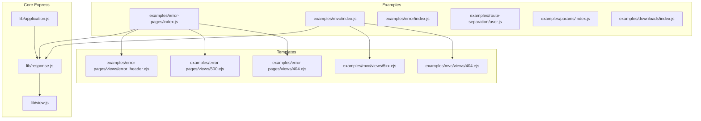
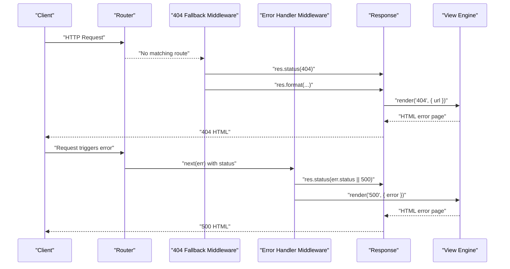
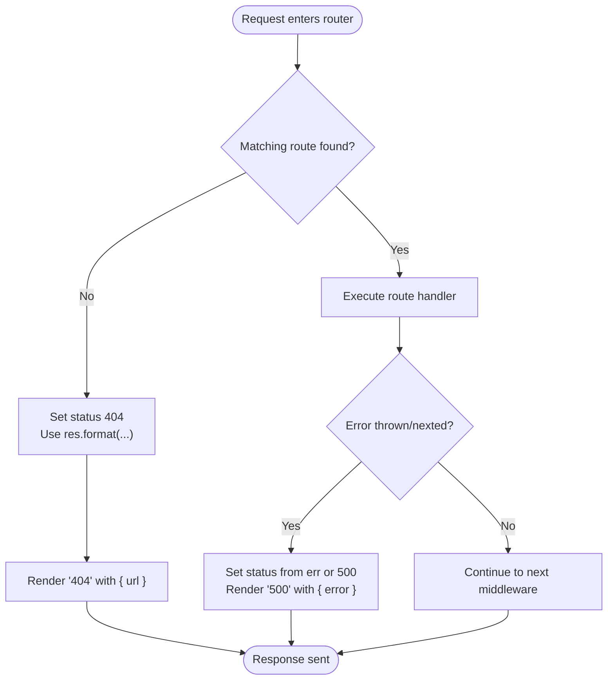
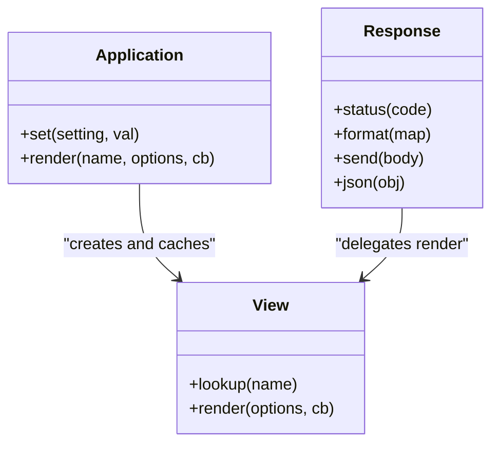
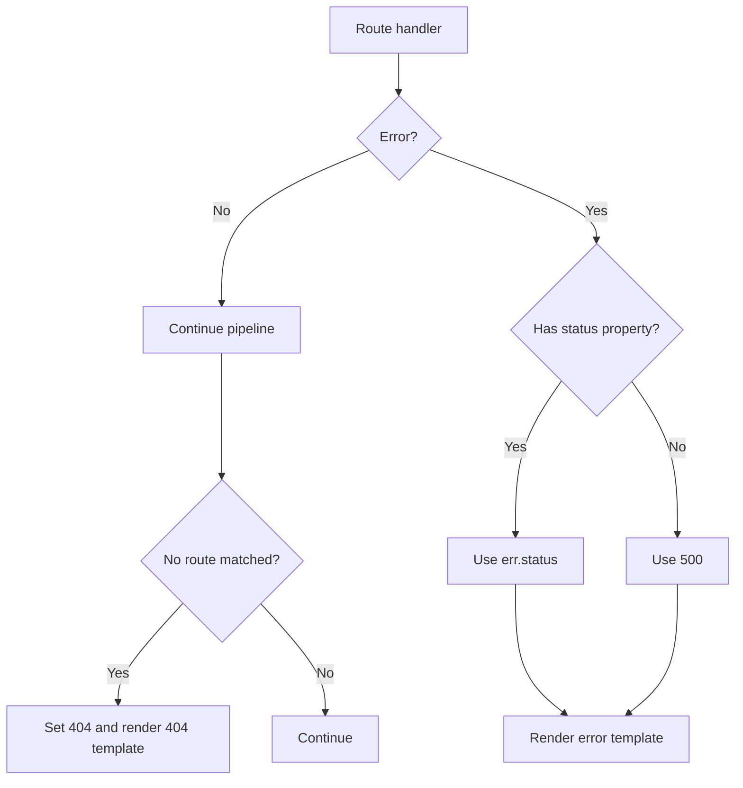

# Error Page Management

<cite>
**Referenced Files in This Document**
- [examples/error-pages/index.js](file://examples/error-pages/index.js)
- [examples/error-pages/views/404.ejs](file://examples/error-pages/views/404.ejs)
- [examples/error-pages/views/500.ejs](file://examples/error-pages/views/500.ejs)
- [examples/error-pages/views/error_header.ejs](file://examples/error-pages/views/error_header.ejs)
- [examples/mvc/views/404.ejs](file://examples/mvc/views/404.ejs)
- [examples/mvc/views/5xx.ejs](file://examples/mvc/views/5xx.ejs)
- [examples/error/index.js](file://examples/error/index.js)
- [examples/mvc/index.js](file://examples/mvc/index.js)
- [examples/route-separation/user.js](file://examples/route-separation/user.js)
- [examples/params/index.js](file://examples/params/index.js)
- [examples/downloads/index.js](file://examples/downloads/index.js)
- [lib/application.js](file://lib/application.js)
- [lib/response.js](file://lib/response.js)
- [lib/view.js](file://lib/view.js)
- [test/acceptance/error-pages.js](file://test/acceptance/error-pages.js)
</cite>

## Table of Contents
1. [Introduction](#introduction)
2. [Project Structure](#project-structure)
3. [Core Components](#core-components)
4. [Architecture Overview](#architecture-overview)
5. [Detailed Component Analysis](#detailed-component-analysis)
6. [Dependency Analysis](#dependency-analysis)
7. [Performance Considerations](#performance-considerations)
8. [Troubleshooting Guide](#troubleshooting-guide)
9. [Conclusion](#conclusion)
10. [Appendices](#appendices)

## Introduction
This document explains how Express.js manages error pages with a focus on custom error page rendering and user-friendly error presentation. It covers how error status codes are mapped to error pages, how fallback mechanisms work, and how to integrate and customize error views with template engines. It also addresses styling, content generation, localization, security, performance, analytics integration, and testing strategies for error pages.

## Project Structure
The repository includes multiple examples demonstrating error handling and error page rendering:
- A dedicated error-pages example that demonstrates HTML, JSON, and plain-text error responses with EJS templates.
- An MVC example that renders dedicated 404 and 5xx error views.
- Additional examples that trigger and propagate errors, including HTTP error helpers and route-specific error handling.

**Diagram sources**
- [examples/error-pages/index.js:14-97](file://examples/error-pages/index.js#L14-L97)
- [examples/mvc/index.js:18-89](file://examples/mvc/index.js#L18-L89)
- [examples/error/index.js:20-47](file://examples/error/index.js#L20-L47)
- [examples/route-separation/user.js:14-24](file://examples/route-separation/user.js#L14-L24)
- [examples/params/index.js:23-41](file://examples/params/index.js#L23-L41)
- [examples/downloads/index.js:26-34](file://examples/downloads/index.js#L26-L34)
- [lib/application.js:522-575](file://lib/application.js#L522-L575)
- [lib/response.js:569-594](file://lib/response.js#L569-L594)
- [lib/view.js:52-95](file://lib/view.js#L52-L95)

**Section sources**
- [examples/error-pages/index.js:14-97](file://examples/error-pages/index.js#L14-L97)
- [examples/mvc/index.js:18-89](file://examples/mvc/index.js#L18-L89)
- [lib/application.js:522-575](file://lib/application.js#L522-L575)
- [lib/response.js:569-594](file://lib/response.js#L569-L594)
- [lib/view.js:52-95](file://lib/view.js#L52-L95)

## Core Components
- Error page routing and negotiation:
  - A 404 fallback handler uses content negotiation to render HTML, JSON, or plain text.
  - A global error handler maps error status codes to an error page.
- Template engine integration:
  - Views are resolved and rendered via the application’s view layer.
  - EJS templates are used for HTML error pages.
- Status code mapping:
  - 404 is explicitly handled by a final non-error middleware.
  - Errors with a status property are honored; otherwise, 500 is assumed.
- Settings-driven verbosity:
  - A custom setting controls whether detailed error details are shown in templates.

Practical outcomes:
- Consistent user-facing error pages across content types.
- Separation of concerns between route handlers, error handlers, and view rendering.

**Section sources**
- [examples/error-pages/index.js:63-97](file://examples/error-pages/index.js#L63-L97)
- [lib/application.js:522-575](file://lib/application.js#L522-L575)
- [lib/response.js:569-594](file://lib/response.js#L569-L594)
- [examples/error-pages/views/500.ejs:3-7](file://examples/error-pages/views/500.ejs#L3-L7)

## Architecture Overview
The error handling pipeline integrates route processing, content negotiation, and view rendering.

**Diagram sources**
- [examples/error-pages/index.js:63-97](file://examples/error-pages/index.js#L63-L97)
- [lib/response.js:569-594](file://lib/response.js#L569-L594)
- [lib/view.js:133-159](file://lib/view.js#L133-L159)

## Detailed Component Analysis

### Error Page Routing and Content Negotiation
- 404 fallback:
  - A final middleware sets status 404 and uses content negotiation to render HTML, JSON, or plain text.
  - HTML rendering uses a template with the requested URL injected.
- Global error handler:
  - An error-handling middleware receives thrown or passed errors.
  - It sets the status from the error or defaults to 500 and renders an error template.

**Diagram sources**
- [examples/error-pages/index.js:63-97](file://examples/error-pages/index.js#L63-L97)

**Section sources**
- [examples/error-pages/index.js:63-97](file://examples/error-pages/index.js#L63-L97)
- [examples/error-pages/views/404.ejs:1-4](file://examples/error-pages/views/404.ejs#L1-L4)
- [examples/error-pages/views/500.ejs:1-9](file://examples/error-pages/views/500.ejs#L1-L9)

### Template Integration and Rendering
- View resolution and rendering:
  - The application resolves the view path and delegates rendering to the registered template engine.
  - Errors during rendering are surfaced to the error handler.
- EJS templates:
  - Shared header partials are included in error templates.
  - Error verbosity is controlled by a setting toggled per environment.

**Diagram sources**
- [lib/application.js:522-575](file://lib/application.js#L522-L575)
- [lib/response.js:569-594](file://lib/response.js#L569-L594)
- [lib/view.js:52-95](file://lib/view.js#L52-L95)

**Section sources**
- [lib/application.js:522-575](file://lib/application.js#L522-L575)
- [lib/response.js:569-594](file://lib/response.js#L569-L594)
- [lib/view.js:52-95](file://lib/view.js#L52-L95)
- [examples/error-pages/views/error_header.ejs:1-11](file://examples/error-pages/views/error_header.ejs#L1-L11)

### Error Status Code Mapping and Fallbacks
- Explicit mapping:
  - 404 is mapped by a dedicated fallback middleware.
  - Errors with a numeric status property are honored; otherwise, 500 is used.
- Fallback behavior:
  - If a route throws or calls next with an error, the global error handler renders the appropriate error page.
- Route-specific errors:
  - Controllers and route modules can set error status codes for user-not-found scenarios.

**Diagram sources**
- [examples/error-pages/index.js:91-97](file://examples/error-pages/index.js#L91-L97)
- [examples/route-separation/user.js:20-23](file://examples/route-separation/user.js#L20-L23)
- [examples/params/index.js:39-40](file://examples/params/index.js#L39-L40)

**Section sources**
- [examples/error-pages/index.js:91-97](file://examples/error-pages/index.js#L91-L97)
- [examples/route-separation/user.js:20-23](file://examples/route-separation/user.js#L20-L23)
- [examples/params/index.js:39-40](file://examples/params/index.js#L39-L40)

### Error Page Customization Strategies
- Dedicated templates per status:
  - Separate templates for 404 and 500 allow distinct branding and messaging.
- Environment-aware verbosity:
  - A custom setting enables verbose error details in development and hides them in production.
- Shared partials:
  - Common header/footer partials promote consistency across error pages.

**Section sources**
- [examples/error-pages/index.js:17-24](file://examples/error-pages/index.js#L17-L24)
- [examples/error-pages/views/404.ejs:1-4](file://examples/error-pages/views/404.ejs#L1-L4)
- [examples/error-pages/views/500.ejs:3-7](file://examples/error-pages/views/500.ejs#L3-L7)
- [examples/mvc/views/404.ejs:1-14](file://examples/mvc/views/404.ejs#L1-L14)
- [examples/mvc/views/5xx.ejs:1-14](file://examples/mvc/views/5xx.ejs#L1-L14)

### Error Page Localization
- Localize error messages by passing localized strings into the render context.
- Use a localization library and expose localized data via res.locals or app.locals.
- Keep shared partials (e.g., headers) consistent across locales.

[No sources needed since this section provides general guidance]

### Error Page Styling and Content Generation
- Styling:
  - Link to shared stylesheets from error templates.
  - Keep minimal inline styles to reduce payload and improve maintainability.
- Content generation:
  - Inject contextual data (e.g., requested URL) into error templates.
  - Avoid exposing internal implementation details in production.

**Section sources**
- [examples/mvc/views/404.ejs:7-11](file://examples/mvc/views/404.ejs#L7-L11)
- [examples/mvc/views/5xx.ejs:7-11](file://examples/mvc/views/5xx.ejs#L7-L11)

### Error Page Analytics Integration
- Track error page views via middleware before rendering.
- Record status code, path, user agent, and timestamps.
- Integrate with external analytics services or logging systems.

[No sources needed since this section provides general guidance]

### Practical Examples: Common HTTP Status Codes
- 404 Not Found:
  - Triggered by unmatched routes; handled by a final middleware that renders a 404 template.
- 403 Forbidden:
  - Thrown with a status of 403; handled by the global error handler.
- 500 Internal Server Error:
  - Thrown without a status or passed via next(); handled by the global error handler.
- Route-specific 404:
  - Controllers set error status 404 and pass to the error handler.

**Section sources**
- [examples/error-pages/index.js:34-51](file://examples/error-pages/index.js#L34-L51)
- [examples/error-pages/index.js:63-77](file://examples/error-pages/index.js#L63-L77)
- [examples/error-pages/index.js:91-97](file://examples/error-pages/index.js#L91-L97)
- [examples/route-separation/user.js:20-23](file://examples/route-separation/user.js#L20-L23)
- [examples/params/index.js:39-40](file://examples/params/index.js#L39-L40)

### Error Page Templates and Routing
- Template locations:
  - Views are configured under the application’s views directory.
  - Templates are referenced by name and resolved by the view layer.
- Routing:
  - Routes trigger errors or rely on the 404 fallback.
  - Error handlers render templates with context.

**Section sources**
- [examples/error-pages/index.js:14-15](file://examples/error-pages/index.js#L14-L15)
- [examples/mvc/index.js:18-20](file://examples/mvc/index.js#L18-L20)
- [lib/view.js:104-123](file://lib/view.js#L104-L123)

### Security Considerations
- Verbose error details:
  - Disable verbose errors in production to avoid leaking stack traces.
- Input sanitization:
  - Escape or sanitize any user-supplied data injected into error templates.
- Logging:
  - Log full errors securely and avoid logging sensitive data.

**Section sources**
- [examples/error-pages/index.js:17-24](file://examples/error-pages/index.js#L17-L24)
- [examples/error/index.js:20-27](file://examples/error/index.js#L20-L27)

### Performance Optimization
- View caching:
  - Enable view caching in production to reduce template resolution overhead.
- Minimal templates:
  - Keep error templates lightweight to minimize rendering time.
- Static assets:
  - Serve error pages with minimal external dependencies.

**Section sources**
- [lib/application.js:138-140](file://lib/application.js#L138-L140)

### Testing Strategies
- Acceptance tests:
  - Verify status codes and response bodies for HTML, JSON, and plain-text requests.
  - Confirm that content negotiation selects the correct handler.

**Section sources**
- [test/acceptance/error-pages.js:14-98](file://test/acceptance/error-pages.js#L14-L98)

## Dependency Analysis
The error handling system depends on the application’s router, response utilities, and view rendering pipeline.

**Diagram sources**
- [lib/application.js:152-178](file://lib/application.js#L152-L178)
- [lib/response.js:64-76](file://lib/response.js#L64-L76)
- [lib/response.js:569-594](file://lib/response.js#L569-L594)
- [lib/view.js:133-159](file://lib/view.js#L133-L159)

**Section sources**
- [lib/application.js:152-178](file://lib/application.js#L152-L178)
- [lib/response.js:64-76](file://lib/response.js#L64-L76)
- [lib/response.js:569-594](file://lib/response.js#L569-L594)
- [lib/view.js:133-159](file://lib/view.js#L133-L159)

## Performance Considerations
- Prefer explicit status codes to avoid unnecessary fallback logic.
- Cache views in production environments.
- Minimize template complexity for error pages to reduce CPU usage.
- Avoid heavy synchronous operations in error handlers.

[No sources needed since this section provides general guidance]

## Troubleshooting Guide
- 404 not rendering:
  - Ensure the 404 fallback middleware is registered after all routes.
  - Verify the 404 template exists and is readable by the view engine.
- 500 not rendering:
  - Confirm the error handler is registered after routes.
  - Check that the error object has a status property or that the handler defaults to 500.
- Content negotiation issues:
  - Validate Accept headers and ensure res.format callbacks are defined for supported types.
- Verbose errors in production:
  - Ensure the verbose errors setting is disabled in production.

**Section sources**
- [examples/error-pages/index.js:63-77](file://examples/error-pages/index.js#L63-L77)
- [examples/error-pages/index.js:91-97](file://examples/error-pages/index.js#L91-L97)
- [lib/response.js:569-594](file://lib/response.js#L569-L594)

## Conclusion
Express error page management centers on a predictable pipeline: routes either respond or propagate errors; unmatched routes fall back to a 404 handler; global error handlers render user-friendly pages. With content negotiation, template engines, and environment-aware verbosity, applications can deliver consistent, secure, and maintainable error experiences across HTTP status codes.

[No sources needed since this section summarizes without analyzing specific files]

## Appendices

### Appendix A: Example Routes That Trigger Errors
- Route-specific 404:
  - A controller sets an error with status 404 and passes it to the error handler.
- Parameter validation:
  - A parameter handler creates a 404 when a resource is not found.

**Section sources**
- [examples/route-separation/user.js:20-23](file://examples/route-separation/user.js#L20-L23)
- [examples/params/index.js:39-40](file://examples/params/index.js#L39-L40)

### Appendix B: Download Handler Error Handling
- A download handler checks for non-404 errors and continues propagation; otherwise, it sets 404 and sends a plain-text message.

**Section sources**
- [examples/downloads/index.js:26-34](file://examples/downloads/index.js#L26-L34)