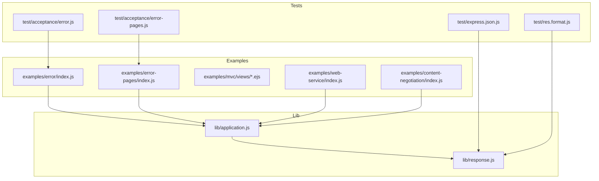
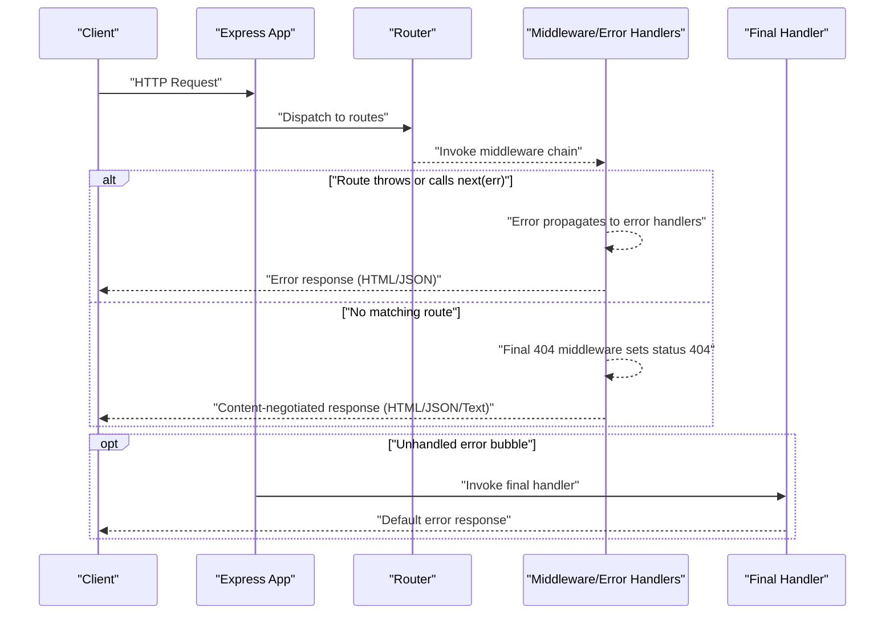
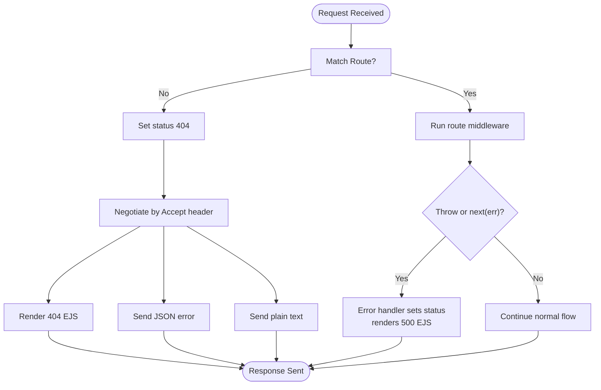
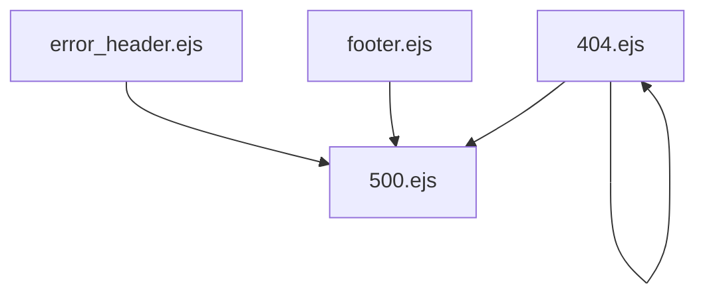
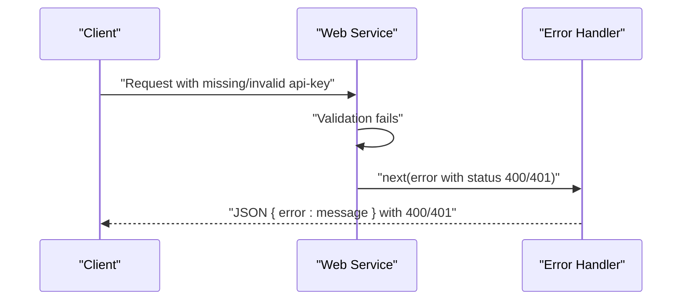
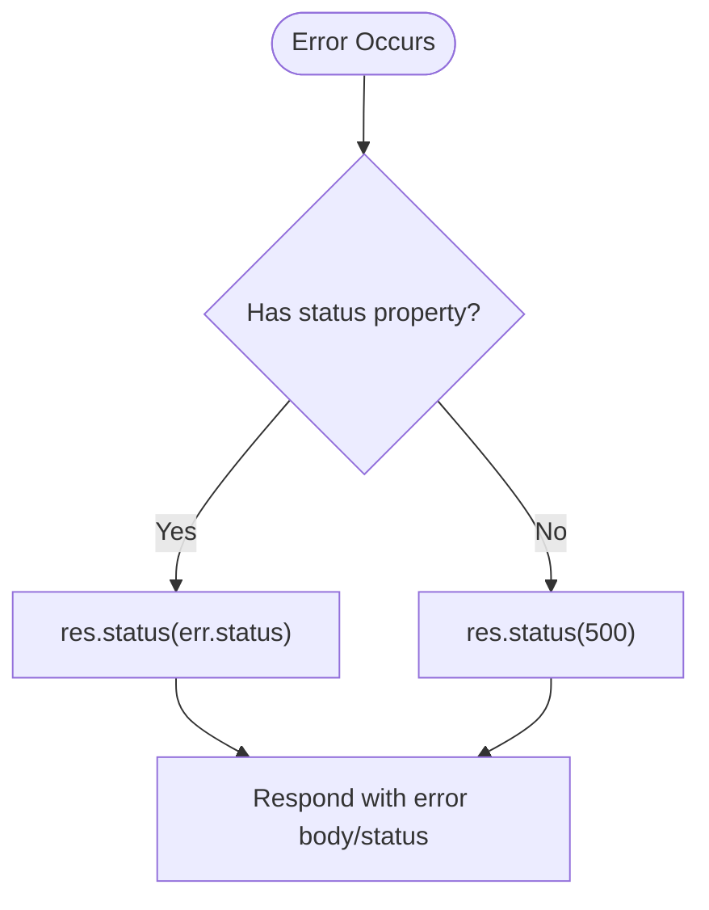
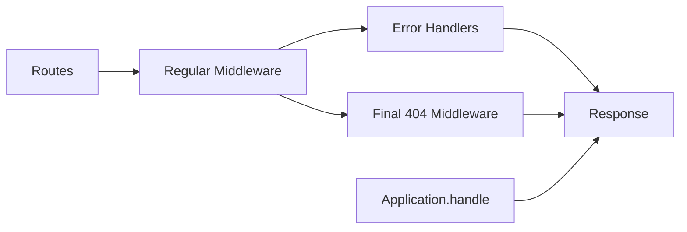

# Error Response Handling

<cite>
**Referenced Files in This Document**
- [examples/error/index.js](file://examples/error/index.js)
- [examples/error-pages/index.js](file://examples/error-pages/index.js)
- [examples/error-pages/views/404.ejs](file://examples/error-pages/views/404.ejs)
- [examples/error-pages/views/500.ejs](file://examples/error-pages/views/500.ejs)
- [examples/error-pages/views/error_header.ejs](file://examples/error-pages/views/error_header.ejs)
- [examples/error-pages/views/footer.ejs](file://examples/error-pages/views/footer.ejs)
- [examples/mvc/views/404.ejs](file://examples/mvc/views/404.ejs)
- [examples/mvc/views/5xx.ejs](file://examples/mvc/views/5xx.ejs)
- [examples/web-service/index.js](file://examples/web-service/index.js)
- [examples/content-negotiation/index.js](file://examples/content-negotiation/index.js)
- [lib/application.js](file://lib/application.js)
- [lib/response.js](file://lib/response.js)
- [test/acceptance/error.js](file://test/acceptance/error.js)
- [test/acceptance/error-pages.js](file://test/acceptance/error-pages.js)
- [test/express.json.js](file://test/express.json.js)
- [test/res.format.js](file://test/res.format.js)
</cite>

## Table of Contents
1. [Introduction](#introduction)
2. [Project Structure](#project-structure)
3. [Core Components](#core-components)
4. [Architecture Overview](#architecture-overview)
5. [Detailed Component Analysis](#detailed-component-analysis)
6. [Dependency Analysis](#dependency-analysis)
7. [Performance Considerations](#performance-considerations)
8. [Troubleshooting Guide](#troubleshooting-guide)
9. [Conclusion](#conclusion)
10. [Appendices](#appendices)

## Introduction
This document explains how Express.js handles and delivers error responses across different scenarios. It covers:
- Conditional error handling based on request types (HTML vs JSON)
- Error response status codes and strategies for 404, 500, and validation-style errors
- Error page rendering with templates and API error response formats
- Practical examples of templates and JSON error responses
- Error response customization, caching, security considerations, and graceful degradation

## Project Structure
The repository includes focused examples demonstrating error handling patterns:
- A minimal error handler example
- A comprehensive HTML/JSON error pages example with EJS templates
- MVC-style error templates
- A web service example with JSON-only error responses
- Content negotiation examples for Accept-driven responses
- Tests validating error and content negotiation behavior

**Diagram sources**
- [examples/error/index.js:1-54](file://examples/error/index.js#L1-L54)
- [examples/error-pages/index.js:1-104](file://examples/error-pages/index.js#L1-L104)
- [examples/mvc/views/404.ejs:1-14](file://examples/mvc/views/404.ejs#L1-L14)
- [examples/mvc/views/5xx.ejs:1-14](file://examples/mvc/views/5xx.ejs#L1-L14)
- [examples/web-service/index.js:1-118](file://examples/web-service/index.js#L1-L118)
- [examples/content-negotiation/index.js:1-47](file://examples/content-negotiation/index.js#L1-L47)
- [lib/application.js:152-178](file://lib/application.js#L152-L178)
- [lib/response.js:64-76](file://lib/response.js#L64-L76)
- [test/acceptance/error.js:1-30](file://test/acceptance/error.js#L1-L30)
- [test/acceptance/error-pages.js:1-100](file://test/acceptance/error-pages.js#L1-L100)
- [test/express.json.js:92-130](file://test/express.json.js#L92-L130)
- [test/res.format.js:159-209](file://test/res.format.js#L159-L209)

**Section sources**
- [examples/error/index.js:1-54](file://examples/error/index.js#L1-L54)
- [examples/error-pages/index.js:1-104](file://examples/error-pages/index.js#L1-L104)
- [examples/mvc/views/404.ejs:1-14](file://examples/mvc/views/404.ejs#L1-L14)
- [examples/mvc/views/5xx.ejs:1-14](file://examples/mvc/views/5xx.ejs#L1-L14)
- [examples/web-service/index.js:1-118](file://examples/web-service/index.js#L1-L118)
- [examples/content-negotiation/index.js:1-47](file://examples/content-negotiation/index.js#L1-L47)
- [lib/application.js:152-178](file://lib/application.js#L152-L178)
- [lib/response.js:64-76](file://lib/response.js#L64-L76)
- [test/acceptance/error.js:1-30](file://test/acceptance/error.js#L1-L30)
- [test/acceptance/error-pages.js:1-100](file://test/acceptance/error-pages.js#L1-L100)
- [test/express.json.js:92-130](file://test/express.json.js#L92-L130)
- [test/res.format.js:159-209](file://test/res.format.js#L159-L209)

## Core Components
- Error handling middleware signature and placement
  - Error handlers are identified by four arguments and are placed after routes and regular middleware.
  - They receive the error object, request, response, and next.
  - Example: [examples/error/index.js:20-27](file://examples/error/index.js#L20-L27), [examples/error-pages/index.js:91-97](file://examples/error-pages/index.js#L91-L97), [examples/web-service/index.js:98-103](file://examples/web-service/index.js#L98-L103)

- 404 handling with content negotiation
  - A final non-error middleware sets status 404 and responds conditionally based on Accept header.
  - Example: [examples/error-pages/index.js:63-77](file://examples/error-pages/index.js#L63-L77)

- 500 handling with template rendering
  - An error-handling middleware renders an error page, using verbose error settings in templates.
  - Example: [examples/error-pages/index.js:91-97](file://examples/error-pages/index.js#L91-L97), [examples/error-pages/views/500.ejs:1-9](file://examples/error-pages/views/500.ejs#L1-L9)

- Validation and API error responses
  - Validation errors are created with explicit status codes and passed to error handlers.
  - Example: [examples/web-service/index.js:15-19](file://examples/web-service/index.js#L15-L19), [examples/web-service/index.js:30-42](file://examples/web-service/index.js#L30-L42), [examples/web-service/index.js:98-103](file://examples/web-service/index.js#L98-L103)

- Status code enforcement
  - Response status method validates integer status codes within 100–999.
  - Example: [lib/response.js:64-76](file://lib/response.js#L64-L76)

**Section sources**
- [examples/error/index.js:20-27](file://examples/error/index.js#L20-L27)
- [examples/error-pages/index.js:63-77](file://examples/error-pages/index.js#L63-L77)
- [examples/error-pages/index.js:91-97](file://examples/error-pages/index.js#L91-L97)
- [examples/web-service/index.js:15-19](file://examples/web-service/index.js#L15-L19)
- [examples/web-service/index.js:30-42](file://examples/web-service/index.js#L30-L42)
- [examples/web-service/index.js:98-103](file://examples/web-service/index.js#L98-L103)
- [lib/response.js:64-76](file://lib/response.js#L64-L76)

## Architecture Overview
The error handling pipeline integrates request routing, middleware execution, and final error responders. The application delegates to a default final handler when no middleware responds, ensuring consistent error behavior.

**Diagram sources**
- [lib/application.js:152-178](file://lib/application.js#L152-L178)
- [examples/error-pages/index.js:63-77](file://examples/error-pages/index.js#L63-L77)
- [examples/error-pages/index.js:91-97](file://examples/error-pages/index.js#L91-L97)

## Detailed Component Analysis

### Conditional Error Handling (HTML vs JSON)
- Accept header negotiation
  - The 404 handler uses content negotiation to choose HTML, JSON, or plain text responses.
  - Example: [examples/error-pages/index.js:66-76](file://examples/error-pages/index.js#L66-L76)
- Validation and API errors
  - Web service example demonstrates JSON error responses for API key validation failures.
  - Example: [examples/web-service/index.js:30-42](file://examples/web-service/index.js#L30-L42), [examples/web-service/index.js:98-103](file://examples/web-service/index.js#L98-L103)

**Diagram sources**
- [examples/error-pages/index.js:63-77](file://examples/error-pages/index.js#L63-L77)
- [examples/error-pages/index.js:91-97](file://examples/error-pages/index.js#L91-L97)
- [examples/web-service/index.js:98-103](file://examples/web-service/index.js#L98-L103)

**Section sources**
- [examples/error-pages/index.js:63-77](file://examples/error-pages/index.js#L63-L77)
- [examples/web-service/index.js:30-42](file://examples/web-service/index.js#L30-L42)
- [examples/web-service/index.js:98-103](file://examples/web-service/index.js#L98-L103)

### Error Page Rendering with Templates
- Template composition
  - Error pages reuse partials for header and footer.
  - Example: [examples/error-pages/views/404.ejs:1-4](file://examples/error-pages/views/404.ejs#L1-L4), [examples/error-pages/views/error_header.ejs:1-11](file://examples/error-pages/views/error_header.ejs#L1-L11), [examples/error-pages/views/footer.ejs:1-3](file://examples/error-pages/views/footer.ejs#L1-L3)
- Verbose vs concise error messages
  - The 500 template conditionally displays stack traces based on a verbose errors setting.
  - Example: [examples/error-pages/views/500.ejs:1-9](file://examples/error-pages/views/500.ejs#L1-L9)
- MVC-style error pages
  - Minimal HTML templates for 404 and 5xx in MVC example.
  - Example: [examples/mvc/views/404.ejs:1-14](file://examples/mvc/views/404.ejs#L1-L14), [examples/mvc/views/5xx.ejs:1-14](file://examples/mvc/views/5xx.ejs#L1-L14)

**Diagram sources**
- [examples/error-pages/views/404.ejs:1-4](file://examples/error-pages/views/404.ejs#L1-L4)
- [examples/error-pages/views/500.ejs:1-9](file://examples/error-pages/views/500.ejs#L1-L9)
- [examples/error-pages/views/error_header.ejs:1-11](file://examples/error-pages/views/error_header.ejs#L1-L11)
- [examples/error-pages/views/footer.ejs:1-3](file://examples/error-pages/views/footer.ejs#L1-L3)

**Section sources**
- [examples/error-pages/views/404.ejs:1-4](file://examples/error-pages/views/404.ejs#L1-L4)
- [examples/error-pages/views/500.ejs:1-9](file://examples/error-pages/views/500.ejs#L1-L9)
- [examples/error-pages/views/error_header.ejs:1-11](file://examples/error-pages/views/error_header.ejs#L1-L11)
- [examples/error-pages/views/footer.ejs:1-3](file://examples/error-pages/views/footer.ejs#L1-L3)
- [examples/mvc/views/404.ejs:1-14](file://examples/mvc/views/404.ejs#L1-L14)
- [examples/mvc/views/5xx.ejs:1-14](file://examples/mvc/views/5xx.ejs#L1-L14)

### API Error Response Formats
- JSON error responses
  - Error handlers send structured JSON bodies for API clients.
  - Example: [examples/web-service/index.js:101-102](file://examples/web-service/index.js#L101-L102), [examples/error-pages/index.js:70-71](file://examples/error-pages/index.js#L70-L71)
- Validation error creation
  - Validation errors are constructed with explicit status codes and messages.
  - Example: [examples/web-service/index.js:15-19](file://examples/web-service/index.js#L15-L19)

**Diagram sources**
- [examples/web-service/index.js:15-19](file://examples/web-service/index.js#L15-L19)
- [examples/web-service/index.js:30-42](file://examples/web-service/index.js#L30-L42)
- [examples/web-service/index.js:98-103](file://examples/web-service/index.js#L98-L103)

**Section sources**
- [examples/web-service/index.js:15-19](file://examples/web-service/index.js#L15-L19)
- [examples/web-service/index.js:30-42](file://examples/web-service/index.js#L30-L42)
- [examples/web-service/index.js:98-103](file://examples/web-service/index.js#L98-L103)
- [examples/error-pages/index.js:70-71](file://examples/error-pages/index.js#L70-L71)

### Error Response Status Codes
- Explicit status assignment
  - Error handlers set status codes from error objects or default to 500.
  - Example: [examples/error-pages/index.js:95](file://examples/error-pages/index.js#L95), [examples/web-service/index.js:101](file://examples/web-service/index.js#L101)
- Validation-specific codes
  - Validation failures set 400/401 depending on the issue.
  - Example: [examples/web-service/index.js:34](file://examples/web-service/index.js#L34), [examples/web-service/index.js:37](file://examples/web-service/index.js#L37)
- JSON parsing and entity errors
  - Tests demonstrate 400 for malformed JSON and 413 for oversized requests.
  - Example: [test/express.json.js:92-130](file://test/express.json.js#L92-L130)

**Diagram sources**
- [examples/error-pages/index.js:95](file://examples/error-pages/index.js#L95)
- [examples/web-service/index.js:101](file://examples/web-service/index.js#L101)
- [test/express.json.js:92-130](file://test/express.json.js#L92-L130)

**Section sources**
- [examples/error-pages/index.js:95](file://examples/error-pages/index.js#L95)
- [examples/web-service/index.js:101](file://examples/web-service/index.js#L101)
- [test/express.json.js:92-130](file://test/express.json.js#L92-L130)

### Error Message Localization
- Template-driven messages
  - Error templates render localized messages for users (e.g., “Not found”, “An error occurred!”).
  - Example: [examples/error-pages/views/404.ejs:2](file://examples/error-pages/views/404.ejs#L2), [examples/error-pages/views/500.ejs:6](file://examples/error-pages/views/500.ejs#L6)
- Structured JSON messages
  - API error responses include machine-readable error fields.
  - Example: [examples/web-service/index.js:102](file://examples/web-service/index.js#L102)

**Section sources**
- [examples/error-pages/views/404.ejs:2](file://examples/error-pages/views/404.ejs#L2)
- [examples/error-pages/views/500.ejs:6](file://examples/error-pages/views/500.ejs#L6)
- [examples/web-service/index.js:102](file://examples/web-service/index.js#L102)

### Error Response Customization
- Custom 404 middleware
  - A dedicated middleware sets 404 and selects response format.
  - Example: [examples/error-pages/index.js:63-77](file://examples/error-pages/index.js#L63-L77)
- Custom error handler
  - Renders error pages or sends JSON depending on context.
  - Example: [examples/error-pages/index.js:91-97](file://examples/error-pages/index.js#L91-L97), [examples/web-service/index.js:98-103](file://examples/web-service/index.js#L98-L103)
- Content negotiation middleware
  - Declarative mapping of response formats.
  - Example: [examples/content-negotiation/index.js:9-27](file://examples/content-negotiation/index.js#L9-L27)

**Section sources**
- [examples/error-pages/index.js:63-77](file://examples/error-pages/index.js#L63-L77)
- [examples/error-pages/index.js:91-97](file://examples/error-pages/index.js#L91-L97)
- [examples/web-service/index.js:98-103](file://examples/web-service/index.js#L98-L103)
- [examples/content-negotiation/index.js:9-27](file://examples/content-negotiation/index.js#L9-L27)

### Error Response Caching
- ETag generation and freshness
  - Response.send generates ETags when configured and honors If-None-Match for 304 Not Modified.
  - Example: [lib/response.js:161-162](file://lib/response.js#L161-L162), [lib/response.js:183-189](file://lib/response.js#L183-L189), [lib/response.js:191-192](file://lib/response.js#L191-L192)
- View caching in production
  - Application enables view cache in production by default.
  - Example: [lib/application.js:138-140](file://lib/application.js#L138-L140)

**Section sources**
- [lib/response.js:161-162](file://lib/response.js#L161-L162)
- [lib/response.js:183-189](file://lib/response.js#L183-L189)
- [lib/response.js:191-192](file://lib/response.js#L191-L192)
- [lib/application.js:138-140](file://lib/application.js#L138-L140)

### Security Considerations for Error Messages
- Verbose error toggles
  - Verbose error messages (including stack traces) are controlled via application settings and disabled in production.
  - Example: [examples/error-pages/index.js:17-24](file://examples/error-pages/index.js#L17-L24), [examples/error-pages/views/500.ejs:3-7](file://examples/error-pages/views/500.ejs#L3-L7)
- Sanitization and escaping
  - Response.send escapes HTML by default for string payloads.
  - Example: [lib/response.js:133-144](file://lib/response.js#L133-L144)

**Section sources**
- [examples/error-pages/index.js:17-24](file://examples/error-pages/index.js#L17-L24)
- [examples/error-pages/views/500.ejs:3-7](file://examples/error-pages/views/500.ejs#L3-L7)
- [lib/response.js:133-144](file://lib/response.js#L133-L144)

### Graceful Degradation Strategies
- Accept header-driven responses
  - Clients receive HTML for browsers, JSON for APIs, and plain text as a fallback.
  - Example: [examples/error-pages/index.js:66-76](file://examples/error-pages/index.js#L66-L76)
- Default content type selection
  - Tests demonstrate default content negotiation and charset handling.
  - Example: [test/res.format.js:182-209](file://test/res.format.js#L182-L209)

**Section sources**
- [examples/error-pages/index.js:66-76](file://examples/error-pages/index.js#L66-L76)
- [test/res.format.js:182-209](file://test/res.format.js#L182-L209)

## Dependency Analysis
- Middleware ordering
  - Error handlers must come after routes and regular middleware to catch propagated errors.
  - Example: [examples/error/index.js:47](file://examples/error/index.js#L47)
- Final handler integration
  - Application.handle delegates unhandled errors to a final handler.
  - Example: [lib/application.js:152-157](file://lib/application.js#L152-L157)

**Diagram sources**
- [examples/error/index.js:47](file://examples/error/index.js#L47)
- [lib/application.js:152-157](file://lib/application.js#L152-L157)

**Section sources**
- [examples/error/index.js:47](file://examples/error/index.js#L47)
- [lib/application.js:152-157](file://lib/application.js#L152-L157)

## Performance Considerations
- Minimizing error payload size
  - Prefer concise JSON error bodies for API clients.
  - Example: [examples/web-service/index.js:102](file://examples/web-service/index.js#L102)
- Efficient content negotiation
  - Use res.format to avoid branching logic in route handlers.
  - Example: [examples/error-pages/index.js:66-76](file://examples/error-pages/index.js#L66-L76)
- View caching
  - Enable view cache in production to reduce template compilation overhead.
  - Example: [lib/application.js:138-140](file://lib/application.js#L138-L140)

[No sources needed since this section provides general guidance]

## Troubleshooting Guide
- 404 not found responses
  - Verify the final 404 middleware is registered last and content-negotiation matches client Accept header.
  - Example: [examples/error-pages/index.js:63-77](file://examples/error-pages/index.js#L63-L77)
- 500 internal server errors
  - Ensure error handlers are placed after routes and that verbose errors are disabled in production.
  - Example: [examples/error-pages/index.js:91-97](file://examples/error-pages/index.js#L91-L97), [examples/error-pages/index.js:22-24](file://examples/error-pages/index.js#L22-L24)
- JSON parsing errors
  - Confirm request content type and body validity; tests show 400 for malformed JSON and 413 for oversized payloads.
  - Example: [test/express.json.js:92-130](file://test/express.json.js#L92-L130)
- Accept header mismatches
  - Validate Accept header values and fallback behavior in content negotiation.
  - Example: [test/acceptance/error-pages.js:14-98](file://test/acceptance/error-pages.js#L14-L98), [test/res.format.js:182-209](file://test/res.format.js#L182-L209)

**Section sources**
- [examples/error-pages/index.js:63-77](file://examples/error-pages/index.js#L63-L77)
- [examples/error-pages/index.js:91-97](file://examples/error-pages/index.js#L91-L97)
- [examples/error-pages/index.js:22-24](file://examples/error-pages/index.js#L22-L24)
- [test/express.json.js:92-130](file://test/express.json.js#L92-L130)
- [test/acceptance/error-pages.js:14-98](file://test/acceptance/error-pages.js#L14-L98)
- [test/res.format.js:182-209](file://test/res.format.js#L182-L209)

## Conclusion
Express provides a flexible, layered approach to error handling:
- Use content negotiation to deliver appropriate responses for HTML and JSON clients
- Employ explicit status codes and structured JSON for API errors
- Render user-friendly error pages with templates and toggle verbosity based on environment
- Leverage caching and sanitization to optimize performance and security
- Validate error handling with targeted tests to ensure consistent behavior across clients

[No sources needed since this section summarizes without analyzing specific files]

## Appendices
- Practical examples
  - HTML 404 template: [examples/error-pages/views/404.ejs:1-4](file://examples/error-pages/views/404.ejs#L1-L4)
  - HTML 500 template: [examples/error-pages/views/500.ejs:1-9](file://examples/error-pages/views/500.ejs#L1-L9)
  - JSON 404 response: [examples/error-pages/index.js:70-71](file://examples/error-pages/index.js#L70-L71)
  - JSON validation error: [examples/web-service/index.js:102](file://examples/web-service/index.js#L102)
  - Status code enforcement: [lib/response.js:64-76](file://lib/response.js#L64-L76)

[No sources needed since this section lists references already cited above]