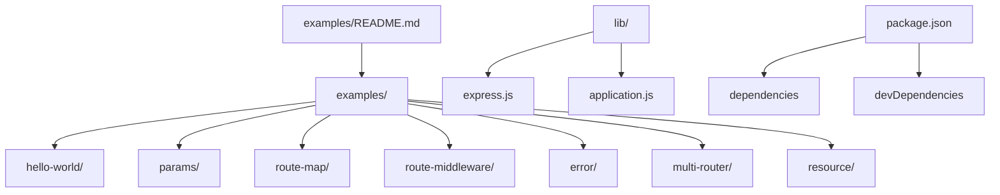
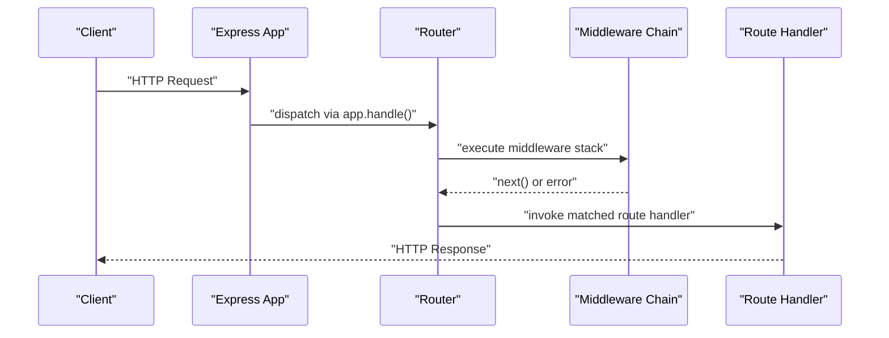
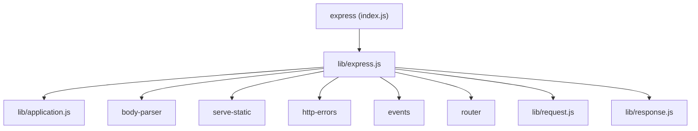

# Basic Examples

<cite>
**Referenced Files in This Document**
- [hello-world/index.js](file://examples/hello-world/index.js)
- [params/index.js](file://examples/params/index.js)
- [route-map/index.js](file://examples/route-map/index.js)
- [route-middleware/index.js](file://examples/route-middleware/index.js)
- [error/index.js](file://examples/error/index.js)
- [multi-router/index.js](file://examples/multi-router/index.js)
- [resource/index.js](file://examples/resource/index.js)
- [lib/express.js](file://lib/express.js)
- [lib/application.js](file://lib/application.js)
- [package.json](file://package.json)
- [examples/README.md](file://examples/README.md)
- [test/acceptance/hello-world.js](file://test/acceptance/hello-world.js)
- [test/acceptance/params.js](file://test/acceptance/params.js)
</cite>

## Table of Contents
1. [Introduction](#introduction)
2. [Project Structure](#project-structure)
3. [Core Components](#core-components)
4. [Architecture Overview](#architecture-overview)
5. [Detailed Component Analysis](#detailed-component-analysis)
6. [Dependency Analysis](#dependency-analysis)
7. [Performance Considerations](#performance-considerations)
8. [Troubleshooting Guide](#troubleshooting-guide)
9. [Conclusion](#conclusion)
10. [Appendices](#appendices)

## Introduction
This document presents Express.js basic examples that demonstrate fundamental concepts and core functionality. It focuses on:
- Hello World application
- Parameter handling
- Route mapping
- Middleware implementation

For each example, you will find step-by-step implementation walkthroughs, explanations of underlying concepts, and practical exercises to modify and extend the examples. You will also learn proper code organization, error handling, and debugging techniques using these foundational examples.

## Project Structure
The repository organizes examples under the examples directory, each demonstrating a specific concept. The core Express library is implemented under lib, and tests under test validate behavior.

**Diagram sources**
- [examples/README.md:1-30](file://examples/README.md#L1-L30)
- [package.json:1-100](file://package.json#L1-L100)

**Section sources**
- [examples/README.md:1-30](file://examples/README.md#L1-L30)
- [package.json:1-100](file://package.json#L1-L100)

## Core Components
This section introduces the building blocks demonstrated by the basic examples:
- Application creation and server startup
- Route registration for HTTP methods
- Request parameter extraction
- Middleware chain execution
- Error handling middleware

Key implementation references:
- Application creation and server startup: [hello-world/index.js:1-16](file://examples/hello-world/index.js#L1-L16), [params/index.js:1-75](file://examples/params/index.js#L1-L75)
- Route registration and HTTP methods: [route-map/index.js:1-76](file://examples/route-map/index.js#L1-L76), [resource/index.js:1-96](file://examples/resource/index.js#L1-L96)
- Parameter handling: [params/index.js:21-41](file://examples/params/index.js#L21-L41)
- Middleware chain: [route-middleware/index.js:25-68](file://examples/route-middleware/index.js#L25-L68), [error/index.js:20-27](file://examples/error/index.js#L20-L27)
- Library bootstrap: [lib/express.js:36-56](file://lib/express.js#L36-L56), [lib/application.js:59-83](file://lib/application.js#L59-L83)

**Section sources**
- [hello-world/index.js:1-16](file://examples/hello-world/index.js#L1-L16)
- [params/index.js:1-75](file://examples/params/index.js#L1-L75)
- [route-map/index.js:1-76](file://examples/route-map/index.js#L1-L76)
- [route-middleware/index.js:1-91](file://examples/route-middleware/index.js#L1-L91)
- [error/index.js:1-54](file://examples/error/index.js#L1-L54)
- [resource/index.js:1-96](file://examples/resource/index.js#L1-L96)
- [lib/express.js:36-56](file://lib/express.js#L36-L56)
- [lib/application.js:59-83](file://lib/application.js#L59-L83)

## Architecture Overview
Express applications are created via a factory function that returns an application object. This object extends functionality by mixing in request and response prototypes and initializes a router lazily. The application’s request handling pipeline delegates to the router, which dispatches requests to registered routes and middleware.

**Diagram sources**
- [lib/express.js:36-56](file://lib/express.js#L36-L56)
- [lib/application.js:152-178](file://lib/application.js#L152-L178)

**Section sources**
- [lib/express.js:36-56](file://lib/express.js#L36-L56)
- [lib/application.js:59-83](file://lib/application.js#L59-L83)
- [lib/application.js:152-178](file://lib/application.js#L152-L178)

## Detailed Component Analysis

### Hello World Application
Purpose:
- Demonstrate minimal Express application setup and serving a simple response.

Step-by-step:
1. Require the Express module and create an application instance.
2. Register a GET route at the root path that sends a plain text response.
3. Conditionally start the server when the script runs directly.

Key concepts:
- Application instance creation
- Route registration for HTTP GET
- Server startup and logging

Practical exercises:
- Change the response body to include dynamic content.
- Add another route for a different HTTP method.
- Modify the port number and environment-dependent startup.

Validation:
- Acceptance test verifies the root route returns the expected response and missing routes return 404.

**Section sources**
- [hello-world/index.js:1-16](file://examples/hello-world/index.js#L1-L16)
- [test/acceptance/hello-world.js:1-22](file://test/acceptance/hello-world.js#L1-L22)

### Parameter Handling
Purpose:
- Show how to extract and transform route parameters and implement parameter pre-processing.

Step-by-step:
1. Define parameter preprocessors using app.param() to convert string parameters to integers and load resources by ID.
2. Register routes that consume the processed parameters.
3. Use error helpers to signal invalid inputs or missing resources.

Key concepts:
- Parameter preprocessing with app.param()
- Type conversion and validation
- Resource loading and error propagation

Practical exercises:
- Extend parameter preprocessors to validate numeric ranges.
- Add a new parameter type (e.g., UUID) and corresponding preprocessor.
- Introduce nested parameters and combine multiple preprocessors.

Validation:
- Acceptance tests verify correct user retrieval, slicing ranges, and error responses for invalid inputs.

**Section sources**
- [params/index.js:1-75](file://examples/params/index.js#L1-L75)
- [test/acceptance/params.js:1-45](file://test/acceptance/params.js#L1-L45)

### Route Mapping
Purpose:
- Demonstrate organizing routes using a compact mapping function that reflects nested objects into route registrations.

Step-by-step:
1. Implement a recursive map function that traverses an object tree of route handlers.
2. For each HTTP method key, register the corresponding route with the accumulated path.
3. Register multiple nested routes and verify via console logs in verbose mode.

Key concepts:
- Route reflection via object mapping
- Nested route grouping
- Path composition

Practical exercises:
- Add support for additional HTTP methods in the mapping function.
- Introduce middleware hooks per route group.
- Generate documentation from the route map.

**Section sources**
- [route-map/index.js:1-76](file://examples/route-map/index.js#L1-L76)

### Middleware Implementation
Purpose:
- Show how to build reusable middleware for authentication, authorization, and request enrichment.

Step-by-step:
1. Create middleware to enrich the request with an authenticated user.
2. Build specialized middleware to restrict access to self or roles.
3. Register middleware globally and per-route to enforce policies.
4. Compose middleware with route handlers to implement controlled access.

Key concepts:
- Middleware signature and chaining
- Request enrichment and policy enforcement
- Route-specific middleware composition

Practical exercises:
- Add logging middleware to track request lifecycle.
- Implement rate limiting middleware.
- Replace placeholder users with database-backed user lookup.

**Section sources**
- [route-middleware/index.js:1-91](file://examples/route-middleware/index.js#L1-L91)

### Error Handling
Purpose:
- Demonstrate error handling middleware and throwing errors from route handlers.

Step-by-step:
1. Register an error-handling middleware with four arguments to catch thrown errors and async errors passed via next().
2. Throw synchronous errors from a route handler.
3. Pass asynchronous errors using next() inside callbacks.
4. Place error middleware after all routes to ensure it receives unhandled errors.

Key concepts:
- Error middleware signature
- Throwing and passing errors
- Order of middleware registration

Practical exercises:
- Log structured errors with metadata.
- Implement environment-aware error responses.
- Add custom error classes for specific failure modes.

**Section sources**
- [error/index.js:1-54](file://examples/error/index.js#L1-L54)

### Multi-Router and Resource Patterns
Purpose:
- Show how to mount separate routers under different paths and define convenience methods for resourceful routes.

Step-by-step:
1. Mount separate router modules under distinct base paths.
2. Define a resource helper that registers multiple HTTP methods for a given path.
3. Use the helper to implement CRUD-like endpoints with range and format support.

Key concepts:
- Router mounting and separation of concerns
- Resourceful routing helpers
- Route composition and reuse

Practical exercises:
- Add PATCH and PUT methods via the resource helper.
- Integrate validation middleware into resource routes.
- Separate controllers into individual modules and mount them under different prefixes.

**Section sources**
- [multi-router/index.js:1-19](file://examples/multi-router/index.js#L1-L19)
- [resource/index.js:1-96](file://examples/resource/index.js#L1-L96)

## Dependency Analysis
Express depends on a set of middleware and utilities to provide robust HTTP handling. Understanding these dependencies helps explain built-in capabilities like JSON parsing, static file serving, and error handling.

**Diagram sources**
- [index.js:1-12](file://index.js#L1-L12)
- [lib/express.js:15-82](file://lib/express.js#L15-L82)

**Section sources**
- [package.json:34-62](file://package.json#L34-L62)
- [lib/express.js:15-82](file://lib/express.js#L15-L82)

## Performance Considerations
- Keep middleware lean and avoid heavy synchronous operations in the hot path.
- Use appropriate caching headers and leverage static file serving middleware for assets.
- Minimize object allocations in frequently executed middleware.
- Prefer early exits and guard clauses to reduce branching complexity.
- Use environment-specific configurations (e.g., enabling production features) to optimize behavior.

## Troubleshooting Guide
Common beginner mistakes and fixes:
- Forgetting to call next() in middleware leads to stalled requests. Ensure every middleware either calls next() or terminates the request.
- Incorrect order of middleware registration can prevent error handlers from catching errors. Place error middleware after all routes.
- Using synchronous blocking operations in middleware impacts throughput. Move blocking tasks to asynchronous patterns.
- Not handling invalid parameters causes runtime errors. Validate and sanitize parameters in app.param() or route handlers.
- Misplacing server startup logic prevents tests from importing the app. Guard server startup behind module.parent checks.

Debugging techniques:
- Use verbose logging during development to trace middleware execution and route resolution.
- Leverage assertion libraries and automated tests to validate expected responses and error codes.
- Inspect request and response objects to confirm middleware transformations and route parameter availability.

**Section sources**
- [error/index.js:20-27](file://examples/error/index.js#L20-L27)
- [route-middleware/index.js:25-68](file://examples/route-middleware/index.js#L25-L68)
- [params/index.js:21-41](file://examples/params/index.js#L21-L41)
- [test/acceptance/hello-world.js:1-22](file://test/acceptance/hello-world.js#L1-L22)
- [test/acceptance/params.js:1-45](file://test/acceptance/params.js#L1-L45)

## Conclusion
These basic examples illustrate the core mechanics of Express: application creation, route registration, parameter handling, middleware composition, and error management. By studying and extending these examples, you gain a solid foundation for building scalable web applications with Express.

## Appendices
- Example catalog and descriptions: [examples/README.md:1-30](file://examples/README.md#L1-L30)
- Acceptance tests for Hello World and Params: [test/acceptance/hello-world.js:1-22](file://test/acceptance/hello-world.js#L1-L22), [test/acceptance/params.js:1-45](file://test/acceptance/params.js#L1-L45)