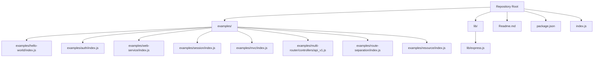
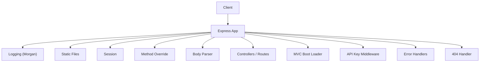
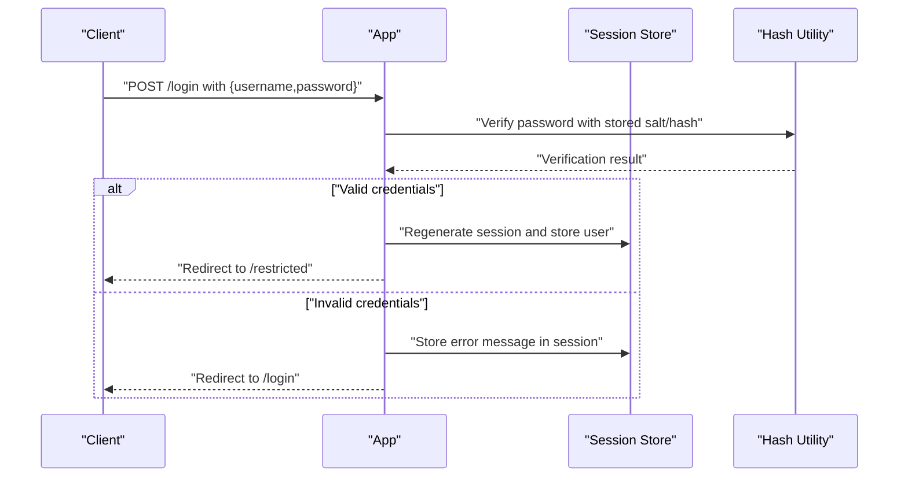
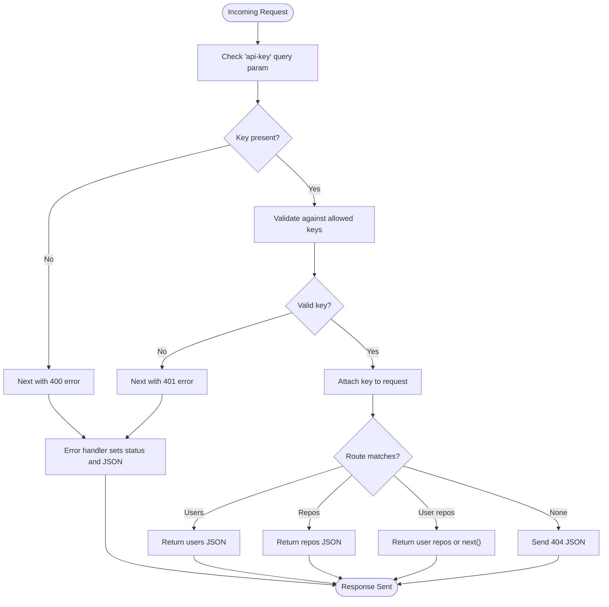
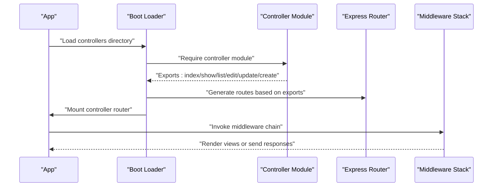
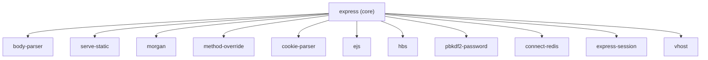

# Examples & Tutorials

<cite>
**Referenced Files in This Document**
- [examples/README.md](file://examples/README.md)
- [Readme.md](file://Readme.md)
- [package.json](file://package.json)
- [index.js](file://index.js)
- [lib/express.js](file://lib/express.js)
- [examples/hello-world/index.js](file://examples/hello-world/index.js)
- [examples/auth/index.js](file://examples/auth/index.js)
- [examples/web-service/index.js](file://examples/web-service/index.js)
- [examples/session/index.js](file://examples/session/index.js)
- [examples/mvc/index.js](file://examples/mvc/index.js)
- [examples/mvc/lib/boot.js](file://examples/mvc/lib/boot.js)
- [examples/multi-router/controllers/api_v1.js](file://examples/multi-router/controllers/api_v1.js)
- [examples/multi-router/controllers/api_v2.js](file://examples/multi-router/controllers/api_v2.js)
- [examples/route-separation/index.js](file://examples/route-separation/index.js)
- [examples/resource/index.js](file://examples/resource/index.js)
</cite>

## Table of Contents
1. [Introduction](#introduction)
2. [Project Structure](#project-structure)
3. [Core Components](#core-components)
4. [Architecture Overview](#architecture-overview)
5. [Detailed Component Analysis](#detailed-component-analysis)
6. [Dependency Analysis](#dependency-analysis)
7. [Performance Considerations](#performance-considerations)
8. [Troubleshooting Guide](#troubleshooting-guide)
9. [Conclusion](#conclusion)
10. [Appendices](#appendices)

## Introduction
This document presents a comprehensive guide to Express.js examples and tutorials, focusing on practical implementation patterns and real-world application development. It covers a broad spectrum from basic “hello world” applications to advanced architectures such as MVC-style controllers, multi-router setups, and API services with authentication and session management. Each example is explained with step-by-step tutorials, integration notes with popular libraries, best practices, and troubleshooting tips. The goal is to enable developers to progress from simple applications to complex, enterprise-grade implementations using proven patterns and working code references.

## Project Structure
The repository organizes examples under the examples directory, each demonstrating a specific Express feature or pattern. The top-level Readme provides quick-start guidance and installation steps. The core Express library is exposed via index.js and lib/express.js, which creates the application instance and exposes middleware and router constructors.

**Diagram sources**
- [Readme.md:127-146](file://Readme.md#L127-L146)
- [index.js:11](file://index.js#L11)
- [lib/express.js:27-56](file://lib/express.js#L27-L56)

**Section sources**
- [examples/README.md:1-30](file://examples/README.md#L1-L30)
- [Readme.md:127-146](file://Readme.md#L127-L146)

## Core Components
This section highlights the foundational building blocks demonstrated across the examples and how they relate to Express internals.

- Application creation and middleware exposure
  - Express creates an application callable function and mixes in event emitter and request/response prototypes. It also exposes middleware constructors such as json, raw, text, urlencoded, and static.
  - References:
    - [lib/express.js:36-56](file://lib/express.js#L36-L56)
    - [lib/express.js:77-82](file://lib/express.js#L77-L82)

- Basic request handling
  - Simple GET handlers demonstrate minimal server setup and response sending.
  - References:
    - [examples/hello-world/index.js:7-9](file://examples/hello-world/index.js#L7-L9)

- Authentication and sessions
  - Authentication with hashed passwords and session-based login/logout flows.
  - References:
    - [examples/auth/index.js:104-128](file://examples/auth/index.js#L104-L128)
    - [examples/auth/index.js:75-82](file://examples/auth/index.js#L75-L82)

- Web service and API key validation
  - API key middleware mounted at a route prefix, route handlers returning JSON, and centralized error handling.
  - References:
    - [examples/web-service/index.js:30-42](file://examples/web-service/index.js#L30-L42)
    - [examples/web-service/index.js:75-91](file://examples/web-service/index.js#L75-L91)
    - [examples/web-service/index.js:98-111](file://examples/web-service/index.js#L98-L111)

- Sessions with in-memory storage
  - Demonstrates session counters and session regeneration for security.
  - References:
    - [examples/session/index.js:16-20](file://examples/session/index.js#L16-L20)
    - [examples/session/index.js:22-31](file://examples/session/index.js#L22-L31)

- MVC-style controllers and dynamic route bootstrapping
  - Centralized middleware, static serving, session, method override, and dynamic controller loading with automatic route generation.
  - References:
    - [examples/mvc/index.js:34-50](file://examples/mvc/index.js#L34-L50)
    - [examples/mvc/index.js:76](file://examples/mvc/index.js#L76)
    - [examples/mvc/lib/boot.js:32-78](file://examples/mvc/lib/boot.js#L32-L78)

- Multi-router and modular routing
  - Separate routers for API versions mounted under different prefixes.
  - References:
    - [examples/multi-router/controllers/api_v1.js:5-15](file://examples/multi-router/controllers/api_v1.js#L5-L15)
    - [examples/multi-router/controllers/api_v2.js:5-15](file://examples/multi-router/controllers/api_v2.js#L5-L15)

- Route separation and resource-style routing
  - Modular route files and a custom resource method for CRUD-like endpoints.
  - References:
    - [examples/route-separation/index.js:13-15](file://examples/route-separation/index.js#L13-L15)
    - [examples/route-separation/index.js:38-46](file://examples/route-separation/index.js#L38-L46)
    - [examples/resource/index.js:13-26](file://examples/resource/index.js#L13-L26)

**Section sources**
- [lib/express.js:36-82](file://lib/express.js#L36-L82)
- [examples/hello-world/index.js:7-9](file://examples/hello-world/index.js#L7-L9)
- [examples/auth/index.js:75-128](file://examples/auth/index.js#L75-L128)
- [examples/web-service/index.js:30-111](file://examples/web-service/index.js#L30-L111)
- [examples/session/index.js:16-31](file://examples/session/index.js#L16-L31)
- [examples/mvc/index.js:34-89](file://examples/mvc/index.js#L34-L89)
- [examples/mvc/lib/boot.js:32-82](file://examples/mvc/lib/boot.js#L32-L82)
- [examples/multi-router/controllers/api_v1.js:5-15](file://examples/multi-router/controllers/api_v1.js#L5-L15)
- [examples/multi-router/controllers/api_v2.js:5-15](file://examples/multi-router/controllers/api_v2.js#L5-L15)
- [examples/route-separation/index.js:13-46](file://examples/route-separation/index.js#L13-L46)
- [examples/resource/index.js:13-68](file://examples/resource/index.js#L13-L68)

## Architecture Overview
The examples collectively illustrate several architectural patterns:

- Layered middleware pipeline: logging, parsing, static serving, session, method override, and custom middleware.
- Modular routing: separate routers per domain or API version, and dynamic controller bootstrapping.
- Resource-centric routing: a custom resource method to map REST-like endpoints.
- Centralized error handling: error-handling middleware and 404 handling.

**Diagram sources**
- [examples/mvc/index.js:34-89](file://examples/mvc/index.js#L34-L89)
- [examples/web-service/index.js:30-111](file://examples/web-service/index.js#L30-L111)
- [examples/route-separation/index.js:29-32](file://examples/route-separation/index.js#L29-L32)

## Detailed Component Analysis

### Hello World
- Purpose: Minimal server setup and response handling.
- Key steps:
  - Import Express and create an app instance.
  - Define a GET route that sends a simple response.
  - Conditionally listen on a port when executed directly.
- Best practices:
  - Keep the server initialization encapsulated.
  - Use environment-aware port binding in production.
- References:
  - [examples/hello-world/index.js:5-15](file://examples/hello-world/index.js#L5-L15)

**Section sources**
- [examples/hello-world/index.js:5-15](file://examples/hello-world/index.js#L5-L15)

### Authentication System
- Purpose: Demonstrate login/logout with sessions and password hashing.
- Key steps:
  - Configure view engine and views directory.
  - Add body parser and session middleware.
  - Implement a session-persisted message middleware.
  - Create a placeholder user database with hashed credentials.
  - Implement an authenticate function using a password hashing utility.
  - Protect routes with a restriction middleware.
  - Implement login and logout handlers.
- Best practices:
  - Regenerate sessions upon login to prevent fixation attacks.
  - Store only non-sensitive identifiers in sessions.
  - Use HTTPS and secure cookie flags in production.
- References:
  - [examples/auth/index.js:16-26](file://examples/auth/index.js#L16-L26)
  - [examples/auth/index.js:30-39](file://examples/auth/index.js#L30-L39)
  - [examples/auth/index.js:50-73](file://examples/auth/index.js#L50-L73)
  - [examples/auth/index.js:75-82](file://examples/auth/index.js#L75-L82)
  - [examples/auth/index.js:104-128](file://examples/auth/index.js#L104-L128)

**Diagram sources**
- [examples/auth/index.js:50-73](file://examples/auth/index.js#L50-L73)
- [examples/auth/index.js:104-128](file://examples/auth/index.js#L104-L128)

**Section sources**
- [examples/auth/index.js:16-128](file://examples/auth/index.js#L16-L128)

### Web Service with API Keys
- Purpose: Build a simple API with key-based access control and JSON responses.
- Key steps:
  - Mount middleware at a route prefix to validate API keys.
  - Define route handlers for users and repositories.
  - Implement centralized error handling middleware.
  - Implement a 404 handler for unmatched routes.
- Best practices:
  - Use a dedicated API key store and enforce HTTPS.
  - Return structured error responses with appropriate status codes.
- References:
  - [examples/web-service/index.js:30-42](file://examples/web-service/index.js#L30-L42)
  - [examples/web-service/index.js:75-91](file://examples/web-service/index.js#L75-L91)
  - [examples/web-service/index.js:98-111](file://examples/web-service/index.js#L98-L111)

**Diagram sources**
- [examples/web-service/index.js:30-111](file://examples/web-service/index.js#L30-L111)

**Section sources**
- [examples/web-service/index.js:30-111](file://examples/web-service/index.js#L30-L111)

### Sessions
- Purpose: Track visits across browser sessions using in-memory sessions.
- Key steps:
  - Configure session middleware with secret and flags.
  - Increment and render session counters.
- Best practices:
  - Use a scalable session store (e.g., Redis) in production.
  - Set secure, sameSite, and httpOnly flags for cookies.
- References:
  - [examples/session/index.js:16-31](file://examples/session/index.js#L16-L31)

**Section sources**
- [examples/session/index.js:16-31](file://examples/session/index.js#L16-L31)

### MVC Architecture with Dynamic Controllers
- Purpose: Demonstrate an MVC-style layout with dynamic controller bootstrapping.
- Key steps:
  - Configure view engine, static assets, sessions, body parser, and method override.
  - Implement a custom response message method and a messages middleware.
  - Load controllers dynamically and generate routes based on exported methods.
  - Centralized 500 and 404 error handlers.
- Best practices:
  - Keep controllers cohesive and focused on a single responsibility.
  - Use consistent naming conventions for routes and views.
- References:
  - [examples/mvc/index.js:15-89](file://examples/mvc/index.js#L15-L89)
  - [examples/mvc/lib/boot.js:11-82](file://examples/mvc/lib/boot.js#L11-L82)

**Diagram sources**
- [examples/mvc/lib/boot.js:32-78](file://examples/mvc/lib/boot.js#L32-L78)
- [examples/mvc/index.js:76](file://examples/mvc/index.js#L76)

**Section sources**
- [examples/mvc/index.js:15-89](file://examples/mvc/index.js#L15-L89)
- [examples/mvc/lib/boot.js:11-82](file://examples/mvc/lib/boot.js#L11-L82)

### Multi-Router Setup
- Purpose: Organize API endpoints by version using separate routers.
- Key steps:
  - Create distinct routers for API v1 and v2.
  - Export routers for mounting at different prefixes.
- Best practices:
  - Use semantic versioning in route prefixes.
  - Keep each router’s scope narrow and self-contained.
- References:
  - [examples/multi-router/controllers/api_v1.js:5-15](file://examples/multi-router/controllers/api_v1.js#L5-L15)
  - [examples/multi-router/controllers/api_v2.js:5-15](file://examples/multi-router/controllers/api_v2.js#L5-L15)

**Section sources**
- [examples/multi-router/controllers/api_v1.js:5-15](file://examples/multi-router/controllers/api_v1.js#L5-L15)
- [examples/multi-router/controllers/api_v2.js:5-15](file://examples/multi-router/controllers/api_v2.js#L5-L15)

### Route Separation and Modular Routing
- Purpose: Split routes by domain/resource (users, posts) and centralize configuration.
- Key steps:
  - Require modular route handlers.
  - Register routes for users and posts with method-specific handlers.
  - Apply shared middleware (method override, cookie parser, body parser, static).
- Best practices:
  - Group related routes under a single controller file.
  - Use consistent HTTP verbs and URL patterns.
- References:
  - [examples/route-separation/index.js:13-15](file://examples/route-separation/index.js#L13-L15)
  - [examples/route-separation/index.js:38-46](file://examples/route-separation/index.js#L38-L46)
  - [examples/route-separation/index.js:30-32](file://examples/route-separation/index.js#L30-L32)

**Section sources**
- [examples/route-separation/index.js:13-46](file://examples/route-separation/index.js#L13-L46)

### Resource-Style Routing
- Purpose: Provide a compact way to map CRUD-like endpoints for a resource.
- Key steps:
  - Extend the application with a custom resource method.
  - Map index, show, destroy, and range endpoints with format support.
- Best practices:
  - Keep resource methods generic and composable.
  - Validate parameters and return appropriate errors.
- References:
  - [examples/resource/index.js:13-26](file://examples/resource/index.js#L13-L26)
  - [examples/resource/index.js:41-68](file://examples/resource/index.js#L41-L68)

**Section sources**
- [examples/resource/index.js:13-68](file://examples/resource/index.js#L13-L68)

## Dependency Analysis
The examples rely on a combination of Express-provided middleware and external libraries. The package.json lists both runtime and development dependencies, including template engines, logging, sessions, and testing utilities.

**Diagram sources**
- [package.json:34-62](file://package.json#L34-L62)
- [package.json:64-81](file://package.json#L64-L81)

**Section sources**
- [package.json:34-81](file://package.json#L34-L81)

## Performance Considerations
- Prefer streaming for large file downloads and avoid blocking operations in request handlers.
- Use compression middleware for reducing payload sizes.
- Cache static assets and leverage browser caching headers.
- Offload session storage to scalable backends (e.g., Redis) for horizontal scaling.
- Minimize synchronous filesystem operations in hot paths.
- Use environment-specific configurations and disable debug logs in production.

## Troubleshooting Guide
- Authentication failures
  - Verify that the password hashing utility is correctly configured and that salts/hashes are persisted.
  - Ensure session regeneration occurs after successful login.
  - References:
    - [examples/auth/index.js:50-73](file://examples/auth/index.js#L50-L73)
    - [examples/auth/index.js:104-128](file://examples/auth/index.js#L104-L128)

- API key errors
  - Confirm the presence of the required query parameter and that it matches allowed keys.
  - Ensure error handling middleware sets appropriate status codes and JSON responses.
  - References:
    - [examples/web-service/index.js:30-42](file://examples/web-service/index.js#L30-L42)
    - [examples/web-service/index.js:98-111](file://examples/web-service/index.js#L98-L111)

- Session issues
  - Check session store configuration and cookie flags.
  - Validate that sessions are regenerated on login and destroyed on logout.
  - References:
    - [examples/session/index.js:16-31](file://examples/session/index.js#L16-L31)

- MVC route generation
  - Ensure controller exports match expected method names and that view paths are correctly resolved.
  - References:
    - [examples/mvc/lib/boot.js:32-78](file://examples/mvc/lib/boot.js#L32-L78)

- Multi-router and modular routing
  - Verify router exports and that they are mounted at intended prefixes.
  - References:
    - [examples/multi-router/controllers/api_v1.js:5-15](file://examples/multi-router/controllers/api_v1.js#L5-L15)
    - [examples/multi-router/controllers/api_v2.js:5-15](file://examples/multi-router/controllers/api_v2.js#L5-L15)

**Section sources**
- [examples/auth/index.js:50-128](file://examples/auth/index.js#L50-L128)
- [examples/web-service/index.js:30-111](file://examples/web-service/index.js#L30-L111)
- [examples/session/index.js:16-31](file://examples/session/index.js#L16-L31)
- [examples/mvc/lib/boot.js:32-78](file://examples/mvc/lib/boot.js#L32-L78)
- [examples/multi-router/controllers/api_v1.js:5-15](file://examples/multi-router/controllers/api_v1.js#L5-L15)
- [examples/multi-router/controllers/api_v2.js:5-15](file://examples/multi-router/controllers/api_v2.js#L5-L15)

## Conclusion
The examples showcase a wide range of Express.js patterns—from simple request handling to sophisticated MVC architectures and API services with authentication and sessions. By following the step-by-step tutorials and best practices outlined here, developers can progressively build applications from basic prototypes to enterprise-ready systems. The modular nature of Express allows for clean separation of concerns, scalable routing, and robust middleware pipelines, enabling maintainable and extensible web applications.

## Appendices
- Getting started with Express
  - Clone the repository, install dependencies, and run examples directly.
  - References:
    - [Readme.md:129-145](file://Readme.md#L129-L145)

- Running tests
  - Use the provided scripts to lint and run tests.
  - References:
    - [package.json:91-98](file://package.json#L91-L98)