# Feature Integration Examples

<cite>
**Referenced Files in This Document**
- [examples/auth/index.js](file://examples/auth/index.js)
- [examples/session/index.js](file://examples/session/index.js)
- [examples/cookies/index.js](file://examples/cookies/index.js)
- [examples/static-files/index.js](file://examples/static-files/index.js)
- [examples/error-pages/index.js](file://examples/error-pages/index.js)
- [examples/mvc/index.js](file://examples/mvc/index.js)
- [examples/mvc/lib/boot.js](file://examples/mvc/lib/boot.js)
- [examples/mvc/controllers/user/index.js](file://examples/mvc/controllers/user/index.js)
- [examples/mvc/controllers/pet/index.js](file://examples/mvc/controllers/pet/index.js)
- [examples/cookie-sessions/index.js](file://examples/cookie-sessions/index.js)
- [examples/multi-router/index.js](file://examples/multi-router/index.js)
- [examples/route-middleware/index.js](file://examples/route-middleware/index.js)
- [examples/content-negotiation/index.js](file://examples/content-negotiation/index.js)
- [package.json](file://package.json)
</cite>

## Table of Contents
1. [Introduction](#introduction)
2. [Project Structure](#project-structure)
3. [Core Components](#core-components)
4. [Architecture Overview](#architecture-overview)
5. [Detailed Component Analysis](#detailed-component-analysis)
6. [Dependency Analysis](#dependency-analysis)
7. [Performance Considerations](#performance-considerations)
8. [Troubleshooting Guide](#troubleshooting-guide)
9. [Conclusion](#conclusion)
10. [Appendices](#appendices)

## Introduction
This document presents comprehensive feature integration examples for Express.js, focusing on combining multiple framework features to deliver complete functionality. It demonstrates how authentication systems, session management, cookie handling, static file serving, and error page implementation work together in real applications. The guide explains middleware composition, request/response modifications, and coordinated feature behavior, along with configuration requirements, security considerations, performance implications, troubleshooting tips, and best practices for maintainable, modular code.

## Project Structure
The repository organizes feature examples under the examples directory, each showcasing a specific capability or a small integration pattern. Representative integration patterns include:
- Authentication with sessions and flash messaging
- Cookie parsing and signed cookies
- Static file serving with optional prefixing
- Error handling with content negotiation
- MVC-style routing with middleware and controller separation
- Cookie-backed sessions
- Multi-router composition
- Route middleware with role-based restrictions
- Content negotiation for multiple response formats

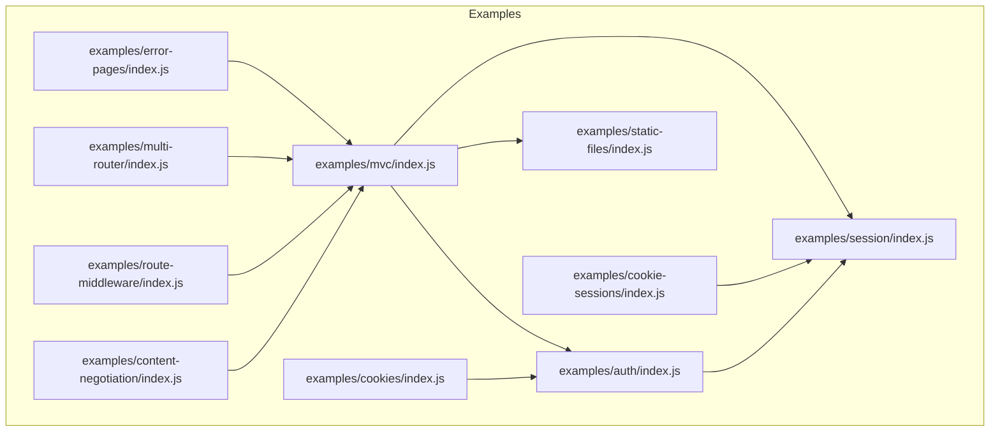

**Diagram sources**
- [examples/auth/index.js:1-135](file://examples/auth/index.js#L1-L135)
- [examples/session/index.js:1-38](file://examples/session/index.js#L1-L38)
- [examples/cookies/index.js:1-54](file://examples/cookies/index.js#L1-L54)
- [examples/static-files/index.js:1-44](file://examples/static-files/index.js#L1-L44)
- [examples/error-pages/index.js:1-104](file://examples/error-pages/index.js#L1-L104)
- [examples/mvc/index.js:1-96](file://examples/mvc/index.js#L1-L96)
- [examples/cookie-sessions/index.js:1-26](file://examples/cookie-sessions/index.js#L1-L26)
- [examples/multi-router/index.js:1-19](file://examples/multi-router/index.js#L1-L19)
- [examples/route-middleware/index.js:1-91](file://examples/route-middleware/index.js#L1-L91)
- [examples/content-negotiation/index.js:1-47](file://examples/content-negotiation/index.js#L1-L47)

**Section sources**
- [examples/auth/index.js:1-135](file://examples/auth/index.js#L1-L135)
- [examples/session/index.js:1-38](file://examples/session/index.js#L1-L38)
- [examples/cookies/index.js:1-54](file://examples/cookies/index.js#L1-L54)
- [examples/static-files/index.js:1-44](file://examples/static-files/index.js#L1-L44)
- [examples/error-pages/index.js:1-104](file://examples/error-pages/index.js#L1-L104)
- [examples/mvc/index.js:1-96](file://examples/mvc/index.js#L1-L96)
- [examples/cookie-sessions/index.js:1-26](file://examples/cookie-sessions/index.js#L1-L26)
- [examples/multi-router/index.js:1-19](file://examples/multi-router/index.js#L1-L19)
- [examples/route-middleware/index.js:1-91](file://examples/route-middleware/index.js#L1-L91)
- [examples/content-negotiation/index.js:1-47](file://examples/content-negotiation/index.js#L1-L47)

## Core Components
This section highlights the building blocks used across integrations:
- Authentication and session management: Demonstrates password hashing, session regeneration, and access restriction middleware.
- Cookie handling: Shows cookie parsing, signed cookies, and cookie lifecycle management.
- Static file serving: Illustrates serving static assets from multiple directories and optional URL prefixing.
- Error handling: Demonstrates 404/403/500 handling with content negotiation and verbose error rendering.
- MVC routing: Shows modular controllers, per-controller view engines, and automatic route generation.
- Cookie-backed sessions: Uses cookie-session for stateless session storage.
- Multi-router composition: Mounts separate router modules under different prefixes.
- Route middleware: Applies user loading, self-restriction, and role-based access control.
- Content negotiation: Responds with HTML, text, or JSON depending on Accept headers.

**Section sources**
- [examples/auth/index.js:1-135](file://examples/auth/index.js#L1-L135)
- [examples/cookies/index.js:1-54](file://examples/cookies/index.js#L1-L54)
- [examples/static-files/index.js:1-44](file://examples/static-files/index.js#L1-L44)
- [examples/error-pages/index.js:1-104](file://examples/error-pages/index.js#L1-L104)
- [examples/mvc/index.js:1-96](file://examples/mvc/index.js#L1-L96)
- [examples/cookie-sessions/index.js:1-26](file://examples/cookie-sessions/index.js#L1-L26)
- [examples/multi-router/index.js:1-19](file://examples/multi-router/index.js#L1-L19)
- [examples/route-middleware/index.js:1-91](file://examples/route-middleware/index.js#L1-L91)
- [examples/content-negotiation/index.js:1-47](file://examples/content-negotiation/index.js#L1-L47)

## Architecture Overview
The integrations demonstrate layered middleware composition and coordinated feature behavior. At a high level:
- Request lifecycle: logging → cookie parsing → body parsing → session management → route resolution → controller logic → response formatting.
- Error handling: centralized 404 detection followed by a generic error handler; content negotiation for error pages.
- Modular routing: controllers encapsulate domain logic; bootstrapper generates routes dynamically.
- Feature coordination: authentication middleware depends on sessions; flash messages rely on session persistence; static assets are served before route handlers.

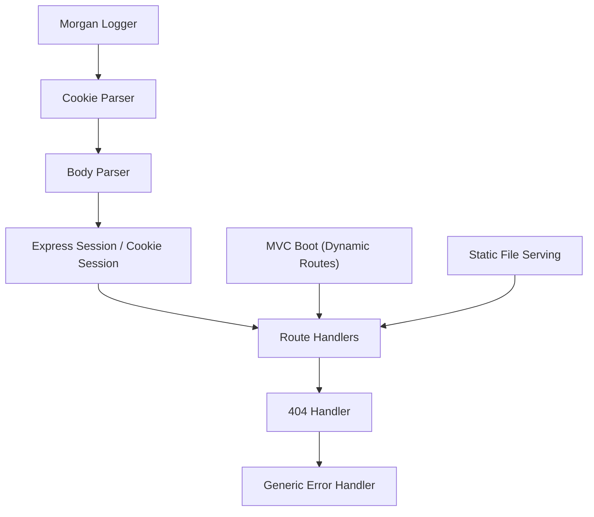

**Diagram sources**
- [examples/mvc/index.js:1-96](file://examples/mvc/index.js#L1-L96)
- [examples/error-pages/index.js:1-104](file://examples/error-pages/index.js#L1-L104)
- [examples/static-files/index.js:1-44](file://examples/static-files/index.js#L1-L44)
- [examples/cookies/index.js:1-54](file://examples/cookies/index.js#L1-L54)
- [examples/session/index.js:1-38](file://examples/session/index.js#L1-L38)
- [examples/cookie-sessions/index.js:1-26](file://examples/cookie-sessions/index.js#L1-L26)

## Detailed Component Analysis

### Authentication with Sessions and Flash Messaging
This integration combines password hashing, session-based authentication, and flash messaging via session attributes. Key behaviors:
- Session configuration avoids saving unmodified sessions and requires a secret.
- A middleware populates res.locals with a message derived from session success/error attributes.
- Authentication logic validates credentials against stored salt/hash and regenerates the session upon login to prevent fixation.
- Access restriction middleware enforces protected routes and redirects unauthorized users to the login page.

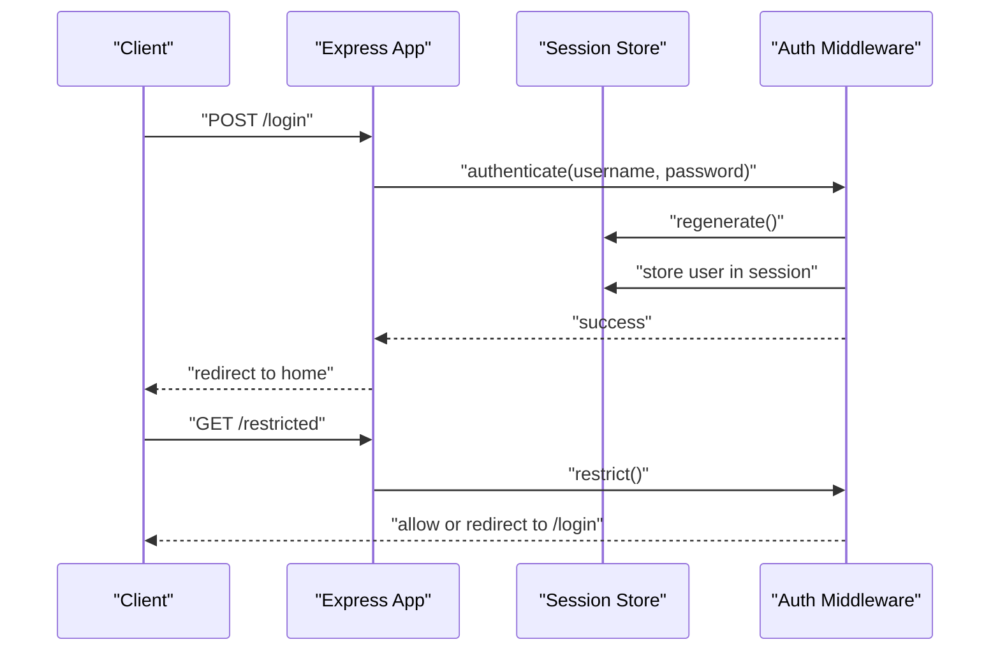

**Diagram sources**
- [examples/auth/index.js:1-135](file://examples/auth/index.js#L1-L135)

**Section sources**
- [examples/auth/index.js:1-135](file://examples/auth/index.js#L1-L135)

### Cookie Parsing and Signed Cookies
This example demonstrates cookie parsing and signed cookies:
- Cookie parser populates req.cookies and req.signedCookies using a secret.
- A checkbox form toggles a remember cookie with an expiration.
- Clearing the cookie removes it from the client.

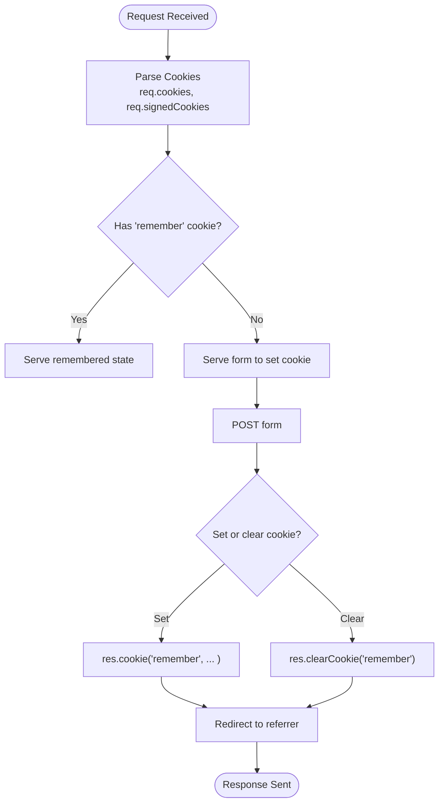

**Diagram sources**
- [examples/cookies/index.js:1-54](file://examples/cookies/index.js#L1-L54)

**Section sources**
- [examples/cookies/index.js:1-54](file://examples/cookies/index.js#L1-L54)

### Static File Serving with Prefixing
Static file serving is demonstrated with:
- Serving files from a base directory.
- Optional URL prefixing to namespace assets.
- Multiple static directories for convenience.

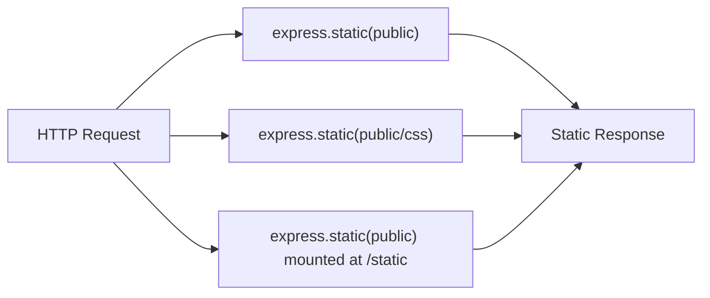

**Diagram sources**
- [examples/static-files/index.js:1-44](file://examples/static-files/index.js#L1-L44)

**Section sources**
- [examples/static-files/index.js:1-44](file://examples/static-files/index.js#L1-L44)

### Error Handling with Content Negotiation
This example showcases:
- Enabling/disabling verbose errors based on environment.
- Triggering various error conditions (404, 403, 500).
- Centralized 404 detection and content negotiation for error pages.
- A generic error handler rendering error templates.

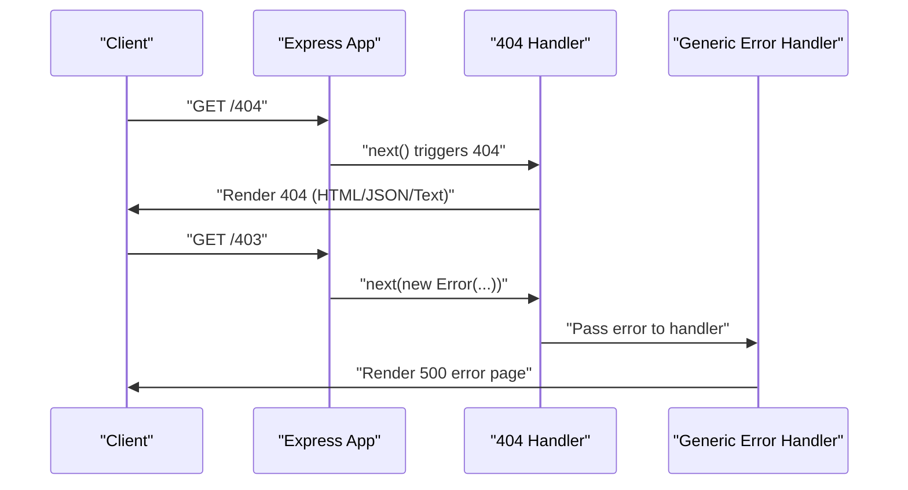

**Diagram sources**
- [examples/error-pages/index.js:1-104](file://examples/error-pages/index.js#L1-L104)

**Section sources**
- [examples/error-pages/index.js:1-104](file://examples/error-pages/index.js#L1-L104)

### MVC Routing with Dynamic Controllers and Messages
This integration demonstrates:
- A custom res.message() method that persists messages in the session.
- Static asset serving and session support.
- A bootstrapper that scans controller directories and generates routes automatically.
- Per-controller view engines and view paths.
- A middleware that exposes messages to views and flushes them after rendering.

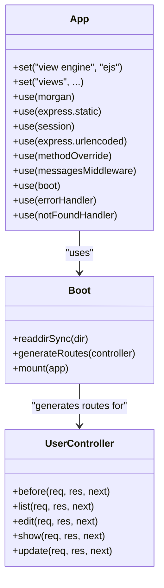

**Diagram sources**
- [examples/mvc/index.js:1-96](file://examples/mvc/index.js#L1-L96)
- [examples/mvc/lib/boot.js:1-84](file://examples/mvc/lib/boot.js#L1-L84)
- [examples/mvc/controllers/user/index.js:1-42](file://examples/mvc/controllers/user/index.js#L1-L42)

**Section sources**
- [examples/mvc/index.js:1-96](file://examples/mvc/index.js#L1-L96)
- [examples/mvc/lib/boot.js:1-84](file://examples/mvc/lib/boot.js#L1-L84)
- [examples/mvc/controllers/user/index.js:1-42](file://examples/mvc/controllers/user/index.js#L1-L42)
- [examples/mvc/controllers/pet/index.js:1-32](file://examples/mvc/controllers/pet/index.js#L1-L32)

### Cookie-Backed Sessions
This example uses cookie-session to store session data directly in cookies:
- Enables req.session with a secret.
- Increments a counter stored in the session cookie on each request.

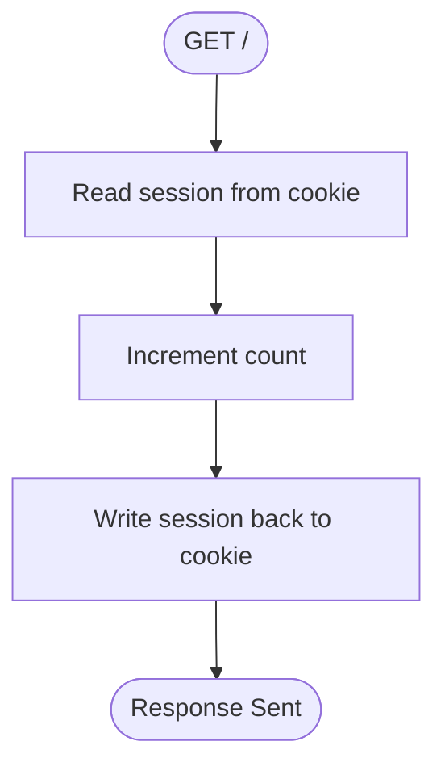

**Diagram sources**
- [examples/cookie-sessions/index.js:1-26](file://examples/cookie-sessions/index.js#L1-L26)

**Section sources**
- [examples/cookie-sessions/index.js:1-26](file://examples/cookie-sessions/index.js#L1-L26)

### Multi-Router Composition
Mounts separate router modules under different prefixes:
- API v1 and v2 routers are mounted at /api/v1 and /api/v2 respectively.
- Root route responds with a simple message.

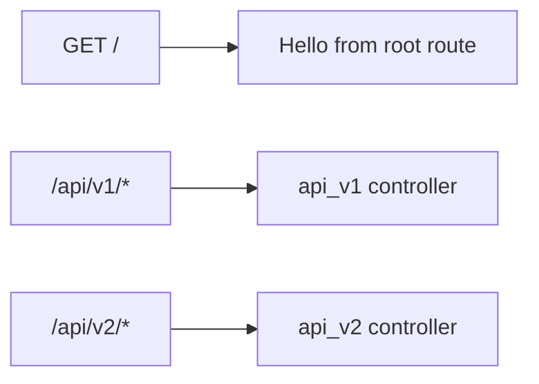

**Diagram sources**
- [examples/multi-router/index.js:1-19](file://examples/multi-router/index.js#L1-L19)

**Section sources**
- [examples/multi-router/index.js:1-19](file://examples/multi-router/index.js#L1-L19)

### Route Middleware with Role-Based Restrictions
This example applies middleware to load users, enforce self-access, and enforce roles:
- A middleware loads a user by ID.
- A higher-order function creates role-based restrictions.
- Self-restriction ensures users can only edit their own records.
- An admin-only route deletes users.

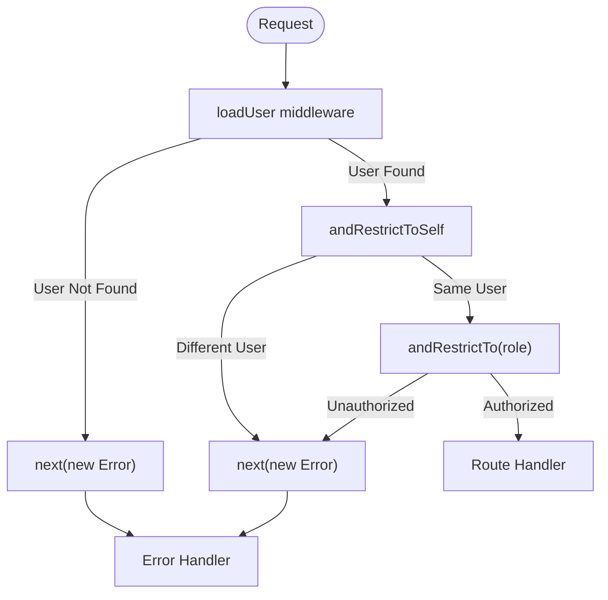

**Diagram sources**
- [examples/route-middleware/index.js:1-91](file://examples/route-middleware/index.js#L1-L91)

**Section sources**
- [examples/route-middleware/index.js:1-91](file://examples/route-middleware/index.js#L1-L91)

### Content Negotiation
Demonstrates responding with different formats based on Accept headers:
- HTML, text, and JSON responses for the same endpoint.
- A reusable format middleware for cleaner route definitions.

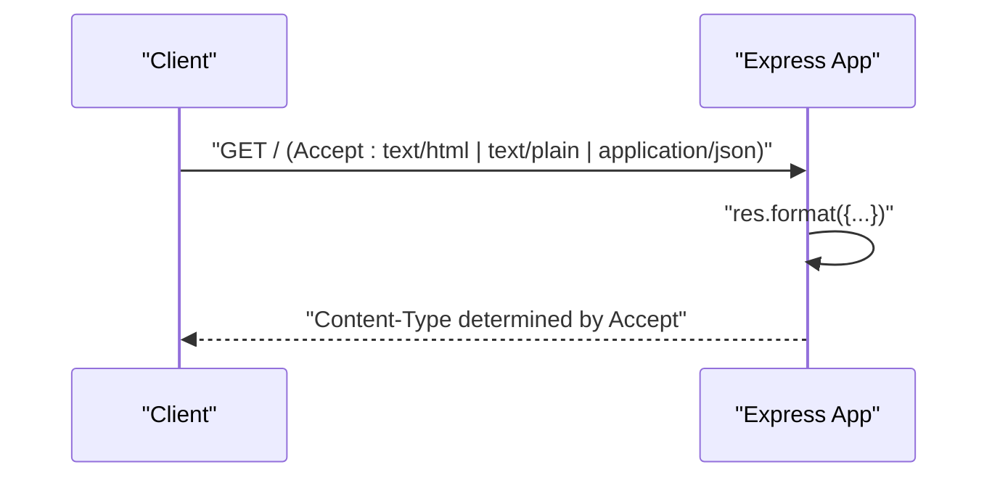

**Diagram sources**
- [examples/content-negotiation/index.js:1-47](file://examples/content-negotiation/index.js#L1-L47)

**Section sources**
- [examples/content-negotiation/index.js:1-47](file://examples/content-negotiation/index.js#L1-L47)

## Dependency Analysis
External dependencies commonly used across examples include:
- express-session: server-side session storage
- cookie-session: client-side cookie-backed sessions
- cookie-parser: cookie parsing and signed cookies
- morgan: request logging
- method-override: HTTP verb override
- pbkdf2-password: password hashing
- ejs/hbs: templating engines

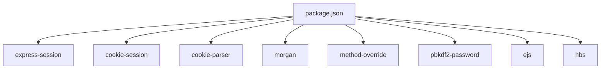

**Diagram sources**
- [package.json:1-100](file://package.json#L1-L100)

**Section sources**
- [package.json:1-100](file://package.json#L1-L100)

## Performance Considerations
- Session storage: Prefer Redis-backed sessions for scalability; cookie-session increases payload size and browser limits.
- Static serving: Use CDN and cache headers for production; avoid serving large binaries without compression.
- Logging: Disable verbose logging in production or route logs externally.
- Middleware order: Place fast middleware early; minimize synchronous operations in hot paths.
- Error handling: Keep error handlers efficient; avoid heavy computations in error routes.
- Content negotiation: Keep response transformations lightweight; cache computed representations when possible.

## Troubleshooting Guide
Common integration issues and resolutions:
- Session not persisting:
  - Verify session secret and resave/saveUninitialized settings.
  - Ensure session middleware is registered before routes.
  - Check for session regeneration after login to prevent fixation.
- Flash messages not appearing:
  - Confirm middleware that populates res.locals runs before rendering.
  - Ensure session messages are flushed after rendering.
- Cookies not readable:
  - Confirm cookie-parser secret matches signing secret.
  - Check SameSite and secure flags for cross-origin contexts.
- Static files not served:
  - Verify express.static path correctness and mount prefix alignment.
  - Ensure no conflicting middleware intercepts the request first.
- Error pages not rendered:
  - Ensure 404 handler executes before generic error handler.
  - Confirm error status codes are set before content negotiation.
- Route middleware not applied:
  - Verify middleware order and that next() is called appropriately.
  - Check for early returns or route skips that bypass intended middleware.

## Conclusion
By combining Express.js features—authentication with sessions, cookie handling, static file serving, error handling, MVC routing, cookie-backed sessions, multi-router composition, route middleware, and content negotiation—you can build robust, maintainable applications. Proper middleware ordering, thoughtful session strategies, and clear separation of concerns enable scalable and secure integrations.

## Appendices
- Security checklist:
  - Use HTTPS in production.
  - Set secure, sameSite, and httpOnly flags for cookies when appropriate.
  - Sanitize inputs and escape outputs.
  - Rotate secrets regularly.
  - Limit session lifetime and regenerate IDs after login.
- Best practices:
  - Modularize middleware and controllers.
  - Use environment-specific configurations.
  - Instrument logging and monitoring.
  - Validate and normalize inputs early.
  - Keep error handling centralized and consistent.