# Real-World Applications

<cite>
**Referenced Files in This Document**
- [examples/mvc/index.js](file://examples/mvc/index.js)
- [examples/mvc/controllers/main/index.js](file://examples/mvc/controllers/main/index.js)
- [examples/mvc/controllers/pet/index.js](file://examples/mvc/controllers/pet/index.js)
- [examples/mvc/controllers/user/index.js](file://examples/mvc/controllers/user/index.js)
- [examples/web-service/index.js](file://examples/web-service/index.js)
- [examples/resource/index.js](file://examples/resource/index.js)
- [examples/search/index.js](file://examples/search/index.js)
- [examples/route-separation/index.js](file://examples/route-separation/index.js)
- [examples/content-negotiation/index.js](file://examples/content-negotiation/index.js)
- [examples/auth/index.js](file://examples/auth/index.js)
- [examples/error-pages/index.js](file://examples/error-pages/index.js)
- [examples/session/index.js](file://examples/session/index.js)
- [examples/multi-router/index.js](file://examples/multi-router/index.js)
- [examples/route-middleware/index.js](file://examples/route-middleware/index.js)
- [examples/params/index.js](file://examples/params/index.js)
</cite>

## Table of Contents
1. [Introduction](#introduction)
2. [Project Structure](#project-structure)
3. [Core Components](#core-components)
4. [Architecture Overview](#architecture-overview)
5. [Detailed Component Analysis](#detailed-component-analysis)
6. [Dependency Analysis](#dependency-analysis)
7. [Performance Considerations](#performance-considerations)
8. [Troubleshooting Guide](#troubleshooting-guide)
9. [Conclusion](#conclusion)
10. [Appendices](#appendices)

## Introduction
This document presents real-world Express.js application examples derived from the repository’s examples directory. It focuses on production-ready implementations that demonstrate:

- Complete application lifecycles from setup to deployment
- MVC architecture with separation of concerns
- RESTful web services and resource-based routing
- Search functionality with Redis-backed storage
- Content negotiation for APIs
- Authentication and session management
- Error handling and error pages
- Advanced routing patterns and middleware composition
- Practical guidance for scaling, concurrency, and security

Each example is analyzed for architectural patterns, data modeling, controller organization, and operational best practices.

## Project Structure
The examples are organized by functional domain. Each example is a self-contained Express application that demonstrates a specific pattern or capability. Representative highlights include:

- MVC-style application with controllers and views
- Web service with API key validation and JSON responses
- Resource-based routing with custom helpers
- Search with Redis-backed sets
- Route separation across modules
- Content negotiation for multiple response formats
- Authentication with sessions and password hashing
- Comprehensive error handling and pages
- Multi-router versioning
- Route middleware for authorization
- Parameter parsing and validation

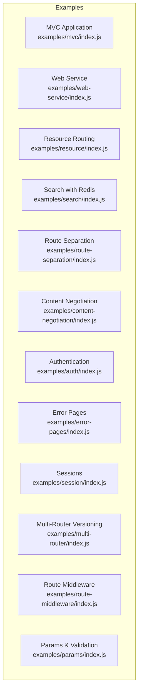

**Section sources**
- [examples/mvc/index.js:1-96](file://examples/mvc/index.js#L1-L96)
- [examples/web-service/index.js:1-118](file://examples/web-service/index.js#L1-L118)
- [examples/resource/index.js:1-96](file://examples/resource/index.js#L1-L96)
- [examples/search/index.js:1-84](file://examples/search/index.js#L1-L84)
- [examples/route-separation/index.js:1-56](file://examples/route-separation/index.js#L1-L56)
- [examples/content-negotiation/index.js:1-47](file://examples/content-negotiation/index.js#L1-L47)
- [examples/auth/index.js:1-135](file://examples/auth/index.js#L1-L135)
- [examples/error-pages/index.js:1-104](file://examples/error-pages/index.js#L1-L104)
- [examples/session/index.js:1-38](file://examples/session/index.js#L1-L38)
- [examples/multi-router/index.js:1-19](file://examples/multi-router/index.js#L1-L19)
- [examples/route-middleware/index.js:1-91](file://examples/route-middleware/index.js#L1-L91)
- [examples/params/index.js:1-75](file://examples/params/index.js#L1-L75)

## Core Components
This section outlines the core building blocks demonstrated across the examples:

- Application bootstrap and middleware pipeline
  - Static file serving, logging, sessions, body parsing, method override
  - View engine configuration and error view paths
- Controller organization
  - Action-based controllers with before hooks and CRUD actions
  - Modular controllers per domain (users, pets)
- Data modeling
  - In-memory “databases” for demonstration
  - Redis-backed sets for search
- API design
  - JSON responses, content negotiation, and typed error responses
  - Resource-based routes with custom verbs and formats
- Security and sessions
  - Session-based authentication with regeneration and destruction
  - API key validation for rate-limiting and usage tracking
- Error handling
  - Dedicated 404 and 500 handlers with content negotiation
  - Error propagation and logging

**Section sources**
- [examples/mvc/index.js:15-96](file://examples/mvc/index.js#L15-L96)
- [examples/web-service/index.js:30-111](file://examples/web-service/index.js#L30-L111)
- [examples/resource/index.js:13-68](file://examples/resource/index.js#L13-L68)
- [examples/search/index.js:18-60](file://examples/search/index.js#L18-L60)
- [examples/auth/index.js:21-128](file://examples/auth/index.js#L21-L128)
- [examples/error-pages/index.js:63-97](file://examples/error-pages/index.js#L63-L97)

## Architecture Overview
The examples collectively illustrate a layered architecture:

- Presentation Layer
  - Views and templating engines (EJS, Handlebars)
  - Static assets and client scripts
- Application Layer
  - Express app setup, middleware, and routing
  - Controllers orchestrating requests and rendering responses
- Domain/Data Layer
  - In-memory stores for users and pets
  - Redis-backed search index
- Integration Layer
  - API key validation and content negotiation
  - Cross-cutting concerns like sessions and logging

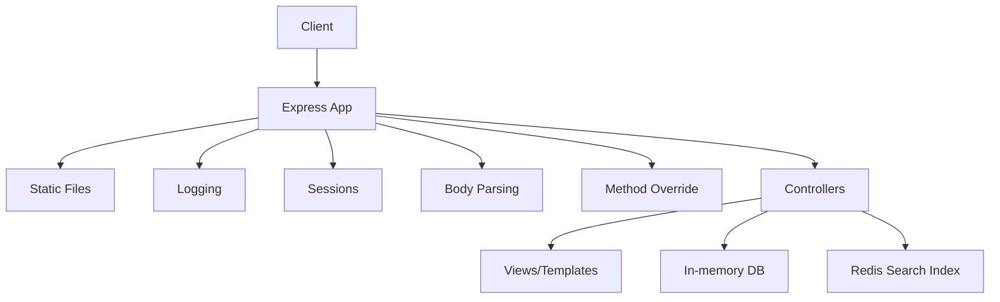

**Diagram sources**
- [examples/mvc/index.js:36-73](file://examples/mvc/index.js#L36-L73)
- [examples/web-service/index.js:30-42](file://examples/web-service/index.js#L30-L42)
- [examples/search/index.js:18-60](file://examples/search/index.js#L18-L60)

## Detailed Component Analysis

### MVC Architecture Implementation
The MVC example demonstrates separation of concerns with:

- Central app bootstrap configuring views, sessions, static assets, and middleware
- Controllers for main, user, and pet domains
- Before hooks for preloading domain objects
- Rendered views for listing, editing, and showing resources
- Flash messaging via session-backed messages

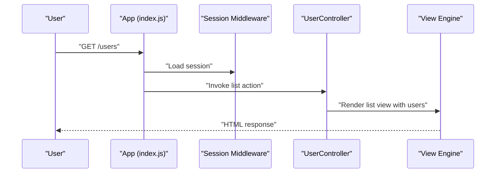

**Diagram sources**
- [examples/mvc/index.js:36-73](file://examples/mvc/index.js#L36-L73)
- [examples/mvc/controllers/user/index.js:24-26](file://examples/mvc/controllers/user/index.js#L24-L26)

**Section sources**
- [examples/mvc/index.js:15-96](file://examples/mvc/index.js#L15-L96)
- [examples/mvc/controllers/main/index.js:1-6](file://examples/mvc/controllers/main/index.js#L1-L6)
- [examples/mvc/controllers/user/index.js:11-42](file://examples/mvc/controllers/user/index.js#L11-L42)
- [examples/mvc/controllers/pet/index.js:11-32](file://examples/mvc/controllers/pet/index.js#L11-L32)

### RESTful Web Services and Resource-Based Routing
Two complementary examples showcase RESTful patterns:

- Web Service
  - API key validation middleware scoped to /api
  - JSON responses for users and repositories
  - Typed error responses and centralized error handler
- Resource
  - Custom app.resource helper for conventional CRUD routes
  - Range queries with format negotiation (JSON/HTML)
  - Deletion and show endpoints

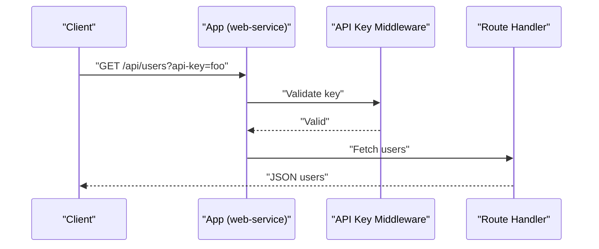

**Diagram sources**
- [examples/web-service/index.js:30-91](file://examples/web-service/index.js#L30-L91)

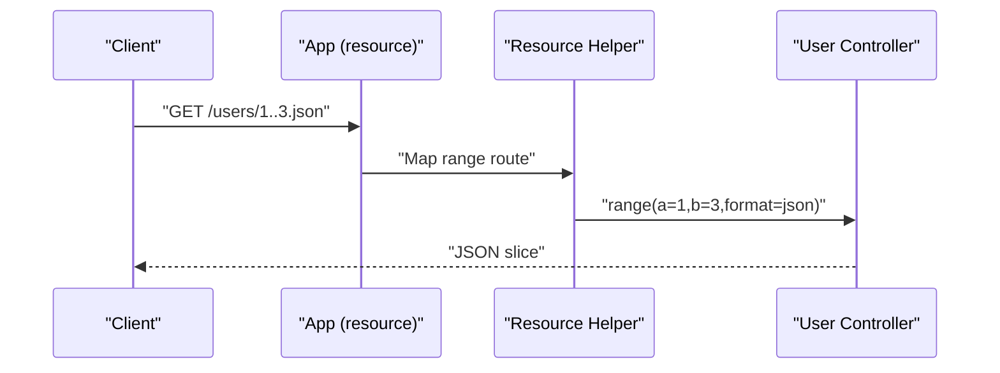

**Diagram sources**
- [examples/resource/index.js:13-68](file://examples/resource/index.js#L13-L68)

**Section sources**
- [examples/web-service/index.js:15-111](file://examples/web-service/index.js#L15-L111)
- [examples/resource/index.js:13-68](file://examples/resource/index.js#L13-L68)

### Search Functionality with Redis
The search example integrates Redis for fast set membership queries:

- Initializes Redis client and seeds sets
- Exposes a route to query Redis sets by key
- Returns members asynchronously and handles errors via next()

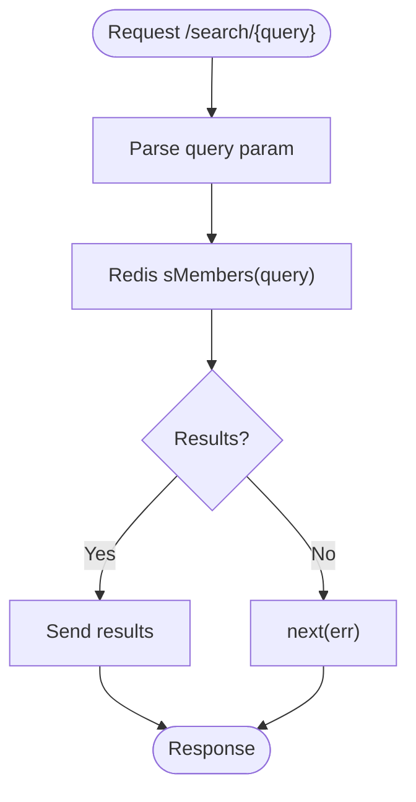

**Diagram sources**
- [examples/search/index.js:52-60](file://examples/search/index.js#L52-L60)

**Section sources**
- [examples/search/index.js:18-84](file://examples/search/index.js#L18-L84)

### Content Negotiation for APIs
The content-negotiation example demonstrates multiple response formats:

- Route returns HTML, text, or JSON depending on Accept header
- Optional reusable formatter middleware

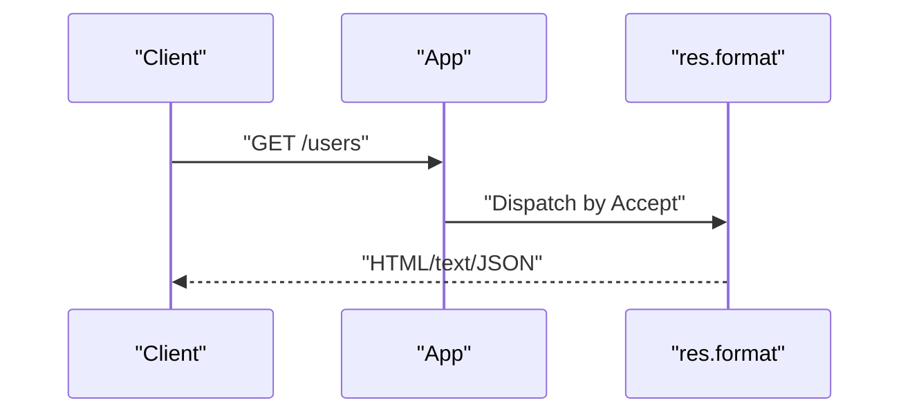

**Diagram sources**
- [examples/content-negotiation/index.js:9-41](file://examples/content-negotiation/index.js#L9-L41)

**Section sources**
- [examples/content-negotiation/index.js:9-41](file://examples/content-negotiation/index.js#L9-L41)

### Authentication and Sessions
The auth example implements session-based authentication:

- Hashing passwords with pbkdf2
- Session creation, regeneration, and destruction
- Restrict middleware for protected routes
- Flash messages via session

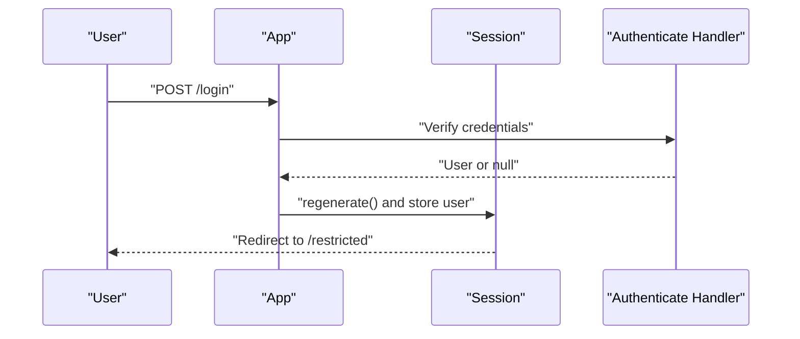

**Diagram sources**
- [examples/auth/index.js:104-128](file://examples/auth/index.js#L104-L128)

**Section sources**
- [examples/auth/index.js:21-128](file://examples/auth/index.js#L21-L128)

### Error Handling and Pages
The error-pages example shows robust error handling:

- 404 detection via middleware
- 403 and 500 errors with explicit status
- Content negotiation for error responses
- Environment-aware verbosity

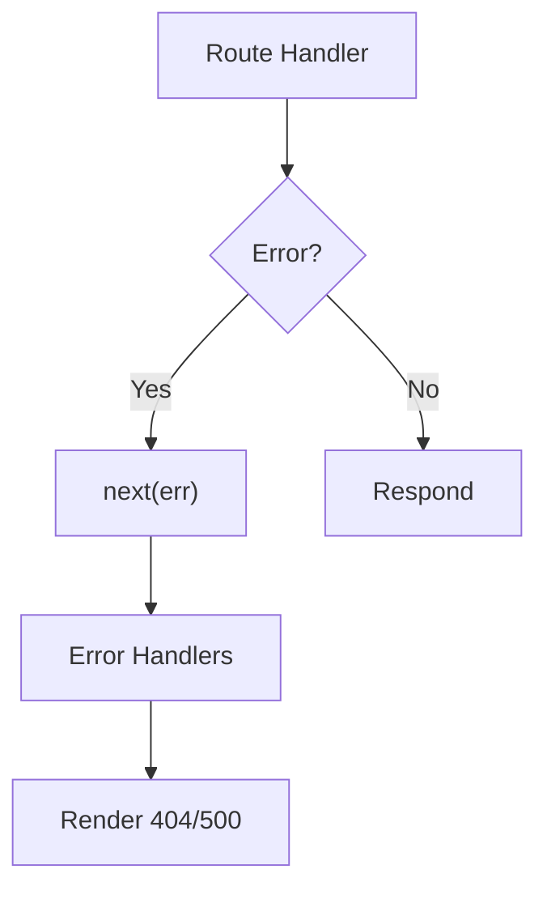

**Diagram sources**
- [examples/error-pages/index.js:63-97](file://examples/error-pages/index.js#L63-L97)

**Section sources**
- [examples/error-pages/index.js:34-97](file://examples/error-pages/index.js#L34-L97)

### Route Separation and Multi-Router Versioning
The route-separation example organizes routes across modules:

- Central app wiring routes to modular handlers
- Method override and cookie parsing
- Public assets and views

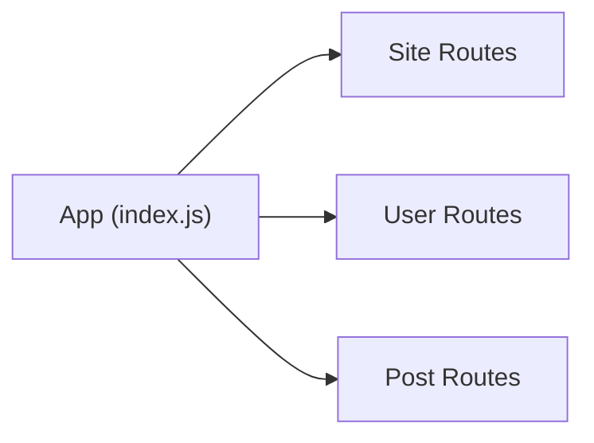

**Diagram sources**
- [examples/route-separation/index.js:13-55](file://examples/route-separation/index.js#L13-L55)

**Section sources**
- [examples/route-separation/index.js:13-55](file://examples/route-separation/index.js#L13-L55)

### Route Middleware and Authorization
The route-middleware example composes middleware for:

- Loading users
- Restricting access to self
- Restricting by role (admin)

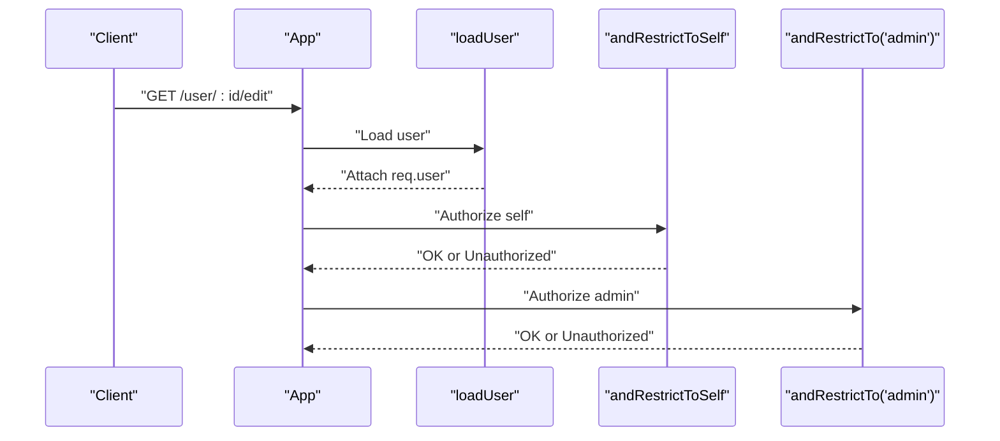

**Diagram sources**
- [examples/route-middleware/index.js:25-58](file://examples/route-middleware/index.js#L25-L58)

**Section sources**
- [examples/route-middleware/index.js:25-84](file://examples/route-middleware/index.js#L25-L84)

### Parameter Parsing and Validation
The params example demonstrates:

- Converting route parameters to integers
- Validating presence and correctness
- Returning appropriate HTTP errors

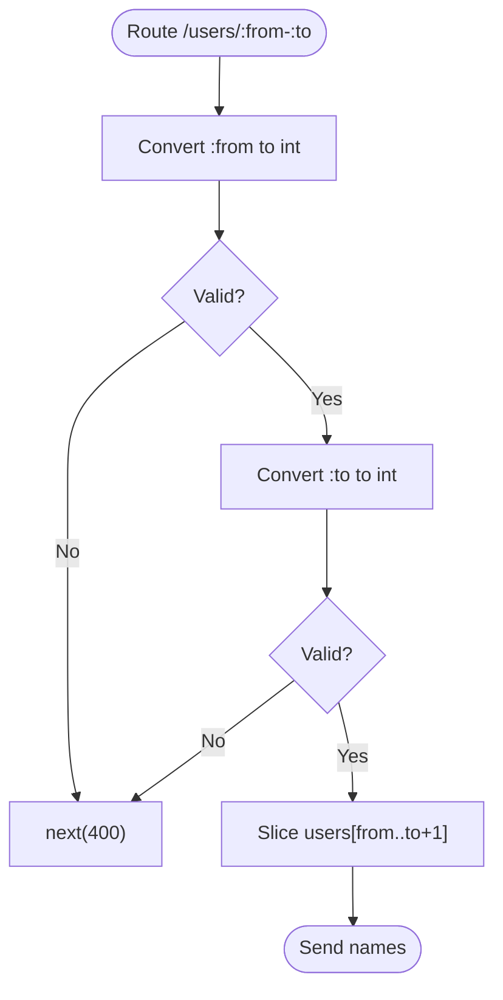

**Diagram sources**
- [examples/params/index.js:23-41](file://examples/params/index.js#L23-L41)

**Section sources**
- [examples/params/index.js:23-68](file://examples/params/index.js#L23-L68)

## Dependency Analysis
The examples illustrate typical Express dependencies and their roles:

- express: Core framework
- morgan: HTTP request logging
- express-session: Session management
- method-override: HTTP verb override
- cookie-parser: Cookie parsing
- pbkdf2-password: Password hashing
- redis: Search index backend

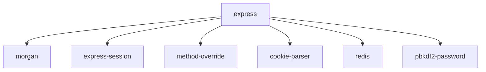

**Diagram sources**
- [examples/mvc/index.js:8-11](file://examples/mvc/index.js#L8-L11)
- [examples/auth/index.js:8-10](file://examples/auth/index.js#L8-L10)
- [examples/search/index.js:16](file://examples/search/index.js#L16)

**Section sources**
- [examples/mvc/index.js:8-11](file://examples/mvc/index.js#L8-L11)
- [examples/auth/index.js:8-10](file://examples/auth/index.js#L8-L10)
- [examples/search/index.js:16](file://examples/search/index.js#L16)

## Performance Considerations
- Use async/await for Redis operations to avoid blocking the event loop
- Enable compression and caching headers for static assets
- Prefer connection pooling for Redis and database clients
- Implement rate limiting and circuit breakers for external services
- Use clustering or worker processes for multi-core scaling
- Minimize synchronous operations in middleware and route handlers

## Troubleshooting Guide
Common issues and resolutions:

- API key missing or invalid
  - Ensure the query parameter matches configured keys
  - Validate error responses and status codes
- 404 Not Found
  - Confirm route registration order and fallback middleware
  - Verify content negotiation for JSON/text defaults
- Session fixation
  - Regenerate session upon login and destroy on logout
- Redis connectivity
  - Initialize Redis client and seed sets before serving requests
  - Handle connection errors gracefully and exit on initialization failure
- Parameter validation failures
  - Return explicit 400 errors for malformed parameters
  - Use http-errors for consistent error objects

**Section sources**
- [examples/web-service/index.js:30-42](file://examples/web-service/index.js#L30-L42)
- [examples/error-pages/index.js:63-97](file://examples/error-pages/index.js#L63-L97)
- [examples/auth/index.js:104-128](file://examples/auth/index.js#L104-L128)
- [examples/search/index.js:29-46](file://examples/search/index.js#L29-L46)
- [examples/params/index.js:23-41](file://examples/params/index.js#L23-L41)

## Conclusion
These examples provide a comprehensive foundation for building production-ready Express applications. They demonstrate MVC organization, RESTful design, content negotiation, authentication, error handling, and scalable patterns. By combining modular controllers, middleware composition, and external integrations like Redis, teams can deliver maintainable, secure, and performant systems.

## Appendices
- Deployment checklist
  - Set environment variables (NODE_ENV, secrets)
  - Configure reverse proxy and SSL termination
  - Monitor logs and metrics
  - Back up sessions and Redis data
- Security checklist
  - Enforce HTTPS and secure cookies
  - Sanitize inputs and escape outputs
  - Rotate secrets and API keys
  - Audit middleware and route permissions