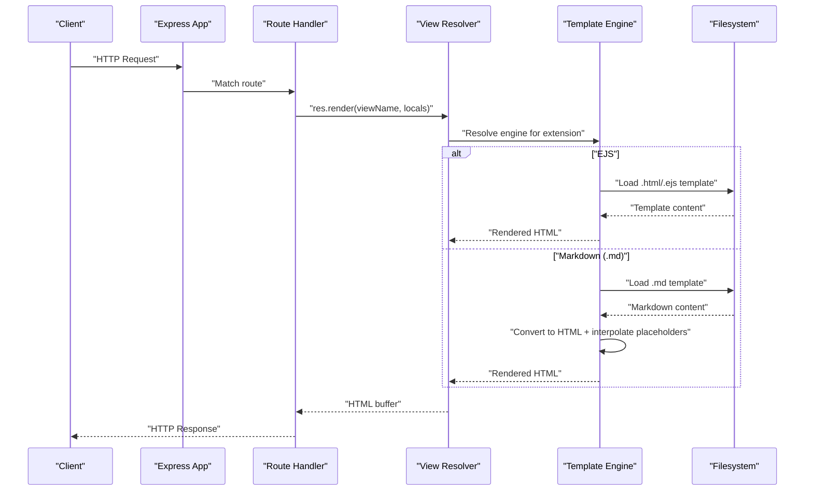
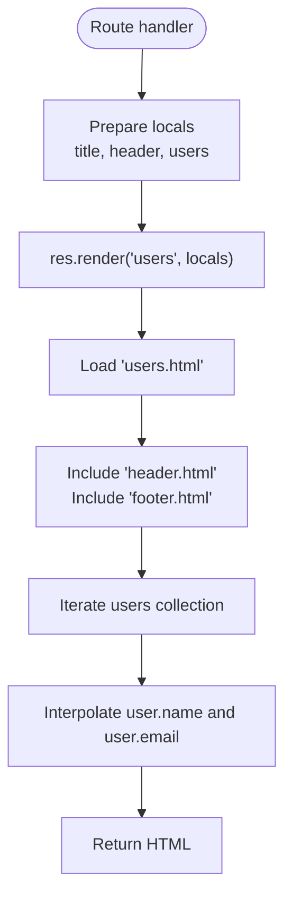
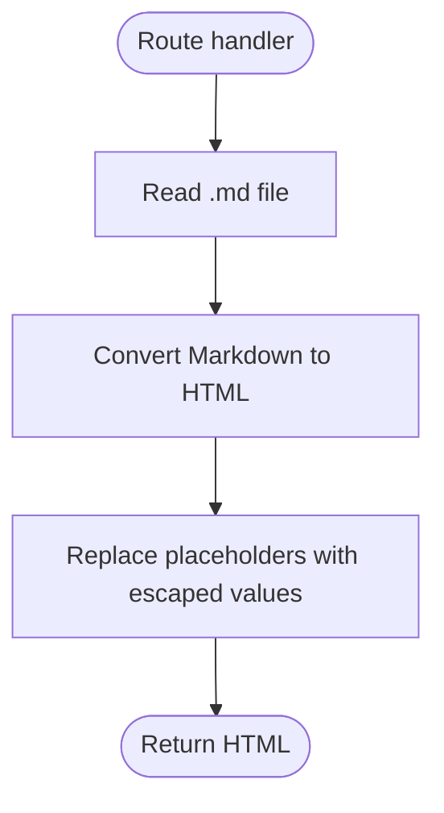
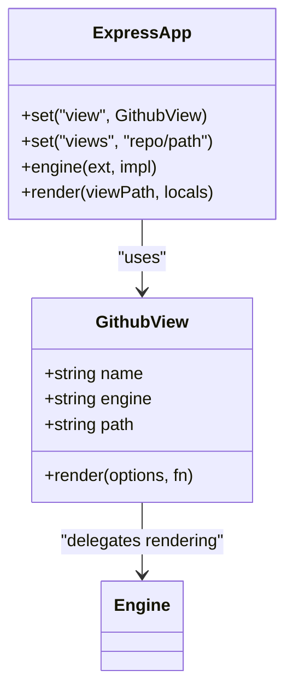
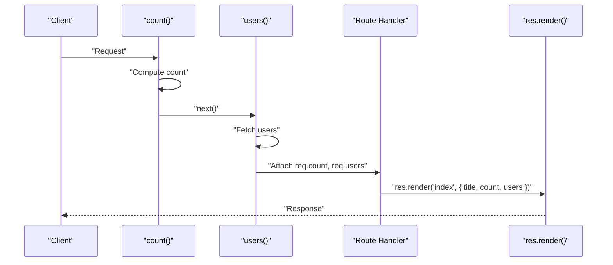
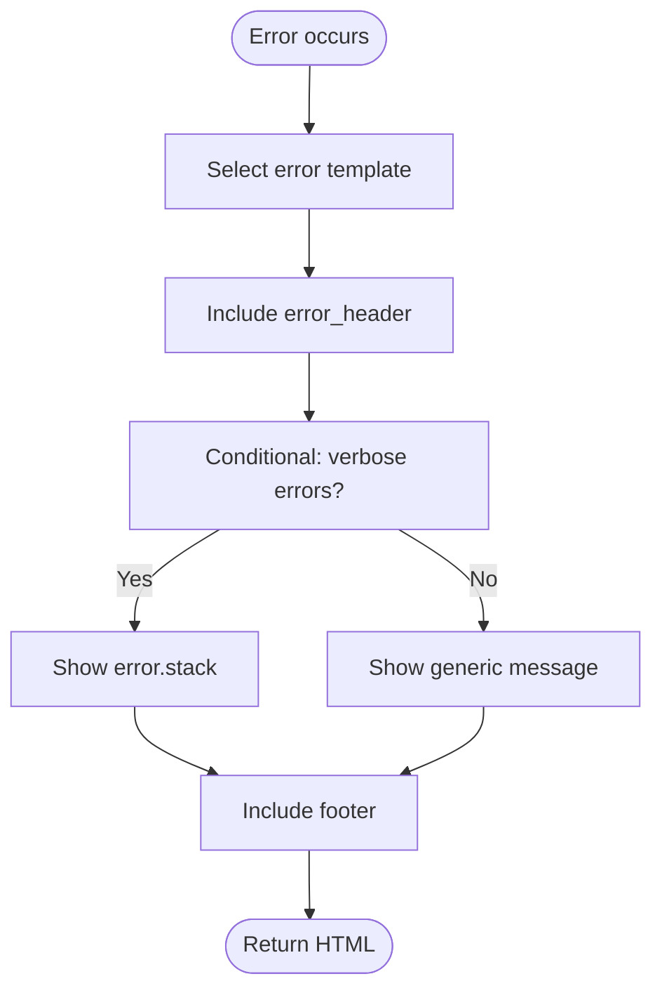
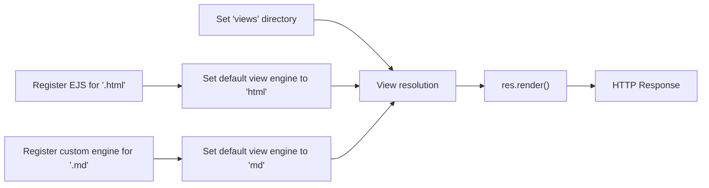

# Template Engine Examples

<cite>
**Referenced Files in This Document**
- [examples/ejs/index.js](file://examples/ejs/index.js)
- [examples/ejs/views/users.html](file://examples/ejs/views/users.html)
- [examples/ejs/views/header.html](file://examples/ejs/views/header.html)
- [examples/ejs/views/footer.html](file://examples/ejs/views/footer.html)
- [examples/markdown/index.js](file://examples/markdown/index.js)
- [examples/markdown/views/index.md](file://examples/markdown/views/index.md)
- [examples/view-constructor/index.js](file://examples/view-constructor/index.js)
- [examples/view-constructor/github-view.js](file://examples/view-constructor/github-view.js)
- [examples/view-locals/index.js](file://examples/view-locals/index.js)
- [examples/error-pages/index.js](file://examples/error-pages/index.js)
- [examples/error-pages/views/404.ejs](file://examples/error-pages/views/404.ejs)
- [examples/error-pages/views/500.ejs](file://examples/error-pages/views/500.ejs)
- [examples/error-pages/views/error_header.ejs](file://examples/error-pages/views/error_header.ejs)
- [examples/error-pages/views/footer.ejs](file://examples/error-pages/views/footer.ejs)
- [examples/route-separation/views/index.ejs](file://examples/route-separation/views/index.ejs)
- [examples/route-separation/views/users/index.ejs](file://examples/route-separation/views/users/index.ejs)
- [examples/route-separation/views/posts/index.ejs](file://examples/route-separation/views/posts/index.ejs)
- [examples/mvc/controllers/user/views/show.hbs](file://examples/mvc/controllers/user/views/show.hbs)
- [examples/mvc/views/404.ejs](file://examples/mvc/views/404.ejs)
- [examples/mvc/views/5xx.ejs](file://examples/mvc/views/5xx.ejs)
</cite>

## Table of Contents
1. [Introduction](#introduction)
2. [Project Structure](#project-structure)
3. [Core Components](#core-components)
4. [Architecture Overview](#architecture-overview)
5. [Detailed Component Analysis](#detailed-component-analysis)
6. [Dependency Analysis](#dependency-analysis)
7. [Performance Considerations](#performance-considerations)
8. [Troubleshooting Guide](#troubleshooting-guide)
9. [Conclusion](#conclusion)
10. [Appendices](#appendices)

## Introduction
This document presents comprehensive examples and guidance for Express.js template engine usage with a focus on view rendering and template system integration. It covers:
- EJS templating with partials and loops
- Markdown processing with custom engines
- Custom view constructors for remote templates
- View local variables and middleware-driven composition
- Rendering pipelines, template resolution, and engine registration
- Practical integration tips, security considerations, and performance optimization
- Migration guidance between EJS and Handlebars

## Project Structure
The examples demonstrate multiple approaches to rendering views:
- EJS-based rendering with partials and loops
- Markdown-to-HTML conversion via a custom engine
- Remote template loading via a custom view constructor
- Middleware-driven population of view locals
- Error pages with conditionals and partials
- Route separation with shared partials
- Handlebars templates in an MVC controller

```mermaid
graph TB
subgraph "EJS Example"
EJS_IDX["examples/ejs/index.js"]
EJS_USERS["examples/ejs/views/users.html"]
EJS_HEADER["examples/ejs/views/header.html"]
EJS_FOOTER["examples/ejs/views/footer.html"]
end
subgraph "Markdown Example"
MD_IDX["examples/markdown/index.js"]
MD_VIEW["examples/markdown/views/index.md"]
end
subgraph "Custom View Constructor"
GV_IDX["examples/view-constructor/index.js"]
GV_IMPL["examples/view-constructor/github-view.js"]
end
subgraph "View Locals"
VL_IDX["examples/view-locals/index.js"]
end
subgraph "Error Pages"
EP_IDX["examples/error-pages/index.js"]
EP_404["examples/error-pages/views/404.ejs"]
EP_500["examples/error-pages/views/500.ejs"]
EP_HDR["examples/error-pages/views/error_header.ejs"]
EP_FTR["examples/error-pages/views/footer.ejs"]
end
subgraph "Route Separation"
RS_IDX["examples/route-separation/index.js"]
RS_HOME["examples/route-separation/views/index.ejs"]
RS_USERS["examples/route-separation/views/users/index.ejs"]
RS_POSTS["examples/route-separation/views/posts/index.ejs"]
end
subgraph "MVC Handlebars"
MVC_HBS["examples/mvc/controllers/user/views/show.hbs"]
MVC_404["examples/mvc/views/404.ejs"]
MVC_5XX["examples/mvc/views/5xx.ejs"]
end
EJS_IDX --> EJS_USERS
EJS_USERS --> EJS_HEADER
EJS_USERS --> EJS_FOOTER
GV_IDX --> GV_IMPL
MD_IDX --> MD_VIEW
EP_IDX --> EP_404
EP_IDX --> EP_500
EP_404 --> EP_HDR
EP_404 --> EP_FTR
EP_500 --> EP_HDR
EP_500 --> EP_FTR
RS_HOME --> RS_USERS
RS_HOME --> RS_POSTS
```

**Diagram sources**
- [examples/ejs/index.js:1-58](file://examples/ejs/index.js#L1-L58)
- [examples/ejs/views/users.html:1-11](file://examples/ejs/views/users.html#L1-L11)
- [examples/ejs/views/header.html:1-10](file://examples/ejs/views/header.html#L1-L10)
- [examples/ejs/views/footer.html:1-3](file://examples/ejs/views/footer.html#L1-L3)
- [examples/markdown/index.js:1-45](file://examples/markdown/index.js#L1-L45)
- [examples/view-constructor/index.js:1-49](file://examples/view-constructor/index.js#L1-L49)
- [examples/view-constructor/github-view.js:1-54](file://examples/view-constructor/github-view.js#L1-L54)
- [examples/error-pages/index.js:1-45](file://examples/error-pages/index.js#L1-L45)
- [examples/error-pages/views/404.ejs:1-4](file://examples/error-pages/views/404.ejs#L1-L4)
- [examples/error-pages/views/500.ejs:1-9](file://examples/error-pages/views/500.ejs#L1-L9)
- [examples/error-pages/views/error_header.ejs:1-11](file://examples/error-pages/views/error_header.ejs#L1-L11)
- [examples/error-pages/views/footer.ejs:1-3](file://examples/error-pages/views/footer.ejs#L1-L3)
- [examples/route-separation/views/index.ejs:1-11](file://examples/route-separation/views/index.ejs#L1-L11)
- [examples/route-separation/views/users/index.ejs:1-15](file://examples/route-separation/views/users/index.ejs#L1-L15)
- [examples/route-separation/views/posts/index.ejs:1-13](file://examples/route-separation/views/posts/index.ejs#L1-L13)
- [examples/mvc/controllers/user/views/show.hbs:1-32](file://examples/mvc/controllers/user/views/show.hbs#L1-L32)
- [examples/mvc/views/404.ejs:1-14](file://examples/mvc/views/404.ejs#L1-L14)
- [examples/mvc/views/5xx.ejs:1-14](file://examples/mvc/views/5xx.ejs#L1-L14)

**Section sources**
- [examples/ejs/index.js:1-58](file://examples/ejs/index.js#L1-L58)
- [examples/markdown/index.js:1-45](file://examples/markdown/index.js#L1-L45)
- [examples/view-constructor/index.js:1-49](file://examples/view-constructor/index.js#L1-L49)
- [examples/view-constructor/github-view.js:1-54](file://examples/view-constructor/github-view.js#L1-L54)
- [examples/view-locals/index.js:1-156](file://examples/view-locals/index.js#L1-L156)
- [examples/error-pages/index.js:1-45](file://examples/error-pages/index.js#L1-L45)
- [examples/route-separation/views/index.ejs:1-11](file://examples/route-separation/views/index.ejs#L1-L11)
- [examples/mvc/controllers/user/views/show.hbs:1-32](file://examples/mvc/controllers/user/views/show.hbs#L1-L32)

## Core Components
- EJS engine registration and view resolution:
  - Registering an engine for a file extension and setting the default view engine
  - Using partials and variable interpolation in templates
  - Rendering with locals and optional extensions
- Markdown engine:
  - Custom engine that reads a Markdown file, converts it to HTML, and interpolates placeholders from locals
- Custom view constructor:
  - A view class that loads templates from a remote source and delegates rendering to the selected engine
- View locals:
  - Populating locals via middleware and route handlers, and passing them to res.render
- Error pages:
  - Conditional rendering based on settings and error details
- Route separation:
  - Shared header/footer partials included across nested routes
- Handlebars:
  - Conditionals, iteration, and helpers in templates

**Section sources**
- [examples/ejs/index.js:23-36](file://examples/ejs/index.js#L23-L36)
- [examples/ejs/views/users.html:1-11](file://examples/ejs/views/users.html#L1-L11)
- [examples/markdown/index.js:17-25](file://examples/markdown/index.js#L17-L25)
- [examples/view-constructor/index.js:14-30](file://examples/view-constructor/index.js#L14-L30)
- [examples/view-constructor/github-view.js:23-53](file://examples/view-constructor/github-view.js#L23-L53)
- [examples/view-locals/index.js:26-108](file://examples/view-locals/index.js#L26-L108)
- [examples/error-pages/views/500.ejs:3-7](file://examples/error-pages/views/500.ejs#L3-L7)
- [examples/route-separation/views/index.ejs:1-11](file://examples/route-separation/views/index.ejs#L1-L11)
- [examples/mvc/controllers/user/views/show.hbs:12-29](file://examples/mvc/controllers/user/views/show.hbs#L12-L29)

## Architecture Overview
The rendering pipeline integrates Express configuration, engine registration, view resolution, and template execution. The following diagram maps the flow from request to rendered output for EJS and Markdown examples.

**Diagram sources**
- [examples/ejs/index.js:45-51](file://examples/ejs/index.js#L45-L51)
- [examples/ejs/views/users.html:1-11](file://examples/ejs/views/users.html#L1-L11)
- [examples/markdown/index.js:17-25](file://examples/markdown/index.js#L17-L25)

## Detailed Component Analysis

### EJS Templating with Partials and Loops
- Engine registration:
  - Register EJS engine for .html extension and set default view engine to html
- Template syntax highlights:
  - Variable interpolation for dynamic content
  - Unescaped output for trusted HTML fragments
  - Iteration over collections to build lists
  - Partial inclusion for reusable header/footer
- Rendering:
  - Passing locals such as title, header, and users to res.render
- Best practices:
  - Keep templates readable; avoid heavy logic in templates
  - Use partials for layout reuse

**Diagram sources**
- [examples/ejs/index.js:39-51](file://examples/ejs/index.js#L39-L51)
- [examples/ejs/views/users.html:1-11](file://examples/ejs/views/users.html#L1-L11)
- [examples/ejs/views/header.html](file://examples/ejs/views/header.html#L6)
- [examples/ejs/views/footer.html:1-3](file://examples/ejs/views/footer.html#L1-L3)

**Section sources**
- [examples/ejs/index.js:23-36](file://examples/ejs/index.js#L23-L36)
- [examples/ejs/views/users.html:1-11](file://examples/ejs/views/users.html#L1-L11)
- [examples/ejs/views/header.html](file://examples/ejs/views/header.html#L6)
- [examples/ejs/views/footer.html:1-3](file://examples/ejs/views/footer.html#L1-L3)

### Markdown Processing with Custom Engine
- Engine registration:
  - Register a custom engine for .md extension
- Processing logic:
  - Read Markdown file, convert to HTML, and interpolate placeholders from locals
- Security consideration:
  - Interpolation uses an HTML-escaping helper for untrusted data
- Rendering:
  - Set default view engine to md and render a Markdown view

**Diagram sources**
- [examples/markdown/index.js:17-25](file://examples/markdown/index.js#L17-L25)

**Section sources**
- [examples/markdown/index.js:17-34](file://examples/markdown/index.js#L17-L34)

### Custom View Constructor for Remote Templates
- Purpose:
  - Load templates from a remote location (GitHub raw content) and render them with the selected engine
- Implementation:
  - Custom view class stores engine and computed path
  - Render fetches content via HTTPS and delegates to engine callback
- Usage:
  - Set custom view constructor and render remote paths as views
- Considerations:
  - Network latency and error handling
  - Engine selection based on file extension

**Diagram sources**
- [examples/view-constructor/github-view.js:23-53](file://examples/view-constructor/github-view.js#L23-L53)
- [examples/view-constructor/index.js:14-30](file://examples/view-constructor/index.js#L14-L30)

**Section sources**
- [examples/view-constructor/index.js:14-42](file://examples/view-constructor/index.js#L14-L42)
- [examples/view-constructor/github-view.js:23-53](file://examples/view-constructor/github-view.js#L23-L53)

### View Local Variables and Middleware Composition
- Approaches:
  - Nested callbacks to compute counts and filtered lists
  - Middleware that attaches values to req for downstream use
  - Middleware that attaches values to res.locals for convenience
- Benefits:
  - Reduced duplication across routes
  - Cleaner separation of concerns
- Patterns:
  - Chain middleware to populate locals incrementally
  - Use res.locals for route-specific data

**Diagram sources**
- [examples/view-locals/index.js:26-70](file://examples/view-locals/index.js#L26-L70)

**Section sources**
- [examples/view-locals/index.js:26-108](file://examples/view-locals/index.js#L26-L108)

### Error Pages with Conditionals and Partials
- Layout reuse:
  - Error pages include shared header and footer partials
- Conditional rendering:
  - Display verbose error details based on settings
- Rendering:
  - Use res.render to serve error pages with locals such as url and error

**Diagram sources**
- [examples/error-pages/views/500.ejs:3-7](file://examples/error-pages/views/500.ejs#L3-L7)
- [examples/error-pages/views/404.ejs:1-4](file://examples/error-pages/views/404.ejs#L1-L4)
- [examples/error-pages/views/error_header.ejs:1-11](file://examples/error-pages/views/error_header.ejs#L1-L11)
- [examples/error-pages/views/footer.ejs:1-3](file://examples/error-pages/views/footer.ejs#L1-L3)

**Section sources**
- [examples/error-pages/views/500.ejs:1-9](file://examples/error-pages/views/500.ejs#L1-L9)
- [examples/error-pages/views/404.ejs:1-4](file://examples/error-pages/views/404.ejs#L1-L4)

### Route Separation with Shared Partials
- Pattern:
  - Use ../ to include partials relative to the current view’s directory
- Benefits:
  - Organize templates by domain (users, posts) while sharing common layouts
- Rendering:
  - Render index pages with locals such as title and collections

**Section sources**
- [examples/route-separation/views/index.ejs:1-11](file://examples/route-separation/views/index.ejs#L1-L11)
- [examples/route-separation/views/users/index.ejs:1-15](file://examples/route-separation/views/users/index.ejs#L1-L15)
- [examples/route-separation/views/posts/index.ejs:1-13](file://examples/route-separation/views/posts/index.ejs#L1-L13)

### Handlebars Templates in MVC
- Features:
  - Conditionals to check presence of data
  - Iteration over arrays to render lists
  - Helpers for dynamic content and links
- Rendering:
  - Pass model data to res.render for view binding

**Section sources**
- [examples/mvc/controllers/user/views/show.hbs:12-29](file://examples/mvc/controllers/user/views/show.hbs#L12-L29)

## Dependency Analysis
- Template engine registration:
  - EJS: Registered for .html; default view engine set to html
  - Markdown: Custom engine registered for .md
  - Handlebars: Demonstrated in MVC controller views
- View resolution:
  - Express resolves views by extension and default view engine
  - Custom view constructor overrides resolution for remote templates
- Rendering pipeline:
  - Route handler -> res.render -> view resolver -> engine -> output

**Diagram sources**
- [examples/ejs/index.js:23-36](file://examples/ejs/index.js#L23-L36)
- [examples/markdown/index.js:17-30](file://examples/markdown/index.js#L17-L30)
- [examples/view-constructor/index.js:27-30](file://examples/view-constructor/index.js#L27-L30)

**Section sources**
- [examples/ejs/index.js:23-36](file://examples/ejs/index.js#L23-L36)
- [examples/markdown/index.js:17-30](file://examples/markdown/index.js#L17-L30)
- [examples/view-constructor/index.js:27-30](file://examples/view-constructor/index.js#L27-L30)

## Performance Considerations
- Prefer compiled engines:
  - Use engines with built-in caching for production
- Minimize partials:
  - Reduce include overhead by consolidating shared markup
- Avoid heavy logic in templates:
  - Move computation to middleware or controllers
- Static assets:
  - Serve CSS/JS via static middleware to reduce template work
- Remote templates:
  - Cache fetched templates or use CDN-backed storage to reduce latency
- Error handling:
  - Fail fast on missing templates to avoid wasted cycles

## Troubleshooting Guide
- Missing view engine:
  - Ensure app.engine is called for non-default extensions
- Incorrect view path:
  - Verify app.set('views') points to the correct directory
- Partial resolution failures:
  - Confirm partial paths are relative to the current view
- Interpolation issues:
  - For Markdown, ensure placeholders match keys in locals
- Remote template errors:
  - Validate network connectivity and path construction in custom view
- Error pages not rendering:
  - Check that error templates include required partials and locals

**Section sources**
- [examples/markdown/index.js:17-25](file://examples/markdown/index.js#L17-L25)
- [examples/view-constructor/github-view.js:36-53](file://examples/view-constructor/github-view.js#L36-L53)
- [examples/error-pages/views/404.ejs:1-4](file://examples/error-pages/views/404.ejs#L1-L4)

## Conclusion
These examples illustrate robust patterns for integrating Express with multiple template engines, managing view locals, and structuring reusable layouts. By registering engines appropriately, leveraging partials, and composing middleware, applications can achieve maintainable and performant rendering pipelines. For advanced scenarios, custom view constructors enable remote template sourcing, while careful interpolation and error handling ensure security and reliability.

## Appendices

### Template Syntax Highlights
- EJS:
  - Interpolation: variable substitution
  - Unescaped output: trusted HTML fragments
  - Partials: include other templates
  - Control flow: conditionals and loops
- Markdown:
  - Inline conversion to HTML
  - Placeholder interpolation with escaping
- Handlebars:
  - Conditionals and iteration
  - Helpers for dynamic content

**Section sources**
- [examples/ejs/views/users.html:5-7](file://examples/ejs/views/users.html#L5-L7)
- [examples/ejs/views/header.html](file://examples/ejs/views/header.html#L6)
- [examples/markdown/index.js:20-22](file://examples/markdown/index.js#L20-L22)
- [examples/mvc/controllers/user/views/show.hbs:12-29](file://examples/mvc/controllers/user/views/show.hbs#L12-L29)

### Migration Between Engines
- From EJS to Handlebars:
  - Replace EJS delimiters with Handlebars equivalents
  - Convert partials to include helpers or layout blocks
  - Migrate loops and conditionals to Handlebars syntax
  - Update engine registration and default view engine
- From Markdown to EJS/Handlebars:
  - Move inline Markdown to dedicated .md files
  - Introduce custom engine or pre-process Markdown to HTML
  - Preserve placeholder interpolation patterns

**Section sources**
- [examples/ejs/index.js:23-36](file://examples/ejs/index.js#L23-L36)
- [examples/markdown/index.js:17-25](file://examples/markdown/index.js#L17-L25)
- [examples/mvc/controllers/user/views/show.hbs:12-29](file://examples/mvc/controllers/user/views/show.hbs#L12-L29)