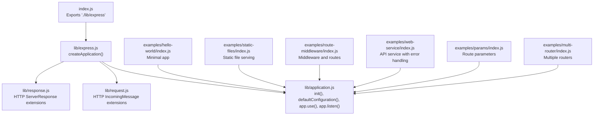
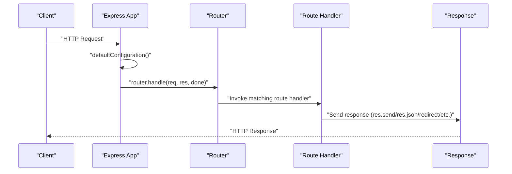

# Getting Started

<cite>
**Referenced Files in This Document**
- [package.json](file://package.json)
- [Readme.md](file://Readme.md)
- [index.js](file://index.js)
- [lib/express.js](file://lib/express.js)
- [lib/application.js](file://lib/application.js)
- [lib/request.js](file://lib/request.js)
- [lib/response.js](file://lib/response.js)
- [examples/hello-world/index.js](file://examples/hello-world/index.js)
- [examples/static-files/index.js](file://examples/static-files/index.js)
- [examples/route-middleware/index.js](file://examples/route-middleware/index.js)
- [examples/web-service/index.js](file://examples/web-service/index.js)
- [examples/params/index.js](file://examples/params/index.js)
- [examples/multi-router/index.js](file://examples/multi-router/index.js)
- [examples/README.md](file://examples/README.md)
</cite>

## Table of Contents
1. [Introduction](#introduction)
2. [Project Structure](#project-structure)
3. [Core Components](#core-components)
4. [Architecture Overview](#architecture-overview)
5. [Detailed Component Analysis](#detailed-component-analysis)
6. [Dependency Analysis](#dependency-analysis)
7. [Performance Considerations](#performance-considerations)
8. [Troubleshooting Guide](#troubleshooting-guide)
9. [Conclusion](#conclusion)
10. [Appendices](#appendices)

## Introduction
Express is a fast, unopinionated, minimalist web framework for Node.js. It focuses on providing a small, robust toolkit for building web applications and APIs, emphasizing performance and flexibility. Express does not enforce a specific ORM or template engine, enabling developers to choose the best tools for their needs.

Key characteristics:
- Minimalist design with a small core
- Rich ecosystem of middleware and modules
- Built on top of Node.js HTTP infrastructure
- Supports content negotiation, routing, and middleware patterns

This Getting Started guide walks you through installation, project setup, and building your first application, including routing, middleware, static file serving, and error handling.

**Section sources**
- [Readme.md:34-46](file://Readme.md#L34-L46)
- [Readme.md:48-67](file://Readme.md#L48-L67)
- [Readme.md:117-126](file://Readme.md#L117-L126)

## Project Structure
Express is organized into a small core with clearly separated modules:
- Core entry point exports the framework
- Application module handles server initialization, settings, middleware, and routing
- Request and response prototypes extend Node’s HTTP primitives
- Examples demonstrate common patterns and use cases

**Diagram sources**
- [index.js:11](file://index.js#L11)
- [lib/express.js:36-56](file://lib/express.js#L36-L56)
- [lib/application.js:59-141](file://lib/application.js#L59-L141)
- [lib/request.js:30](file://lib/request.js#L30)
- [lib/response.js:42](file://lib/response.js#L42)
- [examples/hello-world/index.js:5](file://examples/hello-world/index.js#L5)
- [examples/static-files/index.js:10](file://examples/static-files/index.js#L10)
- [examples/route-middleware/index.js:9](file://examples/route-middleware/index.js#L9)
- [examples/web-service/index.js:9](file://examples/web-service/index.js#L9)
- [examples/params/index.js:9](file://examples/params/index.js#L9)
- [examples/multi-router/index.js:5](file://examples/multi-router/index.js#L5)

**Section sources**
- [index.js:11](file://index.js#L11)
- [lib/express.js:15-21](file://lib/express.js#L15-L21)
- [examples/README.md:1-30](file://examples/README.md#L1-L30)

## Core Components
- Express factory: Creates an application instance that is both a function and an event emitter, with request and response prototypes attached.
- Application: Manages settings, middleware, routing, and server lifecycle.
- Request: Extends Node’s IncomingMessage with convenience getters and helpers (headers, protocol, IP, query, etc.).
- Response: Extends Node’s ServerResponse with helpers for sending data, setting headers, cookies, redirects, and content negotiation.

Key capabilities:
- Default configuration and settings
- Middleware registration via app.use()
- Routing shortcuts (app.get, app.post, etc.)
- Static file serving via serve-static
- JSON and form parsing via body-parser

**Section sources**
- [lib/express.js:36-56](file://lib/express.js#L36-L56)
- [lib/application.js:59-141](file://lib/application.js#L59-L141)
- [lib/request.js:30](file://lib/request.js#L30)
- [lib/response.js:42](file://lib/response.js#L42)
- [lib/express.js:77-82](file://lib/express.js#L77-L82)

## Architecture Overview
Express sits on top of Node’s HTTP server and provides a thin, expressive wrapper around it. The application instance is a function that delegates to an internal router, which dispatches requests through middleware stacks and route handlers. Requests and responses are enhanced with convenience methods and getters.

**Diagram sources**
- [lib/application.js:90-141](file://lib/application.js#L90-L141)
- [lib/application.js:152-178](file://lib/application.js#L152-L178)
- [lib/response.js:125-218](file://lib/response.js#L125-L218)

## Detailed Component Analysis

### Installation and Environment
- Node.js version requirement: Node.js 18 or higher.
- Install Express locally in your project using npm.
- Use the Express generator to scaffold a project quickly.

Practical steps:
- Ensure Node.js is installed and meets the version requirement.
- Create a package.json if you do not have one.
- Install Express as a dependency.
- Optionally install the Express generator globally to scaffold projects.

**Section sources**
- [package.json:82-84](file://package.json#L82-L84)
- [Readme.md:48-67](file://Readme.md#L48-L67)
- [Readme.md:87-116](file://Readme.md#L87-L116)

### First Express Application
A minimal Express app:
- Import Express
- Create an app instance
- Define a route
- Start the server

Example reference:
- [examples/hello-world/index.js:5-15](file://examples/hello-world/index.js#L5-L15)

Lifecycle:
- Create app
- Configure settings and middleware
- Define routes
- Start server with app.listen()

**Section sources**
- [examples/hello-world/index.js:5-15](file://examples/hello-world/index.js#L5-L15)
- [lib/application.js:598-606](file://lib/application.js#L598-L606)

### Basic Routing
Express provides convenience methods for HTTP verbs (GET, POST, PUT, DELETE, etc.). These delegate to an internal router and support route parameters and wildcards.

Common patterns:
- app.get(path, handler)
- app.post(path, handler)
- app.all(path, handler) to bind to all methods
- app.route(path) to create isolated middleware stacks

References:
- [lib/application.js:471-482](file://lib/application.js#L471-L482)
- [lib/application.js:494-503](file://lib/application.js#L494-L503)
- [examples/web-service/index.js:75-91](file://examples/web-service/index.js#L75-L91)

**Section sources**
- [lib/application.js:471-482](file://lib/application.js#L471-L482)
- [lib/application.js:494-503](file://lib/application.js#L494-L503)
- [examples/web-service/index.js:75-91](file://examples/web-service/index.js#L75-L91)

### Middleware Setup
Middleware functions are executed in order during request processing. They can:
- Modify the request/response objects
- End the request-response cycle
- Call the next middleware in the chain

Patterns:
- Global middleware via app.use()
- Route-scoped middleware via app.use(path, ...)
- Error-handling middleware (4-arity)
- Mounting another Express app under a path

References:
- [lib/application.js:190-244](file://lib/application.js#L190-L244)
- [examples/route-middleware/index.js:65-68](file://examples/route-middleware/index.js#L65-L68)
- [examples/web-service/index.js:30-42](file://examples/web-service/index.js#L30-L42)
- [examples/web-service/index.js:98-103](file://examples/web-service/index.js#L98-L103)

**Section sources**
- [lib/application.js:190-244](file://lib/application.js#L190-L244)
- [examples/route-middleware/index.js:65-68](file://examples/route-middleware/index.js#L65-L68)
- [examples/web-service/index.js:30-42](file://examples/web-service/index.js#L30-L42)
- [examples/web-service/index.js:98-103](file://examples/web-service/index.js#L98-L103)

### Static File Serving
Express integrates with serve-static to serve static assets from a directory. You can mount it at a path or serve files from multiple directories.

References:
- [lib/express.js:79](file://lib/express.js#L79)
- [examples/static-files/index.js:22-36](file://examples/static-files/index.js#L22-L36)

**Section sources**
- [lib/express.js:79](file://lib/express.js#L79)
- [examples/static-files/index.js:22-36](file://examples/static-files/index.js#L22-L36)

### Route Parameters and Parameter Validation
Route parameters can be parsed and validated using app.param(). You can convert parameters to specific types or validate presence and correctness.

References:
- [examples/params/index.js:23-41](file://examples/params/index.js#L23-L41)
- [lib/application.js:322-334](file://lib/application.js#L322-L334)

**Section sources**
- [examples/params/index.js:23-41](file://examples/params/index.js#L23-L41)
- [lib/application.js:322-334](file://lib/application.js#L322-L334)

### Multiple Routers and Modular Routing
Organize routes by mounting separate router modules under different paths. This enables clean separation of concerns and scalable routing.

References:
- [examples/multi-router/index.js:7-8](file://examples/multi-router/index.js#L7-L8)
- [lib/application.js:256-258](file://lib/application.js#L256-L258)

**Section sources**
- [examples/multi-router/index.js:7-8](file://examples/multi-router/index.js#L7-L8)
- [lib/application.js:256-258](file://lib/application.js#L256-L258)

### Error Handling
Express supports error-handling middleware (4-arity) and integrates with http-errors to create typed errors. You can also implement custom 404 handling.

References:
- [examples/web-service/index.js:98-111](file://examples/web-service/index.js#L98-L111)
- [examples/params/index.js:26-40](file://examples/params/index.js#L26-L40)

**Section sources**
- [examples/web-service/index.js:98-111](file://examples/web-service/index.js#L98-L111)
- [examples/params/index.js:26-40](file://examples/params/index.js#L26-L40)

### Relationship to Node.js HTTP Modules
Express builds on Node’s http module:
- Application instances are callbacks to http.createServer()
- Request and response objects extend IncomingMessage and ServerResponse respectively
- Express adds convenience methods and helpers on top of the standard HTTP interface

References:
- [lib/application.js:598-606](file://lib/application.js#L598-L606)
- [lib/request.js:30](file://lib/request.js#L30)
- [lib/response.js:42](file://lib/response.js#L42)

**Section sources**
- [lib/application.js:598-606](file://lib/application.js#L598-L606)
- [lib/request.js:30](file://lib/request.js#L30)
- [lib/response.js:42](file://lib/response.js#L42)

## Dependency Analysis
Express depends on a set of core modules that provide HTTP helpers, parsing, content negotiation, and static file serving. These dependencies are declared in package.json.

```mermaid
graph TB
A["express (core)"] --> B["router"]
A --> C["body-parser"]
A --> D["serve-static"]
A --> E["accepts"]
A --> F["content-type"]
A --> G["cookie"]
A --> H["cookie-signature"]
A --> I["debug"]
A --> J["depd"]
A --> K["encodeurl"]
A --> L["escape-html"]
A --> M["etag"]
A --> N["finalhandler"]
A --> O["fresh"]
A --> P["http-errors"]
A --> Q["merge-descriptors"]
A --> R["mime-types"]
A --> S["on-finished"]
A --> T["once"]
A --> U["parseurl"]
A --> V["proxy-addr"]
A --> W["qs"]
A --> X["range-parser"]
A --> Y["send"]
A --> Z["statuses"]
A --> AA["type-is"]
A --> AB["vary"]
```

**Diagram sources**
- [package.json:34-62](file://package.json#L34-L62)

**Section sources**
- [package.json:34-62](file://package.json#L34-L62)

## Performance Considerations
- Prefer minimal middleware to reduce overhead
- Use compression and caching where appropriate
- Serve static assets efficiently with serve-static
- Avoid synchronous operations in middleware and route handlers
- Monitor memory usage and tune garbage collection for long-running servers

[No sources needed since this section provides general guidance]

## Troubleshooting Guide
Common setup issues and resolutions:
- Node.js version mismatch: Ensure Node.js 18 or higher is installed.
- Missing package.json: Create a package.json before installing dependencies.
- Port already in use: Change the port in app.listen() or stop the conflicting process.
- Static file not served: Verify the path passed to express.static() and ensure the file exists.
- Middleware not executing: Confirm app.use() is called before route definitions and that next() is invoked in middleware.
- 404 responses: Add a custom 404 handler as the last middleware.
- Error handling: Implement 4-arity error-handling middleware to catch errors thrown by previous middleware.

**Section sources**
- [package.json:82-84](file://package.json#L82-L84)
- [examples/static-files/index.js:22-36](file://examples/static-files/index.js#L22-L36)
- [examples/web-service/index.js:98-111](file://examples/web-service/index.js#L98-L111)

## Conclusion
You now have the essentials to build and run an Express application. Start with a minimal app, add middleware and routes, serve static files, and implement error handling. As you grow, modularize routing, leverage the rich ecosystem, and apply performance best practices.

[No sources needed since this section summarizes without analyzing specific files]

## Appendices

### Step-by-Step: Your First Express App
1. Create a new directory and initialize a package.json.
2. Install Express locally.
3. Create an app file that imports Express, creates an app instance, defines a route, and starts the server.
4. Run the app and visit the route in your browser.

Reference:
- [examples/hello-world/index.js:5-15](file://examples/hello-world/index.js#L5-L15)

**Section sources**
- [examples/hello-world/index.js:5-15](file://examples/hello-world/index.js#L5-L15)

### Essential Configuration Options
- Settings: app.set('setting', value) and app.get('setting')
- Defaults: x-powered-by, etag, env, query parser, subdomain offset, trust proxy
- Views and engines: app.set('view', View), app.set('views', dir), app.engine('ext', fn)
- Enable/disable: app.enable('setting'), app.disable('setting'), app.enabled('setting')

References:
- [lib/application.js:90-141](file://lib/application.js#L90-L141)
- [lib/application.js:351-383](file://lib/application.js#L351-L383)
- [lib/application.js:294-308](file://lib/application.js#L294-L308)

**Section sources**
- [lib/application.js:90-141](file://lib/application.js#L90-L141)
- [lib/application.js:351-383](file://lib/application.js#L351-L383)
- [lib/application.js:294-308](file://lib/application.js#L294-L308)