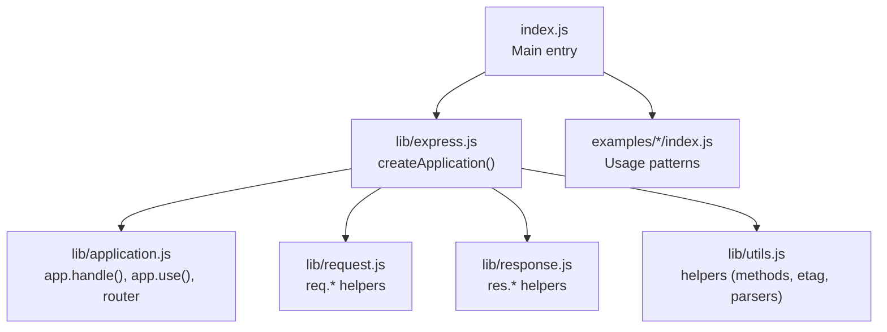
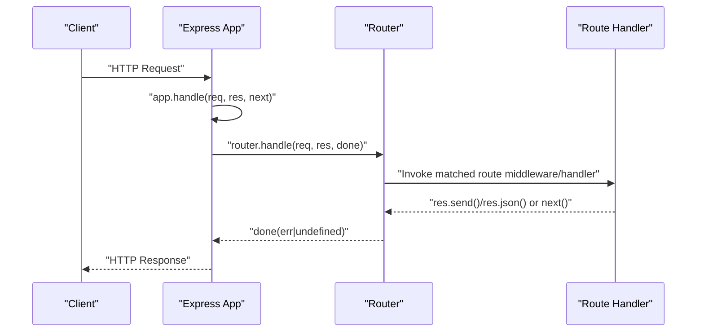
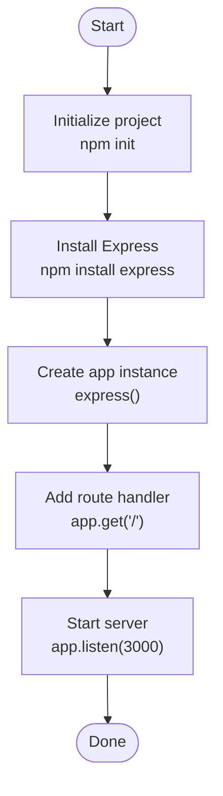
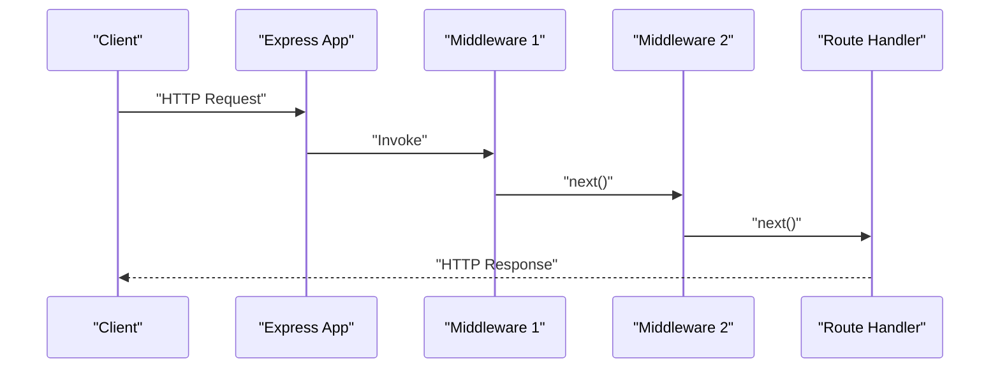
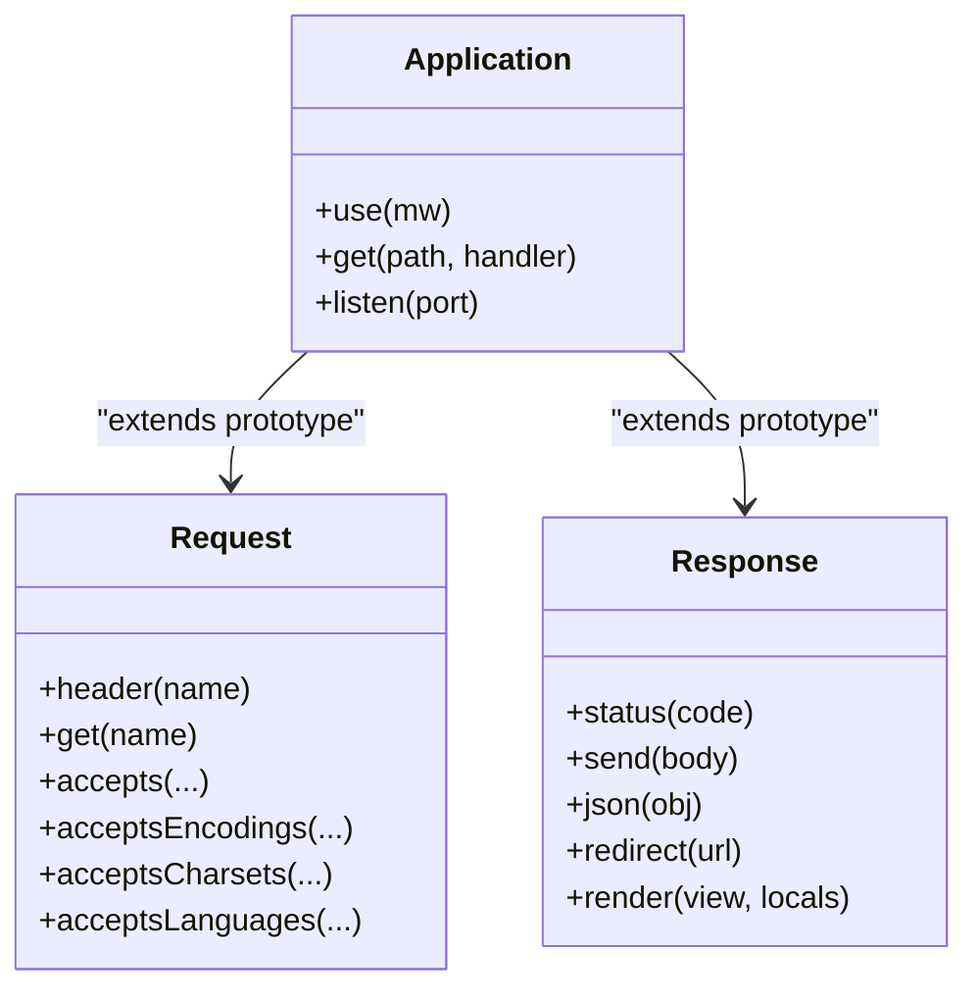

# Getting Started

<cite>
**Referenced Files in This Document**
- [package.json](file://package.json)
- [Readme.md](file://Readme.md)
- [index.js](file://index.js)
- [lib/express.js](file://lib/express.js)
- [lib/application.js](file://lib/application.js)
- [lib/request.js](file://lib/request.js)
- [lib/response.js](file://lib/response.js)
- [lib/utils.js](file://lib/utils.js)
- [examples/hello-world/index.js](file://examples/hello-world/index.js)
- [examples/static-files/index.js](file://examples/static-files/index.js)
- [examples/route-middleware/index.js](file://examples/route-middleware/index.js)
- [examples/web-service/index.js](file://examples/web-service/index.js)
- [examples/error/index.js](file://examples/error/index.js)
- [examples/params/index.js](file://examples/params/index.js)
- [examples/multi-router/index.js](file://examples/multi-router/index.js)
</cite>

## Table of Contents
1. [Introduction](#introduction)
2. [Project Structure](#project-structure)
3. [Core Components](#core-components)
4. [Architecture Overview](#architecture-overview)
5. [Detailed Component Analysis](#detailed-component-analysis)
6. [Dependency Analysis](#dependency-analysis)
7. [Performance Considerations](#performance-considerations)
8. [Troubleshooting Guide](#troubleshooting-guide)
9. [Conclusion](#conclusion)
10. [Appendices](#appendices)

## Introduction
This guide helps you get started with Express.js, a fast and minimalist web framework for Node.js. You will learn how to install Express, meet the Node.js version requirement, and build your first application. You will also explore core concepts such as application creation, middleware, routing, and request/response handling, along with practical examples and best practices for beginners.

## Project Structure
Express exposes a small core with a clear separation of concerns:
- The main entry point re-exports the internal library.
- The library provides the application factory, request/response extensions, and built-in middleware shims.
- The examples demonstrate real-world usage patterns for routes, middleware, static files, error handling, and more.

**Diagram sources**
- [index.js:1-12](file://index.js#L1-L12)
- [lib/express.js:1-82](file://lib/express.js#L1-L82)
- [lib/application.js:1-200](file://lib/application.js#L1-L200)
- [lib/request.js:1-200](file://lib/request.js#L1-L200)
- [lib/response.js:1-200](file://lib/response.js#L1-L200)
- [lib/utils.js:1-200](file://lib/utils.js#L1-L200)

**Section sources**
- [index.js:1-12](file://index.js#L1-L12)
- [lib/express.js:1-82](file://lib/express.js#L1-L82)
- [lib/application.js:1-200](file://lib/application.js#L1-L200)
- [lib/request.js:1-200](file://lib/request.js#L1-L200)
- [lib/response.js:1-200](file://lib/response.js#L1-L200)
- [lib/utils.js:1-200](file://lib/utils.js#L1-L200)

## Core Components
- Application factory: Creates an Express app with request/response prototypes and default configuration.
- Router: Routes HTTP requests to handlers and supports middleware composition.
- Request and response: Extended Node.js core objects with convenience methods.
- Built-in middleware shims: JSON, raw, text, urlencoded, and static helpers exposed from the library.

Key responsibilities:
- Application initialization and default settings.
- Request lifecycle dispatch through the router.
- Middleware registration and invocation order.
- Response helpers for sending data, setting headers, and managing status codes.

**Section sources**
- [lib/express.js:36-56](file://lib/express.js#L36-L56)
- [lib/application.js:59-141](file://lib/application.js#L59-L141)
- [lib/application.js:152-178](file://lib/application.js#L152-L178)
- [lib/request.js:63-83](file://lib/request.js#L63-L83)
- [lib/response.js:125-200](file://lib/response.js#L125-L200)
- [lib/express.js:77-82](file://lib/express.js#L77-L82)

## Architecture Overview
Express composes a minimal HTTP server around a router and a set of middleware. Requests flow through the application’s middleware stack and are dispatched to registered routes. Responses are generated via response helpers.

**Diagram sources**
- [lib/application.js:152-178](file://lib/application.js#L152-L178)
- [lib/express.js:36-56](file://lib/express.js#L36-L56)

## Detailed Component Analysis

### First Express Application
Follow these steps to create and run your first application:
- Initialize a Node.js project and install Express.
- Create an app instance.
- Register a route handler for a path.
- Start the server on a port.

Practical example reference:
- [examples/hello-world/index.js:1-16](file://examples/hello-world/index.js#L1-L16)

**Section sources**
- [Readme.md:48-68](file://Readme.md#L48-L68)
- [examples/hello-world/index.js:1-16](file://examples/hello-world/index.js#L1-L16)

### Middleware and Routing
Middleware functions sit between the incoming request and the route handler. They can:
- Perform tasks such as logging, parsing request bodies, or enforcing authentication.
- Call next() to pass control to the next middleware or route.
- Handle errors by calling next(err).

Routing binds HTTP methods and paths to handlers. Middleware can be global, per-route, or mounted under a path.

Practical example references:
- [examples/route-middleware/index.js:1-91](file://examples/route-middleware/index.js#L1-L91)
- [examples/web-service/index.js:1-118](file://examples/web-service/index.js#L1-L118)
- [examples/error/index.js:1-54](file://examples/error/index.js#L1-L54)

**Section sources**
- [lib/application.js:190-200](file://lib/application.js#L190-L200)
- [lib/application.js:68-83](file://lib/application.js#L68-L83)
- [examples/route-middleware/index.js:1-91](file://examples/route-middleware/index.js#L1-L91)
- [examples/web-service/index.js:1-118](file://examples/web-service/index.js#L1-L118)
- [examples/error/index.js:1-54](file://examples/error/index.js#L1-L54)

### Request and Response Handling
Requests and responses are extended with helpers:
- Request helpers: Header retrieval, content negotiation, IP and proxy address parsing, and more.
- Response helpers: Status code setting, content negotiation, JSON/HTML/Buffer sending, cookies, redirects, and static file serving.

**Diagram sources**
- [lib/request.js:63-83](file://lib/request.js#L63-L83)
- [lib/response.js:125-200](file://lib/response.js#L125-L200)
- [lib/application.js:59-141](file://lib/application.js#L59-L141)

**Section sources**
- [lib/request.js:63-83](file://lib/request.js#L63-L83)
- [lib/response.js:64-76](file://lib/response.js#L64-L76)
- [lib/response.js:125-200](file://lib/response.js#L125-L200)
- [lib/application.js:59-141](file://lib/application.js#L59-L141)

### Static Files and Mounting
Serve static assets by mounting the static middleware. You can serve from multiple directories and optionally prefix paths.

Practical example reference:
- [examples/static-files/index.js:1-44](file://examples/static-files/index.js#L1-L44)

**Section sources**
- [examples/static-files/index.js:1-44](file://examples/static-files/index.js#L1-L44)

### Parameter Extraction and Validation
Use param hooks to transform or validate route parameters before reaching route handlers. Combine with error handling to manage invalid inputs.

Practical example reference:
- [examples/params/index.js:1-75](file://examples/params/index.js#L1-L75)

**Section sources**
- [examples/params/index.js:1-75](file://examples/params/index.js#L1-L75)

### Multi-Router Composition
Mount separate routers under different paths to organize your application into cohesive modules.

Practical example reference:
- [examples/multi-router/index.js:1-19](file://examples/multi-router/index.js#L1-L19)

**Section sources**
- [examples/multi-router/index.js:1-19](file://examples/multi-router/index.js#L1-L19)

## Dependency Analysis
Express depends on a set of core modules for HTTP, content negotiation, cookies, static serving, and more. These dependencies are declared in the project metadata.

```mermaid
graph TB
Express["express (this package)"] --> BodyParser["body-parser"]
Express --> Router["router"]
Express --> ServeStatic["serve-static"]
Express --> FinalHandler["finalhandler"]
Express --> Debug["debug"]
Express --> ETag["etag"]
Express --> HTTPError["http-errors"]
Express --> MimeTypes["mime-types"]
Express --> OnFinished["on-finished"]
Express --> ParseURL["parseurl"]
Express --> ProxyAddr["proxy-addr"]
Express --> QS["qs"]
Express --> RangeParser["range-parser"]
Express --> Send["send"]
Express --> Statuses["statuses"]
Express --> TypeIs["type-is"]
Express --> Vary["vary"]
Express --> Accepts["accepts"]
Express --> Cookie["cookie"]
Express --> CookieSignature["cookie-signature"]
Express --> EncodeURL["encodeurl"]
Express --> EscapeHTML["escape-html"]
Express --> Fresh["fresh"]
Express --> MergeDescriptors["merge-descriptors"]
Express --> Depd["depd"]
Express --> Once["once"]
```

**Diagram sources**
- [package.json:34-62](file://package.json#L34-L62)

**Section sources**
- [package.json:34-62](file://package.json#L34-L62)

## Performance Considerations
- Keep middleware lean and ordered to minimize overhead.
- Prefer streaming for large static files and avoid unnecessary buffering.
- Use appropriate ETag strategies and caching headers.
- Avoid synchronous blocking operations in middleware and route handlers.

[No sources needed since this section provides general guidance]

## Troubleshooting Guide
Common issues and remedies:
- Incorrect Node.js version: Ensure Node.js meets the minimum requirement.
- Port conflicts: Change the port when 3000 is in use.
- Missing error handlers: Add an error-handling middleware with four arguments to catch thrown errors and next(err).
- 404 responses: Add a default catch-all middleware after your routes.

Practical references:
- Node.js requirement and installation steps: [Readme.md:48-68](file://Readme.md#L48-L68)
- Error handling pattern: [examples/error/index.js:1-54](file://examples/error/index.js#L1-L54)
- Catch-all 404 pattern: [examples/web-service/index.js:105-112](file://examples/web-service/index.js#L105-L112)

**Section sources**
- [Readme.md:48-68](file://Readme.md#L48-L68)
- [examples/error/index.js:1-54](file://examples/error/index.js#L1-L54)
- [examples/web-service/index.js:105-112](file://examples/web-service/index.js#L105-L112)

## Conclusion
You now have the essentials to install Express, scaffold a basic application, register routes, apply middleware, and handle requests and responses. Explore the examples to deepen your understanding and adopt the recommended workflows and best practices.

[No sources needed since this section summarizes without analyzing specific files]

## Appendices

### Installation and Setup
- Prerequisites: Node.js version requirement is documented in the project metadata.
- Steps: Initialize a project, install Express, create an app, define routes, and start the server.

References:
- Engines requirement: [package.json:82-84](file://package.json#L82-L84)
- Installation instructions: [Readme.md:48-68](file://Readme.md#L48-L68)
- Quick start with generator: [Readme.md:87-116](file://Readme.md#L87-L116)

**Section sources**
- [package.json:82-84](file://package.json#L82-L84)
- [Readme.md:48-68](file://Readme.md#L48-L68)
- [Readme.md:87-116](file://Readme.md#L87-L116)

### Learning Progression
- Start with the hello world example.
- Add middleware and static files.
- Introduce parameter extraction and validation.
- Organize routes with multiple routers.
- Implement error handling and 404 handling.

References:
- Hello world: [examples/hello-world/index.js:1-16](file://examples/hello-world/index.js#L1-L16)
- Static files: [examples/static-files/index.js:1-44](file://examples/static-files/index.js#L1-L44)
- Params: [examples/params/index.js:1-75](file://examples/params/index.js#L1-L75)
- Multi-router: [examples/multi-router/index.js:1-19](file://examples/multi-router/index.js#L1-L19)
- Error handling: [examples/error/index.js:1-54](file://examples/error/index.js#L1-L54)
- Web service patterns: [examples/web-service/index.js:1-118](file://examples/web-service/index.js#L1-L118)

**Section sources**
- [examples/hello-world/index.js:1-16](file://examples/hello-world/index.js#L1-L16)
- [examples/static-files/index.js:1-44](file://examples/static-files/index.js#L1-L44)
- [examples/params/index.js:1-75](file://examples/params/index.js#L1-L75)
- [examples/multi-router/index.js:1-19](file://examples/multi-router/index.js#L1-L19)
- [examples/error/index.js:1-54](file://examples/error/index.js#L1-L54)
- [examples/web-service/index.js:1-118](file://examples/web-service/index.js#L1-L118)