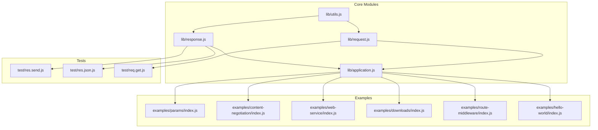
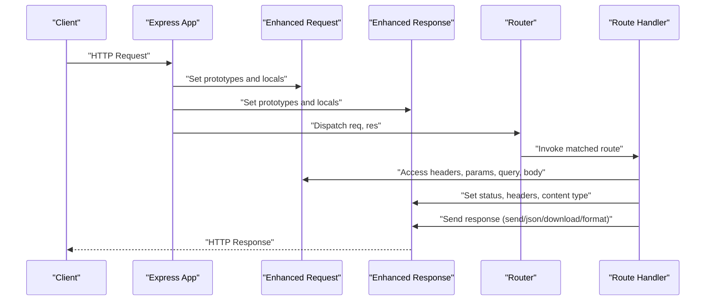
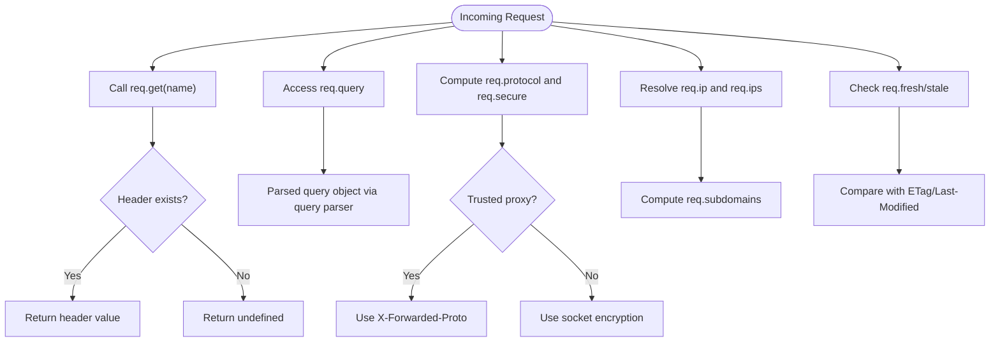
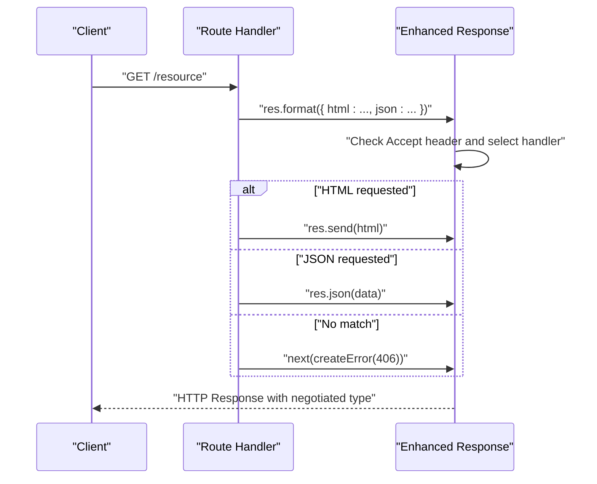
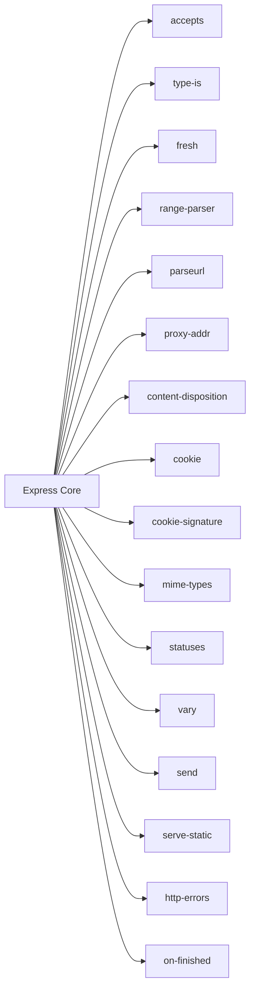

# HTTP Handling

<cite>
**Referenced Files in This Document**
- [request.js](file://lib/request.js)
- [response.js](file://lib/response.js)
- [utils.js](file://lib/utils.js)
- [application.js](file://lib/application.js)
- [params/index.js](file://examples/params/index.js)
- [content-negotiation/index.js](file://examples/content-negotiation/index.js)
- [web-service/index.js](file://examples/web-service/index.js)
- [downloads/index.js](file://examples/downloads/index.js)
- [route-middleware/index.js](file://examples/route-middleware/index.js)
- [hello-world/index.js](file://examples/hello-world/index.js)
- [res.send.js](file://test/res.send.js)
- [res.json.js](file://test/res.json.js)
- [req.get.js](file://test/req.get.js)
- [package.json](file://package.json)
</cite>

## Table of Contents
1. [Introduction](#introduction)
2. [Project Structure](#project-structure)
3. [Core Components](#core-components)
4. [Architecture Overview](#architecture-overview)
5. [Detailed Component Analysis](#detailed-component-analysis)
6. [Dependency Analysis](#dependency-analysis)
7. [Performance Considerations](#performance-considerations)
8. [Troubleshooting Guide](#troubleshooting-guide)
9. [Conclusion](#conclusion)

## Introduction
This document explains HTTP handling in Express.js with a focus on the enhanced request and response objects. It covers how to access headers, parameters, query strings, and body data from the request object, and how to send various response types (JSON, HTML, files) using the response object. It also documents HTTP method handling, status codes, headers manipulation, and content negotiation. Practical examples are drawn from the repository’s examples and tests to demonstrate parameter extraction, query processing, body parsing, and response generation. Best practices and performance considerations are included to help build efficient HTTP APIs and applications.

## Project Structure
Express.js organizes HTTP handling around three primary modules:
- Request enhancements: extended properties and helpers for headers, URLs, IP addresses, freshness, and content negotiation.
- Response helpers: methods for status codes, headers, content types, JSON/JSONP, file downloads, redirects, and content negotiation.
- Utilities and application bootstrap: HTTP method lists, ETag generation, query parsing, trust proxy compilation, and the request/response prototype wiring.

**Diagram sources**
- [request.js:30-528](file://lib/request.js#L30-L528)
- [response.js:42-800](file://lib/response.js#L42-L800)
- [utils.js:25-272](file://lib/utils.js#L25-L272)
- [application.js:59-178](file://lib/application.js#L59-L178)
- [params/index.js:1-75](file://examples/params/index.js#L1-L75)
- [content-negotiation/index.js:1-47](file://examples/content-negotiation/index.js#L1-L47)
- [web-service/index.js:1-118](file://examples/web-service/index.js#L1-L118)
- [downloads/index.js:1-41](file://examples/downloads/index.js#L1-L41)
- [route-middleware/index.js:1-91](file://examples/route-middleware/index.js#L1-L91)
- [hello-world/index.js:1-16](file://examples/hello-world/index.js#L1-L16)
- [res.send.js:1-570](file://test/res.send.js#L1-L570)
- [res.json.js:1-187](file://test/res.json.js#L1-L187)
- [req.get.js:1-61](file://test/req.get.js#L1-L61)

**Section sources**
- [request.js:30-528](file://lib/request.js#L30-L528)
- [response.js:42-800](file://lib/response.js#L42-L800)
- [utils.js:25-272](file://lib/utils.js#L25-L272)
- [application.js:59-178](file://lib/application.js#L59-L178)

## Core Components
- Enhanced request object (prototype): Adds getters and helpers for headers, URL, protocol, IP, subdomains, freshness, and content negotiation.
- Enhanced response object (prototype): Adds setters/getters for headers, status codes, content types, JSON/JSONP, file streaming, downloads, redirects, and content negotiation.
- Utilities: Provides HTTP method constants, ETag generators, query parser compilation, trust proxy compilation, and charset normalization.
- Application bootstrap: Wires request/response prototypes, sets defaults, and dispatches requests through the router.

Key capabilities:
- Access headers via req.get and aliases.
- Extract parameters, query strings, and body content.
- Control status codes, headers, and content types.
- Negotiate content types and send appropriate responses.
- Stream files and attachments.
- Manage cookies and redirects.

**Section sources**
- [request.js:63-528](file://lib/request.js#L63-L528)
- [response.js:64-800](file://lib/response.js#L64-L800)
- [utils.js:25-272](file://lib/utils.js#L25-L272)
- [application.js:59-178](file://lib/application.js#L59-L178)

## Architecture Overview
Express wires request and response prototypes to the application, then routes requests through a router. The request object inherits from Node’s IncomingMessage and gains helpers for headers, URL parsing, IP resolution, and freshness. The response object inherits from Node’s ServerResponse and gains helpers for status, headers, content types, JSON, file streaming, and content negotiation.

**Diagram sources**
- [application.js:152-178](file://lib/application.js#L152-L178)
- [request.js:30-528](file://lib/request.js#L30-L528)
- [response.js:42-800](file://lib/response.js#L42-L800)

## Detailed Component Analysis

### Request Object: Headers, Parameters, Query, Body, Protocol, IP, Freshness
- Header access:
  - req.get(name) and alias req.header(name) return header values, with special handling for Referer/Referrer.
  - Throws for invalid inputs.
- URL and protocol:
  - req.protocol, req.secure, req.path, req.host, req.hostname.
  - Trust proxy-aware resolution for X-Forwarded-Proto and X-Forwarded-Host.
- IP and subdomains:
  - req.ip and req.ips resolve trusted proxy hops.
  - req.subdomains computes subdomain segments based on offset.
- Query string:
  - req.query parses the query string using the configured query parser function.
- Content type and media type:
  - req.is(types...) checks Content-Type against given types.
- Freshness:
  - req.fresh and req.stale compare request with response ETag/Last-Modified.
- XMLHttpRequest detection:
  - req.xhr detects X-Requested-With header.

Practical examples:
- Parameter extraction and coercion: [params/index.js:23-41](file://examples/params/index.js#L23-L41)
- Query processing: [web-service/index.js:30-42](file://examples/web-service/index.js#L30-L42)
- Header access and validation: [req.get.js:9-58](file://test/req.get.js#L9-L58)

**Diagram sources**
- [request.js:63-528](file://lib/request.js#L63-L528)
- [utils.js:162-184](file://lib/utils.js#L162-L184)

**Section sources**
- [request.js:63-528](file://lib/request.js#L63-L528)
- [utils.js:162-184](file://lib/utils.js#L162-L184)
- [params/index.js:23-41](file://examples/params/index.js#L23-L41)
- [web-service/index.js:30-42](file://examples/web-service/index.js#L30-L42)
- [req.get.js:9-58](file://test/req.get.js#L9-L58)

### Response Object: Status Codes, Headers, Content Types, JSON, Files, Downloads, Redirects, Content Negotiation
- Status and headers:
  - res.status(code) validates and sets status.
  - res.set(field, val) and res.header(field, val) set headers; res.get(field) retrieves header.
  - res.append(field, val) concatenates header values.
- Content types:
  - res.type(type) and res.contentType(type) set Content-Type with charset normalization.
- Sending responses:
  - res.send(body) auto-detects type, sets Content-Type, handles ETag, and strips irrelevant headers for 204/304/205.
  - res.json(obj) serializes and sends JSON; honors app settings for replacer/spaces/escape.
  - res.jsonp(obj) supports JSONP callback with security mitigations.
  - res.sendStatus(code) sends a textual status message.
- File handling:
  - res.sendFile(path, options, callback) streams files with caching support.
  - res.download(path, filename?, options?, callback?) serves files as attachments.
- Redirects and locations:
  - res.location(url) sets Location header; res.redirect(status?, url) performs redirect.
- Content negotiation:
  - res.format(map) selects handler based on Accept header.
  - res.links(map) sets Link header for pagination.
- Cookies:
  - res.cookie(name, value, options) and res.clearCookie(name, options) manage cookies.

Practical examples:
- Content negotiation: [content-negotiation/index.js:9-27](file://examples/content-negotiation/index.js#L9-L27)
- Web service with API key validation and JSON responses: [web-service/index.js:30-91](file://examples/web-service/index.js#L30-L91)
- File downloads with error handling: [downloads/index.js:26-34](file://examples/downloads/index.js#L26-L34)
- Route middleware and redirects: [route-middleware/index.js:65-84](file://examples/route-middleware/index.js#L65-L84)
- Hello world minimal response: [hello-world/index.js:7-9](file://examples/hello-world/index.js#L7-L9)

**Diagram sources**
- [response.js:569-594](file://lib/response.js#L569-L594)
- [content-negotiation/index.js:9-27](file://examples/content-negotiation/index.js#L9-L27)

**Section sources**
- [response.js:64-800](file://lib/response.js#L64-L800)
- [content-negotiation/index.js:9-27](file://examples/content-negotiation/index.js#L9-L27)
- [web-service/index.js:30-91](file://examples/web-service/index.js#L30-L91)
- [downloads/index.js:26-34](file://examples/downloads/index.js#L26-L34)
- [route-middleware/index.js:65-84](file://examples/route-middleware/index.js#L65-L84)
- [hello-world/index.js:7-9](file://examples/hello-world/index.js#L7-L9)

### HTTP Method Handling and Routing
- Express exposes supported HTTP methods via utils.methods and uses them across the framework.
- Routes can be registered for specific methods or all methods, and middleware can intercept requests before handlers.

Practical examples:
- Multi-router controllers demonstrating GET routes: [multi-router/controllers/api_v1.js:7-13](file://examples/multi-router/controllers/api_v1.js#L7-L13), [multi-router/controllers/api_v2.js:7-13](file://examples/multi-router/controllers/api_v2.js#L7-L13)
- General hello world GET route: [hello-world/index.js:7-9](file://examples/hello-world/index.js#L7-L9)

**Section sources**
- [utils.js:25-29](file://lib/utils.js#L25-L29)
- [multi-router/controllers/api_v1.js:7-13](file://examples/multi-router/controllers/api_v1.js#L7-L13)
- [multi-router/controllers/api_v2.js:7-13](file://examples/multi-router/controllers/api_v2.js#L7-L13)
- [hello-world/index.js:7-9](file://examples/hello-world/index.js#L7-L9)

### Content Negotiation and Accept Headers
- req.accepts(types) selects the best media type.
- req.acceptsEncodings(encodings), req.acceptsCharsets(charsets), req.acceptsLanguages(languages) handle other Accept-* headers.
- res.format(map) chooses the appropriate handler based on Accept header and sets Content-Type accordingly.

Practical examples:
- Content negotiation with HTML/text/json: [content-negotiation/index.js:9-27](file://examples/content-negotiation/index.js#L9-L27)

**Section sources**
- [request.js:127-187](file://lib/request.js#L127-L187)
- [response.js:569-594](file://lib/response.js#L569-L594)
- [content-negotiation/index.js:9-27](file://examples/content-negotiation/index.js#L9-L27)

### Body Parsing and Content Type Validation
- req.is(types...) checks the request’s Content-Type against provided types.
- Body parsing is typically handled by middleware (e.g., body-parser), while req.is helps route handlers decide how to process the body.

Practical examples:
- Using req.is to validate content type: [web-service/index.js:30-42](file://examples/web-service/index.js#L30-L42)

**Section sources**
- [request.js:269-281](file://lib/request.js#L269-L281)
- [web-service/index.js:30-42](file://examples/web-service/index.js#L30-L42)

### File Streaming and Downloads
- res.sendFile(path, options, callback) streams files with caching and error handling.
- res.download(path, filename?, options?, callback?) serves files as attachments with Content-Disposition.
- Tests demonstrate behavior for missing files and error propagation.

Practical examples:
- Download handling with fallback: [downloads/index.js:26-34](file://examples/downloads/index.js#L26-L34)
- Test coverage for sendFile behavior: [res.send.js:139-206](file://test/res.send.js#L139-L206), [res.send.js:337-347](file://test/res.send.js#L337-L347)

**Section sources**
- [response.js:371-413](file://lib/response.js#L371-L413)
- [response.js:433-482](file://lib/response.js#L433-L482)
- [downloads/index.js:26-34](file://examples/downloads/index.js#L26-L34)
- [res.send.js:139-206](file://test/res.send.js#L139-L206)
- [res.send.js:337-347](file://test/res.send.js#L337-L347)

### Cookies and Security
- res.cookie(name, value, options) sets signed or unsigned cookies with path defaults and expiration handling.
- res.clearCookie(name, options) clears cookies by expiring them.
- Signed cookies require a secret from the request.

Practical examples:
- Cookie usage in route middleware: [route-middleware/index.js:65-68](file://examples/route-middleware/index.js#L65-L68)

**Section sources**
- [response.js:742-775](file://lib/response.js#L742-L775)
- [route-middleware/index.js:65-68](file://examples/route-middleware/index.js#L65-L68)

## Dependency Analysis
Express depends on several packages for HTTP handling:
- accepts, type-is, fresh, range-parser, parseurl, proxy-addr: request helpers for Accept headers, content types, cache validation, range parsing, URL parsing, and proxy address resolution.
- content-disposition, cookie, cookie-signature, mime-types, statuses, vary: response helpers for content disposition, cookies, content types, status messages, and Vary header.
- send, serve-static: file streaming and static file serving.
- http-errors, on-finished: error creation and lifecycle hooks.

**Diagram sources**
- [package.json:34-62](file://package.json#L34-L62)

**Section sources**
- [package.json:34-62](file://package.json#L34-L62)

## Performance Considerations
- ETag generation:
  - Express can compute ETags automatically; tune via app settings (strong vs weak) or provide a custom generator.
  - Tests demonstrate ETag behavior for strings, buffers, and custom functions.
- Content-Length and HEAD:
  - res.send computes Content-Length when possible; HEAD requests skip the body.
- 204/304/205 semantics:
  - Express strips irrelevant headers for these status codes to minimize payload.
- Query parsing:
  - Choose a query parser strategy (simple vs extended) based on your needs; extended parsing may increase CPU cost.
- File streaming:
  - Prefer res.sendFile for large files; leverage caching and range requests where applicable.

[No sources needed since this section provides general guidance]

## Troubleshooting Guide
Common issues and resolutions:
- Header access errors:
  - req.get requires a string name; ensure correct usage and handle missing headers gracefully.
  - Reference: [req.get.js:36-58](file://test/req.get.js#L36-L58)
- Status code validation:
  - res.status expects an integer in the 100–999 range; invalid inputs throw errors.
  - Reference: [response.js:64-76](file://lib/response.js#L64-L76)
- JSON and JSONP:
  - res.json respects app settings for replacer, spaces, and escaping; JSONP is handled by res.jsonp with security mitigations.
  - References: [res.json.js:106-184](file://test/res.json.js#L106-L184), [response.js:232-304](file://lib/response.js#L232-L304)
- File downloads:
  - Missing files result in 404; implement fallback handling or next(err) appropriately.
  - Reference: [downloads/index.js:26-34](file://examples/downloads/index.js#L26-L34)
- Freshness and caching:
  - 304 responses rely on ETag/Last-Modified; ensure headers are set and conditions match.
  - Reference: [res.send.js:272-335](file://test/res.send.js#L272-L335)

**Section sources**
- [req.get.js:36-58](file://test/req.get.js#L36-L58)
- [response.js:64-76](file://lib/response.js#L64-L76)
- [res.json.js:106-184](file://test/res.json.js#L106-L184)
- [response.js:232-304](file://lib/response.js#L232-L304)
- [downloads/index.js:26-34](file://examples/downloads/index.js#L26-L34)
- [res.send.js:272-335](file://test/res.send.js#L272-L335)

## Conclusion
Express enhances Node’s HTTP primitives with a rich set of helpers for request and response handling. The request object simplifies access to headers, parameters, query strings, and protocol details, while the response object streamlines sending varied content types, managing headers and cookies, and negotiating content. Combined with robust utilities and tested behaviors, these features enable efficient and maintainable HTTP APIs and applications.