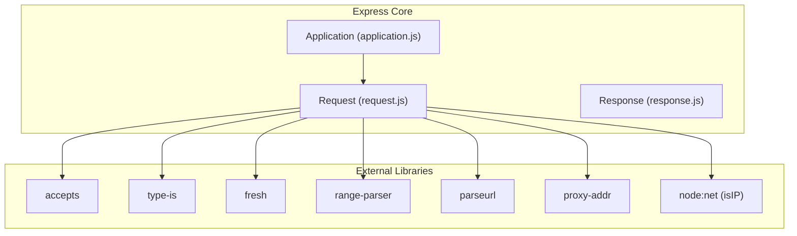
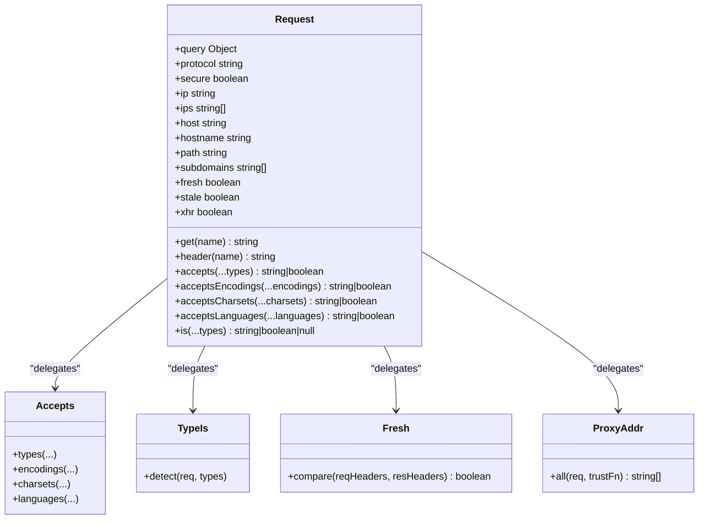
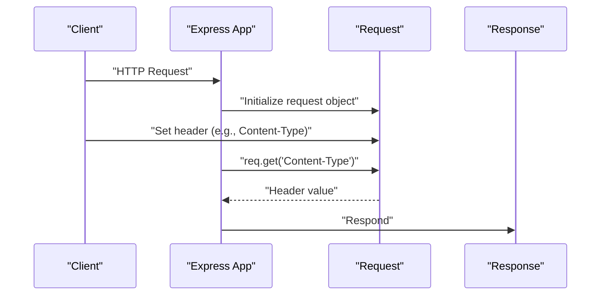
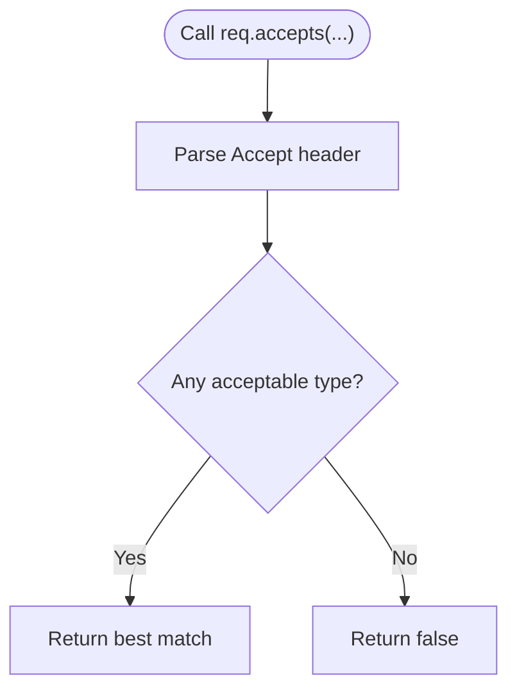
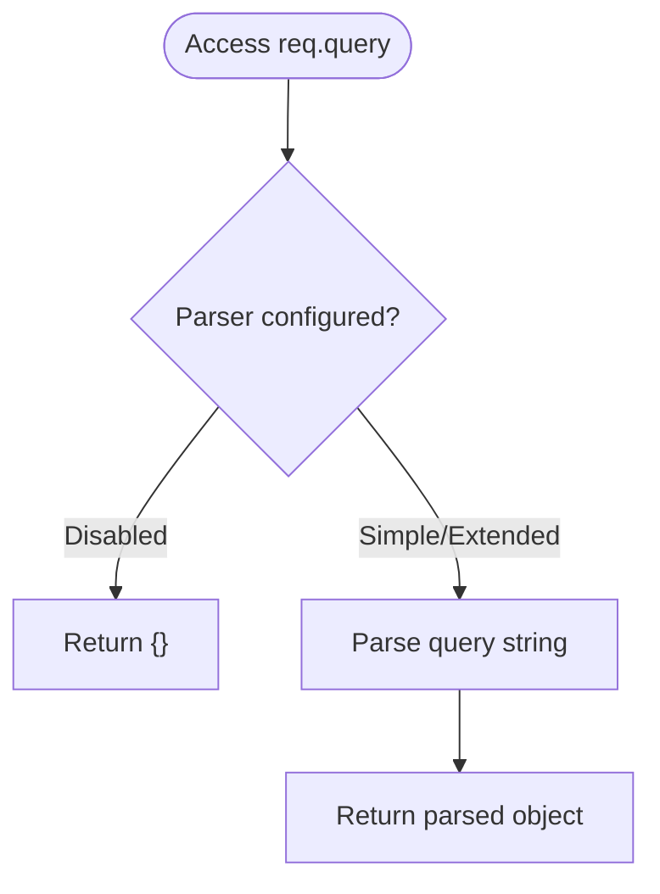
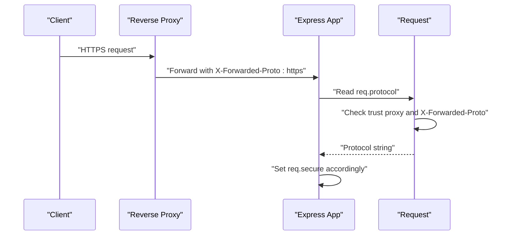
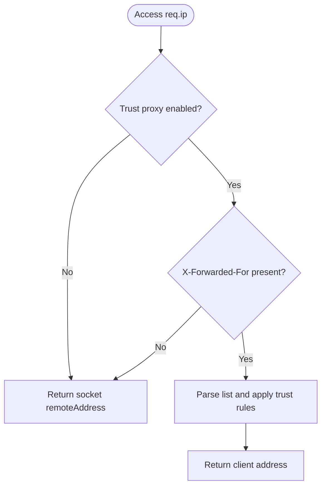
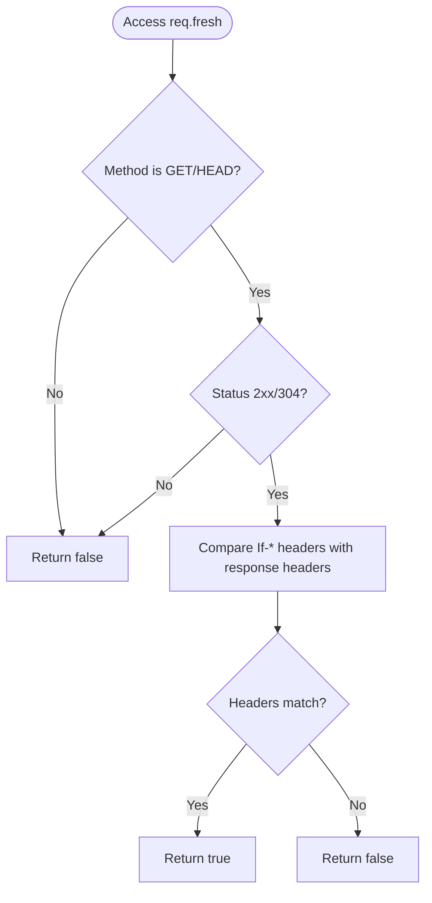
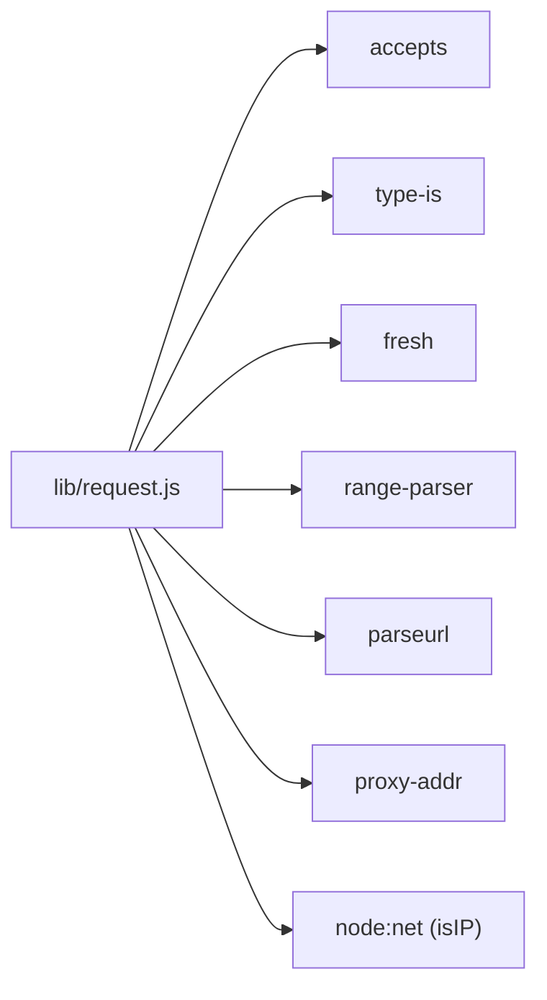

# Request Object

<cite>
**Referenced Files in This Document**
- [request.js](file://lib/request.js)
- [req.get.js](file://test/req.get.js)
- [req.accepts.js](file://test/req.accepts.js)
- [req.acceptsEncodings.js](file://test/req.acceptsEncodings.js)
- [req.acceptsCharsets.js](file://test/req.acceptsCharsets.js)
- [req.acceptsLanguages.js](file://test/req.acceptsLanguages.js)
- [req.query.js](file://test/req.query.js)
- [req.is.js](file://test/req.is.js)
- [req.protocol.js](file://test/req.protocol.js)
- [req.secure.js](file://test/req.secure.js)
- [req.ip.js](file://test/req.ip.js)
- [req.ips.js](file://test/req.ips.js)
- [req.host.js](file://test/req.host.js)
- [req.hostname.js](file://test/req.hostname.js)
- [req.path.js](file://test/req.path.js)
- [req.subdomains.js](file://test/req.subdomains.js)
- [req.fresh.js](file://test/req.fresh.js)
- [req.stale.js](file://test/req.stale.js)
- [req.xhr.js](file://test/req.xhr.js)
</cite>

## Table of Contents
1. [Introduction](#introduction)
2. [Project Structure](#project-structure)
3. [Core Components](#core-components)
4. [Architecture Overview](#architecture-overview)
5. [Detailed Component Analysis](#detailed-component-analysis)
6. [Dependency Analysis](#dependency-analysis)
7. [Performance Considerations](#performance-considerations)
8. [Troubleshooting Guide](#troubleshooting-guide)
9. [Conclusion](#conclusion)

## Introduction
This document provides comprehensive documentation for the Express.js Request object. It explains all request properties and methods used during HTTP communication, including header access, content negotiation, parameter extraction, body type checking, protocol detection, IP address handling, hostname/host resolution, path extraction, subdomain calculation, freshness checking, and XHR detection. Practical usage patterns, middleware integration, security considerations for proxy headers, and performance tips are included to help developers build robust and secure applications.

## Project Structure
The Express Request object is implemented in a dedicated module and extensively tested through unit tests. The following diagram shows how the request module integrates with Express internals and external libraries.

**Diagram sources**
- [request.js:16-23](file://lib/request.js#L16-L23)
- [request.js:30](file://lib/request.js#L30)

**Section sources**
- [request.js:16-37](file://lib/request.js#L16-L37)

## Core Components
This section summarizes the primary request properties and methods implemented in the request module, grouped by functional area.

- Header Access
  - req.get(name) and req.header(name): Retrieve header values with special-case handling for Referer/Referrer.
  - Behavior validated by tests covering presence, absence, and error conditions.

- Content Negotiation
  - req.accepts(...types): Match requested media types against Accept header.
  - req.acceptsEncodings(...encodings): Match compression encodings against Accept-Encoding.
  - req.acceptsCharsets(...charsets): Match character sets against Accept-Charset.
  - req.acceptsLanguages(...languages): Match languages against Accept-Language.

- Parameter Extraction and Query String Processing
  - req.query: Parsed query string controlled by the "query parser" setting.

- Body Type Checking
  - req.is(...types): Check Content-Type against given MIME types or extensions.

- Protocol Detection and Security
  - req.protocol: HTTP or HTTPS, honoring trust proxy and X-Forwarded-Proto.
  - req.secure: Boolean shortcut for protocol === "https".

- IP Address Handling
  - req.ip: Remote address respecting trust proxy and X-Forwarded-For.
  - req.ips: Array of all proxied addresses up to trusted boundary.

- Hostname and Host Resolution
  - req.host: Host value including port when present.
  - req.hostname: Host value excluding port.

- Path Extraction
  - req.path: Parsed pathname from URL.

- Subdomain Calculation
  - req.subdomains: Array of subdomain segments derived from hostname and configured subdomain offset.

- Freshness Checking
  - req.fresh: Weak validation for cache freshness using ETag and Last-Modified.
  - req.stale: Negation of freshness.

- XHR Detection
  - req.xhr: Detect AJAX requests via X-Requested-With header.

**Section sources**
- [request.js:63-83](file://lib/request.js#L63-L83)
- [request.js:127-130](file://lib/request.js#L127-L130)
- [request.js:140-143](file://lib/request.js#L140-L143)
- [request.js:171-174](file://lib/request.js#L171-L174)
- [request.js:185-187](file://lib/request.js#L185-L187)
- [request.js:230-241](file://lib/request.js#L230-L241)
- [request.js:269-281](file://lib/request.js#L269-L281)
- [request.js:297-315](file://lib/request.js#L297-L315)
- [request.js:326-328](file://lib/request.js#L326-L328)
- [request.js:340-343](file://lib/request.js#L340-L343)
- [request.js:357-366](file://lib/request.js#L357-L366)
- [request.js:418-431](file://lib/request.js#L418-L431)
- [request.js:444-458](file://lib/request.js#L444-L458)
- [request.js:403-405](file://lib/request.js#L403-L405)
- [request.js:383-394](file://lib/request.js#L383-L394)
- [request.js:469-486](file://lib/request.js#L469-L486)
- [request.js:497-499](file://lib/request.js#L497-L499)
- [request.js:508-511](file://lib/request.js#L508-L511)

## Architecture Overview
The Request object extends the Node.js IncomingMessage prototype and augments it with convenience getters and methods. It delegates to specialized libraries for content negotiation, type checking, freshness, range parsing, URL parsing, and proxy address resolution.

**Diagram sources**
- [request.js:16-23](file://lib/request.js#L16-L23)
- [request.js:63-83](file://lib/request.js#L63-L83)
- [request.js:127-130](file://lib/request.js#L127-L130)
- [request.js:140-143](file://lib/request.js#L140-L143)
- [request.js:171-174](file://lib/request.js#L171-L174)
- [request.js:185-187](file://lib/request.js#L185-L187)
- [request.js:269-281](file://lib/request.js#L269-L281)
- [request.js:469-486](file://lib/request.js#L469-L486)
- [request.js:357-366](file://lib/request.js#L357-L366)

## Detailed Component Analysis

### Header Access: req.get() and req.header()
- Purpose: Retrieve header values with case-insensitive lookup and special handling for Referer/Referrer.
- Behavior:
  - Throws if name is missing or not a string.
  - Returns the appropriate header value; Referer/Referrer are normalized.
- Practical usage:
  - Access Content-Type, Accept, Authorization, etc.
  - Use consistently via req.get() or alias req.header().
- Middleware integration:
  - Available in all route handlers and middleware after request arrives.

**Diagram sources**
- [request.js:63-83](file://lib/request.js#L63-L83)
- [req.get.js:9-21](file://test/req.get.js#L9-L21)

**Section sources**
- [request.js:63-83](file://lib/request.js#L63-L83)
- [req.get.js:9-58](file://test/req.get.js#L9-L58)

### Content Negotiation
- req.accepts(...types)
  - Matches requested media types against Accept header.
  - Returns best match or false; supports arrays and quality values.
- req.acceptsEncodings(...encodings)
  - Matches compression encodings against Accept-Encoding.
- req.acceptsCharsets(...charsets)
  - Matches character sets against Accept-Charset.
- req.acceptsLanguages(...languages)
  - Matches languages against Accept-Language.

**Diagram sources**
- [request.js:127-130](file://lib/request.js#L127-L130)
- [request.js:140-143](file://lib/request.js#L140-L143)
- [request.js:171-174](file://lib/request.js#L171-L174)
- [request.js:185-187](file://lib/request.js#L185-L187)

**Section sources**
- [request.js:127-130](file://lib/request.js#L127-L130)
- [request.js:140-143](file://lib/request.js#L140-L143)
- [request.js:171-174](file://lib/request.js#L171-L174)
- [request.js:185-187](file://lib/request.js#L185-L187)
- [req.accepts.js:8-44](file://test/req.accepts.js#L8-L44)
- [req.acceptsEncodings.js:8-37](file://test/req.acceptsEncodings.js#L8-L37)
- [req.acceptsCharsets.js:8-61](file://test/req.acceptsCharsets.js#L8-L61)
- [req.acceptsLanguages.js:8-55](file://test/req.acceptsLanguages.js#L8-L55)

### Query String Processing: req.query
- Purpose: Parse the query string into an object using the configured "query parser".
- Settings:
  - "query parser" can be true (simple), "extended", a custom function, or false (disabled).
- Behavior:
  - Defaults to simple parsing when enabled.
  - Extended parsing supports nested keys and dots.
  - Disabled returns an empty object.

**Diagram sources**
- [request.js:230-241](file://lib/request.js#L230-L241)

**Section sources**
- [request.js:230-241](file://lib/request.js#L230-L241)
- [req.query.js:9-91](file://test/req.query.js#L9-L91)

### Body Type Checking: req.is()
- Purpose: Verify the incoming request body Content-Type against provided MIME types or extensions.
- Behavior:
  - Ignores charset when matching.
  - Returns the matching type string or false.
  - Works with full MIME types, subtype wildcards, and extensions.

**Section sources**
- [request.js:269-281](file://lib/request.js#L269-L281)
- [req.is.js:8-168](file://test/req.is.js#L8-L168)

### Protocol Detection and Security: req.protocol and req.secure
- req.protocol
  - Determines "http" or "https" based on socket encryption.
  - Honors trust proxy and X-Forwarded-Proto when enabled.
- req.secure
  - Boolean shortcut for protocol === "https".

**Diagram sources**
- [request.js:297-315](file://lib/request.js#L297-L315)
- [request.js:326-328](file://lib/request.js#L326-L328)

**Section sources**
- [request.js:297-315](file://lib/request.js#L297-L315)
- [request.js:326-328](file://lib/request.js#L326-L328)
- [req.protocol.js:8-96](file://test/req.protocol.js#L8-L96)
- [req.secure.js:8-99](file://test/req.secure.js#L8-L99)

### IP Address Handling: req.ip and req.ips
- req.ip
  - Returns the client address according to trust proxy and X-Forwarded-For.
- req.ips
  - Returns an array of all proxied addresses up to the trusted boundary.

**Diagram sources**
- [request.js:340-343](file://lib/request.js#L340-L343)
- [request.js:357-366](file://lib/request.js#L357-L366)

**Section sources**
- [request.js:340-343](file://lib/request.js#L340-L343)
- [request.js:357-366](file://lib/request.js#L357-L366)
- [req.ip.js:8-101](file://test/req.ip.js#L8-L101)
- [req.ips.js:8-69](file://test/req.ips.js#L8-L69)

### Hostname and Host Resolution: req.host and req.hostname
- req.host
  - Returns the Host header value including port when present.
  - Honors trust proxy and X-Forwarded-Host when enabled.
- req.hostname
  - Returns the Host value excluding port.
  - Handles IPv6 literals and strips port appropriately.

**Section sources**
- [request.js:418-431](file://lib/request.js#L418-L431)
- [request.js:444-458](file://lib/request.js#L444-L458)
- [req.host.js:8-138](file://test/req.host.js#L8-L138)
- [req.hostname.js:8-170](file://test/req.hostname.js#L8-L170)

### Path Extraction: req.path
- Purpose: Extract the URL pathname from the request URL.
- Behavior: Uses a URL parsing utility to isolate the path.

**Section sources**
- [request.js:403-405](file://lib/request.js#L403-L405)
- [req.path.js:8-18](file://test/req.path.js#L8-L18)

### Subdomain Calculation: req.subdomains
- Purpose: Compute subdomain segments from hostname.
- Behavior:
  - Defaults to last two domain parts unless overridden.
  - Respects IPv4/IPv6 addresses by returning an empty array.
  - Honors the "subdomain offset" setting.

**Section sources**
- [request.js:383-394](file://lib/request.js#L383-L394)
- [req.subdomains.js:8-171](file://test/req.subdomains.js#L8-L171)

### Freshness Checking: req.fresh and req.stale
- req.fresh
  - Validates cache freshness using ETag and Last-Modified headers.
  - Applies weak validation for GET/HEAD responses with 2xx or 304 status.
- req.stale
  - Negation of freshness.

**Diagram sources**
- [request.js:469-486](file://lib/request.js#L469-L486)

**Section sources**
- [request.js:469-486](file://lib/request.js#L469-L486)
- [req.fresh.js:8-67](file://test/req.fresh.js#L8-L67)
- [req.stale.js:8-48](file://test/req.stale.js#L8-L48)

### XHR Detection: req.xhr
- Purpose: Detect AJAX requests by checking X-Requested-With header.
- Behavior: Case-insensitive comparison to "xmlhttprequest".

**Section sources**
- [request.js:508-511](file://lib/request.js#L508-L511)
- [req.xhr.js:15-40](file://test/req.xhr.js#L15-L40)

## Dependency Analysis
The Request object depends on several external libraries for specific capabilities. The following diagram shows these dependencies and their roles.

**Diagram sources**
- [request.js:16-23](file://lib/request.js#L16-L23)

**Section sources**
- [request.js:16-23](file://lib/request.js#L16-L23)

## Performance Considerations
- Minimize repeated header reads:
  - Cache frequently accessed headers (e.g., Content-Type, Accept) in a closure or middleware-local variable if accessed multiple times within a handler.
- Prefer direct property access:
  - Use req.protocol and req.secure instead of manual checks for protocol strings.
- Efficient query parsing:
  - Configure the "query parser" to the minimal required level (simple vs. extended) to avoid unnecessary parsing overhead.
- Avoid excessive proxy address computations:
  - req.ip and req.ips rely on trust proxy evaluation; keep trust proxy settings precise to reduce computation.
- Freshness checks:
  - Use req.fresh to avoid sending full responses when clients already have up-to-date content.

[No sources needed since this section provides general guidance]

## Troubleshooting Guide
- req.get() throws errors:
  - Missing or non-string header name triggers a TypeError. Ensure the header name is provided and is a string.
- Proxy headers misconfiguration:
  - Incorrect trust proxy settings can cause req.protocol, req.secure, req.ip, req.ips, req.host, and req.hostname to reflect unexpected values. Verify trust proxy configuration and forwarded headers.
- Content negotiation returns false unexpectedly:
  - Confirm Accept headers are set correctly and include supported types/encodings/charsets/languages.
- req.query parsing differences:
  - Validate "query parser" setting. Extended parsing enables nested keys and dots; simple parsing does not.
- req.fresh vs. req.stale:
  - Ensure response headers (ETag, Last-Modified) are set before checking freshness. If headers are missing, freshness checks will return false.

**Section sources**
- [req.get.js:36-58](file://test/req.get.js#L36-L58)
- [req.protocol.js:20-96](file://test/req.protocol.js#L20-L96)
- [req.ip.js:9-101](file://test/req.ip.js#L9-L101)
- [req.ips.js:9-69](file://test/req.ips.js#L9-L69)
- [req.host.js:74-138](file://test/req.host.js#L74-L138)
- [req.hostname.js:73-170](file://test/req.hostname.js#L73-L170)
- [req.accepts.js:8-44](file://test/req.accepts.js#L8-L44)
- [req.query.js:65-91](file://test/req.query.js#L65-L91)
- [req.fresh.js:8-67](file://test/req.fresh.js#L8-L67)

## Conclusion
The Express Request object provides a rich set of properties and methods for handling HTTP requests efficiently and securely. By leveraging built-in helpers for headers, content negotiation, query parsing, protocol detection, IP handling, host resolution, path extraction, subdomain calculation, freshness checks, and XHR detection, developers can implement robust middleware and route handlers. Properly configuring trust proxy settings and query parser behavior ensures accurate and performant request processing while maintaining security.