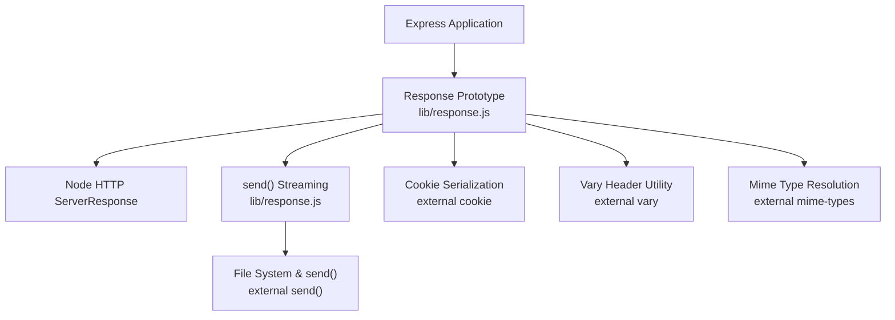
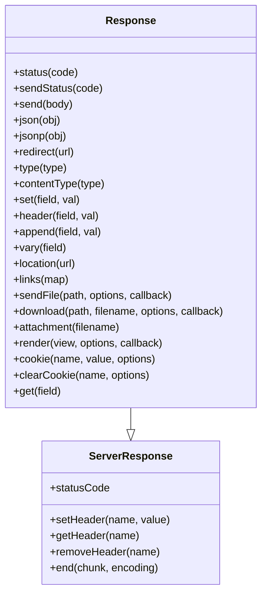
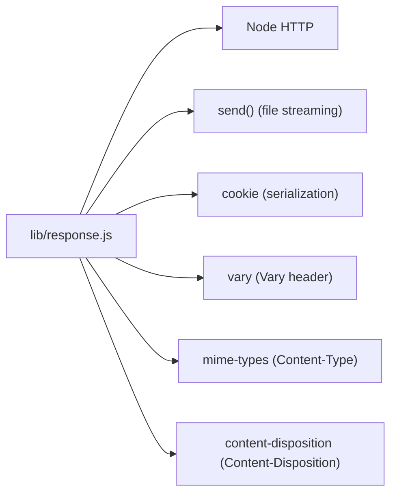

# Response Object

<cite>
**Referenced Files in This Document**
- [response.js](file://lib/response.js)
- [res.send.js](file://test/res.send.js)
- [res.json.js](file://test/res.json.js)
- [res.jsonp.js](file://test/res.jsonp.js)
- [res.sendStatus.js](file://test/res.sendStatus.js)
- [res.sendFile.js](file://test/res.sendFile.js)
- [res.download.js](file://test/res.download.js)
- [res.attachment.js](file://test/res.attachment.js)
- [res.set.js](file://test/res.set.js)
- [res.append.js](file://test/res.append.js)
- [res.cookie.js](file://test/res.cookie.js)
- [res.clearCookie.js](file://test/res.clearCookie.js)
- [res.type.js](file://test/res.type.js)
- [res.vary.js](file://test/res.vary.js)
- [res.status.js](file://test/res.status.js)
</cite>

## Table of Contents
1. [Introduction](#introduction)
2. [Project Structure](#project-structure)
3. [Core Components](#core-components)
4. [Architecture Overview](#architecture-overview)
5. [Detailed Component Analysis](#detailed-component-analysis)
6. [Dependency Analysis](#dependency-analysis)
7. [Performance Considerations](#performance-considerations)
8. [Troubleshooting Guide](#troubleshooting-guide)
9. [Conclusion](#conclusion)

## Introduction
This document provides comprehensive documentation for the Express.js Response object. It explains all response methods and properties used to generate HTTP responses, including basic responses (send, json, jsonp), file handling (sendFile, download, attachment), header manipulation (set, append, vary), status code handling (status, sendStatus), redirection (redirect), content type management (type), view rendering (render), cookie management (cookie, clearCookie, signedCookie), and streaming behavior. Practical examples are linked via test files to demonstrate correct usage, parameter handling, and common patterns. Guidance on response chaining, error handling, and performance considerations is included.

## Project Structure
The Response object is implemented in the core library and extensively tested through unit tests. The following diagram shows how the response module integrates with Express internals and external libraries.

**Diagram sources**
- [response.js:42-49](file://lib/response.js#L42-L49)
- [response.js:31-35](file://lib/response.js#L31-L35)
- [response.js:30-31](file://lib/response.js#L30-L31)
- [response.js:34-34](file://lib/response.js#L34-L34)

**Section sources**
- [response.js:1-50](file://lib/response.js#L1-L50)

## Core Components
This section summarizes the primary response methods and their responsibilities. Each method is documented with purpose, parameters, behavior, and references to tests that demonstrate usage.

- res.status(code): Sets the HTTP status code with validation and returns the response object for chaining.
- res.sendStatus(code): Sets the status and sends the standard message body as text.
- res.send(body): Sends a response with automatic content-type inference, ETag generation, and HEAD handling.
- res.json(obj): Sends a JSON response with configurable replacer, spaces, and escaping.
- res.jsonp(obj): Sends a JSONP response with callback support and security headers.
- res.redirect(url|status, url?): Redirects with appropriate body and content-length.
- res.type(type)|res.contentType(type): Sets Content-Type with mime-type resolution.
- res.set(field, val)|res.header(field, val): Sets headers, with charset handling for Content-Type.
- res.append(field, val): Appends header values, merging arrays and strings.
- res.vary(field): Adds entries to the Vary header without duplicates.
- res.location(url): Sets the Location header with URL encoding.
- res.links(map): Sets Link header with multiple relations.
- res.sendFile(path, options?, callback?): Streams a file with caching, range support, and error handling.
- res.download(path, filename?, options?, callback?): Transfers a file as attachment with Content-Disposition.
- res.attachment(filename?): Sets Content-Disposition to attachment and infers Content-Type.
- res.render(view, options?, callback?): Renders a view and responds with HTML or invokes callback.
- res.cookie(name, value, options?): Sets a cookie with serialization and optional signing.
- res.clearCookie(name, options?): Clears a cookie by expiring it in the past.
- res.get(field), res.get(field): Retrieves header values.

**Section sources**
- [response.js:64-76](file://lib/response.js#L64-L76)
- [response.js:321-328](file://lib/response.js#L321-L328)
- [response.js:125-218](file://lib/response.js#L125-L218)
- [response.js:232-246](file://lib/response.js#L232-L246)
- [response.js:260-304](file://lib/response.js#L260-L304)
- [response.js:812-864](file://lib/response.js#L812-L864)
- [response.js:503-510](file://lib/response.js#L503-L510)
- [response.js:664-686](file://lib/response.js#L664-L686)
- [response.js:629-641](file://lib/response.js#L629-L641)
- [response.js:875-879](file://lib/response.js#L875-L879)
- [response.js:794-796](file://lib/response.js#L794-L796)
- [response.js:97-110](file://lib/response.js#L97-L110)
- [response.js:371-413](file://lib/response.js#L371-L413)
- [response.js:433-482](file://lib/response.js#L433-L482)
- [response.js:604-612](file://lib/response.js#L604-L612)
- [response.js:894-918](file://lib/response.js#L894-L918)
- [response.js:742-775](file://lib/response.js#L742-L775)
- [response.js:709-716](file://lib/response.js#L709-L716)
- [response.js:696-698](file://lib/response.js#L696-L698)

## Architecture Overview
The Response object extends Node’s ServerResponse and augments it with Express-specific helpers. Methods delegate to Node internals for headers and streaming while adding higher-level conveniences like JSON/JSONP, file serving, cookies, and content negotiation.

**Diagram sources**
- [response.js:42-49](file://lib/response.js#L42-L49)
- [response.js:64-76](file://lib/response.js#L64-L76)
- [response.js:125-218](file://lib/response.js#L125-L218)
- [response.js:232-246](file://lib/response.js#L232-L246)
- [response.js:260-304](file://lib/response.js#L260-L304)
- [response.js:321-328](file://lib/response.js#L321-L328)
- [response.js:503-510](file://lib/response.js#L503-L510)
- [response.js:629-641](file://lib/response.js#L629-L641)
- [response.js:664-686](file://lib/response.js#L664-L686)
- [response.js:794-796](file://lib/response.js#L794-L796)
- [response.js:812-864](file://lib/response.js#L812-L864)
- [response.js:875-879](file://lib/response.js#L875-L879)
- [response.js:97-110](file://lib/response.js#L97-L110)
- [response.js:371-413](file://lib/response.js#L371-L413)
- [response.js:433-482](file://lib/response.js#L433-L482)
- [response.js:604-612](file://lib/response.js#L604-L612)
- [response.js:894-918](file://lib/response.js#L894-L918)
- [response.js:742-775](file://lib/response.js#L742-L775)
- [response.js:709-716](file://lib/response.js#L709-L716)
- [response.js:696-698](file://lib/response.js#L696-L698)

## Detailed Component Analysis

### Status Code Handling
- res.status(code): Validates integer and range (100–999), sets statusCode, and returns the response for chaining.
- res.sendStatus(code): Sets status and sends a textual body derived from status message or code.

Practical examples:
- Setting status and chaining: [res.status tests:8-18](file://test/res.status.js#L8-L18)
- Invalid status codes: [res.status tests:120-203](file://test/res.status.js#L120-L203)
- Sending status with message: [res.sendStatus tests:8-18](file://test/res.sendStatus.js#L8-L18)

**Section sources**
- [response.js:64-76](file://lib/response.js#L64-L76)
- [response.js:321-328](file://lib/response.js#L321-L328)
- [res.status.js:1-207](file://test/res.status.js#L1-L207)
- [res.sendStatus.js:1-45](file://test/res.sendStatus.js#L1-L45)

### Basic Responses
- res.send(body): Supports strings, numbers, booleans, objects, and buffers. Automatically sets Content-Type, calculates Content-Length, generates ETag when configured, handles HEAD, 204/304 semantics, and 205 behavior.
- res.json(obj): Serializes with JSON.stringify and sets Content-Type to application/json unless overridden.
- res.jsonp(obj): Supports JSONP callback, adds nosniff header, escapes characters, and wraps payload.

Practical examples:
- String body, charset handling, ETag: [res.send tests:71-137](file://test/res.send.js#L71-L137)
- Buffer body, binary type, ETag: [res.send tests:139-206](file://test/res.send.js#L139-L206)
- Object body, JSON content-type: [res.send tests:208-221](file://test/res.send.js#L208-L221)
- JSON behavior and escaping: [res.json tests:8-104](file://test/res.json.js#L8-L104)
- JSONP behavior and escaping: [res.jsonp tests:9-158](file://test/res.jsonp.js#L9-L158)

**Section sources**
- [response.js:125-218](file://lib/response.js#L125-L218)
- [response.js:232-246](file://lib/response.js#L232-L246)
- [response.js:260-304](file://lib/response.js#L260-L304)
- [res.send.js:1-570](file://test/res.send.js#L1-L570)
- [res.json.js:1-187](file://test/res.json.js#L1-L187)
- [res.jsonp.js:1-331](file://test/res.jsonp.js#L1-L331)

### Redirection
- res.redirect(url|status, url?): Sets Location header, negotiates text/html/plain body, sets Content-Length, and ends the response. Supports explicit status code.

Practical examples:
- Redirect with default status: [response.js:812-864](file://lib/response.js#L812-L864)
- Redirect behavior and body: [response.js:839-853](file://lib/response.js#L839-L853)

**Section sources**
- [response.js:812-864](file://lib/response.js#L812-L864)

### Content Type Management
- res.type(type)|res.contentType(type): Resolves mime type from extension or full type and sets Content-Type. Honors charset via mime module.

Practical examples:
- Filename-based type resolution: [res.type tests:8-19](file://test/res.type.js#L8-L19)
- Unknown extension default: [res.type tests:21-31](file://test/res.type.js#L21-L31)
- Full subtype: [res.type tests:33-44](file://test/res.type.js#L33-L44)

**Section sources**
- [response.js:503-510](file://lib/response.js#L503-L510)
- [res.type.js:1-116](file://test/res.type.js#L1-L116)

### Header Manipulation
- res.set(field, val)|res.header(field, val): Sets single or multiple headers; coerces values to strings; prevents Content-Type from being set to an array.
- res.append(field, val): Concatenates values, handling arrays and strings; resets with subsequent res.set.
- res.vary(field): Adds entries to Vary without duplicates.

Practical examples:
- Single header: [res.set tests:8-19](file://test/res.set.js#L8-L19)
- Multiple headers, coercion: [res.set tests:36-76](file://test/res.set.js#L36-L76)
- Object form: [res.set tests:92-122](file://test/res.set.js#L92-L122)
- Append behavior: [res.append tests:8-63](file://test/res.append.js#L8-L63)
- Append with res.cookie: [res.append tests:85-103](file://test/res.append.js#L85-L103)
- Vary header: [res.vary tests:7-90](file://test/res.vary.js#L7-L90)

**Section sources**
- [response.js:664-686](file://lib/response.js#L664-L686)
- [response.js:629-641](file://lib/response.js#L629-L641)
- [response.js:875-879](file://lib/response.js#L875-L879)
- [res.set.js:1-125](file://test/res.set.js#L1-L125)
- [res.append.js:1-117](file://test/res.append.js#L1-L117)
- [res.vary.js:1-91](file://test/res.vary.js#L1-L91)

### File Handling
- res.sendFile(path, options?, callback?): Validates path, wires etag option to underlying send, streams file, and invokes callback on completion or error. Handles HEAD, 304, and client aborts.
- res.download(path, filename?, options?, callback?): Sets Content-Disposition to attachment, merges headers, and delegates to res.sendFile.
- res.attachment(filename?): Sets Content-Disposition to attachment and infers Content-Type from extension.

Practical examples:
- Path validation and streaming: [res.sendFile tests:17-40](file://test/res.sendFile.js#L17-L40)
- ETag and 304 handling: [res.sendFile tests:66-80](file://test/res.sendFile.js#L66-L80)
- Range requests: [res.sendFile tests:346-378](file://test/res.sendFile.js#L346-L378)
- Download with filename and headers: [res.download tests:16-29](file://test/res.download.js#L16-L29)
- Download with options and dotfiles: [res.download tests:151-169](file://test/res.download.js#L151-L169)
- Attachment with filename and UTF-8: [res.attachment tests:23-64](file://test/res.attachment.js#L23-L64)

**Section sources**
- [response.js:371-413](file://lib/response.js#L371-L413)
- [response.js:433-482](file://lib/response.js#L433-L482)
- [response.js:604-612](file://lib/response.js#L604-L612)
- [res.sendFile.js:1-914](file://test/res.sendFile.js#L1-L914)
- [res.download.js:1-488](file://test/res.download.js#L1-L488)
- [res.attachment.js:1-80](file://test/res.attachment.js#L1-L80)

### View Rendering
- res.render(view, options?, callback?): Merges res.locals, defaults to responding with HTML, and delegates to app.render. Invokes callback when provided.

Practical examples:
- Rendering and responding: [response.js:894-918](file://lib/response.js#L894-L918)

**Section sources**
- [response.js:894-918](file://lib/response.js#L894-L918)

### Cookie Management
- res.cookie(name, value, options?): Serializes cookie value, supports signed cookies (requires secret), computes expires from maxAge, ensures default path, and appends to Set-Cookie.
- res.clearCookie(name, options?): Forces expiration by setting expires to epoch and clears maxAge.

Practical examples:
- JSON cookie and multiple cookies: [res.cookie tests:8-51](file://test/res.cookie.js#L8-L51)
- Options: httpOnly, secure, maxAge, priority, partitioned: [res.cookie tests:54-243](file://test/res.cookie.js#L54-L243)
- Signed cookies and validation: [res.cookie tests:245-276](file://test/res.cookie.js#L245-L276)
- Clear cookie behavior: [res.clearCookie tests:7-61](file://test/res.clearCookie.js#L7-L61)

**Section sources**
- [response.js:742-775](file://lib/response.js#L742-L775)
- [response.js:709-716](file://lib/response.js#L709-L716)
- [res.cookie.js:1-296](file://test/res.cookie.js#L1-L296)
- [res.clearCookie.js:1-63](file://test/res.clearCookie.js#L1-L63)

### Additional Helpers
- res.location(url): Sets Location header with URL encoding.
- res.links(map): Builds Link header with multiple relations.
- res.get(field), res.get(field): Retrieve header values.

Practical examples:
- Location header: [response.js:794-796](file://lib/response.js#L794-L796)
- Links header: [response.js:97-110](file://lib/response.js#L97-L110)
- Header retrieval: [response.js:696-698](file://lib/response.js#L696-L698)

**Section sources**
- [response.js:794-796](file://lib/response.js#L794-L796)
- [response.js:97-110](file://lib/response.js#L97-L110)
- [response.js:696-698](file://lib/response.js#L696-L698)

## Dependency Analysis
Response methods rely on Node’s HTTP server, external libraries for cookies, vary, mime types, and file streaming. The following diagram shows key dependencies.

**Diagram sources**
- [response.js:15-35](file://lib/response.js#L15-L35)

**Section sources**
- [response.js:15-35](file://lib/response.js#L15-L35)

## Performance Considerations
- ETag generation: Enabled via app setting; reduces bandwidth for cache validation. See [res.send.js:361-443](file://test/res.send.js#L361-L443).
- HEAD requests: Body is skipped; Content-Length is still computed. See [res.send.js:223-237](file://test/res.send.js#L223-L237).
- 204/304/205 semantics: Removes irrelevant headers and body appropriately. See [res.send.js:239-270](file://test/res.send.js#L239-L270).
- File streaming: Uses send() with range support and caching controls. See [res.sendFile.js:346-378](file://test/res.sendFile.js#L346-L378) and [res.download.js:31-57](file://test/res.download.js#L31-L57).
- JSON/JSONP escaping: Optional escaping avoids HTML sniffing but may increase payload size. See [res.json.js:106-141](file://test/res.json.js#L106-L141) and [res.jsonp.js:250-285](file://test/res.jsonp.js#L250-L285).
- Header concatenation: Using res.append minimizes redundant Set-Cookie entries. See [res.append.js:8-63](file://test/res.append.js#L8-L63).

[No sources needed since this section provides general guidance]

## Troubleshooting Guide
- Invalid status code: res.status throws on non-integers or out-of-range values. See [res.status.js:120-203](file://test/res.status.js#L120-L203).
- Missing path in res.sendFile: Throws descriptive error. See [res.sendFile.js:17-40](file://test/res.sendFile.js#L17-L40).
- Non-string path in res.sendFile: Throws error. See [res.sendFile.js:25-31](file://test/res.sendFile.js#L25-L31).
- Non-absolute path without root: Requires absolute path or root. See [res.sendFile.js:33-39](file://test/res.sendFile.js#L33-L39).
- ETag conflicts: Manual ETag overrides take precedence. See [res.send.js:429-443](file://test/res.send.js#L429-L443).
- Cookie options: Invalid maxAge or expires cause errors. See [res.cookie.js:100-186](file://test/res.cookie.js#L100-L186).
- Signed cookies without secret: Throws error requiring secret. See [res.cookie.js:262-276](file://test/res.cookie.js#L262-L276).
- Redirect safety: Callback and body are negotiated by res.format. See [response.js:839-853](file://lib/response.js#L839-L853).

**Section sources**
- [res.status.js:120-203](file://test/res.status.js#L120-L203)
- [res.sendFile.js:17-40](file://test/res.sendFile.js#L17-L40)
- [res.sendFile.js:25-39](file://test/res.sendFile.js#L25-L39)
- [res.send.js:429-443](file://test/res.send.js#L429-L443)
- [res.cookie.js:100-186](file://test/res.cookie.js#L100-L186)
- [res.cookie.js:262-276](file://test/res.cookie.js#L262-L276)
- [response.js:839-853](file://lib/response.js#L839-L853)

## Conclusion
The Express Response object provides a rich, chainable API for building HTTP responses. It integrates seamlessly with Node’s ServerResponse while offering convenient helpers for JSON, JSONP, file streaming, cookies, content negotiation, and headers. Understanding validation, streaming behavior, and performance characteristics enables robust and efficient APIs.