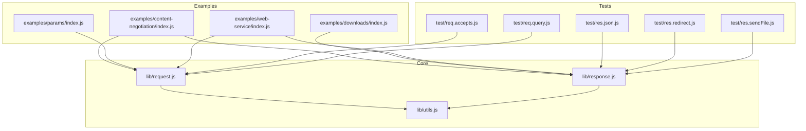
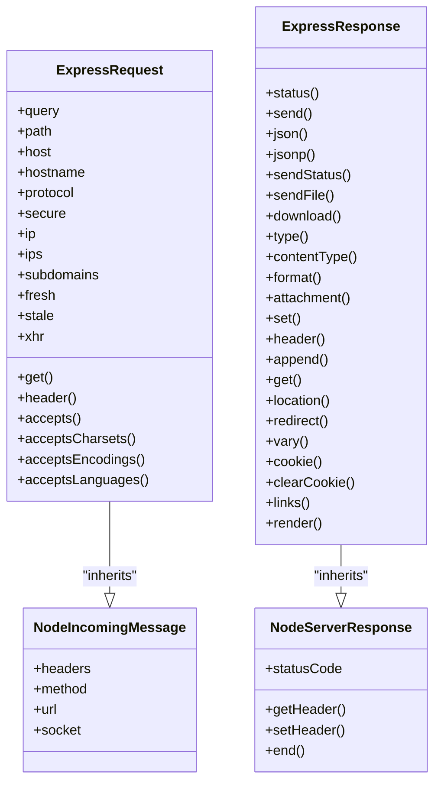
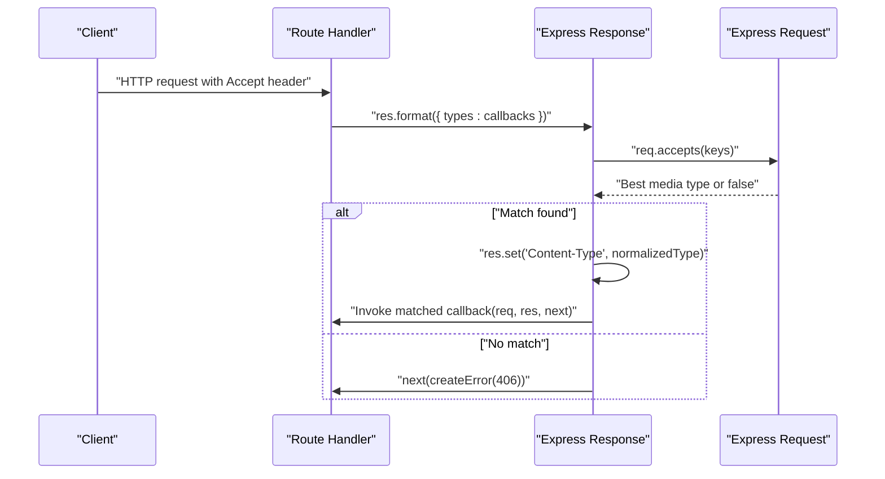
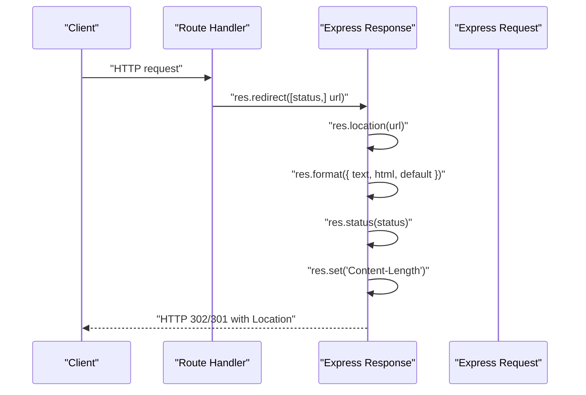
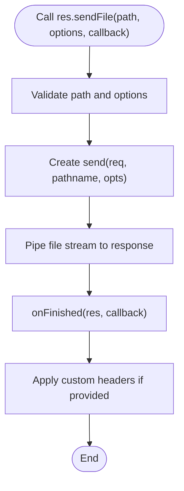
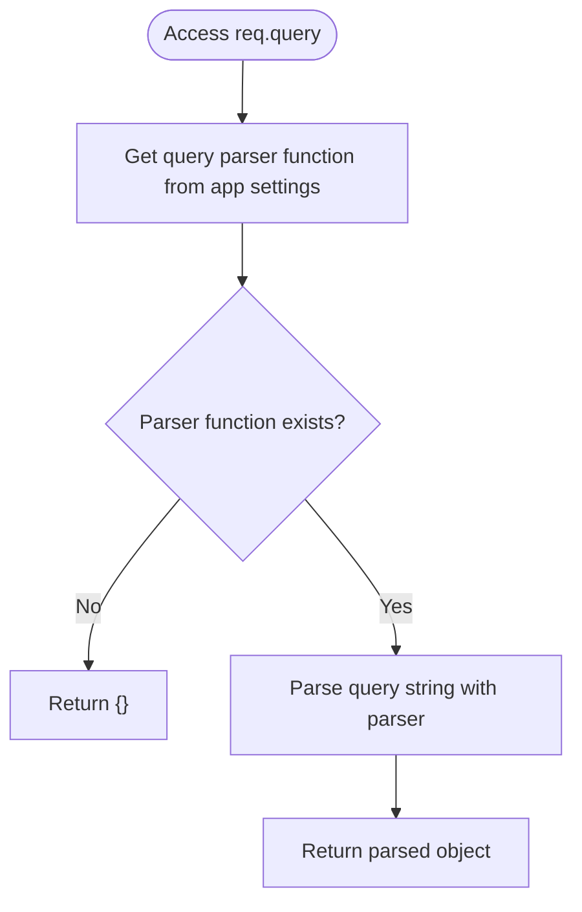
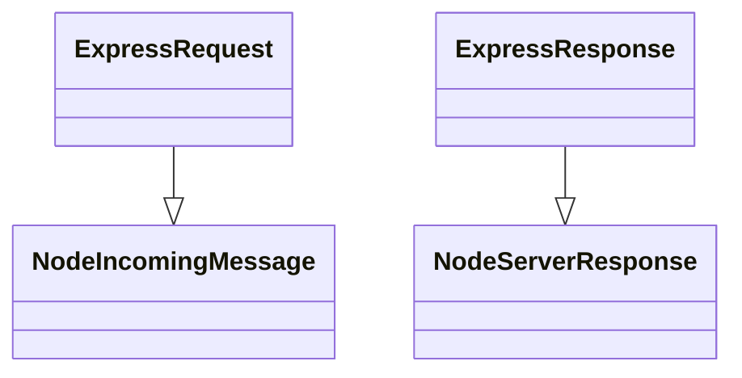
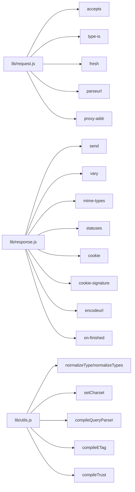

# HTTP Request/Response Handling

<cite>
**Referenced Files in This Document**
- [request.js](file://lib/request.js)
- [response.js](file://lib/response.js)
- [utils.js](file://lib/utils.js)
- [index.js](file://examples/content-negotiation/index.js)
- [users.js](file://examples/content-negotiation/users.js)
- [index.js](file://examples/downloads/index.js)
- [index.js](file://examples/params/index.js)
- [index.js](file://examples/web-service/index.js)
- [req.accepts.js](file://test/req.accepts.js)
- [res.json.js](file://test/res.json.js)
- [res.redirect.js](file://test/res.redirect.js)
- [res.sendFile.js](file://test/res.sendFile.js)
- [req.query.js](file://test/req.query.js)
</cite>

## Table of Contents
1. [Introduction](#introduction)
2. [Project Structure](#project-structure)
3. [Core Components](#core-components)
4. [Architecture Overview](#architecture-overview)
5. [Detailed Component Analysis](#detailed-component-analysis)
6. [Dependency Analysis](#dependency-analysis)
7. [Performance Considerations](#performance-considerations)
8. [Troubleshooting Guide](#troubleshooting-guide)
9. [Conclusion](#conclusion)
10. [Appendices](#appendices)

## Introduction
This document explains Express.js HTTP request and response handling with a focus on enhanced HTTP interface capabilities. It covers the Request object extensions for content negotiation, header processing, and utility methods; Response object enhancements for JSON responses, redirects, file serving, and content type handling; header manipulation and status code management; query parameter processing and URL parsing; and the relationship between Express request/response objects and Node.js native HTTP objects. Practical examples, error handling patterns, performance optimization techniques, and security considerations are included.

## Project Structure
Express’s HTTP handling is implemented in core modules:
- Request extensions: lib/request.js
- Response extensions: lib/response.js
- Utilities for content negotiation, query parsing, and helpers: lib/utils.js
- Examples demonstrating content negotiation, downloads, parameter extraction, and web service patterns: examples/*
- Tests validating behavior of request/response methods: test/*

**Diagram sources**
- [request.js:1-528](file://lib/request.js#L1-L528)
- [response.js:1-1048](file://lib/response.js#L1-L1048)
- [utils.js:1-272](file://lib/utils.js#L1-L272)
- [index.js:1-47](file://examples/content-negotiation/index.js#L1-L47)
- [index.js:1-41](file://examples/downloads/index.js#L1-L41)
- [index.js:1-75](file://examples/params/index.js#L1-L75)
- [index.js:1-118](file://examples/web-service/index.js#L1-L118)
- [req.accepts.js:1-126](file://test/req.accepts.js#L1-L126)
- [res.json.js:1-187](file://test/res.json.js#L1-L187)
- [res.redirect.js:1-215](file://test/res.redirect.js#L1-L215)
- [res.sendFile.js:1-914](file://test/res.sendFile.js#L1-L914)
- [req.query.js:1-107](file://test/req.query.js#L1-L107)

**Section sources**
- [request.js:1-528](file://lib/request.js#L1-L528)
- [response.js:1-1048](file://lib/response.js#L1-L1048)
- [utils.js:1-272](file://lib/utils.js#L1-L272)

## Core Components
- Request object extensions:
  - Header accessors and normalization (req.get, req.header)
  - Content negotiation (req.accepts, req.acceptsCharsets, req.acceptsEncodings, req.acceptsLanguages)
  - Query parsing (req.query)
  - URL and host parsing (req.path, req.host, req.hostname)
  - Protocol and security (req.protocol, req.secure)
  - IP and proxy trust (req.ip, req.ips)
  - Subdomains (req.subdomains)
  - Freshness and staleness (req.fresh, req.stale)
  - XMLHttpRequest detection (req.xhr)
- Response object enhancements:
  - Status code management (res.status, res.sendStatus)
  - JSON responses (res.json, res.jsonp)
  - Redirects (res.redirect)
  - File serving (res.sendFile, res.download)
  - Content type handling (res.type, res.contentType)
  - Header manipulation (res.set, res.header, res.append, res.get)
  - Vary header (res.vary)
  - Location header (res.location)
  - Cookies (res.cookie, res.clearCookie)
  - Link header (res.links)
  - Rendering (res.render)

**Section sources**
- [request.js:63-511](file://lib/request.js#L63-L511)
- [response.js:64-879](file://lib/response.js#L64-L879)
- [utils.js:61-272](file://lib/utils.js#L61-L272)

## Architecture Overview
Express wraps Node.js HTTP request and response objects, extending them with convenience methods and higher-level abstractions. The Request prototype inherits from Node’s IncomingMessage, and the Response prototype inherits from Node’s ServerResponse. Utilities in lib/utils.js support content negotiation, query parsing, and ETag generation.

**Diagram sources**
- [request.js:30-37](file://lib/request.js#L30-L37)
- [response.js:42-49](file://lib/response.js#L42-L49)
- [utils.js:25-29](file://lib/utils.js#L25-L29)

## Detailed Component Analysis

### Request Object Extensions
- Header accessors:
  - req.get(name) and req.header(name) return header values with special-case handling for Referrer/Referer.
  - Validation ensures name is a non-empty string.
- Content negotiation:
  - req.accepts(types...) returns best match or false based on Accept header.
  - req.acceptsCharsets(charsets...) returns best charset match.
  - req.acceptsEncodings(encodings...) returns best encoding match.
  - req.acceptsLanguages(languages...) returns best language match.
- Query parsing:
  - req.query is computed from the URL’s query string using the configured query parser function.
  - Supports simple, extended, custom, or disabled parsers.
- URL and host parsing:
  - req.path returns the parsed pathname.
  - req.host returns Host header with trust proxy support.
  - req.hostname extracts hostname from host.
- Protocol and security:
  - req.protocol determines http/https with trust proxy and X-Forwarded-Proto handling.
  - req.secure is a shorthand for https.
- IP and proxy trust:
  - req.ip resolves to the remote address considering trusted proxies.
  - req.ips returns the chain of trusted proxy addresses.
- Subdomains:
  - req.subdomains computes subdomain segments based on hostname and subdomain offset.
- Freshness and staleness:
  - req.fresh and req.stale evaluate Last-Modified and ETag against request conditions.
- XMLHttpRequest detection:
  - req.xhr detects X-Requested-With header.

Practical example references:
- Content negotiation example: [index.js:9-27](file://examples/content-negotiation/index.js#L9-L27)
- Parameter extraction example: [index.js:23-41](file://examples/params/index.js#L23-L41)
- Query parsing behavior: [req.query.js:1-107](file://test/req.query.js#L1-L107)

**Section sources**
- [request.js:63-511](file://lib/request.js#L63-L511)
- [utils.js:162-184](file://lib/utils.js#L162-L184)
- [index.js:9-27](file://examples/content-negotiation/index.js#L9-L27)
- [index.js:23-41](file://examples/params/index.js#L23-L41)
- [req.query.js:1-107](file://test/req.query.js#L1-L107)

### Response Object Enhancements
- Status code management:
  - res.status(code) validates integer in 100–999 range and sets statusCode.
  - res.sendStatus(code) sets status and sends human-readable body.
- JSON responses:
  - res.json(obj) serializes and sends JSON, respecting app settings (replacer, spaces, escape).
  - res.jsonp(obj) supports JSONP callback with security mitigations.
- Redirects:
  - res.redirect([status,] url) encodes URL, negotiates content type, and sends appropriate body.
  - Supports HEAD semantics and XSS-safe HTML rendering.
- File serving:
  - res.sendFile(path[, options][, callback]) streams files with caching, ETag, and range support.
  - res.download(path[, filename][, options][, callback]) serves files as attachments.
- Content type handling:
  - res.type(type) and res.contentType(type) set Content-Type with charset handling.
  - res.format(map) negotiates response format based on Accept header.
  - res.attachment([filename]) sets Content-Disposition to attachment.
- Header manipulation:
  - res.set(field, val) and res.header(field, val) set headers with Content-Type expansion.
  - res.append(field, val) concatenates header values.
  - res.get(field) retrieves header value.
  - res.vary(field) updates Vary header.
  - res.links(map) sets Link header.
  - res.location(url) sets Location header with URL encoding.
- Cookies:
  - res.cookie(name, value[, options]) and res.clearCookie(name[, options]) manage cookies.
- Rendering:
  - res.render(view[, options][, callback]) renders templates with locals.

Practical example references:
- Content negotiation example: [users.js:5-19](file://examples/content-negotiation/users.js#L5-L19)
- Downloads example: [index.js:26-34](file://examples/downloads/index.js#L26-L34)
- Web service example: [index.js:30-42](file://examples/web-service/index.js#L30-L42)
- JSON behavior: [res.json.js:1-187](file://test/res.json.js#L1-L187)
- Redirect behavior: [res.redirect.js:1-215](file://test/res.redirect.js#L1-L215)
- File serving behavior: [res.sendFile.js:1-914](file://test/res.sendFile.js#L1-L914)

**Section sources**
- [response.js:64-879](file://lib/response.js#L64-L879)
- [utils.js:61-238](file://lib/utils.js#L61-L238)
- [users.js:5-19](file://examples/content-negotiation/users.js#L5-L19)
- [index.js:26-34](file://examples/downloads/index.js#L26-L34)
- [index.js:30-42](file://examples/web-service/index.js#L30-L42)
- [res.json.js:1-187](file://test/res.json.js#L1-L187)
- [res.redirect.js:1-215](file://test/res.redirect.js#L1-L215)
- [res.sendFile.js:1-914](file://test/res.sendFile.js#L1-L914)

### Content Negotiation Flow
The res.format() method selects the best representation based on Accept header and invokes the corresponding callback. It also sets Content-Type and updates Vary header.

**Diagram sources**
- [response.js:569-594](file://lib/response.js#L569-L594)
- [request.js:127-130](file://lib/request.js#L127-L130)

**Section sources**
- [response.js:569-594](file://lib/response.js#L569-L594)
- [request.js:127-130](file://lib/request.js#L127-L130)

### Redirect Flow
res.redirect() negotiates content type for text/html and html responses, sets Location header, and sends an appropriate body.

**Diagram sources**
- [response.js:812-864](file://lib/response.js#L812-L864)

**Section sources**
- [response.js:812-864](file://lib/response.js#L812-L864)
- [res.redirect.js:1-215](file://test/res.redirect.js#L1-L215)

### File Serving Flow
res.sendFile() streams files using the send module, honoring options like ranges, caching, and headers.

**Diagram sources**
- [response.js:371-413](file://lib/response.js#L371-L413)
- [response.js:921-1009](file://lib/response.js#L921-L1009)

**Section sources**
- [response.js:371-413](file://lib/response.js#L371-L413)
- [response.js:921-1009](file://lib/response.js#L921-L1009)
- [res.sendFile.js:1-914](file://test/res.sendFile.js#L1-L914)

### Query Parameter Processing
req.query is derived from the URL’s query string using a configurable parser:
- Disabled: returns empty object
- Simple: uses querystring.parse
- Extended: uses qs.parse with allowPrototypes
- Custom function: uses provided function

**Diagram sources**
- [request.js:230-241](file://lib/request.js#L230-L241)
- [utils.js:162-184](file://lib/utils.js#L162-L184)

**Section sources**
- [request.js:230-241](file://lib/request.js#L230-L241)
- [utils.js:162-184](file://lib/utils.js#L162-L184)
- [req.query.js:1-107](file://test/req.query.js#L1-L107)

### Relationship Between Express and Node.js HTTP Objects
Express request and response prototypes inherit from Node’s IncomingMessage and ServerResponse respectively. This allows Express to augment native behavior while preserving compatibility with Node’s HTTP ecosystem.

**Diagram sources**
- [request.js:30-37](file://lib/request.js#L30-L37)
- [response.js:42-49](file://lib/response.js#L42-L49)

**Section sources**
- [request.js:30-37](file://lib/request.js#L30-L37)
- [response.js:42-49](file://lib/response.js#L42-L49)

## Dependency Analysis
- Request depends on:
  - accepts for content negotiation
  - type-is for content-type checking
  - fresh for ETag/Last-Modified freshness
  - parseurl for URL parsing
  - proxy-addr for trusted proxy resolution
- Response depends on:
  - send for file streaming
  - vary for Vary header updates
  - mime-types for content type mapping
  - statuses for status messages
  - cookie and cookie-signature for cookie handling
  - encodeurl for URL encoding
  - on-finished for completion callbacks
- Utilities provide:
  - normalizeType and normalizeTypes for content negotiation
  - setCharset for charset handling
  - compileETag, compileQueryParser, compileTrust for configuration

**Diagram sources**
- [request.js:16-23](file://lib/request.js#L16-L23)
- [response.js:15-35](file://lib/response.js#L15-L35)
- [utils.js:15-22](file://lib/utils.js#L15-L22)

**Section sources**
- [request.js:16-23](file://lib/request.js#L16-L23)
- [response.js:15-35](file://lib/response.js#L15-L35)
- [utils.js:15-22](file://lib/utils.js#L15-L22)

## Performance Considerations
- ETag generation:
  - Express can compute ETag for responses when not explicitly set, reducing bandwidth for cached resources.
  - ETag computation can be tuned via app settings and utilities.
- Content negotiation:
  - Using res.format() avoids manual Accept parsing and reduces overhead.
- File serving:
  - res.sendFile() integrates with the send module, enabling efficient streaming, range requests, and caching headers.
- Query parsing:
  - Choose appropriate query parser (simple vs extended) to balance security and performance.
- Status and headers:
  - res.status() validates inputs early to avoid runtime errors.
  - res.set()/res.append() minimize header duplication and ensure proper charset handling.

[No sources needed since this section provides general guidance]

## Troubleshooting Guide
Common issues and resolutions:
- Invalid status code:
  - res.status() throws TypeError for non-integers and RangeError for out-of-range values.
- Missing path in res.sendFile():
  - Throws TypeError if path is missing or not absolute.
- Non-UTF-8 characters in JSON:
  - Enable json escape to mitigate HTML sniffing risks.
- Redirect XSS:
  - res.redirect() encodes URLs and escapes HTML to prevent XSS.
- File serving errors:
  - res.sendFile() triggers next() for directory errors and handles client aborts gracefully.
- Query parsing:
  - Unknown query parser values throw errors; ensure app settings are valid.

**Section sources**
- [response.js:64-76](file://lib/response.js#L64-L76)
- [response.js:378-394](file://lib/response.js#L378-L394)
- [res.json.js:107-141](file://test/res.json.js#L107-L141)
- [res.redirect.js:113-129](file://test/res.redirect.js#L113-L129)
- [res.sendFile.js:17-40](file://test/res.sendFile.js#L17-L40)
- [req.query.js:85-90](file://test/req.query.js#L85-L90)

## Conclusion
Express enhances Node.js HTTP objects with powerful, ergonomic APIs for content negotiation, query parsing, file serving, redirects, and header management. The examples and tests demonstrate robust patterns for building secure, performant web services. Proper configuration of parsers, ETag generation, and proxy trust ensures correctness and reliability across diverse deployment scenarios.

[No sources needed since this section summarizes without analyzing specific files]

## Appendices

### Practical Examples Index
- Content negotiation: [index.js:9-27](file://examples/content-negotiation/index.js#L9-L27), [users.js:5-19](file://examples/content-negotiation/users.js#L5-L19)
- Downloads: [index.js:26-34](file://examples/downloads/index.js#L26-L34)
- Parameters: [index.js:23-41](file://examples/params/index.js#L23-L41)
- Web service: [index.js:30-42](file://examples/web-service/index.js#L30-L42)

**Section sources**
- [index.js:9-27](file://examples/content-negotiation/index.js#L9-L27)
- [users.js:5-19](file://examples/content-negotiation/users.js#L5-L19)
- [index.js:26-34](file://examples/downloads/index.js#L26-L34)
- [index.js:23-41](file://examples/params/index.js#L23-L41)
- [index.js:30-42](file://examples/web-service/index.js#L30-L42)