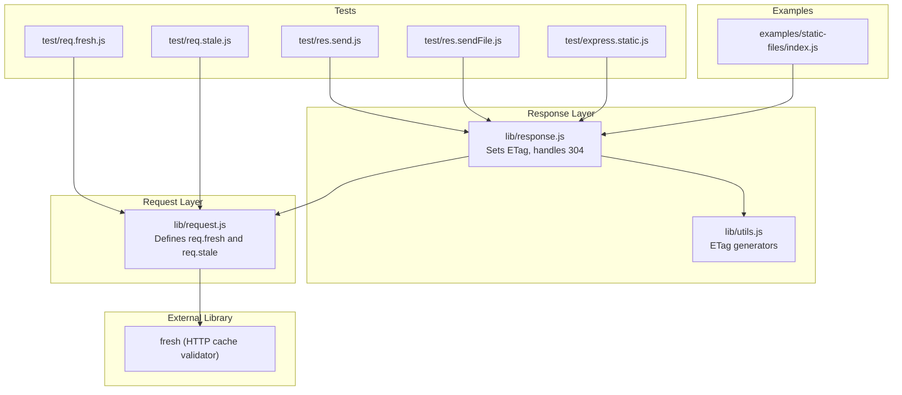
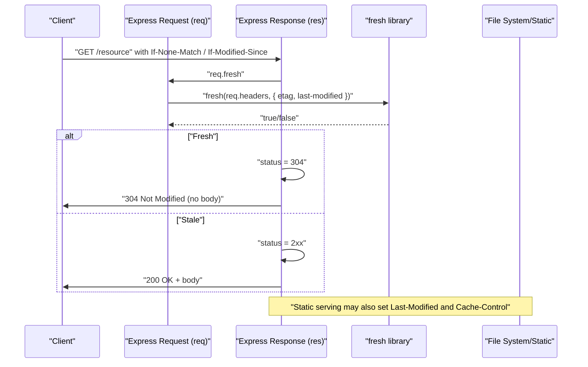
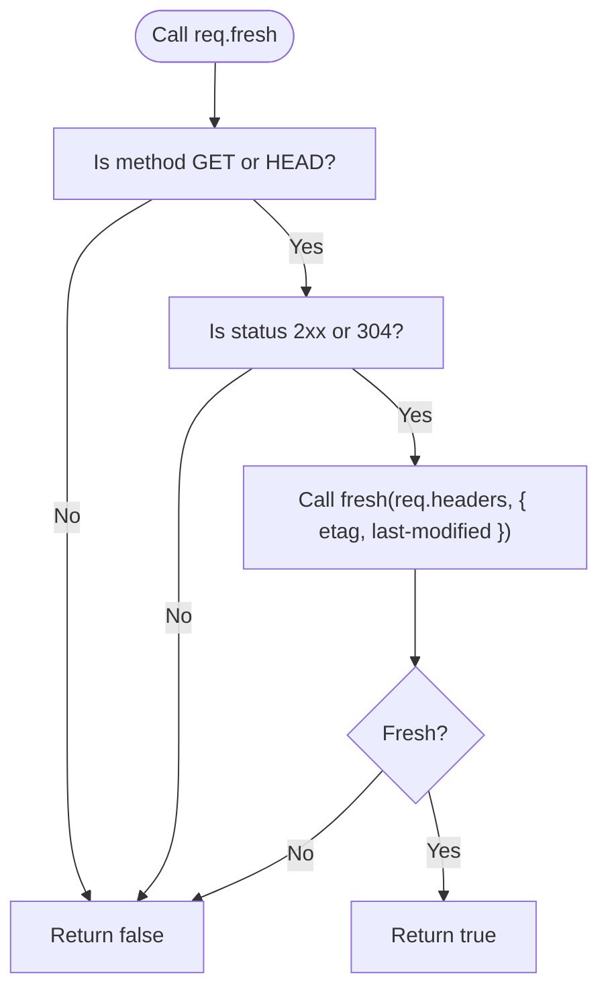
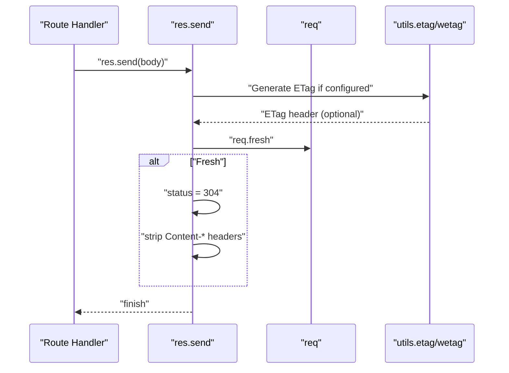
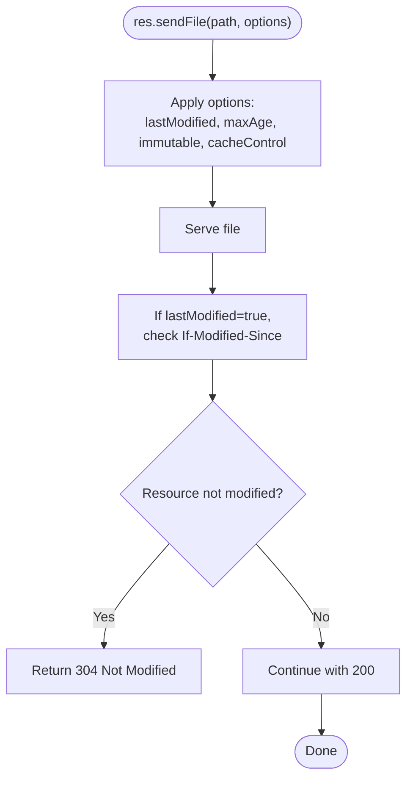
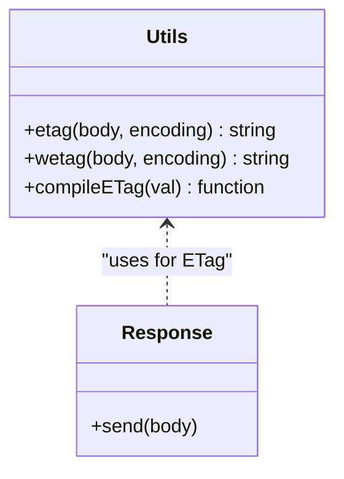
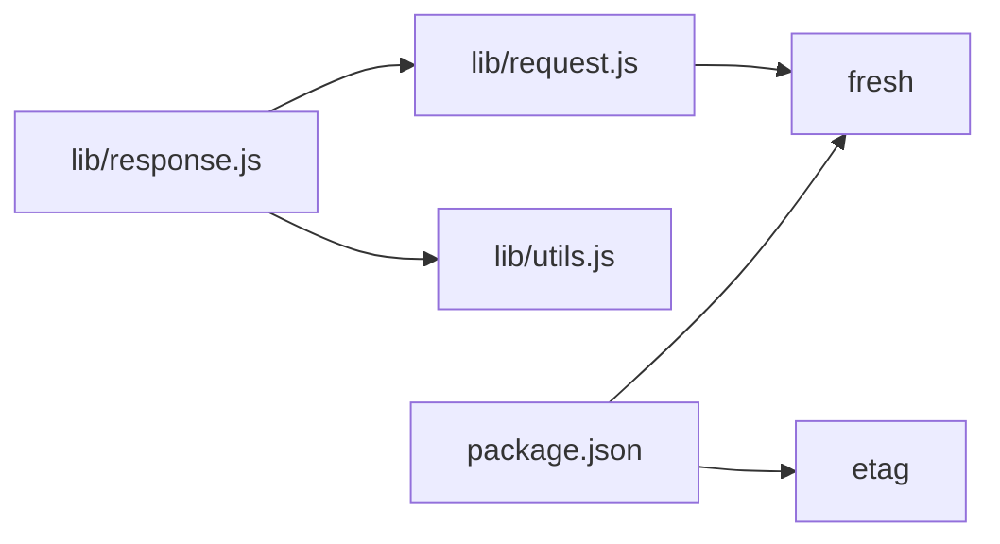

# Conditional Request Handling

<cite>
**Referenced Files in This Document**
- [request.js](file://lib/request.js)
- [response.js](file://lib/response.js)
- [utils.js](file://lib/utils.js)
- [package.json](file://package.json)
- [req.fresh.js](file://test/req.fresh.js)
- [req.stale.js](file://test/req.stale.js)
- [res.send.js](file://test/res.send.js)
- [res.sendFile.js](file://test/res.sendFile.js)
- [express.static.js](file://test/express.static.js)
- [index.js](file://examples/static-files/index.js)
</cite>

## Table of Contents
1. [Introduction](#introduction)
2. [Project Structure](#project-structure)
3. [Core Components](#core-components)
4. [Architecture Overview](#architecture-overview)
5. [Detailed Component Analysis](#detailed-component-analysis)
6. [Dependency Analysis](#dependency-analysis)
7. [Performance Considerations](#performance-considerations)
8. [Troubleshooting Guide](#troubleshooting-guide)
9. [Conclusion](#conclusion)
10. [Appendices](#appendices)

## Introduction
This document explains conditional request handling in Express.js with a focus on the Request object’s freshness checks: req.fresh and req.stale. It details how Express integrates with the external “fresh” library to evaluate HTTP cache validation using ETag and Last-Modified headers. You will learn when freshness checks apply, how 304 Not Modified responses are produced, the difference between weak and strong validation, and how to optimize caching for browsers, CDNs, and APIs. Practical examples demonstrate ETag generation strategies, response header behavior, and integration with caching layers.

## Project Structure
The conditional request handling logic spans three core areas:
- Request object getters for freshness evaluation
- Response logic that sets ETag and applies 304 when appropriate
- Utilities for ETag generation and configuration

**Diagram sources**
- [request.js:460-500](file://lib/request.js#L460-L500)
- [response.js:125-218](file://lib/response.js#L125-L218)
- [utils.js:40-51](file://lib/utils.js#L40-L51)
- [package.json:47](file://package.json#L47)

**Section sources**
- [request.js:460-500](file://lib/request.js#L460-L500)
- [response.js:125-218](file://lib/response.js#L125-L218)
- [utils.js:40-51](file://lib/utils.js#L40-L51)
- [package.json:47](file://package.json#L47)

## Core Components
- req.fresh: Boolean getter that evaluates whether a cached representation is still fresh based on ETag and Last-Modified headers and the current request method/status.
- req.stale: Inverse of req.fresh; returns true when the cached representation is outdated.
- Response.send: Automatically sets ETag when configured, then checks req.fresh to decide whether to respond with 304 Not Modified and strip content headers.
- ETag generation utilities: Strong and weak ETag helpers and configuration compiler.

Key behaviors:
- Freshness checks occur only for GET/HEAD requests.
- A 304 response is sent when the response status is 2xx or 304 and the client-provided validators match server-side ones.
- ETag and Last-Modified headers are used; If-None-Match takes precedence over If-Modified-Since.

**Section sources**
- [request.js:469-486](file://lib/request.js#L469-L486)
- [request.js:497-499](file://lib/request.js#L497-L499)
- [response.js:191-200](file://lib/response.js#L191-L200)
- [utils.js:40-51](file://lib/utils.js#L40-L51)

## Architecture Overview
The conditional request flow integrates request freshness evaluation with response header management and ETag generation.

**Diagram sources**
- [request.js:469-486](file://lib/request.js#L469-L486)
- [response.js:191-200](file://lib/response.js#L191-L200)
- [res.sendFile.js:624-692](file://test/res.sendFile.js#L624-L692)

## Detailed Component Analysis

### Request Freshness Evaluation (req.fresh and req.stale)
- req.fresh:
  - Requires GET or HEAD.
  - Requires response status to be 2xx or 304.
  - Delegates to the “fresh” library with request headers and response ETag/Last-Modified.
- req.stale:
  - Simply returns !req.fresh.

**Diagram sources**
- [request.js:469-486](file://lib/request.js#L469-L486)

**Section sources**
- [request.js:469-486](file://lib/request.js#L469-L486)
- [request.js:497-499](file://lib/request.js#L497-L499)
- [req.fresh.js:8-21](file://test/req.fresh.js#L8-L21)
- [req.stale.js:8-21](file://test/req.stale.js#L8-L21)

### Response ETag and 304 Handling (res.send)
- ETag generation:
  - Uses app-level ETag configuration to produce either strong or weak ETag.
  - Only generated if no explicit ETag header is already set.
- Freshness-driven 304:
  - After sending headers/body, if req.fresh is true, response status is set to 304.
  - For 304/204, content headers are stripped and body is cleared.

**Diagram sources**
- [response.js:160-200](file://lib/response.js#L160-L200)
- [utils.js:40-51](file://lib/utils.js#L40-L51)

**Section sources**
- [response.js:160-200](file://lib/response.js#L160-L200)
- [utils.js:40-51](file://lib/utils.js#L40-L51)
- [res.send.js:388-541](file://test/res.send.js#L388-L541)

### Static Serving and Cache Headers (res.sendFile)
- Static serving can set Last-Modified and Cache-Control headers based on options.
- Honors If-Modified-Since to return 304 when appropriate.
- Supports immutable cache directives and maxAge parsing.

**Diagram sources**
- [res.sendFile.js:624-692](file://test/res.sendFile.js#L624-L692)
- [res.sendFile.js:694-842](file://test/res.sendFile.js#L694-L842)

**Section sources**
- [res.sendFile.js:624-692](file://test/res.sendFile.js#L624-L692)
- [res.sendFile.js:694-842](file://test/res.sendFile.js#L694-L842)
- [express.static.js:413-453](file://test/express.static.js#L413-L453)

### ETag Generation Strategies and Weak vs Strong Validation
- Strong ETag:
  - Unique per-byte change; stricter validation.
  - Generated via strong ETag function.
- Weak ETag:
  - Allows semantically equivalent variants; lighter weight.
  - Generated via weak ETag function.
- Configuration:
  - ETag function compiled from app settings (“strong”, “weak”, true/false, or custom function).

**Diagram sources**
- [utils.js:40-51](file://lib/utils.js#L40-L51)
- [utils.js:130-152](file://lib/utils.js#L130-L152)
- [response.js:160-189](file://lib/response.js#L160-L189)

**Section sources**
- [utils.js:40-51](file://lib/utils.js#L40-L51)
- [utils.js:130-152](file://lib/utils.js#L130-L152)
- [res.send.js:495-527](file://test/res.send.js#L495-L527)

## Dependency Analysis
- Internal dependencies:
  - request.js depends on the “fresh” library for cache validation.
  - response.js depends on utils.js for ETag generation and on request.js for freshness checks.
- External dependencies:
  - “fresh”: HTTP cache validation engine.
  - “etag”: underlying ETag hashing library.

**Diagram sources**
- [request.js:20](file://lib/request.js#L20)
- [response.js:29-35](file://lib/response.js#L29-L35)
- [package.json:47](file://package.json#L47)

**Section sources**
- [request.js:20](file://lib/request.js#L20)
- [response.js:29-35](file://lib/response.js#L29-L35)
- [package.json:47](file://package.json#L47)

## Performance Considerations
- Conditional requests reduce bandwidth and CPU:
  - 304 responses carry no body, minimizing payload size.
  - ETag computation is efficient; weak ETags are lighter than strong ones.
- Optimal caching strategies:
  - Prefer strong ETags for binary assets where byte-for-byte equality matters.
  - Use weak ETags for HTML/CSS/JS when semantics are equivalent but content may differ slightly.
  - Combine ETag with Cache-Control headers for predictable client behavior.
- Static serving:
  - Enable Last-Modified and appropriate maxAge to maximize CDN effectiveness.
  - Use immutable directive for cache-busting assets.

[No sources needed since this section provides general guidance]

## Troubleshooting Guide
Common issues and debugging tips:
- No ETag set:
  - Ensure app-level ETag is enabled or explicitly set via res.set.
  - Verify body is not empty; ETag generation requires a body.
- Unexpected 200 instead of 304:
  - Confirm request method is GET/HEAD.
  - Ensure response status is 2xx or 304.
  - Check that ETag/Last-Modified headers are present on the response.
  - Validate client validators (If-None-Match/If-Modified-Since) match server values.
- If-None-Match ignored:
  - Tests confirm If-None-Match takes precedence over If-Modified-Since.
- Static files not returning 304:
  - Ensure lastModified option is true and If-Modified-Since is set appropriately.

**Section sources**
- [req.fresh.js:50-67](file://test/req.fresh.js#L50-L67)
- [res.send.js:320-335](file://test/res.send.js#L320-L335)
- [res.sendFile.js:642-656](file://test/res.sendFile.js#L642-L656)

## Conclusion
Express’s conditional request handling centers on req.fresh and req.stale, backed by the “fresh” library and integrated with response ETag generation and 304 logic. Proper use of ETag and Last-Modified, combined with Cache-Control headers, yields significant performance gains across browsers, CDNs, and APIs. Following the strategies and troubleshooting steps outlined here will help you build robust, cache-efficient applications.

[No sources needed since this section summarizes without analyzing specific files]

## Appendices

### HTTP Cache Validation Principles
- ETag and Last-Modified are the primary validators.
- If-None-Match (ETag) takes precedence over If-Modified-Since.
- 304 Not Modified is only sent for GET/HEAD with 2xx or 304 responses when validators match.

**Section sources**
- [request.js:469-486](file://lib/request.js#L469-L486)
- [req.fresh.js:50-67](file://test/req.fresh.js#L50-L67)

### Practical Examples Index
- Browser caching:
  - Use res.send with ETag enabled; rely on req.fresh to produce 304.
- CDN optimization:
  - Configure res.sendFile with lastModified and maxAge; leverage immutable directive.
- API response optimization:
  - Generate strong ETags for binary payloads; weak ETags for text-based resources.

**Section sources**
- [res.send.js:388-541](file://test/res.send.js#L388-L541)
- [res.sendFile.js:694-842](file://test/res.sendFile.js#L694-L842)
- [express.static.js:413-453](file://test/express.static.js#L413-L453)
- [index.js:22](file://examples/static-files/index.js#L22)