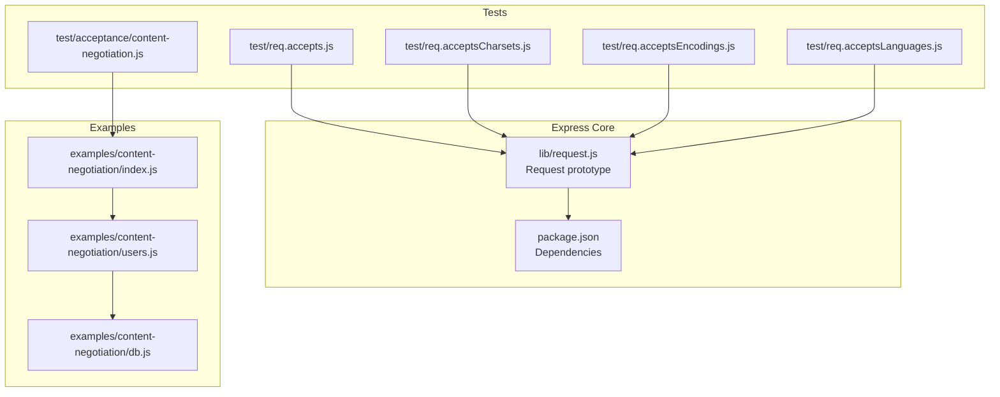
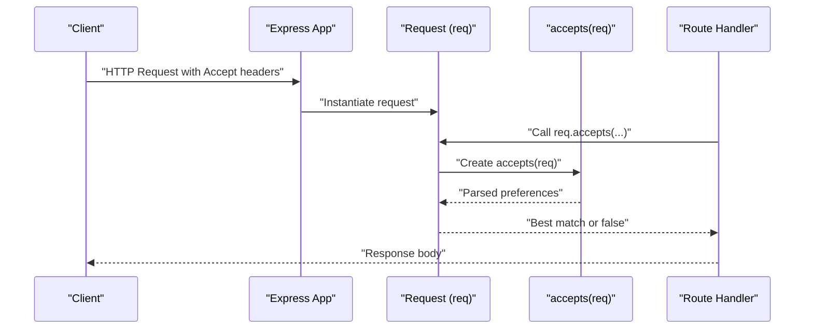
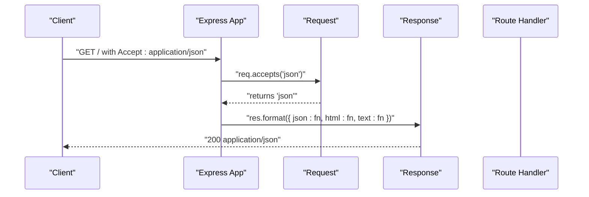
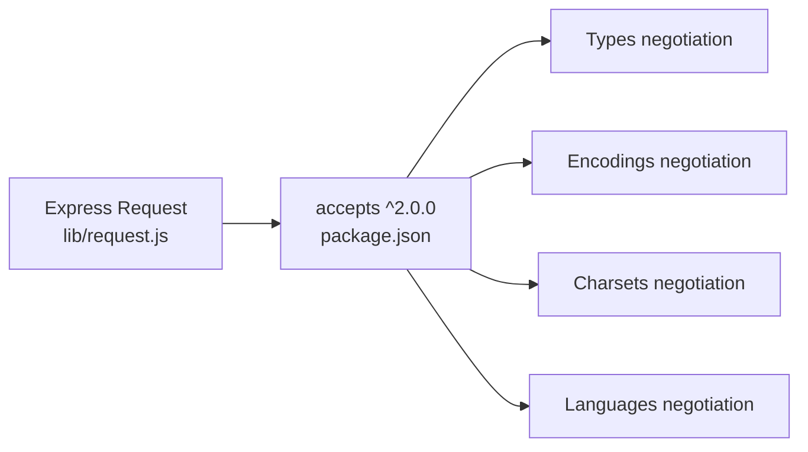

# Content Negotiation Methods

<cite>
**Referenced Files in This Document**
- [lib/request.js](file://lib/request.js)
- [package.json](file://package.json)
- [test/req.accepts.js](file://test/req.accepts.js)
- [test/req.acceptsCharsets.js](file://test/req.acceptsCharsets.js)
- [test/req.acceptsEncodings.js](file://test/req.acceptsEncodings.js)
- [test/req.acceptsLanguages.js](file://test/req.acceptsLanguages.js)
- [test/acceptance/content-negotiation.js](file://test/acceptance/content-negotiation.js)
- [examples/content-negotiation/index.js](file://examples/content-negotiation/index.js)
- [examples/content-negotiation/users.js](file://examples/content-negotiation/users.js)
- [examples/content-negotiation/db.js](file://examples/content-negotiation/db.js)
</cite>

## Table of Contents
1. [Introduction](#introduction)
2. [Project Structure](#project-structure)
3. [Core Components](#core-components)
4. [Architecture Overview](#architecture-overview)
5. [Detailed Component Analysis](#detailed-component-analysis)
6. [Dependency Analysis](#dependency-analysis)
7. [Performance Considerations](#performance-considerations)
8. [Troubleshooting Guide](#troubleshooting-guide)
9. [Conclusion](#conclusion)

## Introduction
This document explains Express.js content negotiation methods on the Request object: req.accepts(), req.acceptsEncodings(), req.acceptsCharsets(), and req.acceptsLanguages(). It describes how these methods interpret HTTP Accept headers to select the best content type, encoding, character set, and language for responses. It covers return values, parameter formats (MIME types, extensions, arrays), practical usage scenarios, and how Express integrates with the accepts library. It also includes examples of Accept header configurations, fallback mechanisms, and troubleshooting guidance for malformed headers and edge cases.

## Project Structure
The content negotiation methods are implemented in the Request prototype and rely on the accepts library. Tests and examples demonstrate real-world usage patterns.

**Diagram sources**
- [lib/request.js:16-187](file://lib/request.js#L16-L187)
- [package.json:34-62](file://package.json#L34-L62)
- [test/req.accepts.js:1-126](file://test/req.accepts.js#L1-L126)
- [test/req.acceptsCharsets.js:1-64](file://test/req.acceptsCharsets.js#L1-L64)
- [test/req.acceptsEncodings.js:1-40](file://test/req.acceptsEncodings.js#L1-L40)
- [test/req.acceptsLanguages.js:1-58](file://test/req.acceptsLanguages.js#L1-L58)
- [test/acceptance/content-negotiation.js:1-50](file://test/acceptance/content-negotiation.js#L1-L50)
- [examples/content-negotiation/index.js:1-47](file://examples/content-negotiation/index.js#L1-L47)
- [examples/content-negotiation/users.js:1-20](file://examples/content-negotiation/users.js#L1-L20)
- [examples/content-negotiation/db.js:1-10](file://examples/content-negotiation/db.js#L1-L10)

**Section sources**
- [lib/request.js:16-187](file://lib/request.js#L16-L187)
- [package.json:34-62](file://package.json#L34-L62)

## Core Components
- req.accepts(): Determines the best acceptable media type(s) based on the Accept header. Supports MIME types, extensions, arrays, and multiple arguments. Returns the best match or false when no match is acceptable.
- req.acceptsEncodings(): Determines the best acceptable content encoding(s) based on the Accept-Encoding header. Returns the best match or false.
- req.acceptsCharsets(): Determines the best acceptable charset(s) based on the Accept-Charset header. Returns the best match or false.
- req.acceptsLanguages(): Determines the best acceptable language(s) based on the Accept-Language header. Returns the best match or false.

These methods delegate to the accepts library, which parses and ranks the client’s preferences according to quality values and wildcards.

**Section sources**
- [lib/request.js:85-187](file://lib/request.js#L85-L187)

## Architecture Overview
Express wraps the accepts library to expose convenient helpers on the Request object. Each method constructs an accepts context from the request and delegates to the corresponding accepts method.

**Diagram sources**
- [lib/request.js:127-187](file://lib/request.js#L127-L187)

## Detailed Component Analysis

### req.accepts()
- Purpose: Determine the best acceptable media type(s) from the Accept header.
- Parameter formats:
  - Single MIME type string (e.g., "application/json")
  - Extension name (e.g., "json")
  - Multiple arguments (e.g., "json", "html", "text/plain")
  - Array of types (e.g., ["json", "html"])
- Behavior:
  - Returns the first acceptable type when Accept is not present.
  - Considers quality values and wildcards.
  - Returns false when no acceptable type is found.
- Practical usage:
  - Choose response format (HTML, JSON, plain text) based on client preference.
  - Combine with res.format() for automatic content-type selection.
- Example Accept headers and outcomes:
  - Accept: application/json → returns "application/json" when requested
  - Accept: text/*, application/json → returns "text/html" if "html" is requested
  - Accept: */html; q=.5, application/json → returns "application/json" when requested
  - Accept: foo/bar, bar/baz → returns false when "text/html" is requested
- Fallback mechanism:
  - If Accept is missing, returns the first provided type or true-like behavior depending on usage.

**Section sources**
- [lib/request.js:85-130](file://lib/request.js#L85-L130)
- [test/req.accepts.js:1-126](file://test/req.accepts.js#L1-L126)
- [test/acceptance/content-negotiation.js:1-50](file://test/acceptance/content-negotiation.js#L1-L50)

### req.acceptsEncodings()
- Purpose: Determine the best acceptable content encoding(s) from the Accept-Encoding header.
- Parameter formats:
  - One or more encoding strings (e.g., "gzip", "deflate").
- Behavior:
  - Returns the first acceptable encoding or false.
  - Handles whitespace and comma-separated lists.
- Practical usage:
  - Decide whether to compress responses (gzip, deflate) based on client capability.
- Example Accept headers and outcomes:
  - Accept-Encoding: gzip, deflate → returns "gzip" for "gzip", "deflate" for "deflate", false for "bogus".
  - Accept-Encoding: identity → returns false for "gzip".

**Section sources**
- [lib/request.js:132-143](file://lib/request.js#L132-L143)
- [test/req.acceptsEncodings.js:1-40](file://test/req.acceptsEncodings.js#L1-L40)

### req.acceptsCharsets()
- Purpose: Determine the best acceptable charset(s) from the Accept-Charset header.
- Parameter formats:
  - One or more charset strings (e.g., "utf-8", "iso-8859-1").
  - Comma-delimited list passed as a single string.
- Behavior:
  - Returns the best matching charset or false.
  - If Accept-Charset is not present, returns true-like behavior for compatibility.
- Practical usage:
  - Select response character encoding to ensure proper rendering.
- Example Accept headers and outcomes:
  - Accept-Charset: utf-8, iso-8859-1 → returns "utf-8" for "utf-8", "iso-8859-1" for "iso-8859-1".
  - Accept-Charset: foo, bar → returns false for "utf-8".

**Section sources**
- [lib/request.js:145-174](file://lib/request.js#L145-L174)
- [test/req.acceptsCharsets.js:1-64](file://test/req.acceptsCharsets.js#L1-L64)

### req.acceptsLanguages()
- Purpose: Determine the best acceptable language(s) from the Accept-Language header.
- Parameter formats:
  - One or more language tags (e.g., "en", "en-us").
- Behavior:
  - Returns the best matching language tag or false.
  - If Accept-Language is not present, returns the first provided language tag.
- Practical usage:
  - Internationalization and localization decisions (e.g., choosing localized messages).
- Example Accept headers and outcomes:
  - Accept-Language: en;q=.5, en-us → returns "en-us" for "en-us", "en" for "en".
  - Accept-Language: en;q=.5, en-us → returns false for "es".

**Section sources**
- [lib/request.js:176-187](file://lib/request.js#L176-L187)
- [test/req.acceptsLanguages.js:1-58](file://test/req.acceptsLanguages.js#L1-L58)

### Integration with res.format() and Examples
The examples demonstrate combining content negotiation with res.format() to automatically select the appropriate response body and Content-Type based on the Accept header.

**Diagram sources**
- [examples/content-negotiation/index.js:9-27](file://examples/content-negotiation/index.js#L9-L27)
- [test/acceptance/content-negotiation.js:20-25](file://test/acceptance/content-negotiation.js#L20-L25)

**Section sources**
- [examples/content-negotiation/index.js:1-47](file://examples/content-negotiation/index.js#L1-L47)
- [examples/content-negotiation/users.js:1-20](file://examples/content-negotiation/users.js#L1-L20)
- [examples/content-negotiation/db.js:1-10](file://examples/content-negotiation/db.js#L1-L10)
- [test/acceptance/content-negotiation.js:1-50](file://test/acceptance/content-negotiation.js#L1-L50)

## Dependency Analysis
Express depends on the accepts library for parsing and ranking client preferences. The Request methods simply wrap accepts(req).types(), accepts(req).encodings(), accepts(req).charsets(), and accepts(req).languages().

**Diagram sources**
- [lib/request.js:16](file://lib/request.js#L16)
- [package.json:35](file://package.json#L35)

**Section sources**
- [lib/request.js:16](file://lib/request.js#L16)
- [package.json:35](file://package.json#L35)

## Performance Considerations
- Minimal overhead: Each method performs a single pass through the accepts library with negligible CPU cost.
- Caching: For repeated checks in the same request lifecycle, cache the result of a negotiation call to avoid re-parsing headers.
- Quality values: Prefer explicit q-values only when necessary; defaults are sufficient for most APIs.
- Wildcards: Using wildcards increases matching complexity slightly; limit their use in high-throughput endpoints.

## Troubleshooting Guide
Common issues and resolutions:
- Missing Accept header:
  - For req.accepts(), when Accept is absent, the first provided type is considered acceptable. Ensure your handler accounts for this default behavior.
- Malformed Accept headers:
  - If the header is syntactically invalid, the accepts library may ignore it or partially parse it. Validate headers upstream or fall back to a default type.
- No acceptable types:
  - When no requested type matches, these methods return false. Respond with a 406 Not Acceptable or a default type.
- Charset and language defaults:
  - If Accept-Charset or Accept-Language is missing, Express treats the first provided option as acceptable. Confirm your server’s default charset and language.
- Encoding negotiation:
  - If Accept-Encoding does not include a supported encoding, return uncompressed content or handle identity encoding appropriately.

Practical checks:
- Verify the exact header names and casing in tests and logs.
- Use supertest-style tests to simulate various Accept header combinations.
- Log the client’s Accept header and the chosen negotiation result for debugging.

**Section sources**
- [test/req.accepts.js:8-44](file://test/req.accepts.js#L8-L44)
- [test/req.acceptsCharsets.js:8-20](file://test/req.acceptsCharsets.js#L8-L20)
- [test/req.acceptsEncodings.js:8-22](file://test/req.acceptsEncodings.js#L8-L22)
- [test/req.acceptsLanguages.js:39-55](file://test/req.acceptsLanguages.js#L39-L55)

## Conclusion
Express’s content negotiation methods provide a concise, robust way to honor client preferences for content type, encoding, charset, and language. They integrate seamlessly with res.format() and leverage the accepts library for standardized parsing and ranking. By understanding parameter formats, return values, and fallback behavior, you can implement flexible, standards-compliant APIs that adapt to diverse clients while maintaining predictable performance and reliability.