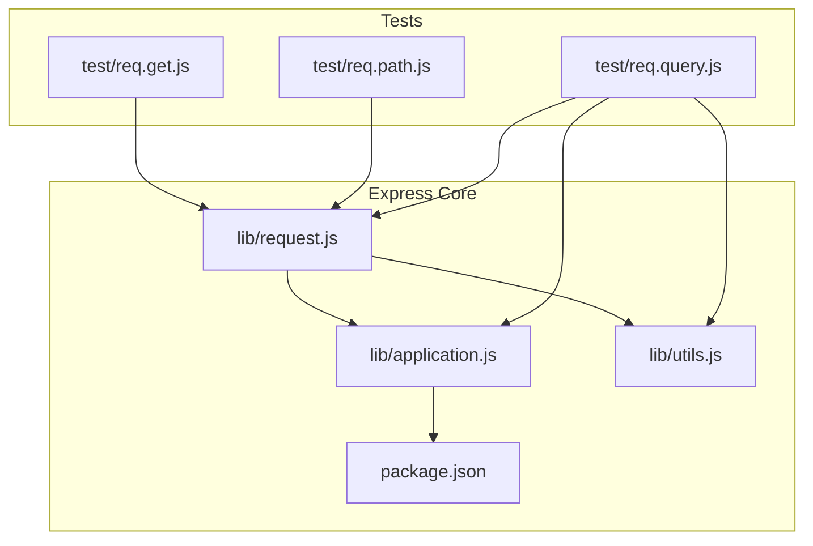
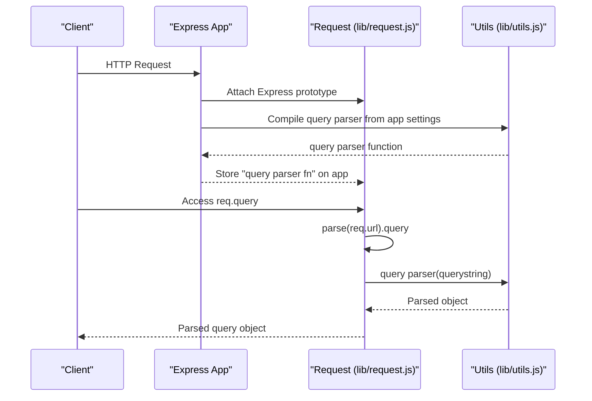
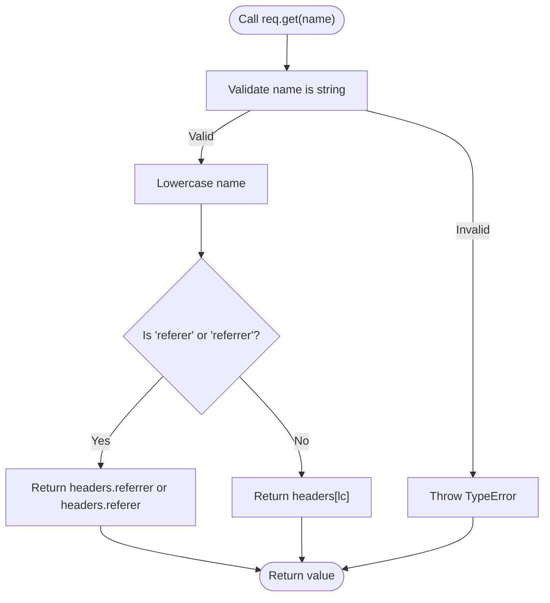
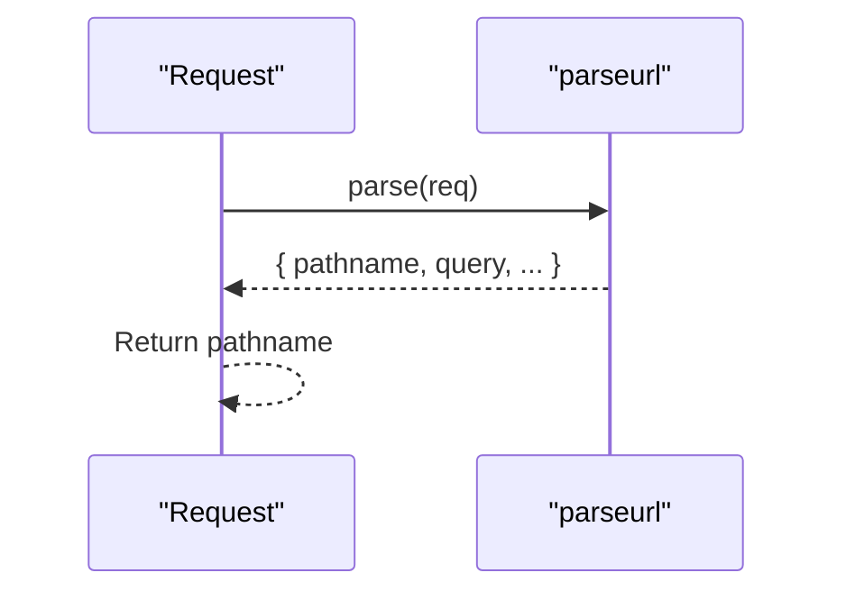
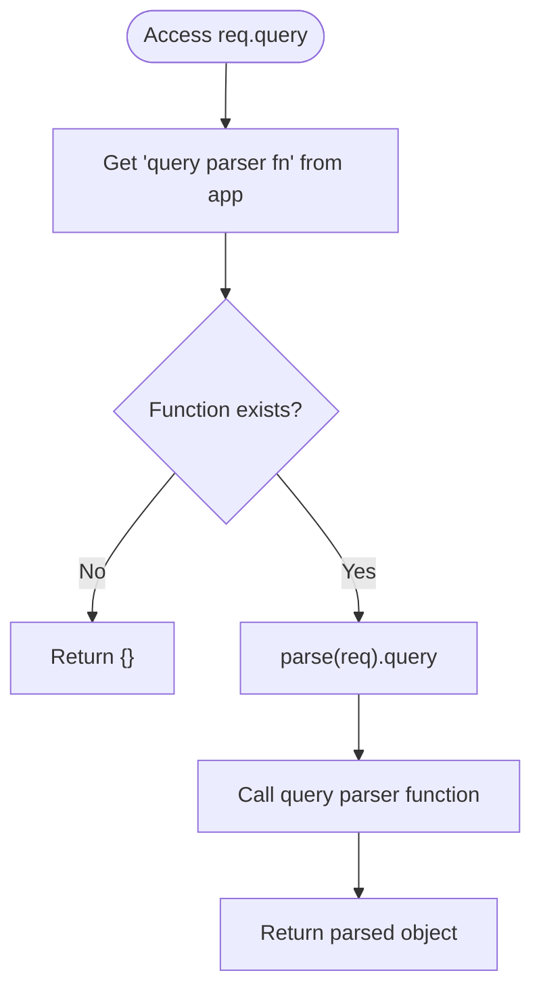
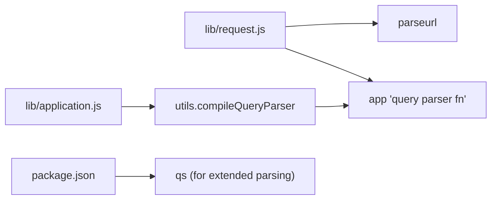

# Header and URL Processing

<cite>
**Referenced Files in This Document**
- [request.js](file://lib/request.js)
- [application.js](file://lib/application.js)
- [utils.js](file://lib/utils.js)
- [package.json](file://package.json)
- [req.get.js](file://test/req.get.js)
- [req.path.js](file://test/req.path.js)
- [req.query.js](file://test/req.query.js)
</cite>

## Table of Contents
1. [Introduction](#introduction)
2. [Project Structure](#project-structure)
3. [Core Components](#core-components)
4. [Architecture Overview](#architecture-overview)
5. [Detailed Component Analysis](#detailed-component-analysis)
6. [Dependency Analysis](#dependency-analysis)
7. [Performance Considerations](#performance-considerations)
8. [Security Considerations](#security-considerations)
9. [Practical Examples](#practical-examples)
10. [Troubleshooting Guide](#troubleshooting-guide)
11. [Conclusion](#conclusion)

## Introduction
This document explains how Express.js processes HTTP headers and URLs in the Request object. It focuses on:
- Header retrieval via req.get() and req.header(), including case-insensitivity and special handling for Referrer/Referer.
- Parameter validation and error behavior for header access.
- URL parsing via req.path and req.query, including the role of the parseurl and query parser settings.
- How query string parsing works with built-in strategies and custom parsers.
- Practical patterns, pitfalls, and performance/security implications.

## Project Structure
The relevant implementation resides in the request prototype and supporting utilities. Tests demonstrate behavior and edge cases.

**Diagram sources**
- [request.js:1-528](file://lib/request.js#L1-L528)
- [application.js:1-200](file://lib/application.js#L1-L200)
- [utils.js:162-184](file://lib/utils.js#L162-L184)
- [package.json:34-62](file://package.json#L34-L62)
- [req.get.js:1-61](file://test/req.get.js#L1-L61)
- [req.path.js:1-21](file://test/req.path.js#L1-L21)
- [req.query.js:1-107](file://test/req.query.js#L1-L107)

**Section sources**
- [request.js:1-528](file://lib/request.js#L1-L528)
- [application.js:90-141](file://lib/application.js#L90-L141)
- [utils.js:162-184](file://lib/utils.js#L162-L184)
- [package.json:34-62](file://package.json#L34-L62)
- [req.get.js:1-61](file://test/req.get.js#L1-L61)
- [req.path.js:1-21](file://test/req.path.js#L1-L21)
- [req.query.js:1-107](file://test/req.query.js#L1-L107)

## Core Components
- Header retrieval: req.get() and req.header() are aliases that normalize the header name to lowercase and return the corresponding value from req.headers. They include special handling for Referrer/Referer.
- URL parsing:
  - req.path extracts the pathname from the parsed URL.
  - req.query parses the query string using the configured query parser function.

Key behaviors:
- Case-insensitive header retrieval.
- Special-case handling for Referrer/Referer.
- Parameter validation for header access.
- Query parsing controlled by the application’s query parser setting, compiled into a function during initialization.

**Section sources**
- [request.js:63-83](file://lib/request.js#L63-L83)
- [request.js:230-241](file://lib/request.js#L230-L241)
- [request.js:403-405](file://lib/request.js#L403-L405)
- [application.js:90-141](file://lib/application.js#L90-L141)
- [utils.js:162-184](file://lib/utils.js#L162-L184)

## Architecture Overview
The Request prototype extends Node’s IncomingMessage and adds getters and helpers. The application initializes default settings, including the query parser and trust proxy function. The query parser is compiled into a function and stored on the app for reuse.

**Diagram sources**
- [application.js:90-141](file://lib/application.js#L90-L141)
- [utils.js:162-184](file://lib/utils.js#L162-L184)
- [request.js:230-241](file://lib/request.js#L230-L241)

## Detailed Component Analysis

### Header Retrieval: req.get() and req.header()
- Normalization: Converts the input name to lowercase and looks up the value in req.headers.
- Special case: Referrer/Referer are treated interchangeably; either header name returns the same value.
- Validation: Throws if the name argument is missing or not a string.

**Diagram sources**
- [request.js:63-83](file://lib/request.js#L63-L83)

**Section sources**
- [request.js:63-83](file://lib/request.js#L63-L83)
- [req.get.js:36-58](file://test/req.get.js#L36-L58)

### URL Path Extraction: req.path
- Uses parseurl to extract the pathname from req.url.
- Returns the normalized path segment without query or fragment.

**Diagram sources**
- [request.js:403-405](file://lib/request.js#L403-L405)

**Section sources**
- [request.js:403-405](file://lib/request.js#L403-L405)
- [req.path.js:8-18](file://test/req.path.js#L8-L18)

### Query String Parsing: req.query
- Reads the raw query string from parseurl and passes it to the app’s query parser function.
- Behavior depends on the "query parser" setting:
  - Disabled: returns an empty object.
  - Simple/true: uses querystring.parse.
  - Extended: uses a qs-based parser that allows arrays and nested objects.
  - Custom function: uses the provided function.
- Unknown values cause a TypeError during compilation.

**Diagram sources**
- [request.js:230-241](file://lib/request.js#L230-L241)
- [utils.js:162-184](file://lib/utils.js#L162-L184)

**Section sources**
- [request.js:230-241](file://lib/request.js#L230-L241)
- [application.js:90-141](file://lib/application.js#L90-L141)
- [utils.js:162-184](file://lib/utils.js#L162-L184)
- [req.query.js:9-91](file://test/req.query.js#L9-L91)

## Dependency Analysis
- req.get()/req.header() depends on Node’s http.IncomingMessage prototype and the req.headers object.
- req.path depends on parseurl for URL parsing.
- req.query depends on:
  - parseurl for extracting the raw query string.
  - The application’s compiled query parser function (from utils.compileQueryParser).
- Default settings are initialized in application.defaultConfiguration, including the default "query parser" value.

**Diagram sources**
- [request.js:230-241](file://lib/request.js#L230-L241)
- [application.js:90-141](file://lib/application.js#L90-L141)
- [utils.js:162-184](file://lib/utils.js#L162-L184)
- [package.json:53-55](file://package.json#L53-L55)

**Section sources**
- [request.js:22-23](file://lib/request.js#L22-L23)
- [application.js:90-141](file://lib/application.js#L90-L141)
- [utils.js:162-184](file://lib/utils.js#L162-L184)
- [package.json:53-55](file://package.json#L53-L55)

## Performance Considerations
- Using the extended query parser enables richer parsing (arrays, nested objects) but may increase CPU usage compared to simple parsing.
- Disabling query parsing avoids parsing overhead entirely, returning an empty object.
- Reusing the precompiled query parser function avoids repeated compilation costs.
- For high-throughput APIs, prefer simple parsing unless nested structures are required.

[No sources needed since this section provides general guidance]

## Security Considerations
- Extended query parsing allows arrays and nested structures; be cautious of deep structures and large payloads to avoid resource exhaustion.
- The extended parser is configured to allow prototype operations; validate and sanitize inputs accordingly.
- Treat query parameters as untrusted data. Apply input validation, sanitization, and appropriate escaping before using them in downstream systems.
- Prefer explicit parsing strategies and avoid unknown or dynamic settings.

**Section sources**
- [utils.js:267-271](file://lib/utils.js#L267-L271)
- [req.query.js:85-90](file://test/req.query.js#L85-L90)

## Practical Examples
- Accessing headers:
  - Retrieve a header value case-insensitively.
  - Use either req.get() or req.header(); they are aliases.
  - Special-case Referrer/Referer returns the same value regardless of spelling.
- Extracting the pathname:
  - req.path returns the URL’s path segment without query or fragment.
- Query parsing:
  - With default settings, simple keys are supported.
  - Enable "query parser" to "extended" for arrays and nested objects.
  - Provide a custom function for specialized parsing needs.
  - Disable parsing to return an empty object.

Demonstration references:
- Header access and special-case referrer: [req.get.js:8-34](file://test/req.get.js#L8-L34)
- Pathname extraction: [req.path.js:7-18](file://test/req.path.js#L7-L18)
- Query parsing modes and defaults: [req.query.js:9-91](file://test/req.query.js#L9-L91)
- Default settings and query parser compilation: [application.js:90-141](file://lib/application.js#L90-L141), [utils.js:162-184](file://lib/utils.js#L162-L184)

**Section sources**
- [req.get.js:8-34](file://test/req.get.js#L8-L34)
- [req.path.js:7-18](file://test/req.path.js#L7-L18)
- [req.query.js:9-91](file://test/req.query.js#L9-L91)
- [application.js:90-141](file://lib/application.js#L90-L141)
- [utils.js:162-184](file://lib/utils.js#L162-L184)

## Troubleshooting Guide
Common pitfalls and remedies:
- Header name validation errors:
  - Calling req.get() without arguments or with a non-string throws a TypeError. Ensure the header name is a string.
  - References: [req.get.js:36-58](file://test/req.get.js#L36-L58)
- Case sensitivity:
  - Header names are case-insensitive; always rely on lowercase lookup behavior.
- Referrer/Referer confusion:
  - Either spelling works; tests confirm interoperability.
  - References: [req.get.js:23-34](file://test/req.get.js#L23-L34)
- Query parser misconfiguration:
  - Unknown values for "query parser" cause a TypeError during compilation.
  - References: [utils.js:179-180](file://lib/utils.js#L179-L180)
- Unexpected query object shape:
  - Verify the "query parser" setting and whether parsing is disabled.
  - References: [req.query.js:65-83](file://test/req.query.js#L65-L83)

**Section sources**
- [req.get.js:36-58](file://test/req.get.js#L36-L58)
- [req.get.js:23-34](file://test/req.get.js#L23-L34)
- [utils.js:179-180](file://lib/utils.js#L179-L180)
- [req.query.js:65-83](file://test/req.query.js#L65-L83)

## Conclusion
Express’s Request object provides robust, case-insensitive header access with special handling for Referrer/Referer and efficient URL parsing via parseurl. Query string parsing is configurable and defaults to simple parsing, with options for extended parsing or custom functions. Understanding these behaviors helps developers write secure, predictable, and performant applications.

[No sources needed since this section summarizes without analyzing specific files]