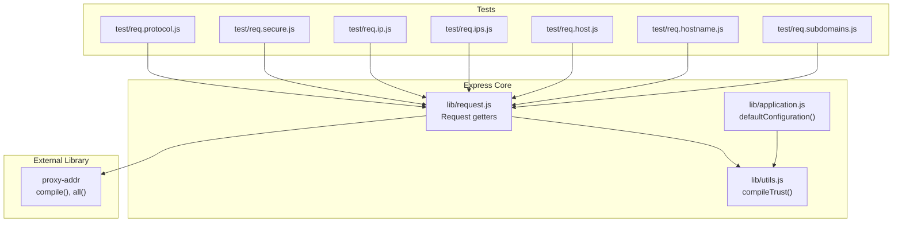
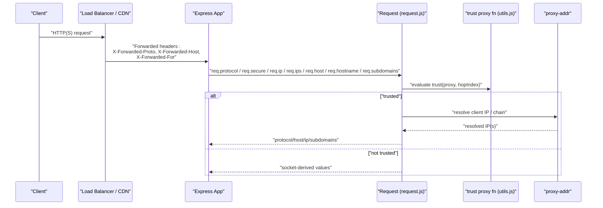
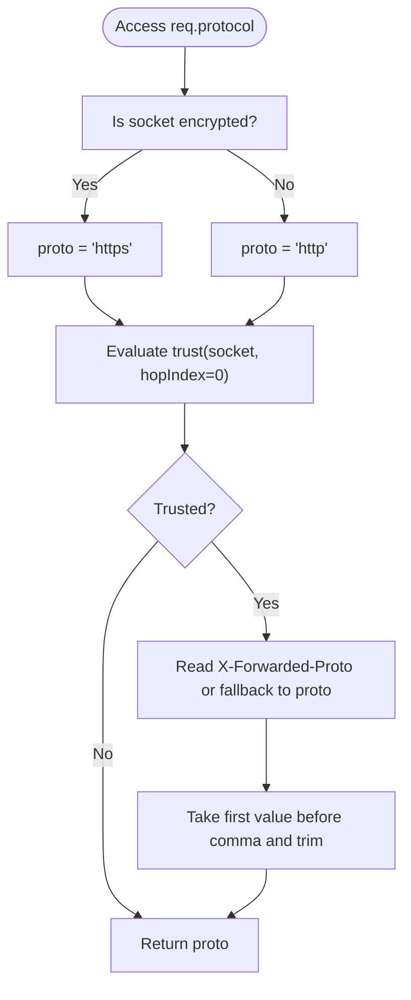
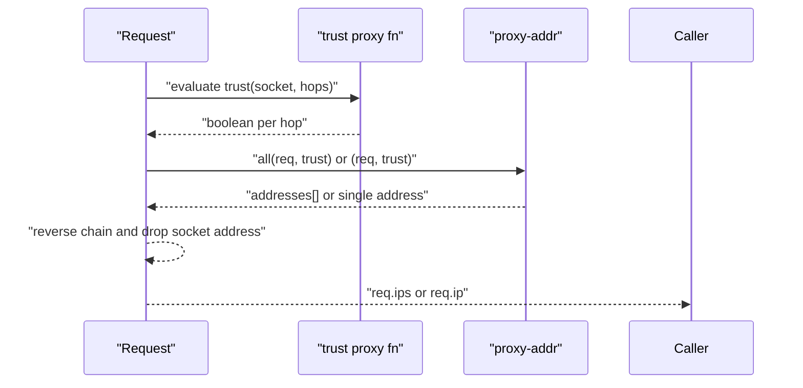
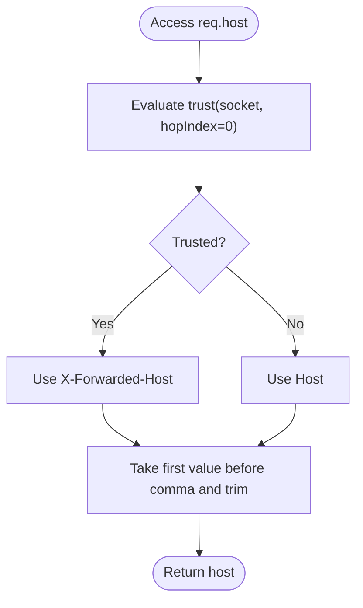
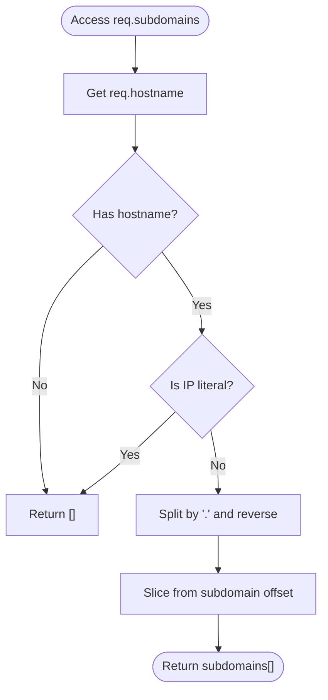
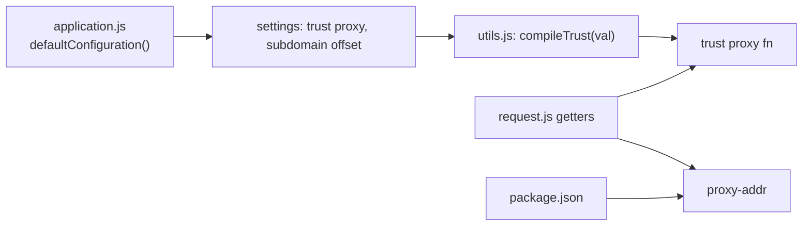

# Network Information and Protocol Detection

<cite>
**Referenced Files in This Document**
- [request.js](file://lib/request.js)
- [utils.js](file://lib/utils.js)
- [application.js](file://lib/application.js)
- [package.json](file://package.json)
- [req.protocol.js](file://test/req.protocol.js)
- [req.secure.js](file://test/req.secure.js)
- [req.ip.js](file://test/req.ip.js)
- [req.ips.js](file://test/req.ips.js)
- [req.host.js](file://test/req.host.js)
- [req.hostname.js](file://test/req.hostname.js)
- [req.subdomains.js](file://test/req.subdomains.js)
</cite>

## Table of Contents
1. [Introduction](#introduction)
2. [Project Structure](#project-structure)
3. [Core Components](#core-components)
4. [Architecture Overview](#architecture-overview)
5. [Detailed Component Analysis](#detailed-component-analysis)
6. [Dependency Analysis](#dependency-analysis)
7. [Performance Considerations](#performance-considerations)
8. [Troubleshooting Guide](#troubleshooting-guide)
9. [Conclusion](#conclusion)

## Introduction
This document explains how Express.js determines network protocol and host information from the Request object, focusing on:
- Protocol detection via req.protocol and req.secure
- Trusting proxy headers and the role of the trust proxy setting
- Client IP resolution via req.ip and req.ips
- Host parsing via req.host and req.hostname
- Subdomain extraction via req.subdomains
- Relationship with the proxy-addr library and security implications
- Practical configuration for development, production, load balancers, and CDNs

## Project Structure
The relevant implementation resides in the request prototype and supporting utilities. Tests validate behavior under various trust proxy configurations and header combinations.

**Diagram sources**
- [request.js:297-458](file://lib/request.js#L297-L458)
- [utils.js:194-214](file://lib/utils.js#L194-L214)
- [application.js:90-141](file://lib/application.js#L90-L141)
- [req.protocol.js:1-114](file://test/req.protocol.js#L1-L114)
- [req.secure.js:1-102](file://test/req.secure.js#L1-L102)
- [req.ip.js:1-114](file://test/req.ip.js#L1-L114)
- [req.ips.js:1-72](file://test/req.ips.js#L1-L72)
- [req.host.js:1-157](file://test/req.host.js#L1-L157)
- [req.hostname.js:1-189](file://test/req.hostname.js#L1-L189)
- [req.subdomains.js:1-174](file://test/req.subdomains.js#L1-L174)

**Section sources**
- [request.js:297-458](file://lib/request.js#L297-L458)
- [utils.js:194-214](file://lib/utils.js#L194-L214)
- [application.js:90-141](file://lib/application.js#L90-L141)

## Core Components
- req.protocol: Determines whether the request arrived via http or https, honoring X-Forwarded-Proto when trust proxy conditions are met.
- req.secure: Boolean shorthand for protocol === 'https'.
- req.ip: Resolves the client IP according to trust proxy rules.
- req.ips: Returns the full chain of IPs in the proxy chain (trusted proxies plus client), excluding the immediate socket address.
- req.host: Full host header value, optionally trusting X-Forwarded-Host when proxy is trusted.
- req.hostname: Domain part of host, with IPv6 bracket handling and port stripping.
- req.subdomains: Array of subdomain segments derived from hostname, respecting subdomain offset.

**Section sources**
- [request.js:297-458](file://lib/request.js#L297-L458)
- [req.protocol.js:1-114](file://test/req.protocol.js#L1-L114)
- [req.secure.js:1-102](file://test/req.secure.js#L1-L102)
- [req.ip.js:1-114](file://test/req.ip.js#L1-L114)
- [req.ips.js:1-72](file://test/req.ips.js#L1-L72)
- [req.host.js:1-157](file://test/req.host.js#L1-L157)
- [req.hostname.js:1-189](file://test/req.hostname.js#L1-L189)
- [req.subdomains.js:1-174](file://test/req.subdomains.js#L1-L174)

## Architecture Overview
Express composes request getters that consult the trust proxy function compiled from application settings. When trust proxy is enabled, getters prefer forwarded headers (X-Forwarded-Proto, X-Forwarded-Host, X-Forwarded-For) and apply proxy-addr logic to derive accurate values.

**Diagram sources**
- [request.js:297-458](file://lib/request.js#L297-L458)
- [utils.js:194-214](file://lib/utils.js#L194-L214)
- [package.json:54-54](file://package.json#L54-L54)

## Detailed Component Analysis

### Protocol Detection: req.protocol and req.secure
- req.protocol:
  - Defaults to 'https' if the socket is encrypted, otherwise 'http'.
  - If trust proxy function deems the socket address trusted, reads X-Forwarded-Proto.
  - Uses the first comma-separated value and trims whitespace.
- req.secure:
  - True when req.protocol === 'https'.

**Diagram sources**
- [request.js:297-315](file://lib/request.js#L297-L315)
- [req.protocol.js:20-96](file://test/req.protocol.js#L20-L96)
- [req.secure.js:23-99](file://test/req.secure.js#L23-L99)

**Section sources**
- [request.js:297-315](file://lib/request.js#L297-L315)
- [req.protocol.js:20-96](file://test/req.protocol.js#L20-L96)
- [req.secure.js:23-99](file://test/req.secure.js#L23-L99)

### IP Address Handling: req.ip and req.ips
- req.ip:
  - Resolved via proxy-addr using the current trust proxy function.
- req.ips:
  - Returns the ordered chain of trusted proxy addresses plus client, reversed so furthest downstream comes first, with the immediate socket address removed.

**Diagram sources**
- [request.js:340-366](file://lib/request.js#L340-L366)
- [utils.js:194-214](file://lib/utils.js#L194-L214)
- [req.ip.js:9-71](file://test/req.ip.js#L9-L71)
- [req.ips.js:9-38](file://test/req.ips.js#L9-L38)

**Section sources**
- [request.js:340-366](file://lib/request.js#L340-L366)
- [req.ip.js:9-71](file://test/req.ip.js#L9-L71)
- [req.ips.js:9-38](file://test/req.ips.js#L9-L38)

### Host Information: req.host and req.hostname
- req.host:
  - If trust proxy deems the socket trusted, prefers X-Forwarded-Host; otherwise uses Host.
  - If multiple values exist, takes the first and trims trailing spaces.
- req.hostname:
  - Extracts the host name portion from req.host, handling IPv6 brackets and removing the port suffix.

**Diagram sources**
- [request.js:418-431](file://lib/request.js#L418-L431)
- [req.host.js:73-138](file://test/req.host.js#L73-L138)
- [req.hostname.js:73-169](file://test/req.hostname.js#L73-L169)

**Section sources**
- [request.js:418-458](file://lib/request.js#L418-L458)
- [req.host.js:73-138](file://test/req.host.js#L73-L138)
- [req.hostname.js:73-169](file://test/req.hostname.js#L73-L169)

### Subdomains: req.subdomains
- Derived from req.hostname.
- Splits on '.' for non-IP hostnames and reverses to build subdomain segments.
- Uses the application’s subdomain offset to determine the main domain boundary.

**Diagram sources**
- [request.js:383-394](file://lib/request.js#L383-L394)
- [req.subdomains.js:95-154](file://test/req.subdomains.js#L95-L154)

**Section sources**
- [request.js:383-394](file://lib/request.js#L383-L394)
- [req.subdomains.js:95-154](file://test/req.subdomains.js#L95-L154)

## Dependency Analysis
Express relies on proxy-addr for trust evaluation and address resolution. The trust proxy function is compiled from application settings and injected into request getters.

**Diagram sources**
- [application.js:90-141](file://lib/application.js#L90-L141)
- [utils.js:194-214](file://lib/utils.js#L194-L214)
- [request.js:297-458](file://lib/request.js#L297-L458)
- [package.json:54-54](file://package.json#L54-L54)

**Section sources**
- [application.js:90-141](file://lib/application.js#L90-L141)
- [utils.js:194-214](file://lib/utils.js#L194-L214)
- [request.js:297-458](file://lib/request.js#L297-L458)
- [package.json:54-54](file://package.json#L54-L54)

## Performance Considerations
- Trust evaluation is O(hops) where hops is determined by the trust proxy configuration (boolean, numeric hop count, or explicit CIDR list).
- Header parsing for protocol and host is linear in header length; avoid excessively long comma-separated lists.
- Using req.ips returns the entire chain; prefer req.ip for single-address decisions to reduce overhead.

## Troubleshooting Guide
Common pitfalls and remedies:
- Misconfigured trust proxy
  - Symptom: req.protocol or req.host reflects internal proxy values instead of upstream.
  - Fix: Set trust proxy to include only known upstream proxies or hop counts.
- Mixed forwarded headers
  - Symptom: Unexpected protocol or host values.
  - Fix: Ensure X-Forwarded-Proto and X-Forwarded-Host are consistently set by trusted proxies.
- IPv6 host handling
  - Symptom: Port appears in req.hostname.
  - Fix: Use req.host for the full value; req.hostname strips ports as designed.
- Subdomain offset mismatch
  - Symptom: Unexpected subdomain arrays.
  - Fix: Adjust subdomain offset to match your domain structure.

Operational examples validated by tests:
- Protocol detection with trust proxy and hop count
  - [req.protocol.js:20-96](file://test/req.protocol.js#L20-L96)
- Secure flag behavior with X-Forwarded-Proto ordering
  - [req.secure.js:23-99](file://test/req.secure.js#L23-L99)
- Client IP selection with X-Forwarded-For and trust levels
  - [req.ip.js:9-71](file://test/req.ip.js#L9-L71)
- Full proxy chain retrieval and truncation
  - [req.ips.js:9-38](file://test/req.ips.js#L9-L38)
- Host and hostname parsing with X-Forwarded-Host
  - [req.host.js:73-138](file://test/req.host.js#L73-L138)
  - [req.hostname.js:73-169](file://test/req.hostname.js#L73-L169)
- Subdomain extraction with offset
  - [req.subdomains.js:95-154](file://test/req.subdomains.js#L95-L154)

**Section sources**
- [req.protocol.js:20-96](file://test/req.protocol.js#L20-L96)
- [req.secure.js:23-99](file://test/req.secure.js#L23-L99)
- [req.ip.js:9-71](file://test/req.ip.js#L9-L71)
- [req.ips.js:9-38](file://test/req.ips.js#L9-L38)
- [req.host.js:73-138](file://test/req.host.js#L73-L138)
- [req.hostname.js:73-169](file://test/req.hostname.js#L73-L169)
- [req.subdomains.js:95-154](file://test/req.subdomains.js#L95-L154)

## Conclusion
Express’s request getters provide robust, configurable access to protocol, IP, and host information. Correctly configuring trust proxy ensures accurate interpretation of forwarded headers from load balancers and CDNs. Use req.protocol and req.secure for HTTPS decisions, req.ip and req.ips for client identity, req.host and req.hostname for host parsing, and req.subdomains for domain-aware routing. Align trust proxy settings with your deployment topology to maintain correctness and security.