# Request Object Enhancement

<cite>
**Referenced Files in This Document**
- [request.js](file://lib/request.js)
- [req.accepts.js](file://test/req.accepts.js)
- [req.acceptsCharsets.js](file://test/req.acceptsCharsets.js)
- [req.acceptsEncodings.js](file://test/req.acceptsEncodings.js)
- [req.acceptsLanguages.js](file://test/req.acceptsLanguages.js)
- [req.get.js](file://test/req.get.js)
- [req.path.js](file://test/req.path.js)
- [req.query.js](file://test/req.query.js)
- [req.ip.js](file://test/req.ip.js)
- [req.ips.js](file://test/req.ips.js)
- [req.protocol.js](file://test/req.protocol.js)
- [req.secure.js](file://test/req.secure.js)
- [req.host.js](file://test/req.host.js)
- [req.hostname.js](file://test/req.hostname.js)
- [req.subdomains.js](file://test/req.subdomains.js)
- [req.fresh.js](file://test/req.fresh.js)
- [req.stale.js](file://test/req.stale.js)
- [req.xhr.js](file://test/req.xhr.js)
- [index.js](file://examples/content-negotiation/index.js)
</cite>

## Table of Contents
1. [Introduction](#introduction)
2. [Project Structure](#project-structure)
3. [Core Components](#core-components)
4. [Architecture Overview](#architecture-overview)
5. [Detailed Component Analysis](#detailed-component-analysis)
6. [Dependency Analysis](#dependency-analysis)
7. [Performance Considerations](#performance-considerations)
8. [Security Considerations](#security-considerations)
9. [Troubleshooting Guide](#troubleshooting-guide)
10. [Conclusion](#conclusion)

## Introduction
This document provides a comprehensive guide to Express.js Request object enhancements. It explains how Express extends Node.js’s IncomingMessage to offer convenient getters and helpers for content negotiation, header retrieval, URL parsing, IP and protocol handling, host and subdomain extraction, conditional requests, and XMLHttpRequest detection. Practical examples and tests demonstrate behavior, parameter handling, and return values. Security considerations and input validation strategies are also covered.

## Project Structure
The request object implementation resides in the core library and is exercised by targeted unit tests. Content negotiation examples illustrate real-world usage.

```mermaid
graph TB
subgraph "Core"
REQ["lib/request.js"]
end
subgraph "Tests"
T_ACCEPTS["test/req.accepts.js"]
T_ACCEPTS_C["test/req.acceptsCharsets.js"]
T_ACCEPTS_E["test/req.acceptsEncodings.js"]
T_ACCEPTS_L["test/req.acceptsLanguages.js"]
T_GET["test/req.get.js"]
T_PATH["test/req.path.js"]
T_QUERY["test/req.query.js"]
T_IP["test/req.ip.js"]
T_IPS["test/req.ips.js"]
T_PROTO["test/req.protocol.js"]
T_SECURE["test/req.secure.js"]
T_HOST["test/req.host.js"]
T_HOSTNAME["test/req.hostname.js"]
T_SUBDOMAINS["test/req.subdomains.js"]
T_FRESH["test/req.fresh.js"]
T_STALE["test/req.stale.js"]
T_XHR["test/req.xhr.js"]
end
subgraph "Examples"
EX_CN["examples/content-negotiation/index.js"]
end
REQ --> T_ACCEPTS
REQ --> T_ACCEPTS_C
REQ --> T_ACCEPTS_E
REQ --> T_ACCEPTS_L
REQ --> T_GET
REQ --> T_PATH
REQ --> T_QUERY
REQ --> T_IP
REQ --> T_IPS
REQ --> T_PROTO
REQ --> T_SECURE
REQ --> T_HOST
REQ --> T_HOSTNAME
REQ --> T_SUBDOMAINS
REQ --> T_FRESH
REQ --> T_STALE
REQ --> T_XHR
EX_CN --> T_ACCEPTS
```

**Diagram sources**
- [request.js](file://lib/request.js)
- [req.accepts.js](file://test/req.accepts.js)
- [req.acceptsCharsets.js](file://test/req.acceptsCharsets.js)
- [req.acceptsEncodings.js](file://test/req.acceptsEncodings.js)
- [req.acceptsLanguages.js](file://test/req.acceptsLanguages.js)
- [req.get.js](file://test/req.get.js)
- [req.path.js](file://test/req.path.js)
- [req.query.js](file://test/req.query.js)
- [req.ip.js](file://test/req.ip.js)
- [req.ips.js](file://test/req.ips.js)
- [req.protocol.js](file://test/req.protocol.js)
- [req.secure.js](file://test/req.secure.js)
- [req.host.js](file://test/req.host.js)
- [req.hostname.js](file://test/req.hostname.js)
- [req.subdomains.js](file://test/req.subdomains.js)
- [req.fresh.js](file://test/req.fresh.js)
- [req.stale.js](file://test/req.stale.js)
- [req.xhr.js](file://test/req.xhr.js)
- [index.js](file://examples/content-negotiation/index.js)

**Section sources**
- [request.js](file://lib/request.js)
- [req.accepts.js](file://test/req.accepts.js)
- [req.acceptsCharsets.js](file://test/req.acceptsCharsets.js)
- [req.acceptsEncodings.js](file://test/req.acceptsEncodings.js)
- [req.acceptsLanguages.js](file://test/req.acceptsLanguages.js)
- [req.get.js](file://test/req.get.js)
- [req.path.js](file://test/req.path.js)
- [req.query.js](file://test/req.query.js)
- [req.ip.js](file://test/req.ip.js)
- [req.ips.js](file://test/req.ips.js)
- [req.protocol.js](file://test/req.protocol.js)
- [req.secure.js](file://test/req.secure.js)
- [req.host.js](file://test/req.host.js)
- [req.hostname.js](file://test/req.hostname.js)
- [req.subdomains.js](file://test/req.subdomains.js)
- [req.fresh.js](file://test/req.fresh.js)
- [req.stale.js](file://test/req.stale.js)
- [req.xhr.js](file://test/req.xhr.js)
- [index.js](file://examples/content-negotiation/index.js)

## Core Components
This section documents the Express Request object capabilities built on top of Node.js IncomingMessage. All documented getters and methods are defined in the request prototype and exposed to route handlers.

- Header processing
  - req.get(name): Retrieves a header value with special-case handling for Referrer/Referer. Throws if name is missing or not a string.
  - req.header(name): Alias of req.get(name).

- Content negotiation
  - req.accepts(types...): Matches requested MIME types against Accept header; returns best match or false.
  - req.acceptsCharsets(charsets...): Matches charsets against Accept-Charset; returns best match or false.
  - req.acceptsEncodings(encodings...): Matches encodings against Accept-Encoding; returns best match or false.
  - req.acceptsLanguages(languages...): Matches languages against Accept-Language; returns best match or false.

- URL parsing
  - req.path: Parsed pathname from the request URL.
  - req.query: Parsed query string object controlled by the “query parser” setting.

- IP address handling
  - req.ip: Remote address respecting trust proxy rules.
  - req.ips: Array of trusted proxy+client addresses in order farthest to closest, excluding the socket address.

- Protocol and security
  - req.protocol: “http” or “https”, honoring X-Forwarded-Proto when trust proxy allows.
  - req.secure: Boolean shortcut for protocol === “https”.

- Host and subdomain
  - req.host: Host value from Host or X-Forwarded-Host when trusted; preserves port if present.
  - req.hostname: Hostname portion of host, stripping port; supports IPv6 literal brackets.
  - req.subdomains: Array of subdomain segments derived from hostname and configured subdomain offset.

- Conditional request handling
  - req.fresh: Boolean indicating cache freshness based on request headers and response ETag/Last-Modified.
  - req.stale: Boolean inverse of fresh.

- XMLHttpRequest detection
  - req.xhr: Boolean indicating if request originated via XMLHttpRequest based on X-Requested-With.

**Section sources**
- [request.js](file://lib/request.js)

## Architecture Overview
Express wraps Node’s IncomingMessage to add convenience getters and helpers. These getters rely on underlying libraries and application settings (e.g., trust proxy, subdomain offset, query parser). Tests validate behavior under various proxy and header configurations.

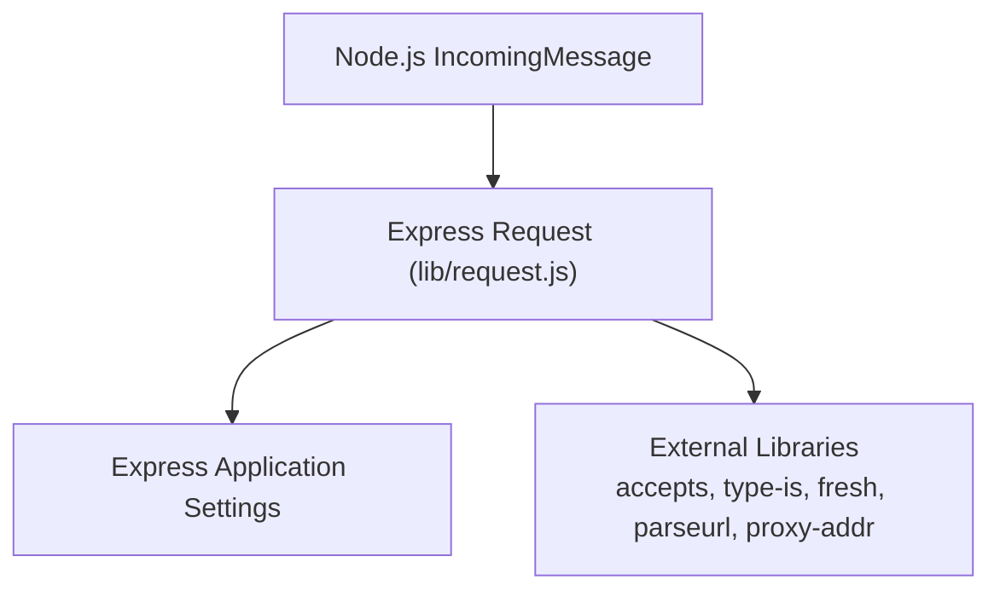

**Diagram sources**
- [request.js](file://lib/request.js)

## Detailed Component Analysis

### Header Processing: req.get(name) and req.header(name)
- Purpose: Retrieve header values with normalized casing and a special case for Referrer/Referer.
- Behavior:
  - Returns the header value if present; otherwise undefined.
  - Throws a TypeError if name is missing or not a string.
  - Treats “referer” and “referrer” as equivalent.
- Practical usage:
  - Access Content-Type, Authorization, X-Custom-Header, etc.
  - Use alias req.header for readability.
- Related tests:
  - Header retrieval and special-case referrer handling.
  - Error conditions for missing or invalid name.

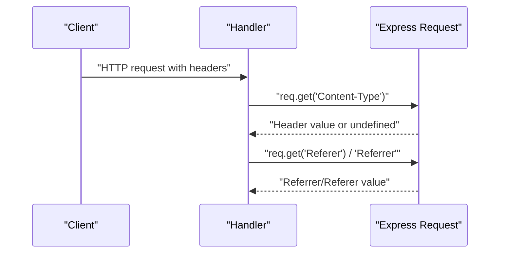

**Diagram sources**
- [request.js](file://lib/request.js)
- [req.get.js](file://test/req.get.js)

**Section sources**
- [request.js](file://lib/request.js)
- [req.get.js](file://test/req.get.js)

### Content Negotiation
- req.accepts(types...)
  - Matches requested media types against Accept header.
  - Supports argument lists, arrays, and quality values.
  - Returns best match or false.
- req.acceptsCharsets(charsets...)
  - Matches charsets against Accept-Charset; returns best match or false.
- req.acceptsEncodings(encodings...)
  - Matches encodings against Accept-Encoding; returns best match or false.
- req.acceptsLanguages(languages...)
  - Matches languages against Accept-Language; returns best match or false.

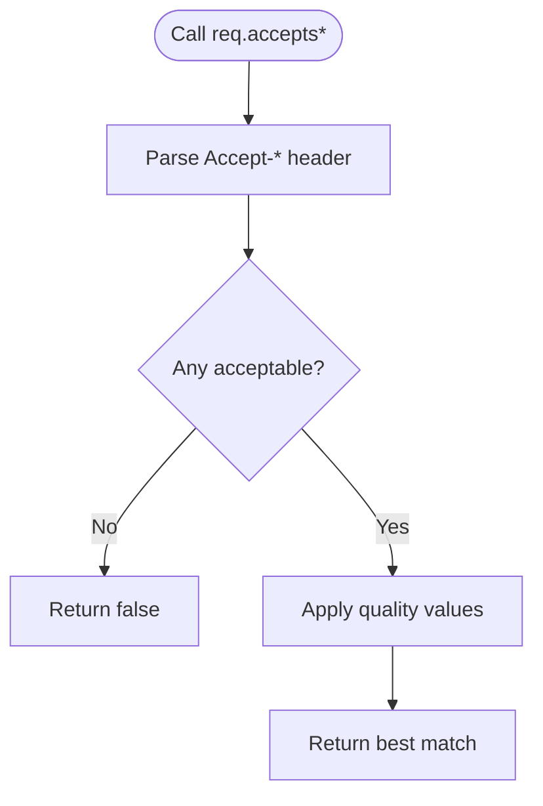

**Diagram sources**
- [request.js](file://lib/request.js)
- [req.accepts.js](file://test/req.accepts.js)
- [req.acceptsCharsets.js](file://test/req.acceptsCharsets.js)
- [req.acceptsEncodings.js](file://test/req.acceptsEncodings.js)
- [req.acceptsLanguages.js](file://test/req.acceptsLanguages.js)

**Section sources**
- [request.js](file://lib/request.js)
- [req.accepts.js](file://test/req.accepts.js)
- [req.acceptsCharsets.js](file://test/req.acceptsCharsets.js)
- [req.acceptsEncodings.js](file://test/req.acceptsEncodings.js)
- [req.acceptsLanguages.js](file://test/req.acceptsLanguages.js)
- [index.js](file://examples/content-negotiation/index.js)

### URL Parsing: req.path and req.query
- req.path
  - Returns the parsed pathname from the request URL.
- req.query
  - Controlled by the “query parser” setting:
    - Disabled: returns an empty object.
    - Simple: parses basic keys.
    - Extended: parses nested and indexed keys plus dots.
    - Function: uses custom parser function.
  - Tests cover defaults, simple/extended modes, custom function, and errors for unknown values.

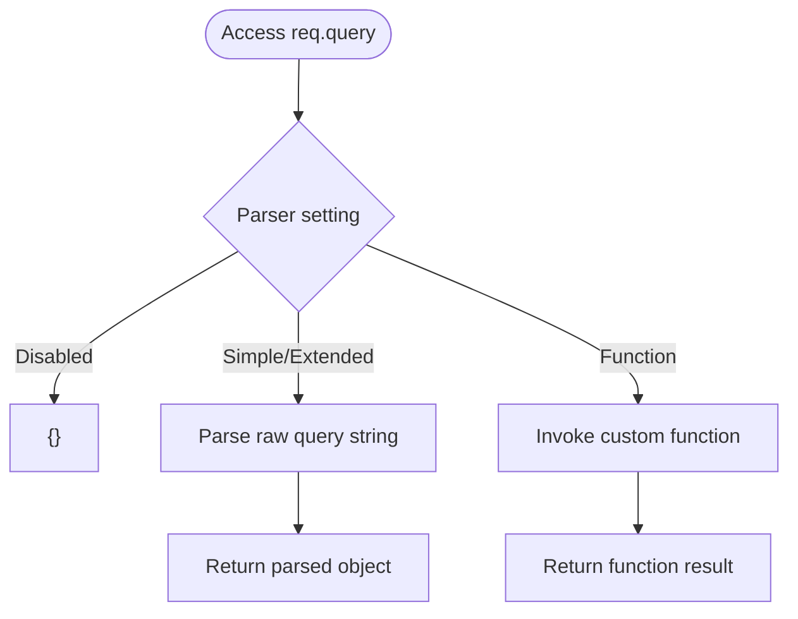

**Diagram sources**
- [request.js](file://lib/request.js)
- [req.path.js](file://test/req.path.js)
- [req.query.js](file://test/req.query.js)

**Section sources**
- [request.js](file://lib/request.js)
- [req.path.js](file://test/req.path.js)
- [req.query.js](file://test/req.query.js)

### IP Address Handling: req.ip and req.ips
- req.ip
  - Returns the client address according to trust proxy rules; falls back to socket remote address when not trusted.
- req.ips
  - Returns an array of trusted proxy+client addresses in order farthest to closest, excluding the socket address.
- Trust proxy modes:
  - Boolean enable/disable.
  - Hop count (number).
  - List of trusted IPs.

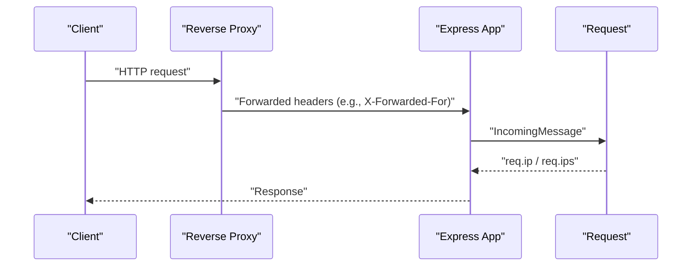

**Diagram sources**
- [request.js](file://lib/request.js)
- [req.ip.js](file://test/req.ip.js)
- [req.ips.js](file://test/req.ips.js)

**Section sources**
- [request.js](file://lib/request.js)
- [req.ip.js](file://test/req.ip.js)
- [req.ips.js](file://test/req.ips.js)

### Protocol Detection: req.protocol and req.secure
- req.protocol
  - Returns “http” or “https”.
  - Uses socket encryption state by default.
  - Honors X-Forwarded-Proto when trust proxy allows; trims and takes the first value if multiple.
- req.secure
  - Boolean shortcut for protocol === “https”.

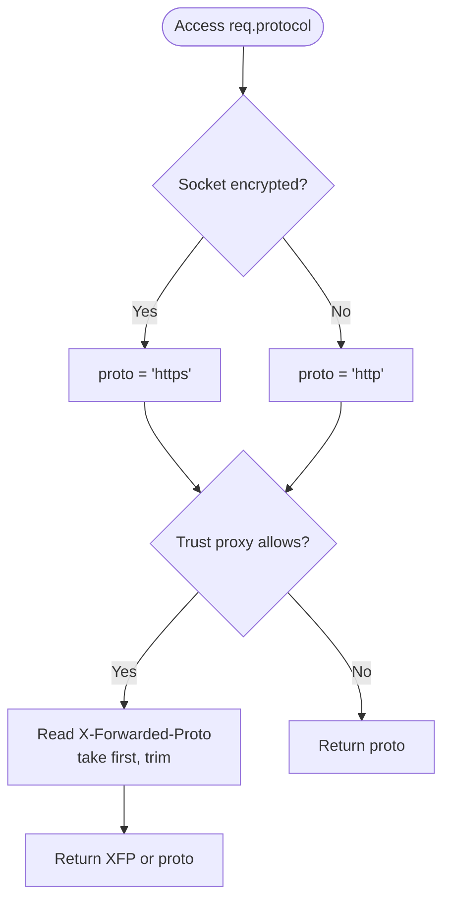

**Diagram sources**
- [request.js](file://lib/request.js)
- [req.protocol.js](file://test/req.protocol.js)
- [req.secure.js](file://test/req.secure.js)

**Section sources**
- [request.js](file://lib/request.js)
- [req.protocol.js](file://test/req.protocol.js)
- [req.secure.js](file://test/req.secure.js)

### Host Information: req.host and req.hostname
- req.host
  - Returns Host header value or X-Forwarded-Host if trusted; preserves port if present.
- req.hostname
  - Returns hostname portion of host, stripping port; supports IPv6 literals.
- Trust proxy rules apply similarly to protocol handling.

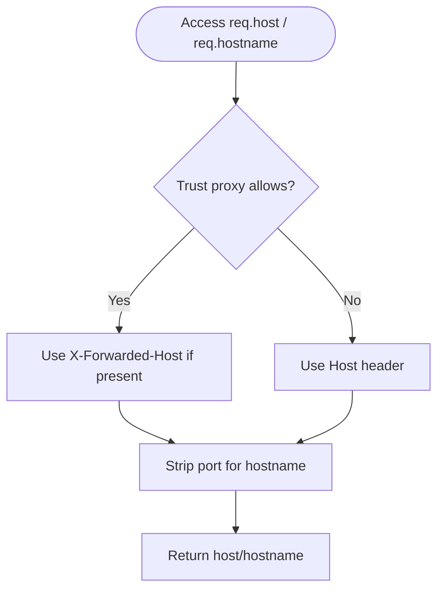

**Diagram sources**
- [request.js](file://lib/request.js)
- [req.host.js](file://test/req.host.js)
- [req.hostname.js](file://test/req.hostname.js)

**Section sources**
- [request.js](file://lib/request.js)
- [req.host.js](file://test/req.host.js)
- [req.hostname.js](file://test/req.hostname.js)

### Subdomain Extraction: req.subdomains
- Returns an array of subdomain segments derived from hostname.
- Behavior depends on subdomain offset setting:
  - Default offset yields typical top-level subdomains.
  - Offset 0 yields reversed parts including TLD.
  - Offset > 0 slices the reversed array accordingly.
- Works with IPv4/IPv6 hostnames by returning empty array when IP.

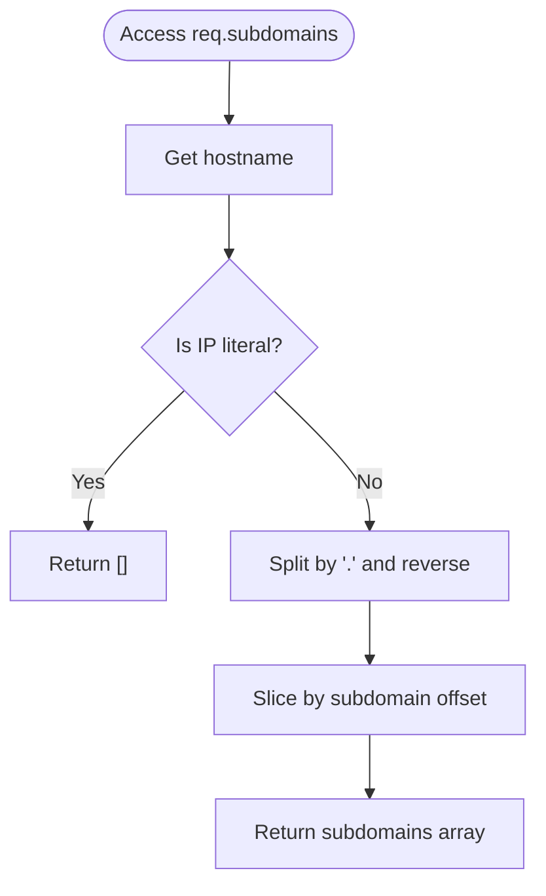

**Diagram sources**
- [request.js](file://lib/request.js)
- [req.subdomains.js](file://test/req.subdomains.js)

**Section sources**
- [request.js](file://lib/request.js)
- [req.subdomains.js](file://test/req.subdomains.js)

### Conditional Request Handling: req.fresh and req.stale
- req.fresh
  - True for GET/HEAD with 2xx/304 responses when ETag or Last-Modified headers match.
  - Ignores If-Modified-Since when If-None-Match is present.
- req.stale
  - Inverse of fresh.

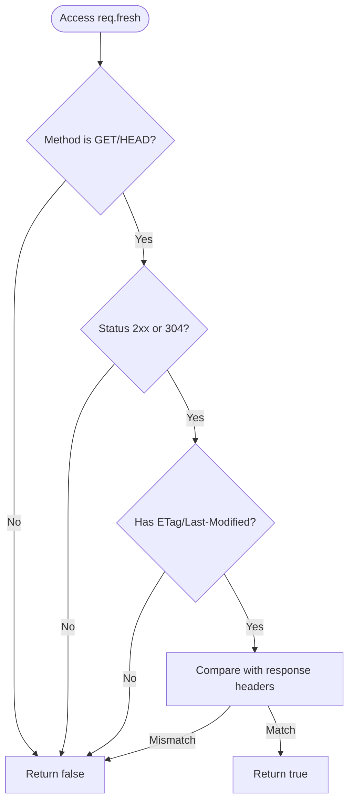

**Diagram sources**
- [request.js](file://lib/request.js)
- [req.fresh.js](file://test/req.fresh.js)
- [req.stale.js](file://test/req.stale.js)

**Section sources**
- [request.js](file://lib/request.js)
- [req.fresh.js](file://test/req.fresh.js)
- [req.stale.js](file://test/req.stale.js)

### XMLHttpRequest Detection: req.xhr
- Returns true when X-Requested-With equals “xmlhttprequest” (case-insensitive); otherwise false.

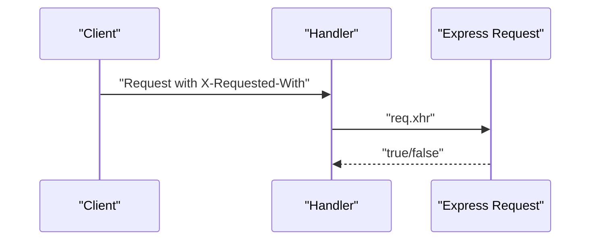

**Diagram sources**
- [request.js](file://lib/request.js)
- [req.xhr.js](file://test/req.xhr.js)

**Section sources**
- [request.js](file://lib/request.js)
- [req.xhr.js](file://test/req.xhr.js)

## Dependency Analysis
Express request getters depend on:
- Node.js http.IncomingMessage (prototype chain)
- External libraries: accepts, type-is, fresh, parseurl, proxy-addr
- Application settings: trust proxy function, subdomain offset, query parser function

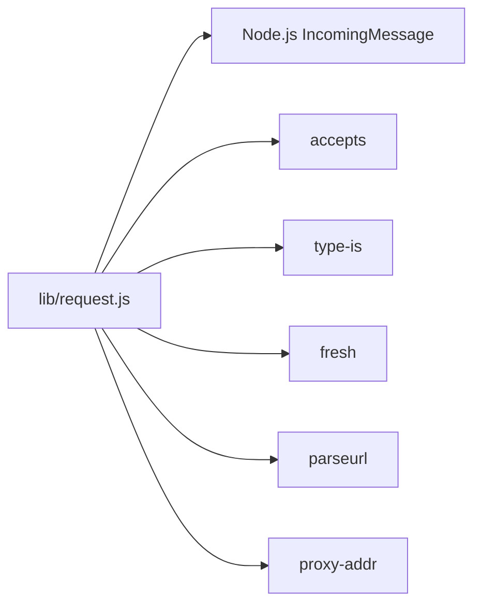

**Diagram sources**
- [request.js](file://lib/request.js)

**Section sources**
- [request.js](file://lib/request.js)

## Performance Considerations
- Prefer using getters for repeated access; they compute values lazily and reuse parsed state where applicable.
- Minimize heavy parsing by configuring the query parser appropriately (simple vs extended) to avoid unnecessary overhead.
- Avoid excessive trust proxy configuration; overly broad trust can lead to misidentification of client IPs and potential routing issues.
- Use req.fresh/stale to reduce payload sizes by responding with 304 Not Modified when appropriate.

[No sources needed since this section provides general guidance]

## Security Considerations
- Trust proxy configuration
  - Only enable trust proxy behind a reverse proxy you control.
  - Configure trust proxy with explicit hop counts or trusted IP lists to prevent spoofing.
- Header validation
  - Treat X-Forwarded-* headers as untrusted by default; verify via trust proxy rules.
  - Validate req.host and req.hostname before constructing absolute URLs to prevent open redirect risks.
- Input validation
  - Validate req.query parameters using a schema or sanitization library before use.
  - Limit parameter depth and size to mitigate parsing overhead and injection risks.
- Protocol and secure checks
  - Use req.secure for enforcing HTTPS redirects and secure cookie flags.
- Subdomain handling
  - Be cautious with subdomain-based routing; ensure proper validation and normalization.

[No sources needed since this section provides general guidance]

## Troubleshooting Guide
- req.get throws TypeError for missing or invalid name
  - Ensure the header name is a non-empty string.
- req.accepts returns unexpected false
  - Verify Accept header correctness and quality values.
  - Confirm the requested type is supported by the client.
- req.protocol and req.secure inconsistent behind proxies
  - Enable trust proxy and configure X-Forwarded-Proto handling.
- req.ip and req.ips empty or incorrect
  - Confirm trust proxy mode and X-Forwarded-For ordering.
- req.host and req.hostname malformed
  - Check IPv6 literal brackets and port stripping behavior.
- req.subdomains empty unexpectedly
  - Adjust subdomain offset or confirm hostname format.
- req.fresh and req.stale not behaving as expected
  - Ensure response includes ETag or Last-Modified headers.
  - Confirm request includes matching conditional headers.

**Section sources**
- [req.get.js](file://test/req.get.js)
- [req.accepts.js](file://test/req.accepts.js)
- [req.protocol.js](file://test/req.protocol.js)
- [req.ip.js](file://test/req.ip.js)
- [req.host.js](file://test/req.host.js)
- [req.hostname.js](file://test/req.hostname.js)
- [req.subdomains.js](file://test/req.subdomains.js)
- [req.fresh.js](file://test/req.fresh.js)
- [req.stale.js](file://test/req.stale.js)

## Conclusion
Express’s Request object augments Node.js’s IncomingMessage with powerful, ergonomic helpers for content negotiation, header access, URL parsing, IP and protocol handling, host/subdomain extraction, conditional caching, and XHR detection. Properly configuring trust proxy, query parser, and subdomain offset ensures robust and secure behavior. The included tests serve as reliable references for expected outcomes across varied scenarios.