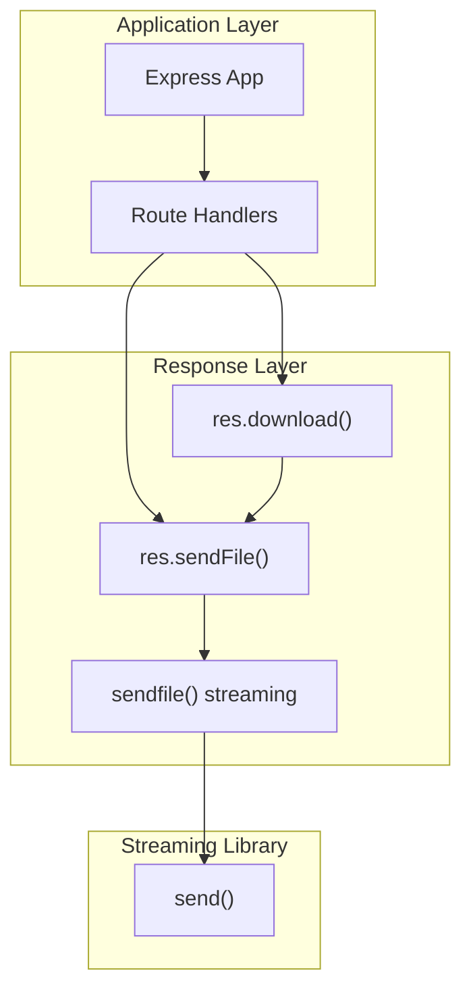
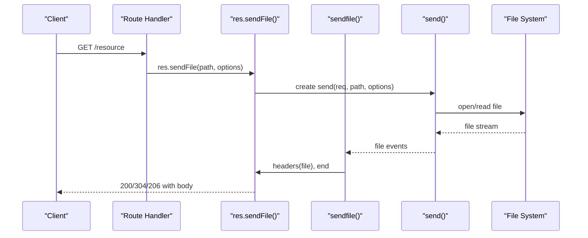
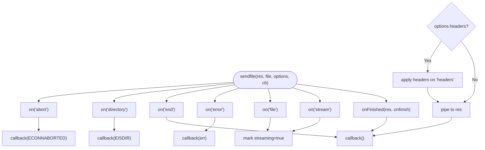
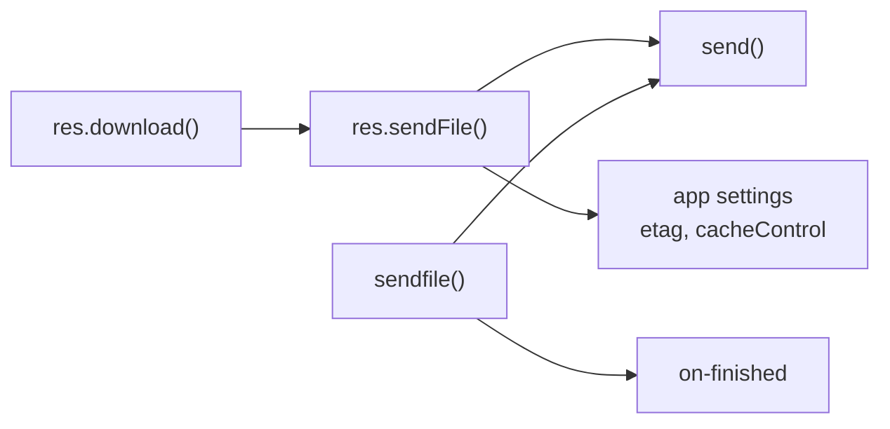

# File Serving and Downloads

<cite>
**Referenced Files in This Document**
- [response.js](file://lib/response.js)
- [index.js](file://examples/downloads/index.js)
- [res.sendFile.js](file://test/res.sendFile.js)
- [res.download.js](file://test/res.download.js)
- [express.static.js](file://test/express.static.js)
</cite>

## Table of Contents
1. [Introduction](#introduction)
2. [Project Structure](#project-structure)
3. [Core Components](#core-components)
4. [Architecture Overview](#architecture-overview)
5. [Detailed Component Analysis](#detailed-component-analysis)
6. [Dependency Analysis](#dependency-analysis)
7. [Performance Considerations](#performance-considerations)
8. [Security Considerations](#security-considerations)
9. [Troubleshooting Guide](#troubleshooting-guide)
10. [Conclusion](#conclusion)

## Introduction
This document explains how Express serves files and handles downloads, focusing on the response methods that power file delivery: res.sendFile(), res.download(), and the underlying streaming pipeline. It covers options such as caching, range requests, dotfiles handling, headers, and ETag generation. It also documents security considerations including path traversal protection and best practices for dynamic file serving, protected access, and large file handling.

## Project Structure
The file-serving logic is implemented in the response module and exercised by example applications and tests:
- Core implementation: lib/response.js
- Example usage: examples/downloads/index.js
- Tests for res.sendFile(): test/res.sendFile.js
- Tests for res.download(): test/res.download.js
- Additional range and static serving tests: test/express.static.js

**Diagram sources**
- [response.js:371-482](file://lib/response.js#L371-L482)
- [response.js:921-1009](file://lib/response.js#L921-L1009)

**Section sources**
- [response.js:371-482](file://lib/response.js#L371-L482)
- [index.js:15-34](file://examples/downloads/index.js#L15-L34)

## Core Components
- res.sendFile(path, options?, callback?): Serves a file with fine-grained control over caching, headers, dotfiles, and streaming. It validates the path and delegates to the streaming layer.
- res.download(path, filename?, options?, callback?): Sends a file as an attachment with automatic Content-Disposition and filename handling, merging user headers while preserving the attachment semantics.
- sendfile(res, file, options, callback): Internal streaming pipeline that wires event handlers, applies custom headers, and pipes the file stream to the response.

Key behaviors:
- Path validation: absolute path required unless root is provided.
- ETag generation: controlled by application settings and optional per-request options.
- Caching: Cache-Control defaults to public, max-age=0; can be tuned via options.
- Range requests: opt-in via acceptRanges; honors Range headers and sets Content-Range.
- Dotfiles: configurable via dotfiles option.
- Headers: custom headers are applied on successful transfer.

**Section sources**
- [response.js:371-413](file://lib/response.js#L371-L413)
- [response.js:433-482](file://lib/response.js#L433-L482)
- [response.js:921-1009](file://lib/response.js#L921-L1009)

## Architecture Overview
The file-serving stack integrates Express response methods with a streaming library and Node’s HTTP response:

**Diagram sources**
- [response.js:371-413](file://lib/response.js#L371-L413)
- [response.js:921-1009](file://lib/response.js#L921-L1009)

## Detailed Component Analysis

### res.sendFile()
res.sendFile() validates inputs, constructs a file stream, and streams it to the client. It supports:
- maxAge: sets Cache-Control max-age (string or ms), capped to 1 year.
- root: allows relative paths; path must be within root to prevent traversal.
- headers: custom headers applied on successful transfer.
- dotfiles: "allow"|"deny"|"ignore" to control visibility of hidden files.
- acceptRanges: opt-in to advertise Accept-Ranges and honor Range requests.
- cacheControl/lastModified/immutable: toggles for Cache-Control, Last-Modified, and immutable directive.
- ETag: generated when enabled by app settings and not overridden.

Behavioral highlights:
- Throws for missing or invalid path.
- Enforces absolute path unless root is provided.
- Honors conditional requests (If-None-Match) and HEAD.
- Emits 304 when fresh; 206 for partial content on range requests.

**Section sources**
- [response.js:371-413](file://lib/response.js#L371-L413)
- [res.sendFile.js:16-174](file://test/res.sendFile.js#L16-L174)
- [res.sendFile.js:339-451](file://test/res.sendFile.js#L339-L451)
- [res.sendFile.js:453-507](file://test/res.sendFile.js#L453-L507)
- [res.sendFile.js:509-584](file://test/res.sendFile.js#L509-L584)
- [res.sendFile.js:586-622](file://test/res.sendFile.js#L586-L622)
- [res.sendFile.js:624-777](file://test/res.sendFile.js#L624-L777)
- [res.sendFile.js:778-843](file://test/res.sendFile.js#L778-L843)

### res.download()
res.download() wraps res.sendFile() to:
- Set Content-Disposition to attachment with filename derived from the path or provided filename.
- Merge user-provided headers while preserving Content-Disposition semantics.
- Respect root option for relative paths and enforce traversal protections.

Range request support:
- Advertises Accept-Ranges and responds to Range with Content-Range and 206 Partial Content.

**Section sources**
- [response.js:433-482](file://lib/response.js#L433-L482)
- [res.download.js:16-57](file://test/res.download.js#L16-L57)
- [res.download.js:59-73](file://test/res.download.js#L59-L73)
- [res.download.js:151-169](file://test/res.download.js#L151-L169)
- [res.download.js:286-355](file://test/res.download.js#L286-L355)

### Streaming Pipeline (sendfile)
The internal sendfile() function:
- Wires event handlers for directory, end, error, file, and stream events.
- Applies custom headers when provided.
- Pipes the file stream to the HTTP response.
- Handles request abortion and completion detection.

**Diagram sources**
- [response.js:921-1009](file://lib/response.js#L921-L1009)

**Section sources**
- [response.js:921-1009](file://lib/response.js#L921-L1009)

### Range Requests and Partial Content
Both res.sendFile() and res.download() support range requests when acceptRanges is enabled:
- Advertise Accept-Ranges: bytes
- Honor Range header and respond with 206 Partial Content and Content-Range
- Handle suffix forms (-n, n-) and out-of-range conditions

Tests demonstrate:
- Byte range parsing and inclusive boundaries
- Content-Range formatting and Content-Length adaptation
- 416 responses for out-of-range requests
- Graceful fallback to full content when ranges are invalid

**Section sources**
- [res.sendFile.js:346-413](file://test/res.sendFile.js#L346-L413)
- [res.download.js:31-56](file://test/res.download.js#L31-L56)
- [express.static.js:593-690](file://test/express.static.js#L593-L690)

### Caching and Conditional Requests
- Cache-Control defaults to public, max-age=0; can be toggled via cacheControl and maxAge options.
- ETag generation respects app settings and can be disabled per request.
- Last-Modified can be included via lastModified option.
- Conditional requests (If-None-Match, If-Modified-Since) are honored, returning 304 when appropriate.

**Section sources**
- [res.sendFile.js:116-123](file://test/res.sendFile.js#L116-L123)
- [res.sendFile.js:586-622](file://test/res.sendFile.js#L586-L622)
- [res.sendFile.js:624-692](file://test/res.sendFile.js#L624-L692)
- [res.sendFile.js:694-777](file://test/res.sendFile.js#L694-L777)

### Dotfiles Handling
- dotfiles option controls behavior for hidden files:
  - "allow": serve hidden files
  - "deny": return 403 Forbidden
  - "ignore": return 404 Not Found

**Section sources**
- [res.sendFile.js:453-507](file://test/res.sendFile.js#L453-L507)

### Headers and Content-Disposition
- Custom headers are applied during successful transfer.
- Content-Type can be overridden via headers.
- res.download() ensures Content-Disposition remains attachment and filename-related regardless of user-provided headers.

**Section sources**
- [res.sendFile.js:509-584](file://test/res.sendFile.js#L509-L584)
- [res.download.js:247-284](file://test/res.download.js#L247-L284)

## Dependency Analysis
- res.sendFile() depends on:
  - send() for file streaming and range/caching support
  - path validation and encoding
  - application settings for ETag and caching
- res.download() depends on res.sendFile() and content-disposition for attachment semantics
- sendfile() depends on on-finished for completion/error handling and applies custom headers

**Diagram sources**
- [response.js:371-482](file://lib/response.js#L371-L482)
- [response.js:921-1009](file://lib/response.js#L921-L1009)

**Section sources**
- [response.js:371-482](file://lib/response.js#L371-L482)
- [response.js:921-1009](file://lib/response.js#L921-L1009)

## Performance Considerations
- Streaming: Files are streamed to avoid loading entire content into memory.
- Range requests: Enable acceptRanges for large files to improve responsiveness and bandwidth efficiency.
- ETag and conditional requests: Reduce unnecessary transfers when clients revalidate.
- Cache-Control tuning: Use maxAge and immutable for long-lived assets; balance freshness vs. bandwidth.
- HEAD and 304: Serve lightweight responses for revalidation.
- Large files: Prefer streaming with range support; avoid synchronous file reads.

[No sources needed since this section provides general guidance]

## Security Considerations
- Path traversal protection:
  - Absolute path required unless root is provided; res.sendFile() enforces this.
  - When root is used, traversal outside root is rejected (403).
  - Tests demonstrate rejection of ../ and encoded variants.
- Dotfiles: Controlled via dotfiles option; default denies hidden files.
- Content-Disposition: res.download() preserves attachment semantics and ignores conflicting user headers.
- Request abortion: Properly handled to avoid partial writes and resource leaks.

**Section sources**
- [response.js:392-394](file://lib/response.js#L392-L394)
- [res.sendFile.js:874-901](file://test/res.sendFile.js#L874-L901)
- [res.download.js:321-355](file://test/res.download.js#L321-L355)

## Troubleshooting Guide
Common issues and resolutions:
- 404 Not Found:
  - File does not exist or path resolution failed.
  - Verify absolute path or root configuration.
- 403 Forbidden:
  - Path traversal attempts or dotfiles denied.
  - Check dotfiles option and ensure path stays within root.
- 304 Not Modified:
  - Conditional request matched; expected for revalidation.
  - Confirm If-None-Match or If-Modified-Since headers.
- Range request failures:
  - Invalid Range header falls back to full content.
  - Out-of-range requests return 416 with Content-Range */length.
- ETag mismatches:
  - Ensure app etag setting aligns with expectations.
  - Disable ETag per request if needed.

**Section sources**
- [res.sendFile.js:95-114](file://test/res.sendFile.js#L95-L114)
- [res.sendFile.js:147-173](file://test/res.sendFile.js#L147-L173)
- [res.sendFile.js:381-413](file://test/res.sendFile.js#L381-L413)
- [res.download.js:455-486](file://test/res.download.js#L455-L486)

## Conclusion
Express provides robust, secure, and efficient file serving through res.sendFile() and res.download(). These methods integrate with a streaming pipeline and leverage Node’s HTTP response to deliver files with strong support for caching, conditional requests, and range-based partial content. Proper configuration of root, dotfiles, headers, and caching options enables safe and performant file delivery across diverse scenarios.