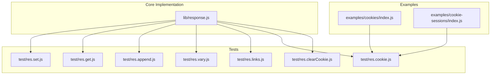
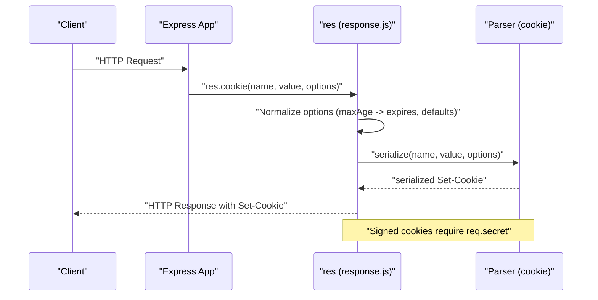
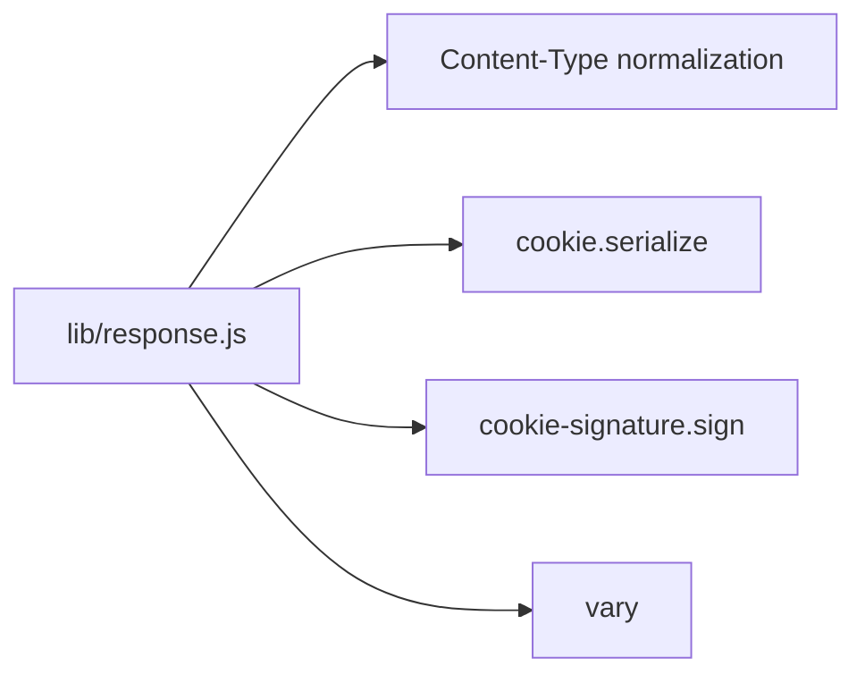

# Headers and Cookie Management

<cite>
**Referenced Files in This Document**
- [response.js](file://lib/response.js)
- [res.set.js](file://test/res.set.js)
- [res.get.js](file://test/res.get.js)
- [res.append.js](file://test/res.append.js)
- [res.vary.js](file://test/res.vary.js)
- [res.links.js](file://test/res.links.js)
- [res.cookie.js](file://test/res.cookie.js)
- [res.clearCookie.js](file://test/res.clearCookie.js)
- [cookies/index.js](file://examples/cookies/index.js)
- [cookie-sessions/index.js](file://examples/cookie-sessions/index.js)
</cite>

## Table of Contents
1. [Introduction](#introduction)
2. [Project Structure](#project-structure)
3. [Core Components](#core-components)
4. [Architecture Overview](#architecture-overview)
5. [Detailed Component Analysis](#detailed-component-analysis)
6. [Dependency Analysis](#dependency-analysis)
7. [Performance Considerations](#performance-considerations)
8. [Troubleshooting Guide](#troubleshooting-guide)
9. [Conclusion](#conclusion)
10. [Appendices](#appendices)

## Introduction
This document explains header and cookie management APIs in Express, focusing on:
- Setting and retrieving headers via res.set()/res.header(), res.get()
- Appending headers with res.append()
- Cache-Control manipulation via res.vary()
- Link headers via res.links()
- Cookies via res.cookie(), res.clearCookie(), and signed cookies

It also covers validation behavior, security implications, and browser compatibility considerations, with references to tests and examples.

## Project Structure
The relevant implementation resides in the response module and is exercised by focused unit tests. Example applications demonstrate real-world cookie usage.

**Diagram sources**
- [response.js:664-698](file://lib/response.js#L664-L698)
- [res.set.js:1-125](file://test/res.set.js#L1-L125)
- [res.get.js:1-22](file://test/res.get.js#L1-L22)
- [res.append.js:1-117](file://test/res.append.js#L1-L117)
- [res.vary.js:1-91](file://test/res.vary.js#L1-L91)
- [res.links.js:1-66](file://test/res.links.js#L1-L66)
- [res.cookie.js:1-296](file://test/res.cookie.js#L1-L296)
- [res.clearCookie.js:1-63](file://test/res.clearCookie.js#L1-L63)
- [cookies/index.js:1-54](file://examples/cookies/index.js#L1-L54)
- [cookie-sessions/index.js:1-26](file://examples/cookie-sessions/index.js#L1-L26)

**Section sources**
- [response.js:664-698](file://lib/response.js#L664-L698)
- [res.set.js:1-125](file://test/res.set.js#L1-L125)
- [res.get.js:1-22](file://test/res.get.js#L1-L22)
- [res.append.js:1-117](file://test/res.append.js#L1-L117)
- [res.vary.js:1-91](file://test/res.vary.js#L1-L91)
- [res.links.js:1-66](file://test/res.links.js#L1-L66)
- [res.cookie.js:1-296](file://test/res.cookie.js#L1-L296)
- [res.clearCookie.js:1-63](file://test/res.clearCookie.js#L1-L63)
- [cookies/index.js:1-54](file://examples/cookies/index.js#L1-L54)
- [cookie-sessions/index.js:1-26](file://examples/cookie-sessions/index.js#L1-L26)

## Core Components
- Header setters and getters
  - res.set()/res.header(): set single or multiple headers; supports object notation and content-type normalization
  - res.get(): retrieve header value
- Header appending
  - res.append(): concatenate header values safely
- Cache-control manipulation
  - res.vary(): manage Vary header entries
- Link headers
  - res.links(): build Link header with multiple relations
- Cookies
  - res.cookie(): set cookies with options (signed, expires, path, domain, security flags)
  - res.clearCookie(): remove cookies by expiring them
  - Signed cookies: validated via a secret

Key behaviors:
- res.set() coerces values to strings and normalizes content-type
- res.append() merges arrays and deduplicates entries
- res.vary() prevents duplicates and throws when called without arguments
- res.links() composes multiple relations into a single Link header
- res.cookie() serializes cookie attributes and supports signed cookies

**Section sources**
- [response.js:664-698](file://lib/response.js#L664-L698)
- [response.js:629-641](file://lib/response.js#L629-L641)
- [response.js:875-879](file://lib/response.js#L875-L879)
- [response.js:97-110](file://lib/response.js#L97-L110)
- [response.js:742-775](file://lib/response.js#L742-L775)
- [response.js:709-716](file://lib/response.js#L709-L716)

## Architecture Overview
The response module augments Node’s ServerResponse with Express-specific helpers. Tests validate behavior and edge cases, while examples demonstrate practical cookie usage.

**Diagram sources**
- [response.js:742-775](file://lib/response.js#L742-L775)
- [res.cookie.js:245-294](file://test/res.cookie.js#L245-L294)

**Section sources**
- [response.js:742-775](file://lib/response.js#L742-L775)
- [res.cookie.js:245-294](file://test/res.cookie.js#L245-L294)

## Detailed Component Analysis

### Header Setting and Retrieval
- res.set()/res.header()
  - Single-field: res.set(field, value) accepts primitives and arrays; arrays are coerced to strings
  - Object notation: res.set({ field: value }) sets multiple headers
  - Content-Type normalization: when setting Content-Type, charset is added if missing
  - Validation: setting Content-Type to an array throws
- res.get(field)
  - Retrieves header value as set

Behavior verified by:
- Setting headers and coercing values
- Multiple headers via object notation
- Content-Type normalization and array rejection

**Section sources**
- [response.js:664-698](file://lib/response.js#L664-L698)
- [res.set.js:7-90](file://test/res.set.js#L7-L90)
- [res.get.js:8-19](file://test/res.get.js#L8-L19)

### Header Appending
- res.append(field, val)
  - Concatenates values preserving arrays and deduplicating
  - Works with Set-Cookie and other headers
- Interaction with res.set()
  - res.set() resets previously appended values for the same field

Validation:
- Multiple appends produce multiple Set-Cookie entries
- Interaction with res.cookie() composes entries correctly

**Section sources**
- [response.js:629-641](file://lib/response.js#L629-L641)
- [res.append.js:9-103](file://test/res.append.js#L9-L103)

### Cache-Control Manipulation with res.vary()
- res.vary(field)
  - Adds entries to Vary without duplicates
  - Throws when called without arguments
  - Accepts string or array of fields

Usage:
- Call res.vary() after decisions affected by Accept headers to ensure proper caching behavior

**Section sources**
- [response.js:875-879](file://lib/response.js#L875-L879)
- [res.vary.js:8-90](file://test/res.vary.js#L8-L90)

### Link Headers with res.links()
- res.links(map)
  - Builds Link header entries with relation attributes
  - Supports multiple URLs per relation and multiple relations
  - Subsequent calls append to existing Link header

Validation:
- Correctly composes multiple relations and handles arrays per relation

**Section sources**
- [response.js:97-110](file://lib/response.js#L97-L110)
- [res.links.js:8-63](file://test/res.links.js#L8-L63)

### Cookies: Setting, Clearing, and Signed Handling
- res.cookie(name, value, options)
  - Serializes cookie attributes (path defaults to "/", httpOnly, secure, sameSite, expires, maxAge, partitioned, priority)
  - Converts object values to JSON string prefixed appropriately
  - Signed cookies require req.secret; throws if missing
  - maxAge is normalized to expires and seconds-based maxAge
- res.clearCookie(name, options)
  - Expires the cookie by setting a past date and ensures path defaults to "/"
  - Ignores user-supplied expires and maxAge during clearing

Security and compatibility:
- Signed cookies require a secret; without it, an error is thrown
- maxAge normalization converts milliseconds to expires and seconds
- Clearing ignores conflicting options to ensure expiry

**Section sources**
- [response.js:742-775](file://lib/response.js#L742-L775)
- [response.js:709-716](file://lib/response.js#L709-L716)
- [res.cookie.js:54-186](file://test/res.cookie.js#L54-L186)
- [res.clearCookie.js:8-61](file://test/res.clearCookie.js#L8-L61)

### Practical Cookie Usage Examples
- Basic cookies and clearing
  - Demonstrates setting cookies with maxAge and clearing them
- Cookie sessions
  - Uses a session library to manage session cookies

**Section sources**
- [cookies/index.js:34-47](file://examples/cookies/index.js#L34-L47)
- [cookie-sessions/index.js:13-19](file://examples/cookie-sessions/index.js#L13-L19)

## Dependency Analysis
- Internal dependencies
  - response.js depends on Node’s http.ServerResponse and uses utilities for content-type normalization and header composition
  - Cookie serialization and signature rely on external libraries (cookie and cookie-signature)
- Test coverage
  - Each API is covered by targeted unit tests validating behavior and error conditions
- Example usage
  - Examples integrate cookie parsing and session handling to demonstrate end-to-end cookie workflows

**Diagram sources**
- [response.js:664-698](file://lib/response.js#L664-L698)

**Section sources**
- [response.js:664-698](file://lib/response.js#L664-L698)

## Performance Considerations
- Header operations
  - res.set() normalizes content-type and coerces values; avoid redundant calls to minimize header churn
  - res.append() merges arrays efficiently; prefer batching multiple appends when possible
- Cookies
  - Using maxAge simplifies calculations; res.cookie() normalizes it to expires and seconds
  - Avoid unnecessary signed cookies when plain cookies suffice to reduce overhead
- Vary
  - Limit Vary entries to only those affecting cache behavior to keep caches effective

## Troubleshooting Guide
Common issues and resolutions:
- Content-Type as array
  - res.set('Content-Type', [...]) throws; pass a string or omit charset to leverage automatic normalization
- No arguments to res.vary()
  - Calling res.vary() without arguments throws; always pass a string or array of fields
- Signed cookies without secret
  - res.cookie(..., { signed: true }) requires req.secret; configure a secret or avoid signed cookies
- Clearing cookies with conflicting options
  - res.clearCookie() ignores user-supplied expires and maxAge to ensure expiry; adjust options accordingly

**Section sources**
- [res.set.js:78-89](file://test/res.set.js#L78-L89)
- [res.vary.js:9-20](file://test/res.vary.js#L9-L20)
- [res.cookie.js:262-276](file://test/res.cookie.js#L262-L276)
- [res.clearCookie.js:36-61](file://test/res.clearCookie.js#L36-L61)

## Conclusion
Express provides robust, tested APIs for header and cookie management:
- Use res.set()/res.header() for flexible header setting, res.get() to read, and res.append() to concatenate
- Manage cache behavior with res.vary()
- Compose Link headers with res.links()
- Set and clear cookies with res.cookie() and res.clearCookie(), including signed cookies when appropriate

Follow validation rules and security best practices to ensure reliable behavior across browsers and environments.

## Appendices

### API Reference Summary
- res.set()/res.header()
  - Purpose: set headers; object notation supported; content-type normalization applied
  - Behavior: coerces values; rejects arrays for Content-Type
- res.get(field)
  - Purpose: retrieve header value
- res.append(field, val)
  - Purpose: append header values; merges arrays and deduplicates
- res.vary(field)
  - Purpose: add Vary entries; throws without arguments; deduplicates
- res.links(map)
  - Purpose: compose Link header with multiple relations
- res.cookie(name, value, options)
  - Purpose: serialize cookie with attributes; supports signed cookies; normalizes maxAge
- res.clearCookie(name, options)
  - Purpose: expire cookie; ignores conflicting options to ensure expiry

**Section sources**
- [response.js:664-698](file://lib/response.js#L664-L698)
- [response.js:629-641](file://lib/response.js#L629-L641)
- [response.js:875-879](file://lib/response.js#L875-L879)
- [response.js:97-110](file://lib/response.js#L97-L110)
- [response.js:742-775](file://lib/response.js#L742-L775)
- [response.js:709-716](file://lib/response.js#L709-L716)