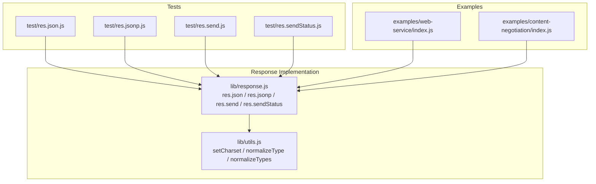
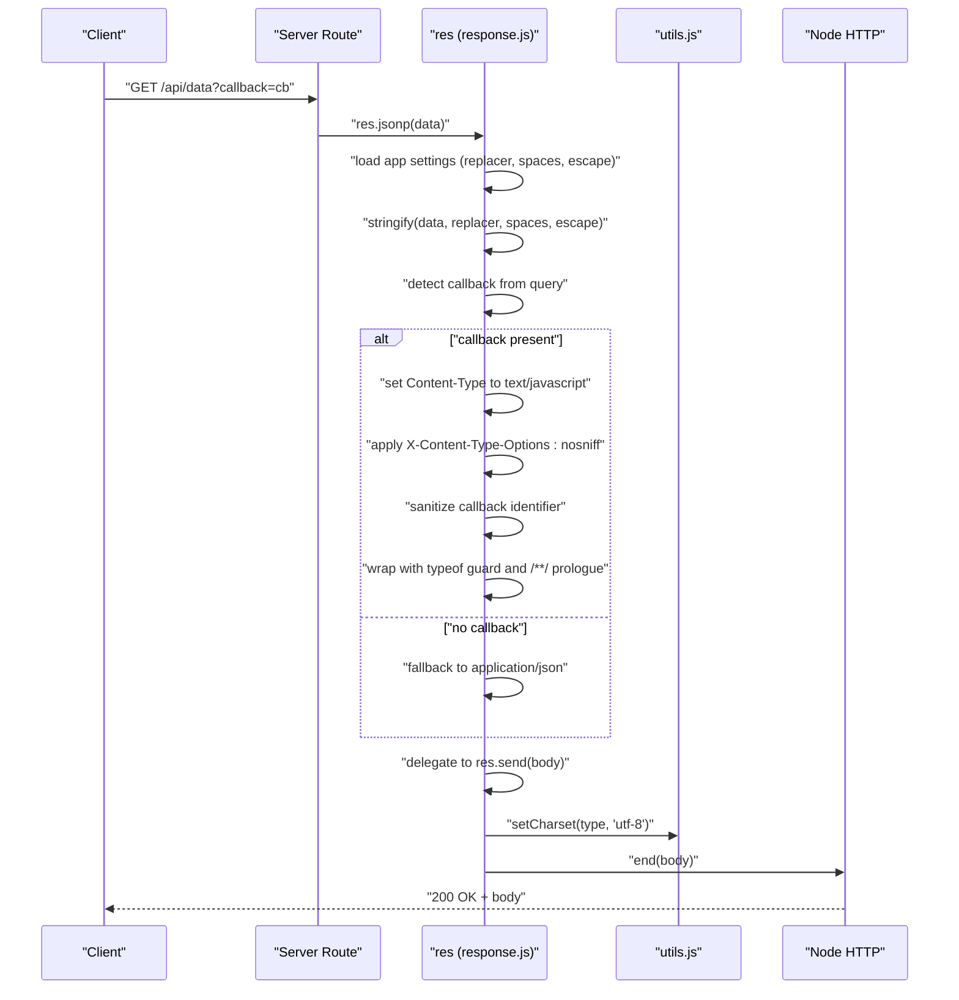
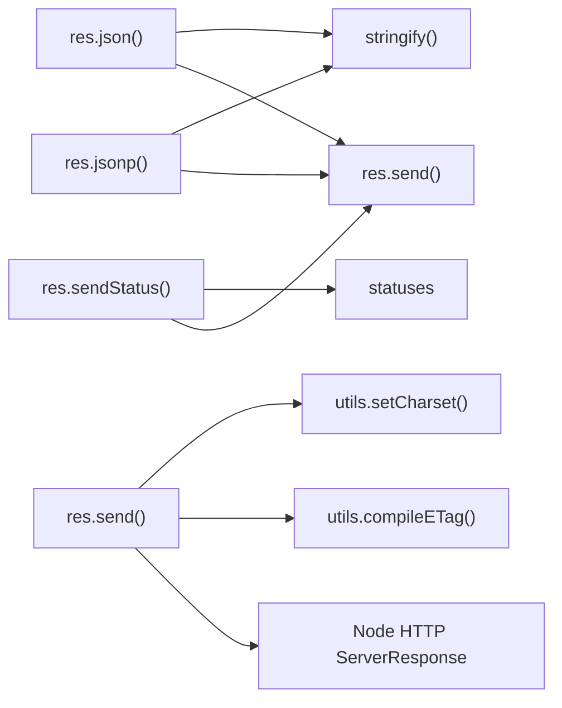

# JSON and Data Responses

<cite>
**Referenced Files in This Document**
- [response.js](file://lib/response.js)
- [utils.js](file://lib/utils.js)
- [res.json.js](file://test/res.json.js)
- [res.jsonp.js](file://test/res.jsonp.js)
- [res.send.js](file://test/res.send.js)
- [res.sendStatus.js](file://test/res.sendStatus.js)
- [index.js](file://examples/web-service/index.js)
- [index.js](file://examples/content-negotiation/index.js)
</cite>

## Table of Contents
1. [Introduction](#introduction)
2. [Project Structure](#project-structure)
3. [Core Components](#core-components)
4. [Architecture Overview](#architecture-overview)
5. [Detailed Component Analysis](#detailed-component-analysis)
6. [Dependency Analysis](#dependency-analysis)
7. [Performance Considerations](#performance-considerations)
8. [Troubleshooting Guide](#troubleshooting-guide)
9. [Conclusion](#conclusion)

## Introduction
This document explains Express.js response methods focused on JSON and data responses: res.json(), res.jsonp(), res.send(), and res.sendStatus(). It covers parameter handling, chaining, content-type negotiation, charset handling, ETag generation, and security implications. Practical examples are drawn from the test suite and example applications included in the repository.

## Project Structure
The relevant implementation resides in the response prototype and supporting utilities. Tests validate behavior across scenarios including JSON serialization options, JSONP callback handling, content-type detection, and status-only responses.

**Diagram sources**
- [response.js:1011-1047](file://lib/response.js#L1011-L1047)
- [utils.js:224-238](file://lib/utils.js#L224-L238)
- [res.json.js:1-187](file://test/res.json.js#L1-L187)
- [res.jsonp.js:1-331](file://test/res.jsonp.js#L1-L331)
- [res.send.js:1-570](file://test/res.send.js#L1-L570)
- [res.sendStatus.js:1-45](file://test/res.sendStatus.js#L1-L45)
- [index.js:75-91](file://examples/web-service/index.js#L75-L91)
- [index.js:9-26](file://examples/content-negotiation/index.js#L9-L26)

**Section sources**
- [response.js:1011-1047](file://lib/response.js#L1011-L1047)
- [utils.js:224-238](file://lib/utils.js#L224-L238)
- [res.json.js:1-187](file://test/res.json.js#L1-L187)
- [res.jsonp.js:1-331](file://test/res.jsonp.js#L1-L331)
- [res.send.js:1-570](file://test/res.send.js#L1-L570)
- [res.sendStatus.js:1-45](file://test/res.sendStatus.js#L1-L45)
- [index.js:75-91](file://examples/web-service/index.js#L75-L91)
- [index.js:9-26](file://examples/content-negotiation/index.js#L9-L26)

## Core Components
- res.json(): Sends a JSON response using configurable replacer, spaces, and escape options. Uses a private stringify helper and delegates to res.send().
- res.jsonp(): Sends a JSONP response with callback support and security mitigations. Honors application settings for replacer, spaces, and escape.
- res.send(): Sends various data types (string, number, boolean, object, buffer). Automatically detects content-type, populates Content-Length, generates ETag when configured, and handles special status codes.
- res.sendStatus(): Sends a status-only response with a standard message or numeric fallback.

**Section sources**
- [response.js:232-246](file://lib/response.js#L232-L246)
- [response.js:260-304](file://lib/response.js#L260-L304)
- [response.js:125-218](file://lib/response.js#L125-L218)
- [response.js:321-328](file://lib/response.js#L321-L328)

## Architecture Overview
The response methods build on shared utilities for content-type normalization and charset handling. JSON serialization is centralized in a dedicated helper that respects application settings.

**Diagram sources**
- [response.js:260-304](file://lib/response.js#L260-L304)
- [response.js:125-218](file://lib/response.js#L125-L218)
- [utils.js:224-238](file://lib/utils.js#L224-L238)

## Detailed Component Analysis

### res.json()
- Purpose: Serialize and send JSON responses with configurable formatting and escaping.
- Parameter handling:
  - Accepts primitives, arrays, and objects.
  - Reads application settings: json replacer, json spaces, json escape.
- Behavior:
  - Calls a private stringify helper that mirrors JSON.stringify semantics.
  - Ensures Content-Type is application/json when not already set.
  - Delegates to res.send() to finalize headers and body.
- Security and escaping:
  - When json escape is enabled, HTML-sensitive characters are escaped to prevent sniffing.
- Content-type and charset:
  - If no Content-Type is set, sets application/json with charset=utf-8.
- Chaining:
  - Returns the response object for chaining.

Practical examples from tests:
- Primitive handling (null, number, string) and arrays.
- Custom json replacer and json spaces settings.
- Unicode and HTML-sniffing character escaping behavior.

**Section sources**
- [response.js:232-246](file://lib/response.js#L232-L246)
- [response.js:1023-1047](file://lib/response.js#L1023-L1047)
- [res.json.js:35-74](file://test/res.json.js#L35-L74)
- [res.json.js:106-141](file://test/res.json.js#L106-L141)
- [res.json.js:143-162](file://test/res.json.js#L143-L162)
- [res.json.js:164-184](file://test/res.json.js#L164-L184)

### res.jsonp()
- Purpose: Provide JSONP callback responses for legacy clients while mitigating XSS risks.
- Parameter handling:
  - Accepts the same data types as res.json().
  - Reads application settings: json replacer, json spaces, json escape.
  - Reads the callback query parameter name from app settings.
- Behavior:
  - Detects callback presence from query string.
  - If present:
    - Sets Content-Type to text/javascript.
    - Applies X-Content-Type-Options: nosniff.
    - Sanitizes callback identifier to safe characters only.
    - Wraps payload with a typeof guard and a “Rosetta Flash” prologue comment.
    - Escapes Unicode line/paragraph separators in the serialized body.
  - If absent:
    - Falls back to standard JSON behavior.
- Security mitigations:
  - Callback identifier sanitization prevents injection.
  - Prologue and typeof guard reduce XSS risk.
  - Escape option applies HTML-safe escaping when enabled.
- Content-type and charset:
  - Uses text/javascript with charset=utf-8 when callback is present.
  - Preserves previous Content-Type when no callback is present.

Practical examples from tests:
- Basic JSONP callback invocation.
- First-callback selection when multiple callback parameters are provided.
- Renaming callback parameter via app setting.
- Allowed bracket notation in callback identifiers.
- Disallowed arbitrary JS in callback names.
- UTF whitespace escaping and fallback behavior.
- Security header presence and prologue verification.
- Overriding vs preserving Content-Type depending on callback presence.

**Section sources**
- [response.js:260-304](file://lib/response.js#L260-L304)
- [response.js:1023-1047](file://lib/response.js#L1023-L1047)
- [res.jsonp.js:10-21](file://test/res.jsonp.js#L10-L21)
- [res.jsonp.js:23-34](file://test/res.jsonp.js#L23-L34)
- [res.jsonp.js:49-62](file://test/res.jsonp.js#L49-L62)
- [res.jsonp.js:64-75](file://test/res.jsonp.js#L64-L75)
- [res.jsonp.js:77-88](file://test/res.jsonp.js#L77-L88)
- [res.jsonp.js:90-101](file://test/res.jsonp.js#L90-L101)
- [res.jsonp.js:116-128](file://test/res.jsonp.js#L116-L128)
- [res.jsonp.js:130-143](file://test/res.jsonp.js#L130-L143)
- [res.jsonp.js:145-158](file://test/res.jsonp.js#L145-L158)

### res.send()
- Purpose: Send a response body with automatic content-type detection and ETag generation.
- Parameter handling:
  - Supports string, number, boolean, object, and buffer-like inputs.
  - For objects, delegates to res.json().
  - For ArrayBuffer views, sets Content-Type to binary when not already set.
  - For strings, sets default Content-Type to text/html and applies charset.
- Content-type and charset:
  - Uses setCharset to ensure charset=utf-8 unless overridden.
  - Preserves existing Content-Type when explicitly set.
- ETag generation:
  - Checks app’s etag function setting and whether ETag is not already set.
  - Calculates ETag for the body and sets it when applicable.
- Special status handling:
  - Strips Content-* headers and body for 204/304.
  - Forces Content-Length to zero and strips Transfer-Encoding for 205.
  - Honors If-None-Match freshness checks for 2xx/304.
- Method chaining:
  - Returns the response object for chaining.

Practical examples from tests:
- Sending strings (HTML default), numbers, buffers, and objects.
- ETag generation for various body sizes and types.
- Manual ETag precedence over auto-generated ETag.
- HEAD method behavior (no body).
- 204/205/304 stripping behavior.
- Freshness checks and If-None-Match handling.
- JSONP not supported by res.send().

**Section sources**
- [response.js:125-218](file://lib/response.js#L125-L218)
- [utils.js:224-238](file://lib/utils.js#L224-L238)
- [res.send.js:71-83](file://test/res.send.js#L71-L83)
- [res.send.js:139-153](file://test/res.send.js#L139-L153)
- [res.send.js:208-221](file://test/res.send.js#L208-L221)
- [res.send.js:239-254](file://test/res.send.js#L239-L254)
- [res.send.js:256-270](file://test/res.send.js#L256-L270)
- [res.send.js:272-287](file://test/res.send.js#L272-L287)
- [res.send.js:337-347](file://test/res.send.js#L337-L347)

### res.sendStatus()
- Purpose: Send a status-only response with a standard message or numeric fallback.
- Parameter handling:
  - Accepts a numeric status code.
  - Uses statuses.message to map known codes to standard messages.
- Behavior:
  - Sets statusCode and Content-Type to text/plain.
  - Delegates to res.send() to finalize the response.
- Validation:
  - Invalid status codes (non-integers or out-of-range) are rejected by res.status() upstream.

Practical examples from tests:
- Known status code with standard message.
- Unknown status code with numeric body.
- Error thrown for invalid status code.

**Section sources**
- [response.js:321-328](file://lib/response.js#L321-L328)
- [res.sendStatus.js:8-18](file://test/res.sendStatus.js#L8-L18)
- [res.sendStatus.js:20-30](file://test/res.sendStatus.js#L20-L30)
- [res.sendStatus.js:32-42](file://test/res.sendStatus.js#L32-L42)

## Dependency Analysis
- res.json() and res.jsonp() depend on:
  - Application settings for replacer, spaces, escape, and callback name.
  - Private stringify helper for JSON serialization.
  - res.send() for finalizing headers and body.
- res.send() depends on:
  - utils.setCharset for charset handling.
  - utils.compileETag and etag for ETag generation.
  - Request freshness checks for 304 handling.
- res.sendStatus() depends on:
  - statuses for standard messages and res.send() for response emission.

**Diagram sources**
- [response.js:232-246](file://lib/response.js#L232-L246)
- [response.js:260-304](file://lib/response.js#L260-L304)
- [response.js:125-218](file://lib/response.js#L125-L218)
- [response.js:321-328](file://lib/response.js#L321-L328)
- [utils.js:224-238](file://lib/utils.js#L224-L238)
- [utils.js:130-152](file://lib/utils.js#L130-L152)

**Section sources**
- [response.js:232-246](file://lib/response.js#L232-L246)
- [response.js:260-304](file://lib/response.js#L260-L304)
- [response.js:125-218](file://lib/response.js#L125-L218)
- [response.js:321-328](file://lib/response.js#L321-L328)
- [utils.js:224-238](file://lib/utils.js#L224-L238)
- [utils.js:130-152](file://lib/utils.js#L130-L152)

## Performance Considerations
- res.json() and res.jsonp():
  - stringify() uses native JSON.stringify with optional replacer/spaces for formatting.
  - When json escape is enabled, additional string replacement is performed to escape HTML-sensitive characters.
- res.send():
  - Content-Length is populated efficiently; for small bodies without ETag, byte-length calculation avoids extra buffering.
  - ETag generation is deferred until after headers are finalized and only when configured.
  - For 204/304/205, unnecessary headers and body are stripped to minimize payload size.
- res.sendStatus():
  - Minimal overhead; delegates to res.send() with a short text body.

[No sources needed since this section provides general guidance]

## Troubleshooting Guide
- Unexpected Content-Type with res.json():
  - If a custom Content-Type was previously set, it is preserved. Verify middleware that sets Content-Type before res.json().
- JSONP not triggering:
  - Ensure the callback query parameter name matches the app setting for JSONP callback name.
  - Confirm the callback parameter is a non-empty string; arrays are coerced to the first element.
- XSS concerns with res.jsonp():
  - Callback identifiers are sanitized; avoid passing untrusted callback names.
  - The response includes X-Content-Type-Options: nosniff and a typeof guard.
- ETag not appearing:
  - Ensure etag is enabled or manually set; ETag is not generated if already present.
  - For very small bodies, ETag may be skipped unless explicitly configured.
- res.sendStatus() invalid status code:
  - Passing non-integers or out-of-range values triggers a TypeError. Validate inputs before calling res.sendStatus().

**Section sources**
- [res.json.js:21-33](file://test/res.json.js#L21-L33)
- [res.jsonp.js:116-128](file://test/res.jsonp.js#L116-L128)
- [res.jsonp.js:145-158](file://test/res.jsonp.js#L145-L158)
- [res.send.js:337-347](file://test/res.send.js#L337-L347)
- [res.sendStatus.js:32-42](file://test/res.sendStatus.js#L32-L42)

## Conclusion
Express’s JSON and data response methods provide robust, configurable, and secure mechanisms for delivering structured data. res.json() and res.jsonp() offer flexible serialization and escaping, while res.send() ensures automatic content-type detection, charset handling, and efficient ETag generation. res.sendStatus() simplifies status-only responses. Together, these methods enable developers to balance convenience, performance, and security across diverse client needs.