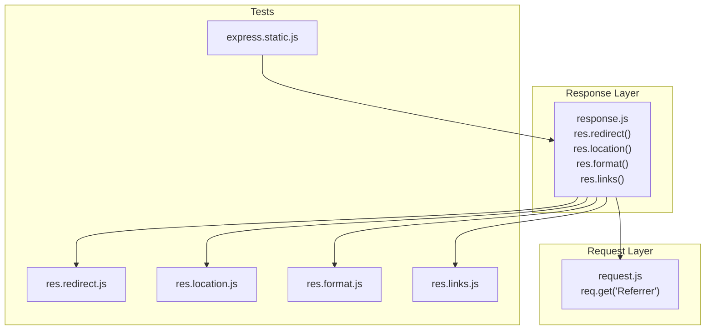
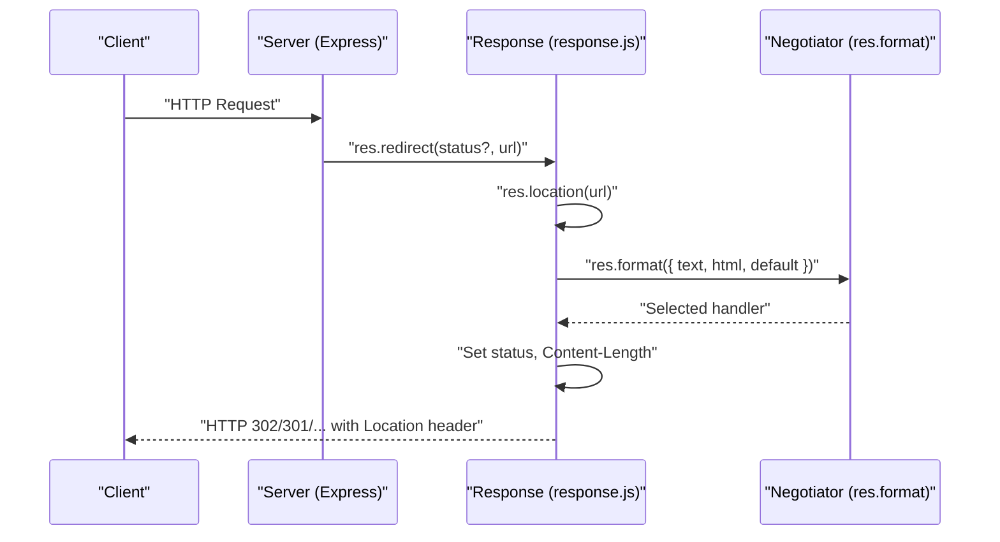
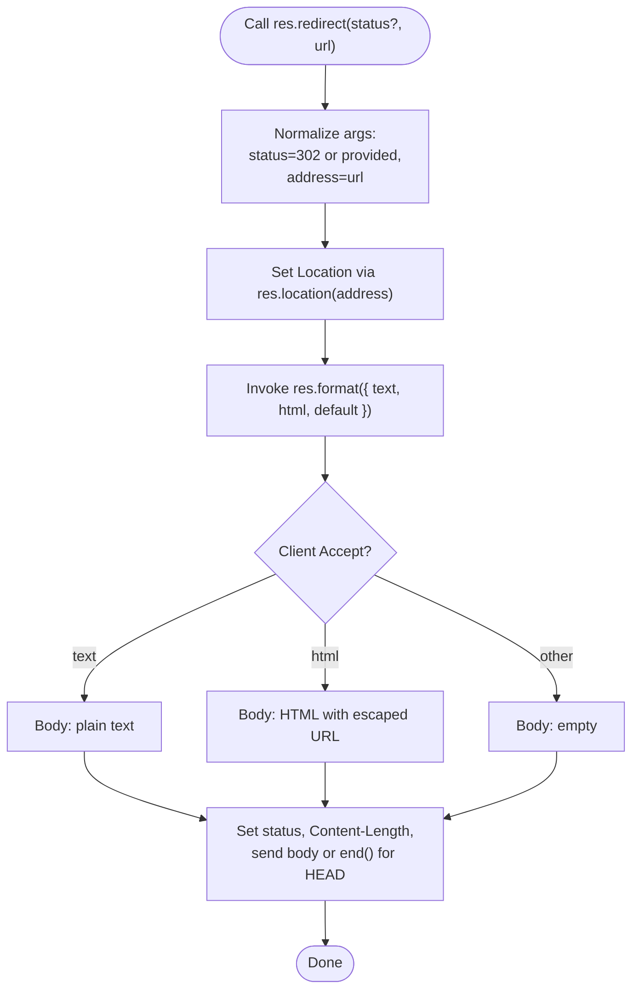
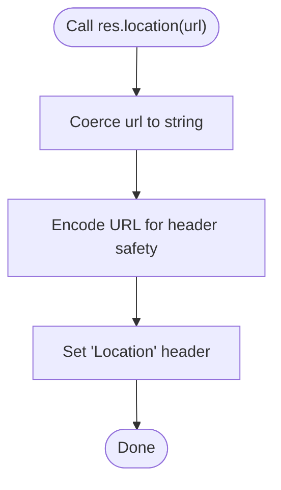
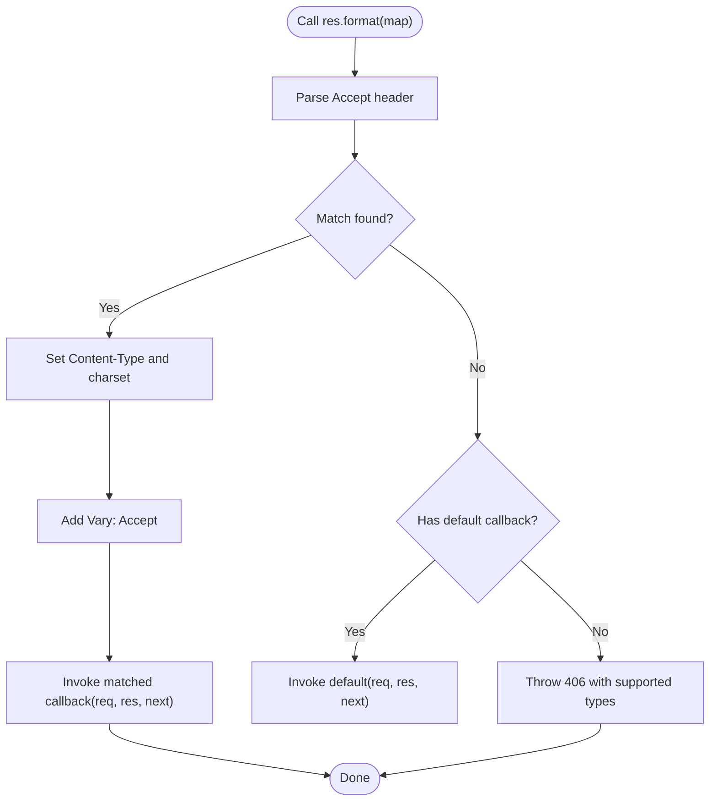
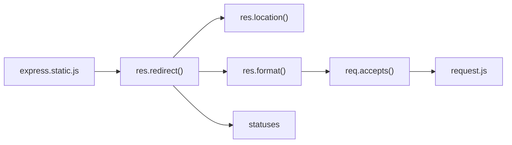

# Redirects and Routing

<cite>
**Referenced Files in This Document**
- [response.js](file://lib/response.js)
- [res.redirect.js](file://test/res.redirect.js)
- [res.location.js](file://test/res.location.js)
- [res.format.js](file://test/res.format.js)
- [res.links.js](file://test/res.links.js)
- [express.static.js](file://test/express.static.js)
- [request.js](file://lib/request.js)
</cite>

## Table of Contents
1. [Introduction](#introduction)
2. [Project Structure](#project-structure)
3. [Core Components](#core-components)
4. [Architecture Overview](#architecture-overview)
5. [Detailed Component Analysis](#detailed-component-analysis)
6. [Dependency Analysis](#dependency-analysis)
7. [Performance Considerations](#performance-considerations)
8. [Troubleshooting Guide](#troubleshooting-guide)
9. [Conclusion](#conclusion)

## Introduction
This document explains Express response methods for redirects and routing, focusing on:
- res.redirect() for HTTP redirects with status codes (301, 302, 304, 307, 308) and URL handling (relative URLs, absolute URLs, and the 'back' keyword).
- res.location() for setting Location headers without redirect behavior.
- res.format() for content negotiation based on Accept headers with callback functions for different MIME types.
- res.links() for setting Link headers with pagination support.

It also covers redirect chains, conditional redirects, SEO implications, browser behavior differences, and security considerations derived from the implementation and tests.

## Project Structure
The relevant implementation and tests are located under:
- Response methods: lib/response.js
- Tests for redirect, location, format, and links: test/res.*.js
- Additional redirect behavior tests: test/express.static.js
- Request helpers used by redirect logic: lib/request.js



**Diagram sources**
- [response.js](file://lib/response.js)
- [res.redirect.js](file://test/res.redirect.js)
- [res.location.js](file://test/res.location.js)
- [res.format.js](file://test/res.format.js)
- [res.links.js](file://test/res.links.js)
- [express.static.js](file://test/express.static.js)
- [request.js](file://lib/request.js)

**Section sources**
- [response.js](file://lib/response.js)
- [res.redirect.js](file://test/res.redirect.js)
- [res.location.js](file://test/res.location.js)
- [res.format.js](file://test/res.format.js)
- [res.links.js](file://test/res.links.js)
- [express.static.js](file://test/express.static.js)
- [request.js](file://lib/request.js)

## Core Components
- res.redirect(url): Sets Location header and responds with a redirect status and a body appropriate to the client’s Accept header. Defaults to 302.
- res.redirect(status, url): Allows explicit status selection.
- res.location(url): Sets the Location header without changing the current status or triggering redirect behavior.
- res.format(map): Negotiates content type via Accept and invokes the matching callback, setting Content-Type and Vary: Accept.
- res.links(map): Builds and appends Link headers for pagination and navigation.

Key behaviors:
- URL encoding and sanitization for Location and redirect bodies.
- Support for relative URLs and absolute URLs.
- 'back' keyword resolution via Referrer/Referer headers.
- Content negotiation with charset defaults and Vary propagation.

**Section sources**
- [response.js](file://lib/response.js)
- [res.redirect.js](file://test/res.redirect.js)
- [res.location.js](file://test/res.location.js)
- [res.format.js](file://test/res.format.js)
- [res.links.js](file://test/res.links.js)
- [express.static.js](file://test/express.static.js)
- [request.js](file://lib/request.js)

## Architecture Overview
The redirect pipeline integrates response methods with request headers and content negotiation.



**Diagram sources**
- [response.js](file://lib/response.js)
- [res.redirect.js](file://test/res.redirect.js)
- [res.format.js](file://test/res.format.js)

## Detailed Component Analysis

### res.redirect()
Behavior summary:
- Default status is 302.
- Supports explicit status as the first argument.
- Sets Location header via res.location().
- Chooses body content based on Accept header (text/html) and falls back to empty body.
- Honors HEAD requests by sending no body.
- Encodes URLs and escapes HTML in redirect bodies to prevent XSS.

Usage patterns validated by tests:
- Default 302 redirect with absolute URL.
- Explicit status (e.g., 301) with absolute URL.
- URL encoding and preservation of already-encoded sequences.
- Accept: text/html produces HTML body; Accept: text/plain produces plain text body; other types produce empty body.
- HEAD requests receive no body.



**Diagram sources**
- [response.js](file://lib/response.js)
- [res.redirect.js](file://test/res.redirect.js)

**Section sources**
- [response.js](file://lib/response.js)
- [res.redirect.js](file://test/res.redirect.js)

### res.location()
Behavior summary:
- Sets the Location header to the given URL.
- Encodes special characters while preserving already-encoded sequences.
- Handles non-string inputs by coercion and arrays by omission of array values.
- Works with relative URLs, absolute URLs, and URL instances.
- Prevents header injection by careful encoding.

Security and correctness validated by tests:
- Encoding of Unicode and special characters.
- Preservation of percent-encoded sequences.
- Relative URLs and schema-less paths.
- Case-insensitive host handling and benign encoding edge cases.



**Diagram sources**
- [response.js](file://lib/response.js)
- [res.location.js](file://test/res.location.js)

**Section sources**
- [response.js](file://lib/response.js)
- [res.location.js](file://test/res.location.js)

### res.format()
Behavior summary:
- Negotiates content type based on Accept header and quality values.
- Invokes the matching callback, sets Content-Type, and adds Vary: Accept.
- Supports canonical MIME types and extensions.
- Falls back to default callback if provided; otherwise throws 406 Not Acceptable with supported types.
- Charset is applied to the chosen Content-Type.



**Diagram sources**
- [response.js](file://lib/response.js)
- [res.format.js](file://test/res.format.js)

**Section sources**
- [response.js](file://lib/response.js)
- [res.format.js](file://test/res.format.js)

### res.links()
Behavior summary:
- Builds Link headers with relation types (e.g., next, last, prev).
- Supports multiple URLs per relation and multiple relations.
- Concatenates with existing Link headers.

```mermaid
flowchart TD
LkStart(["Call res.links(map)"]) --> Iterate["Iterate relations and URLs"]
Iterate --> Build["Build '<url>; rel=\"rel\"' entries"]
Build --> Merge["Merge with existing Link header"]
Merge --> SetLk["Set 'Link' header"]
SetLk --> LkEnd(["Done"])
```

**Diagram sources**
- [response.js](file://lib/response.js)
- [res.links.js](file://test/res.links.js)

**Section sources**
- [response.js](file://lib/response.js)
- [res.links.js](file://test/res.links.js)

## Dependency Analysis
- res.redirect() depends on:
  - res.location() for setting the Location header.
  - res.format() for selecting the response body based on Accept.
  - statuses for human-readable messages used in redirect bodies.
- res.location() depends on URL encoding utilities to sanitize headers.
- res.format() depends on request.accepts() and header normalization utilities.
- Static redirect behavior (e.g., directory redirects) is covered by express.static tests and indirectly affects redirect semantics.



**Diagram sources**
- [response.js](file://lib/response.js)
- [res.redirect.js](file://test/res.redirect.js)
- [res.location.js](file://test/res.location.js)
- [res.format.js](file://test/res.format.js)
- [express.static.js](file://test/express.static.js)
- [request.js](file://lib/request.js)

**Section sources**
- [response.js](file://lib/response.js)
- [res.redirect.js](file://test/res.redirect.js)
- [res.location.js](file://test/res.location.js)
- [res.format.js](file://test/res.format.js)
- [express.static.js](file://test/express.static.js)
- [request.js](file://lib/request.js)

## Performance Considerations
- Redirect responses are lightweight; they set headers and typically send short bodies or none (HEAD).
- Using explicit status codes avoids unnecessary client-side hops and improves caching predictability.
- res.format() adds minimal overhead; ensure Accept headers are well-formed to avoid fallback costs.
- res.links() concatenation is O(n) over the number of relations and URLs.

## Troubleshooting Guide
Common issues and resolutions:
- Unexpected redirect status:
  - Ensure you pass the status as the first argument to res.redirect() when not using 302.
- Incorrect Location header:
  - Verify URL encoding and avoid untrusted inputs; res.location() encodes safely, but validate origins externally.
- No body for redirect:
  - For HEAD requests, bodies are intentionally omitted. Confirm request method if expecting content.
- 406 Not Acceptable with res.format():
  - Provide a default callback or adjust client Accept headers to include supported types.
- Pagination Link headers missing:
  - Ensure res.links() is called before response completion and that relation URLs are valid.

**Section sources**
- [res.redirect.js](file://test/res.redirect.js)
- [res.location.js](file://test/res.location.js)
- [res.format.js](file://test/res.format.js)
- [res.links.js](file://test/res.links.js)

## Conclusion
Express provides robust, secure, and standards-aligned mechanisms for redirects and routing responses:
- res.redirect() offers flexible status control, safe URL handling, and content negotiation-aware bodies.
- res.location() sets Location headers without redirect behavior, enabling custom redirect logic.
- res.format() enables precise content negotiation with charset handling and Vary propagation.
- res.links() supports pagination and navigation via Link headers.

Adhering to proper status codes, encoding, and Accept negotiation ensures predictable browser behavior, strong security posture, and SEO-friendly redirects.