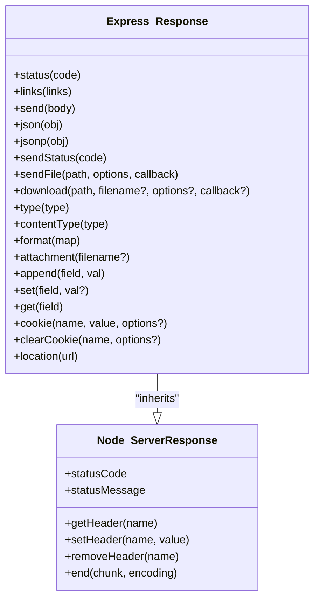
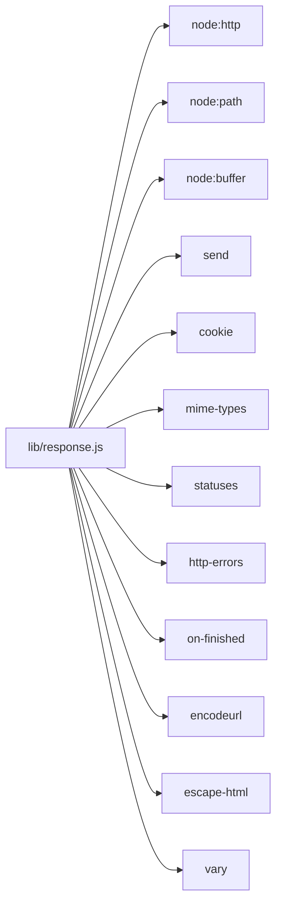

# Response Object Enhancement

<cite>
**Referenced Files in This Document**
- [response.js](file://lib/response.js)
- [index.js](file://examples/content-negotiation/index.js)
- [index.js](file://examples/downloads/index.js)
- [index.js](file://examples/cookies/index.js)
- [res.json.js](file://test/res.json.js)
- [res.jsonp.js](file://test/res.jsonp.js)
- [res.redirect.js](file://test/res.redirect.js)
- [res.download.js](file://test/res.download.js)
- [res.sendFile.js](file://test/res.sendFile.js)
- [res.type.js](file://test/res.type.js)
- [res.set.js](file://test/res.set.js)
- [res.status.js](file://test/res.status.js)
- [res.sendStatus.js](file://test/res.sendStatus.js)
- [res.cookie.js](file://test/res.cookie.js)
- [res.clearCookie.js](file://test/res.clearCookie.js)
- [res.format.js](file://test/res.format.js)
</cite>

## Table of Contents
1. [Introduction](#introduction)
2. [Project Structure](#project-structure)
3. [Core Components](#core-components)
4. [Architecture Overview](#architecture-overview)
5. [Detailed Component Analysis](#detailed-component-analysis)
6. [Dependency Analysis](#dependency-analysis)
7. [Performance Considerations](#performance-considerations)
8. [Security Considerations](#security-considerations)
9. [Troubleshooting Guide](#troubleshooting-guide)
10. [Conclusion](#conclusion)

## Introduction
This document explains the Express.js Response object enhancements and how developers can leverage its methods to build robust HTTP responses. It covers:
- JSON and JSONP responses
- Redirects and content negotiation
- File serving and downloads
- Header manipulation and content type handling
- Status code management and chained method usage
- Cookie handling (including signed cookies)
- Relationship to Node.js native ServerResponse
- Practical examples, performance tips, and security considerations

## Project Structure
The Express response implementation is centralized in a single module that extends Node’s native ServerResponse. Example applications and tests demonstrate real-world usage and edge cases for each method family.

```mermaid
graph TB
subgraph "Core Implementation"
R["lib/response.js"]
end
subgraph "Examples"
CN["examples/content-negotiation/index.js"]
DL["examples/downloads/index.js"]
CK["examples/cookies/index.js"]
end
subgraph "Tests"
TJSON["test/res.json.js"]
TJSONP["test/res.jsonp.js"]
TRED["test/res.redirect.js"]
TDLS["test/res.download.js"]
TSND["test/res.sendFile.js"]
TTYPE["test/res.type.js"]
TSET["test/res.set.js"]
TSTAT["test/res.status.js"]
TSEN["test/res.sendStatus.js"]
TCK["test/res.cookie.js"]
TCLR["test/res.clearCookie.js"]
TFMT["test/res.format.js"]
end
R --> CN
R --> DL
R --> CK
R -.enhanced by.-> TJSON
R -.enhanced by.-> TJSONP
R -.enhanced by.-> TRED
R -.enhanced by.-> TDLS
R -.enhanced by.-> TSND
R -.enhanced by.-> TTYPE
R -.enhanced by.-> TSET
R -.enhanced by.-> TSTAT
R -.enhanced by.-> TSEN
R -.enhanced by.-> TCK
R -.enhanced by.-> TCLR
R -.enhanced by.-> TFMT
```

**Diagram sources**
- [response.js:42-49](file://lib/response.js#L42-L49)
- [index.js:9-26](file://examples/content-negotiation/index.js#L9-L26)
- [index.js:26-33](file://examples/downloads/index.js#L26-L33)
- [index.js:34-47](file://examples/cookies/index.js#L34-L47)
- [res.json.js:8-33](file://test/res.json.js#L8-L33)
- [res.jsonp.js:9-21](file://test/res.jsonp.js#L9-L21)
- [res.redirect.js:8-20](file://test/res.redirect.js#L8-L20)
- [res.download.js:16-29](file://test/res.download.js#L16-L29)
- [res.sendFile.js:16-47](file://test/res.sendFile.js#L16-L47)
- [res.type.js:7-31](file://test/res.type.js#L7-L31)
- [res.set.js:7-19](file://test/res.set.js#L7-L19)
- [res.status.js:6-18](file://test/res.status.js#L6-L18)
- [res.sendStatus.js:7-18](file://test/res.sendStatus.js#L7-L18)
- [res.cookie.js:8-21](file://test/res.cookie.js#L8-L21)
- [res.clearCookie.js:7-19](file://test/res.clearCookie.js#L7-L19)
- [res.format.js:88-114](file://test/res.format.js#L88-L114)

**Section sources**
- [response.js:42-49](file://lib/response.js#L42-L49)

## Core Components
- Response prototype chain: Express response inherits from Node’s ServerResponse, enabling native HTTP features while adding convenience methods.
- Method families:
  - JSON and JSONP: res.json(), res.jsonp()
  - Redirects: res.redirect()
  - File serving: res.sendFile(), res.download()
  - Content type and headers: res.type(), res.set(), res.append(), res.vary(), res.links()
  - Status codes: res.status(), res.sendStatus()
  - Content negotiation: res.format()
  - Cookies: res.cookie(), res.clearCookie(), res.signedCookie()
  - Streaming helpers: res.send()

These methods are designed to be chainable (return the response object) and integrate with Node’s underlying HTTP mechanics.

**Section sources**
- [response.js:42-49](file://lib/response.js#L42-L49)
- [response.js:64-76](file://lib/response.js#L64-L76)
- [response.js:97-110](file://lib/response.js#L97-L110)
- [response.js:125-218](file://lib/response.js#L125-L218)
- [response.js:232-246](file://lib/response.js#L232-L246)
- [response.js:260-304](file://lib/response.js#L260-L304)
- [response.js:321-328](file://lib/response.js#L321-L328)
- [response.js:371-413](file://lib/response.js#L371-L413)
- [response.js:433-482](file://lib/response.js#L433-L482)
- [response.js:503-510](file://lib/response.js#L503-L510)
- [response.js:569-594](file://lib/response.js#L569-L594)
- [response.js:604-612](file://lib/response.js#L604-L612)
- [response.js:629-641](file://lib/response.js#L629-L641)
- [response.js:664-686](file://lib/response.js#L664-L686)
- [response.js:696-698](file://lib/response.js#L696-L698)
- [response.js:709-716](file://lib/response.js#L709-L716)
- [response.js:742-775](file://lib/response.js#L742-L775)
- [response.js:794-796](file://lib/response.js#L794-L796)

## Architecture Overview
Express wraps Node’s ServerResponse to provide a richer API surface. Methods like res.json(), res.sendFile(), and res.redirect() internally use Node’s HTTP mechanisms and often delegate to streaming libraries for efficient file transfers.

**Diagram sources**
- [response.js:42-49](file://lib/response.js#L42-L49)
- [response.js:64-76](file://lib/response.js#L64-L76)
- [response.js:97-110](file://lib/response.js#L97-L110)
- [response.js:125-218](file://lib/response.js#L125-L218)
- [response.js:232-246](file://lib/response.js#L232-L246)
- [response.js:260-304](file://lib/response.js#L260-L304)
- [response.js:321-328](file://lib/response.js#L321-L328)
- [response.js:371-413](file://lib/response.js#L371-L413)
- [response.js:433-482](file://lib/response.js#L433-L482)
- [response.js:503-510](file://lib/response.js#L503-L510)
- [response.js:569-594](file://lib/response.js#L569-L594)
- [response.js:604-612](file://lib/response.js#L604-L612)
- [response.js:629-641](file://lib/response.js#L629-L641)
- [response.js:664-686](file://lib/response.js#L664-L686)
- [response.js:696-698](file://lib/response.js#L696-L698)
- [response.js:709-716](file://lib/response.js#L709-L716)
- [response.js:742-775](file://lib/response.js#L742-L775)
- [response.js:794-796](file://lib/response.js#L794-L796)

## Detailed Component Analysis

### JSON and JSONP Responses
- res.json(obj): Serializes an object to JSON, sets Content-Type to application/json if not already set, and delegates to res.send().
- res.jsonp(obj): Supports JSONP callback injection, sets appropriate Content-Type and adds a security header when a callback is present. Escapes characters to mitigate XSS risks.

Practical usage patterns:
- Use res.json() for standard APIs.
- Use res.jsonp() when supporting legacy clients that require JSONP.

Chaining and return:
- Both methods return the response object for chaining.

Parameter handling and behavior:
- Content-Type is normalized and charset is applied when missing.
- JSONP callback name is configurable via application settings.

**Section sources**
- [response.js:232-246](file://lib/response.js#L232-L246)
- [response.js:260-304](file://lib/response.js#L260-L304)
- [res.json.js:8-33](file://test/res.json.js#L8-L33)
- [res.jsonp.js:9-21](file://test/res.jsonp.js#L9-L21)
- [res.json.js:106-141](file://test/res.json.js#L106-L141)
- [res.jsonp.js:250-285](file://test/res.jsonp.js#L250-L285)

### Redirects
- res.redirect([status,] url): Encodes the URL, sets Location header, and chooses an appropriate status (default 302). For HEAD requests, sends an empty body. When HTML or text is acceptable, renders a human-friendly redirect page with escaped URLs.

Behavior highlights:
- URL encoding and prevention of XSS in rendered pages.
- Accept header negotiation affects the redirect response format.

**Section sources**
- [response.js:794-796](file://lib/response.js#L794-L796)
- [res.redirect.js:8-20](file://test/res.redirect.js#L8-L20)
- [res.redirect.js:64-79](file://test/res.redirect.js#L64-L79)
- [res.redirect.js:81-145](file://test/res.redirect.js#L81-L145)
- [res.redirect.js:195-213](file://test/res.redirect.js#L195-L213)

### File Serving and Downloads
- res.sendFile(path, options?, callback?): Validates path requirements, supports range requests, and integrates with the send library for caching, ETags, and streaming. Honors options like acceptRanges, cacheControl, dotfiles, headers, immutable, lastModified, maxAge, and root.
- res.download(path, filename?, options?, callback?): Wraps sendFile, sets Content-Disposition to attachment, merges user headers while preserving Content-Disposition, and supports root-relative paths.

Streaming and performance:
- Range requests and partial content responses are supported.
- ETag and conditional responses reduce bandwidth.
- Proper caching headers minimize repeated transfers.

**Section sources**
- [response.js:371-413](file://lib/response.js#L371-L413)
- [response.js:433-482](file://lib/response.js#L433-L482)
- [res.sendFile.js:16-47](file://test/res.sendFile.js#L16-L47)
- [res.sendFile.js:339-383](file://test/res.sendFile.js#L339-L383)
- [res.sendFile.js:38-80](file://test/res.sendFile.js#L38-L80)
- [res.sendFile.js:116-131](file://test/res.sendFile.js#L116-L131)
- [res.sendFile.js:176-231](file://test/res.sendFile.js#L176-L231)
- [res.download.js:16-29](file://test/res.download.js#L16-L29)
- [res.download.js:59-73](file://test/res.download.js#L59-L73)
- [res.download.js:151-170](file://test/res.download.js#L151-L170)
- [res.download.js:171-283](file://test/res.download.js#L171-L283)

### Content Type and Header Manipulation
- res.type(type) / res.contentType(type): Maps extension or subtype to a full MIME type and sets Content-Type. Falls back to application/octet-stream for unknown types.
- res.set(field, val?) / res.header(field, val?): Sets headers, normalizes Content-Type with charset when needed, and coerces values to strings. Accepts an object to set multiple headers.
- res.append(field, val): Concatenates header values, handling arrays and strings.
- res.get(field): Retrieves raw header value.
- res.links(links): Builds and appends Link header entries.

Chaining and return:
- All setters return the response object for chaining.

**Section sources**
- [response.js:503-510](file://lib/response.js#L503-L510)
- [response.js:664-686](file://lib/response.js#L664-L686)
- [response.js:629-641](file://lib/response.js#L629-L641)
- [response.js:696-698](file://lib/response.js#L696-L698)
- [response.js:97-110](file://lib/response.js#L97-L110)
- [res.type.js:7-31](file://test/res.type.js#L7-L31)
- [res.set.js:7-19](file://test/res.set.js#L7-L19)
- [res.set.js:36-90](file://test/res.set.js#L36-L90)
- [res.set.js:92-123](file://test/res.set.js#L92-L123)

### Status Code Management
- res.status(code): Validates integer status codes within 100–999 and sets statusCode. Returns the response object for chaining.
- res.sendStatus(code): Sets status and sends a textual body derived from status messages or the code itself.

Validation and error handling:
- Non-integers, out-of-range codes, and invalid inputs raise errors.

**Section sources**
- [response.js:64-76](file://lib/response.js#L64-L76)
- [response.js:321-328](file://lib/response.js#L321-L328)
- [res.status.js:6-18](file://test/res.status.js#L6-L18)
- [res.status.js:119-203](file://test/res.status.js#L119-L203)
- [res.sendStatus.js:7-18](file://test/res.sendStatus.js#L7-L18)
- [res.sendStatus.js:32-42](file://test/res.sendStatus.js#L32-L42)

### Content Negotiation
- res.format(map): Chooses the best representation based on Accept header quality values, sets Content-Type accordingly, and invokes the matching handler. Adds Vary: Accept. If none match, triggers a 406 error with supported types.

Usage patterns:
- Define handlers for text, html, json, or canonical MIME types.
- Provide a default handler to avoid automatic 406 responses.

**Section sources**
- [response.js:569-594](file://lib/response.js#L569-L594)
- [index.js:9-26](file://examples/content-negotiation/index.js#L9-L26)
- [res.format.js:88-114](file://test/res.format.js#L88-L114)
- [res.format.js:116-152](file://test/res.format.js#L116-L152)
- [res.format.js:182-248](file://test/res.format.js#L182-L248)

### Cookies
- res.cookie(name, value, options?): Sets a cookie with serialization rules, optional signing, and normalization of options like maxAge, expires, path, httpOnly, secure, sameSite, priority, and partitioned. Returns the response object for chaining.
- res.clearCookie(name, options?): Forces expiration by setting a past date and ensures maxAge is not retained.

Security and validation:
- Signed cookies require a secret; otherwise an error is thrown.
- Options are validated (e.g., maxAge, expires, priority).

**Section sources**
- [response.js:742-775](file://lib/response.js#L742-L775)
- [response.js:709-716](file://lib/response.js#L709-L716)
- [res.cookie.js:8-21](file://test/res.cookie.js#L8-L21)
- [res.cookie.js:54-67](file://test/res.cookie.js#L54-L67)
- [res.cookie.js:100-186](file://test/res.cookie.js#L100-L186)
- [res.cookie.js:188-243](file://test/res.cookie.js#L188-L243)
- [res.cookie.js:245-276](file://test/res.cookie.js#L245-L276)
- [res.clearCookie.js:7-19](file://test/res.clearCookie.js#L7-L19)
- [res.clearCookie.js:22-61](file://test/res.clearCookie.js#L22-L61)

### Relationship to Node.js ServerResponse
- Express response extends Node’s ServerResponse prototype, inheriting native methods and properties (statusCode, getHeader/setHeader/removeHeader, end).
- Express methods wrap and enhance these primitives with higher-level conveniences.

**Section sources**
- [response.js:42-49](file://lib/response.js#L42-L49)

## Dependency Analysis
The response module depends on several libraries and Node built-ins:
- Node core: http, path, buffer, async_hooks
- Third-party: content-disposition, cookie, encodeurl, escape-html, http-errors, mime-types, ms, on-finished, send, statuses, vary, cookie-signature

**Diagram sources**
- [response.js:15-35](file://lib/response.js#L15-L35)

**Section sources**
- [response.js:15-35](file://lib/response.js#L15-L35)

## Performance Considerations
- Prefer res.sendFile() and res.download() for large files to leverage range requests, ETags, and efficient streaming.
- Use res.json() for structured data; avoid unnecessary transformations before calling it.
- Set appropriate cache headers (Cache-Control, ETag) to reduce bandwidth and CPU usage.
- Avoid excessive header concatenation; use res.set() once per header when possible.
- For redirects, keep URLs short and encoded to minimize payload sizes.

## Security Considerations
- JSONP: When a callback is present, res.jsonp() sets a security header and sanitizes callback names to prevent XSS. Disable JSONP if not required.
- Redirects: URLs are encoded and rendered safely; avoid injecting untrusted URLs to prevent open redirect vulnerabilities.
- Cookies: Always provide a secret for signed cookies; validate options (expires, maxAge, priority). Use httpOnly, secure, and appropriate SameSite attributes.
- Headers: Content-Type normalization prevents unexpected character sets; avoid passing arrays to Content-Type.

**Section sources**
- [response.js:260-304](file://lib/response.js#L260-L304)
- [res.redirect.js:113-129](file://test/res.redirect.js#L113-L129)
- [res.cookie.js:262-276](file://test/res.cookie.js#L262-L276)

## Troubleshooting Guide
Common issues and resolutions:
- Invalid status code: Ensure integer values within 100–999. res.status() and res.sendStatus() validate inputs and throw errors otherwise.
- Missing path in res.sendFile(): Provide an absolute path or set root; relative paths require root.
- Download failures: Verify file existence and permissions; handle callback errors appropriately.
- JSONP not served as text/javascript: Ensure a valid callback parameter is present; otherwise, fallback to JSON.
- Cookie parsing errors: Ensure cookie-parser middleware is configured with a secret when using signed cookies.

**Section sources**
- [res.status.js:119-203](file://test/res.status.js#L119-L203)
- [res.sendStatus.js:32-42](file://test/res.sendStatus.js#L32-L42)
- [res.sendFile.js:16-47](file://test/res.sendFile.js#L16-L47)
- [res.download.js:455-486](file://test/res.download.js#L455-L486)
- [res.jsonp.js:116-128](file://test/res.jsonp.js#L116-L128)
- [res.cookie.js:262-276](file://test/res.cookie.js#L262-L276)

## Conclusion
Express’s response object augments Node’s ServerResponse with powerful, ergonomic methods for building modern web APIs and applications. By understanding method semantics, chaining behavior, and the underlying HTTP mechanics, developers can craft efficient, secure, and maintainable responses tailored to diverse client needs.