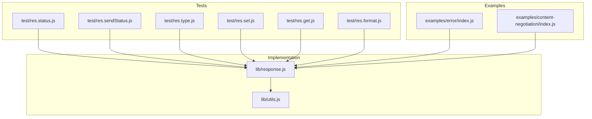
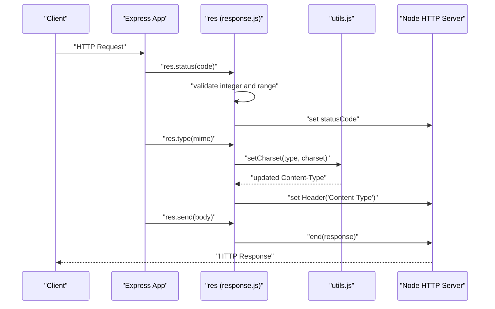
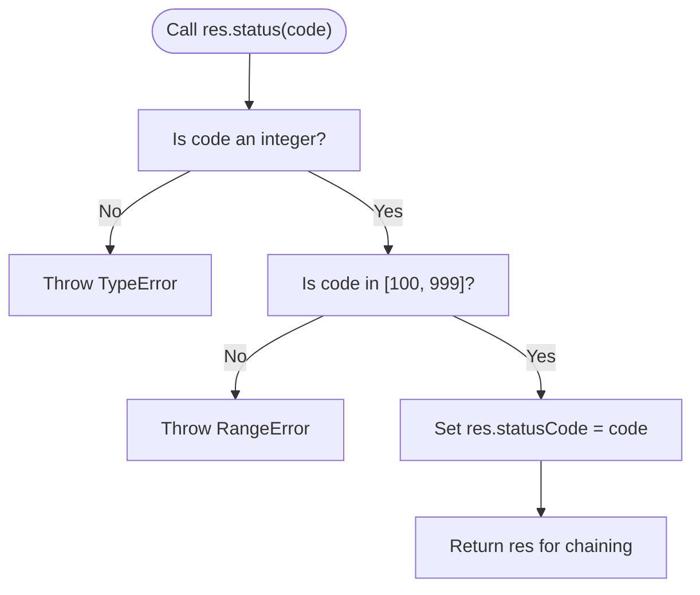
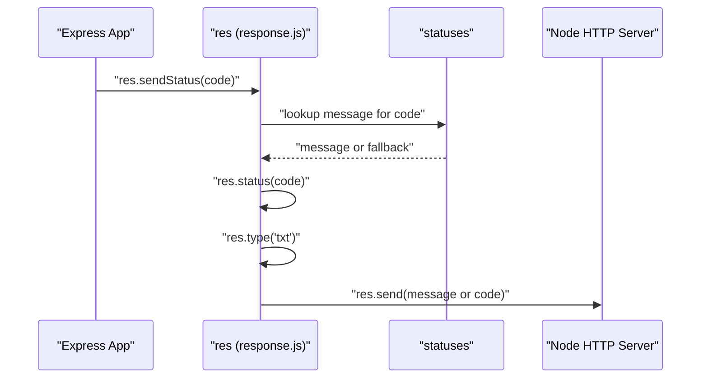
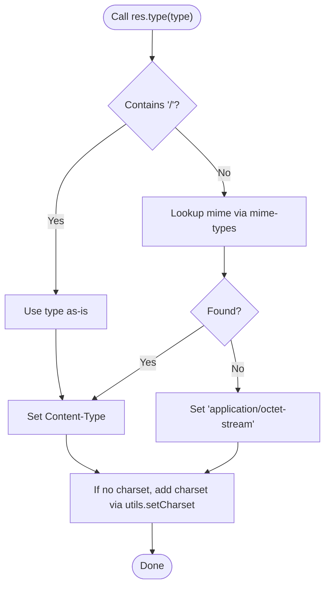
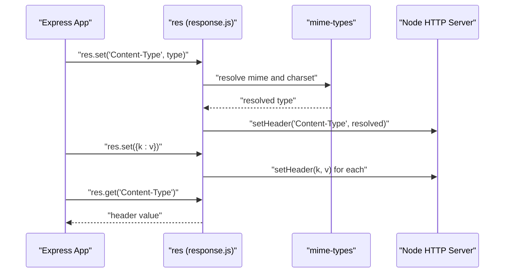
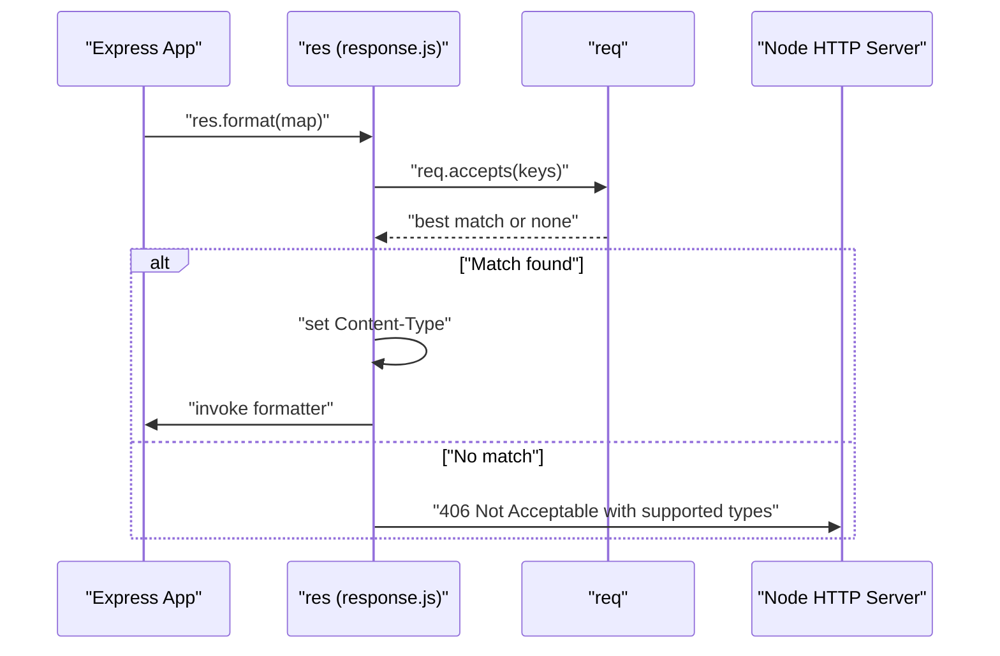
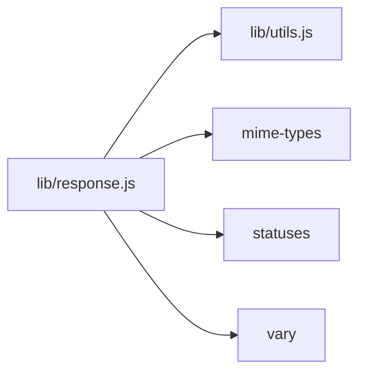

# Status Codes and Content Types

<cite>
**Referenced Files in This Document**
- [response.js](file://lib/response.js)
- [utils.js](file://lib/utils.js)
- [res.status.js](file://test/res.status.js)
- [res.sendStatus.js](file://test/res.sendStatus.js)
- [res.type.js](file://test/res.type.js)
- [res.set.js](file://test/res.set.js)
- [res.get.js](file://test/res.get.js)
- [res.format.js](file://test/res.format.js)
- [error/index.js](file://examples/error/index.js)
- [content-negotiation/index.js](file://examples/content-negotiation/index.js)
</cite>

## Table of Contents
1. [Introduction](#introduction)
2. [Project Structure](#project-structure)
3. [Core Components](#core-components)
4. [Architecture Overview](#architecture-overview)
5. [Detailed Component Analysis](#detailed-component-analysis)
6. [Dependency Analysis](#dependency-analysis)
7. [Performance Considerations](#performance-considerations)
8. [Troubleshooting Guide](#troubleshooting-guide)
9. [Conclusion](#conclusion)

## Introduction
This document focuses on Express response methods that manage HTTP status codes and content types. It covers:
- Setting status codes with validation and error handling
- Sending status-only responses with automatic body generation
- Setting Content-Type headers with MIME type detection
- Setting multiple headers at once and retrieving headers
- Practical usage patterns, HTTP specification compliance, browser behavior expectations, and debugging techniques

## Project Structure
The relevant implementation and tests live under:
- Implementation: lib/response.js, lib/utils.js
- Tests: test/res.*.js, examples/error/index.js, examples/content-negotiation/index.js

**Diagram sources**
- [response.js:64-76](file://lib/response.js#L64-L76)
- [utils.js:225-238](file://lib/utils.js#L225-L238)
- [res.status.js:8-18](file://test/res.status.js#L8-L18)
- [res.sendStatus.js:8-18](file://test/res.sendStatus.js#L8-L18)
- [res.type.js:8-18](file://test/res.type.js#L8-L18)
- [res.set.js:8-18](file://test/res.set.js#L8-L18)
- [res.get.js:8-18](file://test/res.get.js#L8-L18)
- [res.format.js:10-26](file://test/res.format.js#L10-L26)
- [error/index.js:20-27](file://examples/error/index.js#L20-L27)
- [content-negotiation/index.js:9-26](file://examples/content-negotiation/index.js#L9-L26)

**Section sources**
- [response.js:64-76](file://lib/response.js#L64-L76)
- [utils.js:225-238](file://lib/utils.js#L225-L238)
- [res.status.js:8-18](file://test/res.status.js#L8-L18)
- [res.sendStatus.js:8-18](file://test/res.sendStatus.js#L8-L18)
- [res.type.js:8-18](file://test/res.type.js#L8-L18)
- [res.set.js:8-18](file://test/res.set.js#L8-L18)
- [res.get.js:8-18](file://test/res.get.js#L8-L18)
- [res.format.js:10-26](file://test/res.format.js#L10-L26)
- [error/index.js:20-27](file://examples/error/index.js#L20-L27)
- [content-negotiation/index.js:9-26](file://examples/content-negotiation/index.js#L9-L26)

## Core Components
- Status code management
  - res.status(code): validates integer and range, sets statusCode, returns self for chaining
  - res.sendStatus(statusCode): sets status, sets Content-Type to text/plain, sends standardized message or numeric body
- Content type management
  - res.type(contentType)/res.contentType(contentType): resolves MIME type, sets Content-Type header
  - res.set(field, value) / res.set(map): sets headers; res.get(field): retrieves header value
- Content negotiation
  - res.format(map): negotiates based on Accept header, sets Content-Type, invokes matched formatter

Key behaviors:
- Validation throws TypeError for non-integers and RangeError for out-of-range codes
- Content-Type charset handling via utils.setCharset and mime-types
- Automatic header cleanup for specific status codes (e.g., 204/304 remove Content-Length/Type/Transfer-Encoding)

**Section sources**
- [response.js:64-76](file://lib/response.js#L64-L76)
- [response.js:321-328](file://lib/response.js#L321-L328)
- [response.js:503-510](file://lib/response.js#L503-L510)
- [response.js:664-686](file://lib/response.js#L664-L686)
- [response.js:696-698](file://lib/response.js#L696-L698)
- [response.js:569-594](file://lib/response.js#L569-L594)
- [utils.js:225-238](file://lib/utils.js#L225-L238)

## Architecture Overview
The status and content-type APIs are layered:
- Application code calls res.status(), res.sendStatus(), res.type(), res.set(), res.get()
- These methods update the underlying HTTP response object’s status and headers
- Utilities in utils.js assist with charset handling and MIME normalization
- Tests validate behavior across valid and invalid inputs

**Diagram sources**
- [response.js:64-76](file://lib/response.js#L64-L76)
- [response.js:503-510](file://lib/response.js#L503-L510)
- [utils.js:225-238](file://lib/utils.js#L225-L238)

## Detailed Component Analysis

### Status Code Management: res.status()
- Purpose: Set HTTP status code with validation
- Validation:
  - Must be an integer; otherwise throws TypeError
  - Must be within 100–999; otherwise throws RangeError
- Behavior:
  - Assigns to res.statusCode
  - Returns the response object for chaining
- Error handling:
  - Invalid inputs produce 500 responses with “Invalid status code” messages in tests

**Diagram sources**
- [response.js:64-76](file://lib/response.js#L64-L76)

**Section sources**
- [response.js:64-76](file://lib/response.js#L64-L76)
- [res.status.js:120-202](file://test/res.status.js#L120-L202)

### Status-Only Responses: res.sendStatus()
- Purpose: Send a status-only response with automatic body
- Behavior:
  - Uses statuses.message[code] if available, otherwise falls back to stringified code
  - Calls res.status(code) and res.type('txt')
  - Delegates to res.send(body)
- Edge cases:
  - Unknown codes fall back to numeric body
  - Invalid status code triggers validation error

**Diagram sources**
- [response.js:321-328](file://lib/response.js#L321-L328)

**Section sources**
- [response.js:321-328](file://lib/response.js#L321-L328)
- [res.sendStatus.js:8-30](file://test/res.sendStatus.js#L8-L30)

### Content Type Management: res.type() and res.contentType()
- Purpose: Set Content-Type header with MIME type detection
- Behavior:
  - If type contains “/”, treat as literal; otherwise resolve via mime-types
  - If resolution fails, default to application/octet-stream
  - When setting Content-Type via res.set(), charset is appended if missing
- Edge cases:
  - Empty string and unknown extensions default to application/octet-stream
  - Multiple extensions handled by mime-types lookup
  - Uppercase and special characters in extensions normalized

**Diagram sources**
- [response.js:503-510](file://lib/response.js#L503-L510)
- [utils.js:225-238](file://lib/utils.js#L225-L238)

**Section sources**
- [response.js:503-510](file://lib/response.js#L503-L510)
- [utils.js:225-238](file://lib/utils.js#L225-L238)
- [res.type.js:8-31](file://test/res.type.js#L8-L31)

### Setting and Getting Headers: res.set() and res.get()
- res.set(field, value):
  - Single header: sets header; if Content-Type, resolves charset via mime-types
  - Multiple headers: accepts an object; coerces values to strings
  - Throws TypeError if Content-Type is set to an array
- res.get(field):
  - Retrieves header value from the underlying response object

**Diagram sources**
- [response.js:664-686](file://lib/response.js#L664-L686)
- [response.js:696-698](file://lib/response.js#L696-L698)

**Section sources**
- [response.js:664-686](file://lib/response.js#L664-L686)
- [response.js:696-698](file://lib/response.js#L696-L698)
- [res.set.js:8-89](file://test/res.set.js#L8-L89)
- [res.get.js:8-18](file://test/res.get.js#L8-L18)

### Content Negotiation: res.format()
- Purpose: Select response format based on Accept header
- Behavior:
  - Uses req.accepts(keys) to pick the best match
  - Sets Content-Type accordingly and invokes the matching formatter
  - If no match, responds with 406 Not Acceptable and includes supported types
  - Adds Vary: Accept to inform caches
- Practical usage:
  - Supports canonical MIME types and extensions
  - Accepts parameters (e.g., charset, qvalues)
  - Can provide a default formatter

**Diagram sources**
- [response.js:569-594](file://lib/response.js#L569-L594)

**Section sources**
- [response.js:569-594](file://lib/response.js#L569-L594)
- [res.format.js:183-247](file://test/res.format.js#L183-L247)

### Practical Usage Patterns and Examples
- Proper status code usage:
  - Use res.status() for explicit status codes; chain with res.send()/res.json()
  - Example pattern: set status, set content type, send body
- Custom error responses:
  - Use res.sendStatus() for simple status-only bodies
  - Use res.status(code).send(body) for richer error payloads
- Content type negotiation:
  - Use res.format() to respond with text/html, text/plain, or application/json depending on Accept header
- Browser behavior expectations:
  - 204 No Content removes body and content headers
  - 304 Not Modified implies no body; ETag/Last-Modified freshness logic applies
  - 205 Reset Content clears body and sets Content-Length to 0
  - Redirects set Location and respond with appropriate body per Accept

**Section sources**
- [error/index.js:20-27](file://examples/error/index.js#L20-L27)
- [content-negotiation/index.js:9-26](file://examples/content-negotiation/index.js#L9-L26)
- [response.js:194-207](file://lib/response.js#L194-L207)

## Dependency Analysis
- Internal dependencies:
  - response.js depends on utils.js for charset handling and MIME normalization
  - response.js uses statuses for human-readable messages in sendStatus
- External dependencies:
  - mime-types for MIME type resolution
  - statuses for status message mapping
  - vary for caching headers
- Test coverage:
  - Comprehensive validation of res.status() and res.sendStatus()
  - Edge-case coverage for res.type() and res.set()

**Diagram sources**
- [response.js:15-35](file://lib/response.js#L15-L35)
- [utils.js:15-22](file://lib/utils.js#L15-L22)

**Section sources**
- [response.js:15-35](file://lib/response.js#L15-L35)
- [utils.js:15-22](file://lib/utils.js#L15-L22)

## Performance Considerations
- Status code validation is O(1) and lightweight
- Content-Type resolution via mime-types is efficient for typical use cases
- Avoid redundant header updates; res.set() coalesces arrays and coerces values
- For high-throughput APIs, prefer explicit Content-Type and body to minimize negotiation overhead

## Troubleshooting Guide
Common issues and resolutions:
- Invalid status code
  - Symptom: 500 with “Invalid status code”
  - Cause: Non-integer or out-of-range value
  - Fix: Ensure integer in [100, 999]; use res.status(code).send(body) for custom payloads
- Content-Type conflicts
  - Symptom: TypeError when setting Content-Type to an array
  - Cause: Passing array to res.set('Content-Type', [...])
  - Fix: Pass a single string or use res.type('mime')
- Charset mismatches
  - Symptom: Unexpected charset in Content-Type
  - Cause: Missing charset when setting Content-Type manually
  - Fix: Let res.set() resolve charset via mime-types or use utils.setCharset
- Status-specific behavior surprises
  - 204/304: Body is cleared and content headers removed; ensure not to send a body
  - 205: Body cleared and Content-Length forced to 0
  - Redirects: Location header set; body depends on Accept; verify status and Location

Debugging tips:
- Log res.statusCode and res.get('Content-Type') before sending
- Use res.format() to verify Accept negotiation and Vary: Accept header
- Inspect response headers with a client or curl to confirm behavior

**Section sources**
- [res.status.js:120-202](file://test/res.status.js#L120-L202)
- [res.set.js:78-89](file://test/res.set.js#L78-L89)
- [response.js:194-207](file://lib/response.js#L194-L207)
- [res.format.js:224-229](file://test/res.format.js#L224-L229)

## Conclusion
Express provides robust, spec-compliant mechanisms for managing HTTP status codes and content types:
- res.status() enforces strict validation and returns a chainable response object
- res.sendStatus() simplifies status-only responses with automatic body generation
- res.type()/res.contentType() integrate with mime-types for reliable Content-Type resolution
- res.set()/res.get() enable flexible header management with safe coercion and charset handling
- res.format() enables standards-aligned content negotiation with proper caching headers

By following the documented patterns and validations, developers can build predictable, interoperable APIs that align with HTTP specifications and browser expectations.