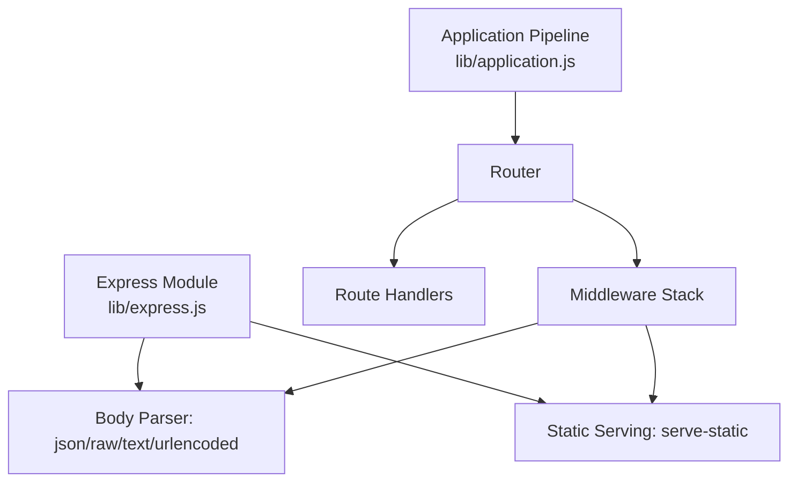
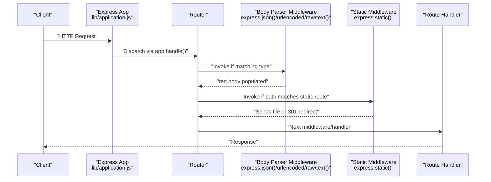
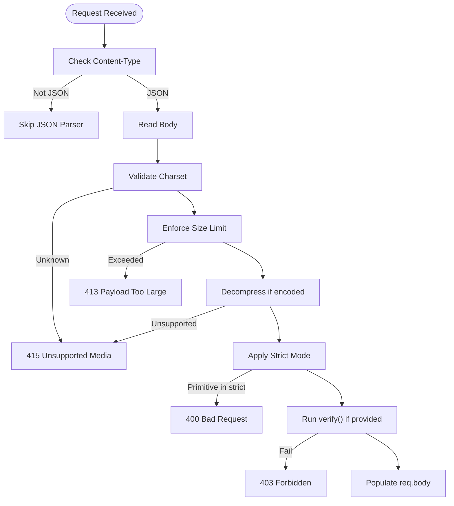
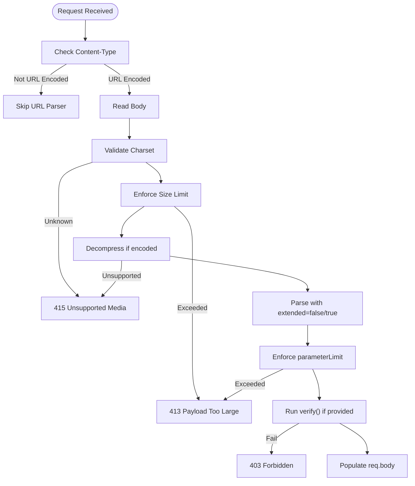
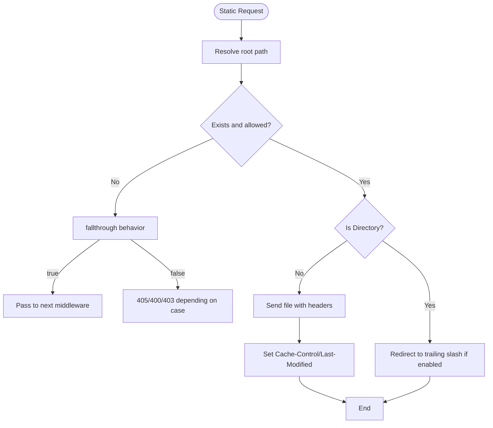
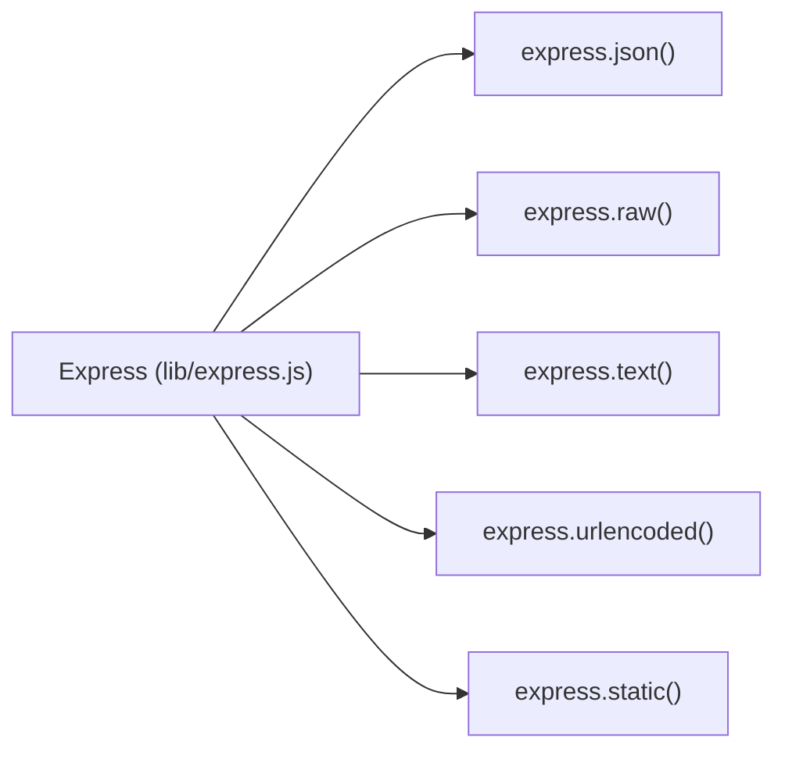

# Built-in Middleware

<cite>
**Referenced Files in This Document**
- [lib/express.js](file://lib/express.js)
- [lib/application.js](file://lib/application.js)
- [test/express.json.js](file://test/express.json.js)
- [test/express.urlencoded.js](file://test/express.urlencoded.js)
- [test/express.raw.js](file://test/express.raw.js)
- [test/express.text.js](file://test/express.text.js)
- [test/express.static.js](file://test/express.static.js)
- [examples/static-files/index.js](file://examples/static-files/index.js)
</cite>

## Table of Contents
1. [Introduction](#introduction)
2. [Project Structure](#project-structure)
3. [Core Components](#core-components)
4. [Architecture Overview](#architecture-overview)
5. [Detailed Component Analysis](#detailed-component-analysis)
6. [Dependency Analysis](#dependency-analysis)
7. [Performance Considerations](#performance-considerations)
8. [Troubleshooting Guide](#troubleshooting-guide)
9. [Conclusion](#conclusion)

## Introduction
This document explains Express.js built-in middleware components and their usage patterns, focusing on:
- Body parsing middleware: express.json(), express.urlencoded(), express.raw(), and express.text()
- Static file serving middleware: express.static()
- Additional topics: content negotiation, compression, and CORS handling
It also provides configuration options, security considerations, performance tips, and practical integration patterns derived from the repository’s tests and examples.

## Project Structure
Express exposes built-in middleware via its main module export. The middleware are thin wrappers around widely used libraries:
- Body parsers: json, raw, text, urlencoded
- Static file serving: serve-static

These are exposed on the Express application object for convenient use.

**Diagram sources**
- [lib/express.js:77-82](file://lib/express.js#L77-L82)
- [lib/application.js:152-178](file://lib/application.js#L152-L178)

**Section sources**
- [lib/express.js:77-82](file://lib/express.js#L77-L82)
- [lib/application.js:152-178](file://lib/application.js#L152-L178)

## Core Components
This section summarizes the built-in middleware and how they are exposed by Express.

- express.json(options)
  - Parses incoming requests with JSON payloads.
  - Options include: limit, inflate, strict, type, verify, defaultCharset (not applicable), and charset handling.
  - Security: strict mode rejects primitive bodies; limit prevents oversized payloads; verify allows custom checks; charset handling supports UTF-8/UTF-16 and errors on unknown charset.
- express.urlencoded(options)
  - Parses form-encoded payloads.
  - Options include: extended (boolean), inflate, limit, parameterLimit, type, verify, charset handling.
  - Security: parameterLimit caps number of parameters; verify allows custom checks; charset handling supports UTF-8 and errors on unknown charset.
- express.raw(options)
  - Parses raw binary buffers.
  - Options include: limit, inflate, type, verify, charset ignored.
  - Security: limit prevents oversized payloads; verify allows custom checks; encoding handled (gzip/deflate/identity).
- express.text(options)
  - Parses text/plain bodies.
  - Options include: defaultCharset, limit, inflate, type, verify, charset handling.
  - Security: limit prevents oversized payloads; verify allows custom checks; charset handling supports UTF-8 and codepages; errors on unknown charset.
- express.static(root, options)
  - Serves static files from a root directory.
  - Options include: acceptRanges, cacheControl, dotfiles, extensions, fallthrough, immutable, index, lastModified, maxAge, redirect, setHeaders.
  - Security: fallthrough controls error behavior; redirect avoids path traversal; hidden files controlled by dotfiles; setHeaders allows adding security headers.

Practical usage patterns are demonstrated in the examples and tests.

**Section sources**
- [lib/express.js:77-82](file://lib/express.js#L77-L82)
- [test/express.json.js:10-720](file://test/express.json.js#L10-L720)
- [test/express.urlencoded.js:10-786](file://test/express.urlencoded.js#L10-L786)
- [test/express.raw.js:10-490](file://test/express.raw.js#L10-L490)
- [test/express.text.js:9-546](file://test/express.text.js#L9-L546)
- [test/express.static.js:16-800](file://test/express.static.js#L16-L800)
- [examples/static-files/index.js:22-36](file://examples/static-files/index.js#L22-L36)

## Architecture Overview
Express routes requests through a middleware stack managed by a router. Each middleware can:
- Parse the request body
- Serve static assets
- Modify response headers
- Short-circuit the pipeline (e.g., redirects)
- Pass control to the next middleware

**Diagram sources**
- [lib/application.js:152-178](file://lib/application.js#L152-L178)
- [lib/express.js:77-82](file://lib/express.js#L77-L82)
- [test/express.static.js:16-800](file://test/express.static.js#L16-L800)

## Detailed Component Analysis

### Body Parsing: express.json()
- Purpose: Parse application/json payloads.
- Key options and behaviors:
  - limit: Enforces maximum payload size; responds with 413 when exceeded.
  - inflate: Controls gzip/deflate decoding; 415 if unsupported encoding.
  - strict: When true, rejects primitives; when false, allows primitives.
  - type: Selects content types to parse; function-based acceptor supported.
  - verify: Custom verification hook; can throw to produce 403.
  - charset: Supports UTF-8/UTF-16; 415 on unknown charset.
- Error handling:
  - Invalid content-length: 400.
  - Malformed JSON: 400 with structured error type.
  - Unknown encoding/charset: 415.
- Security considerations:
  - Use strict: true for APIs expecting objects.
  - Set a conservative limit.
  - Use verify to enforce additional constraints.
- Performance:
  - Keep limit aligned with API needs.
  - Avoid inflate overhead if not needed.

**Diagram sources**
- [test/express.json.js:10-720](file://test/express.json.js#L10-L720)

**Section sources**
- [test/express.json.js:10-720](file://test/express.json.js#L10-L720)

### Body Parsing: express.urlencoded()
- Purpose: Parse application/x-www-form-urlencoded payloads.
- Key options and behaviors:
  - extended: true enables nested object/array parsing; false parses flat keys.
  - parameterLimit: Caps number of parameters; 413 if exceeded.
  - limit/inflate/type/verify/charset: Similar to JSON.
- Security considerations:
  - Use parameterLimit to mitigate parameter explosion attacks.
  - Use verify to sanitize inputs.
- Performance:
  - extended: true increases CPU cost; keep false for simple forms.

**Diagram sources**
- [test/express.urlencoded.js:10-786](file://test/express.urlencoded.js#L10-L786)

**Section sources**
- [test/express.urlencoded.js:10-786](file://test/express.urlencoded.js#L10-L786)

### Body Parsing: express.raw()
- Purpose: Parse raw binary payloads into Buffer.
- Key options and behaviors:
  - limit/inflate/type/verify: Similar to other parsers.
  - charset: Ignored for binary.
- Security considerations:
  - Always set a strict limit.
  - Use verify to validate magic bytes or signatures.

**Section sources**
- [test/express.raw.js:10-490](file://test/express.raw.js#L10-L490)

### Body Parsing: express.text()
- Purpose: Parse text/plain payloads.
- Key options and behaviors:
  - defaultCharset: Sets default decoding if none provided.
  - limit/inflate/type/verify/charset: Similar to other parsers.
- Security considerations:
  - Use verify to enforce allowed prefixes/suffixes.
  - Set a strict limit.

**Section sources**
- [test/express.text.js:9-546](file://test/express.text.js#L9-L546)

### Static File Serving: express.static(root, options)
- Purpose: Serve static assets from a root directory.
- Key options and behaviors:
  - acceptRanges: Enable Range requests; otherwise ignore Range.
  - cacheControl/maxAge/immutable: Configure caching directives.
  - dotfiles: Control visibility of hidden files.
  - extensions: Allow extensionless routes with fallbacks.
  - fallthrough: Behavior on missing files (true: continue; false: 405/400/403).
  - index: Toggle directory index serving.
  - lastModified: Toggle Last-Modified header.
  - redirect: Redirect directory accesses to trailing slash.
  - setHeaders: Function to attach custom headers per response.
- Security considerations:
  - Use fallthrough: false to avoid leaking internal filesystem paths.
  - Use redirect: true to normalize URLs and avoid ambiguity.
  - Use setHeaders to add security headers (e.g., Content-Security-Policy).
- Performance:
  - Enable immutable for long-lived assets.
  - Tune maxAge for CDN-friendly caching.
  - Use acceptRanges for large files to support resumable downloads.

**Diagram sources**
- [test/express.static.js:16-800](file://test/express.static.js#L16-L800)

**Section sources**
- [test/express.static.js:16-800](file://test/express.static.js#L16-L800)
- [examples/static-files/index.js:22-36](file://examples/static-files/index.js#L22-L36)

### Content Negotiation, Compression, and CORS
- Content negotiation: Handled by response methods like res.format() and res.vary(). While not a dedicated middleware, it integrates with the middleware pipeline to select appropriate responses based on Accept headers.
- Compression: Not included in the built-in middleware set in this repository snapshot. Typically provided by external middleware such as compression. When used, place it early in the middleware stack after body parsers but before route handlers.
- CORS: Not included in the built-in middleware set in this repository snapshot. Typically provided by external middleware such as cors. Configure origin/methods/allowedHeaders appropriately and place it before route handlers.

[No sources needed since this section provides general guidance]

## Dependency Analysis
Express middleware are thin wrappers around external libraries:
- Body parsers: json/raw/text/urlencoded
- Static serving: serve-static

They are attached to the Express application object for convenience.

**Diagram sources**
- [lib/express.js:77-82](file://lib/express.js#L77-L82)

**Section sources**
- [lib/express.js:77-82](file://lib/express.js#L77-L82)

## Performance Considerations
- Body parsing
  - Set realistic limits to prevent memory exhaustion.
  - Disable inflate if not needed to reduce CPU overhead.
  - Prefer express.urlencoded({ extended: false }) for simple forms.
- Static serving
  - Use immutable for long-lived assets.
  - Tune maxAge for optimal CDN caching.
  - Enable acceptRanges for large files to support partial transfers.
  - Use redirect: true to avoid ambiguous URLs.
- General
  - Place middleware in order: body parsers → static → routes.
  - Minimize middleware depth for hot paths.

[No sources needed since this section provides general guidance]

## Troubleshooting Guide
Common issues and resolutions:
- 413 Payload Too Large
  - Cause: Request exceeds configured limit.
  - Resolution: Increase limit or reject oversized uploads.
- 400 Bad Request
  - Cause: Invalid content-length or malformed body.
  - Resolution: Validate clients; ensure proper framing.
- 415 Unsupported Media
  - Cause: Unknown charset or unsupported content-encoding.
  - Resolution: Align client headers with server expectations.
- 403 Forbidden
  - Cause: Path traversal attempts or restricted access.
  - Resolution: Use fallthrough: false and secure root paths.
- 404 Not Found
  - Cause: Missing file or incorrect route.
  - Resolution: Verify static root and route precedence.

**Section sources**
- [test/express.json.js:10-720](file://test/express.json.js#L10-L720)
- [test/express.urlencoded.js:10-786](file://test/express.urlencoded.js#L10-L786)
- [test/express.raw.js:10-490](file://test/express.raw.js#L10-L490)
- [test/express.text.js:9-546](file://test/express.text.js#L9-L546)
- [test/express.static.js:16-800](file://test/express.static.js#L16-L800)

## Conclusion
Express’s built-in middleware provides robust, secure, and configurable primitives for parsing request bodies and serving static assets. By carefully selecting options—limits, encodings, charset handling, and security flags—you can tailor performance and safety to your deployment needs. For advanced features like compression and CORS, integrate complementary middleware packages and apply them thoughtfully in the middleware stack.