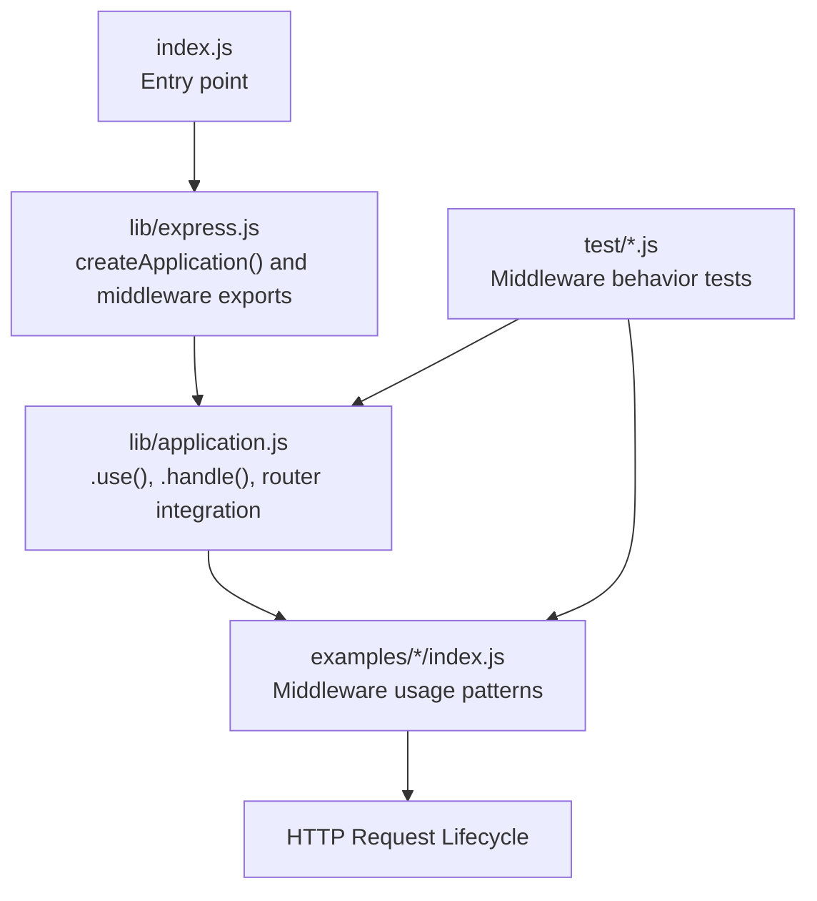
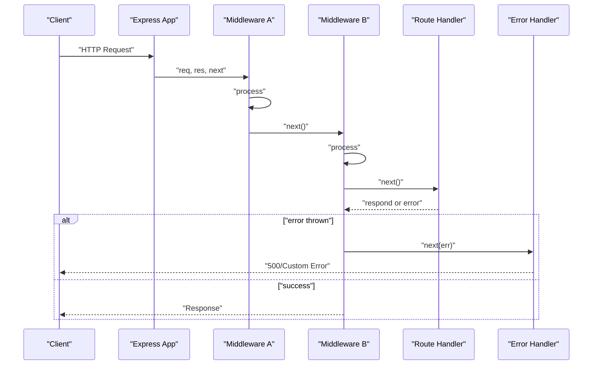
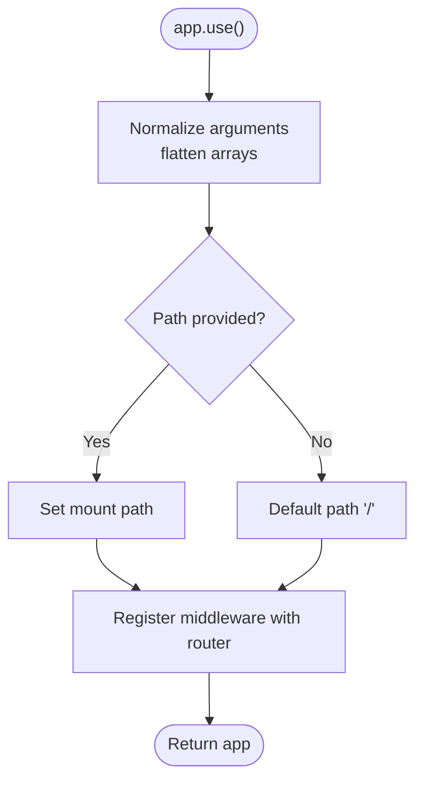
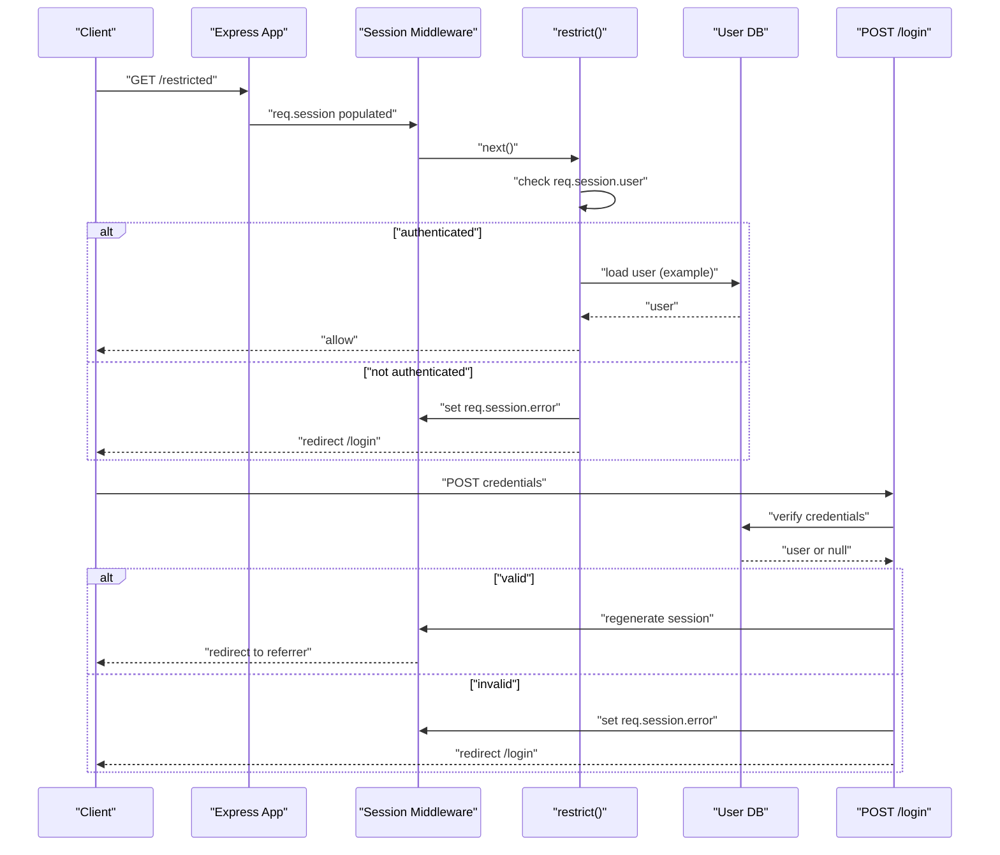
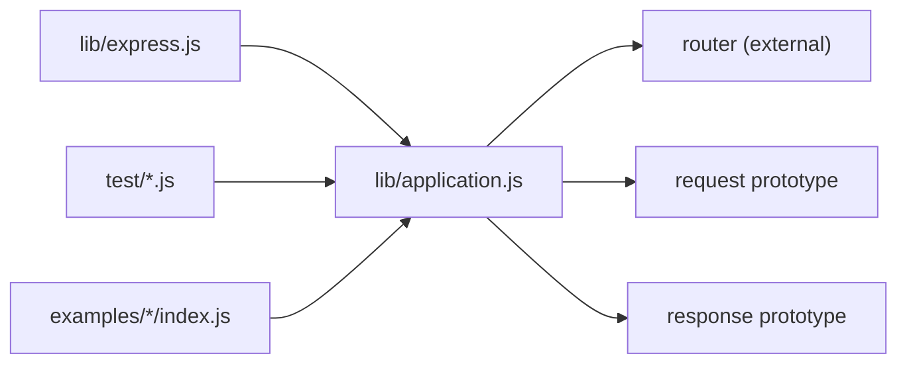

# Custom Middleware Development

<cite>
**Referenced Files in This Document**
- [index.js](file://index.js)
- [lib/express.js](file://lib/express.js)
- [lib/application.js](file://lib/application.js)
- [examples/route-middleware/index.js](file://examples/route-middleware/index.js)
- [examples/session/index.js](file://examples/session/index.js)
- [examples/auth/index.js](file://examples/auth/index.js)
- [examples/cookies/index.js](file://examples/cookies/index.js)
- [examples/content-negotiation/index.js](file://examples/content-negotiation/index.js)
- [examples/error/index.js](file://examples/error/index.js)
- [examples/web-service/index.js](file://examples/web-service/index.js)
- [examples/multi-router/controllers/api_v1.js](file://examples/multi-router/controllers/api_v1.js)
- [examples/route-separation/index.js](file://examples/route-separation/index.js)
- [test/app.use.js](file://test/app.use.js)
- [test/middleware.basic.js](file://test/middleware.basic.js)
- [test/app.route.js](file://test/app.route.js)
- [test/Route.js](file://test/Route.js)
</cite>

## Table of Contents
1. [Introduction](#introduction)
2. [Project Structure](#project-structure)
3. [Core Components](#core-components)
4. [Architecture Overview](#architecture-overview)
5. [Detailed Component Analysis](#detailed-component-analysis)
6. [Dependency Analysis](#dependency-analysis)
7. [Performance Considerations](#performance-considerations)
8. [Troubleshooting Guide](#troubleshooting-guide)
9. [Conclusion](#conclusion)
10. [Appendices](#appendices)

## Introduction
This document explains how to build custom middleware in Express.js using practical patterns from the repository. It covers middleware function structure, parameter handling, and the next() callback lifecycle. You will learn composition techniques, conditional application, error handling, authentication with sessions, logging, validation, and response enhancement. The guide also includes testing strategies, debugging techniques, performance optimization, reusability patterns, configuration options, and integration with external systems.

## Project Structure
The repository provides:
- Core Express runtime and middleware exposure
- Example applications demonstrating middleware usage patterns
- Comprehensive tests validating middleware invocation, mounting, and error handling

**Diagram sources**
- [index.js:1-12](file://index.js#L1-L12)
- [lib/express.js:36-56](file://lib/express.js#L36-L56)
- [lib/application.js:190-244](file://lib/application.js#L190-L244)

**Section sources**
- [index.js:1-12](file://index.js#L1-L12)
- [lib/express.js:74-82](file://lib/express.js#L74-L82)
- [lib/application.js:190-244](file://lib/application.js#L190-L244)

## Core Components
- Express application creation and middleware exposure
- Application-level middleware registration via .use()
- Request/response prototype augmentation
- Router integration and dispatch pipeline
- Built-in middleware exports (JSON, raw, text, urlencoded, static)

Key implementation references:
- Application factory and prototype wiring
- Middleware registration and flattening of arrays
- Router delegation and error handling fallback

**Section sources**
- [lib/express.js:36-56](file://lib/express.js#L36-L56)
- [lib/express.js:74-82](file://lib/express.js#L74-L82)
- [lib/application.js:59-178](file://lib/application.js#L59-L178)
- [lib/application.js:190-244](file://lib/application.js#L190-L244)

## Architecture Overview
Express middleware forms a pipeline:
- app.use() registers middleware globally or under a path
- Requests traverse middleware in the order registered
- next() advances the pipeline; errors short-circuit to error-handlers
- Final handlers respond or delegate to default error handlers

**Diagram sources**
- [lib/application.js:152-178](file://lib/application.js#L152-L178)
- [examples/error/index.js:20-47](file://examples/error/index.js#L20-L47)

## Detailed Component Analysis

### Middleware Function Structure and next() Patterns
- Standard middleware signature: (req, res, next)
- next() advances to the next middleware
- next(err) triggers error-handlers
- Promise-returning middleware integrates with the pipeline

Practical references:
- Basic next() invocation and ordering
- Promise rejection propagation to error handlers

**Section sources**
- [test/middleware.basic.js:8-42](file://test/middleware.basic.js#L8-L42)
- [test/app.route.js:65-197](file://test/app.route.js#L65-L197)

### Middleware Composition and Conditional Application
- app.use() supports multiple middleware, arrays, and nested arrays
- Path-based mounting with strings, arrays, regexps, and empty string
- Mounting nested apps and preserving prototypes during traversal

**Diagram sources**
- [lib/application.js:190-244](file://lib/application.js#L190-L244)
- [test/app.use.js:125-543](file://test/app.use.js#L125-L543)

**Section sources**
- [lib/application.js:190-244](file://lib/application.js#L190-L244)
- [test/app.use.js:125-543](file://test/app.use.js#L125-L543)

### Authentication Middleware with Sessions and Access Control
Patterns demonstrated:
- Session population and message propagation via middleware
- Access control using role-based middleware factories
- Redirect-based denial and regeneration of sessions on login

**Diagram sources**
- [examples/auth/index.js:75-128](file://examples/auth/index.js#L75-L128)
- [examples/session/index.js:15-31](file://examples/session/index.js#L15-L31)

**Section sources**
- [examples/auth/index.js:20-128](file://examples/auth/index.js#L20-L128)
- [examples/session/index.js:15-31](file://examples/session/index.js#L15-L31)

### Logging Middleware
- Morgan-based logging middleware
- Conditional enabling based on environment
- Cookie parsing and message propagation

**Section sources**
- [examples/cookies/index.js:12-19](file://examples/cookies/index.js#L12-L19)

### Validation Middleware
- Body parsers for JSON, raw, text, urlencoded
- Verify hooks for custom validation and controlled error codes

**Section sources**
- [lib/express.js:77-81](file://lib/express.js#L77-L81)
- [test/express.json.js:277-319](file://test/express.json.js#L277-L319)
- [test/express.text.js:286-334](file://test/express.text.js#L286-L334)
- [test/express.urlencoded.js:518-563](file://test/express.urlencoded.js#L518-L563)

### Response Enhancement Middleware
- Content negotiation via res.format()
- Declarative formatter middleware returning res.format handlers

**Section sources**
- [examples/content-negotiation/index.js:9-41](file://examples/content-negotiation/index.js#L9-L41)

### Error Handling Middleware
- Error middleware signature: (err, req, res, next)
- Placement after routes; receives thrown errors and next(err)
- Web service-style JSON 404 and generic error responders

**Section sources**
- [examples/error/index.js:14-47](file://examples/error/index.js#L14-L47)
- [examples/web-service/index.js:98-111](file://examples/web-service/index.js#L98-L111)
- [test/Route.js:252-274](file://test/Route.js#L252-L274)

### Router-Level Middleware and Separation of Concerns
- Route-specific middleware stacks via app.route()
- Multi-router and route separation patterns
- Dynamic mount paths and middleware ordering

**Section sources**
- [examples/multi-router/controllers/api_v1.js:5-16](file://examples/multi-router/controllers/api_v1.js#L5-L16)
- [examples/route-separation/index.js:34-56](file://examples/route-separation/index.js#L34-L56)
- [test/app.use.js:86-123](file://test/app.use.js#L86-L123)

## Dependency Analysis
Express middleware registration delegates to a router. The application maintains a base router and augments request/response prototypes. Tests validate mounting, path handling, and error propagation.

**Diagram sources**
- [lib/express.js:18-21](file://lib/express.js#L18-L21)
- [lib/application.js:68-82](file://lib/application.js#L68-L82)

**Section sources**
- [lib/express.js:18-21](file://lib/express.js#L18-L21)
- [lib/application.js:68-82](file://lib/application.js#L68-L82)
- [test/app.use.js:1-543](file://test/app.use.js#L1-L543)

## Performance Considerations
- Minimize synchronous work in hot paths; defer heavy tasks to async operations
- Prefer early exits and guard clauses to avoid unnecessary processing
- Use path-scoped middleware to limit traversal to relevant routes
- Avoid excessive prototype mutations; rely on app.request/app.response augmentation
- Cache expensive computations and leverage built-in middleware options (e.g., query parser, trust proxy)

## Troubleshooting Guide
Common issues and remedies:
- Middleware not invoked
  - Verify registration order and path matching
  - Confirm app.use() received a function and not a string/number/null
- Error not handled
  - Ensure error middleware is registered after routes
  - Use arity-4 signature for error handlers
- Session issues
  - Confirm session middleware is registered before auth checks
  - Use regenerate() on login to prevent session fixation
- Testing strategies
  - Use supertest to assert middleware effects
  - Validate next() chaining and error propagation
  - Test promise-returning middleware and error handlers

**Section sources**
- [test/app.use.js:258-283](file://test/app.use.js#L258-L283)
- [examples/error/index.js:14-47](file://examples/error/index.js#L14-L47)
- [examples/auth/index.js:104-128](file://examples/auth/index.js#L104-L128)
- [test/middleware.basic.js:8-42](file://test/middleware.basic.js#L8-L42)

## Conclusion
Custom middleware in Express is a powerful mechanism for building composable request processing pipelines. By understanding the application factory, router integration, and the next() lifecycle, you can implement robust authentication, validation, logging, and response enhancement middleware. The repository’s examples and tests provide concrete patterns for composition, conditional application, error handling, and integration with sessions and external systems.

## Appendices

### Practical Implementation Patterns
- Authentication with session and role checks
  - [examples/auth/index.js:75-128](file://examples/auth/index.js#L75-L128)
- Role-based middleware factory
  - [examples/route-middleware/index.js:50-58](file://examples/route-middleware/index.js#L50-L58)
- Session population and message propagation
  - [examples/auth/index.js:28-39](file://examples/auth/index.js#L28-L39)
- Content negotiation and response enhancement
  - [examples/content-negotiation/index.js:29-41](file://examples/content-negotiation/index.js#L29-L41)
- Validation with verify hooks
  - [test/express.json.js:277-319](file://test/express.json.js#L277-L319)
  - [test/express.text.js:286-334](file://test/express.text.js#L286-L334)
  - [test/express.urlencoded.js:518-563](file://test/express.urlencoded.js#L518-L563)
- Error handling middleware
  - [examples/error/index.js:14-47](file://examples/error/index.js#L14-L47)
  - [examples/web-service/index.js:98-111](file://examples/web-service/index.js#L98-L111)

### Middleware Testing Checklist
- Verify middleware invocation order and side effects
  - [test/middleware.basic.js:8-42](file://test/middleware.basic.js#L8-L42)
- Assert path-based mounting and stripping
  - [test/app.use.js:284-294](file://test/app.use.js#L284-L294)
- Validate arrays and nested arrays of middleware
  - [test/app.use.js:173-255](file://test/app.use.js#L173-L255)
- Test error propagation and promise rejection
  - [test/app.route.js:65-197](file://test/app.route.js#L65-L197)
  - [test/Route.js:252-274](file://test/Route.js#L252-L274)