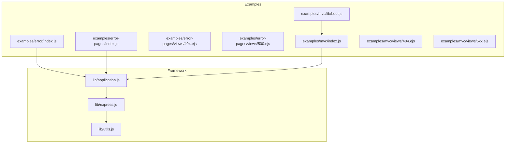
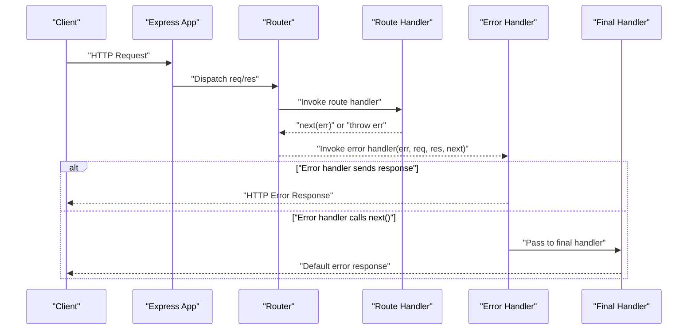
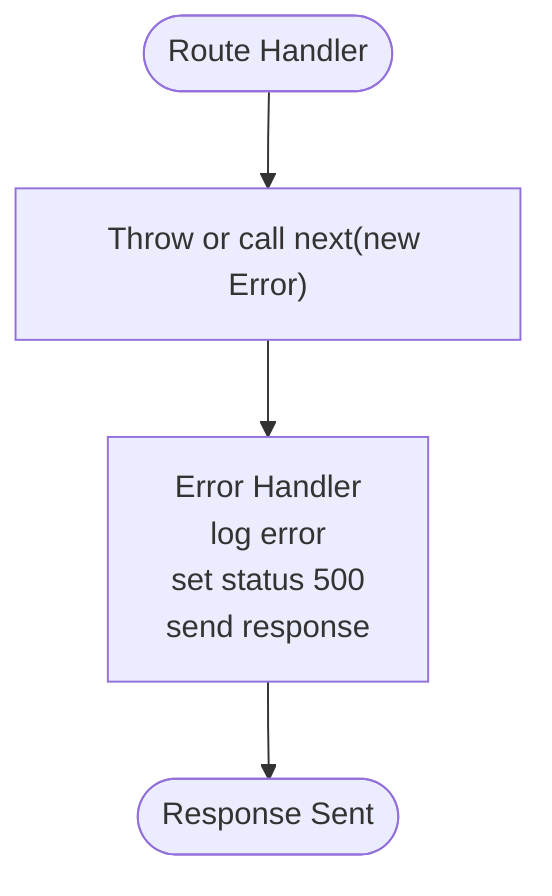
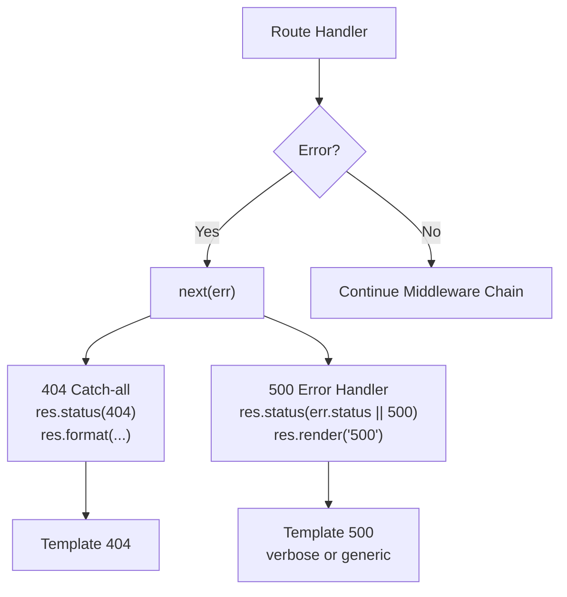
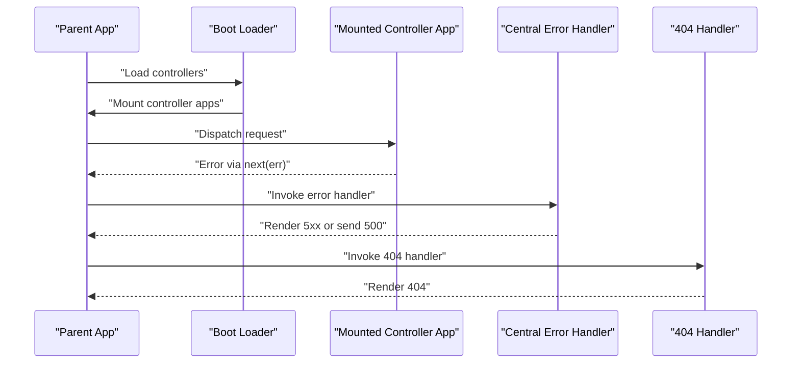
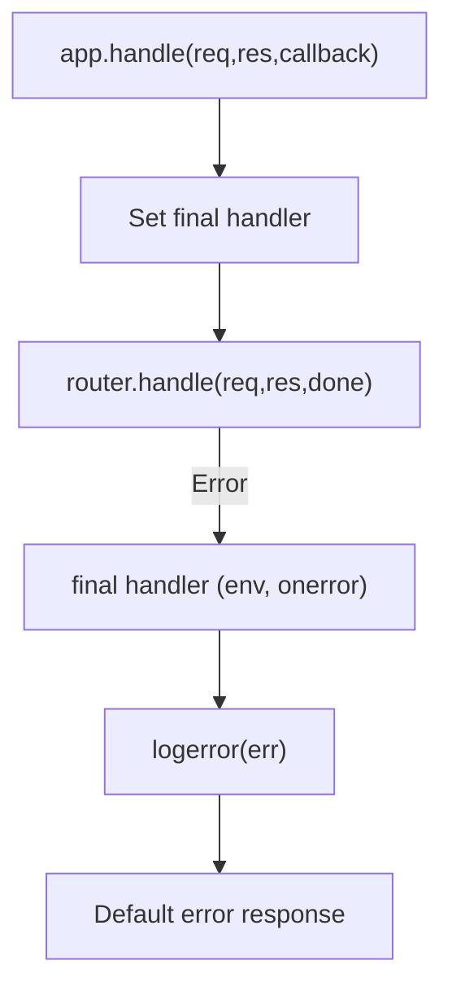
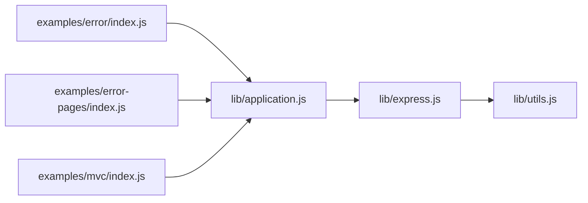

# Error Handling Middleware

<cite>
**Referenced Files in This Document**
- [examples/error/index.js](file://examples/error/index.js)
- [examples/error-pages/index.js](file://examples/error-pages/index.js)
- [examples/error-pages/views/404.ejs](file://examples/error-pages/views/404.ejs)
- [examples/error-pages/views/500.ejs](file://examples/error-pages/views/500.ejs)
- [examples/mvc/index.js](file://examples/mvc/index.js)
- [examples/mvc/views/404.ejs](file://examples/mvc/views/404.ejs)
- [examples/mvc/views/5xx.ejs](file://examples/mvc/views/5xx.ejs)
- [examples/mvc/lib/boot.js](file://examples/mvc/lib/boot.js)
- [lib/application.js](file://lib/application.js)
- [lib/express.js](file://lib/express.js)
- [lib/utils.js](file://lib/utils.js)
- [test/app.routes.error.js](file://test/app.routes.error.js)
- [test/acceptance/error.js](file://test/acceptance/error.js)
</cite>

## Table of Contents
1. [Introduction](#introduction)
2. [Project Structure](#project-structure)
3. [Core Components](#core-components)
4. [Architecture Overview](#architecture-overview)
5. [Detailed Component Analysis](#detailed-component-analysis)
6. [Dependency Analysis](#dependency-analysis)
7. [Performance Considerations](#performance-considerations)
8. [Troubleshooting Guide](#troubleshooting-guide)
9. [Conclusion](#conclusion)
10. [Appendices](#appendices)

## Introduction
This document explains Express.js error handling middleware patterns and centralized error management. It covers the four-parameter error handler signature, middleware chain propagation, error object structure and status code assignment, error page rendering, logging integration, and debugging strategies. Practical examples demonstrate custom error handlers, API error responses, and development versus production error handling. It also addresses error categorization, user-friendly messaging, security considerations for error disclosure, monitoring integration, best practices, and common anti-patterns.

## Project Structure
The repository includes multiple example applications that illustrate different error handling approaches:
- A minimal error handler example that throws synchronously and passes exceptions to the error handler via next().
- An error-pages example that demonstrates 404 and 500 handling with templated views and environment-aware verbosity.
- An MVC example that centralizes error handling and renders dedicated error pages.
- Core framework files that implement the request lifecycle, middleware dispatch, and default error logging.

**Diagram sources**
- [examples/error/index.js:1-54](file://examples/error/index.js#L1-L54)
- [examples/error-pages/index.js:1-104](file://examples/error-pages/index.js#L1-L104)
- [examples/error-pages/views/404.ejs:1-4](file://examples/error-pages/views/404.ejs#L1-L4)
- [examples/error-pages/views/500.ejs:1-9](file://examples/error-pages/views/500.ejs#L1-L9)
- [examples/mvc/index.js:1-96](file://examples/mvc/index.js#L1-L96)
- [examples/mvc/views/404.ejs:1-14](file://examples/mvc/views/404.ejs#L1-L14)
- [examples/mvc/views/5xx.ejs:1-14](file://examples/mvc/views/5xx.ejs#L1-L14)
- [examples/mvc/lib/boot.js:1-84](file://examples/mvc/lib/boot.js#L1-L84)
- [lib/application.js:1-632](file://lib/application.js#L1-L632)
- [lib/express.js:1-82](file://lib/express.js#L1-L82)
- [lib/utils.js:1-272](file://lib/utils.js#L1-L272)

**Section sources**
- [examples/error/index.js:1-54](file://examples/error/index.js#L1-L54)
- [examples/error-pages/index.js:1-104](file://examples/error-pages/index.js#L1-L104)
- [examples/mvc/index.js:1-96](file://examples/mvc/index.js#L1-L96)
- [lib/application.js:1-632](file://lib/application.js#L1-L632)
- [lib/express.js:1-82](file://lib/express.js#L1-L82)
- [lib/utils.js:1-272](file://lib/utils.js#L1-L272)

## Core Components
- Error handling middleware signature: A function with four parameters (err, req, res, next). Express invokes only error-handling middleware when an error is passed to next(err) or thrown synchronously.
- Middleware chain propagation: Errors propagate backward through the chain until an error handler responds or the default final handler handles them.
- Error object structure: Errors can carry a numeric status property (commonly 4xx/5xx). If missing, defaults are applied by handlers or the final handler.
- Status code assignment: Handlers set res.status(code) before rendering or sending a response.
- Centralized error management: Examples place a single error handler after routes to capture unhandled errors and 404 detection via a trailing middleware.

Practical example references:
- Minimal error handler: [examples/error/index.js:20-27](file://examples/error/index.js#L20-L27)
- Error-pages with 404/500 handlers: [examples/error-pages/index.js:63-97](file://examples/error-pages/index.js#L63-L97)
- MVC centralized error handling: [examples/mvc/index.js:78-89](file://examples/mvc/index.js#L78-L89)

**Section sources**
- [examples/error/index.js:14-27](file://examples/error/index.js#L14-L27)
- [examples/error-pages/index.js:55-97](file://examples/error-pages/index.js#L55-L97)
- [examples/mvc/index.js:78-89](file://examples/mvc/index.js#L78-L89)
- [lib/application.js:152-178](file://lib/application.js#L152-L178)

## Architecture Overview
Express routes and middleware are handled by an internal router. When an error occurs, Express switches from normal middleware to error-handling middleware. The default final handler logs and responds to uncaught errors. Custom error handlers can short-circuit further propagation by sending a response.

**Diagram sources**
- [lib/application.js:152-178](file://lib/application.js#L152-L178)
- [examples/error/index.js:29-47](file://examples/error/index.js#L29-L47)
- [examples/error-pages/index.js:63-97](file://examples/error-pages/index.js#L63-L97)

**Section sources**
- [lib/application.js:152-178](file://lib/application.js#L152-L178)
- [examples/error/index.js:29-47](file://examples/error/index.js#L29-L47)
- [examples/error-pages/index.js:63-97](file://examples/error-pages/index.js#L63-L97)

## Detailed Component Analysis

### Minimal Error Handler Example
This example demonstrates synchronous throwing and asynchronous passing of errors to the error handler. It logs the error stack (except in tests) and responds with a fixed 500 message.

Key behaviors:
- Four-parameter error handler signature.
- Logging via console.error in non-test environments.
- Fixed 500 status and plaintext response.

**Diagram sources**
- [examples/error/index.js:20-27](file://examples/error/index.js#L20-L27)
- [examples/error/index.js:29-47](file://examples/error/index.js#L29-L47)

**Section sources**
- [examples/error/index.js:14-27](file://examples/error/index.js#L14-L27)
- [examples/error/index.js:29-47](file://examples/error/index.js#L29-L47)

### Error Pages with Environment-Aware Verbosity
This example sets up 404 detection and 500 error handling with templated views. It toggles a setting to show verbose errors in development and suppress them in production.

Key behaviors:
- 404 detection via a trailing middleware that sets status 404 and responds based on Accept header.
- 500 error handler that uses res.render with the error object.
- Environment-based verbosity controlled via app settings.

**Diagram sources**
- [examples/error-pages/index.js:63-97](file://examples/error-pages/index.js#L63-L97)
- [examples/error-pages/views/404.ejs:1-4](file://examples/error-pages/views/404.ejs#L1-L4)
- [examples/error-pages/views/500.ejs:1-9](file://examples/error-pages/views/500.ejs#L1-L9)

**Section sources**
- [examples/error-pages/index.js:17-24](file://examples/error-pages/index.js#L17-L24)
- [examples/error-pages/index.js:63-97](file://examples/error-pages/index.js#L63-L97)
- [examples/error-pages/views/404.ejs:1-4](file://examples/error-pages/views/404.ejs#L1-L4)
- [examples/error-pages/views/500.ejs:1-9](file://examples/error-pages/views/500.ejs#L1-L9)

### MVC Centralized Error Handling
This example mounts controller apps and centralizes error handling. It logs errors and renders dedicated error pages for 404 and 500.

Key behaviors:
- Central error handler logs and renders an error page.
- A trailing 404 handler renders a dedicated 404 page.
- Controllers are generated dynamically and mounted under the parent app.

**Diagram sources**
- [examples/mvc/index.js:78-89](file://examples/mvc/index.js#L78-L89)
- [examples/mvc/index.js:86-89](file://examples/mvc/index.js#L86-L89)
- [examples/mvc/lib/boot.js:11-84](file://examples/mvc/lib/boot.js#L11-L84)

**Section sources**
- [examples/mvc/index.js:78-89](file://examples/mvc/index.js#L78-L89)
- [examples/mvc/index.js:86-89](file://examples/mvc/index.js#L86-L89)
- [examples/mvc/lib/boot.js:11-84](file://examples/mvc/lib/boot.js#L11-L84)

### Framework-Level Handling and Final Handler
Express’s application.handle delegates to a router and sets up a final handler for uncaught errors. The final handler uses the app’s environment setting and logs via a bound error logger.

Key behaviors:
- app.handle wires the request to the router and installs a final handler.
- Default error logging uses console.error with stack or toString fallback.
- Tests can silence logging by setting NODE_ENV=test.

**Diagram sources**
- [lib/application.js:152-178](file://lib/application.js#L152-L178)
- [lib/application.js:615-618](file://lib/application.js#L615-L618)

**Section sources**
- [lib/application.js:152-178](file://lib/application.js#L152-L178)
- [lib/application.js:615-618](file://lib/application.js#L615-L618)

## Dependency Analysis
- Error handling depends on the middleware system and router dispatch.
- The error handler signature is standardized by Express internals.
- Views and templating integrate with error handlers to render user-friendly pages.
- Environment settings influence verbosity and logging behavior.

**Diagram sources**
- [examples/error/index.js:1-54](file://examples/error/index.js#L1-L54)
- [examples/error-pages/index.js:1-104](file://examples/error-pages/index.js#L1-L104)
- [examples/mvc/index.js:1-96](file://examples/mvc/index.js#L1-L96)
- [lib/application.js:1-632](file://lib/application.js#L1-L632)
- [lib/express.js:1-82](file://lib/express.js#L1-L82)
- [lib/utils.js:1-272](file://lib/utils.js#L1-L272)

**Section sources**
- [examples/error/index.js:1-54](file://examples/error/index.js#L1-L54)
- [examples/error-pages/index.js:1-104](file://examples/error-pages/index.js#L1-L104)
- [examples/mvc/index.js:1-96](file://examples/mvc/index.js#L1-L96)
- [lib/application.js:1-632](file://lib/application.js#L1-L632)
- [lib/express.js:1-82](file://lib/express.js#L1-L82)
- [lib/utils.js:1-272](file://lib/utils.js#L1-L272)

## Performance Considerations
- Keep error handlers efficient: avoid heavy computations in error paths.
- Prefer early exits in error handlers to prevent unnecessary downstream processing.
- Use environment-specific verbosity to reduce payload sizes in production.
- Centralize logging and avoid redundant logging in multiple handlers.

## Troubleshooting Guide
Common issues and strategies:
- Uncaught errors: Ensure an error handler is registered after all routes and middleware.
- Incorrect status codes: Verify that handlers set res.status before responding.
- Verbose error exposure: In production, disable verbose error details to avoid leaking stack traces.
- 404 detection: Place a 404 handler after all routes; otherwise, unmatched paths may not render a proper 404.
- Logging: Confirm that logging is enabled except in tests; check environment settings.

Validation references:
- Behavior of error propagation and error handlers: [test/app.routes.error.js:9-23](file://test/app.routes.error.js#L9-L23)
- Acceptance tests for error and 404 responses: [test/acceptance/error.js:1-30](file://test/acceptance/error.js#L1-L30)

**Section sources**
- [test/app.routes.error.js:9-23](file://test/app.routes.error.js#L9-L23)
- [test/acceptance/error.js:1-30](file://test/acceptance/error.js#L1-L30)

## Conclusion
Express error handling centers on a consistent four-parameter error handler signature and a predictable propagation model. Centralized handlers, environment-aware verbosity, and templated error pages provide a robust foundation for both development and production. Following best practices ensures secure, maintainable, and observable error management.

## Appendices

### Best Practices
- Always register error handlers after routes and middleware.
- Assign appropriate status codes; default to 500 for unhandled errors.
- Use environment settings to control error verbosity.
- Log errors centrally but avoid exposing sensitive details in production.
- Provide user-friendly messages while preserving actionable logs.

### Anti-Patterns to Avoid
- Throwing or calling next() inside synchronous route handlers without an error handler.
- Sending partial responses before setting status codes.
- Exposing raw stack traces in production.
- Overusing verbose logging in production environments.