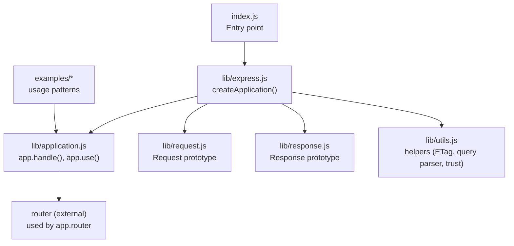
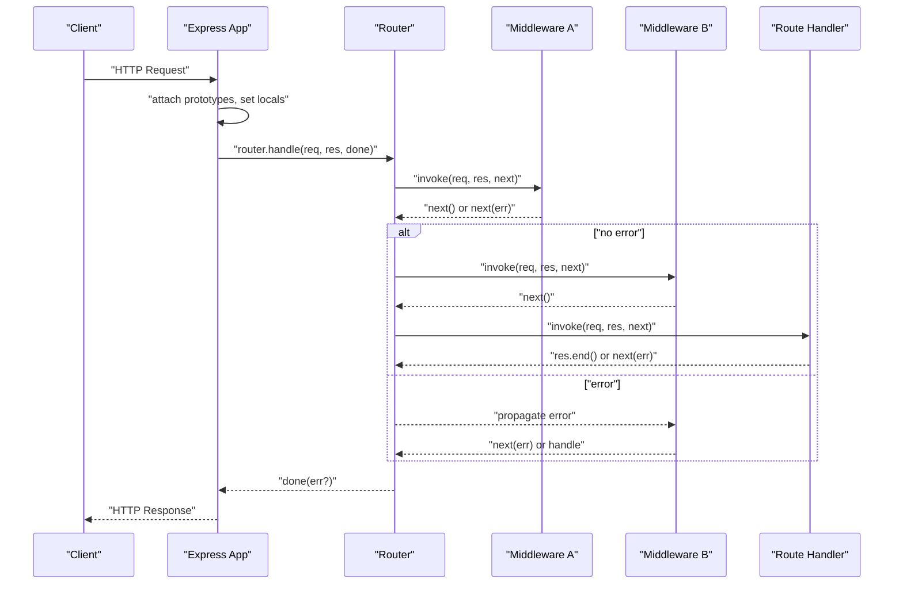
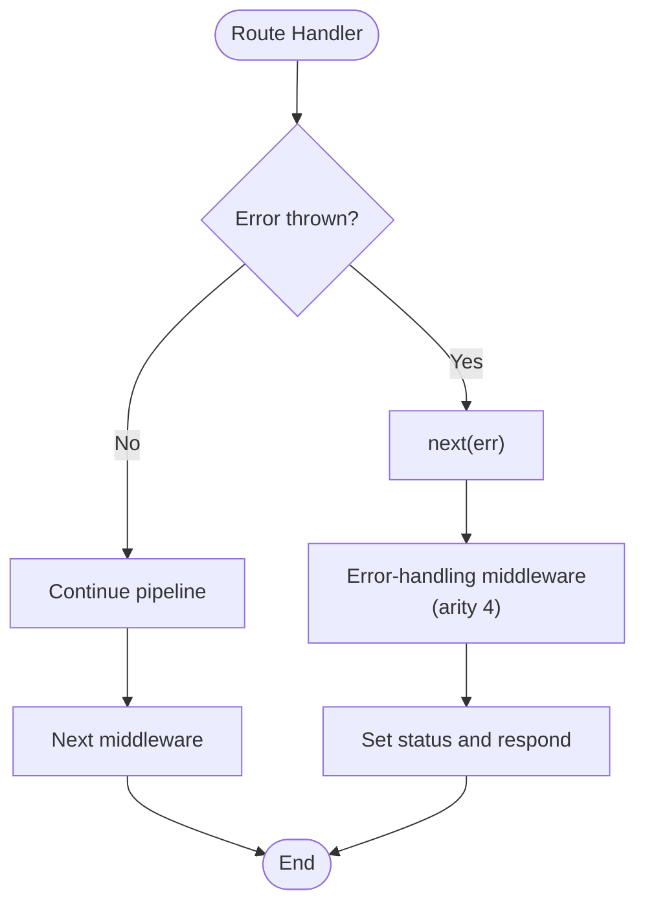
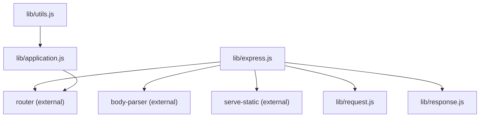

# Middleware Architecture

<cite>
**Referenced Files in This Document**
- [index.js](file://index.js)
- [lib/express.js](file://lib/express.js)
- [lib/application.js](file://lib/application.js)
- [lib/request.js](file://lib/request.js)
- [lib/response.js](file://lib/response.js)
- [lib/utils.js](file://lib/utils.js)
- [examples/route-middleware/index.js](file://examples/route-middleware/index.js)
- [examples/auth/index.js](file://examples/auth/index.js)
- [examples/error/index.js](file://examples/error/index.js)
- [examples/error-pages/index.js](file://examples/error-pages/index.js)
- [examples/static-files/index.js](file://examples/static-files/index.js)
- [examples/cookies/index.js](file://examples/cookies/index.js)
- [examples/session/index.js](file://examples/session/index.js)
- [examples/multi-router/controllers/api_v1.js](file://examples/multi-router/controllers/api_v1.js)
- [examples/multi-router/controllers/api_v2.js](file://examples/multi-router/controllers/api_v2.js)
</cite>

## Table of Contents
1. [Introduction](#introduction)
2. [Project Structure](#project-structure)
3. [Core Components](#core-components)
4. [Architecture Overview](#architecture-overview)
5. [Detailed Component Analysis](#detailed-component-analysis)
6. [Dependency Analysis](#dependency-analysis)
7. [Performance Considerations](#performance-considerations)
8. [Troubleshooting Guide](#troubleshooting-guide)
9. [Conclusion](#conclusion)
10. [Appendices](#appendices)

## Introduction
This document explains the Express.js middleware architecture with a focus on layered request/response processing and extensibility. It covers the four-parameter middleware signature, execution order, error propagation, built-in middleware categories, and practical patterns for building custom middleware. It also documents error-handling middleware, composition techniques, conditional application, performance optimization, debugging, testing strategies, and reuse patterns, with concrete references to the codebase.

## Project Structure
Express exposes a factory that creates an application function and mixes in request/response prototypes and core behavior. Middleware registration delegates to an internal router, and built-in middleware is exposed via the main module.

**Diagram sources**
- [index.js:1-12](file://index.js#L1-L12)
- [lib/express.js:36-56](file://lib/express.js#L36-L56)
- [lib/application.js:59-178](file://lib/application.js#L59-L178)
- [lib/request.js:30-37](file://lib/request.js#L30-L37)
- [lib/response.js:42-49](file://lib/response.js#L42-L49)
- [lib/utils.js:29-214](file://lib/utils.js#L29-L214)

**Section sources**
- [index.js:1-12](file://index.js#L1-L12)
- [lib/express.js:36-56](file://lib/express.js#L36-L56)
- [lib/application.js:59-178](file://lib/application.js#L59-L178)

## Core Components
- Application bootstrap and middleware registry:
  - The application is initialized and configured with default settings and middleware.
  - The handle method sets up request/response prototypes and delegates to the router.
  - The use method registers middleware globally or under a path, supporting nested apps.
- Request and Response prototypes:
  - Request extends the underlying HTTP message with helpers (headers, protocol, IP, accept negotiation, freshness).
  - Response extends the underlying HTTP server response with convenience methods (status, send, json, jsonp, format, download, cookie, redirect).
- Built-in middleware exposure:
  - JSON, raw, text, urlencoded, and static are exported from the main module.

Key implementation references:
- Application initialization and default configuration: [lib/application.js:90-141](file://lib/application.js#L90-L141)
- Request prototype getters and helpers: [lib/request.js:63-394](file://lib/request.js#L63-L394)
- Response prototype helpers and status handling: [lib/response.js:64-218](file://lib/response.js#L64-L218)
- Built-in middleware exports: [lib/express.js:77-82](file://lib/express.js#L77-L82)

**Section sources**
- [lib/application.js:90-141](file://lib/application.js#L90-L141)
- [lib/request.js:63-394](file://lib/request.js#L63-L394)
- [lib/response.js:64-218](file://lib/response.js#L64-L218)
- [lib/express.js:77-82](file://lib/express.js#L77-L82)

## Architecture Overview
Express middleware forms a layered pipeline:
- Incoming HTTP requests are handled by the application’s handle method.
- Prototypes are attached to req/res, locals are set, and the request is routed.
- Middleware registered via app.use executes in the order registered.
- Route-specific middleware runs before route handlers.
- Error-handling middleware (arity 4) intercepts errors thrown or passed via next(err).

**Diagram sources**
- [lib/application.js:152-178](file://lib/application.js#L152-L178)
- [lib/application.js:190-244](file://lib/application.js#L190-L244)

**Section sources**
- [lib/application.js:152-178](file://lib/application.js#L152-L178)
- [lib/application.js:190-244](file://lib/application.js#L190-L244)

## Detailed Component Analysis

### Middleware Fundamentals and Execution Order
- Four-parameter signature:
  - Regular middleware: (req, res, next)
  - Error-handling middleware: (err, req, res, next)
- Execution order:
  - app.use registrations are executed in insertion order.
  - Route-level middleware runs before the route handler.
  - Error-handling middleware runs after all previous middleware when an error is thrown or passed to next(err).
- Error propagation:
  - next() continues the pipeline.
  - next(err) switches to error-handling middleware.

References:
- Middleware registration and ordering: [lib/application.js:190-244](file://lib/application.js#L190-L244)
- Error-handling middleware signature and placement: [examples/error/index.js:14-27](file://examples/error/index.js#L14-L27), [examples/error-pages/index.js:79-97](file://examples/error-pages/index.js#L79-L97)

**Section sources**
- [lib/application.js:190-244](file://lib/application.js#L190-L244)
- [examples/error/index.js:14-27](file://examples/error/index.js#L14-L27)
- [examples/error-pages/index.js:79-97](file://examples/error-pages/index.js#L79-L97)

### Built-in Middleware Categories
- Body parsing:
  - JSON, raw, text, urlencoded are exposed by the main module and used in examples.
  - References: [lib/express.js:77-82](file://lib/express.js#L77-L82), [examples/cookies/index.js:22](file://examples/cookies/index.js#L22)
- Static file serving:
  - serve-static is exposed and used to serve files from directories.
  - References: [lib/express.js:79](file://lib/express.js#L79), [examples/static-files/index.js:22](file://examples/static-files/index.js#L22)
- Compression and related helpers:
  - While compression is not directly exposed in the main module, response helpers (ETag generation, content negotiation) integrate with caching and freshness logic.
  - References: [lib/utils.js:130-152](file://lib/utils.js#L130-L152), [lib/response.js:160-192](file://lib/response.js#L160-L192)

**Section sources**
- [lib/express.js:77-82](file://lib/express.js#L77-L82)
- [examples/cookies/index.js:22](file://examples/cookies/index.js#L22)
- [examples/static-files/index.js:22](file://examples/static-files/index.js#L22)
- [lib/utils.js:130-152](file://lib/utils.js#L130-L152)
- [lib/response.js:160-192](file://lib/response.js#L160-L192)

### Custom Middleware Development Patterns
- Request modification:
  - Populate req properties (e.g., authentication user) and call next().
  - Reference: [examples/route-middleware/index.js:65-68](file://examples/route-middleware/index.js#L65-L68)
- Response enhancement:
  - Modify res.locals or set headers; call next() to continue.
  - Reference: [examples/auth/index.js:30-39](file://examples/auth/index.js#L30-L39)
- Conditional execution:
  - Guarded middleware checks roles or permissions and either calls next() or responds.
  - References: [examples/route-middleware/index.js:36-48](file://examples/route-middleware/index.js#L36-L48), [examples/route-middleware/index.js:50-58](file://examples/route-middleware/index.js#L50-L58)

**Section sources**
- [examples/route-middleware/index.js:65-68](file://examples/route-middleware/index.js#L65-L68)
- [examples/auth/index.js:30-39](file://examples/auth/index.js#L30-L39)
- [examples/route-middleware/index.js:36-48](file://examples/route-middleware/index.js#L36-L48)
- [examples/route-middleware/index.js:50-58](file://examples/route-middleware/index.js#L50-L58)

### Error Handling Middleware Patterns
- Centralized error management:
  - Error middleware is placed after routes and handles thrown errors or errors passed via next(err).
  - Reference: [examples/error/index.js:47](file://examples/error/index.js#L47)
- Graceful 404/403 handling:
  - A 404 responder middleware is placed last; error middleware adjusts status and renders templates.
  - References: [examples/error-pages/index.js:63-77](file://examples/error-pages/index.js#L63-L77), [examples/error-pages/index.js:91-97](file://examples/error-pages/index.js#L91-L97)

**Diagram sources**
- [examples/error/index.js:29-42](file://examples/error/index.js#L29-L42)
- [examples/error-pages/index.js:63-77](file://examples/error-pages/index.js#L63-L77)
- [examples/error-pages/index.js:91-97](file://examples/error-pages/index.js#L91-L97)

**Section sources**
- [examples/error/index.js:29-42](file://examples/error/index.js#L29-L42)
- [examples/error-pages/index.js:63-77](file://examples/error-pages/index.js#L63-L77)
- [examples/error-pages/index.js:91-97](file://examples/error-pages/index.js#L91-L97)

### Middleware Composition and Conditional Application
- Composition:
  - Multiple middleware can be chained; each can modify req/res and call next().
  - Reference: [examples/route-middleware/index.js:74-84](file://examples/route-middleware/index.js#L74-L84)
- Conditional application:
  - Role-based guards and self-restriction guards demonstrate conditional logic before proceeding.
  - References: [examples/route-middleware/index.js:36-48](file://examples/route-middleware/index.js#L36-L48), [examples/route-middleware/index.js:50-58](file://examples/route-middleware/index.js#L50-L58)
- Nested routers:
  - Separate routers for API versions illustrate modular middleware composition.
  - References: [examples/multi-router/controllers/api_v1.js:5-15](file://examples/multi-router/controllers/api_v1.js#L5-L15), [examples/multi-router/controllers/api_v2.js:5-15](file://examples/multi-router/controllers/api_v2.js#L5-L15)

**Section sources**
- [examples/route-middleware/index.js:74-84](file://examples/route-middleware/index.js#L74-L84)
- [examples/route-middleware/index.js:36-48](file://examples/route-middleware/index.js#L36-L48)
- [examples/route-middleware/index.js:50-58](file://examples/route-middleware/index.js#L50-L58)
- [examples/multi-router/controllers/api_v1.js:5-15](file://examples/multi-router/controllers/api_v1.js#L5-L15)
- [examples/multi-router/controllers/api_v2.js:5-15](file://examples/multi-router/controllers/api_v2.js#L5-L15)

### Practical Middleware Examples from the Codebase
- Authentication middleware:
  - Session-based restriction and message propagation middleware.
  - References: [examples/auth/index.js:75-82](file://examples/auth/index.js#L75-L82), [examples/auth/index.js:30-39](file://examples/auth/index.js#L30-L39)
- Logging middleware:
  - Morgan-based request logging in examples.
  - References: [examples/error/index.js:12](file://examples/error/index.js#L12), [examples/error-pages/index.js:26](file://examples/error-pages/index.js#L26)
- Validation middleware:
  - Body parsing middleware validates presence of request bodies and delegates to next(err) on failure.
  - Reference: [examples/auth/index.js:104-106](file://examples/auth/index.js#L104-L106)

**Section sources**
- [examples/auth/index.js:75-82](file://examples/auth/index.js#L75-L82)
- [examples/auth/index.js:30-39](file://examples/auth/index.js#L30-L39)
- [examples/error/index.js:12](file://examples/error/index.js#L12)
- [examples/error-pages/index.js:26](file://examples/error-pages/index.js#L26)
- [examples/auth/index.js:104-106](file://examples/auth/index.js#L104-L106)

## Dependency Analysis
Express composes middleware through an internal router and exposes built-in middleware via the main module. Utilities provide ETag generation, query parsing, and trust proxy compilation.

**Diagram sources**
- [lib/express.js:15-21](file://lib/express.js#L15-L21)
- [lib/express.js:77-82](file://lib/express.js#L77-L82)
- [lib/application.js:26](file://lib/application.js#L26)
- [lib/utils.js:15-22](file://lib/utils.js#L15-L22)

**Section sources**
- [lib/express.js:15-21](file://lib/express.js#L15-L21)
- [lib/express.js:77-82](file://lib/express.js#L77-L82)
- [lib/application.js:26](file://lib/application.js#L26)
- [lib/utils.js:15-22](file://lib/utils.js#L15-L22)

## Performance Considerations
- Minimize synchronous work in middleware to avoid blocking the event loop.
- Prefer streaming responses (e.g., static file serving) and leverage ETag generation for cache efficiency.
- Use conditional middleware to short-circuit unnecessary processing.
- Place heavy middleware earlier to benefit from early exits and caching.

[No sources needed since this section provides general guidance]

## Troubleshooting Guide
- Debugging middleware:
  - Use logging middleware (e.g., morgan) to trace request lifecycle.
  - Reference: [examples/error/index.js:12](file://examples/error/index.js#L12)
- Testing middleware:
  - Test request/response transformations by invoking middleware functions directly with mock req/res and capturing next calls.
  - Use route-level tests to validate middleware composition and error paths.
  - References: [examples/route-middleware/index.js:74-84](file://examples/route-middleware/index.js#L74-L84), [examples/error/index.js:29-42](file://examples/error/index.js#L29-L42)
- Common pitfalls:
  - Forgetting to call next() leads to stalled requests.
  - Placing error-handling middleware before routes prevents it from catching route errors.
  - Incorrect order of body parsers and custom parsers can cause parsing failures.

**Section sources**
- [examples/error/index.js:12](file://examples/error/index.js#L12)
- [examples/route-middleware/index.js:74-84](file://examples/route-middleware/index.js#L74-L84)
- [examples/error/index.js:29-42](file://examples/error/index.js#L29-L42)

## Conclusion
Express middleware enables powerful, layered request/response processing. By understanding the four-parameter signature, execution order, and error propagation, developers can compose robust middleware stacks. Built-in middleware (body parsing, static serving) integrates cleanly with custom middleware for authentication, logging, validation, and error handling. Following the patterns and references in this document helps achieve maintainable, testable, and performant middleware architectures.

[No sources needed since this section summarizes without analyzing specific files]

## Appendices
- Reusable middleware patterns:
  - Authentication guards, session helpers, and message propagation are demonstrated in the auth example.
  - References: [examples/auth/index.js:30-39](file://examples/auth/index.js#L30-L39), [examples/auth/index.js:75-82](file://examples/auth/index.js#L75-L82)
- Cookies and sessions:
  - Cookie parsing and session management middleware are demonstrated in dedicated examples.
  - References: [examples/cookies/index.js:19](file://examples/cookies/index.js#L19), [examples/session/index.js:16-20](file://examples/session/index.js#L16-L20)

**Section sources**
- [examples/auth/index.js:30-39](file://examples/auth/index.js#L30-L39)
- [examples/auth/index.js:75-82](file://examples/auth/index.js#L75-L82)
- [examples/cookies/index.js:19](file://examples/cookies/index.js#L19)
- [examples/session/index.js:16-20](file://examples/session/index.js#L16-L20)