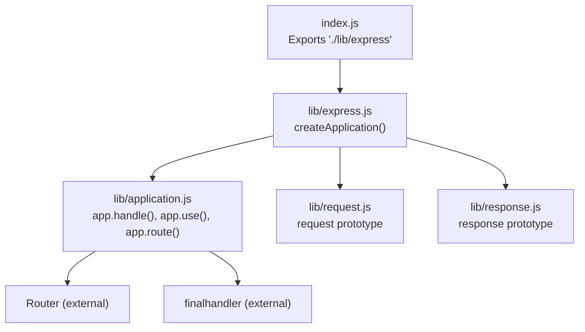
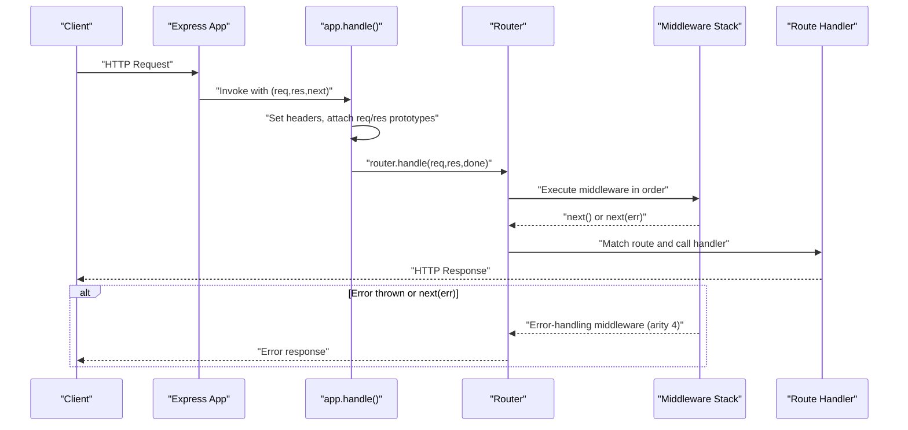
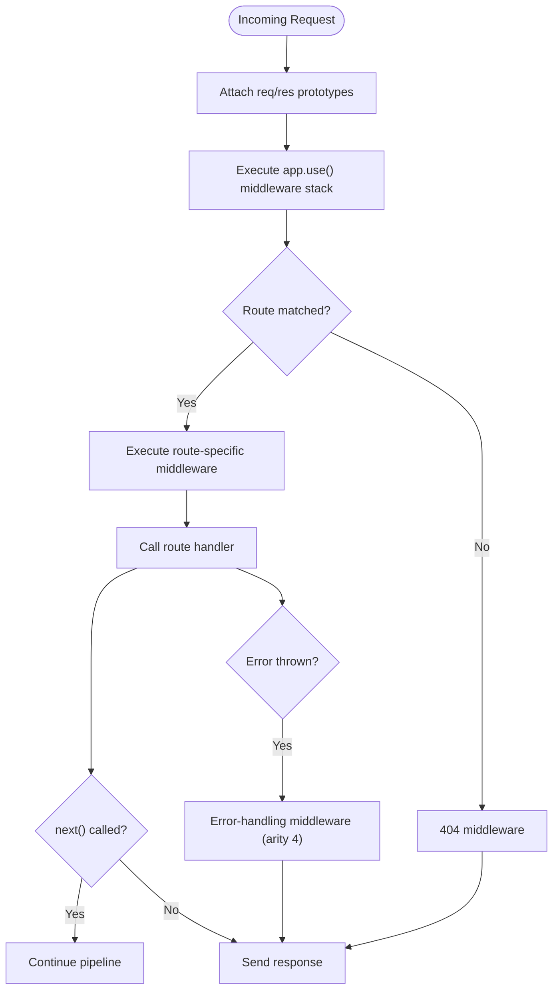
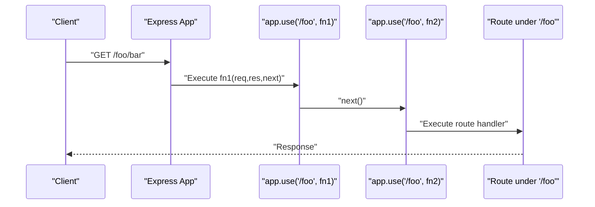
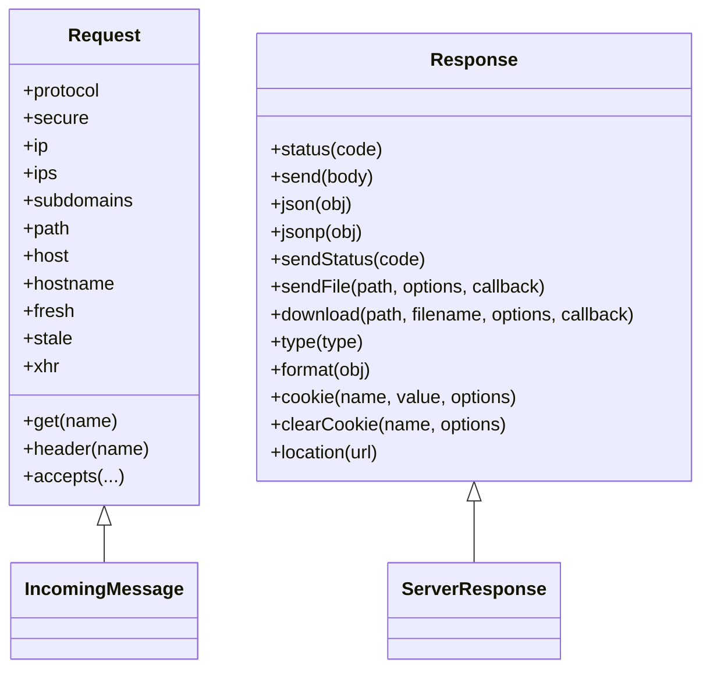
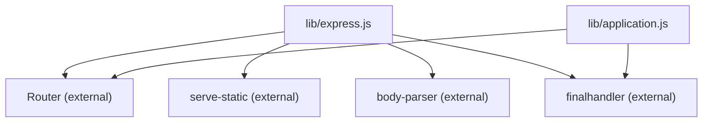

# Middleware Fundamentals

<cite>
**Referenced Files in This Document**
- [index.js](file://index.js)
- [lib/express.js](file://lib/express.js)
- [lib/application.js](file://lib/application.js)
- [lib/request.js](file://lib/request.js)
- [lib/response.js](file://lib/response.js)
- [examples/hello-world/index.js](file://examples/hello-world/index.js)
- [examples/static-files/index.js](file://examples/static-files/index.js)
- [examples/error/index.js](file://examples/error/index.js)
- [examples/route-middleware/index.js](file://examples/route-middleware/index.js)
- [examples/multi-router/index.js](file://examples/multi-router/index.js)
- [examples/cookies/index.js](file://examples/cookies/index.js)
- [examples/session/index.js](file://examples/session/index.js)
- [examples/params/index.js](file://examples/params/index.js)
- [test/app.use.js](file://test/app.use.js)
- [test/app.route.js](file://test/app.route.js)
- [test/app.router.js](file://test/app.router.js)
</cite>

## Table of Contents
1. [Introduction](#introduction)
2. [Project Structure](#project-structure)
3. [Core Components](#core-components)
4. [Architecture Overview](#architecture-overview)
5. [Detailed Component Analysis](#detailed-component-analysis)
6. [Dependency Analysis](#dependency-analysis)
7. [Performance Considerations](#performance-considerations)
8. [Troubleshooting Guide](#troubleshooting-guide)
9. [Conclusion](#conclusion)
10. [Appendices](#appendices)

## Introduction
This document explains Express.js middleware fundamentals with a focus on the four-parameter middleware signature (req, res, next, err), middleware execution order, prototype chain manipulation, and the req/res object enhancements. It covers built-in middleware categories (body parsing, static file serving, compression), demonstrates basic middleware implementation, path-specific middleware application, and middleware composition patterns. Practical examples are drawn from the repository’s core and examples, and the document includes debugging techniques, performance considerations, and common pitfalls.

## Project Structure
Express exposes a minimal entry point that delegates to the internal application module. The application module initializes the server, sets up default configuration and middleware, and orchestrates the request lifecycle via a router. The request and response prototypes are attached to each request/response, enabling convenient APIs and helpers.

**Diagram sources**
- [index.js:11](file://index.js#L11)
- [lib/express.js:36-56](file://lib/express.js#L36-L56)
- [lib/application.js:152-178](file://lib/application.js#L152-L178)

**Section sources**
- [index.js:11](file://index.js#L11)
- [lib/express.js:36-56](file://lib/express.js#L36-L56)
- [lib/application.js:59-83](file://lib/application.js#L59-L83)

## Core Components
- Four-parameter middleware signature:
  - Regular middleware: (req, res, next)
  - Error-handling middleware: (err, req, res, next)
- Execution order:
  - Registered via app.use() and route-specific middleware.
  - Errors propagate to the next error-handling middleware with arity 4.
- Prototype chain manipulation:
  - req and res prototypes are attached at runtime to enhance objects with helpers and getters.
- Built-in middleware exposure:
  - Body parsers: json, raw, text, urlencoded
  - Static file serving: static
  - Compression: exposed via serve-static (compression is typically provided by external middleware)

Key implementation references:
- Middleware registration and flattening of arrays: [lib/application.js:190-244](file://lib/application.js#L190-L244)
- Request/response prototype attachment: [lib/application.js:168-171](file://lib/application.js#L168-L171)
- Express middleware exports: [lib/express.js:77-82](file://lib/express.js#L77-L82)

**Section sources**
- [lib/application.js:190-244](file://lib/application.js#L190-L244)
- [lib/application.js:168-171](file://lib/application.js#L168-L171)
- [lib/express.js:77-82](file://lib/express.js#L77-L82)

## Architecture Overview
Express creates an application function that delegates to app.handle(). This function:
- Sets X-Powered-By header if enabled
- Links req.res and res.req
- Attaches req and res prototypes from the application
- Initializes res.locals if missing
- Delegates to the router, which executes registered middleware and routes

**Diagram sources**
- [lib/application.js:152-178](file://lib/application.js#L152-L178)
- [lib/application.js:190-244](file://lib/application.js#L190-L244)

**Section sources**
- [lib/application.js:152-178](file://lib/application.js#L152-L178)

## Detailed Component Analysis

### Four-parameter Middleware Signature and Execution Patterns
- Regular middleware pattern:
  - Modify req/res, compute, then call next() to continue the pipeline.
  - Throw or pass errors to next(err) to trigger error-handling middleware.
- Error-handling middleware pattern:
  - Signature (err, req, res, next) must be arity 4.
  - Can recover from errors or propagate further with next(err).

Examples from the repository:
- Basic route with middleware composition: [examples/route-middleware/index.js:65-84](file://examples/route-middleware/index.js#L65-L84)
- Error middleware with arity 4: [examples/error/index.js:20-27](file://examples/error/index.js#L20-L27)
- Promise rejections and error propagation in tests: [test/app.route.js:151-197](file://test/app.route.js#L151-L197), [test/app.router.js:985-1022](file://test/app.router.js#L985-L1022)

**Diagram sources**
- [lib/application.js:152-178](file://lib/application.js#L152-L178)
- [examples/error/index.js:20-27](file://examples/error/index.js#L20-L27)

**Section sources**
- [examples/route-middleware/index.js:65-84](file://examples/route-middleware/index.js#L65-L84)
- [examples/error/index.js:20-27](file://examples/error/index.js#L20-L27)
- [test/app.route.js:151-197](file://test/app.route.js#L151-L197)
- [test/app.router.js:985-1022](file://test/app.router.js#L985-L1022)

### Middleware Execution Order and Path-specific Application
- app.use() registers middleware globally or under a path prefix.
- Path stripping: When mounting under a path, the prefix is removed from req.url before reaching downstream middleware.
- Multiple arguments and nested arrays are flattened into a single middleware list.

References:
- Path stripping and mounting behavior: [test/app.use.js:284-294](file://test/app.use.js#L284-L294)
- Multiple arguments and nested arrays flattening: [lib/application.js:209-210](file://lib/application.js#L209-L210), [test/app.use.js:125-150](file://test/app.use.js#L125-L150), [test/app.use.js:229-255](file://test/app.use.js#L229-L255)

**Diagram sources**
- [test/app.use.js:284-294](file://test/app.use.js#L284-L294)
- [lib/application.js:209-210](file://lib/application.js#L209-L210)

**Section sources**
- [test/app.use.js:284-294](file://test/app.use.js#L284-L294)
- [lib/application.js:209-210](file://lib/application.js#L209-L210)

### Prototype Chain Manipulation and req/res Enhancements
- At runtime, req and res prototypes are attached to each request/response object, exposing helpers and getters.
- Examples include:
  - req.get()/header(), accepts(), protocol, secure, ip, ips, subdomains, path, host, hostname, fresh, stale, xhr
  - res.status(), send(), json(), jsonp(), sendStatus(), sendFile(), download(), type(), format(), cookie(), clearCookie(), location()

References:
- Prototype attachment: [lib/application.js:168-171](file://lib/application.js#L168-L171)
- req enhancements: [lib/request.js:63-83](file://lib/request.js#L63-L83), [lib/request.js:127-130](file://lib/request.js#L127-L130), [lib/request.js:297-315](file://lib/request.js#L297-L315), [lib/request.js:340-366](file://lib/request.js#L340-L366), [lib/request.js:383-394](file://lib/request.js#L383-L394), [lib/request.js:403-405](file://lib/request.js#L403-L405), [lib/request.js:418-431](file://lib/request.js#L418-L431), [lib/request.js:444-458](file://lib/request.js#L444-L458), [lib/request.js:469-486](file://lib/request.js#L469-L486), [lib/request.js:497-499](file://lib/request.js#L497-L499), [lib/request.js:508-511](file://lib/request.js#L508-L511)
- res enhancements: [lib/response.js:64-76](file://lib/response.js#L64-L76), [lib/response.js:125-218](file://lib/response.js#L125-L218), [lib/response.js:232-246](file://lib/response.js#L232-L246), [lib/response.js:371-413](file://lib/response.js#L371-L413), [lib/response.js:433-482](file://lib/response.js#L433-L482), [lib/response.js:569-594](file://lib/response.js#L569-L594), [lib/response.js:664-686](file://lib/response.js#L664-L686), [lib/response.js:742-775](file://lib/response.js#L742-L775), [lib/response.js:794-796](file://lib/response.js#L794-L796)

**Diagram sources**
- [lib/request.js:63-83](file://lib/request.js#L63-L83)
- [lib/response.js:64-76](file://lib/response.js#L64-L76)

**Section sources**
- [lib/application.js:168-171](file://lib/application.js#L168-L171)
- [lib/request.js:63-83](file://lib/request.js#L63-L83)
- [lib/response.js:64-76](file://lib/response.js#L64-L76)

### Built-in Middleware Categories
- Body parsing:
  - json, raw, text, urlencoded are exposed via Express.
  - Examples demonstrate urlencoded usage: [examples/cookies/index.js:22](file://examples/cookies/index.js#L22)
- Static file serving:
  - serve-static is exposed as express.static.
  - Examples demonstrate static usage with and without path prefix: [examples/static-files/index.js:22-36](file://examples/static-files/index.js#L22-L36)
- Compression:
  - Compression is not exposed directly by Express in this repository; it is commonly provided by external middleware.

References:
- Body parser exports: [lib/express.js:77-82](file://lib/express.js#L77-L82)
- Static export: [lib/express.js:79](file://lib/express.js#L79)
- Static usage examples: [examples/static-files/index.js:22-36](file://examples/static-files/index.js#L22-L36)

**Section sources**
- [lib/express.js:77-82](file://lib/express.js#L77-L82)
- [examples/static-files/index.js:22-36](file://examples/static-files/index.js#L22-L36)

### Basic Middleware Implementation and Composition
- Basic middleware:
  - Modify req/res and call next() or next(err).
  - Example: authentication placeholder and user loading: [examples/route-middleware/index.js:25-48](file://examples/route-middleware/index.js#L25-L48)
- Composition patterns:
  - Multiple middleware passed to app.use() or route methods compose left-to-right.
  - Example: chained middleware and route composition: [examples/route-middleware/index.js:74-84](file://examples/route-middleware/index.js#L74-L84)
- Parameter middleware:
  - app.param() transforms route parameters and can short-circuit with errors.
  - Example: integer conversion and user lookup: [examples/params/index.js:23-41](file://examples/params/index.js#L23-L41)

**Section sources**
- [examples/route-middleware/index.js:25-48](file://examples/route-middleware/index.js#L25-L48)
- [examples/route-middleware/index.js:74-84](file://examples/route-middleware/index.js#L74-L84)
- [examples/params/index.js:23-41](file://examples/params/index.js#L23-L41)

### Path-specific Middleware Application
- Mounting middleware under a path:
  - app.use('/api/v1', ...) applies middleware only to URLs starting with the prefix.
  - Path stripping removes the prefix before reaching downstream middleware.
- Example: multi-router composition: [examples/multi-router/index.js:7-8](file://examples/multi-router/index.js#L7-L8)
- Tests confirm path stripping and invocation behavior: [test/app.use.js:284-294](file://test/app.use.js#L284-L294)

**Section sources**
- [examples/multi-router/index.js:7-8](file://examples/multi-router/index.js#L7-L8)
- [test/app.use.js:284-294](file://test/app.use.js#L284-L294)

### Error Propagation and Error-handling Middleware
- Error-handling middleware must have arity 4 and appear after all routes and regular middleware.
- Examples:
  - Throwing inside a route and catching with error middleware: [examples/error/index.js:29-47](file://examples/error/index.js#L29-L47)
  - Error middleware responding with status and rendering: [examples/error-pages/index.js:91-97](file://examples/error-pages/index.js#L91-L97)
- Tests demonstrate promise rejection handling and error propagation: [test/app.route.js:151-197](file://test/app.route.js#L151-L197), [test/app.router.js:974-1022](file://test/app.router.js#L974-L1022)

**Section sources**
- [examples/error/index.js:29-47](file://examples/error/index.js#L29-L47)
- [examples/error-pages/index.js:91-97](file://examples/error-pages/index.js#L91-L97)
- [test/app.route.js:151-197](file://test/app.route.js#L151-L197)
- [test/app.router.js:974-1022](file://test/app.router.js#L974-L1022)

### Session and Cookie Middleware
- Cookies:
  - Parsing cookies and signed cookies via cookie-parser; urlencoded body parsing via express.urlencoded.
  - Example: [examples/cookies/index.js:19-22](file://examples/cookies/index.js#L19-L22)
- Sessions:
  - Using express-session to populate req.session.
  - Example: [examples/session/index.js:16-20](file://examples/session/index.js#L16-L20)

**Section sources**
- [examples/cookies/index.js:19-22](file://examples/cookies/index.js#L19-L22)
- [examples/session/index.js:16-20](file://examples/session/index.js#L16-L20)

## Dependency Analysis
Express middleware relies on:
- Router (external): Manages middleware stacks and route dispatch.
- finalhandler (external): Default error handler when no error middleware is present.
- serve-static (external): Static file serving.
- body-parser (external): Body parsing middleware (exposed via Express).

**Diagram sources**
- [lib/express.js:15-21](file://lib/express.js#L15-L21)
- [lib/express.js:77-82](file://lib/express.js#L77-L82)
- [lib/application.js:16-16](file://lib/application.js#L16-L16)

**Section sources**
- [lib/express.js:15-21](file://lib/express.js#L15-L21)
- [lib/express.js:77-82](file://lib/express.js#L77-L82)
- [lib/application.js:16-16](file://lib/application.js#L16-L16)

## Performance Considerations
- Minimize synchronous work in middleware to avoid blocking the event loop.
- Prefer streaming for large file responses (e.g., static files via serve-static).
- Avoid heavy computations in hot paths; cache results when appropriate.
- Keep middleware order efficient: place fast filters early to fail fast.
- Use appropriate body parser options to limit payload sizes and parsing overhead.

## Troubleshooting Guide
Common issues and remedies:
- Missing middleware function:
  - app.use() requires a function; passing non-functions throws a TypeError.
  - Reference: [test/app.use.js:259-282](file://test/app.use.js#L259-L282)
- Path-specific middleware not firing:
  - Ensure the request URL matches the registered prefix; path stripping occurs automatically.
  - Reference: [test/app.use.js:322-341](file://test/app.use.js#L322-L341)
- Error middleware not triggered:
  - Place error-handling middleware after all routes and regular middleware; ensure it has arity 4.
  - References: [examples/error/index.js:47](file://examples/error/index.js#L47), [test/app.router.js:974-1022](file://test/app.router.js#L974-L1022)
- Promise rejections:
  - Rejections in middleware bubble to error handlers; resolved promises do not continue middleware.
  - References: [test/app.route.js:151-197](file://test/app.route.js#L151-L197), [test/app.router.js:1004-1093](file://test/app.router.js#L1004-L1093)
- Debugging:
  - Use debug logging and middleware order verification via tests and examples.

**Section sources**
- [test/app.use.js:259-282](file://test/app.use.js#L259-L282)
- [test/app.use.js:322-341](file://test/app.use.js#L322-L341)
- [examples/error/index.js:47](file://examples/error/index.js#L47)
- [test/app.router.js:974-1022](file://test/app.router.js#L974-L1022)
- [test/app.route.js:151-197](file://test/app.route.js#L151-L197)
- [test/app.router.js:1004-1093](file://test/app.router.js#L1004-L1093)

## Conclusion
Express middleware forms a powerful, composable pipeline. Understanding the four-parameter signature, execution order, prototype enhancements, and path-specific application enables robust request processing. Built-in middleware categories (body parsing, static serving) and external middleware (sessions, cookies, compression) integrate seamlessly. Proper error handling, performance awareness, and debugging practices ensure maintainable applications.

## Appendices
- Hello world example for baseline setup: [examples/hello-world/index.js:7-9](file://examples/hello-world/index.js#L7-L9)
- Multi-router composition for modular middleware: [examples/multi-router/index.js:7-8](file://examples/multi-router/index.js#L7-L8)