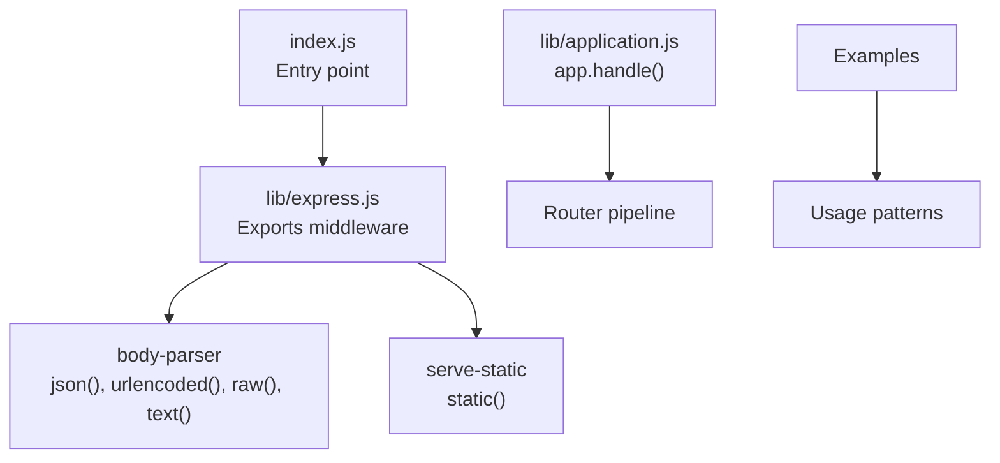
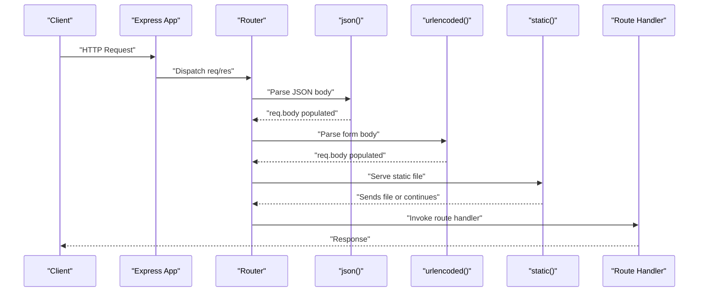
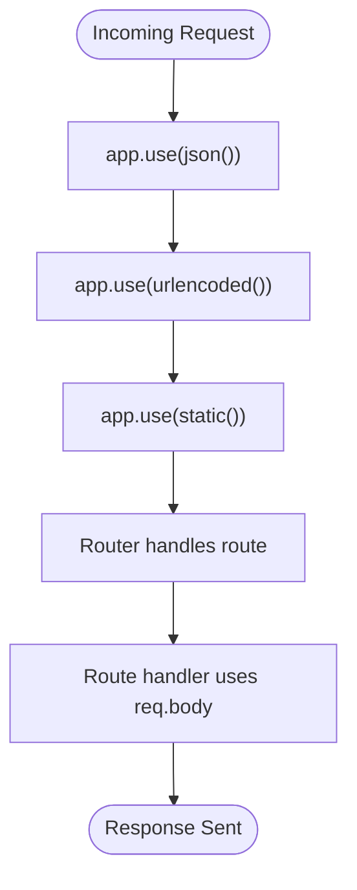
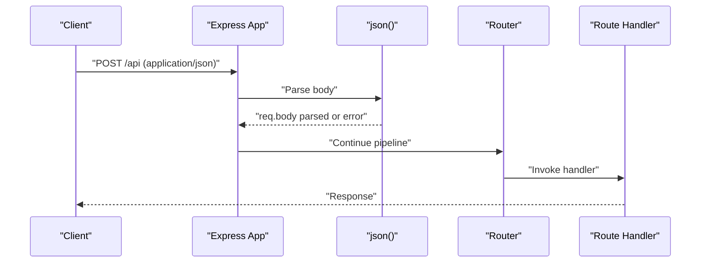
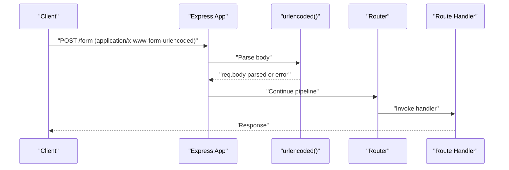
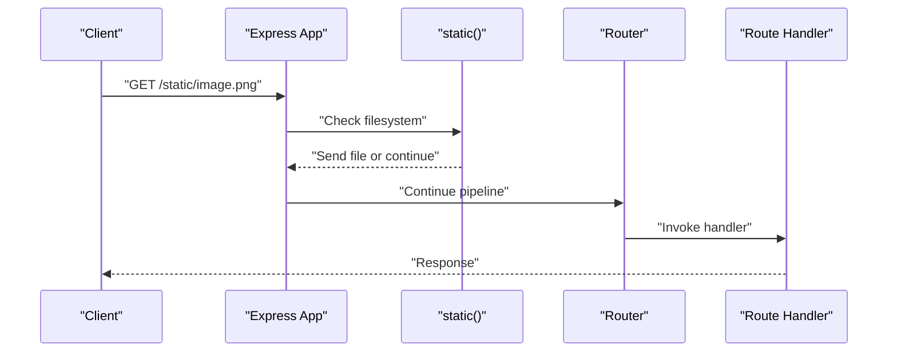
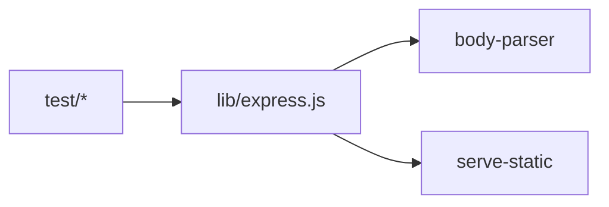

# Built-in Middleware

<cite>
**Referenced Files in This Document**
- [index.js](file://index.js)
- [lib/express.js](file://lib/express.js)
- [lib/application.js](file://lib/application.js)
- [test/express.json.js](file://test/express.json.js)
- [test/express.urlencoded.js](file://test/express.urlencoded.js)
- [test/express.static.js](file://test/express.static.js)
- [examples/static-files/index.js](file://examples/static-files/index.js)
- [examples/cookies/index.js](file://examples/cookies/index.js)
- [examples/cookie-sessions/index.js](file://examples/cookie-sessions/index.js)
</cite>

## Table of Contents
1. [Introduction](#introduction)
2. [Project Structure](#project-structure)
3. [Core Components](#core-components)
4. [Architecture Overview](#architecture-overview)
5. [Detailed Component Analysis](#detailed-component-analysis)
6. [Dependency Analysis](#dependency-analysis)
7. [Performance Considerations](#performance-considerations)
8. [Troubleshooting Guide](#troubleshooting-guide)
9. [Conclusion](#conclusion)

## Introduction
This document explains Express.js built-in middleware components with a focus on body parsing and static file serving. It covers:
- Body parsing middleware: json(), raw(), text(), urlencoded()
- Static file serving: static()
- Practical setup, configuration options, and common usage patterns
- Security considerations, performance implications, error handling, and debugging
- Middleware precedence and interaction between built-in middlewares

## Project Structure
Express exposes built-in middleware via its public API. The middleware are thin wrappers around well-known libraries:
- json(), urlencoded(), raw(), text() are exposed from the body-parser package
- static() is exposed from the serve-static package

**Diagram sources**
- [index.js:11](file://index.js#L11)
- [lib/express.js:77-81](file://lib/express.js#L77-L81)
- [lib/application.js:152-178](file://lib/application.js#L152-L178)

**Section sources**
- [index.js:11](file://index.js#L11)
- [lib/express.js:77-81](file://lib/express.js#L77-L81)
- [lib/application.js:152-178](file://lib/application.js#L152-L178)

## Core Components
- json(): Parses incoming JSON request bodies with configurable limits, strictness, type filtering, verification hooks, and content encoding handling.
- urlencoded(): Parses x-www-form-urlencoded bodies with extended object parsing, parameter limits, and content encoding handling.
- static(): Serves static files from a specified root directory with options for caching, redirects, range requests, hidden files, and custom headers.
- raw()/text(): Additional body parsers exposed for binary/raw buffers and plaintext bodies.

Key configuration surfaces are validated and exercised by tests, demonstrating:
- Limits for payload sizes and parameter counts
- Strict vs permissive parsing modes
- Type-based acceptance and custom accept functions
- Charset and content-encoding handling
- Error codes and messages for invalid or unsupported inputs

**Section sources**
- [lib/express.js:77-81](file://lib/express.js#L77-L81)
- [test/express.json.js:10-720](file://test/express.json.js#L10-L720)
- [test/express.urlencoded.js:10-829](file://test/express.urlencoded.js#L10-L829)
- [test/express.static.js:16-816](file://test/express.static.js#L16-L816)

## Architecture Overview
Express’s request lifecycle routes through the application handle method, which delegates to the internal router. Built-in middleware are registered via app.use() and participate in the ordered middleware chain.

**Diagram sources**
- [lib/application.js:152-178](file://lib/application.js#L152-L178)
- [lib/express.js:77-81](file://lib/express.js#L77-L81)

## Detailed Component Analysis

### JSON Body Parser (json)
Purpose:
- Parse application/json request bodies into req.body.

Key options and behaviors (validated by tests):
- limit: Maximum payload size; responds with 413 when exceeded (supports bytes or string sizes).
- inflate: Controls decompression for gzip/deflate; false rejects unsupported encodings.
- strict: When true, rejects primitive-only bodies; when false, allows primitives.
- type: Accepts custom MIME types or a function to decide when to parse.
- verify: Pre-parse hook to validate raw buffer; can customize status/type.
- charset: Supports UTF-8/UTF-16; unknown charsets yield 415.
- Content-Encoding: Identity/gzip/deflate supported; malformed encodings yield 400.
- Edge cases: Empty body, missing body, zero-length content-length handled gracefully.

Common usage pattern:
- Mount globally or scoped to routes/API paths.
- Combine with error handling middleware to normalize errors.

Security and performance:
- Enforce strict limits to mitigate large payload attacks.
- Prefer strict mode for APIs expecting structured objects.
- Inflate adds CPU cost; disable if not needed.

Debugging:
- Use error handler to inspect err.type and err.message.
- Verify Content-Type and charset headers.
- Inspect req.body after middleware.

**Section sources**
- [lib/express.js:77](file://lib/express.js#L77)
- [test/express.json.js:10-720](file://test/express.json.js#L10-L720)

### URL-Encoded Body Parser (urlencoded)
Purpose:
- Parse application/x-www-form-urlencoded request bodies into req.body.

Key options and behaviors (validated by tests):
- extended: true enables object parsing with nested keys and arrays; false preserves literal keys.
- parameterLimit: Maximum number of parameters; enforces 413 when exceeded.
- limit: Payload size limit with chunked and compressed bodies.
- inflate: Decompression control; false rejects unsupported encodings.
- type: Accepts custom MIME types or a function to decide when to parse.
- verify: Pre-parse hook to validate raw buffer; supports custom status/type.
- charset: UTF-8/UTF-16 supported; unknown charsets yield 415.
- Content-Encoding: Identity/gzip/deflate supported; malformed encodings yield 400.

Common usage pattern:
- Mount globally for forms or scoped to specific routes.
- Use extended: true for complex nested forms; false for simple flat forms.

Security and performance:
- Set parameterLimit to protect against excessive parameter counts.
- Limit payload size to avoid resource exhaustion.

Debugging:
- Confirm Content-Type and charset.
- Inspect req.body shape based on extended option.

**Section sources**
- [lib/express.js:81](file://lib/express.js#L81)
- [test/express.urlencoded.js:10-829](file://test/express.urlencoded.js#L10-L829)

### Static File Serving (static)
Purpose:
- Serve static assets from a given root directory with optional caching, redirects, range requests, and hidden-file policies.

Key options and behaviors (validated by tests):
- Options include acceptRanges, cacheControl, extensions, fallthrough, dotfiles, immutable, lastModified, maxAge, redirect, setHeaders.
- Redirect: When true, redirects directories to trailing slash; supports encoding and CSP header in redirect responses.
- Range: Honors Range header for partial content; sets Content-Range and 206/416 appropriately.
- Hidden files: Controlled via dotfiles policy.
- Fallthrough: When false, returns explicit errors (400/403/405) for invalid paths and malformed URLs.
- setHeaders: Function to attach custom headers on send.

Common usage pattern:
- Mount at root or a subpath to serve public assets.
- Combine with logging and error handling middlewares.

Security and performance:
- Prefer fallthrough: false for stricter environments to avoid path traversal ambiguity.
- Tune maxAge and immutable for CDN-friendly caching.
- Use redirect: true for predictable URLs.

Debugging:
- Verify root path and permissions.
- Check Cache-Control and Last-Modified headers.
- Validate redirects and range responses.

**Section sources**
- [lib/express.js:79](file://lib/express.js#L79)
- [test/express.static.js:16-816](file://test/express.static.js#L16-L816)

### Practical Examples and Patterns
- Static files: Serve public assets from a directory and optionally prefix with a subpath.
  - [examples/static-files/index.js:22-36](file://examples/static-files/index.js#L22-L36)
- Cookies and form handling: Use cookie parser alongside urlencoded to parse cookies and form bodies.
  - [examples/cookies/index.js:19-22](file://examples/cookies/index.js#L19-L22)
- Cookie sessions: Use cookie-session middleware to manage signed/encrypted cookies.
  - [examples/cookie-sessions/index.js:13](file://examples/cookie-sessions/index.js#L13)

**Section sources**
- [examples/static-files/index.js:22-36](file://examples/static-files/index.js#L22-L36)
- [examples/cookies/index.js:19-22](file://examples/cookies/index.js#L19-L22)
- [examples/cookie-sessions/index.js:13](file://examples/cookie-sessions/index.js#L13)

## Architecture Overview
Middleware registration and invocation flow:

**Diagram sources**
- [lib/application.js:190-244](file://lib/application.js#L190-L244)
- [lib/express.js:77-81](file://lib/express.js#L77-L81)

## Detailed Component Analysis

### JSON Body Parsing Flow

**Diagram sources**
- [test/express.json.js:10-720](file://test/express.json.js#L10-L720)
- [lib/express.js:77](file://lib/express.js#L77)

**Section sources**
- [test/express.json.js:10-720](file://test/express.json.js#L10-L720)

### URL-Encoded Parsing Flow

**Diagram sources**
- [test/express.urlencoded.js:10-829](file://test/express.urlencoded.js#L10-L829)
- [lib/express.js:81](file://lib/express.js#L81)

**Section sources**
- [test/express.urlencoded.js:10-829](file://test/express.urlencoded.js#L10-L829)

### Static Serving Flow

**Diagram sources**
- [test/express.static.js:16-816](file://test/express.static.js#L16-L816)
- [lib/express.js:79](file://lib/express.js#L79)

**Section sources**
- [test/express.static.js:16-816](file://test/express.static.js#L16-L816)

## Dependency Analysis
Express re-exports middleware from external packages:
- json(), urlencoded(), raw(), text() from body-parser
- static() from serve-static

**Diagram sources**
- [lib/express.js:77-81](file://lib/express.js#L77-L81)

**Section sources**
- [lib/express.js:77-81](file://lib/express.js#L77-L81)

## Performance Considerations
- Body parsers:
  - Set appropriate limits to avoid memory pressure and slow parsing.
  - Disable inflate if compression is not needed to reduce CPU overhead.
  - Use strict mode to enforce structured payloads.
- Static serving:
  - Configure maxAge and immutable for efficient caching.
  - Use acceptRanges and conditional requests to minimize bandwidth.
  - Prefer fallthrough: false in production for stricter and faster failure modes.

[No sources needed since this section provides general guidance]

## Troubleshooting Guide
- JSON parsing errors:
  - 400 for invalid JSON or whitespace-only bodies; 413 for oversized; 415 for unsupported charset/encoding.
  - Use verify to pre-validate payloads and customize error codes/types.
  - Inspect err.type and err.message in error handlers.
- URL-encoded parsing errors:
  - 400 for invalid content-length; 413 for oversized; 415 for unsupported charset/encoding.
  - parameterLimit protects against excessive parameters; adjust as needed.
- Static serving issues:
  - 404/403/405 depending on fallthrough and path validity; verify root path and permissions.
  - Redirect loops or incorrect redirects often stem from URL encoding or mount paths; confirm redirect behavior and setHeaders hook.

**Section sources**
- [test/express.json.js:10-720](file://test/express.json.js#L10-L720)
- [test/express.urlencoded.js:10-829](file://test/express.urlencoded.js#L10-L829)
- [test/express.static.js:16-816](file://test/express.static.js#L16-L816)

## Conclusion
Express’s built-in middleware provides robust, configurable body parsing and static file serving. By understanding configuration options, security implications, and error behaviors, you can build secure, performant applications. Use tests and examples as references for correct setup and common patterns.