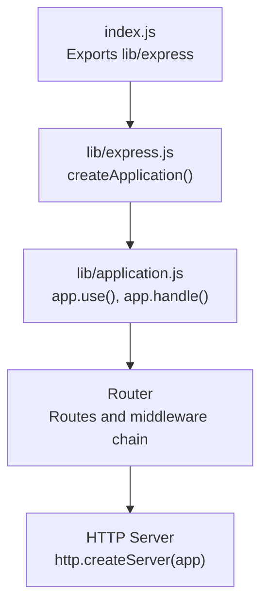
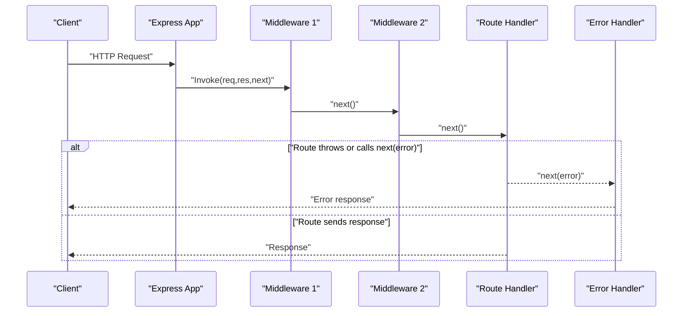
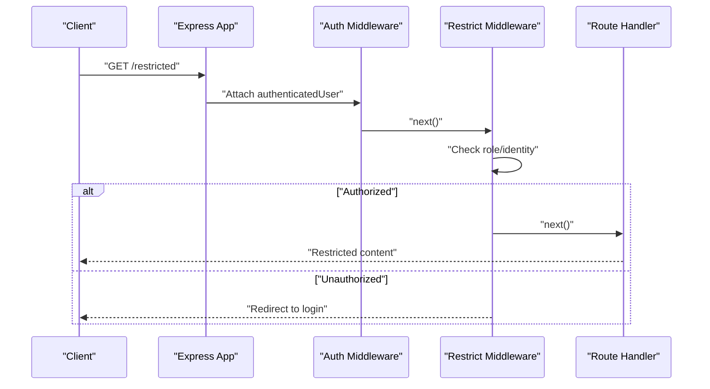
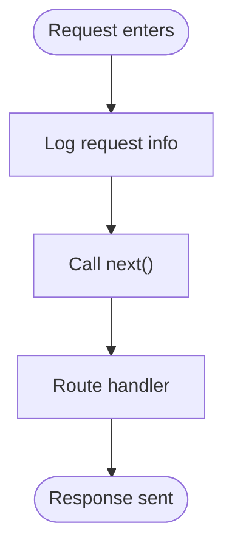
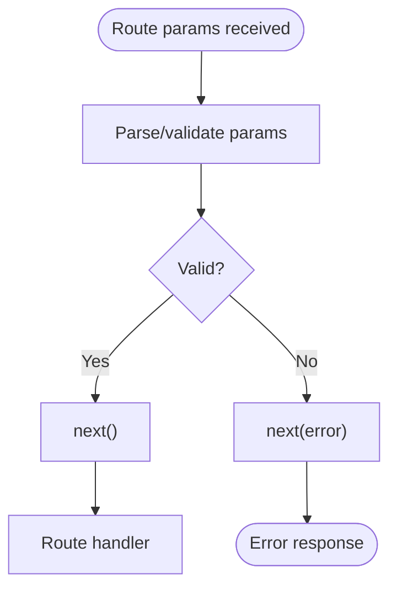
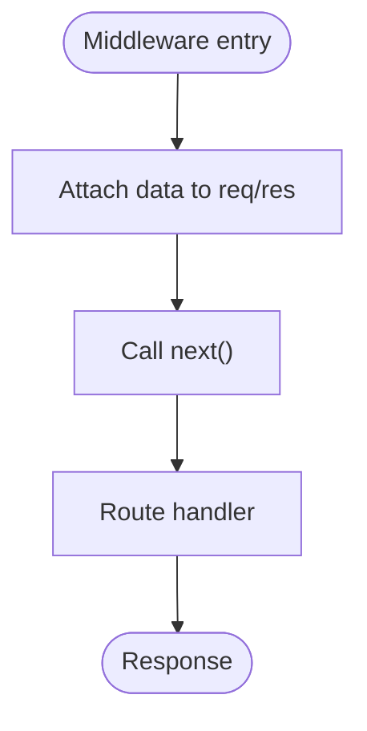
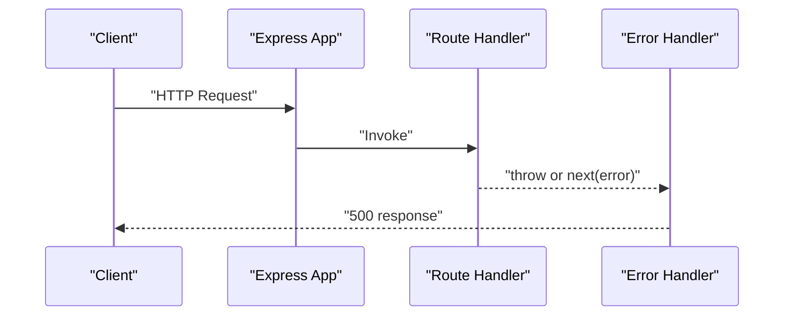
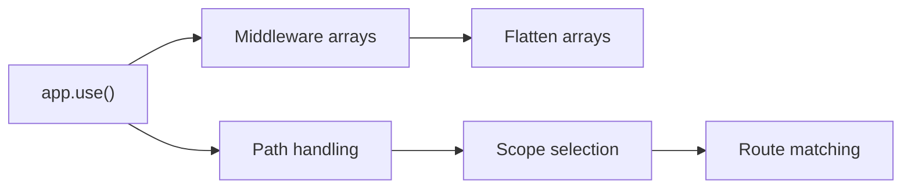

# Custom Middleware Development

<cite>
**Referenced Files in This Document**
- [index.js](file://index.js)
- [lib/express.js](file://lib/express.js)
- [lib/application.js](file://lib/application.js)
- [examples/route-middleware/index.js](file://examples/route-middleware/index.js)
- [examples/auth/index.js](file://examples/auth/index.js)
- [examples/error/index.js](file://examples/error/index.js)
- [examples/view-locals/index.js](file://examples/view-locals/index.js)
- [examples/content-negotiation/index.js](file://examples/content-negotiation/index.js)
- [examples/session/index.js](file://examples/session/index.js)
- [examples/params/index.js](file://examples/params/index.js)
- [examples/static-files/index.js](file://examples/static-files/index.js)
- [examples/resource/index.js](file://examples/resource/index.js)
- [test/app.use.js](file://test/app.use.js)
- [test/middleware.basic.js](file://test/middleware.basic.js)
</cite>

## Table of Contents
1. [Introduction](#introduction)
2. [Project Structure](#project-structure)
3. [Core Components](#core-components)
4. [Architecture Overview](#architecture-overview)
5. [Detailed Component Analysis](#detailed-component-analysis)
6. [Dependency Analysis](#dependency-analysis)
7. [Performance Considerations](#performance-considerations)
8. [Troubleshooting Guide](#troubleshooting-guide)
9. [Conclusion](#conclusion)
10. [Appendices](#appendices)

## Introduction
This document explains how to develop custom middleware in Express.js using patterns and examples from the repository. It covers middleware function signatures, request/response object manipulation, error propagation, composition, scope, conditional execution, testing, debugging, and performance. Practical examples include authentication, logging, validation, and transformation middleware.

## Project Structure
Express exposes a factory that creates an application with request/response prototypes and integrates a router. Middleware is registered via the application’s use method and executed in the order registered. The examples demonstrate middleware patterns across authentication, error handling, content negotiation, sessions, parameter parsing, static file serving, and resource routing.

**Diagram sources**
- [index.js:1-12](file://index.js#L1-L12)
- [lib/express.js:36-56](file://lib/express.js#L36-L56)
- [lib/application.js:152-178](file://lib/application.js#L152-L178)

**Section sources**
- [index.js:1-12](file://index.js#L1-L12)
- [lib/express.js:36-56](file://lib/express.js#L36-L56)
- [lib/application.js:152-178](file://lib/application.js#L152-L178)

## Core Components
- Application creation and middleware registration:
  - The application is created by a factory that sets up request/response prototypes and mounts a router.
  - Middleware is registered via app.use and supports single functions, arrays, and nested arrays.
  - Path scoping is supported via string prefixes, arrays of paths, regular expressions, and empty string.
- Request/response manipulation:
  - Middleware can attach properties to req and res, mutate headers, and set locals.
  - Error-first callbacks and next(err) are used to propagate errors.
- Error middleware:
  - Error handlers are identified by arity (four arguments) and are placed after routes to catch errors.

Key behaviors demonstrated:
- Middleware invocation order and chaining.
- Mounting nested applications and preserving req/res prototypes.
- Path stripping and originalUrl handling.
- Error propagation and centralized error handling.

**Section sources**
- [lib/express.js:36-56](file://lib/express.js#L36-L56)
- [lib/application.js:190-244](file://lib/application.js#L190-L244)
- [lib/application.js:284-390](file://lib/application.js#L284-L390)
- [test/app.use.js:125-256](file://test/app.use.js#L125-L256)
- [test/app.use.js:258-542](file://test/app.use.js#L258-L542)
- [examples/error/index.js:20-27](file://examples/error/index.js#L20-L27)

## Architecture Overview
Express middleware forms a pipeline: incoming requests traverse the router and registered middleware in order. Errors can short-circuit the pipeline and reach error handlers. Static middleware serves files, parameter middleware transforms parameters, and route-specific middleware executes per route.

**Diagram sources**
- [lib/application.js:152-178](file://lib/application.js#L152-L178)
- [examples/error/index.js:20-27](file://examples/error/index.js#L20-L27)

## Detailed Component Analysis

### Authentication Middleware Pattern
Authentication middleware typically populates authenticated context on the request and enforces access control. Examples show:
- Session-based authentication middleware that redirects unauthenticated users.
- Route-scoped middleware that restricts access based on roles or identity.
- Composition of middleware to load users, enforce self-access, and enforce roles.

**Diagram sources**
- [examples/auth/index.js:75-82](file://examples/auth/index.js#L75-L82)
- [examples/route-middleware/index.js:25-58](file://examples/route-middleware/index.js#L25-L58)

**Section sources**
- [examples/auth/index.js:75-82](file://examples/auth/index.js#L75-L82)
- [examples/route-middleware/index.js:25-58](file://examples/route-middleware/index.js#L25-L58)

### Logging Middleware Pattern
Logging middleware logs requests and can be conditionally enabled. It demonstrates attaching state to res.locals and integrating with external logging libraries.

**Diagram sources**
- [examples/static-files/index.js:12-13](file://examples/static-files/index.js#L12-L13)
- [examples/view-locals/index.js:30-39](file://examples/view-locals/index.js#L30-L39)

**Section sources**
- [examples/static-files/index.js:12-13](file://examples/static-files/index.js#L12-L13)
- [examples/view-locals/index.js:30-39](file://examples/view-locals/index.js#L30-L39)

### Validation Middleware Pattern
Validation middleware can transform or reject requests early. The params example converts route parameters and uses next(error) for invalid input.

**Diagram sources**
- [examples/params/index.js:23-41](file://examples/params/index.js#L23-L41)

**Section sources**
- [examples/params/index.js:23-41](file://examples/params/index.js#L23-L41)

### Transformation Middleware Pattern
Transformation middleware modifies request/response objects or adds computed data. Examples include:
- Attaching derived data to req (e.g., counts, filtered lists).
- Setting res.locals for downstream rendering.
- Content negotiation middleware that delegates response formatting.

**Diagram sources**
- [examples/view-locals/index.js:48-70](file://examples/view-locals/index.js#L48-L70)
- [examples/content-negotiation/index.js:33-38](file://examples/content-negotiation/index.js#L33-L38)

**Section sources**
- [examples/view-locals/index.js:48-70](file://examples/view-locals/index.js#L48-L70)
- [examples/content-negotiation/index.js:33-38](file://examples/content-negotiation/index.js#L33-L38)

### Error Handling Middleware Pattern
Express supports centralized error handling via middleware with four arguments. Errors can be thrown synchronously or passed asynchronously via next(err). Tests demonstrate placement after routes and behavior with async operations.

**Diagram sources**
- [examples/error/index.js:20-27](file://examples/error/index.js#L20-L27)
- [test/middleware.basic.js:33-40](file://test/middleware.basic.js#L33-L40)

**Section sources**
- [examples/error/index.js:20-27](file://examples/error/index.js#L20-L27)
- [test/middleware.basic.js:33-40](file://test/middleware.basic.js#L33-L40)

## Dependency Analysis
Express middleware registration supports:
- Single middleware functions.
- Arrays of middleware functions.
- Nested arrays flattened into a single chain.
- Path scoping via string, array of strings, regular expressions, and empty string.
- Mounting nested applications with preserved prototypes.

**Diagram sources**
- [lib/application.js:190-244](file://lib/application.js#L190-L244)
- [test/app.use.js:125-256](file://test/app.use.js#L125-L256)
- [test/app.use.js:258-542](file://test/app.use.js#L258-L542)

**Section sources**
- [lib/application.js:190-244](file://lib/application.js#L190-L244)
- [test/app.use.js:125-256](file://test/app.use.js#L125-L256)
- [test/app.use.js:258-542](file://test/app.use.js#L258-L542)

## Performance Considerations
- Minimize synchronous I/O in hot paths; prefer asynchronous operations and caching.
- Keep middleware order efficient; place fast filters earlier to fail fast.
- Avoid heavy allocations in middleware; reuse objects when possible.
- Use static middleware for assets and avoid unnecessary transformations.
- Prefer res.format or lightweight serialization helpers to reduce branching overhead.

## Troubleshooting Guide
Common issues and remedies:
- Middleware not invoked:
  - Verify app.use registration and path matching.
  - Confirm middleware arity and that next() is called.
- Error not handled:
  - Ensure error middleware is registered after routes and uses four arguments.
  - Check that errors are passed to next(err) and not swallowed.
- Incorrect req/res state:
  - Confirm middleware runs in the intended order and does not overwrite critical properties unintentionally.
- Async errors:
  - Use process.nextTick or Promise rejection to ensure next(err) is called outside the current sync frame.

**Section sources**
- [examples/error/index.js:20-27](file://examples/error/index.js#L20-L27)
- [test/middleware.basic.js:8-41](file://test/middleware.basic.js#L8-L41)

## Conclusion
Custom middleware in Express is a powerful mechanism for request/response transformation, validation, authentication, and error handling. By understanding the middleware pipeline, path scoping, and error propagation, developers can compose robust middleware chains that are easy to test, debug, and optimize.

## Appendices

### Middleware Types and Patterns
- Authentication middleware: populate req.user and redirect or block unauthorized requests.
- Logging middleware: log requests and optionally set res.locals for templating.
- Validation middleware: parse and validate parameters; short-circuit with next(error).
- Transformation middleware: attach computed data to req/res and prepare responses.
- Error handling middleware: centralized error response with four-argument signature.

### Middleware Best Practices
- Always call next() or next(err) to continue or abort the pipeline.
- Preserve req/res prototypes during nested app mounting.
- Use path scoping to limit middleware impact.
- Keep middleware focused and composable; favor small units.
- Test middleware with supertest and verify ordering and error paths.

### Testing Strategies
- Use supertest to assert middleware effects on headers, body, and status.
- Verify path scoping and array flattening behavior.
- Simulate async errors and confirm error handler activation.
- Mock external dependencies (e.g., sessions, databases) in tests.

**Section sources**
- [test/app.use.js:125-542](file://test/app.use.js#L125-L542)
- [test/middleware.basic.js:8-41](file://test/middleware.basic.js#L8-L41)