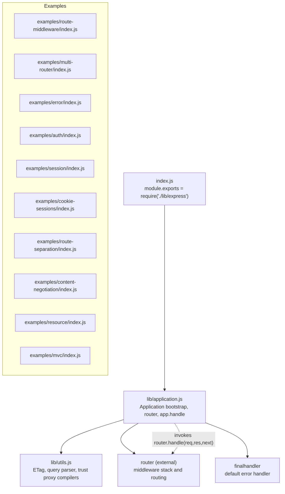
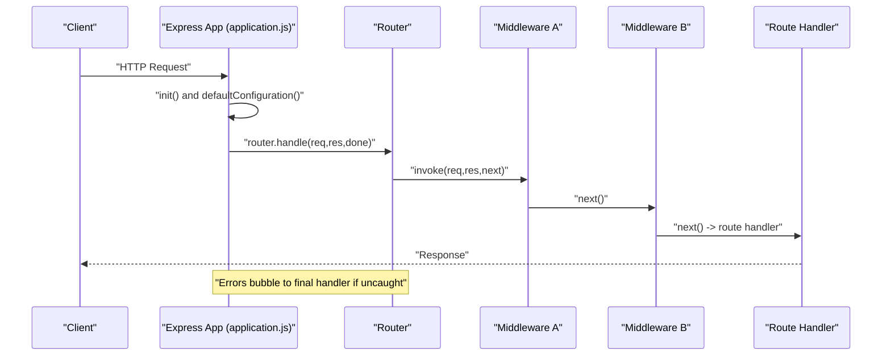
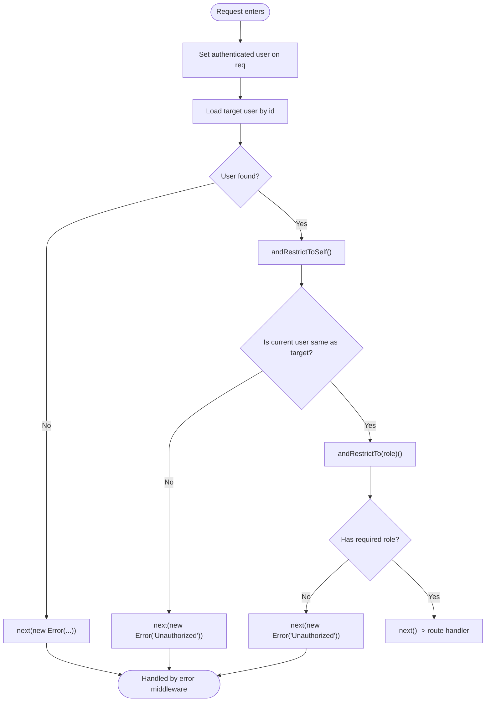
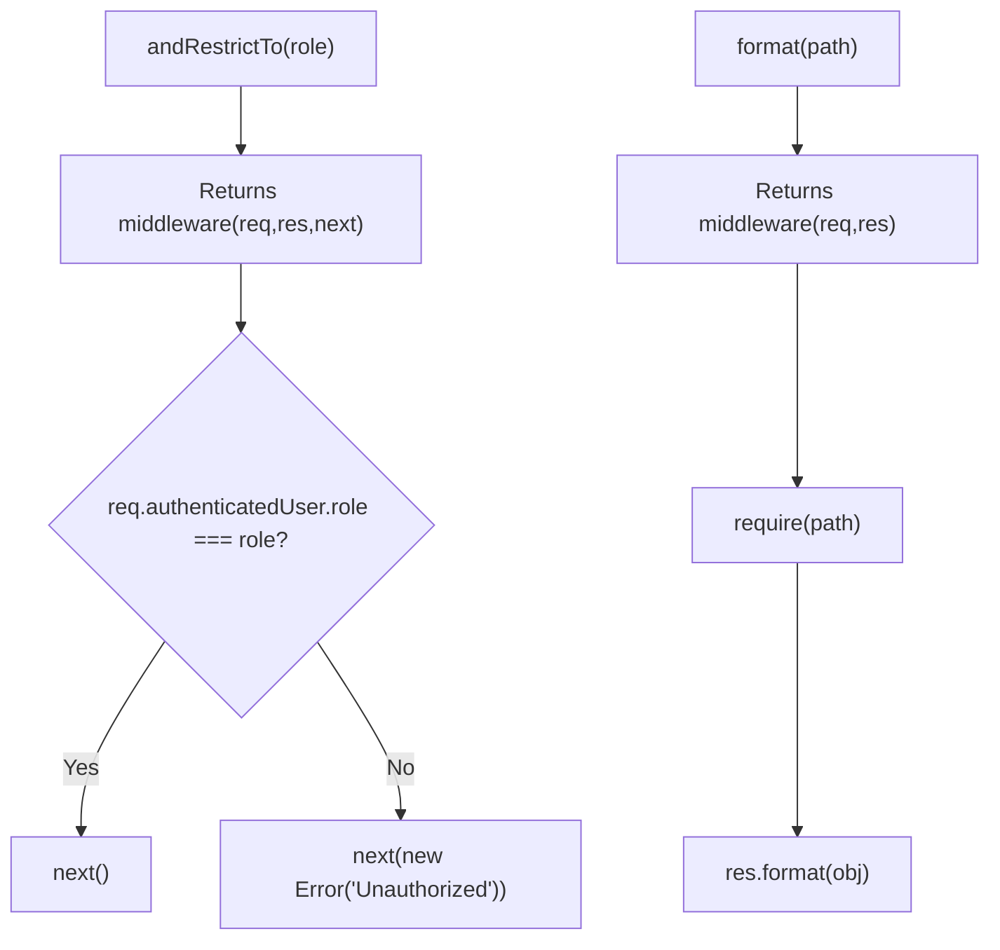
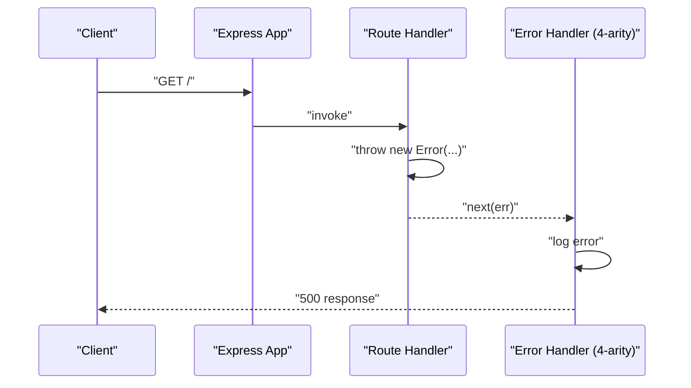
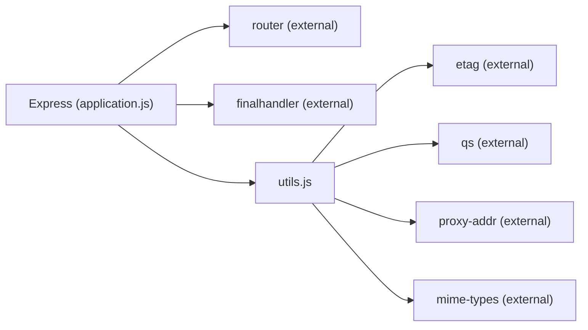

# Middleware Composition and Patterns

<cite>
**Referenced Files in This Document**
- [index.js](file://index.js)
- [lib/application.js](file://lib/application.js)
- [lib/utils.js](file://lib/utils.js)
- [examples/route-middleware/index.js](file://examples/route-middleware/index.js)
- [examples/multi-router/index.js](file://examples/multi-router/index.js)
- [examples/error/index.js](file://examples/error/index.js)
- [examples/auth/index.js](file://examples/auth/index.js)
- [examples/session/index.js](file://examples/session/index.js)
- [examples/cookie-sessions/index.js](file://examples/cookie-sessions/index.js)
- [examples/route-separation/index.js](file://examples/route-separation/index.js)
- [examples/content-negotiation/index.js](file://examples/content-negotiation/index.js)
- [examples/resource/index.js](file://examples/resource/index.js)
- [examples/mvc/index.js](file://examples/mvc/index.js)
- [test/app.use.js](file://test/app.use.js)
- [test/middleware.basic.js](file://test/middleware.basic.js)
</cite>

## Table of Contents
1. [Introduction](#introduction)
2. [Project Structure](#project-structure)
3. [Core Components](#core-components)
4. [Architecture Overview](#architecture-overview)
5. [Detailed Component Analysis](#detailed-component-analysis)
6. [Dependency Analysis](#dependency-analysis)
7. [Performance Considerations](#performance-considerations)
8. [Troubleshooting Guide](#troubleshooting-guide)
9. [Conclusion](#conclusion)
10. [Appendices](#appendices)

## Introduction
This document explains middleware composition patterns and advanced middleware techniques in Express.js using concrete examples and tests from the repository. It covers middleware chaining strategies, conditional middleware execution, middleware organization patterns, scope management (application-level vs route-level), middleware inheritance, middleware factories, dynamic middleware loading, middleware-based routing, error handling middleware, debugging techniques, performance optimization, memory management, production deployment considerations, testing strategies, and integration with external middleware libraries.

## Project Structure
Express exposes a minimal entry point that delegates to the internal application module. The application module initializes defaults, sets up the router, and orchestrates request handling and middleware invocation. Examples demonstrate practical middleware patterns, and tests validate middleware behavior and mounting semantics.

**Diagram sources**
- [index.js:1-12](file://index.js#L1-L12)
- [lib/application.js:59-83](file://lib/application.js#L59-L83)
- [lib/application.js:152-178](file://lib/application.js#L152-L178)
- [lib/utils.js:130-214](file://lib/utils.js#L130-L214)

**Section sources**
- [index.js:1-12](file://index.js#L1-L12)
- [lib/application.js:59-178](file://lib/application.js#L59-L178)
- [lib/utils.js:130-214](file://lib/utils.js#L130-L214)

## Core Components
- Application initialization and default configuration: Sets up environment, default settings, trust proxy, and local objects. Establishes the router getter and mounts the base router lazily.
- Request handling pipeline: Transforms request/response prototypes, wires locals, and delegates to the router. Falls back to a final handler for uncaught errors.
- Middleware registration: Proxies to the router’s use() with support for arrays, nested arrays, multiple arguments, and mounted applications. Supports path prefixes, arrays of paths, and regular expressions.
- Utility compilers: Provides compiled functions for ETag generation, query parsing, and trust proxy evaluation.

Key behaviors validated by tests:
- Mounting nested apps and emitting mount events.
- Accepting multiple middleware arguments and arrays, including nested arrays.
- Path stripping and matching for mounted middleware.
- RegExp and array-of-path support.

**Section sources**
- [lib/application.js:90-141](file://lib/application.js#L90-L141)
- [lib/application.js:152-178](file://lib/application.js#L152-L178)
- [lib/application.js:190-244](file://lib/application.js#L190-L244)
- [lib/utils.js:130-214](file://lib/utils.js#L130-L214)
- [test/app.use.js:1-543](file://test/app.use.js#L1-L543)

## Architecture Overview
Express composes middleware into a layered pipeline. The application sets up defaults, attaches the router, and forwards requests to it. Middleware can be registered globally (application-level) or per-route (route-level). Mounted applications inherit settings and prototypes, enabling composition across modules.

**Diagram sources**
- [lib/application.js:90-141](file://lib/application.js#L90-L141)
- [lib/application.js:152-178](file://lib/application.js#L152-L178)

## Detailed Component Analysis

### Middleware Chaining Strategies
- Sequential chaining: Multiple middleware are invoked in order. Each middleware receives the request, response, and next function. Calling next() continues the chain; calling next(err) short-circuits to error-handling middleware.
- Arrays and nested arrays: Middleware can be supplied as arrays or nested arrays; flattened and executed in order.
- Conditional continuation: Middleware can decide whether to call next() based on conditions (e.g., authentication checks, role checks).

Practical examples:
- Basic chaining and next() behavior validated by tests.
- Route-level middleware chaining with route-specific handlers.

**Section sources**
- [test/middleware.basic.js:1-43](file://test/middleware.basic.js#L1-L43)
- [examples/route-middleware/index.js:25-84](file://examples/route-middleware/index.js#L25-L84)

### Conditional Middleware Execution
- Authentication gating: A middleware sets an authenticated user on the request and subsequent middleware can enforce access control.
- Role-based restrictions: A factory returns middleware that enforces roles.
- Error signaling: Middleware invokes next(err) to signal failures (e.g., unauthorized).

**Diagram sources**
- [examples/route-middleware/index.js:25-84](file://examples/route-middleware/index.js#L25-L84)

**Section sources**
- [examples/route-middleware/index.js:25-84](file://examples/route-middleware/index.js#L25-L84)

### Middleware Organization Patterns
- Application-level middleware: Registered at the root app to apply to all requests (e.g., logging, sessions, parsers).
- Route-level middleware: Attached to specific routes or route groups.
- Modular composition: Mounting separate apps under path prefixes enables modular organization.

Examples:
- Multi-router mounting under distinct prefixes.
- Route separation into dedicated modules.
- MVC-style composition with middleware ordering.

**Section sources**
- [examples/multi-router/index.js:1-19](file://examples/multi-router/index.js#L1-L19)
- [examples/route-separation/index.js:1-56](file://examples/route-separation/index.js#L1-L56)
- [examples/mvc/index.js:1-96](file://examples/mvc/index.js#L1-L96)

### Middleware Scope Management
- Path scoping: app.use(path, ...) applies middleware only to requests whose path starts with the given prefix. Tests verify stripping of the matched prefix and matching behavior for trailing slashes and arrays of paths.
- RegExp scoping: Regular expressions can be used to match arbitrary patterns.
- Empty string path: Matches all requests.

Validation:
- Path stripping and matching for single and multiple paths.
- RegExp path support.

**Section sources**
- [test/app.use.js:284-390](file://test/app.use.js#L284-L390)
- [test/app.use.js:448-528](file://test/app.use.js#L448-L528)
- [test/app.use.js:530-540](file://test/app.use.js#L530-L540)

### Application-Level vs Route-Level Middleware
- Application-level: app.use(...) registers middleware for all routes.
- Route-level: app.get('/path', mw1, mw2, handler) attaches middleware to a specific route.
- Mixed usage: Global middleware runs before route-level middleware.

Examples:
- Application-level logging and parsers.
- Route-level middleware enforcing access control.

**Section sources**
- [examples/mvc/index.js:33-73](file://examples/mvc/index.js#L33-L73)
- [examples/route-middleware/index.js:74-84](file://examples/route-middleware/index.js#L74-L84)

### Middleware Inheritance
- Mounted apps inherit parent settings, prototypes, and engines. The application emits a mount event and adjusts trust proxy behavior accordingly.
- Prototypes are set to parent’s request/response to ensure shared behavior.

**Section sources**
- [lib/application.js:109-122](file://lib/application.js#L109-L122)
- [test/app.use.js:10-19](file://test/app.use.js#L10-L19)

### Advanced Patterns

#### Middleware Factories
- Role enforcement middleware is created by a factory that returns a function checking the authenticated user’s role.
- Content negotiation middleware is created by a factory that loads a formatter object and returns a middleware.

**Diagram sources**
- [examples/route-middleware/index.js:50-58](file://examples/route-middleware/index.js#L50-L58)
- [examples/content-negotiation/index.js:33-38](file://examples/content-negotiation/index.js#L33-L38)

**Section sources**
- [examples/route-middleware/index.js:50-58](file://examples/route-middleware/index.js#L50-L58)
- [examples/content-negotiation/index.js:33-38](file://examples/content-negotiation/index.js#L33-L38)

#### Dynamic Middleware Loading
- Middleware can be loaded dynamically from modules (e.g., format(path) factory).
- Mounted apps can be attached at runtime with path prefixes and middleware arrays.

**Section sources**
- [examples/content-negotiation/index.js:33-38](file://examples/content-negotiation/index.js#L33-L38)
- [test/app.use.js:71-122](file://test/app.use.js#L71-L122)

#### Middleware-Based Routing
- Resource-like routing can be composed using app.resource as a middleware aggregator that maps HTTP verbs and parameters to controller actions.
- Route-level middleware can be combined with route parameters to implement domain-specific routing logic.

**Section sources**
- [examples/resource/index.js:13-26](file://examples/resource/index.js#L13-L26)
- [examples/resource/index.js:41-68](file://examples/resource/index.js#L41-L68)

### Error Handling Middleware
- Signature: Error-handling middleware has four arguments (err, req, res, next).
- Placement: Must be registered after all routes and other middleware to catch errors thrown synchronously or passed via next(err).
- Behavior: Logs errors and sends an appropriate response.

**Diagram sources**
- [examples/error/index.js:20-27](file://examples/error/index.js#L20-L27)

**Section sources**
- [examples/error/index.js:14-47](file://examples/error/index.js#L14-L47)
- [test/middleware.basic.js:8-41](file://test/middleware.basic.js#L8-L41)

### Middleware Debugging Techniques
- Logging: Use a logger middleware (e.g., morgan) during development to observe request flow.
- Message propagation: Session-based messaging middleware can surface operational messages to views.
- Test assertions: Use supertest to assert header values and response behavior in middleware chains.

**Section sources**
- [examples/mvc/index.js:33-73](file://examples/mvc/index.js#L33-L73)
- [examples/auth/index.js:28-39](file://examples/auth/index.js#L28-L39)
- [test/app.use.js:125-256](file://test/app.use.js#L125-L256)

### Practical Examples of Complex Middleware Scenarios
- Authentication and session management: Demonstrates session creation, regeneration, and access restriction.
- Cookie-based sessions: Shows cookie-session usage for lightweight session storage.
- Content negotiation: Demonstrates format-specific responses and middleware factories.

**Section sources**
- [examples/auth/index.js:75-128](file://examples/auth/index.js#L75-L128)
- [examples/cookie-sessions/index.js:12-19](file://examples/cookie-sessions/index.js#L12-L19)
- [examples/content-negotiation/index.js:9-40](file://examples/content-negotiation/index.js#L9-L40)

## Dependency Analysis
Express relies on external libraries for rendering, HTTP handling, and optional utilities. The application module compiles settings into functions (ETag, query parser, trust proxy) and manages router instantiation and mounting.

**Diagram sources**
- [lib/application.js:16-26](file://lib/application.js#L16-L26)
- [lib/utils.js:15-22](file://lib/utils.js#L15-L22)

**Section sources**
- [lib/application.js:16-26](file://lib/application.js#L16-L26)
- [lib/utils.js:15-22](file://lib/utils.js#L15-L22)

## Performance Considerations
- Minimize synchronous work in middleware; defer heavy operations to asynchronous paths.
- Order middleware strategically to fail fast (e.g., early authentication and validation).
- Use compression and caching middleware judiciously; leverage built-in ETag generation.
- Avoid excessive prototype mutations; rely on Express’s prototype inheritance for shared behavior.
- Prefer static file serving middleware for assets and avoid unnecessary middleware overhead.

[No sources needed since this section provides general guidance]

## Troubleshooting Guide
Common issues and remedies:
- Middleware not invoked: Verify path prefixes and ensure middleware is registered before routes.
- Incorrect path matching: Confirm trailing slashes and array-of-paths behavior.
- Error not handled: Place error-handling middleware after all routes and other middleware.
- Mounted app not inheriting settings: Confirm mount event and prototype inheritance behavior.

**Section sources**
- [test/app.use.js:258-542](file://test/app.use.js#L258-L542)
- [lib/application.js:109-122](file://lib/application.js#L109-L122)

## Conclusion
Express middleware offers powerful composition primitives: global and route-level registration, path scoping, mounted app inheritance, and flexible chaining. By leveraging factories, dynamic loading, and structured organization (modules, MVC), teams can build maintainable, testable middleware stacks. Proper placement of error handlers, thoughtful performance tuning, and robust testing ensure reliable production deployments.

[No sources needed since this section summarizes without analyzing specific files]

## Appendices

### Middleware Testing Strategies
- Use supertest to assert middleware effects (headers, status codes, response bodies).
- Validate chaining order and next() behavior.
- Test mounted apps, path prefixes, arrays of middleware, and regular expressions.

**Section sources**
- [test/middleware.basic.js:1-43](file://test/middleware.basic.js#L1-L43)
- [test/app.use.js:125-542](file://test/app.use.js#L125-L542)

### Integration with External Middleware Libraries
- Session management: express-session and cookie-session.
- Static file serving: serve public assets efficiently.
- Logging: morgan for request logging.
- Method override: support for HTTP verb customization.

**Section sources**
- [examples/session/index.js:16-20](file://examples/session/index.js#L16-L20)
- [examples/cookie-sessions/index.js:12-13](file://examples/cookie-sessions/index.js#L12-L13)
- [examples/mvc/index.js:33-50](file://examples/mvc/index.js#L33-L50)
- [examples/route-separation/index.js:26-32](file://examples/route-separation/index.js#L26-L32)