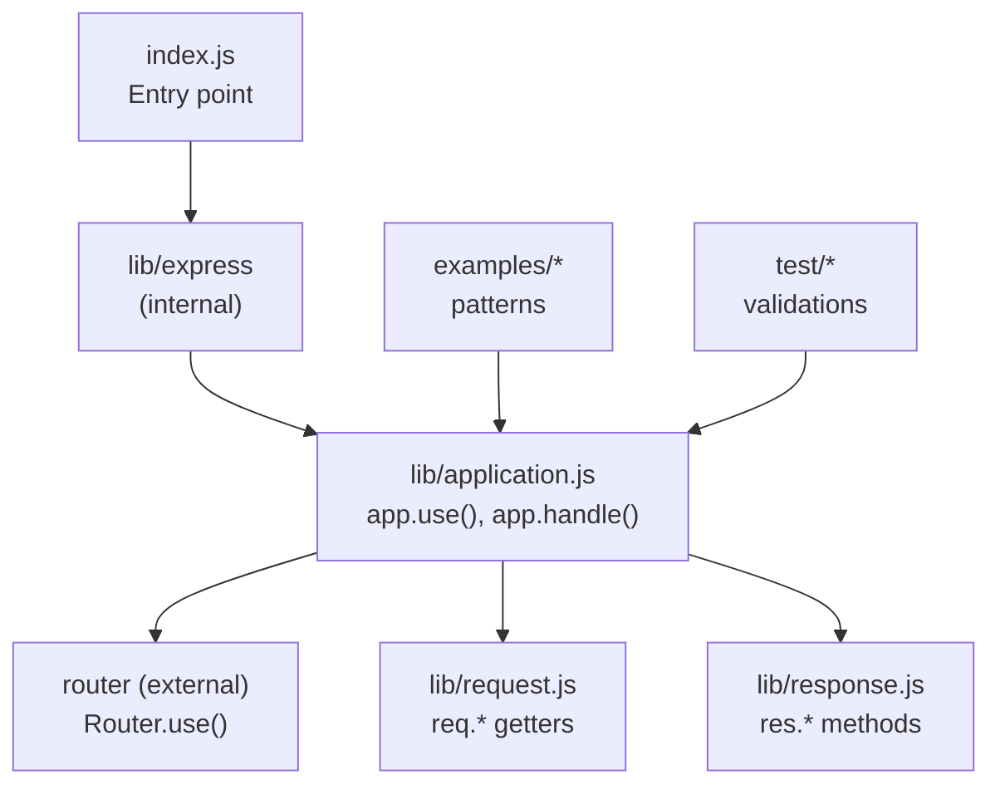
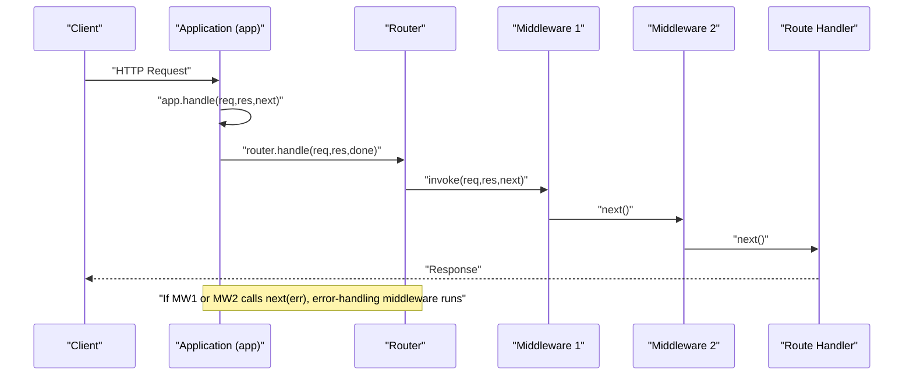
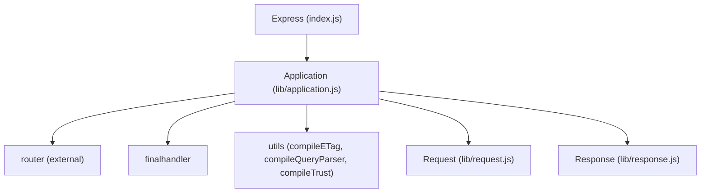

# Middleware Fundamentals

<cite>
**Referenced Files in This Document**
- [index.js](file://index.js)
- [lib/application.js](file://lib/application.js)
- [lib/request.js](file://lib/request.js)
- [lib/response.js](file://lib/response.js)
- [examples/hello-world/index.js](file://examples/hello-world/index.js)
- [examples/static-files/index.js](file://examples/static-files/index.js)
- [examples/error/index.js](file://examples/error/index.js)
- [examples/error-pages/index.js](file://examples/error-pages/index.js)
- [examples/route-middleware/index.js](file://examples/route-middleware/index.js)
- [examples/content-negotiation/index.js](file://examples/content-negotiation/index.js)
- [examples/multi-router/index.js](file://examples/multi-router/index.js)
- [test/app.use.js](file://test/app.use.js)
- [test/middleware.basic.js](file://test/middleware.basic.js)
- [Readme.md](file://Readme.md)
- [package.json](file://package.json)
</cite>

## Table of Contents
1. [Introduction](#introduction)
2. [Project Structure](#project-structure)
3. [Core Components](#core-components)
4. [Architecture Overview](#architecture-overview)
5. [Detailed Component Analysis](#detailed-component-analysis)
6. [Dependency Analysis](#dependency-analysis)
7. [Performance Considerations](#performance-considerations)
8. [Troubleshooting Guide](#troubleshooting-guide)
9. [Conclusion](#conclusion)

## Introduction
This document explains Express.js middleware fundamentals with a focus on how middleware functions are registered, how they receive and modify the request and response objects, and how they control flow using the next() function. It covers middleware execution order, path-based middleware, synchronous and asynchronous patterns, error propagation, and common middleware patterns. Practical examples are referenced from the repository’s examples and tests to ground the concepts in real usage.

## Project Structure
Express exposes its public API via a small entry that re-exports the internal express module. The core application logic, including middleware registration and request handling, lives in lib/application.js. The request and response objects are extended prototypes in lib/request.js and lib/response.js respectively. The examples directory demonstrates common middleware patterns (logging, static serving, error handling, route-scoped middleware, content negotiation, and multi-router composition). The test suite validates middleware behavior, ordering, and path matching.

**Diagram sources**
- [index.js:1-12](file://index.js#L1-L12)
- [lib/application.js:190-244](file://lib/application.js#L190-L244)
- [lib/request.js:30](file://lib/request.js#L30)
- [lib/response.js:42](file://lib/response.js#L42)

**Section sources**
- [index.js:1-12](file://index.js#L1-L12)
- [Readme.md:127-146](file://Readme.md#L127-L146)
- [package.json:85-90](file://package.json#L85-L90)

## Core Components
- Middleware registration: app.use() accepts middleware functions and mounts them onto the internal router. It supports path prefixes, arrays of middleware, and nested arrays. Mounted apps are supported and integrated into the pipeline.
- Request and response objects: These are extended prototypes with convenience getters and methods. They are attached to each request/response pair during app.handle().
- Execution model: Middleware is invoked in the order registered. Each middleware receives (req, res, next). next() advances to the next middleware; calling next(err) triggers error-handling middleware; calling next() without arguments continues normal flow.

Key implementation references:
- app.use(): path detection, flattening arrays, and router delegation
- app.handle(): attaches prototypes, sets locals, and delegates to router.handle()
- req/res prototypes: provide getters and methods used by middleware and routes

**Section sources**
- [lib/application.js:190-244](file://lib/application.js#L190-L244)
- [lib/application.js:152-178](file://lib/application.js#L152-L178)
- [lib/request.js:63-83](file://lib/request.js#L63-L83)
- [lib/response.js:125-218](file://lib/response.js#L125-L218)

## Architecture Overview
Express middleware participates in a chain-of-responsibility pipeline:
- app.handle() initializes the request/response context and delegates to the router.
- app.use() registers middleware into the router, optionally under a path prefix.
- During a request, middleware executes in registration order until either:
  - A middleware sends a response (ending the chain),
  - next(err) is called (switching to error-handling middleware),
  - next() is called without arguments (continuing to the next middleware),
  - Or the chain completes without handling the request (typically resulting in a 404).

**Diagram sources**
- [lib/application.js:152-178](file://lib/application.js#L152-L178)
- [lib/application.js:190-244](file://lib/application.js#L190-L244)

## Detailed Component Analysis

### Middleware Registration and Ordering
- app.use() supports:
  - Single middleware function
  - Multiple middleware functions as arguments
  - Arrays of middleware (including nested arrays)
  - Path prefixes and arrays of paths
  - Regular expressions for paths
- Order is preserved as registered; middleware runs in the exact order appended to the application/router.

Validation references:
- Multiple arguments, arrays, and nested arrays of middleware
- Path stripping and prefix behavior
- Arrays of paths and regular expressions

**Section sources**
- [test/app.use.js:125-256](file://test/app.use.js#L125-L256)
- [test/app.use.js:258-542](file://test/app.use.js#L258-L542)
- [lib/application.js:190-244](file://lib/application.js#L190-L244)

### Path-Based Middleware
- app.use(path, ...middleware) installs middleware under a given path prefix.
- The path is stripped from req.url before reaching downstream middleware and routes.
- Supports:
  - String prefixes
  - Arrays of prefixes
  - Regular expressions
  - Dynamic segments (mounted apps can use path parameters)

Practical examples:
- Static file serving under a prefix
- Mounting separate apps under different paths

**Section sources**
- [examples/static-files/index.js:22-36](file://examples/static-files/index.js#L22-L36)
- [examples/multi-router/index.js:7-8](file://examples/multi-router/index.js#L7-L8)
- [test/app.use.js:284-362](file://test/app.use.js#L284-L362)
- [test/app.use.js:448-503](file://test/app.use.js#L448-L503)
- [test/app.use.js:505-528](file://test/app.use.js#L505-L528)

### Basic Middleware Implementation Patterns
- Logging middleware: logs requests early in the chain
- Static file serving: serves files from disk using a static middleware
- Authentication/authorization: loads user context and enforces permissions
- Content negotiation: selects response format based on Accept headers
- Multi-router composition: mounts separate routers under different paths

References:
- Logging and static serving
- Authentication and authorization with route-scoped middleware
- Content negotiation with res.format()
- Multi-router composition

**Section sources**
- [examples/static-files/index.js:12-36](file://examples/static-files/index.js#L12-L36)
- [examples/route-middleware/index.js:25-84](file://examples/route-middleware/index.js#L25-L84)
- [examples/content-negotiation/index.js:9-40](file://examples/content-negotiation/index.js#L9-L40)
- [examples/multi-router/index.js:7-8](file://examples/multi-router/index.js#L7-L8)

### Error Propagation and Error Middleware
- Regular middleware signature: (req, res, next)
- Error middleware signature: (err, req, res, next) — must have arity of 4
- Calling next(err) transfers control to the next error-handling middleware
- Error middleware typically handles logging, sets status codes, and sends error responses
- Placement matters: error middleware should be registered after routes and regular middleware

References:
- Error middleware signature and behavior
- Throwing errors and passing them to next()
- Error pages with content negotiation

**Section sources**
- [examples/error/index.js:14-47](file://examples/error/index.js#L14-L47)
- [examples/error/index.js:29-42](file://examples/error/index.js#L29-L42)
- [examples/error-pages/index.js:63-97](file://examples/error-pages/index.js#L63-L97)

### Synchronous vs Asynchronous Middleware
- Synchronous: next() is called immediately after performing synchronous work
- Asynchronous: next(err) or next() is called within callbacks, timers, or async operations
- The test suite demonstrates next() usage inside async operations (e.g., process.nextTick)

References:
- Basic middleware chaining behavior
- Async local storage persistence across middleware and error handlers

**Section sources**
- [test/middleware.basic.js:8-42](file://test/middleware.basic.js#L8-L42)
- [test/express.text.js:360-424](file://test/express.text.js#L360-L424)
- [test/res.sendFile.js:280-318](file://test/res.sendFile.js#L280-L318)
- [test/res.download.js:88-130](file://test/res.download.js#L88-L130)

### Middleware Context and Shared State
- Middleware can attach properties to req (e.g., req.user, req.authenticatedUser) for downstream use
- Middleware can attach properties to res or res.locals for view rendering or later middleware
- Error middleware can inspect and augment error objects before responding

References:
- Attaching req.authenticatedUser and req.user
- Using res.locals and req.users for rendering
- Error middleware accessing error properties

**Section sources**
- [examples/route-middleware/index.js:65-68](file://examples/route-middleware/index.js#L65-L68)
- [examples/route-middleware/index.js:74-84](file://examples/route-middleware/index.js#L74-L84)
- [examples/view-locals/index.js:48-70](file://examples/view-locals/index.js#L48-L70)
- [examples/view-locals/index.js:86-108](file://examples/view-locals/index.js#L86-L108)
- [examples/error-pages/index.js:91-97](file://examples/error-pages/index.js#L91-L97)

### Function Signature Patterns and next()
- Standard middleware: (req, res, next)
- Error middleware: (err, req, res, next)
- next() without arguments continues to the next middleware
- next(err) switches to error-handling middleware
- next() can be called synchronously or asynchronously

References:
- Signature and behavior validated by tests
- Error propagation examples

**Section sources**
- [test/middleware.basic.js:8-42](file://test/middleware.basic.js#L8-L42)
- [examples/error/index.js:14-47](file://examples/error/index.js#L14-L47)

## Dependency Analysis
Express middleware relies on:
- Router (external): Provides the underlying mechanism for mounting middleware and dispatching requests
- Final handler: Used when no middleware responds, ensuring a default error handler behavior
- Utility modules: ETags, query parsers, trust/proxy settings, and more influence middleware behavior

**Diagram sources**
- [index.js:11](file://index.js#L11)
- [lib/application.js:16-26](file://lib/application.js#L16-L26)
- [lib/application.js:154-157](file://lib/application.js#L154-L157)

**Section sources**
- [package.json:34-62](file://package.json#L34-L62)
- [lib/application.js:16-26](file://lib/application.js#L16-L26)

## Performance Considerations
- Keep middleware order efficient: place fast-fail middlewares (e.g., CORS preflight, rate limiting) early to avoid unnecessary work.
- Avoid heavy synchronous work in hot paths; prefer asynchronous patterns and caching.
- Use path-specific middleware to limit unnecessary processing for routes that do not need certain handlers.
- Minimize allocations inside middleware loops; reuse buffers and objects when possible.

## Troubleshooting Guide
Common issues and remedies:
- Middleware not executing:
  - Verify app.use() registration order and path prefixes
  - Ensure next() is called unless sending a response
- Incorrect path matching:
  - Confirm path stripping behavior and trailing slashes
  - Test with arrays of paths and regular expressions
- Error not handled:
  - Place error middleware after all routes and regular middleware
  - Ensure error middleware signature (err, req, res, next)
- Async state loss:
  - Use async local storage to propagate context across middleware and error handlers
- Static files not served:
  - Confirm static middleware path and mount point
  - Check file permissions and existence

**Section sources**
- [test/app.use.js:258-542](file://test/app.use.js#L258-L542)
- [examples/error/index.js:14-47](file://examples/error/index.js#L14-L47)
- [examples/error-pages/index.js:63-97](file://examples/error-pages/index.js#L63-L97)
- [examples/static-files/index.js:12-36](file://examples/static-files/index.js#L12-L36)
- [test/express.text.js:360-424](file://test/express.text.js#L360-L424)

## Conclusion
Express middleware is the foundation of request processing. Understanding the function signatures, the role of next(), and how app.use() mounts middleware under paths enables predictable, composable behavior. Proper ordering, path scoping, and error middleware placement are essential for robust applications. The examples and tests in this repository illustrate practical patterns for logging, static serving, authentication, content negotiation, and multi-router composition, providing a strong baseline for building middleware-driven applications.