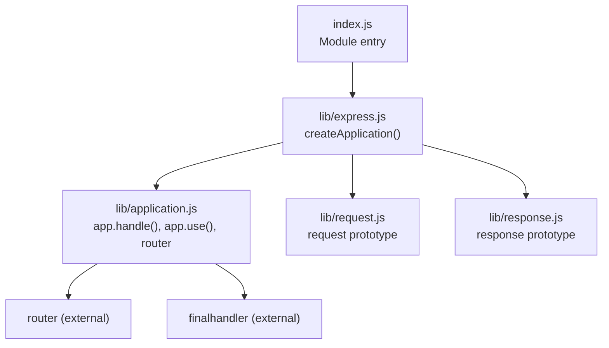
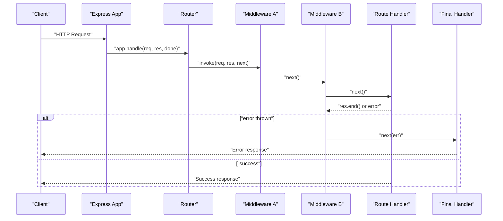
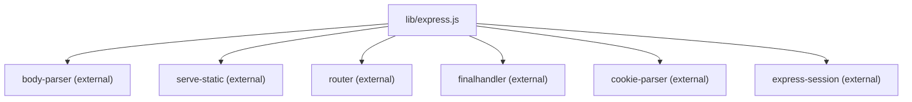

# Middleware System

<cite>
**Referenced Files in This Document**
- [index.js](file://index.js)
- [express.js](file://lib/express.js)
- [application.js](file://lib/application.js)
- [request.js](file://lib/request.js)
- [response.js](file://lib/response.js)
- [express.json.js](file://test/express.json.js)
- [express.raw.js](file://test/express.raw.js)
- [express.text.js](file://test/express.text.js)
- [express.urlencoded.js](file://test/express.urlencoded.js)
- [express.static.js](file://test/express.static.js)
- [route-middleware/index.js](file://examples/route-middleware/index.js)
- [multi-router/index.js](file://examples/multi-router/index.js)
- [static-files/index.js](file://examples/static-files/index.js)
- [cookies/index.js](file://examples/cookies/index.js)
- [session/index.js](file://examples/session/index.js)
- [auth/index.js](file://examples/auth/index.js)
- [error/index.js](file://examples/error/index.js)
- [error-pages/index.js](file://examples/error-pages/index.js)
</cite>

## Table of Contents
1. [Introduction](#introduction)
2. [Project Structure](#project-structure)
3. [Core Components](#core-components)
4. [Architecture Overview](#architecture-overview)
5. [Detailed Component Analysis](#detailed-component-analysis)
6. [Dependency Analysis](#dependency-analysis)
7. [Performance Considerations](#performance-considerations)
8. [Troubleshooting Guide](#troubleshooting-guide)
9. [Conclusion](#conclusion)
10. [Appendices](#appendices)

## Introduction
This document explains the Express.js middleware system comprehensively. It covers the middleware concept, execution flow, architecture patterns, built-in middleware (body parsing, static file serving, cookies, and CORS support), custom middleware development, composition, error handling, registration and ordering, conditional execution, and practical examples. It also includes best practices, performance optimization tips, and guidance on scoping middleware at application and route levels.

## Project Structure
Express exposes a minimal entry point that delegates to the internal library. The middleware system is primarily implemented in the application and request/response prototypes, with built-in middleware exposed via the Express factory.

**Diagram sources**
- [index.js:1-12](file://index.js#L1-L12)
- [express.js:36-56](file://lib/express.js#L36-L56)
- [application.js:152-178](file://lib/application.js#L152-L178)

**Section sources**
- [index.js:1-12](file://index.js#L1-L12)
- [express.js:36-56](file://lib/express.js#L36-L56)

## Core Components
- Application handle and middleware pipeline: The application’s request handler delegates to the router and uses a final handler for uncaught errors.
- Middleware registration: The app.use() method registers middleware globally or under a path, delegating to the internal router.
- Request and response prototypes: These define the shared context and helpers available to middleware and route handlers.
- Built-in middleware exposure: JSON, raw, text, urlencoded, and static middleware are exported from the Express factory.

Key implementation references:
- Application initialization and default configuration
- Pipeline dispatch via app.handle()
- Middleware registration via app.use()
- Built-in middleware exports

**Section sources**
- [application.js:59-141](file://lib/application.js#L59-L141)
- [application.js:152-178](file://lib/application.js#L152-L178)
- [application.js:190-244](file://lib/application.js#L190-L244)
- [express.js:77-82](file://lib/express.js#L77-L82)

## Architecture Overview
Express middleware forms a chain: each middleware receives the request and response objects and either handles them or calls next() to pass control to the next middleware. Errors are handled by middleware with four arguments. Routing integrates middleware stacks per route.

**Diagram sources**
- [application.js:152-178](file://lib/application.js#L152-L178)
- [application.js:190-244](file://lib/application.js#L190-L244)

## Detailed Component Analysis

### Middleware Execution Model
- Middleware signature: (req, res, next) for normal middleware; (err, req, res, next) for error-handling middleware.
- Ordering matters: middleware registered earlier runs before later ones. Error middleware must be registered after route handlers.
- Passing control: next() continues the chain; next(err) triggers error middleware; throwing synchronously or calling next with an error also triggers error middleware.

Practical example references:
- Error middleware ordering and behavior
- Throwing and passing errors asynchronously

**Section sources**
- [error/index.js:20-47](file://examples/error/index.js#L20-L47)
- [error-pages/index.js:91-97](file://examples/error-pages/index.js#L91-L97)

### Built-in Middleware

#### Body Parsing
Express exposes body parsers for JSON, raw, text, and urlencoded bodies. These are thin wrappers around body-parser.

- JSON: parses application/json
- Raw: raw buffer body
- Text: plain text body
- URL-encoded: form-encoded bodies

Usage patterns:
- Register once per type as needed
- Order before route handlers that consume the parsed body

**Section sources**
- [express.js:77-82](file://lib/express.js#L77-L82)
- [express.json.js](file://test/express.json.js)
- [express.raw.js](file://test/express.raw.js)
- [express.text.js](file://test/express.text.js)
- [express.urlencoded.js](file://test/express.urlencoded.js)

#### Static File Serving
Express integrates with serve-static to serve static assets. Multiple static middleware instances can be stacked, optionally under a path prefix.

- Mounting: app.use('/static', express.static(...))
- Multiple roots: register multiple static middleware instances for different directories

**Section sources**
- [express.js:79](file://lib/express.js#L79)
- [static-files/index.js:22-36](file://examples/static-files/index.js#L22-L36)

#### Cookies and Sessions
- Cookie parsing: cookie-parser populates req.cookies and req.signedCookies
- Sessions: express-session populates req.session

These are commonly used together for authentication and stateful interactions.

**Section sources**
- [cookies/index.js:19](file://examples/cookies/index.js#L19)
- [session/index.js:16-20](file://examples/session/index.js#L16-L20)

#### CORS Support
CORS is not built-in to Express. Use the cors middleware package to add CORS headers. Typical usage involves registering it early in the middleware stack.

[No sources needed since this section provides general guidance]

### Custom Middleware Development
Custom middleware follows the standard signature. They can:
- Inspect or mutate req/res
- Call next() to continue or next(err) to short-circuit with an error
- Short-circuit by writing to the response

Patterns:
- Validation middleware that throws or calls next(err)
- Logging middleware that logs before/after next()
- Authentication middleware that sets req.user and calls next()

Example references:
- Route-scoped middleware composition
- Authentication and restriction middleware

**Section sources**
- [route-middleware/index.js:25-58](file://examples/route-middleware/index.js#L25-L58)
- [auth/index.js:75-82](file://examples/auth/index.js#L75-L82)

### Middleware Composition and Chaining
- Compose multiple middleware functions in a route definition
- Use arrays or repeated app.use() calls to register multiple middleware
- Chain conditionally by checking req.path, method, or headers before calling next()

Example references:
- Route-level middleware arrays
- Multi-router composition

**Section sources**
- [route-middleware/index.js](file://examples/route-middleware/index.js)
- [multi-router/index.js:7-8](file://examples/multi-router/index.js#L7-L8)

### Error Handling Middleware
- Signature: (err, req, res, next)
- Must be registered after all other middleware/routes
- Can inspect err.status or set a response, then call next() or finish the response

Example references:
- Basic error handler
- Template-driven error pages

**Section sources**
- [error/index.js:20-47](file://examples/error/index.js#L20-L47)
- [error-pages/index.js:63-97](file://examples/error-pages/index.js#L63-L97)

### Registration, Ordering, and Conditional Execution
- Registration: app.use([path,] ...middleware)
- Ordering: earlier registrations run first; error middleware must be last
- Conditional execution: check req.method, req.path, headers, or custom flags inside middleware

Example references:
- Middleware registration and path prefixes
- Conditional logic in route middleware

**Section sources**
- [application.js:190-244](file://lib/application.js#L190-L244)
- [route-middleware/index.js:65-68](file://examples/route-middleware/index.js#L65-L68)

### Scope: Application-Level vs Route-Level Middleware
- Application-level: app.use(...) applies to all routes
- Route-level: app.get('/path', mw1, mw2, handler) applies only to that route/method
- Router-level: nested apps can be mounted under a path

Example references:
- Route-level middleware arrays
- Mounting nested apps

**Section sources**
- [application.js:190-244](file://lib/application.js#L190-L244)
- [multi-router/index.js:7-8](file://examples/multi-router/index.js#L7-L8)

### Middleware Context Handling
- req and res prototypes are set on app.request and app.response during app creation
- Middleware can rely on shared properties and helpers defined on these prototypes

Example references:
- Prototype setup in createApplication
- Request helpers (e.g., req.get, req.accepts)

**Section sources**
- [express.js:45-52](file://lib/express.js#L45-L52)
- [request.js:63-83](file://lib/request.js#L63-L83)

### Practical Examples and Debugging
- Static files: Serve public assets and demonstrate multiple static middleware instances
- Cookies and sessions: Parse cookies and maintain session state
- Authentication: Restrict access and manage login/logout
- Error handling: Throw errors and handle them with dedicated middleware
- Route middleware: Compose multiple middleware for user loading and authorization

**Section sources**
- [static-files/index.js:22-36](file://examples/static-files/index.js#L22-L36)
- [cookies/index.js:19-47](file://examples/cookies/index.js#L19-L47)
- [session/index.js:16-31](file://examples/session/index.js#L16-L31)
- [auth/index.js:75-128](file://examples/auth/index.js#L75-L128)
- [error/index.js:20-47](file://examples/error/index.js#L20-L47)
- [route-middleware/index.js:25-84](file://examples/route-middleware/index.js#L25-L84)

## Dependency Analysis
Express middleware relies on:
- Router (external): Manages middleware stacks and routing
- Final handler (external): Handles uncaught errors at the end of the chain
- Body parser (external): Provides JSON/raw/text/urlencoded parsing
- Serve-static (external): Provides static file serving
- Cookie parser (external): Parses cookies into req.cookies and req.signedCookies
- Express-session (external): Provides session storage

**Diagram sources**
- [express.js:15-21](file://lib/express.js#L15-L21)
- [express.js:77-82](file://lib/express.js#L77-L82)

**Section sources**
- [express.js:15-21](file://lib/express.js#L15-L21)
- [express.js:77-82](file://lib/express.js#L77-L82)

## Performance Considerations
- Order middleware strategically to avoid unnecessary work
- Use compression and caching headers where appropriate
- Limit synchronous work in middleware; defer heavy tasks to async
- Prefer streaming for large static files and downloads
- Minimize global middleware when route-level middleware suffices

[No sources needed since this section provides general guidance]

## Troubleshooting Guide
Common issues and remedies:
- Middleware not executing: Verify registration order and path prefixes
- Error not caught: Ensure error middleware is registered after routes
- Body parsing errors: Confirm correct content-type and middleware order
- Static file 404: Check path resolution and mount points
- Cookie/session problems: Confirm cookie-parser secret and session store configuration

**Section sources**
- [error/index.js:20-47](file://examples/error/index.js#L20-L47)
- [error-pages/index.js:63-97](file://examples/error-pages/index.js#L63-L97)
- [static-files/index.js:22-36](file://examples/static-files/index.js#L22-L36)
- [cookies/index.js:19-47](file://examples/cookies/index.js#L19-L47)
- [session/index.js:16-31](file://examples/session/index.js#L16-L31)

## Conclusion
Express middleware is a powerful mechanism for composing cross-cutting concerns. By understanding the execution model, registration, ordering, and context, developers can build robust applications with clean separation of concerns. Use built-in middleware where possible, compose custom middleware thoughtfully, and handle errors consistently with dedicated error middleware.

[No sources needed since this section summarizes without analyzing specific files]

## Appendices

### Best Practices
- Keep middleware focused and single-purpose
- Place logging middleware early; error middleware last
- Use route-level middleware for path-specific concerns
- Validate inputs early with dedicated middleware
- Avoid blocking operations in middleware; use async patterns

[No sources needed since this section provides general guidance]