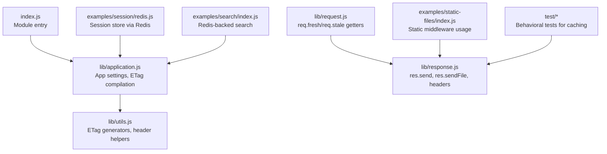
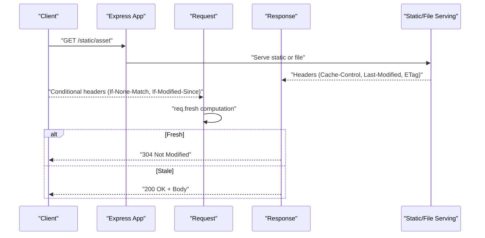
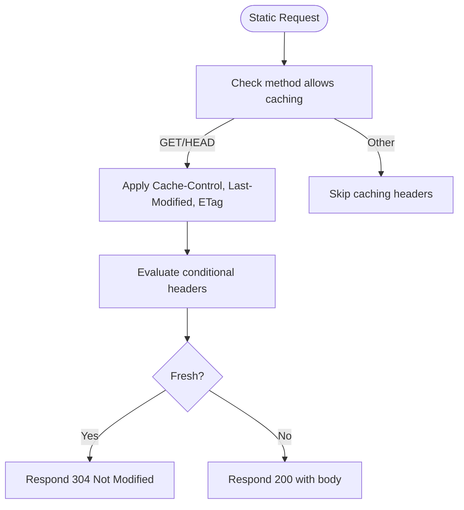
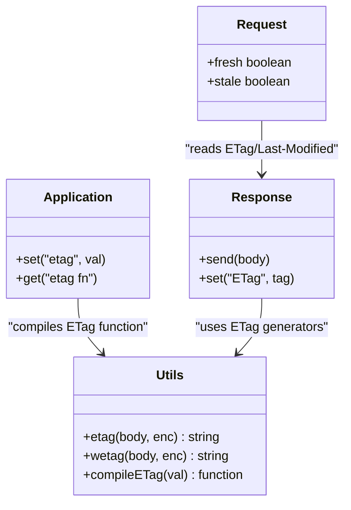
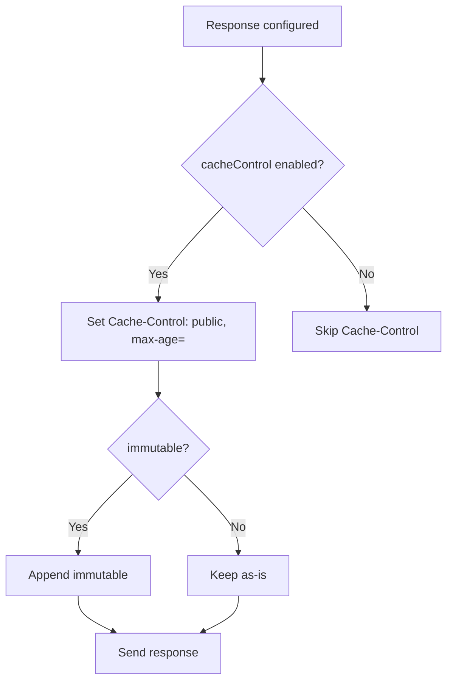
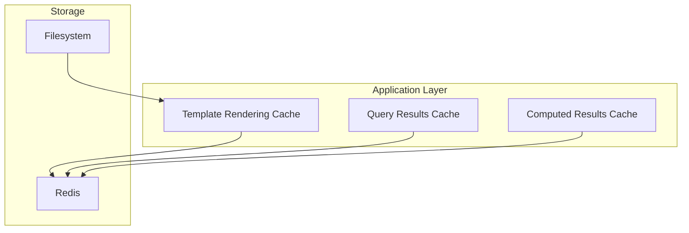
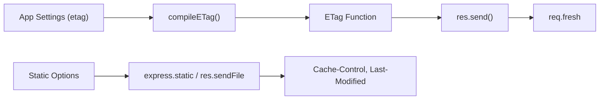

# Caching Strategies

<cite>
**Referenced Files in This Document**
- [index.js](file://index.js)
- [lib/application.js](file://lib/application.js)
- [lib/request.js](file://lib/request.js)
- [lib/response.js](file://lib/response.js)
- [lib/utils.js](file://lib/utils.js)
- [examples/static-files/index.js](file://examples/static-files/index.js)
- [examples/session/redis.js](file://examples/session/redis.js)
- [examples/search/index.js](file://examples/search/index.js)
- [test/express.static.js](file://test/express.static.js)
- [test/res.sendFile.js](file://test/res.sendFile.js)
- [test/res.send.js](file://test/res.send.js)
- [test/req.fresh.js](file://test/req.fresh.js)
- [test/req.stale.js](file://test/req.stale.js)
- [test/res.vary.js](file://test/res.vary.js)
</cite>

## Table of Contents
1. [Introduction](#introduction)
2. [Project Structure](#project-structure)
3. [Core Components](#core-components)
4. [Architecture Overview](#architecture-overview)
5. [Detailed Component Analysis](#detailed-component-analysis)
6. [Dependency Analysis](#dependency-analysis)
7. [Performance Considerations](#performance-considerations)
8. [Troubleshooting Guide](#troubleshooting-guide)
9. [Conclusion](#conclusion)
10. [Appendices](#appendices)

## Introduction
This document explains caching strategies in Express.js with a focus on static asset caching, ETag generation, and response caching mechanisms. It covers:
- ETag types (strong vs weak) and when to use each
- HTTP caching headers (Cache-Control, Expires, Last-Modified)
- Static file caching via built-in middleware and file serving helpers
- CDN integration patterns and cache invalidation
- Application-level caching for computed results, database queries, and templates
- Practical configuration, warming, debugging, storage options, and performance monitoring
- Cache bypass scenarios, conditional requests, and cache coherence in clustered environments

## Project Structure
Express exposes a minimal entry point and implements caching features through request/response helpers, utilities, and middleware. Static assets are served via dedicated middleware and file-serving helpers. Session and Redis examples demonstrate distributed storage patterns.

**Diagram sources**
- [index.js:1-12](file://index.js#L1-L12)
- [lib/application.js:90-141](file://lib/application.js#L90-L141)
- [lib/utils.js:130-152](file://lib/utils.js#L130-L152)
- [lib/request.js:469-499](file://lib/request.js#L469-L499)
- [lib/response.js:371-413](file://lib/response.js#L371-L413)
- [examples/static-files/index.js:10-38](file://examples/static-files/index.js#L10-L38)
- [examples/session/redis.js:15-25](file://examples/session/redis.js#L15-L25)
- [examples/search/index.js:18-46](file://examples/search/index.js#L18-L46)

**Section sources**
- [index.js:1-12](file://index.js#L1-L12)
- [lib/application.js:90-141](file://lib/application.js#L90-L141)
- [lib/utils.js:130-152](file://lib/utils.js#L130-L152)
- [lib/request.js:469-499](file://lib/request.js#L469-L499)
- [lib/response.js:371-413](file://lib/response.js#L371-L413)
- [examples/static-files/index.js:10-38](file://examples/static-files/index.js#L10-L38)
- [examples/session/redis.js:15-25](file://examples/session/redis.js#L15-L25)
- [examples/search/index.js:18-46](file://examples/search/index.js#L18-L46)

## Core Components
- Application settings and ETag configuration:
  - Default ETag policy is set during initialization.
  - ETag function is compiled from settings and applied to responses.
- Request freshness:
  - Computed from response headers and request headers for conditional requests.
- Response helpers:
  - Automatic ETag generation for small bodies and conditional 304 handling.
  - Static file serving with Cache-Control, Last-Modified, and immutable flags.
  - File serving with explicit cache controls and options.
- Utilities:
  - Strong and weak ETag generators backed by a hashing library.
  - Header normalization and charset handling.

Key behaviors validated by tests:
- Static middleware supports Cache-Control, Last-Modified, immutable, and maxAge options.
- res.sendFile supports cache-control, last-modified, and immutable options.
- ETag generation respects app settings and can be overridden.

**Section sources**
- [lib/application.js:90-141](file://lib/application.js#L90-L141)
- [lib/application.js:364-366](file://lib/application.js#L364-L366)
- [lib/request.js:469-499](file://lib/request.js#L469-L499)
- [lib/response.js:160-218](file://lib/response.js#L160-L218)
- [lib/response.js:371-413](file://lib/response.js#L371-L413)
- [lib/utils.js:40-51](file://lib/utils.js#L40-L51)
- [lib/utils.js:130-152](file://lib/utils.js#L130-L152)
- [test/express.static.js:418-430](file://test/express.static.js#L418-L430)
- [test/res.sendFile.js:593-621](file://test/res.sendFile.js#L593-L621)
- [test/res.sendFile.js:624-691](file://test/res.sendFile.js#L624-L691)
- [test/res.sendFile.js:694-775](file://test/res.sendFile.js#L694-L775)
- [test/res.send.js:495-541](file://test/res.send.js#L495-L541)

## Architecture Overview
Express integrates caching at three layers:
- Static asset layer: middleware and file serving helpers apply Cache-Control, Last-Modified, and immutable directives.
- Response layer: automatic ETag generation and 304 handling based on conditional request headers.
- Application layer: settings-driven ETag policy and Vary header management for cache variants.

**Diagram sources**
- [lib/response.js:371-413](file://lib/response.js#L371-L413)
- [lib/response.js:160-218](file://lib/response.js#L160-L218)
- [lib/request.js:469-499](file://lib/request.js#L469-L499)
- [test/req.fresh.js:8-21](file://test/req.fresh.js#L8-L21)
- [test/req.stale.js:8-21](file://test/req.stale.js#L8-L21)

## Detailed Component Analysis

### Static Asset Caching
- express.static options:
  - cacheControl: toggle Cache-Control emission.
  - lastModified: toggle Last-Modified emission.
  - immutable: add immutable directive to Cache-Control.
  - maxAge: set max-age with string durations and bounds.
  - redirect: control directory redirect behavior.
  - setHeaders: attach custom headers on file send.
- res.sendFile options:
  - cacheControl, lastModified, immutable, maxAge, root, headers.
- Behavior verified by tests:
  - Defaults and toggles for Cache-Control and Last-Modified.
  - Immutable flag combined with maxAge.
  - maxAge string suffixes and caps.
  - Conditional requests with ETag and Last-Modified.

**Diagram sources**
- [lib/response.js:371-413](file://lib/response.js#L371-L413)
- [test/express.static.js:418-430](file://test/express.static.js#L418-L430)
- [test/res.sendFile.js:694-775](file://test/res.sendFile.js#L694-L775)

**Section sources**
- [lib/response.js:371-413](file://lib/response.js#L371-L413)
- [test/express.static.js:418-430](file://test/express.static.js#L418-L430)
- [test/res.sendFile.js:593-621](file://test/res.sendFile.js#L593-L621)
- [test/res.sendFile.js:624-691](file://test/res.sendFile.js#L624-L691)
- [test/res.sendFile.js:694-775](file://test/res.sendFile.js#L694-L775)

### ETag Generation and Conditional Requests
- ETag policy:
  - Configurable via app setting; supports true (weak), false, "strong", "weak".
  - Compiled into a function applied to responses.
- Automatic ETag:
  - Generated for responses when appropriate and used to decide 304 Not Modified.
- Conditional request handling:
  - req.fresh considers ETag and Last-Modified; If-None-Match takes precedence over If-Modified-Since.

**Diagram sources**
- [lib/utils.js:40-51](file://lib/utils.js#L40-L51)
- [lib/utils.js:130-152](file://lib/utils.js#L130-L152)
- [lib/application.js:364-366](file://lib/application.js#L364-L366)
- [lib/response.js:160-218](file://lib/response.js#L160-L218)
- [lib/request.js:469-499](file://lib/request.js#L469-L499)

**Section sources**
- [lib/utils.js:40-51](file://lib/utils.js#L40-L51)
- [lib/utils.js:130-152](file://lib/utils.js#L130-L152)
- [lib/application.js:90-141](file://lib/application.js#L90-L141)
- [lib/application.js:364-366](file://lib/application.js#L364-L366)
- [lib/response.js:160-218](file://lib/response.js#L160-L218)
- [lib/request.js:469-499](file://lib/request.js#L469-L499)
- [test/res.send.js:495-541](file://test/res.send.js#L495-L541)
- [test/req.fresh.js:50-67](file://test/req.fresh.js#L50-L67)

### HTTP Caching Headers
- Cache-Control:
  - Controlled via static middleware and res.sendFile options.
  - Supports numeric ms, string suffixes (s, m, d), and caps.
- Last-Modified:
  - Emits Last-Modified header when enabled in static middleware or res.sendFile options.
- Vary:
  - Used to signal cache variants (e.g., Accept, Accept-Encoding).
- Tests confirm:
  - Cache-Control defaults and toggles.
  - Last-Modified presence/absence.
  - Vary header behavior.

**Diagram sources**
- [test/express.static.js:418-430](file://test/express.static.js#L418-L430)
- [test/res.sendFile.js:694-775](file://test/res.sendFile.js#L694-L775)
- [test/res.vary.js:52-90](file://test/res.vary.js#L52-L90)

**Section sources**
- [test/express.static.js:418-430](file://test/express.static.js#L418-L430)
- [test/res.sendFile.js:694-775](file://test/res.sendFile.js#L694-L775)
- [test/res.vary.js:52-90](file://test/res.vary.js#L52-L90)

### Application-Level Caching Patterns
- Template rendering cache:
  - View cache is controlled by app setting and can be toggled in production.
- Distributed caching with Redis:
  - Sessions can be backed by Redis via connect-redis.
  - Search example demonstrates Redis-backed data retrieval.
- Recommendations:
  - Cache computed results keyed by inputs.
  - Cache database query responses with composite keys (filters, pagination).
  - Cache rendered templates keyed by template + locals hash.

**Diagram sources**
- [lib/application.js:522-571](file://lib/application.js#L522-L571)
- [examples/session/redis.js:13-25](file://examples/session/redis.js#L13-L25)
- [examples/search/index.js:18-46](file://examples/search/index.js#L18-L46)

**Section sources**
- [lib/application.js:522-571](file://lib/application.js#L522-L571)
- [examples/session/redis.js:13-25](file://examples/session/redis.js#L13-L25)
- [examples/search/index.js:18-46](file://examples/search/index.js#L18-L46)

### CDN Integration and Cache Invalidation
- CDN-friendly headers:
  - Use Cache-Control with max-age and immutable for static assets.
  - Include Last-Modified for conditional revalidation.
- Invalidation strategies:
  - Cache-busting filenames or subresource integrity.
  - Cache purges via CDN APIs.
  - Cache tagging and group invalidation where supported.

[No sources needed since this section provides general guidance]

### Cache Debugging Techniques
- Inspect emitted headers:
  - Verify Cache-Control, Last-Modified, ETag, and Vary.
- Conditional request testing:
  - Use If-None-Match and If-Modified-Since to validate 304 responses.
- Logging:
  - Use middleware to log cache decisions and hit rates.

**Section sources**
- [test/req.fresh.js:8-21](file://test/req.fresh.js#L8-L21)
- [test/req.stale.js:8-21](file://test/req.stale.js#L8-L21)
- [test/res.sendFile.js:624-691](file://test/res.sendFile.js#L624-L691)

## Dependency Analysis
- ETag policy depends on application settings and is compiled into a function.
- Response.send applies ETag generation and 304 handling based on request freshness.
- Static middleware and res.sendFile rely on options to emit Cache-Control and Last-Modified.
- Tests validate behavior across options and conditional requests.

**Diagram sources**
- [lib/application.js:364-366](file://lib/application.js#L364-L366)
- [lib/utils.js:130-152](file://lib/utils.js#L130-L152)
- [lib/response.js:160-218](file://lib/response.js#L160-L218)
- [lib/request.js:469-499](file://lib/request.js#L469-L499)
- [lib/response.js:371-413](file://lib/response.js#L371-L413)

**Section sources**
- [lib/application.js:364-366](file://lib/application.js#L364-L366)
- [lib/utils.js:130-152](file://lib/utils.js#L130-L152)
- [lib/response.js:160-218](file://lib/response.js#L160-L218)
- [lib/request.js:469-499](file://lib/request.js#L469-L499)
- [lib/response.js:371-413](file://lib/response.js#L371-L413)

## Performance Considerations
- Prefer weak ETags for static assets to allow CDN caching without strict content equality.
- Use immutable with long max-age for versioned assets to minimize revalidation.
- Minimize ETag computation for large bodies; rely on filesystem Last-Modified when appropriate.
- Cache template rendering and query results to reduce CPU overhead.
- Monitor cache hit ratios and tune TTLs based on access patterns.

[No sources needed since this section provides general guidance]

## Troubleshooting Guide
- ETag not appearing:
  - Ensure ETag is enabled and response body qualifies for ETag generation.
  - Confirm manual ETag overrides are not conflicting.
- Unexpected 304:
  - Verify conditional headers and that ETag/Last-Modified match expectations.
  - Check Vary headers for variant differences.
- Static caching not applied:
  - Confirm cacheControl, lastModified, immutable, and maxAge options.
  - Validate file serving path and middleware order.

**Section sources**
- [test/res.send.js:495-541](file://test/res.send.js#L495-L541)
- [test/req.fresh.js:50-67](file://test/req.fresh.js#L50-L67)
- [test/express.static.js:418-430](file://test/express.static.js#L418-L430)
- [test/res.sendFile.js:694-775](file://test/res.sendFile.js#L694-L775)

## Conclusion
Express provides robust primitives for caching: configurable ETag policies, automatic 304 handling, and comprehensive static asset caching controls. Combined with Redis-backed application caches and CDN-friendly headers, these features enable scalable, efficient delivery of static and dynamic content. Proper configuration, validation via tests, and monitoring ensure reliable cache behavior in production.

[No sources needed since this section summarizes without analyzing specific files]

## Appendices

### Practical Configuration Examples
- Static middleware with cache options:
  - Mount static middleware with cacheControl, lastModified, immutable, and maxAge.
- ETag policy:
  - Set app ETag to "weak", "strong", or false depending on asset type and CDN strategy.
- File serving:
  - Use res.sendFile with cache-control, lastModified, immutable, and root options.

**Section sources**
- [examples/static-files/index.js:22-36](file://examples/static-files/index.js#L22-L36)
- [lib/application.js:90-141](file://lib/application.js#L90-L141)
- [lib/response.js:371-413](file://lib/response.js#L371-L413)

### Cache Warming and Monitoring
- Warming:
  - Preload high-traffic assets and templates into cache.
- Monitoring:
  - Track cache hit ratios, latency, and invalidation events.
  - Observe emitted headers and conditional request outcomes.

[No sources needed since this section provides general guidance]

### Cache Coherence in Clustered Environments
- Use shared cache (e.g., Redis) for sessions and application caches.
- Ensure consistent ETag generation across nodes.
- Avoid node-local caches for shared resources.

**Section sources**
- [examples/session/redis.js:13-25](file://examples/session/redis.js#L13-L25)
- [examples/search/index.js:18-46](file://examples/search/index.js#L18-L46)