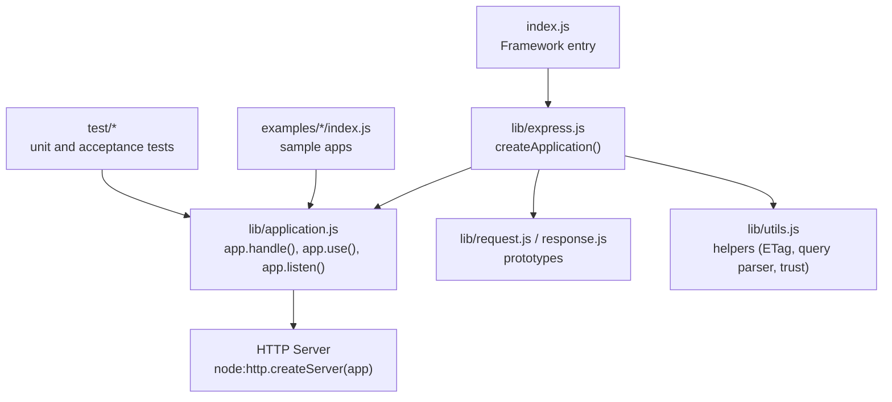
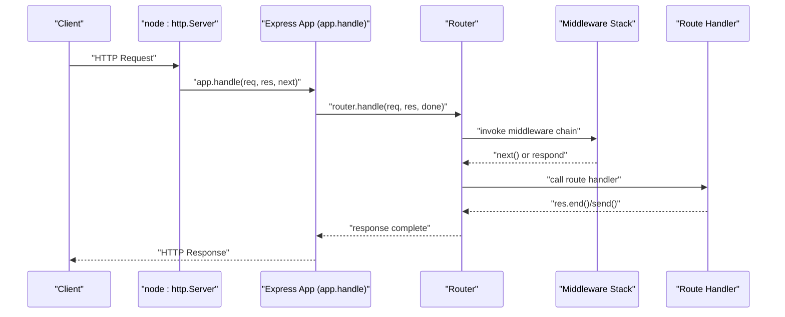
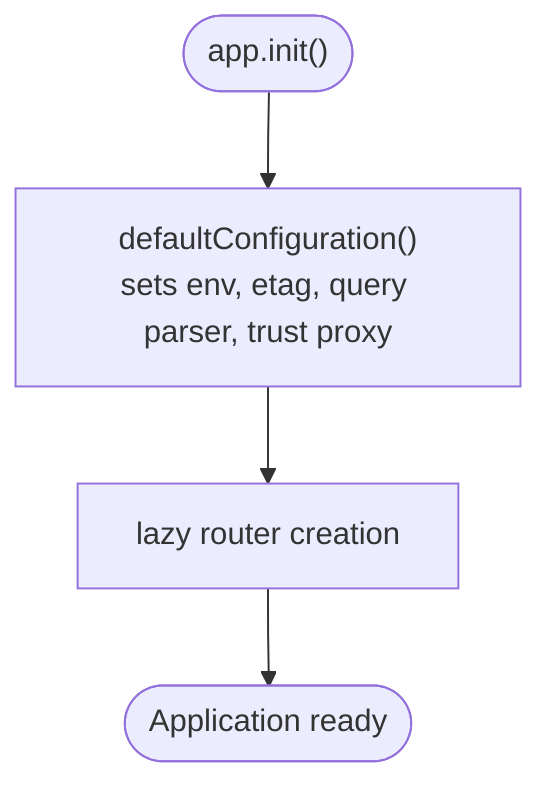
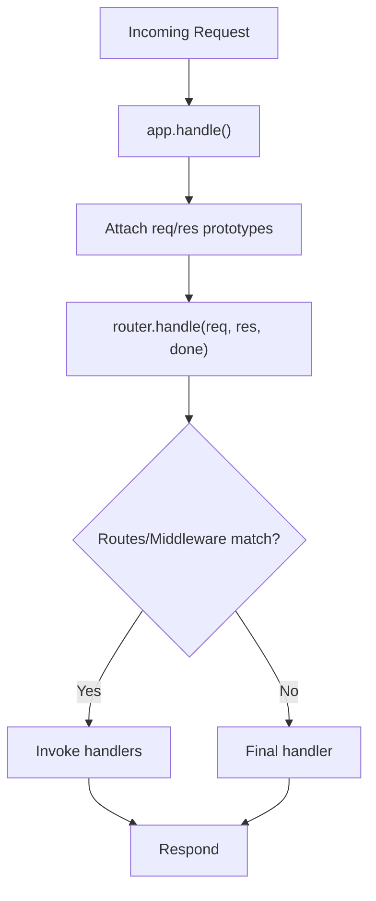
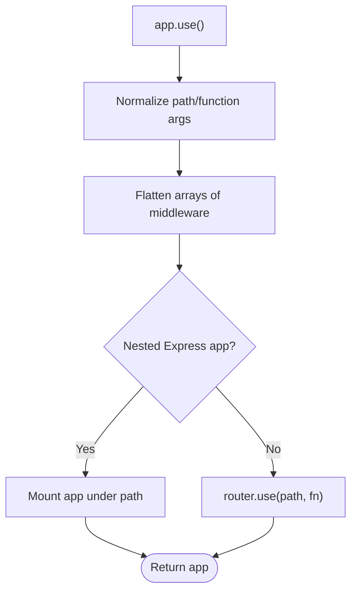
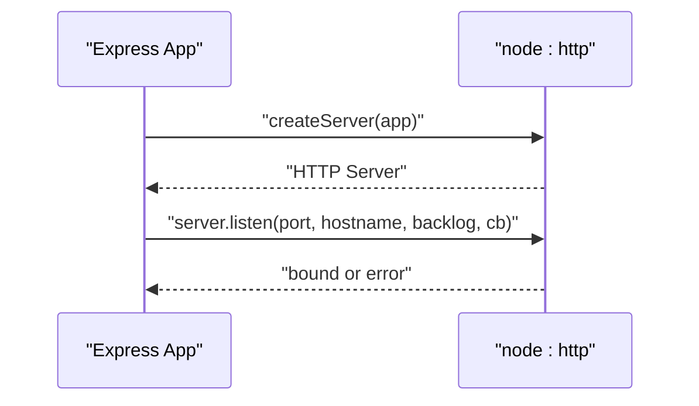
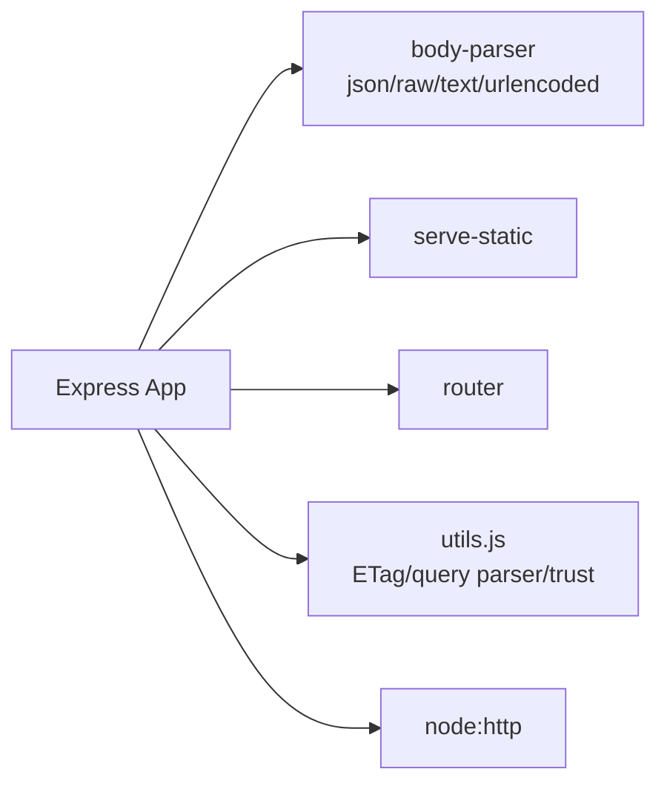

# Load Testing and Profiling

<cite>
**Referenced Files in This Document**
- [package.json](file://package.json)
- [index.js](file://index.js)
- [lib/express.js](file://lib/express.js)
- [lib/application.js](file://lib/application.js)
- [lib/utils.js](file://lib/utils.js)
- [examples/hello-world/index.js](file://examples/hello-world/index.js)
- [examples/web-service/index.js](file://examples/web-service/index.js)
- [examples/mvc/index.js](file://examples/mvc/index.js)
- [examples/session/index.js](file://examples/session/index.js)
- [examples/params/index.js](file://examples/params/index.js)
- [examples/route-middleware/index.js](file://examples/route-middleware/index.js)
- [test/app.listen.js](file://test/app.listen.js)
- [test/regression.js](file://test/regression.js)
- [test/acceptance/hello-world.js](file://test/acceptance/hello-world.js)
- [test/req.query.js](file://test/req.query.js)
- [test/express.static.js](file://test/express.static.js)
</cite>

## Table of Contents
1. [Introduction](#introduction)
2. [Project Structure](#project-structure)
3. [Core Components](#core-components)
4. [Architecture Overview](#architecture-overview)
5. [Detailed Component Analysis](#detailed-component-analysis)
6. [Dependency Analysis](#dependency-analysis)
7. [Performance Methodologies](#performance-methodologies)
8. [Profiling Techniques](#profiling-techniques)
9. [Bottleneck Identification Strategies](#bottleneck-identification-strategies)
10. [Load Testing Setup Examples](#load-testing-setup-examples)
11. [Performance Monitoring Implementation](#performance-monitoring-implementation)
12. [Scalability and Horizontal Scaling](#scalability-and-horizontal-scaling)
13. [Performance Optimization Workflows](#performance-optimization-workflows)
14. [Troubleshooting Guide](#troubleshooting-guide)
15. [Conclusion](#conclusion)

## Introduction
This document provides a comprehensive guide to load testing and performance profiling for Express.js applications. It focuses on identifying bottlenecks, measuring performance under load, and optimizing behavior across CPU-bound, I/O-bound, and memory-bound scenarios. It also covers methodologies such as synthetic testing, realistic traffic simulation, and stress testing; profiling techniques using Node.js built-ins and browser devtools; and practical load testing setups with tools commonly used in Node.js ecosystems. Guidance is grounded in the repository’s codebase to ensure alignment with Express internals and example applications.

## Project Structure
The repository is organized around:
- Core framework entry and modules under lib/
- Example applications under examples/
- Test suites under test/

Key areas relevant to performance:
- Framework initialization and request/response pipeline
- Middleware composition and routing
- Utility helpers for parsing, caching, and trust/proxy configuration
- Example apps demonstrating typical Express patterns (static serving, sessions, parameter extraction, middleware chains)

**Diagram sources**
- [index.js:1-12](file://index.js#L1-L12)
- [lib/express.js:36-56](file://lib/express.js#L36-L56)
- [lib/application.js:598-606](file://lib/application.js#L598-L606)
- [lib/application.js:152-178](file://lib/application.js#L152-L178)
- [lib/utils.js:29](file://lib/utils.js#L29)

**Section sources**
- [package.json:1-100](file://package.json#L1-L100)
- [index.js:1-12](file://index.js#L1-L12)
- [lib/express.js:1-82](file://lib/express.js#L1-L82)
- [lib/application.js:1-632](file://lib/application.js#L1-L632)
- [lib/utils.js:1-272](file://lib/utils.js#L1-L272)

## Core Components
- Application creation and initialization: The framework exposes createApplication() which sets up request/response prototypes, initializes settings, and prepares the internal router.
- Request/response pipeline: app.handle orchestrates middleware and routes, invoking final handlers on completion.
- Middleware and routing: app.use composes middleware stacks; app.route creates isolated route stacks.
- Server binding: app.listen wraps node:http.createServer and delegates to server.listen with optional callbacks and error handling.
- Utilities: Helpers for ETag generation, query parsing, and trust/proxy evaluation influence performance characteristics (e.g., query parsing cost, caching behavior).

Practical implications for load testing:
- Middleware depth and ordering directly impact latency and throughput.
- Static asset serving and caching headers affect I/O and bandwidth utilization.
- Query parsing and ETag computation contribute to CPU load under heavy request volumes.

**Section sources**
- [lib/express.js:36-56](file://lib/express.js#L36-L56)
- [lib/application.js:59-83](file://lib/application.js#L59-L83)
- [lib/application.js:152-178](file://lib/application.js#L152-L178)
- [lib/application.js:190-244](file://lib/application.js#L190-L244)
- [lib/application.js:598-606](file://lib/application.js#L598-L606)
- [lib/utils.js:130-184](file://lib/utils.js#L130-L184)

## Architecture Overview
Express applications are thin wrappers around a Node.js HTTP server. The request lifecycle:
- Incoming HTTP request enters the server.
- The application’s request handler invokes app.handle().
- Prototypes are attached to req/res.
- The internal router processes middleware and route handlers.
- Final error handlers or default handlers respond.

**Diagram sources**
- [lib/application.js:152-178](file://lib/application.js#L152-L178)
- [lib/application.js:190-244](file://lib/application.js#L190-L244)

## Detailed Component Analysis

### Application Initialization and Settings
- defaultConfiguration sets defaults for environment, ETag, query parser, trust proxy, and view-related settings.
- Settings like query parser and ETag computation are compiled into functions at runtime, influencing per-request overhead.

**Diagram sources**
- [lib/application.js:59-141](file://lib/application.js#L59-L141)

**Section sources**
- [lib/application.js:59-141](file://lib/application.js#L59-L141)

### Request/Response Pipeline
- app.handle attaches prototypes, sets X-Powered-By header conditionally, and delegates to router.handle.
- The router manages middleware and route dispatch; finalhandler is used when no middleware responds.

**Diagram sources**
- [lib/application.js:152-178](file://lib/application.js#L152-L178)

**Section sources**
- [lib/application.js:152-178](file://lib/application.js#L152-L178)

### Middleware Composition
- app.use flattens and mounts middleware stacks, supporting both functions and nested Express apps.
- Mounting nested apps preserves req/res prototypes and emits mount events.

**Diagram sources**
- [lib/application.js:190-244](file://lib/application.js#L190-L244)

**Section sources**
- [lib/application.js:190-244](file://lib/application.js#L190-L244)

### Server Binding and Lifecycle
- app.listen wraps node:http.createServer and delegates to server.listen, optionally handling errors via once-wrapped callbacks.

**Diagram sources**
- [lib/application.js:598-606](file://lib/application.js#L598-L606)

**Section sources**
- [lib/application.js:598-606](file://lib/application.js#L598-L606)

### Example Applications and Patterns
- Hello World: Minimal GET endpoint suitable for baseline latency measurements.
- Web service: API key validation middleware, JSON responses, and centralized error handling.
- MVC: Logging, static serving, sessions, method override, and controller bootstrapping.
- Session: Demonstrates session middleware overhead and persistence considerations.
- Params: Parameter coercion and error handling for malformed inputs.
- Route middleware: Authentication and authorization middleware chains.

These examples illustrate common performance hotspots:
- Middleware chain length and ordering
- Static asset delivery and caching headers
- Session storage and serialization costs
- Parameter parsing and validation

**Section sources**
- [examples/hello-world/index.js:1-16](file://examples/hello-world/index.js#L1-L16)
- [examples/web-service/index.js:1-118](file://examples/web-service/index.js#L1-L118)
- [examples/mvc/index.js:1-96](file://examples/mvc/index.js#L1-L96)
- [examples/session/index.js:1-38](file://examples/session/index.js#L1-L38)
- [examples/params/index.js:1-75](file://examples/params/index.js#L1-L75)
- [examples/route-middleware/index.js:1-91](file://examples/route-middleware/index.js#L1-L91)

## Dependency Analysis
Express depends on a set of middleware and utilities that influence performance:
- Body parsing (JSON, raw, text, urlencoded) impacts CPU and memory under payload-heavy loads.
- Static serving and caching headers affect I/O and CDN effectiveness.
- Trust/proxy and query parsing utilities shape request metadata processing costs.

**Diagram sources**
- [package.json:34-62](file://package.json#L34-L62)
- [lib/express.js:15-21](file://lib/express.js#L15-L21)
- [lib/utils.js:15-22](file://lib/utils.js#L15-L22)

**Section sources**
- [package.json:34-62](file://package.json#L34-L62)
- [lib/express.js:15-21](file://lib/express.js#L15-L21)
- [lib/utils.js:15-22](file://lib/utils.js#L15-L22)

## Performance Methodologies
- Synthetic testing: Use controlled, repeatable workloads to measure baseline performance and regressions. Suitable for CI and pre-deploy checks.
- Realistic traffic simulation: Mirror production traffic patterns (mix of endpoints, request sizes, concurrency) to uncover real-world bottlenecks.
- Stress testing: Gradually increase load to identify failure points, saturation thresholds, and recovery behavior.

Guidelines aligned with Express internals:
- Measure end-to-end latency and throughput across middleware stacks.
- Isolate static asset delivery vs. dynamic route handling.
- Validate error handling paths under load to avoid cascading failures.

[No sources needed since this section provides general guidance]

## Profiling Techniques
- Node.js built-in profiler: Use --prof and analyze samples to identify hot functions in middleware and route handlers.
- Chrome DevTools: Attach to Node.js process via --inspect and profile CPU and memory snapshots during load tests.
- Third-party profilers: Consider platforms that integrate with Node.js metrics for continuous monitoring.

Focus areas in Express:
- Middleware invocation frequency and duration
- Router dispatch overhead
- Static file serving and caching effectiveness
- Session and body parsing costs

[No sources needed since this section provides general guidance]

## Bottleneck Identification Strategies
- CPU-intensive operations:
  - Identify heavy computations in middleware or route handlers.
  - Reduce synchronous work; offload to worker threads or async APIs.
- I/O-bound processes:
  - Inspect static asset delivery and caching headers.
  - Optimize body parsing and compression settings.
- Memory-related issues:
  - Monitor request object growth and middleware retention.
  - Review session storage and large payload handling.

[No sources needed since this section provides general guidance]

## Load Testing Setup Examples
Below are practical, tool-agnostic patterns aligned with the repository’s examples and Express internals. Replace placeholders with your target host/port and adjust concurrency/ramp profiles as needed.

- Baseline endpoint testing:
  - Target the hello-world example endpoint for minimal-latency baselines.
  - Use a load generator to send GET requests to the root path and measure latency percentiles and error rates.

- API endpoint testing:
  - Target the web-service example endpoints with API key queries.
  - Include warm-up phase, ramp-up to target concurrency, and steady-state measurement.

- Static asset testing:
  - Use the MVC example’s static-serving setup to validate caching and bandwidth utilization.
  - Measure response times and cache hit ratios with varied concurrency.

- Session-heavy flows:
  - Use the session example to evaluate session middleware overhead under concurrent access.
  - Track response times and error rates as concurrency increases.

- Parameterized routes:
  - Use the params example to validate parameter parsing and error handling under load.
  - Introduce malformed parameters to exercise error paths.

- Middleware chain testing:
  - Compose middleware stacks similar to the MVC example and measure cumulative latency.
  - Reorder middleware to minimize expensive checks early in the chain.

[No sources needed since this section provides general guidance]

## Performance Monitoring Implementation
- Metrics collection:
  - Instrument request durations, error rates, throughput, and queue times.
  - Capture middleware-specific timings to isolate slow paths.
- Logging strategies:
  - Use structured logs with correlation IDs to trace requests across middleware.
  - Log slow requests and errors for postmortems.
- Alerting systems:
  - Alert on latency SLO breaches, error rate spikes, and resource exhaustion signals.

[No sources needed since this section provides general guidance]

## Scalability and Horizontal Scaling
- Vertical scaling:
  - Tune Node.js options (event loop, heap size) and optimize middleware stacks.
- Horizontal scaling:
  - Use multiple workers behind a load balancer.
  - Stateless design and shared caches/queues to reduce hot spots.
- Observability:
  - Ensure metrics and logs are aggregated across instances for accurate capacity planning.

[No sources needed since this section provides general guidance]

## Performance Optimization Workflows
- A/B testing of optimizations:
  - Compare middleware removal, caching changes, or body parser tuning using controlled experiments.
- Continuous performance monitoring:
  - Integrate load tests into CI and run nightly performance suites against staging.
- Regression detection:
  - Track latency distributions and error rates over time; flag anomalies automatically.

[No sources needed since this section provides general guidance]

## Troubleshooting Guide
Common issues and diagnostics:
- Port binding conflicts:
  - app.listen handles address-in-use errors; ensure ports are unique across instances.
- Graceful shutdown and error handling:
  - Verify that final handlers and error middleware respond predictably under load.
- Query parsing and body parsing:
  - Validate query parser settings and payload sizes to avoid excessive CPU usage.
- Static assets:
  - Confirm cache-control headers and last-modified behavior to reduce origin load.

**Section sources**
- [test/app.listen.js:14-26](file://test/app.listen.js#L14-L26)
- [test/regression.js:7-19](file://test/regression.js#L7-L19)
- [test/req.query.js:17-48](file://test/req.query.js#L17-L48)
- [test/express.static.js:418-494](file://test/express.static.js#L418-L494)

## Conclusion
Effective load testing and profiling of Express applications hinges on understanding the request pipeline, middleware composition, and the impact of settings like query parsing and caching. By combining synthetic, realistic, and stress testing with targeted profiling and robust monitoring, teams can identify bottlenecks, optimize performance, and scale reliably. The repository’s examples and core modules provide concrete anchors for building and validating performance improvements.