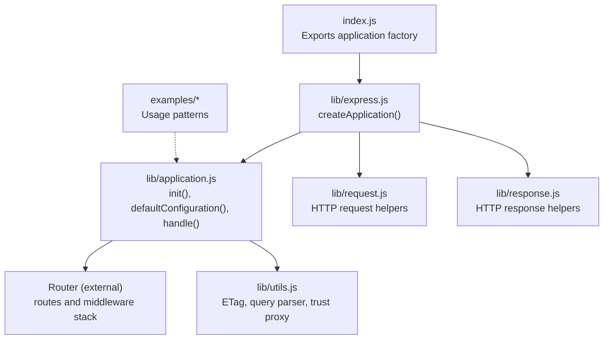
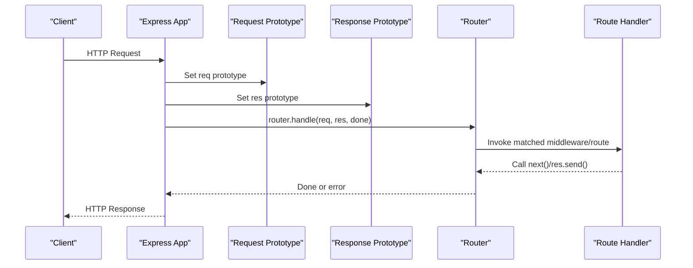
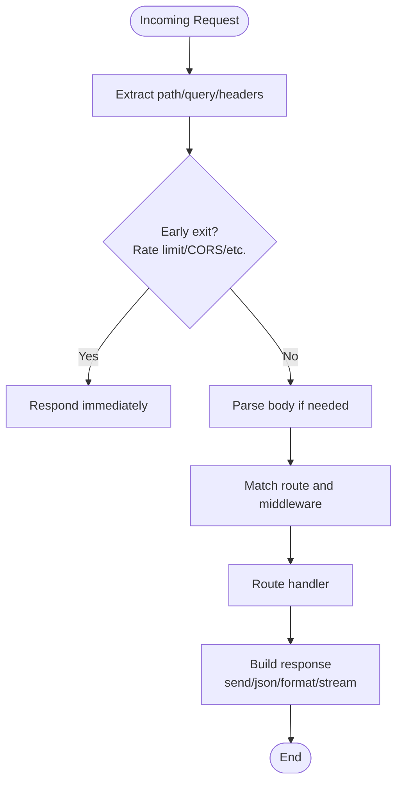
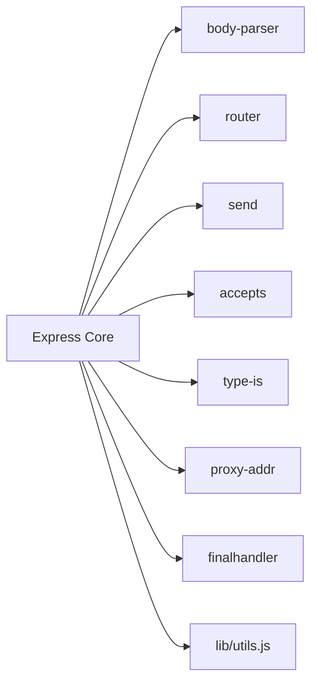

# Performance Best Practices

<cite>
**Referenced Files in This Document**
- [index.js](file://index.js)
- [package.json](file://package.json)
- [Readme.md](file://Readme.md)
- [lib/express.js](file://lib/express.js)
- [lib/application.js](file://lib/application.js)
- [lib/request.js](file://lib/request.js)
- [lib/response.js](file://lib/response.js)
- [lib/utils.js](file://lib/utils.js)
- [examples/hello-world/index.js](file://examples/hello-world/index.js)
- [examples/static-files/index.js](file://examples/static-files/index.js)
- [examples/route-middleware/index.js](file://examples/route-middleware/index.js)
- [examples/session/index.js](file://examples/session/index.js)
- [examples/params/index.js](file://examples/params/index.js)
- [examples/web-service/index.js](file://examples/web-service/index.js)
- [examples/error/index.js](file://examples/error/index.js)
- [examples/error-pages/index.js](file://examples/error-pages/index.js)
</cite>

## Table of Contents
1. [Introduction](#introduction)
2. [Project Structure](#project-structure)
3. [Core Components](#core-components)
4. [Architecture Overview](#architecture-overview)
5. [Detailed Component Analysis](#detailed-component-analysis)
6. [Dependency Analysis](#dependency-analysis)
7. [Performance Considerations](#performance-considerations)
8. [Troubleshooting Guide](#troubleshooting-guide)
9. [Conclusion](#conclusion)
10. [Appendices](#appendices)

## Introduction
This document presents Express.js performance best practices with a focus on middleware optimization, request/response processing efficiency, and overall application responsiveness. It explains optimal middleware ordering strategies, efficient parameter and header handling, memory-efficient coding patterns, Node.js-specific optimizations, and asynchronous operation best practices. Practical examples are referenced from the repository’s examples and core modules to demonstrate real-world performance improvements.

## Project Structure
Express is organized around a small core with clearly separated concerns:
- Entry point exports the application factory.
- Application initialization sets defaults and mounts a router.
- Request and response prototypes encapsulate HTTP primitives and convenience helpers.
- Utilities provide shared functionality like ETag generation, query parsing, and trust proxy compilation.
- Examples illustrate middleware usage, static serving, sessions, parameter extraction, and error handling.

**Diagram sources**
- [index.js:1-12](file://index.js#L1-L12)
- [lib/express.js:36-56](file://lib/express.js#L36-L56)
- [lib/application.js:59-83](file://lib/application.js#L59-L83)
- [lib/request.js:30](file://lib/request.js#L30)
- [lib/response.js:42](file://lib/response.js#L42)
- [lib/utils.js:29](file://lib/utils.js#L29)

**Section sources**
- [index.js:1-12](file://index.js#L1-L12)
- [lib/express.js:36-56](file://lib/express.js#L36-L56)
- [lib/application.js:59-83](file://lib/application.js#L59-L83)
- [lib/request.js:30](file://lib/request.js#L30)
- [lib/response.js:42](file://lib/response.js#L42)
- [lib/utils.js:29](file://lib/utils.js#L29)

## Core Components
- Application factory and initialization: Creates the app, mixes in EventEmitter, and sets up request/response prototypes and default settings.
- Router integration: Lazily creates a router instance and delegates request handling.
- Request helpers: Efficient getters for protocol, IP, host, hostname, subdomains, path, query, and freshness checks.
- Response helpers: Typed send, JSON, JSONP, file streaming, content negotiation, and cookie helpers with minimal allocations.
- Utilities: ETag generation, charset normalization, query parsing, and trust proxy compilation.

Key performance-relevant behaviors:
- Default settings optimized for production (e.g., enabling view cache in production).
- Lazy router creation to avoid overhead when not needed.
- Efficient header and content-type handling in response helpers.
- Query parsing controlled via settings to avoid unnecessary parsing.

**Section sources**
- [lib/express.js:36-56](file://lib/express.js#L36-L56)
- [lib/application.js:59-83](file://lib/application.js#L59-L83)
- [lib/application.js:90-141](file://lib/application.js#L90-L141)
- [lib/application.js:152-178](file://lib/application.js#L152-L178)
- [lib/request.js:230-241](file://lib/request.js#L230-L241)
- [lib/response.js:125-218](file://lib/response.js#L125-L218)
- [lib/utils.js:130-152](file://lib/utils.js#L130-L152)
- [lib/utils.js:162-184](file://lib/utils.js#L162-L184)
- [lib/utils.js:194-214](file://lib/utils.js#L194-L214)

## Architecture Overview
Express composes a minimal application object that:
- Initializes settings and default middleware.
- Sets request/response prototypes to extend HTTP primitives.
- Delegates request handling to a router.
- Applies final error handling when no route matches.

**Diagram sources**
- [lib/application.js:152-178](file://lib/application.js#L152-L178)
- [lib/express.js:45-52](file://lib/express.js#L45-L52)
- [lib/request.js:30](file://lib/request.js#L30)
- [lib/response.js:42](file://lib/response.js#L42)

## Detailed Component Analysis

### Middleware Ordering Strategies
Optimal middleware ordering maximizes throughput and minimizes allocations:
- Place fast-fail filters early (e.g., rate limiting, CORS, compression) to short-circuit slow paths.
- Apply body parsers after path/parameter extraction to avoid parsing bodies for static routes.
- Use static file serving before dynamic routes to bypass expensive JS logic.
- Keep error handlers at the end to prevent unnecessary work for successful requests.

Practical references:
- Static serving example demonstrates efficient file delivery.
- Route middleware example shows layered middleware composition.
- Session example illustrates cost of session reads/writes and caching strategies.

**Section sources**
- [examples/static-files/index.js](file://examples/static-files/index.js)
- [examples/route-middleware/index.js](file://examples/route-middleware/index.js)
- [examples/session/index.js](file://examples/session/index.js)

### Request/Response Processing Optimization
Efficient parameter handling and header manipulation:
- Use request getters for protocol, IP, host, and freshness checks to avoid repeated computations.
- Leverage response.send with typed inputs to minimize conversions and ETag generation costs.
- Use content negotiation (res.format) to serve appropriate formats without manual checks.
- Stream files with res.sendFile for large assets to reduce memory pressure.

**Diagram sources**
- [lib/request.js:297-315](file://lib/request.js#L297-L315)
- [lib/request.js:340-366](file://lib/request.js#L340-L366)
- [lib/response.js:125-218](file://lib/response.js#L125-L218)
- [lib/response.js:569-594](file://lib/response.js#L569-L594)
- [lib/response.js:371-413](file://lib/response.js#L371-L413)

**Section sources**
- [lib/request.js:230-241](file://lib/request.js#L230-L241)
- [lib/request.js:297-315](file://lib/request.js#L297-L315)
- [lib/request.js:340-366](file://lib/request.js#L340-L366)
- [lib/response.js:125-218](file://lib/response.js#L125-L218)
- [lib/response.js:569-594](file://lib/response.js#L569-L594)
- [lib/response.js:371-413](file://lib/response.js#L371-L413)

### Memory-Efficient Coding Patterns
Avoid unnecessary object creation and leaks:
- Reuse buffers and strings; avoid converting types unnecessarily in hot paths.
- Prefer HEAD responses and 304 Not Modified to skip payloads.
- Use streaming responses for large files to avoid buffering entire content in memory.
- Minimize closures capturing large scopes inside middleware loops.

References:
- Response send logic computes length and optionally generates ETag to avoid extra allocations.
- Static file serving streams content via send.

**Section sources**
- [lib/response.js:160-200](file://lib/response.js#L160-L200)
- [lib/response.js:371-413](file://lib/response.js#L371-L413)

### Node.js-Specific Optimizations and Asynchronous Best Practices
- Event loop awareness: Keep middleware synchronous where possible; defer heavy work to non-blocking operations.
- Use once() wrappers for server listeners to avoid duplicate callbacks.
- Avoid synchronous filesystem operations in request handlers; leverage async I/O and caching.
- Tune Node.js runtime and cluster settings externally to Express (not part of Express code).

References:
- Application listen method wraps server.listen with once() error handling.

**Section sources**
- [lib/application.js:598-606](file://lib/application.js#L598-L606)

### Benchmarking and Measurement Techniques
Recommended approaches using built-in and external tools:
- Built-in: Use Node.js --prof and --inspect flags to profile CPU and heap; analyze hot paths in middleware and response builders.
- External: Use Artillery or k6 for load testing; measure p50/p95 latency and throughput across middleware configurations.
- Repository scripts: Run tests and coverage to detect regressions in performance-sensitive areas.

References:
- Package scripts for linting, testing, and coverage collection.

**Section sources**
- [package.json:91-98](file://package.json#L91-L98)

## Dependency Analysis
Express depends on a curated set of modules for HTTP, parsing, caching, and transport:
- body-parser: JSON/raw/text/urlencoded parsing.
- router: Routing and middleware stack management.
- send: Streaming static files with caching and range support.
- accepts/type-is/proxy-addr: Content negotiation, type checking, and trusted proxy resolution.
- finalhandler: Default error handler for unhandled requests.

**Diagram sources**
- [lib/express.js:15-21](file://lib/express.js#L15-L21)
- [lib/application.js:16](file://lib/application.js#L16)
- [lib/response.js:31](file://lib/response.js#L31)
- [lib/request.js:16-23](file://lib/request.js#L16-L23)
- [lib/utils.js:15-22](file://lib/utils.js#L15-L22)

**Section sources**
- [lib/express.js:15-21](file://lib/express.js#L15-L21)
- [lib/application.js:16](file://lib/application.js#L16)
- [lib/response.js:31](file://lib/response.js#L31)
- [lib/request.js:16-23](file://lib/request.js#L16-L23)
- [lib/utils.js:15-22](file://lib/utils.js#L15-L22)

## Performance Considerations
- Middleware ordering: Place static, compression, and CORS before dynamic routes; put body parsers after path extraction.
- Query parsing: Choose simple vs extended parser based on workload; disable parsing when not needed.
- ETag and caching: Enable ETag generation judiciously; leverage 304 responses to reduce payload sizes.
- Streaming: Use res.sendFile for large assets; avoid buffering entire files in memory.
- Error handling: Keep error handlers at the end; ensure they short-circuit early to avoid wasted work.
- Production defaults: Enable view cache and x-powered-by toggles appropriately for production.

[No sources needed since this section provides general guidance]

## Troubleshooting Guide
Common performance pitfalls and remedies:
- Over-parsing queries: Disable or tune query parser to avoid unnecessary parsing.
- Missing ETag: Enable ETag generation to improve caching effectiveness.
- Blocking operations: Move blocking tasks off the event loop; use async I/O and caches.
- Static assets: Serve via static middleware or res.sendFile to avoid custom logic overhead.

References:
- Query parser compilation and application defaults.
- ETag compilation and response send logic.

**Section sources**
- [lib/utils.js:162-184](file://lib/utils.js#L162-L184)
- [lib/application.js:90-141](file://lib/application.js#L90-L141)
- [lib/utils.js:130-152](file://lib/utils.js#L130-L152)
- [lib/response.js:160-200](file://lib/response.js#L160-L200)

## Conclusion
By aligning middleware ordering with request characteristics, leveraging efficient request/response helpers, and adopting memory-conscious patterns, Express applications can achieve significant performance gains. Combine these practices with targeted profiling and load testing to validate improvements and maintain responsiveness at scale.

[No sources needed since this section summarizes without analyzing specific files]

## Appendices
- Getting started and examples: Explore examples for practical middleware usage, static serving, sessions, and error handling.

**Section sources**
- [Readme.md:127-146](file://Readme.md#L127-L146)
- [examples/hello-world/index.js](file://examples/hello-world/index.js)
- [examples/static-files/index.js](file://examples/static-files/index.js)
- [examples/route-middleware/index.js](file://examples/route-middleware/index.js)
- [examples/session/index.js](file://examples/session/index.js)
- [examples/params/index.js](file://examples/params/index.js)
- [examples/web-service/index.js](file://examples/web-service/index.js)
- [examples/error/index.js](file://examples/error/index.js)
- [examples/error-pages/index.js](file://examples/error-pages/index.js)