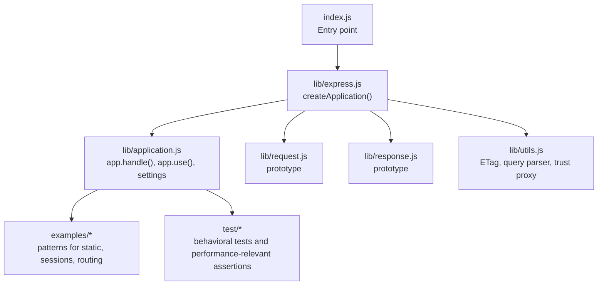
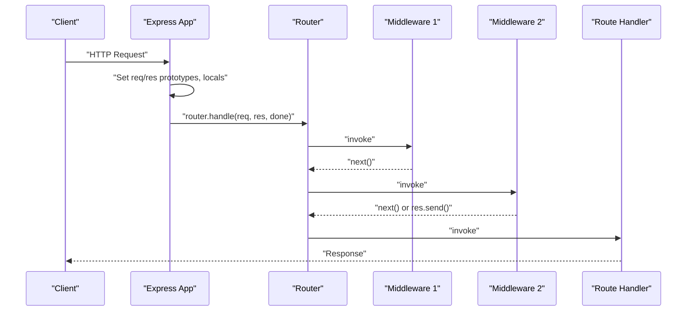
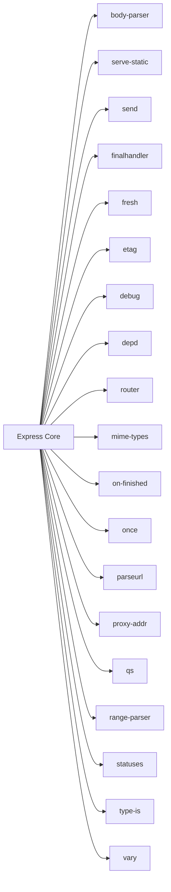

# Performance Optimization

<cite>
**Referenced Files in This Document**
- [index.js](file://index.js)
- [package.json](file://package.json)
- [lib/express.js](file://lib/express.js)
- [lib/application.js](file://lib/application.js)
- [lib/utils.js](file://lib/utils.js)
- [examples/static-files/index.js](file://examples/static-files/index.js)
- [examples/web-service/index.js](file://examples/web-service/index.js)
- [examples/mvc/index.js](file://examples/mvc/index.js)
- [examples/session/index.js](file://examples/session/index.js)
- [examples/route-middleware/index.js](file://examples/route-middleware/index.js)
- [test/express.static.js](file://test/express.static.js)
- [test/res.sendFile.js](file://test/res.sendFile.js)
- [test/utils.js](file://test/utils.js)
- [test/app.use.js](file://test/app.use.js)
- [test/app.listen.js](file://test/app.listen.js)
</cite>

## Table of Contents
1. [Introduction](#introduction)
2. [Project Structure](#project-structure)
3. [Core Components](#core-components)
4. [Architecture Overview](#architecture-overview)
5. [Detailed Component Analysis](#detailed-component-analysis)
6. [Dependency Analysis](#dependency-analysis)
7. [Performance Considerations](#performance-considerations)
8. [Troubleshooting Guide](#troubleshooting-guide)
9. [Conclusion](#conclusion)
10. [Appendices](#appendices)

## Introduction
This document provides a comprehensive guide to optimizing Express.js applications for speed, memory efficiency, and scalability. It synthesizes performance best practices from the Express core implementation and official examples, focusing on middleware ordering, request processing optimization, response compression, caching strategies for static assets and computed results, memory management, load testing, monitoring, bottleneck identification, and deployment optimization for high-traffic scenarios.

## Project Structure
The repository is organized around the Express core (application bootstrap, middleware integration, and HTTP handling), official examples demonstrating real-world patterns, and a test suite that validates behavior and performance-relevant features such as static asset serving, caching headers, and ETag generation.

**Diagram sources**
- [index.js:1-12](file://index.js#L1-L12)
- [lib/express.js:36-56](file://lib/express.js#L36-L56)
- [lib/application.js:152-178](file://lib/application.js#L152-L178)
- [lib/utils.js:29](file://lib/utils.js#L29)

**Section sources**
- [index.js:1-12](file://index.js#L1-L12)
- [lib/express.js:15-21](file://lib/express.js#L15-L21)
- [lib/application.js:59-83](file://lib/application.js#L59-L83)
- [lib/utils.js:15-22](file://lib/utils.js#L15-L22)

## Core Components
- Application initialization and default configuration: sets environment, default settings, and view engine behavior.
- Request/response prototype wiring: attaches request/response prototypes and local state.
- Middleware pipeline: app.use integrates middleware and mounted apps into a unified router.
- Static asset serving: built-in static middleware supports range requests, cache control, and redirects.
- ETag and query parsing: configurable ETag generation and query parser compilation.

Key performance-relevant behaviors:
- Default settings enable weak ETags and simple query parsing in development, with production enabling view caching.
- Static serving supports Cache-Control, Last-Modified, and Range requests.
- ETag generation supports weak and strong variants.

**Section sources**
- [lib/application.js:90-141](file://lib/application.js#L90-L141)
- [lib/application.js:152-178](file://lib/application.js#L152-L178)
- [lib/application.js:190-244](file://lib/application.js#L190-L244)
- [lib/utils.js:130-152](file://lib/utils.js#L130-L152)
- [lib/utils.js:162-184](file://lib/utils.js#L162-L184)
- [lib/utils.js:194-214](file://lib/utils.js#L194-L214)

## Architecture Overview
Express composes an application from a minimal function that delegates to a router after setting up request/response prototypes and defaults. Middleware is registered via app.use and executed in the order registered. Static assets are served efficiently with optional caching headers and range support.

**Diagram sources**
- [lib/application.js:152-178](file://lib/application.js#L152-L178)
- [lib/application.js:190-244](file://lib/application.js#L190-L244)
- [test/app.use.js:125-200](file://test/app.use.js#L125-L200)

**Section sources**
- [lib/application.js:152-178](file://lib/application.js#L152-L178)
- [lib/application.js:190-244](file://lib/application.js#L190-L244)
- [test/app.use.js:125-200](file://test/app.use.js#L125-L200)

## Detailed Component Analysis

### Middleware Ordering and Pipeline
- Middleware registration flattens arrays and invokes them in order. Proper ordering is essential: logging first, then parsing, then authentication, then business logic, and finally error handlers.
- Mounting sub-applications preserves prototype chaining and emits mount events for lifecycle hooks.

Practical guidance:
- Place fast-fail middleware (auth, rate-limit) early to avoid unnecessary downstream work.
- Keep body parsers and parsers aligned with expected content types to minimize overhead.

**Section sources**
- [lib/application.js:190-244](file://lib/application.js#L190-L244)
- [test/app.use.js:125-200](file://test/app.use.js#L125-L200)
- [test/app.use.js:21-123](file://test/app.use.js#L21-L123)

### Static Assets Serving and Caching
- Static middleware supports Cache-Control, Last-Modified, immutable assets, and redirects for directories.
- Range requests are honored when configured, enabling efficient partial content delivery.

Best practices:
- Serve static assets with long-lived Cache-Control headers and immutable directives where appropriate.
- Use ETags and Last-Modified to leverage browser and CDN caching.
- Prefer precompressed assets (.gz, .br) behind a reverse proxy or CDN.

**Section sources**
- [examples/static-files/index.js:22](file://examples/static-files/index.js#L22)
- [test/express.static.js:188-203](file://test/express.static.js#L188-L203)
- [test/express.static.js:205-230](file://test/express.static.js#L205-L230)
- [test/express.static.js:418-430](file://test/express.static.js#L418-L430)
- [test/express.static.js:432-450](file://test/express.static.js#L432-L450)
- [test/express.static.js:452-466](file://test/express.static.js#L452-L466)

### ETag Generation and Conditional Requests
- ETag generation supports weak and strong variants. Weak ETags are suitable for cached HTML; strong ETags are recommended for binary assets.
- The ETag compiler maps configuration to generator functions.

Optimization tips:
- Use weak ETags for frequently changing HTML to reduce revalidation costs.
- Use strong ETags for immutable assets to maximize cache hits.

**Section sources**
- [lib/utils.js:130-152](file://lib/utils.js#L130-L152)
- [test/utils.js:92-115](file://test/utils.js#L92-L115)

### Query Parsing and Body Parsing
- Query parser compilation supports simple and extended modes. Extended parsing enables prototype pollution controls and richer structures.
- Body parsers are exposed via application factory and should be configured according to expected payload sizes and formats.

Guidance:
- Prefer simple query parsing for low-latency endpoints; use extended only when necessary.
- Limit body sizes and choose parsers that match payload types to avoid unnecessary CPU and memory usage.

**Section sources**
- [lib/utils.js:162-184](file://lib/utils.js#L162-L184)
- [lib/express.js:77-81](file://lib/express.js#L77-L81)

### Sessions and Memory Management
- Session middleware can be configured to avoid saving unchanged sessions and to create sessions only when data is stored.
- Proper session configuration reduces memory churn and improves throughput.

Patterns:
- Configure resave and saveUninitialized to minimize writes and allocations.
- Use scalable session stores (e.g., Redis) for distributed deployments.

**Section sources**
- [examples/mvc/index.js:40-44](file://examples/mvc/index.js#L40-L44)
- [examples/session/index.js:16-20](file://examples/session/index.js#L16-L20)

### Routing and Middleware Composition
- Route composition allows middleware stacks per path, enabling targeted middleware for specific routes.
- Authentication and authorization middleware can be composed to enforce policies close to route handlers.

**Section sources**
- [examples/route-middleware/index.js:25-58](file://examples/route-middleware/index.js#L25-L58)

### Web Service API Patterns
- API key validation and error handling demonstrate early exits and structured error responses.
- Centralized error handlers and 404 handling improve reliability and reduce redundant logic.

**Section sources**
- [examples/web-service/index.js:30-42](file://examples/web-service/index.js#L30-L42)
- [examples/web-service/index.js:98-111](file://examples/web-service/index.js#L98-L111)

## Dependency Analysis
Express depends on a curated set of modules for HTTP, parsing, static serving, and caching. Understanding these dependencies helps optimize performance choices (e.g., choosing appropriate parsers, static serving options).

**Diagram sources**
- [package.json:34-62](file://package.json#L34-L62)

**Section sources**
- [package.json:34-62](file://package.json#L34-L62)

## Performance Considerations
- Middleware ordering: place logging, parsing, and auth early; keep route handlers lean and delegate heavy work to asynchronous operations.
- Static assets: configure long-lived Cache-Control headers, immutable directives, and ETags; support range requests for large files.
- ETags: use weak for HTML, strong for binaries; tune ETag generation cost vs. cache hit benefits.
- Query/body parsing: select appropriate parser modes and limits; avoid expensive transformations for simple endpoints.
- Sessions: disable unnecessary saves and initializations; use scalable stores for horizontal scaling.
- Compression: enable compression at the reverse proxy or CDN level for optimal CPU utilization.
- Monitoring: instrument request durations, error rates, and resource usage; correlate with middleware bottlenecks.
- Load testing: simulate realistic traffic patterns, including concurrent requests, varied payloads, and failure modes.

[No sources needed since this section provides general guidance]

## Troubleshooting Guide
Common issues and remedies:
- Middleware not invoked: verify path prefixes and array flattening behavior; ensure correct arity for error-handling middleware.
- Port binding conflicts: handle server.listen errors and validate port availability.
- Static asset caching anomalies: confirm Cache-Control and immutable flags; check Last-Modified and ETag headers.
- ETag mismatches: align ETag configuration with asset immutability and content changes.

Validation references:
- Middleware invocation and path stripping behavior.
- Server.listen wrapping and error propagation.
- Static serving headers and redirects.
- ETag generation and compilation.

**Section sources**
- [test/app.use.js:258-363](file://test/app.use.js#L258-L363)
- [test/app.listen.js:6-37](file://test/app.listen.js#L6-L37)
- [test/express.static.js:188-203](file://test/express.static.js#L188-L203)
- [test/utils.js:92-115](file://test/utils.js#L92-L115)

## Conclusion
Optimizing Express applications hinges on thoughtful middleware ordering, efficient static asset serving with proper caching headers, judicious ETag selection, and careful configuration of parsing and session behavior. Combined with robust monitoring, load testing, and deployment strategies, these practices deliver improved speed, reduced memory footprint, and enhanced scalability for high-traffic environments.

[No sources needed since this section summarizes without analyzing specific files]

## Appendices
- Practical examples to study:
  - Static files serving with multiple directories and prefixing.
  - MVC-style application with sessions, static assets, and middleware.
  - Web service with API key validation and centralized error handling.
  - Route middleware demonstrating composed auth and authorization.

**Section sources**
- [examples/static-files/index.js:22-36](file://examples/static-files/index.js#L22-L36)
- [examples/mvc/index.js:36-73](file://examples/mvc/index.js#L36-L73)
- [examples/web-service/index.js:30-42](file://examples/web-service/index.js#L30-L42)
- [examples/route-middleware/index.js:65-68](file://examples/route-middleware/index.js#L65-L68)