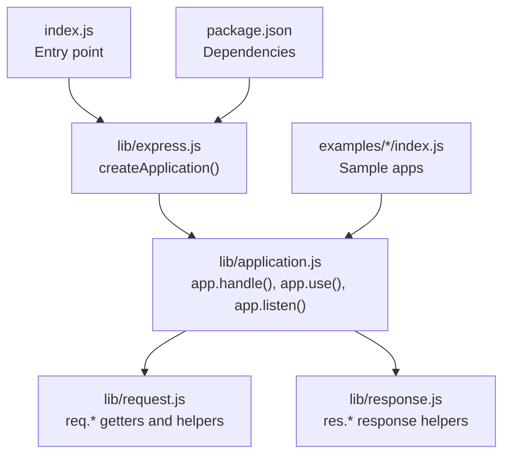
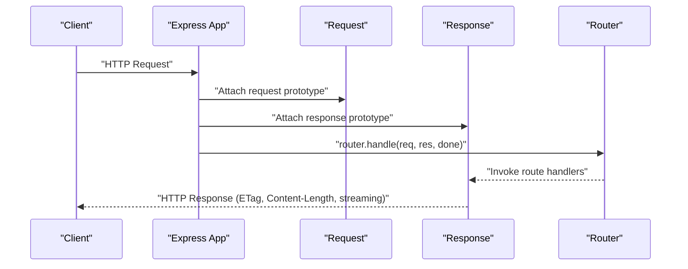
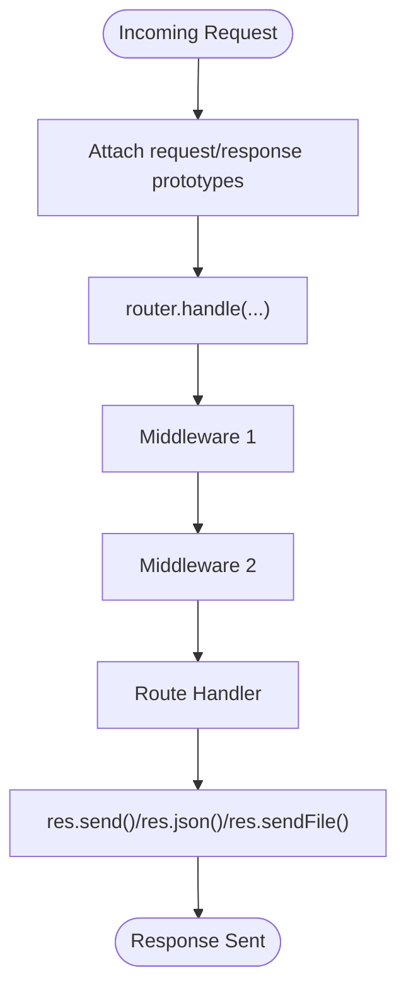
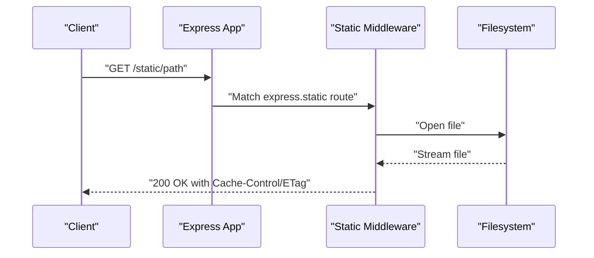
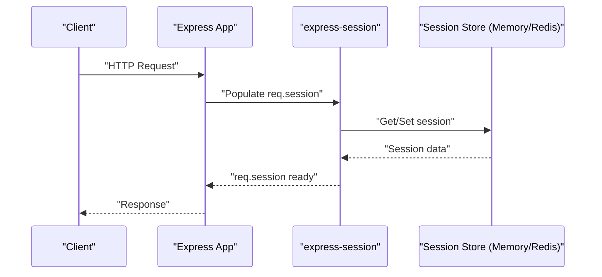
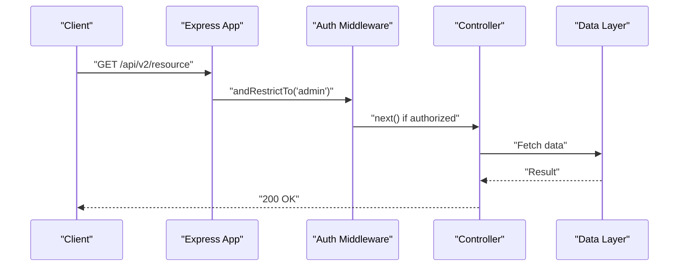
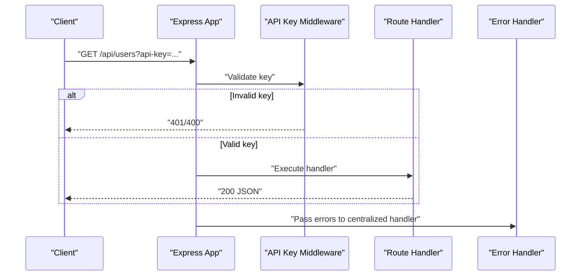
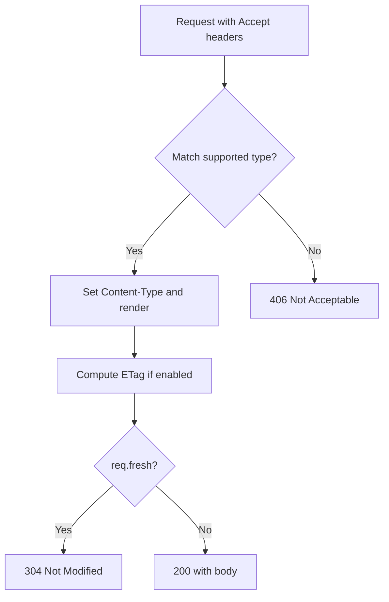
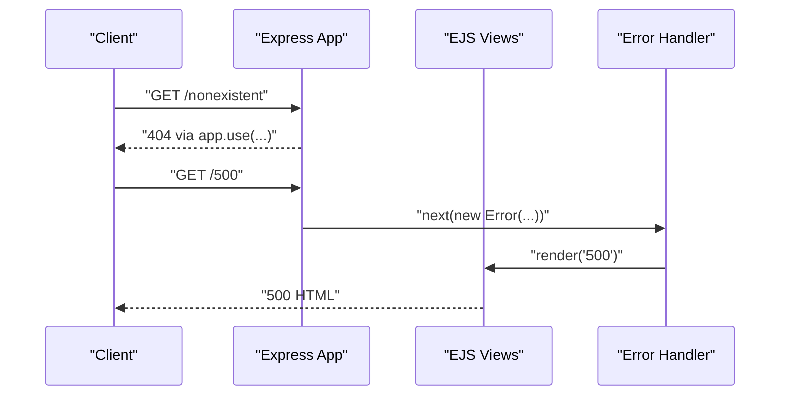
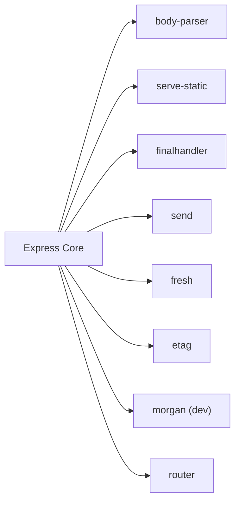

# Performance and Optimization

<cite>
**Referenced Files in This Document**
- [index.js](file://index.js)
- [package.json](file://package.json)
- [express.js](file://lib/express.js)
- [application.js](file://lib/application.js)
- [request.js](file://lib/request.js)
- [response.js](file://lib/response.js)
- [hello-world/index.js](file://examples/hello-world/index.js)
- [static-files/index.js](file://examples/static-files/index.js)
- [session/index.js](file://examples/session/index.js)
- [session/redis.js](file://examples/session/redis.js)
- [multi-router/index.js](file://examples/multi-router/index.js)
- [route-middleware/index.js](file://examples/route-middleware/index.js)
- [web-service/index.js](file://examples/web-service/index.js)
- [content-negotiation/index.js](file://examples/content-negotiation/index.js)
- [error-pages/index.js](file://examples/error-pages/index.js)
</cite>

## Table of Contents
1. [Introduction](#introduction)
2. [Project Structure](#project-structure)
3. [Core Components](#core-components)
4. [Architecture Overview](#architecture-overview)
5. [Detailed Component Analysis](#detailed-component-analysis)
6. [Dependency Analysis](#dependency-analysis)
7. [Performance Considerations](#performance-considerations)
8. [Troubleshooting Guide](#troubleshooting-guide)
9. [Conclusion](#conclusion)
10. [Appendices](#appendices)

## Introduction
This document provides a comprehensive guide to performance optimization for Express.js applications. It synthesizes patterns and configurations visible in the repository’s core modules and examples to deliver practical advice on performance best practices, memory management, resource optimization, caching strategies, load balancing considerations, scaling patterns, production deployment optimization, monitoring integration, and security performance hardening. The guidance is grounded in the Express internals and example applications included in this repository.

## Project Structure
The repository is organized around:
- Core runtime and middleware abstractions in lib/
- Example applications demonstrating common patterns in examples/
- Package metadata and dependencies in package.json

**Diagram sources**
- [index.js:1-12](file://index.js#L1-L12)
- [express.js:36-56](file://lib/express.js#L36-L56)
- [application.js:152-178](file://lib/application.js#L152-L178)
- [request.js:30](file://lib/request.js#L30)
- [response.js:42](file://lib/response.js#L42)
- [package.json:34-62](file://package.json#L34-L62)

**Section sources**
- [index.js:1-12](file://index.js#L1-L12)
- [express.js:15-21](file://lib/express.js#L15-L21)
- [application.js:59-83](file://lib/application.js#L59-L83)
- [package.json:34-62](file://package.json#L34-L62)

## Core Components
Key performance-relevant components and their roles:
- Application bootstrap and middleware pipeline: createApplication, app.handle, app.use, app.listen
- Request helpers: protocol detection, IP resolution, freshness checks, content negotiation
- Response helpers: ETag generation, Content-Length computation, HEAD short-circuit, streaming/file delivery
- Static asset serving and caching-friendly headers
- Session storage strategies (memory vs Redis-backed)

Practical implications:
- Middleware ordering and minimal overhead in the pipeline
- Efficient ETag and freshness handling to leverage browser caches
- Streaming and range-aware responses for large assets
- Proper static asset caching and compression strategies
- Offloading session storage to external stores for horizontal scaling

**Section sources**
- [express.js:36-56](file://lib/express.js#L36-L56)
- [application.js:59-83](file://lib/application.js#L59-L83)
- [application.js:152-178](file://lib/application.js#L152-L178)
- [application.js:598-606](file://lib/application.js#L598-L606)
- [request.js:297-315](file://lib/request.js#L297-L315)
- [request.js:340-366](file://lib/request.js#L340-L366)
- [request.js:469-486](file://lib/request.js#L469-L486)
- [response.js:125-218](file://lib/response.js#L125-L218)
- [response.js:371-413](file://lib/response.js#L371-L413)
- [response.js:569-594](file://lib/response.js#L569-L594)

## Architecture Overview
Express builds a minimal HTTP server and delegates request handling to a composed router. The request and response prototypes are attached to each request, enabling fast property access and helper methods. Middleware is registered via app.use and executed in order. Responses leverage streaming and caching primitives to optimize throughput and latency.

**Diagram sources**
- [application.js:152-178](file://lib/application.js#L152-L178)
- [express.js:45-52](file://lib/express.js#L45-L52)
- [request.js:30](file://lib/request.js#L30)
- [response.js:42](file://lib/response.js#L42)

## Detailed Component Analysis

### Middleware Pipeline and Performance
- app.use composes middleware and mounted apps, preserving minimal overhead.
- app.handle sets up request/response prototypes and delegates to router.handle.
- Order matters: heavy middleware early in the chain increases latency for all routes.

**Diagram sources**
- [application.js:152-178](file://lib/application.js#L152-L178)
- [application.js:190-244](file://lib/application.js#L190-L244)

**Section sources**
- [application.js:190-244](file://lib/application.js#L190-L244)
- [application.js:152-178](file://lib/application.js#L152-L178)

### Static Assets and Caching
- Static file serving is demonstrated via express.static and mounted routes.
- Proper caching headers and ETag generation reduce bandwidth and CPU usage.
- Serving multiple directories and prefixing improves organization and cacheability.

**Diagram sources**
- [static-files/index.js:22-36](file://examples/static-files/index.js#L22-L36)
- [response.js:371-413](file://lib/response.js#L371-L413)

**Section sources**
- [static-files/index.js:22-36](file://examples/static-files/index.js#L22-L36)
- [response.js:371-413](file://lib/response.js#L371-L413)

### Sessions and Scalability
- Memory-backed sessions are suitable for development but not for production scale.
- Using Redis-backed sessions enables horizontal scaling and shared state.

**Diagram sources**
- [session/index.js:16-20](file://examples/session/index.js#L16-L20)
- [session/redis.js:20-25](file://examples/session/redis.js#L20-L25)

**Section sources**
- [session/index.js:16-20](file://examples/session/index.js#L16-L20)
- [session/redis.js:20-25](file://examples/session/redis.js#L20-L25)

### Routing and Middleware Composition
- Mounting routers and controllers enables modular, scalable routing.
- Middleware can enforce authentication, authorization, and preconditions efficiently.

**Diagram sources**
- [multi-router/index.js:7-8](file://examples/multi-router/index.js#L7-L8)
- [route-middleware/index.js:65-68](file://examples/route-middleware/index.js#L65-L68)
- [route-middleware/index.js:50-58](file://examples/route-middleware/index.js#L50-L58)

**Section sources**
- [multi-router/index.js:7-8](file://examples/multi-router/index.js#L7-L8)
- [route-middleware/index.js:65-68](file://examples/route-middleware/index.js#L65-L68)
- [route-middleware/index.js:50-58](file://examples/route-middleware/index.js#L50-L58)

### API Keys and Error Handling
- Centralized middleware validates API keys and short-circuits invalid requests.
- Dedicated error-handling middleware ensures consistent error responses.

**Diagram sources**
- [web-service/index.js:30-42](file://examples/web-service/index.js#L30-L42)
- [web-service/index.js:75-82](file://examples/web-service/index.js#L75-L82)
- [web-service/index.js:98-103](file://examples/web-service/index.js#L98-L103)

**Section sources**
- [web-service/index.js:30-42](file://examples/web-service/index.js#L30-L42)
- [web-service/index.js:75-82](file://examples/web-service/index.js#L75-L82)
- [web-service/index.js:98-103](file://examples/web-service/index.js#L98-L103)

### Content Negotiation and Freshness
- Content negotiation selects appropriate response formats.
- Freshness checks (If-None-Match/If-Modified-Since) reduce payload sizes.

**Diagram sources**
- [content-negotiation/index.js:9-27](file://examples/content-negotiation/index.js#L9-L27)
- [response.js:569-594](file://lib/response.js#L569-L594)
- [request.js:469-486](file://lib/request.js#L469-L486)

**Section sources**
- [content-negotiation/index.js:9-27](file://examples/content-negotiation/index.js#L9-L27)
- [request.js:469-486](file://lib/request.js#L469-L486)

### Error Pages and Production Behavior
- Configurable verbose errors and view rendering for diagnostics.
- Centralized 404 and error handlers improve consistency and reduce branching.

**Diagram sources**
- [error-pages/index.js:63-77](file://examples/error-pages/index.js#L63-L77)
- [error-pages/index.js:91-97](file://examples/error-pages/index.js#L91-L97)

**Section sources**
- [error-pages/index.js:63-77](file://examples/error-pages/index.js#L63-L77)
- [error-pages/index.js:91-97](file://examples/error-pages/index.js#L91-L97)

## Dependency Analysis
Express depends on a focused set of modules for HTTP, content negotiation, static serving, and error handling. These choices directly impact performance characteristics such as parsing overhead, caching, and I/O behavior.

**Diagram sources**
- [package.json:34-62](file://package.json#L34-L62)
- [express.js:15-21](file://lib/express.js#L15-L21)

**Section sources**
- [package.json:34-62](file://package.json#L34-L62)
- [express.js:15-21](file://lib/express.js#L15-L21)

## Performance Considerations
- Middleware ordering and minimal overhead
  - Place lightweight middleware before heavier ones.
  - Avoid synchronous I/O in hot paths.
  - Prefer streaming responses for large payloads.

- Caching strategies
  - Enable ETag generation and leverage req.fresh to avoid sending unchanged content.
  - Configure static asset caching with appropriate Cache-Control headers.
  - Use CDN or reverse proxy for static assets to reduce origin load.

- Resource optimization
  - Tune query parser and trust proxy settings for your environment.
  - Use compression middleware (not shown here) to reduce payload sizes.
  - Minimize view rendering work; cache compiled templates in production.

- Load balancing and scaling
  - Use Redis-backed sessions for horizontal scaling.
  - Stateless design: keep sessions off the application tier when possible.
  - Employ process managers or clustering for multi-core utilization.

- Production deployment
  - Set NODE_ENV=production to enable view caching and other optimizations.
  - Use a reverse proxy (e.g., Nginx) to offload TLS termination and static serving.
  - Monitor resource usage and set health checks.

- Monitoring and observability
  - Integrate logging (e.g., morgan) and structured logs.
  - Track request duration, error rates, and throughput.
  - Use metrics libraries to capture performance signals.

[No sources needed since this section provides general guidance]

## Troubleshooting Guide
Common performance bottlenecks and remedies:
- Unexpected 200 responses when 304 is expected
  - Verify ETag generation and freshness checks.
  - Confirm client-side cache-control and conditional requests.

- Slow static asset delivery
  - Ensure express.static is configured and mounted correctly.
  - Offload static assets to CDN or reverse proxy.

- High memory usage with sessions
  - Switch from memory store to Redis-backed store.
  - Reduce session data size and TTL.

- Excessive CPU usage in rendering
  - Enable view cache in production.
  - Optimize view templates and avoid heavy computations in routes.

- Misconfigured trust proxy leading to incorrect IPs/protocols
  - Review trust proxy settings and reverse proxy headers.

**Section sources**
- [request.js:469-486](file://lib/request.js#L469-L486)
- [response.js:125-218](file://lib/response.js#L125-L218)
- [session/redis.js:20-25](file://examples/session/redis.js#L20-L25)
- [application.js:138-140](file://lib/application.js#L138-L140)

## Conclusion
Optimizing Express applications hinges on efficient middleware composition, robust caching, and scalable session storage. The repository’s examples and core modules illustrate practical patterns: static asset serving, content negotiation, error handling, and session management. By aligning these patterns with production-grade deployment and monitoring, teams can achieve predictable performance and scalability.

[No sources needed since this section summarizes without analyzing specific files]

## Appendices
- Practical examples to review and adapt:
  - Hello world: minimal baseline
  - Static files: caching and mounting
  - Sessions: memory vs Redis
  - Multi-router: modular routing
  - Route middleware: authorization and preconditions
  - Web service: API key validation and error handling
  - Content negotiation: format selection
  - Error pages: centralized error handling

**Section sources**
- [hello-world/index.js:5-9](file://examples/hello-world/index.js#L5-L9)
- [static-files/index.js:22-36](file://examples/static-files/index.js#L22-L36)
- [session/index.js:16-20](file://examples/session/index.js#L16-L20)
- [session/redis.js:20-25](file://examples/session/redis.js#L20-L25)
- [multi-router/index.js:7-8](file://examples/multi-router/index.js#L7-L8)
- [route-middleware/index.js:65-68](file://examples/route-middleware/index.js#L65-L68)
- [web-service/index.js:30-42](file://examples/web-service/index.js#L30-L42)
- [content-negotiation/index.js:9-27](file://examples/content-negotiation/index.js#L9-L27)
- [error-pages/index.js:63-77](file://examples/error-pages/index.js#L63-L77)