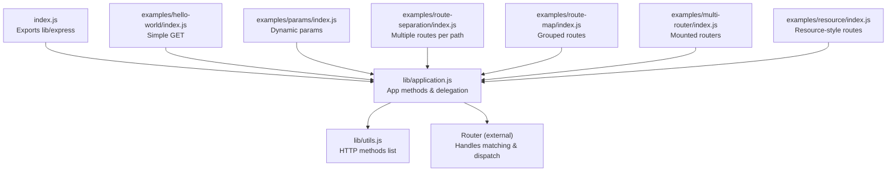
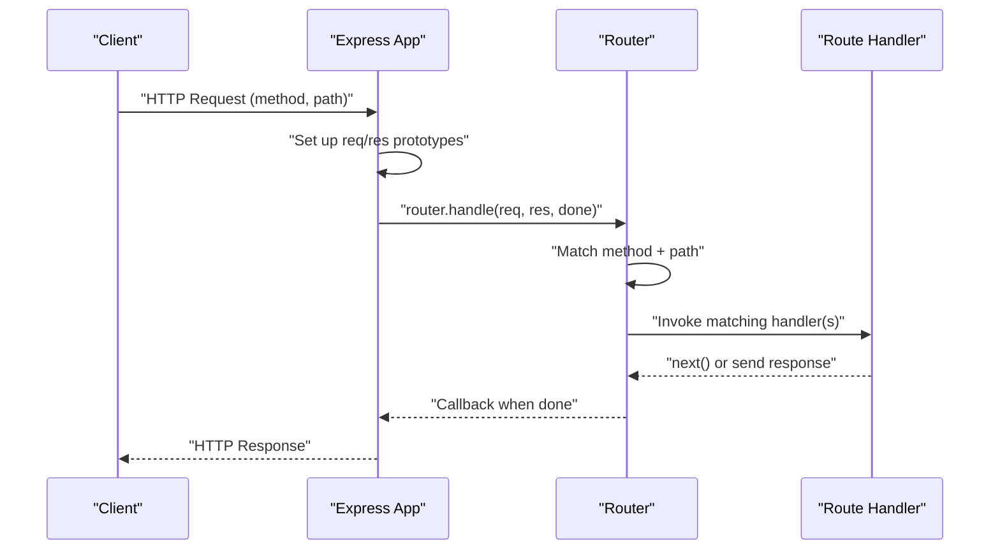
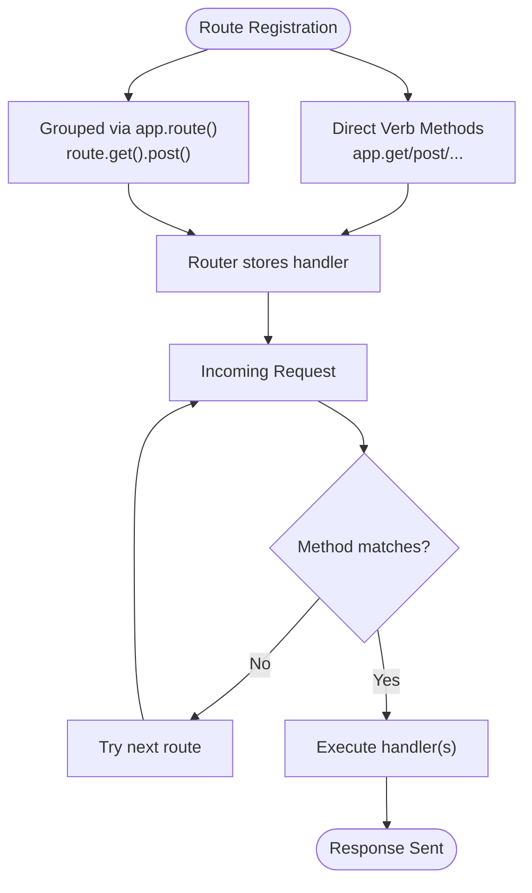
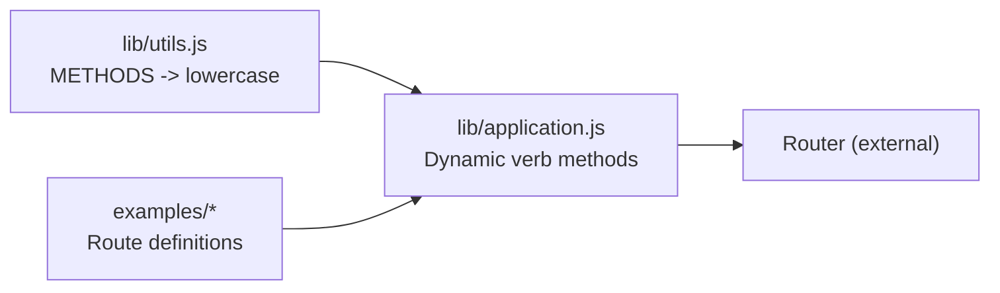

# Basic Routing

<cite>
**Referenced Files in This Document**
- [index.js](file://index.js)
- [lib/application.js](file://lib/application.js)
- [lib/utils.js](file://lib/utils.js)
- [examples/hello-world/index.js](file://examples/hello-world/index.js)
- [examples/params/index.js](file://examples/params/index.js)
- [examples/route-separation/index.js](file://examples/route-separation/index.js)
- [examples/route-map/index.js](file://examples/route-map/index.js)
- [examples/multi-router/index.js](file://examples/multi-router/index.js)
- [examples/resource/index.js](file://examples/resource/index.js)
- [test/app.route.js](file://test/app.route.js)
- [test/Router.js](file://test/Router.js)
- [test/acceptance/route-map.js](file://test/acceptance/route-map.js)
</cite>

## Table of Contents
1. [Introduction](#introduction)
2. [Project Structure](#project-structure)
3. [Core Components](#core-components)
4. [Architecture Overview](#architecture-overview)
5. [Detailed Component Analysis](#detailed-component-analysis)
6. [Dependency Analysis](#dependency-analysis)
7. [Performance Considerations](#performance-considerations)
8. [Troubleshooting Guide](#troubleshooting-guide)
9. [Conclusion](#conclusion)

## Introduction
This document explains Express.js basic routing fundamentals. It covers how to define routes, match HTTP methods, register routes, and how Express resolves incoming requests to handlers. It also demonstrates the relationship between app.route() and direct method calls, shows how route registration order matters, and provides practical examples from the codebase.

## Project Structure
Routing in Express centers around the application object and the underlying router. The application object exposes convenience methods for HTTP verbs and delegates to an internal router. Utilities provide the list of supported HTTP methods. Examples demonstrate common patterns like static routes, dynamic segments, and grouped route definitions.

**Diagram sources**
- [index.js:1-12](file://index.js#L1-L12)
- [lib/application.js:1-632](file://lib/application.js#L1-L632)
- [lib/utils.js:1-272](file://lib/utils.js#L1-L272)
- [examples/hello-world/index.js:1-16](file://examples/hello-world/index.js#L1-L16)
- [examples/params/index.js:1-75](file://examples/params/index.js#L1-L75)
- [examples/route-separation/index.js:1-56](file://examples/route-separation/index.js#L1-L56)
- [examples/route-map/index.js:1-76](file://examples/route-map/index.js#L1-L76)
- [examples/multi-router/index.js:1-19](file://examples/multi-router/index.js#L1-L19)
- [examples/resource/index.js:1-96](file://examples/resource/index.js#L1-L96)

**Section sources**
- [index.js:1-12](file://index.js#L1-L12)
- [lib/application.js:1-632](file://lib/application.js#L1-L632)
- [lib/utils.js:1-272](file://lib/utils.js#L1-L272)

## Core Components
- Application methods: app.get(), app.post(), app.put(), app.delete(), and others are dynamically generated and delegate to the router.
- Router: The application defers to a router instance for matching and dispatching requests.
- HTTP methods: Supported methods come from Node’s http.METHODS and are normalized to lowercase.
- Route registration: Routes can be registered directly via verb methods or via app.route() to group multiple methods for the same path.

Key implementation points:
- Dynamic HTTP verb methods are created by iterating over the supported methods and assigning a function that delegates to app.route(path) and then calls the corresponding route method.
- app.route(path) returns a Route instance for that path, enabling chaining of .get(), .post(), etc.

Practical examples:
- Simple route setup: [examples/hello-world/index.js:7-9](file://examples/hello-world/index.js#L7-L9)
- Multiple routes per path: [examples/route-separation/index.js:36-46](file://examples/route-separation/index.js#L36-L46)
- Grouped route definitions: [examples/route-map/index.js:55-69](file://examples/route-map/index.js#L55-L69)
- Relationship between app.route() and direct method calls: [test/app.route.js:10-21](file://test/app.route.js#L10-L21)

**Section sources**
- [lib/application.js:467-503](file://lib/application.js#L467-L503)
- [lib/utils.js:25-30](file://lib/utils.js#L25-L30)
- [examples/hello-world/index.js:7-9](file://examples/hello-world/index.js#L7-L9)
- [examples/route-separation/index.js:36-46](file://examples/route-separation/index.js#L36-L46)
- [examples/route-map/index.js:55-69](file://examples/route-map/index.js#L55-L69)
- [test/app.route.js:10-21](file://test/app.route.js#L10-L21)

## Architecture Overview
Express routes are processed through the application’s request handling pipeline. The app delegates to a router, which matches the incoming request’s method and path to registered handlers. Middleware and route handlers are executed in order until a response is sent or an error occurs.

**Diagram sources**
- [lib/application.js:152-178](file://lib/application.js#L152-L178)

**Section sources**
- [lib/application.js:152-178](file://lib/application.js#L152-L178)

## Detailed Component Analysis

### Route Definition Syntax and Path Patterns
- Static routes: Exact path strings like "/" or "/users".
- Dynamic segments: Named parameters like "/user/:id".
- Pattern-based segments: More complex patterns like "/users/:from-:to" or "/:a..:b{.:format}".
- Multiple routes per path: Different HTTP methods for the same path (e.g., GET and PUT).

Evidence from examples:
- Static and dynamic routes: [examples/params/index.js:47-68](file://examples/params/index.js#L47-L68)
- Multiple routes per path: [examples/route-separation/index.js:36-46](file://examples/route-separation/index.js#L36-L46)
- Resource-style routes: [examples/resource/index.js:13-26](file://examples/resource/index.js#L13-L26)

**Section sources**
- [examples/params/index.js:47-68](file://examples/params/index.js#L47-L68)
- [examples/route-separation/index.js:36-46](file://examples/route-separation/index.js#L36-L46)
- [examples/resource/index.js:13-26](file://examples/resource/index.js#L13-L26)

### Basic HTTP Method Routing
Express supports standard HTTP methods. These are derived from Node’s http.METHODS and normalized to lowercase. The application dynamically creates methods like app.get(), app.post(), app.put(), app.delete(), etc.

- Supported methods: [lib/utils.js:25-30](file://lib/utils.js#L25-L30)
- Dynamic method generation: [lib/application.js:467-482](file://lib/application.js#L467-L482)

Practical usage:
- GET route: [examples/hello-world/index.js:7-9](file://examples/hello-world/index.js#L7-L9)
- PUT route: [examples/route-separation/index.js:45](file://examples/route-separation/index.js#L45)
- DELETE route: [examples/resource/index.js:22-25](file://examples/resource/index.js#L22-L25)

**Section sources**
- [lib/utils.js:25-30](file://lib/utils.js#L25-L30)
- [lib/application.js:467-482](file://lib/application.js#L467-L482)
- [examples/hello-world/index.js:7-9](file://examples/hello-world/index.js#L7-L9)
- [examples/route-separation/index.js:45](file://examples/route-separation/index.js#L45)
- [examples/resource/index.js:22-25](file://examples/resource/index.js#L22-L25)

### Route Registration Process and Matching
- app.get(path, ...), app.post(path, ...), etc., create a Route for the path and attach handlers for the given method.
- app.route(path) returns a Route instance for grouping multiple methods on the same path.
- Matching is performed by the router using the request’s method and path. Tests demonstrate method-specific dispatch and stacking behavior.

Key references:
- Delegation to router: [lib/application.js:478](file://lib/application.js#L478)
- app.route(): [lib/application.js:256-258](file://lib/application.js#L256-L258)
- Route dispatch and method filtering: [test/Router.js:570-636](file://test/Router.js#L570-L636)
- Route method dispatch tests: [test/Route.js:107-167](file://test/Route.js#L107-L167)

**Diagram sources**
- [lib/application.js:467-503](file://lib/application.js#L467-L503)
- [lib/application.js:256-258](file://lib/application.js#L256-L258)
- [test/Router.js:570-636](file://test/Router.js#L570-L636)
- [test/Route.js:107-167](file://test/Route.js#L107-L167)

**Section sources**
- [lib/application.js:467-503](file://lib/application.js#L467-L503)
- [lib/application.js:256-258](file://lib/application.js#L256-L258)
- [test/Router.js:570-636](file://test/Router.js#L570-L636)
- [test/Route.js:107-167](file://test/Route.js#L107-L167)

### Relationship Between app.route() and Direct Method Calls
- app.get(path, handler) internally calls app.route(path) and then route.get(handler).
- app.route(path) returns a Route object that supports chaining multiple method handlers for the same path.

Evidence:
- Delegation chain: [lib/application.js:478](file://lib/application.js#L478)
- Chaining example: [test/app.route.js:10-21](file://test/app.route.js#L10-L21)

**Section sources**
- [lib/application.js:478](file://lib/application.js#L478)
- [test/app.route.js:10-21](file://test/app.route.js#L10-L21)

### Route Handler Execution Flow
- Handlers are invoked in the order they are registered for a given method.
- Middleware and route handlers can call next() to continue to the next handler or send a response.
- Tests demonstrate stacking and fallthrough behavior.

References:
- Stacking and fallthrough: [test/Route.js:143-167](file://test/Route.js#L143-L167)
- Parallel request safety and parameter handling: [test/Router.js:599-636](file://test/Router.js#L599-L636)

**Section sources**
- [test/Route.js:143-167](file://test/Route.js#L143-L167)
- [test/Router.js:599-636](file://test/Router.js#L599-L636)

### Practical Examples from the Codebase
- Hello World GET: [examples/hello-world/index.js:7-9](file://examples/hello-world/index.js#L7-L9)
- Dynamic parameters and custom parsing: [examples/params/index.js:23-41](file://examples/params/index.js#L23-L41)
- Multiple routes per path: [examples/route-separation/index.js:36-46](file://examples/route-separation/index.js#L36-L46)
- Grouped route definitions: [examples/route-map/index.js:55-69](file://examples/route-map/index.js#L55-L69)
- Mounted routers: [examples/multi-router/index.js:7-8](file://examples/multi-router/index.js#L7-L8)
- Resource-style routes: [examples/resource/index.js:13-26](file://examples/resource/index.js#L13-L26)

**Section sources**
- [examples/hello-world/index.js:7-9](file://examples/hello-world/index.js#L7-L9)
- [examples/params/index.js:23-41](file://examples/params/index.js#L23-L41)
- [examples/route-separation/index.js:36-46](file://examples/route-separation/index.js#L36-L46)
- [examples/route-map/index.js:55-69](file://examples/route-map/index.js#L55-L69)
- [examples/multi-router/index.js:7-8](file://examples/multi-router/index.js#L7-L8)
- [examples/resource/index.js:13-26](file://examples/resource/index.js#L13-L26)

## Dependency Analysis
Express’s routing depends on:
- Node’s http.METHODS for supported HTTP verbs.
- An external router for matching and dispatching.
- Application-level delegation to the router during request handling.

**Diagram sources**
- [lib/utils.js:25-30](file://lib/utils.js#L25-L30)
- [lib/application.js:467-503](file://lib/application.js#L467-L503)

**Section sources**
- [lib/utils.js:25-30](file://lib/utils.js#L25-L30)
- [lib/application.js:467-503](file://lib/application.js#L467-L503)

## Performance Considerations
- Keep route order logical and avoid overlapping patterns that cause unnecessary checks.
- Prefer static routes for frequently accessed paths when possible.
- Use app.route() to minimize repeated path parsing for multiple methods on the same path.
- Avoid heavy synchronous work inside route handlers; use async patterns and middleware for pre-processing.

## Troubleshooting Guide
Common beginner mistakes and fixes:
- No route registered: Requests without any routes result in a 404. Verify app.use() and route registrations. See: [test/app.js:19-23](file://test/app.js#L19-L23)
- Wrong HTTP method: Ensure the route method matches the request (GET vs POST vs PUT vs DELETE). See: [test/Route.js:123-141](file://test/Route.js#L123-L141)
- Missing handler for a path: app.route() without handlers leads to 404. See: [test/app.route.js:55-63](file://test/app.route.js#L55-L63)
- Parameter parsing errors: Validate parameters in app.param() or route handlers. See: [examples/params/index.js:23-41](file://examples/params/index.js#L23-L41)
- Middleware not called: Ensure next() is invoked or a response is sent. See: [test/Router.js:599-636](file://test/Router.js#L599-L636)
- Mounted router path mismatch: Confirm mount path and route prefixes align. See: [examples/multi-router/index.js:7-8](file://examples/multi-router/index.js#L7-L8)

**Section sources**
- [test/app.js:19-23](file://test/app.js#L19-L23)
- [test/Route.js:123-141](file://test/Route.js#L123-L141)
- [test/app.route.js:55-63](file://test/app.route.js#L55-L63)
- [examples/params/index.js:23-41](file://examples/params/index.js#L23-L41)
- [test/Router.js:599-636](file://test/Router.js#L599-L636)
- [examples/multi-router/index.js:7-8](file://examples/multi-router/index.js#L7-L8)

## Conclusion
Express routing is centered on simple, declarative route definitions with flexible path patterns and method-specific handlers. Understanding how app.get(), app.post(), app.put(), and app.delete() delegate to the router, and how app.route() enables grouped handlers, helps build predictable and maintainable APIs. Pay attention to route registration order, method matching, and handler execution flow to avoid common pitfalls.