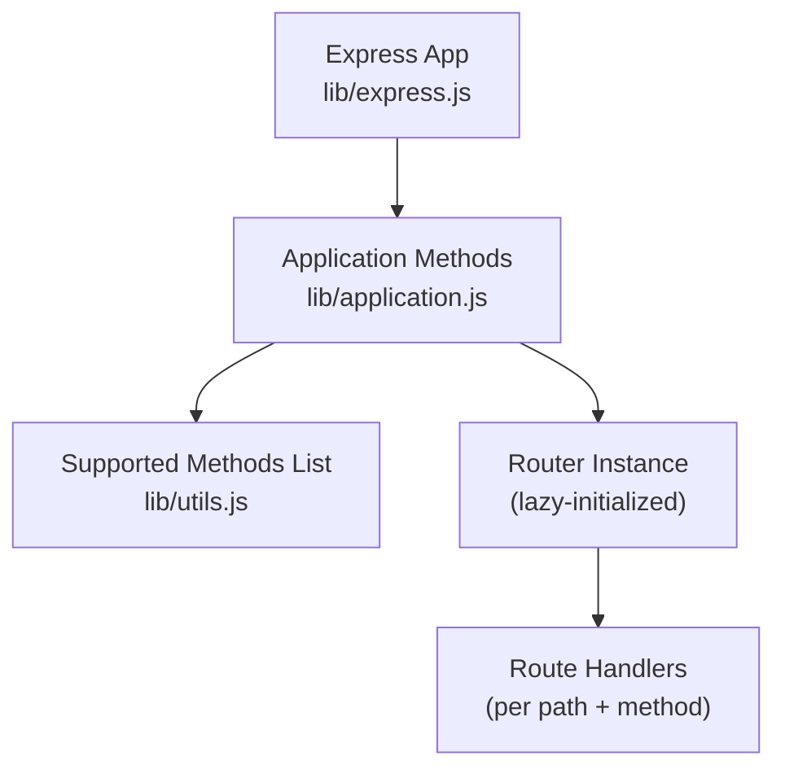
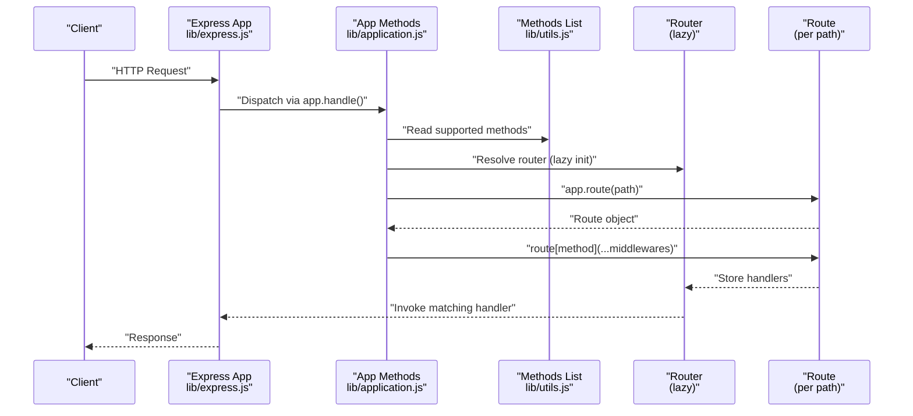
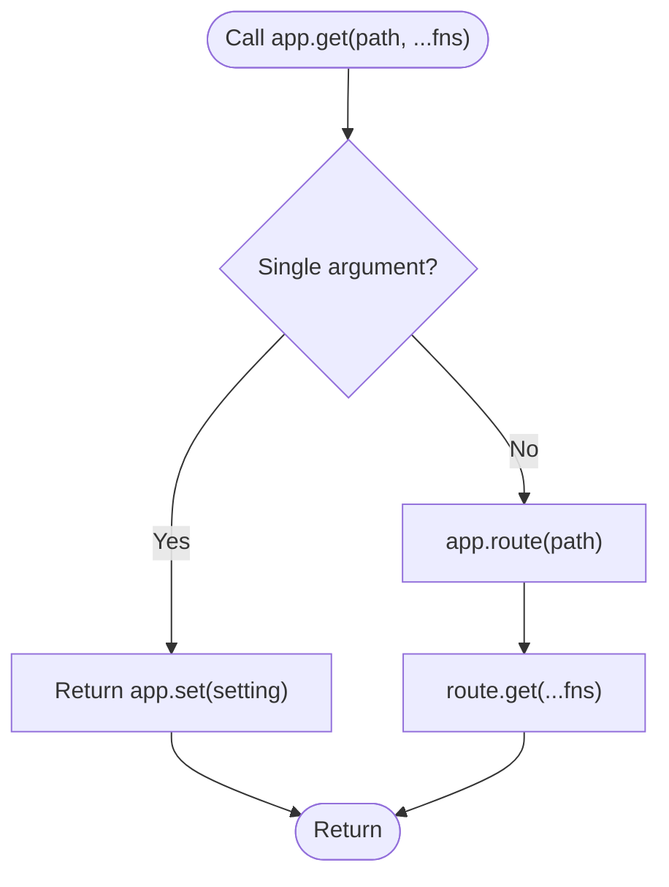
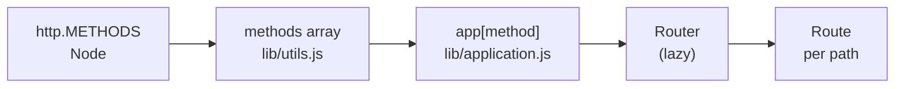

# HTTP Method Routing

<cite>
**Referenced Files in This Document**
- [lib/application.js](file://lib/application.js)
- [lib/utils.js](file://lib/utils.js)
- [lib/express.js](file://lib/express.js)
- [test/app.head.js](file://test/app.head.js)
- [test/app.options.js](file://test/app.options.js)
- [test/app.all.js](file://test/app.all.js)
- [test/app.route.js](file://test/app.route.js)
- [examples/web-service/index.js](file://examples/web-service/index.js)
- [examples/mvc/lib/boot.js](file://examples/mvc/lib/boot.js)
- [examples/route-map/index.js](file://examples/route-map/index.js)
- [examples/resource/index.js](file://examples/resource/index.js)
</cite>

## Table of Contents
1. [Introduction](#introduction)
2. [Project Structure](#project-structure)
3. [Core Components](#core-components)
4. [Architecture Overview](#architecture-overview)
5. [Detailed Component Analysis](#detailed-component-analysis)
6. [Dependency Analysis](#dependency-analysis)
7. [Performance Considerations](#performance-considerations)
8. [Troubleshooting Guide](#troubleshooting-guide)
9. [Conclusion](#conclusion)

## Introduction
This document explains Express.js HTTP method-specific routing capabilities. It covers how HTTP verbs are delegated to application methods, the special case of app.get() as a getter, the app.all() method, and how these mechanisms relate to CRUD operations and RESTful design. Practical examples and diagrams illustrate method routing, middleware integration, and error handling.

## Project Structure
Express exposes a compact API surface for HTTP method routing:
- Application methods are dynamically generated from supported HTTP methods.
- The app delegates method calls to an internal router.
- The router resolves routes based on path and HTTP verb.
- Tests and examples demonstrate behavior for HEAD/OPTIONS, app.all(), and route composition.

**Diagram sources**
- [lib/express.js:36-56](file://lib/express.js#L36-L56)
- [lib/application.js:471-503](file://lib/application.js#L471-L503)
- [lib/utils.js:29](file://lib/utils.js#L29)

**Section sources**
- [lib/express.js:36-56](file://lib/express.js#L36-L56)
- [lib/application.js:471-503](file://lib/application.js#L471-L503)
- [lib/utils.js:29](file://lib/utils.js#L29)

## Core Components
- Supported HTTP methods: Derived from Node’s http.METHODS and normalized to lowercase.
- Dynamic method delegation: Each method name becomes a callable app.method().
- Special getter behavior: app.get(setting) returns a setting value when called with a single argument.
- app.all(): Registers the same handler(s) for all supported HTTP methods.
- Router integration: app.route(path) returns a Route object; app.method(path, ...fns) delegates to route[method](...fns).

Key behaviors:
- Automatic delegation maps HTTP verbs to app.method() calls.
- app.get() without a path acts as a getter for settings.
- app.all() iterates over all supported methods to register handlers.
- HEAD/OPTIONS behavior is validated via tests.

**Section sources**
- [lib/utils.js:29](file://lib/utils.js#L29)
- [lib/application.js:471-503](file://lib/application.js#L471-L503)
- [test/app.head.js:1-66](file://test/app.head.js#L1-L66)
- [test/app.options.js:1-51](file://test/app.options.js#L1-L51)
- [test/app.all.js:1-39](file://test/app.all.js#L1-L39)

## Architecture Overview
The HTTP method routing pipeline:

**Diagram sources**
- [lib/express.js:36-56](file://lib/express.js#L36-L56)
- [lib/application.js:471-503](file://lib/application.js#L471-L503)
- [lib/utils.js:29](file://lib/utils.js#L29)

## Detailed Component Analysis

### Supported HTTP Methods and Delegation
- Supported methods are derived from Node’s http.METHODS and lowercased.
- Express loops over these methods to define app.get, app.post, app.put, app.delete, app.patch, app.head, app.options, and any others exposed by the platform.
- app.get() is overloaded: when called with a single argument, it behaves as a getter for settings; otherwise it registers a GET route.

**Diagram sources**
- [lib/application.js:471-482](file://lib/application.js#L471-L482)

**Section sources**
- [lib/utils.js:29](file://lib/utils.js#L29)
- [lib/application.js:471-482](file://lib/application.js#L471-L482)

### app.get() as a Getter
- When invoked with a single argument (e.g., a setting key), app.get() returns the current value of that setting.
- This enables configuration retrieval without registering a route.

Practical example reference:
- [examples/web-service/index.js:75-91](file://examples/web-service/index.js#L75-L91)

**Section sources**
- [lib/application.js:473-476](file://lib/application.js#L473-L476)

### app.all() for All Methods
- app.all(path, ...fns) applies the same handler(s) to every supported HTTP method.
- Useful for cross-cutting concerns like logging, CORS, or shared middleware.

Behavior validated by:
- [test/app.all.js:8-23](file://test/app.all.js#L8-L23)

**Section sources**
- [lib/application.js:494-503](file://lib/application.js#L494-L503)
- [test/app.all.js:1-39](file://test/app.all.js#L1-L39)

### HEAD and OPTIONS Semantics
- HEAD: Defaults to the GET handler; tests confirm identical headers and 200 status.
- HEAD can be overridden by registering app.head() to provide distinct behavior.
- OPTIONS: Aggregates allowed methods for a path; duplicates are deduplicated; app.all() does not alter Allow headers.

References:
- [test/app.head.js:1-66](file://test/app.head.js#L1-L66)
- [test/app.options.js:1-51](file://test/app.options.js#L1-L51)

**Section sources**
- [test/app.head.js:1-66](file://test/app.head.js#L1-L66)
- [test/app.options.js:1-51](file://test/app.options.js#L1-L51)

### Route Composition with app.route()
- app.route(path) returns a Route object supporting chained method registrations.
- Chaining .get(), .post(), .all(), etc., organizes handlers by HTTP verb on a single path.

References:
- [test/app.route.js:10-40](file://test/app.route.js#L10-L40)

**Section sources**
- [test/app.route.js:1-65](file://test/app.route.js#L1-L65)

### RESTful Patterns and CRUD Mapping
- Typical CRUD endpoints align with HTTP methods:
  - GET: Retrieve lists or individual resources
  - POST: Create new resources
  - PUT/PATCH: Update entire or partial resources
  - DELETE: Remove resources
- Examples in the repository demonstrate GET-centric listings and DELETE for removal.

References:
- [examples/web-service/index.js:75-91](file://examples/web-service/index.js#L75-L91)
- [examples/resource/index.js:13-26](file://examples/resource/index.js#L13-L26)

**Section sources**
- [examples/web-service/index.js:75-91](file://examples/web-service/index.js#L75-L91)
- [examples/resource/index.js:13-26](file://examples/resource/index.js#L13-L26)

### Conditional Logic Based on HTTP Methods
- Middleware can branch logic based on req.method to apply method-specific behavior.
- app.route() allows stacking .all() for preconditions followed by method-specific handlers.

References:
- [test/app.route.js:23-40](file://test/app.route.js#L23-L40)

**Section sources**
- [test/app.route.js:23-40](file://test/app.route.js#L23-L40)

### MVC and Convention-Based Routing
- The MVC example demonstrates mapping controller actions to HTTP methods and URLs, using app.get(), app.post(), app.put(), and app.delete().

References:
- [examples/mvc/lib/boot.js:44-83](file://examples/mvc/lib/boot.js#L44-L83)

**Section sources**
- [examples/mvc/lib/boot.js:44-83](file://examples/mvc/lib/boot.js#L44-L83)

### Route Map Utility
- A utility recursively maps nested objects to HTTP method registrations, iterating over keys and calling app[key](route, handler).

References:
- [examples/route-map/index.js:14-29](file://examples/route-map/index.js#L14-L29)

**Section sources**
- [examples/route-map/index.js:14-29](file://examples/route-map/index.js#L14-L29)

## Dependency Analysis
Express’s HTTP method routing depends on:
- Node’s http.METHODS for canonical method names.
- A lazy-initialized Router instance to manage route handlers.
- A Route object to bind multiple handlers per path and method.

**Diagram sources**
- [lib/utils.js:29](file://lib/utils.js#L29)
- [lib/application.js:471-503](file://lib/application.js#L471-L503)

**Section sources**
- [lib/utils.js:29](file://lib/utils.js#L29)
- [lib/application.js:471-503](file://lib/application.js#L471-L503)

## Performance Considerations
- Delegation overhead is minimal: a single loop over supported methods plus a small getter check for app.get().
- Using app.all() adds one handler per method; prefer targeted methods for specificity.
- HEAD/OPTIONS responses are efficient; HEAD defaults to GET behavior when no explicit handler is registered.

## Troubleshooting Guide
Common issues and resolutions:
- Unexpected app.get() result: Calling app.get(settingKey) returns the setting value; use app.get(path, handler) to register a route.
- HEAD not behaving as expected: Without an app.head() handler, HEAD falls back to GET; register app.head() to override.
- OPTIONS Allow header confusion: app.all() does not affect Allow; it aggregates methods from route registrations.
- Route chaining errors: Ensure app.route(path) is used to chain .get(), .post(), etc., on the same path.

References:
- [lib/application.js:473-476](file://lib/application.js#L473-L476)
- [test/app.head.js:47-66](file://test/app.head.js#L47-L66)
- [test/app.options.js:34-50](file://test/app.options.js#L34-L50)
- [test/app.route.js:10-40](file://test/app.route.js#L10-L40)

**Section sources**
- [lib/application.js:473-476](file://lib/application.js#L473-L476)
- [test/app.head.js:47-66](file://test/app.head.js#L47-L66)
- [test/app.options.js:34-50](file://test/app.options.js#L34-L50)
- [test/app.route.js:10-40](file://test/app.route.js#L10-L40)

## Conclusion
Express’s HTTP method routing is built on a clean delegation model: supported methods are dynamically exposed as app.method(), with special handling for app.get() as a getter. app.all() simplifies cross-cutting concerns, while HEAD/OPTIONS semantics are predictable and test-backed. Together, these features enable RESTful designs and flexible middleware integration.