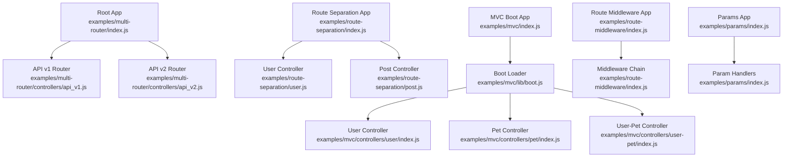
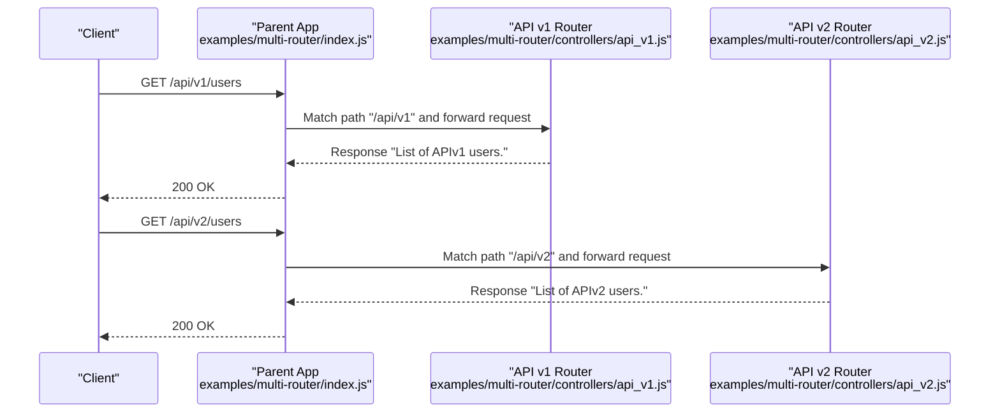
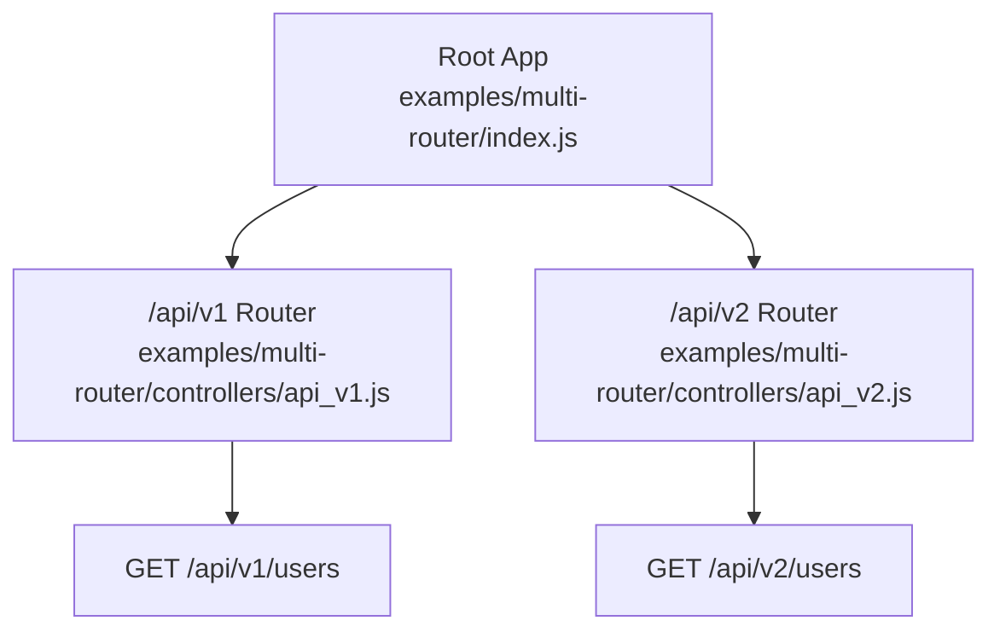
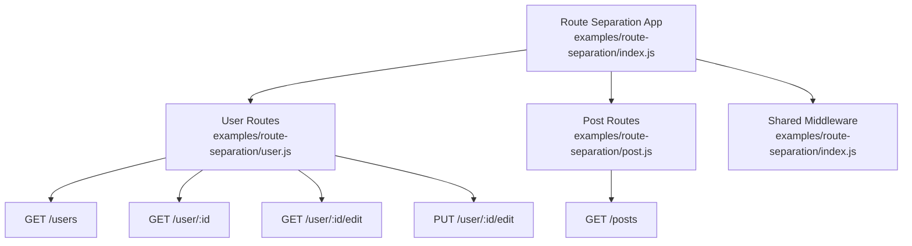
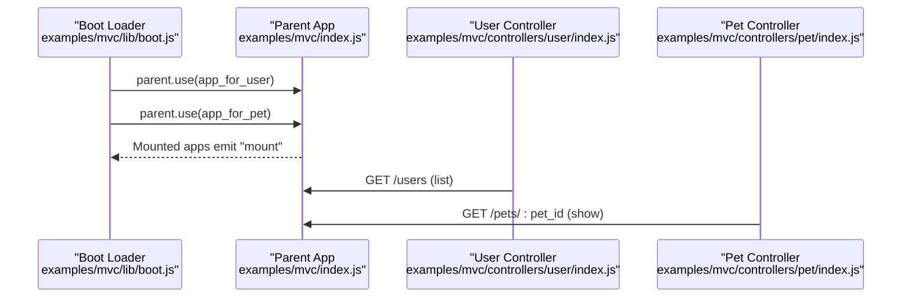
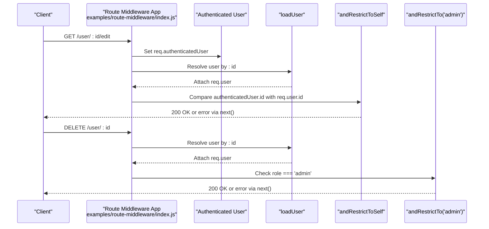
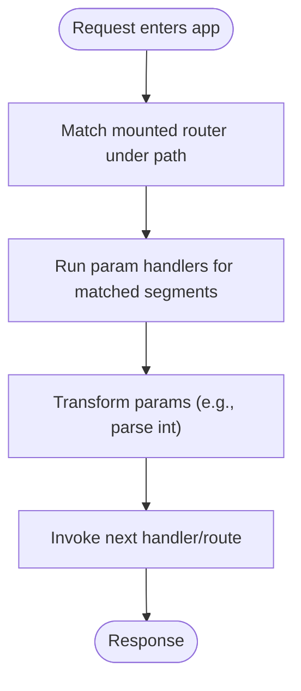
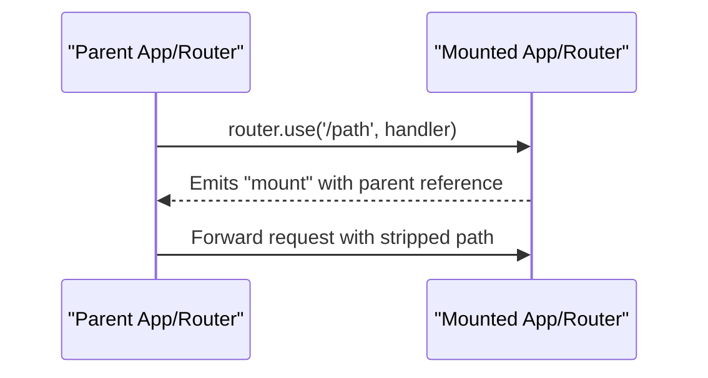
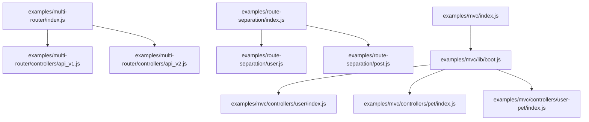

# Nested Routing

<cite>
**Referenced Files in This Document**
- [examples/multi-router/index.js](file://examples/multi-router/index.js)
- [examples/multi-router/controllers/api_v1.js](file://examples/multi-router/controllers/api_v1.js)
- [examples/multi-router/controllers/api_v2.js](file://examples/multi-router/controllers/api_v2.js)
- [examples/route-separation/index.js](file://examples/route-separation/index.js)
- [examples/route-separation/user.js](file://examples/route-separation/user.js)
- [examples/route-separation/post.js](file://examples/route-separation/post.js)
- [examples/mvc/index.js](file://examples/mvc/index.js)
- [examples/mvc/lib/boot.js](file://examples/mvc/lib/boot.js)
- [examples/mvc/controllers/main/index.js](file://examples/mvc/controllers/main/index.js)
- [examples/mvc/controllers/user/index.js](file://examples/mvc/controllers/user/index.js)
- [examples/mvc/controllers/pet/index.js](file://examples/mvc/controllers/pet/index.js)
- [examples/mvc/controllers/user-pet/index.js](file://examples/mvc/controllers/user-pet/index.js)
- [examples/route-middleware/index.js](file://examples/route-middleware/index.js)
- [examples/params/index.js](file://examples/params/index.js)
- [lib/application.js](file://lib/application.js)
- [test/app.use.js](file://test/app.use.js)
- [test/app.route.js](file://test/app.route.js)
- [test/Router.js](file://test/Router.js)
- [test/acceptance/multi-router.js](file://test/acceptance/multi-router.js)
</cite>

## Table of Contents
1. [Introduction](#introduction)
2. [Project Structure](#project-structure)
3. [Core Components](#core-components)
4. [Architecture Overview](#architecture-overview)
5. [Detailed Component Analysis](#detailed-component-analysis)
6. [Dependency Analysis](#dependency-analysis)
7. [Performance Considerations](#performance-considerations)
8. [Troubleshooting Guide](#troubleshooting-guide)
9. [Conclusion](#conclusion)
10. [Appendices](#appendices)

## Introduction
This document explains Express.js nested routing and modular route organization with practical examples from the repository. It covers how to create sub-routers, mount them at specific paths, compose routers hierarchically, share middleware across nested routes, and maintain route isolation between parent and child routers. It also documents route parameter inheritance, middleware execution order in nested structures, and performance considerations for complex routing hierarchies. Finally, it provides best practices for organizing large applications and maintaining a clean routing architecture.

## Project Structure
The repository demonstrates nested routing and modular architecture across several examples:
- Multi-router: mounts separate API routers under versioned paths.
- Route separation: organizes routes by domain (users, posts) with shared middleware.
- MVC-style bootstrapping: auto-generates routes from controller exports and mounts them under a single parent.
- Route middleware: shows middleware chaining and conditional authorization.
- Params: demonstrates parameter parsing and transformation.

**Diagram sources**
- [examples/multi-router/index.js:1-19](file://examples/multi-router/index.js#L1-L19)
- [examples/multi-router/controllers/api_v1.js:1-16](file://examples/multi-router/controllers/api_v1.js#L1-L16)
- [examples/multi-router/controllers/api_v2.js:1-16](file://examples/multi-router/controllers/api_v2.js#L1-L16)
- [examples/route-separation/index.js:1-56](file://examples/route-separation/index.js#L1-L56)
- [examples/route-separation/user.js:1-48](file://examples/route-separation/user.js#L1-L48)
- [examples/route-separation/post.js:1-14](file://examples/route-separation/post.js#L1-L14)
- [examples/mvc/index.js:1-96](file://examples/mvc/index.js#L1-L96)
- [examples/mvc/lib/boot.js:1-84](file://examples/mvc/lib/boot.js#L1-L84)
- [examples/mvc/controllers/user/index.js:1-42](file://examples/mvc/controllers/user/index.js#L1-L42)
- [examples/mvc/controllers/pet/index.js:1-32](file://examples/mvc/controllers/pet/index.js#L1-L32)
- [examples/mvc/controllers/user-pet/index.js:1-23](file://examples/mvc/controllers/user-pet/index.js#L1-L23)
- [examples/route-middleware/index.js:1-91](file://examples/route-middleware/index.js#L1-L91)
- [examples/params/index.js:1-75](file://examples/params/index.js#L1-L75)

**Section sources**
- [examples/multi-router/index.js:1-19](file://examples/multi-router/index.js#L1-L19)
- [examples/route-separation/index.js:1-56](file://examples/route-separation/index.js#L1-L56)
- [examples/mvc/index.js:1-96](file://examples/mvc/index.js#L1-L96)
- [examples/route-middleware/index.js:1-91](file://examples/route-middleware/index.js#L1-L91)
- [examples/params/index.js:1-75](file://examples/params/index.js#L1-L75)

## Core Components
- Sub-router creation with express.Router(): Routers encapsulate related routes and middleware for modularity.
- Mounting with app.use(): Mounts routers (and apps) under a given path, enabling hierarchical routing.
- app.route(): Creates a new Route instance for a path, allowing chained HTTP method definitions.
- Parameter handlers: app.param() and router.param() transform and validate parameters consistently across nested routes.
- Middleware sharing: Middleware registered on a parent app or router is inherited by mounted children.

Key implementation references:
- Sub-router creation and export: [examples/multi-router/controllers/api_v1.js:5](file://examples/multi-router/controllers/api_v1.js#L5), [examples/multi-router/controllers/api_v2.js:5](file://examples/multi-router/controllers/api_v2.js#L5)
- Mounting routers at paths: [examples/multi-router/index.js:7-8](file://examples/multi-router/index.js#L7-L8)
- Route composition via app.route(): [test/app.route.js:10-16](file://test/app.route.js#L10-L16)
- Parameter handling: [examples/params/index.js:23-41](file://examples/params/index.js#L23-L41)
- Middleware application and path stripping: [test/app.use.js:284-294](file://test/app.use.js#L284-L294)

**Section sources**
- [examples/multi-router/controllers/api_v1.js:1-16](file://examples/multi-router/controllers/api_v1.js#L1-L16)
- [examples/multi-router/controllers/api_v2.js:1-16](file://examples/multi-router/controllers/api_v2.js#L1-L16)
- [examples/multi-router/index.js:1-19](file://examples/multi-router/index.js#L1-L19)
- [test/app.route.js:1-198](file://test/app.route.js#L1-L198)
- [examples/params/index.js:1-75](file://examples/params/index.js#L1-L75)
- [test/app.use.js:284-294](file://test/app.use.js#L284-L294)

## Architecture Overview
Express supports two complementary mechanisms for nested routing:
- app.use() mounts either middleware functions or other Express applications/routers at a given path, enabling hierarchical routing.
- app.route() returns a Route instance for a path, allowing grouped HTTP method definitions.

**Diagram sources**
- [examples/multi-router/index.js:7-8](file://examples/multi-router/index.js#L7-L8)
- [examples/multi-router/controllers/api_v1.js:11-13](file://examples/multi-router/controllers/api_v1.js#L11-L13)
- [examples/multi-router/controllers/api_v2.js:11-13](file://examples/multi-router/controllers/api_v2.js#L11-L13)

**Section sources**
- [examples/multi-router/index.js:1-19](file://examples/multi-router/index.js#L1-L19)
- [examples/multi-router/controllers/api_v1.js:1-16](file://examples/multi-router/controllers/api_v1.js#L1-L16)
- [examples/multi-router/controllers/api_v2.js:1-16](file://examples/multi-router/controllers/api_v2.js#L1-L16)

## Detailed Component Analysis

### Multi-Router Versioning
This example demonstrates API versioning through nested routers mounted under distinct paths. The parent app registers two routers at /api/v1 and /api/v2, isolating route handling and enabling independent evolution of APIs.

**Diagram sources**
- [examples/multi-router/index.js:7-8](file://examples/multi-router/index.js#L7-L8)
- [examples/multi-router/controllers/api_v1.js:11-13](file://examples/multi-router/controllers/api_v1.js#L11-L13)
- [examples/multi-router/controllers/api_v2.js:11-13](file://examples/multi-router/controllers/api_v2.js#L11-L13)

**Section sources**
- [examples/multi-router/index.js:1-19](file://examples/multi-router/index.js#L1-L19)
- [examples/multi-router/controllers/api_v1.js:1-16](file://examples/multi-router/controllers/api_v1.js#L1-L16)
- [examples/multi-router/controllers/api_v2.js:1-16](file://examples/multi-router/controllers/api_v2.js#L1-L16)
- [test/acceptance/multi-router.js:1-44](file://test/acceptance/multi-router.js#L1-L44)

### Route Separation by Domain
This example separates concerns by grouping routes for users and posts, each handled by dedicated modules. Shared middleware (logging, parsers, static assets) is applied at the parent app level, while domain-specific routes remain isolated.

**Diagram sources**
- [examples/route-separation/index.js:13-15](file://examples/route-separation/index.js#L13-L15)
- [examples/route-separation/user.js:10-12](file://examples/route-separation/user.js#L10-L12)
- [examples/route-separation/post.js:11-13](file://examples/route-separation/post.js#L11-L13)

**Section sources**
- [examples/route-separation/index.js:1-56](file://examples/route-separation/index.js#L1-L56)
- [examples/route-separation/user.js:1-48](file://examples/route-separation/user.js#L1-L48)
- [examples/route-separation/post.js:1-14](file://examples/route-separation/post.js#L1-L14)

### MVC Bootstrapped Routing
The MVC example auto-generates routes from controller exports and mounts them under a single parent. Controllers can declare a prefix and optional before middleware, which the boot loader applies consistently.

**Diagram sources**
- [examples/mvc/lib/boot.js:14-82](file://examples/mvc/lib/boot.js#L14-L82)
- [examples/mvc/index.js:76](file://examples/mvc/index.js#L76)
- [examples/mvc/controllers/user/index.js:24-26](file://examples/mvc/controllers/user/index.js#L24-L26)
- [examples/mvc/controllers/pet/index.js:18-20](file://examples/mvc/controllers/pet/index.js#L18-L20)

**Section sources**
- [examples/mvc/lib/boot.js:1-84](file://examples/mvc/lib/boot.js#L1-L84)
- [examples/mvc/index.js:1-96](file://examples/mvc/index.js#L1-L96)
- [examples/mvc/controllers/user/index.js:1-42](file://examples/mvc/controllers/user/index.js#L1-L42)
- [examples/mvc/controllers/pet/index.js:1-32](file://examples/mvc/controllers/pet/index.js#L1-L32)

### Route Middleware Composition
This example demonstrates middleware chaining and conditional authorization. Authentication middleware sets an authenticated user, while specialized middleware restricts access based on roles or identity.

**Diagram sources**
- [examples/route-middleware/index.js:65-68](file://examples/route-middleware/index.js#L65-L68)
- [examples/route-middleware/index.js:25-34](file://examples/route-middleware/index.js#L25-L34)
- [examples/route-middleware/index.js:36-58](file://examples/route-middleware/index.js#L36-L58)
- [examples/route-middleware/index.js:74-84](file://examples/route-middleware/index.js#L74-L84)

**Section sources**
- [examples/route-middleware/index.js:1-91](file://examples/route-middleware/index.js#L1-L91)

### Parameter Inheritance and Transformation
Parameter handlers defined at the application or router level are inherited by mounted children. They run once per matched request and can transform parameters before downstream routes.

**Diagram sources**
- [examples/params/index.js:23-41](file://examples/params/index.js#L23-L41)
- [test/Router.js:527-542](file://test/Router.js#L527-L542)

**Section sources**
- [examples/params/index.js:1-75](file://examples/params/index.js#L1-L75)
- [test/Router.js:527-542](file://test/Router.js#L527-L542)

### Relationship Between app.use() and router.use()
Both app.use() and router.use() register middleware and mount applications at a given path. The key difference is scope:
- app.use(): Registers middleware/router on the application’s router.
- router.use(): Registers middleware/router on a specific router instance.

Mounting behavior and path stripping are validated by tests, demonstrating that mounted middleware receives the stripped path.

**Diagram sources**
- [lib/application.js:219-241](file://lib/application.js#L219-L241)
- [test/app.use.js:9-19](file://test/app.use.js#L9-L19)
- [test/app.use.js:284-294](file://test/app.use.js#L284-L294)

**Section sources**
- [lib/application.js:219-241](file://lib/application.js#L219-L241)
- [test/app.use.js:1-543](file://test/app.use.js#L1-L543)

## Dependency Analysis
The examples illustrate clear separation of concerns:
- Parent app depends on mounted routers/controllers.
- Routers depend on parameter handlers and middleware.
- Bootstrapping logic depends on controller exports and prefixes.

**Diagram sources**
- [examples/multi-router/index.js:7-8](file://examples/multi-router/index.js#L7-L8)
- [examples/multi-router/controllers/api_v1.js:1-16](file://examples/multi-router/controllers/api_v1.js#L1-L16)
- [examples/multi-router/controllers/api_v2.js:1-16](file://examples/multi-router/controllers/api_v2.js#L1-L16)
- [examples/route-separation/index.js:13-15](file://examples/route-separation/index.js#L13-L15)
- [examples/route-separation/user.js:1-48](file://examples/route-separation/user.js#L1-L48)
- [examples/route-separation/post.js:1-14](file://examples/route-separation/post.js#L1-L14)
- [examples/mvc/index.js:76](file://examples/mvc/index.js#L76)
- [examples/mvc/lib/boot.js:14-82](file://examples/mvc/lib/boot.js#L14-L82)
- [examples/mvc/controllers/user/index.js:1-42](file://examples/mvc/controllers/user/index.js#L1-L42)
- [examples/mvc/controllers/pet/index.js:1-32](file://examples/mvc/controllers/pet/index.js#L1-L32)
- [examples/mvc/controllers/user-pet/index.js:1-23](file://examples/mvc/controllers/user-pet/index.js#L1-L23)

**Section sources**
- [examples/multi-router/index.js:1-19](file://examples/multi-router/index.js#L1-L19)
- [examples/route-separation/index.js:1-56](file://examples/route-separation/index.js#L1-L56)
- [examples/mvc/index.js:1-96](file://examples/mvc/index.js#L1-L96)
- [examples/mvc/lib/boot.js:1-84](file://examples/mvc/lib/boot.js#L1-L84)

## Performance Considerations
- Minimize deep nesting: Each additional mount adds a dispatch step; keep routing hierarchies shallow for predictable performance.
- Prefer targeted middleware: Apply middleware only where needed to avoid unnecessary overhead.
- Use app.route() for grouped methods: Reduces repeated path parsing and improves readability.
- Parameter handlers: Keep param transformations lightweight; cache expensive computations if reused.
- Dynamic routes: While flexible, dynamic segments increase matching complexity; use them judiciously.

## Troubleshooting Guide
Common issues and resolutions:
- Middleware not invoked: Verify the mount path matches the incoming request and that the handler is a function.
- Path not stripped: Confirm the mounted handler receives the stripped path; tests demonstrate path stripping behavior.
- Parameter not transformed: Ensure param handlers are registered before routes that depend on transformed values.
- Route isolation: Confirm that parent and child routers do not inadvertently share state; use scoped middleware and parameters.

Relevant validations:
- Mounting apps emits "mount": [test/app.use.js:9-19](file://test/app.use.js#L9-L19)
- Path stripping behavior: [test/app.use.js:284-294](file://test/app.use.js#L284-L294)
- Parameter handler invocation: [test/Router.js:527-542](file://test/Router.js#L527-L542)

**Section sources**
- [test/app.use.js:1-543](file://test/app.use.js#L1-L543)
- [test/Router.js:527-542](file://test/Router.js#L527-L542)

## Conclusion
Express’s nested routing model enables scalable, modular architectures. By combining app.use() for hierarchical mounting, router.use() for scoped middleware, app.route() for grouped route definitions, and parameter handlers for consistent transformations, teams can build maintainable systems. The examples in this repository demonstrate API versioning, domain-driven separation, auto-generated MVC routes, middleware composition, and parameter inheritance—practical patterns for large applications.

## Appendices

### Best Practices for Large Applications
- Separate by domain: Group routes by business domain (users, posts, orders) and mount them independently.
- Use prefixes and versioning: Employ path prefixes (e.g., /api/v1) to isolate versions and evolve APIs safely.
- Centralize shared middleware: Apply logging, parsing, and static serving at the parent app level.
- Keep controllers focused: Each controller/module should encapsulate a bounded set of routes and middleware.
- Leverage app.route(): Group related HTTP methods for the same path to reduce duplication.
- Parameter handlers: Define parameter parsing and validation centrally to ensure consistency.

### Route Parameter Inheritance
- app.param() and router.param() apply across mounted children.
- Parameter handlers run once per request and can transform values before downstream routes.
- Tests confirm param handlers are invoked for mounted paths and only once per unique parameter value per request.

**Section sources**
- [examples/params/index.js:23-41](file://examples/params/index.js#L23-L41)
- [test/Router.js:527-542](file://test/Router.js#L527-L542)

### Middleware Execution Order in Nested Structures
- Parent middleware runs before child routers.
- Within a router, middleware order follows registration.
- Mounted apps emit "mount" and receive the stripped path for downstream handlers.

**Section sources**
- [lib/application.js:219-241](file://lib/application.js#L219-L241)
- [test/app.use.js:9-19](file://test/app.use.js#L9-L19)
- [test/app.use.js:284-294](file://test/app.use.js#L284-L294)