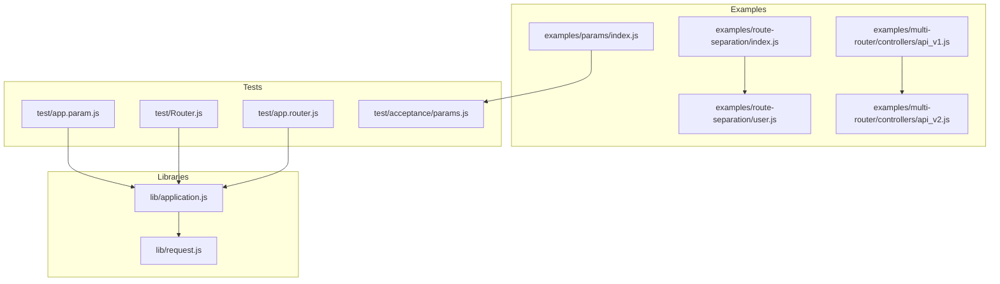
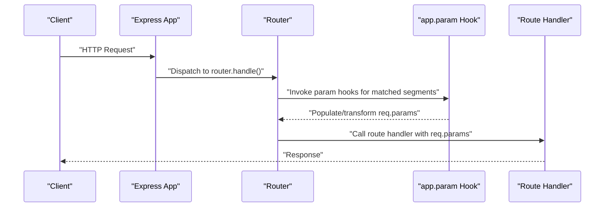
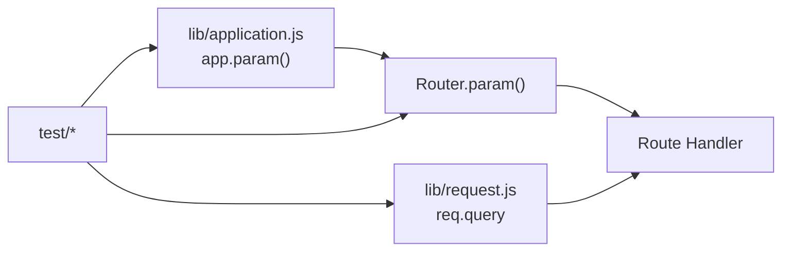

# Route Parameters

<cite>
**Referenced Files in This Document**
- [examples/params/index.js](file://examples/params/index.js)
- [test/acceptance/params.js](file://test/acceptance/params.js)
- [lib/application.js](file://lib/application.js)
- [lib/request.js](file://lib/request.js)
- [test/app.param.js](file://test/app.param.js)
- [test/Router.js](file://test/Router.js)
- [test/app.router.js](file://test/app.router.js)
- [examples/route-separation/index.js](file://examples/route-separation/index.js)
- [examples/route-separation/user.js](file://examples/route-separation/user.js)
- [examples/multi-router/controllers/api_v1.js](file://examples/multi-router/controllers/api_v1.js)
- [examples/multi-router/controllers/api_v2.js](file://examples/multi-router/controllers/api_v2.js)
</cite>

## Table of Contents
1. [Introduction](#introduction)
2. [Project Structure](#project-structure)
3. [Core Components](#core-components)
4. [Architecture Overview](#architecture-overview)
5. [Detailed Component Analysis](#detailed-component-analysis)
6. [Dependency Analysis](#dependency-analysis)
7. [Performance Considerations](#performance-considerations)
8. [Security Considerations](#security-considerations)
9. [Practical Patterns and Examples](#practical-patterns-and-examples)
10. [Troubleshooting Guide](#troubleshooting-guide)
11. [Conclusion](#conclusion)

## Introduction
This document explains Express.js route parameter handling and extraction. It covers parameter definition syntax using colons (:param), extracting values via req.params, validation and type conversion, optional parameters, wildcard and multi-segment patterns, regular expression matching, parameter ordering, nested routing, conflict resolution, and security considerations. Practical examples are drawn from the repository’s examples and tests to demonstrate real-world usage.

## Project Structure
The repository organizes parameter-related functionality across:
- Example applications demonstrating parameter usage and validation
- Tests validating parameter behavior, including custom param hooks, regex routes, and optional/wildcard patterns
- Core libraries exposing app.param and request properties

**Diagram sources**
- [examples/params/index.js:1-75](file://examples/params/index.js#L1-L75)
- [test/acceptance/params.js:1-45](file://test/acceptance/params.js#L1-L45)
- [lib/application.js:322-334](file://lib/application.js#L322-L334)
- [lib/request.js:230-241](file://lib/request.js#L230-L241)
- [test/app.param.js:1-307](file://test/app.param.js#L1-L307)
- [test/Router.js:500-573](file://test/Router.js#L500-L573)
- [test/app.router.js:338-769](file://test/app.router.js#L338-L769)
- [examples/route-separation/index.js:1-56](file://examples/route-separation/index.js#L1-L56)
- [examples/route-separation/user.js:1-48](file://examples/route-separation/user.js#L1-L48)
- [examples/multi-router/controllers/api_v1.js:1-16](file://examples/multi-router/controllers/api_v1.js#L1-L16)
- [examples/multi-router/controllers/api_v2.js:1-16](file://examples/multi-router/controllers/api_v2.js#L1-L16)

**Section sources**
- [examples/params/index.js:1-75](file://examples/params/index.js#L1-L75)
- [test/acceptance/params.js:1-45](file://test/acceptance/params.js#L1-L45)
- [lib/application.js:322-334](file://lib/application.js#L322-L334)
- [lib/request.js:230-241](file://lib/request.js#L230-L241)
- [test/app.param.js:1-307](file://test/app.param.js#L1-L307)
- [test/Router.js:500-573](file://test/Router.js#L500-L573)
- [test/app.router.js:338-769](file://test/app.router.js#L338-L769)
- [examples/route-separation/index.js:1-56](file://examples/route-separation/index.js#L1-L56)
- [examples/route-separation/user.js:1-48](file://examples/route-separation/user.js#L1-L48)
- [examples/multi-router/controllers/api_v1.js:1-16](file://examples/multi-router/controllers/api_v1.js#L1-L16)
- [examples/multi-router/controllers/api_v2.js:1-16](file://examples/multi-router/controllers/api_v2.js#L1-L16)

## Core Components
- Parameter extraction: req.params exposes captured segments from route paths.
- Parameter hooks: app.param registers middleware-like handlers that transform or validate parameters before route handlers run.
- Path patterns: Express supports literals, named parameters (:name), optional segments ({/part}), wildcard (*), plus (+), and regular expressions.

Key implementation points:
- app.param delegates to the internal router’s param mechanism.
- req.params is populated during routing resolution.
- Tests and examples demonstrate behavior for arrays, regex routes, optional and wildcard segments, and nested routers.

**Section sources**
- [lib/application.js:322-334](file://lib/application.js#L322-L334)
- [lib/request.js:230-241](file://lib/request.js#L230-L241)
- [test/app.param.js:1-307](file://test/app.param.js#L1-L307)
- [test/Router.js:500-573](file://test/Router.js#L500-L573)
- [test/app.router.js:338-769](file://test/app.router.js#L338-L769)

## Architecture Overview
Express resolves routes and populates req.params through a layered flow: application initialization sets up the router, requests traverse middleware and route handlers, and app.param hooks run once per unique parameter value per request.

**Diagram sources**
- [lib/application.js:177-178](file://lib/application.js#L177-L178)
- [lib/application.js:322-334](file://lib/application.js#L322-L334)
- [test/Router.js:511-525](file://test/Router.js#L511-L525)
- [test/app.param.js:60-86](file://test/app.param.js#L60-L86)

## Detailed Component Analysis

### Parameter Definition and Extraction
- Named parameters: :name captures a single path segment.
- Multi-segment wildcards: *user captures the remainder of the path.
- Optional segments: {/optional} allows optional trailing path parts.
- Regex routes: Regular expressions in routes produce numeric indices in req.params.

Behavior validated by tests:
- Single-segment named parameters match only one path segment.
- Multiple named parameters are supported.
- Regex routes populate numeric indices in req.params.
- Optional segments default missing values when omitted.

**Section sources**
- [test/app.router.js:592-702](file://test/app.router.js#L592-L702)
- [test/app.router.js:338-349](file://test/app.router.js#L338-L349)
- [test/app.router.js:676-702](file://test/app.router.js#L676-L702)

### Parameter Validation and Type Conversion
- app.param enables centralized validation and transformation.
- Hooks can coerce types (e.g., integers), validate existence, or short-circuit to subsequent routes.

Example demonstrates:
- Converting numeric segments to integers and returning 400 on failure.
- Loading resources by ID and returning 404 when not found.

**Section sources**
- [examples/params/index.js:21-41](file://examples/params/index.js#L21-L41)
- [test/acceptance/params.js:1-45](file://test/acceptance/params.js#L1-L45)
- [test/app.param.js:1-307](file://test/app.param.js#L1-L307)

### Optional Parameters and Wildcards
- Optional segments: :name{/:op} allow omission of optional parts; req.params.op defaults when absent.
- Wildcards: *user captures multiple path segments joined appropriately.
- Plus quantifier: + matches one or more segments.

Examples:
- Optional operation suffix in route separation example.
- Wildcard matching across multiple segments.

**Section sources**
- [test/app.router.js:676-740](file://test/app.router.js#L676-L740)
- [examples/route-separation/index.js:41-46](file://examples/route-separation/index.js#L41-L46)

### Regular Expression Matching and Nested Routing
- Regex routes produce numeric indices in req.params.
- Nested routers preserve and merge parameter scopes via mergeParams.

Examples:
- Regex capturing groups populate req.params with numeric indices.
- Nested routers merge parent and child parameters deterministically.

**Section sources**
- [test/app.router.js:338-349](file://test/app.router.js#L338-L349)
- [test/app.router.js:351-381](file://test/app.router.js#L351-L381)
- [test/app.router.js:402-417](file://test/app.router.js#L402-L417)

### Parameter Ordering and Conflict Resolution
- Parameter hooks run once per unique parameter value per request.
- When multiple routes share the same prefix, later-defined routes or stricter patterns take precedence.
- Regex routes and literal segments compete; stricter patterns match first.

Evidence:
- Parameter hooks invoked only when parameter values change.
- Defer to next route when hook returns next('route').
- Strict routing and trailing slash behavior affects matching.

**Section sources**
- [test/app.param.js:60-86](file://test/app.param.js#L60-L86)
- [test/app.param.js:217-236](file://test/app.param.js#L217-L236)
- [test/app.router.js:564-590](file://test/app.router.js#L564-L590)

### Accessing Parameters in Handlers
- Route handlers access req.params by name or index (for regex routes).
- Handlers can combine parameters with query strings and body parsing.

Relevant property:
- req.query is parsed according to the configured query parser.

**Section sources**
- [lib/request.js:230-241](file://lib/request.js#L230-L241)
- [examples/params/index.js:63-68](file://examples/params/index.js#L63-L68)

## Dependency Analysis
Express’s parameter system integrates:
- Application-level delegation to router.param
- Request object providing parsed query parameters
- Test suites validating behavior across patterns and hooks

**Diagram sources**
- [lib/application.js:322-334](file://lib/application.js#L322-L334)
- [lib/request.js:230-241](file://lib/request.js#L230-L241)
- [test/app.param.js:1-307](file://test/app.param.js#L1-L307)
- [test/Router.js:500-573](file://test/Router.js#L500-L573)
- [test/app.router.js:338-769](file://test/app.router.js#L338-L769)

**Section sources**
- [lib/application.js:322-334](file://lib/application.js#L322-L334)
- [lib/request.js:230-241](file://lib/request.js#L230-L241)
- [test/app.param.js:1-307](file://test/app.param.js#L1-L307)
- [test/Router.js:500-573](file://test/Router.js#L500-L573)
- [test/app.router.js:338-769](file://test/app.router.js#L338-L769)

## Performance Considerations
- app.param hooks run once per unique parameter value per request; avoid heavy synchronous work in hooks.
- Prefer regex routes judiciously; overly complex patterns can increase matching cost.
- Use strict routing and explicit trailing slashes to reduce ambiguity and fallback checks.
- Limit wildcard captures to necessary segments to avoid excessive string processing.

## Security Considerations
- Always validate and sanitize parameter values before using them in database queries, file paths, or logs.
- Use parameter hooks to coerce types and reject invalid inputs early.
- For SQL operations, prefer parameterized queries or ORM methods to prevent injection.
- Avoid echoing raw user-provided parameters in responses without sanitization.

## Practical Patterns and Examples
- RESTful resource loading: load a user by ID, then expose nested operations.
- Range slicing with typed parameters: convert string segments to integers for array slicing.
- Optional operations: provide default behavior when optional segments are omitted.
- Versioned APIs: mount separate routers under versioned prefixes.
- Regex-based routing: capture structured tokens (e.g., id:name) into indexed params.

Concrete references:
- Resource loading and optional operations in route separation example.
- Integer conversion and 404 handling in params example.
- Regex capturing groups and nested router merging in tests.
- Versioned API controllers mounted under different prefixes.

**Section sources**
- [examples/route-separation/index.js:41-46](file://examples/route-separation/index.js#L41-L46)
- [examples/route-separation/user.js:14-24](file://examples/route-separation/user.js#L14-L24)
- [examples/params/index.js:21-41](file://examples/params/index.js#L21-L41)
- [test/app.router.js:338-349](file://test/app.router.js#L338-L349)
- [test/app.router.js:351-381](file://test/app.router.js#L351-L381)
- [examples/multi-router/controllers/api_v1.js:1-16](file://examples/multi-router/controllers/api_v1.js#L1-L16)
- [examples/multi-router/controllers/api_v2.js:1-16](file://examples/multi-router/controllers/api_v2.js#L1-L16)

## Troubleshooting Guide
Common issues and resolutions:
- Unexpected 404s: verify strict routing and trailing slashes; ensure parameter quantifiers match the URL.
- Parameter not found: confirm the route pattern includes the parameter and that the URL matches the expected shape.
- Type coercion errors: implement app.param hooks to convert and validate parameters; return appropriate errors for invalid inputs.
- Conflicting routes: reorder routes or tighten patterns; use regex routes for precise matching.
- Nested parameter scope: when using nested routers, rely on mergeParams to combine parent and child parameters.

Validation references:
- Parameter hook invocation and error propagation.
- Regex route parameter population and nested router restoration.

**Section sources**
- [test/app.param.js:1-307](file://test/app.param.js#L1-L307)
- [test/app.router.js:338-417](file://test/app.router.js#L338-L417)
- [test/Router.js:500-573](file://test/Router.js#L500-L573)

## Conclusion
Express route parameters provide a flexible and powerful mechanism for building RESTful and dynamic APIs. Centralized parameter hooks enable robust validation and transformation, while regex routes and quantifiers offer fine-grained control over URL shapes. Combined with careful security practices and thoughtful route design, parameter handling can be both expressive and maintainable.