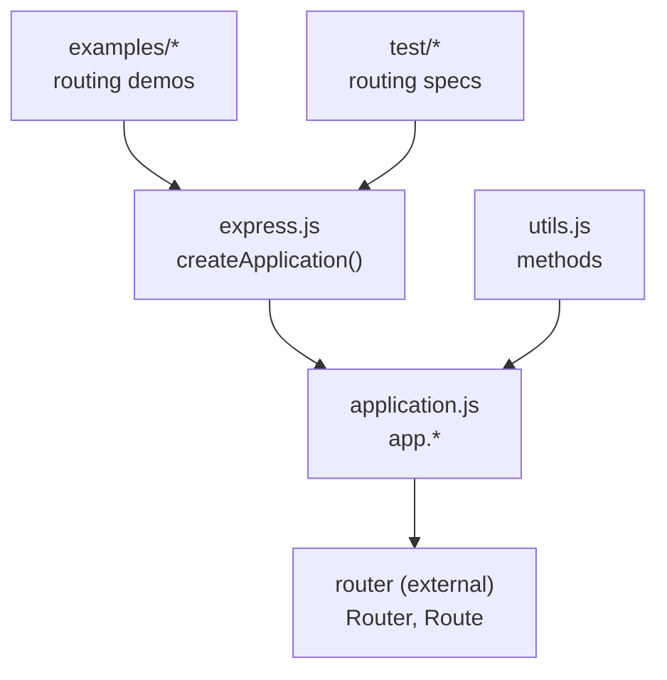
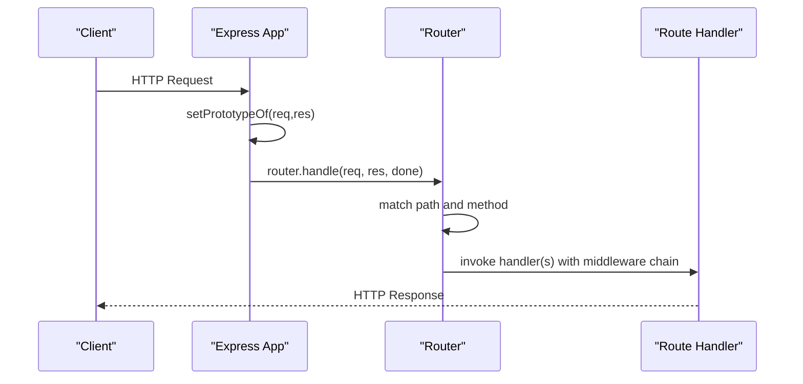
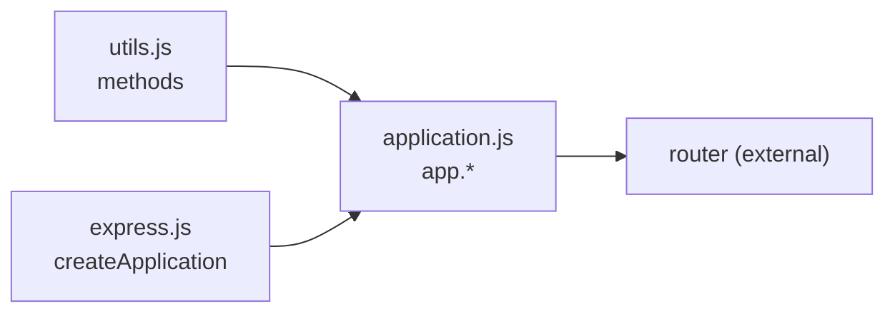

# Routing System

<cite>
**Referenced Files in This Document**
- [application.js](file://lib/application.js)
- [express.js](file://lib/express.js)
- [utils.js](file://lib/utils.js)
- [index.js](file://examples/route-map/index.js)
- [index.js](file://examples/multi-router/index.js)
- [api_v1.js](file://examples/multi-router/controllers/api_v1.js)
- [api_v2.js](file://examples/multi-router/controllers/api_v2.js)
- [index.js](file://examples/route-middleware/index.js)
- [index.js](file://examples/params/index.js)
- [index.js](file://examples/resource/index.js)
- [index.js](file://examples/route-separation/index.js)
- [site.js](file://examples/route-separation/site.js)
- [user.js](file://examples/route-separation/user.js)
- [app.route.js](file://test/app.route.js)
- [app.param.js](file://test/app.param.js)
</cite>

## Table of Contents
1. [Introduction](#introduction)
2. [Project Structure](#project-structure)
3. [Core Components](#core-components)
4. [Architecture Overview](#architecture-overview)
5. [Detailed Component Analysis](#detailed-component-analysis)
6. [Dependency Analysis](#dependency-analysis)
7. [Performance Considerations](#performance-considerations)
8. [Troubleshooting Guide](#troubleshooting-guide)
9. [Conclusion](#conclusion)
10. [Appendices](#appendices)

## Introduction
This document explains the Express.js routing system with a focus on route definition, parameter handling, nested routing, middleware integration, and error handling. It synthesizes the routing behavior from the core application layer and demonstrates practical patterns via examples and tests. Topics include:
- HTTP method routing (app.get, app.post, app.put, app.delete, etc.)
- Path pattern matching and parameter extraction
- Route handler composition and middleware integration
- Dynamic parameters, wildcard patterns, and regular expression matching
- Nested routing via sub-routers and modular route organization
- Route introspection and mapping for development and debugging
- Performance characteristics and optimization strategies for large routing tables

## Project Structure
Express’s routing is implemented in the application layer and delegates to a dedicated router. The routing surface is exposed through the application prototype, which proxies HTTP verbs and route composition to the underlying router. Utilities provide the list of supported HTTP methods.

**Diagram sources**
- [express.js:36-56](file://lib/express.js#L36-L56)
- [application.js:471-503](file://lib/application.js#L471-L503)
- [utils.js:29](file://lib/utils.js#L29)

**Section sources**
- [express.js:36-56](file://lib/express.js#L36-L56)
- [application.js:471-503](file://lib/application.js#L471-L503)
- [utils.js:29](file://lib/utils.js#L29)

## Core Components
- Application routing surface: The application prototype exposes HTTP verb methods (get, post, put, delete, etc.) and route composition (app.route). These delegate to the internal router instance.
- Router and Route: Express uses an external router to manage routes and middleware stacks. The application lazily creates a router instance configured with case sensitivity and strictness settings.
- Parameter handling: app.param registers parameter processors that transform or validate route parameters before reaching route handlers.
- Middleware: app.use mounts middleware globally or under a path, and routes can compose middleware stacks per path/method.

Key implementation anchors:
- HTTP method delegation: [application.js:471-503](file://lib/application.js#L471-L503)
- Route composition: [application.js:256-258](file://lib/application.js#L256-L258)
- Parameter registration: [application.js:322-334](file://lib/application.js#L322-L334)
- Router creation and settings: [application.js:59-83](file://lib/application.js#L59-L83)
- Supported HTTP methods: [utils.js:29](file://lib/utils.js#L29)

**Section sources**
- [application.js:471-503](file://lib/application.js#L471-L503)
- [application.js:256-258](file://lib/application.js#L256-L258)
- [application.js:322-334](file://lib/application.js#L322-L334)
- [application.js:59-83](file://lib/application.js#L59-L83)
- [utils.js:29](file://lib/utils.js#L29)

## Architecture Overview
Express routes are handled by a router instance that manages ordered middleware stacks and matches incoming requests against registered paths. The application’s handle method sets up request/response prototypes and invokes the router.

**Diagram sources**
- [application.js:152-178](file://lib/application.js#L152-L178)
- [application.js:59-83](file://lib/application.js#L59-L83)

**Section sources**
- [application.js:152-178](file://lib/application.js#L152-L178)
- [application.js:59-83](file://lib/application.js#L59-L83)

## Detailed Component Analysis

### HTTP Method Routing and Route Composition
- Verb methods: app.get, app.post, app.put, app.delete, etc., are dynamically delegated to the router. When invoked with a single argument, app.get retrieves a setting; otherwise it creates a route and applies the verb.
- Route composition: app.route(path) returns a Route instance that supports chaining verb methods and middleware.

Practical examples:
- Chained verbs on a single route: [app.route.js:10-21](file://test/app.route.js#L10-L21)
- Order of all followed by specific verbs: [app.route.js:26-40](file://test/app.route.js#L26-L40)
- Dynamic parameter capture: [app.route.js:45-53](file://test/app.route.js#L45-L53)
- Empty route behavior: [app.route.js:58-63](file://test/app.route.js#L58-L63)

**Section sources**
- [application.js:471-503](file://lib/application.js#L471-L503)
- [application.js:256-258](file://lib/application.js#L256-L258)
- [app.route.js:10-21](file://test/app.route.js#L10-L21)
- [app.route.js:26-40](file://test/app.route.js#L26-L40)
- [app.route.js:45-53](file://test/app.route.js#L45-L53)
- [app.route.js:58-63](file://test/app.route.js#L58-L63)

### Parameter Handling and Validation
- app.param(name, fn) registers a parameter processor that runs when a route declares a parameter. Processors can transform values, validate inputs, or short-circuit matching by delegating to the next route.
- Multiple parameters can be mapped at once, and processors run once per unique parameter value per request.

Practical examples:
- Single and array parameter mapping: [app.param.js:11-36](file://test/app.param.js#L11-L36)
- Parameter transformation and validation: [app.param.js:43-58](file://test/app.param.js#L43-L58)
- Parameter lifecycle and uniqueness: [app.param.js:65-86](file://test/app.param.js#L65-L86)
- Defer to next route: [app.param.js:220-236](file://test/app.param.js#L220-L236)
- Encoded values handling: [app.param.js:164-177](file://test/app.param.js#L164-L177)

**Section sources**
- [application.js:322-334](file://lib/application.js#L322-L334)
- [app.param.js:11-36](file://test/app.param.js#L11-L36)
- [app.param.js:43-58](file://test/app.param.js#L43-L58)
- [app.param.js:65-86](file://test/app.param.js#L65-L86)
- [app.param.js:220-236](file://test/app.param.js#L220-L236)
- [app.param.js:164-177](file://test/app.param.js#L164-L177)

### Middleware Integration Within Routes
- app.use(fn) mounts middleware globally or under a path. When mounting another Express app, it preserves request/response prototypes during handling.
- Route handlers can be composed with middleware functions that run before the final handler.

Practical examples:
- Middleware composition with route handlers: [index.js:74-84](file://examples/route-middleware/index.js#L74-L84)
- Mounted app behavior: [application.js:229-241](file://lib/application.js#L229-L241)

**Section sources**
- [application.js:190-244](file://lib/application.js#L190-L244)
- [application.js:229-241](file://lib/application.js#L229-L241)
- [index.js:74-84](file://examples/route-middleware/index.js#L74-L84)

### Dynamic Route Parameters, Wildcards, and Regular Expression Matching
- Dynamic segments: Parameters like :id capture path segments and populate req.params.
- Range-style patterns: Resource examples demonstrate capturing numeric ranges and optional format segments.
- Regex-like patterns: Examples use brace-delimited patterns to encode constraints (e.g., :id{/:op}).

Practical examples:
- Dynamic parameter capture: [index.js:55-57](file://examples/params/index.js#L55-L57)
- Range-style parameter capture: [index.js:63-68](file://examples/params/index.js#L63-L68)
- Regex-like constraint pattern: [index.js:41](file://examples/route-separation/index.js#L41)
- Resource range and format handling: [index.js:15-26](file://examples/resource/index.js#L15-L26)

**Section sources**
- [index.js:55-57](file://examples/params/index.js#L55-L57)
- [index.js:63-68](file://examples/params/index.js#L63-L68)
- [index.js:41](file://examples/route-separation/index.js#L41)
- [index.js:15-26](file://examples/resource/index.js#L15-L26)

### Nested Routing Through Sub-Routers and Modular Organization
- Sub-routers: express.Router() creates isolated routers that can be mounted under a path.
- Modular separation: Controllers/modules define route groups that are mounted into the main application.

Practical examples:
- Mounting sub-routers: [index.js:7-8](file://examples/multi-router/index.js#L7-L8)
- API v1 and v2 sub-routers: [api_v1.js:5-15](file://examples/multi-router/controllers/api_v1.js#L5-L15), [api_v2.js:5-15](file://examples/multi-router/controllers/api_v2.js#L5-L15)
- Modular route separation: [index.js:13-15](file://examples/route-separation/index.js#L13-L15), [user.js:14-24](file://examples/route-separation/user.js#L14-L24)

**Section sources**
- [index.js:7-8](file://examples/multi-router/index.js#L7-L8)
- [api_v1.js:5-15](file://examples/multi-router/controllers/api_v1.js#L5-L15)
- [api_v2.js:5-15](file://examples/multi-router/controllers/api_v2.js#L5-L15)
- [index.js:13-15](file://examples/route-separation/index.js#L13-L15)
- [user.js:14-24](file://examples/route-separation/user.js#L14-L24)

### Route Mapping and Introspection
- Manual mapping: An example demonstrates traversing a nested object tree to register routes for various HTTP methods and paths.
- Route introspection: The application exposes a router instance whose internal structure can be leveraged by tooling for inspection.

Practical examples:
- Recursive route mapping: [index.js:14-29](file://examples/route-map/index.js#L14-L29)
- Nested route registration: [index.js:55-69](file://examples/route-map/index.js#L55-L69)

**Section sources**
- [index.js:14-29](file://examples/route-map/index.js#L14-L29)
- [index.js:55-69](file://examples/route-map/index.js#L55-L69)

### Error Handling in Routing Contexts
- Throwing errors or calling next with an error object propagates errors through the middleware chain.
- Route-specific middleware can handle errors introduced by parameter processors or route handlers.
- Tests demonstrate promise-based error propagation and handling.

Practical examples:
- Throwing inside parameter processor: [app.param.js:182-194](file://test/app.param.js#L182-L194)
- Defer to next route from parameter processor: [app.param.js:220-236](file://test/app.param.js#L220-L236)
- Promise rejection handling: [app.route.js:66-86](file://test/app.route.js#L66-L86), [app.route.js:129-149](file://test/app.route.js#L129-L149)

**Section sources**
- [app.param.js:182-194](file://test/app.param.js#L182-L194)
- [app.param.js:220-236](file://test/app.param.js#L220-L236)
- [app.route.js:66-86](file://test/app.route.js#L66-L86)
- [app.route.js:129-149](file://test/app.route.js#L129-L149)

### Practical Examples Catalog
- Route mapping and nesting: [index.js:14-69](file://examples/route-map/index.js#L14-L69)
- Multi-router composition: [index.js:7-8](file://examples/multi-router/index.js#L7-L8), [api_v1.js:5-15](file://examples/multi-router/controllers/api_v1.js#L5-L15), [api_v2.js:5-15](file://examples/multi-router/controllers/api_v2.js#L5-L15)
- Route middleware and authorization: [index.js:25-58](file://examples/route-middleware/index.js#L25-L58), [index.js:74-84](file://examples/route-middleware/index.js#L74-L84)
- Parameter parsing and validation: [index.js:23-41](file://examples/params/index.js#L23-L41), [index.js:55-68](file://examples/params/index.js#L55-L68)
- Resource-style routes with ranges and formats: [index.js:13-26](file://examples/resource/index.js#L13-L26), [index.js:42-68](file://examples/resource/index.js#L42-L68)
- Route separation and modular controllers: [index.js:13-50](file://examples/route-separation/index.js#L13-L50), [user.js:14-47](file://examples/route-separation/user.js#L14-L47), [site.js:3-5](file://examples/route-separation/site.js#L3-L5)

**Section sources**
- [index.js:14-69](file://examples/route-map/index.js#L14-L69)
- [index.js:7-8](file://examples/multi-router/index.js#L7-L8)
- [api_v1.js:5-15](file://examples/multi-router/controllers/api_v1.js#L5-L15)
- [api_v2.js:5-15](file://examples/multi-router/controllers/api_v2.js#L5-L15)
- [index.js:25-58](file://examples/route-middleware/index.js#L25-L58)
- [index.js:74-84](file://examples/route-middleware/index.js#L74-L84)
- [index.js:23-41](file://examples/params/index.js#L23-L41)
- [index.js:55-68](file://examples/params/index.js#L55-L68)
- [index.js:13-26](file://examples/resource/index.js#L13-L26)
- [index.js:42-68](file://examples/resource/index.js#L42-L68)
- [index.js:13-50](file://examples/route-separation/index.js#L13-L50)
- [user.js:14-47](file://examples/route-separation/user.js#L14-L47)
- [site.js:3-5](file://examples/route-separation/site.js#L3-L5)

## Dependency Analysis
Express’s routing depends on:
- Router (external): Provides route matching, middleware stacks, and handler invocation.
- HTTP methods: Derived from Node’s http.METHODS and normalized to lowercase.
- Application layer: Lazily initializes a router with settings for case sensitivity and strictness.

**Diagram sources**
- [utils.js:29](file://lib/utils.js#L29)
- [application.js:471-503](file://lib/application.js#L471-L503)
- [express.js:36-56](file://lib/express.js#L36-L56)

**Section sources**
- [utils.js:29](file://lib/utils.js#L29)
- [application.js:471-503](file://lib/application.js#L471-L503)
- [express.js:36-56](file://lib/express.js#L36-L56)

## Performance Considerations
- Route table size: Large routing tables increase matching overhead. Prefer grouping related routes under shared prefixes and using sub-routers to reduce global matching cost.
- Parameter processors: Keep parameter transformations lightweight; avoid heavy synchronous work in app.param to prevent repeated computation.
- Middleware ordering: Place fast-fail middleware early to minimize downstream processing for non-matching requests.
- Case sensitivity and strictness: Enabling strict routing avoids ambiguous matches; enabling case-sensitive routing reduces unnecessary comparisons when appropriate.
- Static assets: Serve static files via optimized middleware to reduce dynamic route processing time.

[No sources needed since this section provides general guidance]

## Troubleshooting Guide
Common issues and remedies:
- Route not matched: Verify HTTP method and path casing; confirm strict routing settings; check for conflicting middleware that might short-circuit the request.
- Parameter parsing errors: Ensure parameter processors handle invalid inputs gracefully and call next with an error to trigger error handlers.
- Middleware not executing: Confirm middleware is mounted before the target route and that next() is called to propagate to subsequent middleware.
- Sub-router not responding: Ensure the sub-router is mounted under the intended path and that the mountpoint does not consume the remainder of the path unintentionally.

**Section sources**
- [application.js:190-244](file://lib/application.js#L190-L244)
- [app.param.js:182-194](file://test/app.param.js#L182-L194)
- [index.js:7-8](file://examples/multi-router/index.js#L7-L8)

## Conclusion
Express’s routing system combines a clean surface API with a powerful router to support flexible route definition, parameter handling, middleware composition, and nested modular organization. By leveraging sub-routers, parameter processors, and route composition, applications can scale effectively while maintaining readability. Proper configuration of case sensitivity and strictness, along with thoughtful middleware ordering, ensures predictable and performant routing behavior.

[No sources needed since this section summarizes without analyzing specific files]

## Appendices

### Appendix A: HTTP Methods Supported by Express
Express derives supported HTTP methods from Node’s http.METHODS and normalizes them to lowercase.

**Section sources**
- [utils.js:29](file://lib/utils.js#L29)

### Appendix B: Route Definition Patterns
- Single-method route: app.get('/path', handler)
- Multi-method route: app.route('/path').get(handler).post(handler)
- Dynamic parameter: app.get('/users/:id', handler)
- Parameter constraints: app.get('/user/:id{/:op}', handler)
- Resource-style: app.resource('/users', controller)

**Section sources**
- [application.js:471-503](file://lib/application.js#L471-L503)
- [index.js:41](file://examples/route-separation/index.js#L41)
- [index.js:13-26](file://examples/resource/index.js#L13-L26)