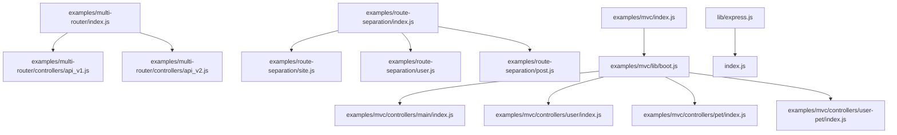
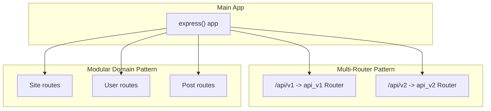
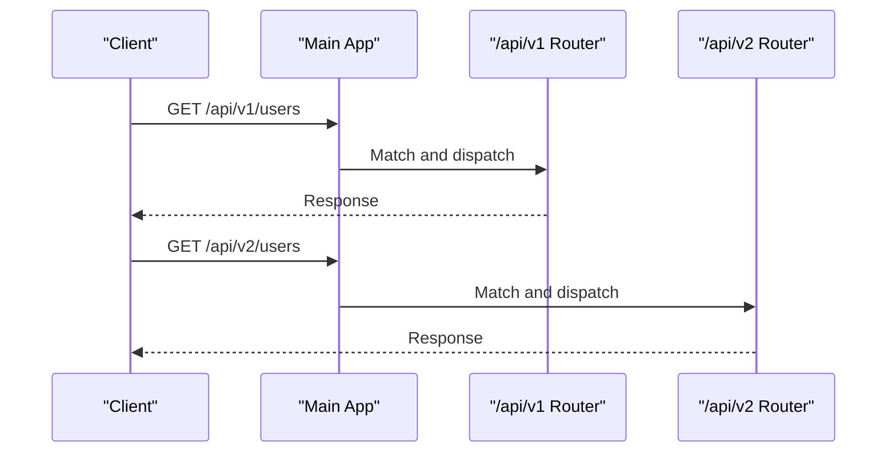
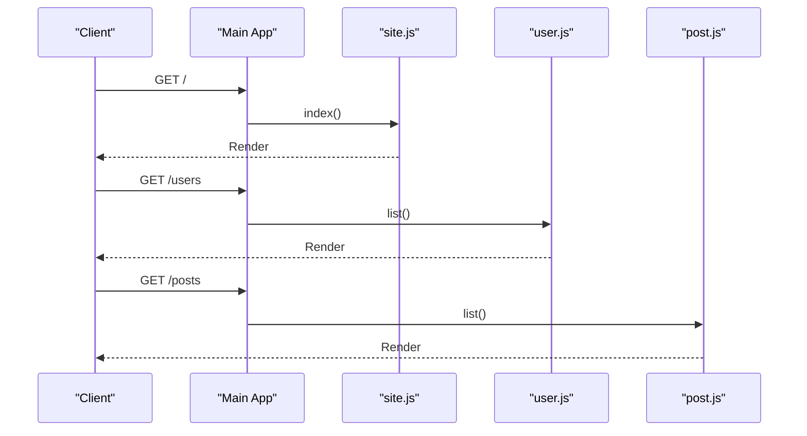
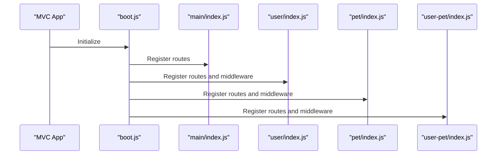
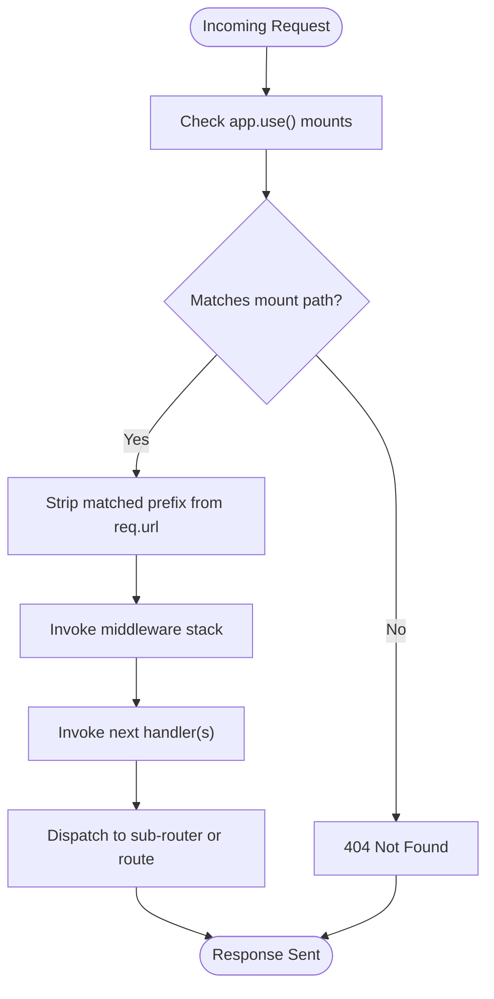
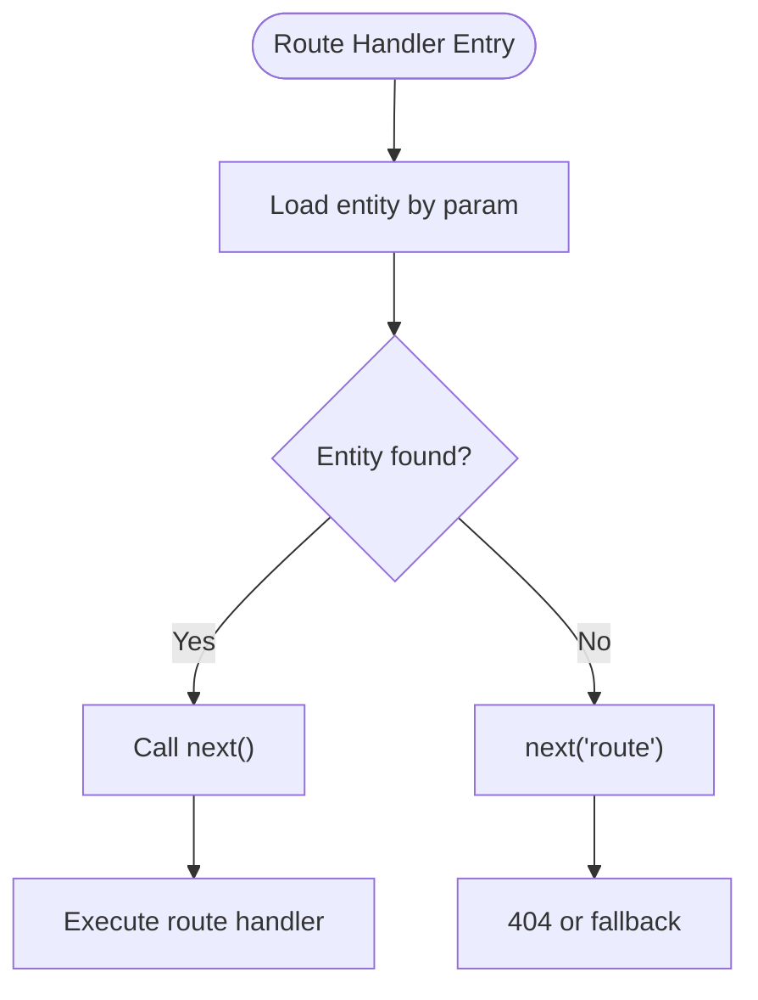
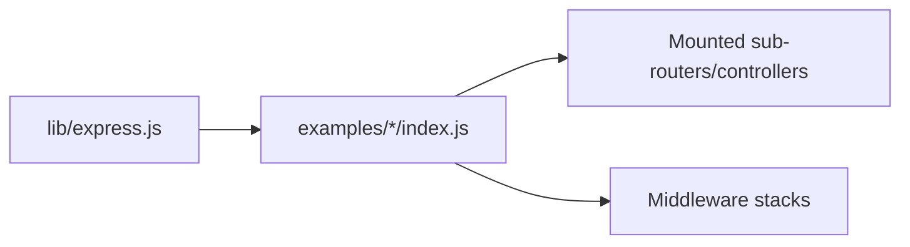

# Nested Routing

<cite>
**Referenced Files in This Document**
- [index.js](file://index.js)
- [lib/express.js](file://lib/express.js)
- [examples/multi-router/index.js](file://examples/multi-router/index.js)
- [examples/multi-router/controllers/api_v1.js](file://examples/multi-router/controllers/api_v1.js)
- [examples/multi-router/controllers/api_v2.js](file://examples/multi-router/controllers/api_v2.js)
- [examples/route-separation/index.js](file://examples/route-separation/index.js)
- [examples/route-separation/post.js](file://examples/route-separation/post.js)
- [examples/route-separation/user.js](file://examples/route-separation/user.js)
- [examples/route-separation/site.js](file://examples/route-separation/site.js)
- [examples/mvc/index.js](file://examples/mvc/index.js)
- [examples/mvc/lib/boot.js](file://examples/mvc/lib/boot.js)
- [examples/mvc/controllers/main/index.js](file://examples/mvc/controllers/main/index.js)
- [examples/mvc/controllers/user/index.js](file://examples/mvc/controllers/user/index.js)
- [examples/mvc/controllers/pet/index.js](file://examples/mvc/controllers/pet/index.js)
- [examples/mvc/controllers/user-pet/index.js](file://examples/mvc/controllers/user-pet/index.js)
- [test/app.use.js](file://test/app.use.js)
</cite>

## Table of Contents
1. [Introduction](#introduction)
2. [Project Structure](#project-structure)
3. [Core Components](#core-components)
4. [Architecture Overview](#architecture-overview)
5. [Detailed Component Analysis](#detailed-component-analysis)
6. [Dependency Analysis](#dependency-analysis)
7. [Performance Considerations](#performance-considerations)
8. [Troubleshooting Guide](#troubleshooting-guide)
9. [Conclusion](#conclusion)
10. [Appendices](#appendices)

## Introduction
This document explains nested routing and router composition in Express.js using concrete examples from the repository. It covers creating and mounting sub-routers, composing routers hierarchically, path prefixing, middleware integration, route isolation, and parameter handling. Practical patterns are demonstrated through modular route structures, MVC-style controller separation, and multi-version API routing. Guidance is also provided on performance, memory management, and debugging nested routing setups.

## Project Structure
The repository organizes routing examples under the examples directory, with modular controllers and separate concerns for different domains. The core Express module exposes the Router constructor and integrates with the application layer.

**Diagram sources**
- [examples/multi-router/index.js:1-19](file://examples/multi-router/index.js#L1-L19)
- [examples/multi-router/controllers/api_v1.js:1-16](file://examples/multi-router/controllers/api_v1.js#L1-L16)
- [examples/multi-router/controllers/api_v2.js:1-16](file://examples/multi-router/controllers/api_v2.js#L1-L16)
- [examples/route-separation/index.js:1-56](file://examples/route-separation/index.js#L1-L56)
- [examples/route-separation/site.js:1-6](file://examples/route-separation/site.js#L1-L6)
- [examples/route-separation/user.js:1-48](file://examples/route-separation/user.js#L1-L48)
- [examples/route-separation/post.js:1-14](file://examples/route-separation/post.js#L1-L14)
- [examples/mvc/index.js:1-96](file://examples/mvc/index.js#L1-L96)
- [examples/mvc/lib/boot.js](file://examples/mvc/lib/boot.js)
- [examples/mvc/controllers/main/index.js:1-6](file://examples/mvc/controllers/main/index.js#L1-L6)
- [examples/mvc/controllers/user/index.js:1-42](file://examples/mvc/controllers/user/index.js#L1-L42)
- [examples/mvc/controllers/pet/index.js:1-32](file://examples/mvc/controllers/pet/index.js#L1-L32)
- [examples/mvc/controllers/user-pet/index.js:1-23](file://examples/mvc/controllers/user-pet/index.js#L1-L23)
- [lib/express.js:1-82](file://lib/express.js#L1-L82)
- [index.js:1-12](file://index.js#L1-L12)

**Section sources**
- [lib/express.js:1-82](file://lib/express.js#L1-L82)
- [index.js:1-12](file://index.js#L1-L12)

## Core Components
- Express application and Router: The Express module exposes the Router constructor and integrates request/response prototypes. Sub-routers are created via the Router constructor and mounted onto the main application.
- Middleware pipeline: Express supports mounting middleware and applications at specific paths, enabling path prefixing and modular composition.
- Event emission: Mounted applications emit a “mount” event with the parent application reference, useful for diagnostics and lifecycle hooks.

Key implementation references:
- Router exposure and application creation: [lib/express.js:69-71](file://lib/express.js#L69-L71), [lib/express.js:36-56](file://lib/express.js#L36-L56)
- Mounting behavior and path stripping: [test/app.use.js:284-294](file://test/app.use.js#L284-L294), [test/app.use.js:322-341](file://test/app.use.js#L322-L341)
- Mount event emission: [test/app.use.js:9-19](file://test/app.use.js#L9-L19), [test/app.use.js:63-69](file://test/app.use.js#L63-L69)

**Section sources**
- [lib/express.js:36-71](file://lib/express.js#L36-L71)
- [test/app.use.js:9-19](file://test/app.use.js#L9-L19)
- [test/app.use.js:284-341](file://test/app.use.js#L284-L341)
- [test/app.use.js:63-69](file://test/app.use.js#L63-L69)

## Architecture Overview
The examples demonstrate two primary patterns:
- Multi-version API routing: Mount separate sub-routers under distinct path prefixes to version APIs.
- Modular domain routing: Separate concerns by domain (e.g., users, posts, site) and compose them into the main application.

**Diagram sources**
- [examples/multi-router/index.js:7-8](file://examples/multi-router/index.js#L7-L8)
- [examples/multi-router/controllers/api_v1.js:5-15](file://examples/multi-router/controllers/api_v1.js#L5-L15)
- [examples/multi-router/controllers/api_v2.js:5-15](file://examples/multi-router/controllers/api_v2.js#L5-L15)
- [examples/route-separation/index.js:34-50](file://examples/route-separation/index.js#L34-L50)

## Detailed Component Analysis

### Multi-Version API Composition
This pattern mounts separate sub-routers under versioned prefixes, isolating routes and enabling independent evolution.

**Diagram sources**
- [examples/multi-router/index.js:7-8](file://examples/multi-router/index.js#L7-L8)
- [examples/multi-router/controllers/api_v1.js:7-13](file://examples/multi-router/controllers/api_v1.js#L7-L13)
- [examples/multi-router/controllers/api_v2.js:7-13](file://examples/multi-router/controllers/api_v2.js#L7-L13)

Implementation highlights:
- Sub-router creation and export: [examples/multi-router/controllers/api_v1.js:5-15](file://examples/multi-router/controllers/api_v1.js#L5-L15), [examples/multi-router/controllers/api_v2.js:5-15](file://examples/multi-router/controllers/api_v2.js#L5-L15)
- Mounting under path prefixes: [examples/multi-router/index.js:7-8](file://examples/multi-router/index.js#L7-L8)

**Section sources**
- [examples/multi-router/index.js:7-8](file://examples/multi-router/index.js#L7-L8)
- [examples/multi-router/controllers/api_v1.js:5-15](file://examples/multi-router/controllers/api_v1.js#L5-L15)
- [examples/multi-router/controllers/api_v2.js:5-15](file://examples/multi-router/controllers/api_v2.js#L5-L15)

### Modular Domain Routing
This pattern separates concerns by domain and composes them into the main application. It demonstrates route isolation and middleware integration.

**Diagram sources**
- [examples/route-separation/index.js:36-50](file://examples/route-separation/index.js#L36-L50)
- [examples/route-separation/site.js:3-5](file://examples/route-separation/site.js#L3-L5)
- [examples/route-separation/user.js:10-12](file://examples/route-separation/user.js#L10-L12)
- [examples/route-separation/post.js:11-13](file://examples/route-separation/post.js#L11-L13)

Additional patterns:
- Parameter-based middleware for domain-specific loading: [examples/route-separation/index.js:41-46](file://examples/route-separation/index.js#L41-L46), [examples/route-separation/user.js:14-24](file://examples/route-separation/user.js#L14-L24)
- Route isolation with next('route'): [examples/mvc/controllers/user/index.js:18-22](file://examples/mvc/controllers/user/index.js#L18-L22)

**Section sources**
- [examples/route-separation/index.js:36-50](file://examples/route-separation/index.js#L36-L50)
- [examples/route-separation/site.js:3-5](file://examples/route-separation/site.js#L3-L5)
- [examples/route-separation/user.js:14-24](file://examples/route-separation/user.js#L14-L24)
- [examples/mvc/controllers/user/index.js:18-22](file://examples/mvc/controllers/user/index.js#L18-L22)

### MVC Bootstrapping and Controller Composition
The MVC example shows a bootstrapper that wires controllers and demonstrates controller-level middleware and parameter handling.

**Diagram sources**
- [examples/mvc/index.js:75-77](file://examples/mvc/index.js#L75-L77)
- [examples/mvc/lib/boot.js](file://examples/mvc/lib/boot.js)
- [examples/mvc/controllers/main/index.js:3-5](file://examples/mvc/controllers/main/index.js#L3-L5)
- [examples/mvc/controllers/user/index.js:11-22](file://examples/mvc/controllers/user/index.js#L11-L22)
- [examples/mvc/controllers/pet/index.js:11-16](file://examples/mvc/controllers/pet/index.js#L11-L16)
- [examples/mvc/controllers/user-pet/index.js:9-10](file://examples/mvc/controllers/user-pet/index.js#L9-L10)

**Section sources**
- [examples/mvc/index.js:75-77](file://examples/mvc/index.js#L75-L77)
- [examples/mvc/lib/boot.js](file://examples/mvc/lib/boot.js)
- [examples/mvc/controllers/main/index.js:3-5](file://examples/mvc/controllers/main/index.js#L3-L5)
- [examples/mvc/controllers/user/index.js:11-22](file://examples/mvc/controllers/user/index.js#L11-L22)
- [examples/mvc/controllers/pet/index.js:11-16](file://examples/mvc/controllers/pet/index.js#L11-L16)
- [examples/mvc/controllers/user-pet/index.js:9-10](file://examples/mvc/controllers/user-pet/index.js#L9-L10)

### Router Middleware Integration and Path Prefixing
Express supports mounting middleware and applications at specific paths, enabling path prefixing and modular composition. Tests demonstrate:
- Mounting middleware stacks at path prefixes
- Stripping the matched prefix from the URL before invoking downstream handlers
- Dynamic path segments and regular expressions as mount points

**Diagram sources**
- [test/app.use.js:284-294](file://test/app.use.js#L284-L294)
- [test/app.use.js:322-341](file://test/app.use.js#L322-L341)
- [test/app.use.js:505-528](file://test/app.use.js#L505-L528)

**Section sources**
- [test/app.use.js:284-294](file://test/app.use.js#L284-L294)
- [test/app.use.js:322-341](file://test/app.use.js#L322-L341)
- [test/app.use.js:505-528](file://test/app.use.js#L505-L528)

### Router Parameter Handling and Isolation
Controllers can implement parameter-based middleware to load domain entities and signal route isolation using next('route') when resources are not found. This pattern keeps route handlers focused and reusable.

**Diagram sources**
- [examples/mvc/controllers/user/index.js:11-22](file://examples/mvc/controllers/user/index.js#L11-L22)
- [examples/mvc/controllers/pet/index.js:11-16](file://examples/mvc/controllers/pet/index.js#L11-L16)

**Section sources**
- [examples/mvc/controllers/user/index.js:11-22](file://examples/mvc/controllers/user/index.js#L11-L22)
- [examples/mvc/controllers/pet/index.js:11-16](file://examples/mvc/controllers/pet/index.js#L11-L16)

## Dependency Analysis
The main application depends on:
- Express core for Router and application creation
- Mounted sub-routers/controllers for domain-specific logic
- Middleware for logging, parsing, sessions, and static assets

**Diagram sources**
- [lib/express.js:69-71](file://lib/express.js#L69-L71)
- [examples/multi-router/index.js:7-8](file://examples/multi-router/index.js#L7-L8)
- [examples/route-separation/index.js:24-32](file://examples/route-separation/index.js#L24-L32)
- [examples/mvc/index.js:33-50](file://examples/mvc/index.js#L33-L50)

**Section sources**
- [lib/express.js:69-71](file://lib/express.js#L69-L71)
- [examples/multi-router/index.js:7-8](file://examples/multi-router/index.js#L7-L8)
- [examples/route-separation/index.js:24-32](file://examples/route-separation/index.js#L24-L32)
- [examples/mvc/index.js:33-50](file://examples/mvc/index.js#L33-L50)

## Performance Considerations
- Minimize deep nesting: Each additional mount adds traversal overhead; prefer shallow hierarchies when feasible.
- Use targeted middleware: Apply domain-specific middleware only where needed to reduce unnecessary processing.
- Avoid excessive dynamic segments: Overuse of dynamic path segments can increase matching complexity; prefer static prefixes when possible.
- Leverage caching: For expensive computations in parameter loaders, cache results to avoid repeated work.
- Monitor memory: Keep sub-routers scoped and avoid retaining large closures in route handlers to prevent memory leaks.

## Troubleshooting Guide
Common issues and remedies:
- Routes not matching under a mount point: Verify the mount path and ensure the prefix matches the incoming URL. Confirm that path stripping does not remove unintended segments.
- Middleware order: Ensure middleware ordering aligns with intended execution flow; incorrect order can bypass critical logic.
- Parameter loading failures: Use next('route') to gracefully fall back when a resource is not found; otherwise, propagate errors to centralized error handlers.
- Debugging nested routing: Listen for the “mount” event on mounted applications to confirm composition and parent-child relationships.

References for mount behavior and events:
- Mounting apps and path prefixes: [test/app.use.js:37-61](file://test/app.use.js#L37-L61)
- Mount event emission: [test/app.use.js:9-19](file://test/app.use.js#L9-L19), [test/app.use.js:63-69](file://test/app.use.js#L63-L69)
- Path prefix stripping: [test/app.use.js:284-294](file://test/app.use.js#L284-L294)

**Section sources**
- [test/app.use.js:37-61](file://test/app.use.js#L37-L61)
- [test/app.use.js:9-19](file://test/app.use.js#L9-L19)
- [test/app.use.js:63-69](file://test/app.use.js#L63-L69)
- [test/app.use.js:284-294](file://test/app.use.js#L284-L294)

## Conclusion
Nested routing and router composition in Express enable scalable, modular architectures. By creating sub-routers, mounting them under path prefixes, integrating middleware, and leveraging parameter-based middleware for isolation, applications can evolve while maintaining clean separation of concerns. The provided examples illustrate practical patterns for multi-version APIs, modular domains, and MVC-style composition, along with guidance for performance, memory management, and debugging.

## Appendices
- Practical examples to explore:
  - Multi-version API routing: [examples/multi-router/index.js:7-8](file://examples/multi-router/index.js#L7-L8), [examples/multi-router/controllers/api_v1.js:5-15](file://examples/multi-router/controllers/api_v1.js#L5-L15), [examples/multi-router/controllers/api_v2.js:5-15](file://examples/multi-router/controllers/api_v2.js#L5-L15)
  - Modular domain routing: [examples/route-separation/index.js:34-50](file://examples/route-separation/index.js#L34-L50), [examples/route-separation/user.js:14-24](file://examples/route-separation/user.js#L14-L24), [examples/route-separation/post.js:11-13](file://examples/route-separation/post.js#L11-L13)
  - MVC composition: [examples/mvc/index.js:75-77](file://examples/mvc/index.js#L75-L77), [examples/mvc/lib/boot.js](file://examples/mvc/lib/boot.js), [examples/mvc/controllers/user/index.js:11-22](file://examples/mvc/controllers/user/index.js#L11-L22)