# RESTful Patterns

<cite>
**Referenced Files in This Document**
- [index.js](file://examples/resource/index.js)
- [api_v1.js](file://examples/multi-router/controllers/api_v1.js)
- [api_v2.js](file://examples/multi-router/controllers/api_v2.js)
- [index.js](file://examples/web-service/index.js)
- [index.js](file://examples/content-negotiation/index.js)
- [index.js](file://examples/mvc/controllers/user/index.js)
- [index.js](file://examples/mvc/controllers/pet/index.js)
- [db.js](file://examples/mvc/db.js)
- [index.js](file://examples/error-pages/index.js)
- [index.js](file://examples/params/index.js)
- [index.js](file://examples/route-map/index.js)
- [index.js](file://examples/route-middleware/index.js)
</cite>

## Table of Contents
1. [Introduction](#introduction)
2. [Project Structure](#project-structure)
3. [Core Components](#core-components)
4. [Architecture Overview](#architecture-overview)
5. [Detailed Component Analysis](#detailed-component-analysis)
6. [Dependency Analysis](#dependency-analysis)
7. [Performance Considerations](#performance-considerations)
8. [Troubleshooting Guide](#troubleshooting-guide)
9. [Conclusion](#conclusion)
10. [Appendices](#appendices)

## Introduction
This document explains REST architectural principles and how they map to Express.js routing patterns. It covers how CRUD operations align with HTTP methods, resource naming conventions, and HTTP status codes. It also documents RESTful route design patterns, resource hierarchy, collection versus individual resource endpoints, query parameter usage for filtering, sorting, and pagination, and demonstrates controller implementation patterns. Practical examples are drawn from the repository’s examples to illustrate versioning strategies, content negotiation, error handling, and middleware-driven authorization.

## Project Structure
The repository organizes REST-related patterns across multiple example applications:
- Resource-based routing and ad-hoc resource helpers
- Multi-version API routers
- Web service with API key validation and JSON responses
- Content negotiation for multiple response formats
- MVC-style controllers with shared middleware
- Error pages and centralized error handling
- Parameter parsing and validation
- Route mapping and nested resource hierarchies
- Route middleware for authentication and authorization

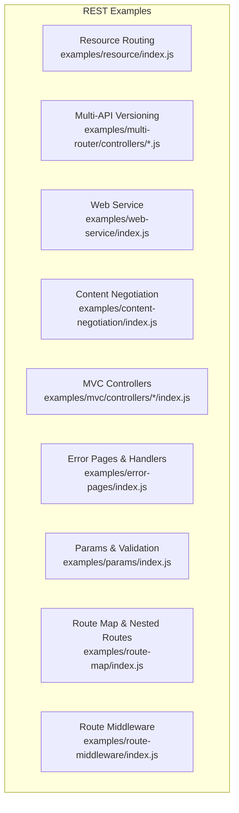

**Diagram sources**
- [index.js:1-96](file://examples/resource/index.js#L1-L96)
- [api_v1.js:1-16](file://examples/multi-router/controllers/api_v1.js#L1-L16)
- [api_v2.js:1-16](file://examples/multi-router/controllers/api_v2.js#L1-L16)
- [index.js:1-118](file://examples/web-service/index.js#L1-L118)
- [index.js:1-47](file://examples/content-negotiation/index.js#L1-L47)
- [index.js:1-42](file://examples/mvc/controllers/user/index.js#L1-L42)
- [index.js:1-32](file://examples/mvc/controllers/pet/index.js#L1-L32)
- [index.js:1-104](file://examples/error-pages/index.js#L1-L104)
- [index.js:1-75](file://examples/params/index.js#L1-L75)
- [index.js:1-76](file://examples/route-map/index.js#L1-L76)
- [index.js:1-91](file://examples/route-middleware/index.js#L1-L91)

**Section sources**
- [index.js:1-96](file://examples/resource/index.js#L1-L96)
- [api_v1.js:1-16](file://examples/multi-router/controllers/api_v1.js#L1-L16)
- [api_v2.js:1-16](file://examples/multi-router/controllers/api_v2.js#L1-L16)
- [index.js:1-118](file://examples/web-service/index.js#L1-L118)
- [index.js:1-47](file://examples/content-negotiation/index.js#L1-L47)
- [index.js:1-42](file://examples/mvc/controllers/user/index.js#L1-L42)
- [index.js:1-32](file://examples/mvc/controllers/pet/index.js#L1-L32)
- [index.js:1-104](file://examples/error-pages/index.js#L1-L104)
- [index.js:1-75](file://examples/params/index.js#L1-L75)
- [index.js:1-76](file://examples/route-map/index.js#L1-L76)
- [index.js:1-91](file://examples/route-middleware/index.js#L1-L91)

## Core Components
- Resource routing with a helper that maps common CRUD endpoints to a controller object
- Multi-router pattern for API versioning
- Web service with API key validation and JSON responses
- Content negotiation for HTML, text, and JSON
- MVC controllers with shared middleware for loading resources and rendering views
- Centralized error handling with explicit status codes
- Parameter parsing and validation with typed conversion and error propagation
- Route mapping utility for hierarchical resource definitions
- Route middleware for authentication and authorization checks

**Section sources**
- [index.js:13-26](file://examples/resource/index.js#L13-L26)
- [api_v1.js:5-15](file://examples/multi-router/controllers/api_v1.js#L5-L15)
- [api_v2.js:5-15](file://examples/multi-router/controllers/api_v2.js#L5-L15)
- [index.js:30-42](file://examples/web-service/index.js#L30-L42)
- [index.js:9-27](file://examples/content-negotiation/index.js#L9-L27)
- [index.js:11-22](file://examples/mvc/controllers/user/index.js#L11-L22)
- [index.js:63-97](file://examples/error-pages/index.js#L63-L97)
- [index.js:23-41](file://examples/params/index.js#L23-L41)
- [index.js:14-29](file://examples/route-map/index.js#L14-L29)
- [index.js:25-58](file://examples/route-middleware/index.js#L25-L58)

## Architecture Overview
The examples demonstrate a layered REST architecture:
- Routes define resource endpoints and HTTP methods
- Middleware validates credentials, parses parameters, and loads resources
- Controllers implement business logic and render or send responses
- Error handlers standardize error responses and status codes
- Content negotiation adapts responses to client preferences

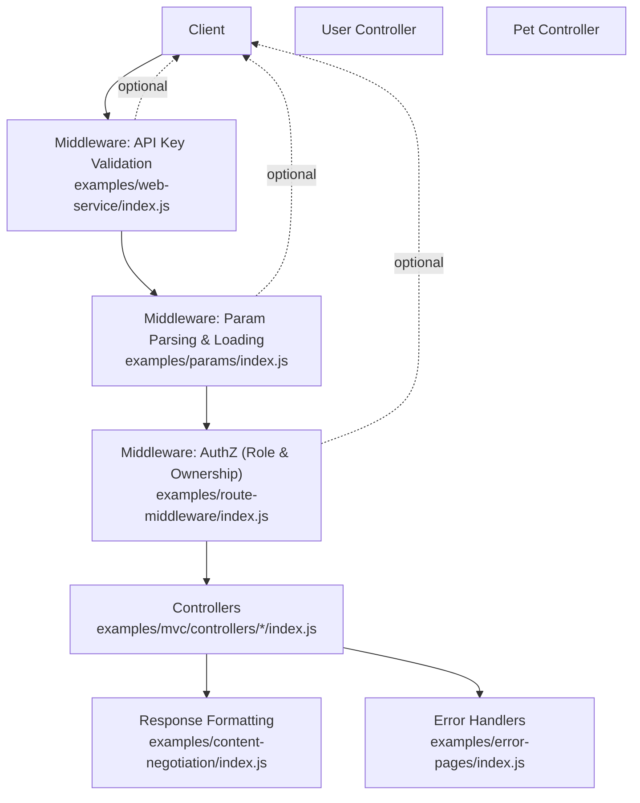

**Diagram sources**
- [index.js:30-42](file://examples/web-service/index.js#L30-L42)
- [index.js:23-41](file://examples/params/index.js#L23-L41)
- [index.js:25-58](file://examples/route-middleware/index.js#L25-L58)
- [index.js:11-42](file://examples/mvc/controllers/user/index.js#L11-L42)
- [index.js:11-32](file://examples/mvc/controllers/pet/index.js#L11-L32)
- [index.js:9-27](file://examples/content-negotiation/index.js#L9-L27)
- [index.js:63-97](file://examples/error-pages/index.js#L63-L97)

## Detailed Component Analysis

### Resource Routing and CRUD Mapping
- A helper maps a base path to standard CRUD endpoints: index (collection), show (individual), destroy (delete), and a custom range endpoint with format negotiation.
- HTTP methods align with REST semantics: GET for retrieval, DELETE for removal.
- Status codes are implicit via Express defaults; consider explicit status codes for clarity.

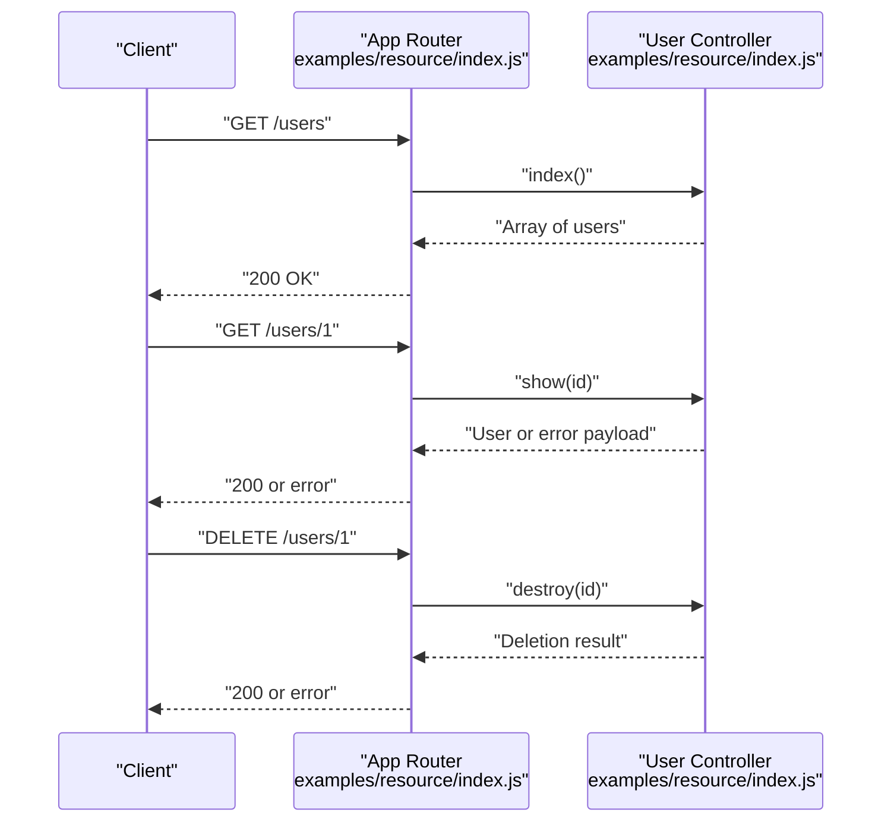

**Diagram sources**
- [index.js:13-26](file://examples/resource/index.js#L13-L26)
- [index.js:42-67](file://examples/resource/index.js#L42-L67)

**Section sources**
- [index.js:13-26](file://examples/resource/index.js#L13-L26)
- [index.js:42-67](file://examples/resource/index.js#L42-L67)

### API Versioning Strategies
- Separate routers are mounted under distinct paths to implement versioning.
- Each version exposes its own root and resource endpoints.

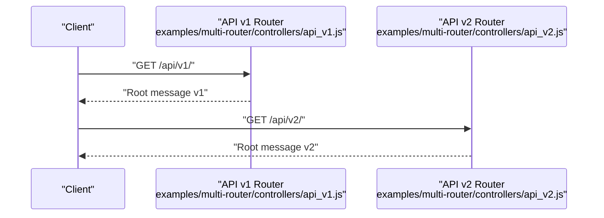

**Diagram sources**
- [api_v1.js:7-13](file://examples/multi-router/controllers/api_v1.js#L7-L13)
- [api_v2.js:7-13](file://examples/multi-router/controllers/api_v2.js#L7-L13)

**Section sources**
- [api_v1.js:5-15](file://examples/multi-router/controllers/api_v1.js#L5-L15)
- [api_v2.js:5-15](file://examples/multi-router/controllers/api_v2.js#L5-L15)

### Web Service Authentication and Authorization
- A middleware validates an API key query parameter and attaches metadata to the request.
- Routes respond with JSON data after authentication passes.
- Centralized error handling ensures consistent error responses.

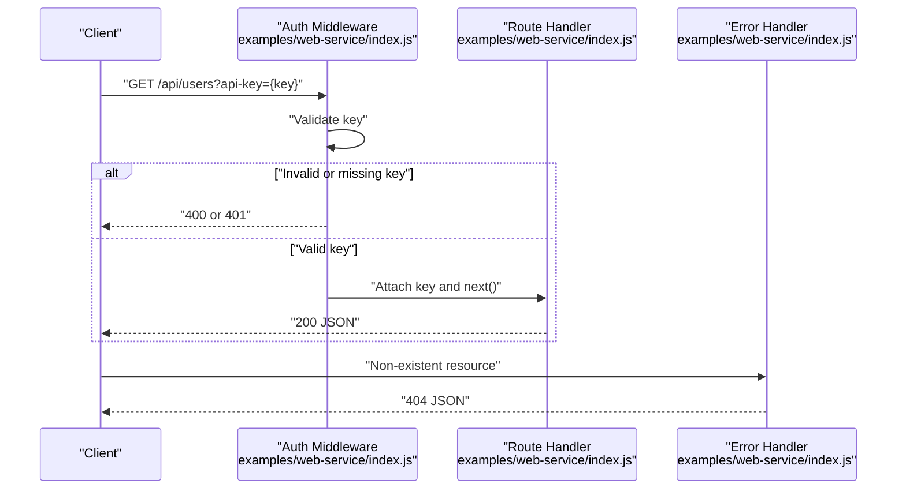

**Diagram sources**
- [index.js:30-42](file://examples/web-service/index.js#L30-L42)
- [index.js:75-91](file://examples/web-service/index.js#L75-L91)
- [index.js:98-111](file://examples/web-service/index.js#L98-L111)

**Section sources**
- [index.js:30-42](file://examples/web-service/index.js#L30-L42)
- [index.js:75-91](file://examples/web-service/index.js#L75-L91)
- [index.js:98-111](file://examples/web-service/index.js#L98-L111)

### Content Negotiation and Response Formatting
- The application chooses response format based on client preference.
- Multiple formats (HTML, text, JSON) are supported.

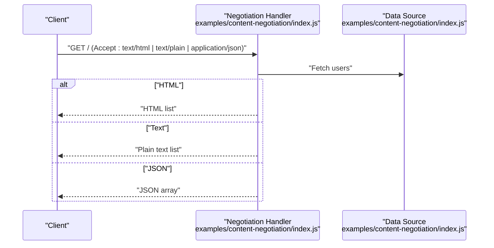

**Diagram sources**
- [index.js:9-27](file://examples/content-negotiation/index.js#L9-L27)
- [index.js:33-40](file://examples/content-negotiation/index.js#L33-L40)

**Section sources**
- [index.js:9-27](file://examples/content-negotiation/index.js#L9-L27)
- [index.js:33-40](file://examples/content-negotiation/index.js#L33-L40)

### MVC Controllers and Shared Middleware
- Controllers encapsulate actions for listing, showing, editing, and updating resources.
- Shared middleware loads resources by ID and handles missing resources with appropriate errors.
- Rendering uses templating engines configured per controller.

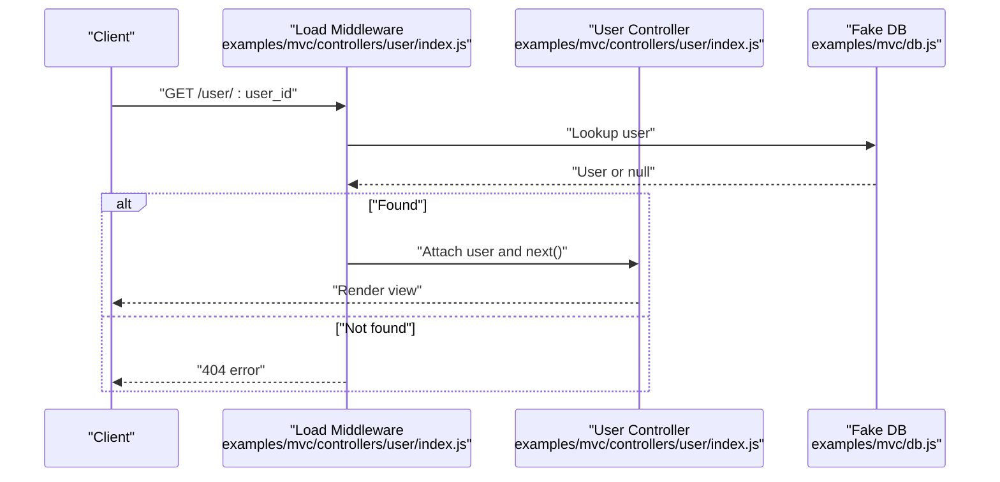

**Diagram sources**
- [index.js:11-22](file://examples/mvc/controllers/user/index.js#L11-L22)
- [index.js:12-17](file://examples/mvc/db.js#L12-L17)

**Section sources**
- [index.js:11-22](file://examples/mvc/controllers/user/index.js#L11-L22)
- [index.js:11-16](file://examples/mvc/controllers/pet/index.js#L11-L16)
- [index.js:5-17](file://examples/mvc/db.js#L5-L17)

### Error Handling and Status Codes
- Centralized 404 handling responds with appropriate content type.
- Generic error handler sets status from error properties or defaults to 500.
- Explicit status codes improve clarity and compliance with REST semantics.

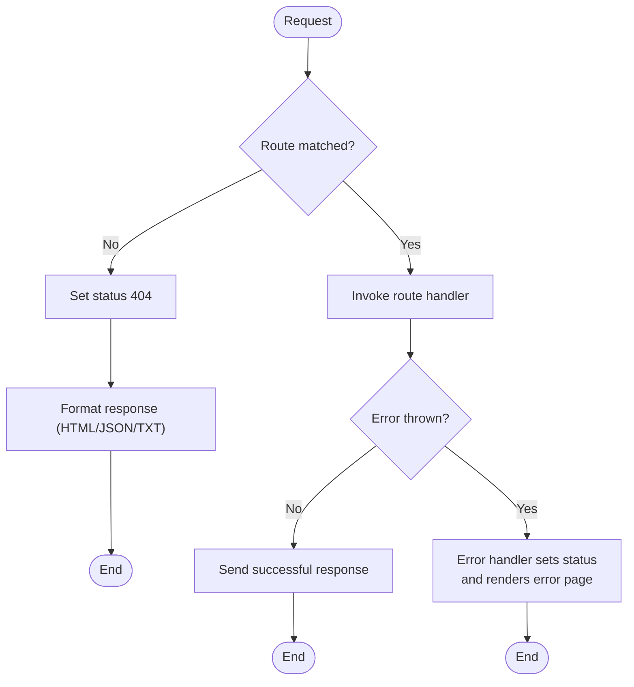

**Diagram sources**
- [index.js:63-97](file://examples/error-pages/index.js#L63-L97)

**Section sources**
- [index.js:63-97](file://examples/error-pages/index.js#L63-L97)

### Parameter Parsing, Validation, and Typed Conversion
- Route parameters are parsed and validated; invalid values trigger errors.
- Numeric parameters are converted to integers; non-numeric input yields 400.

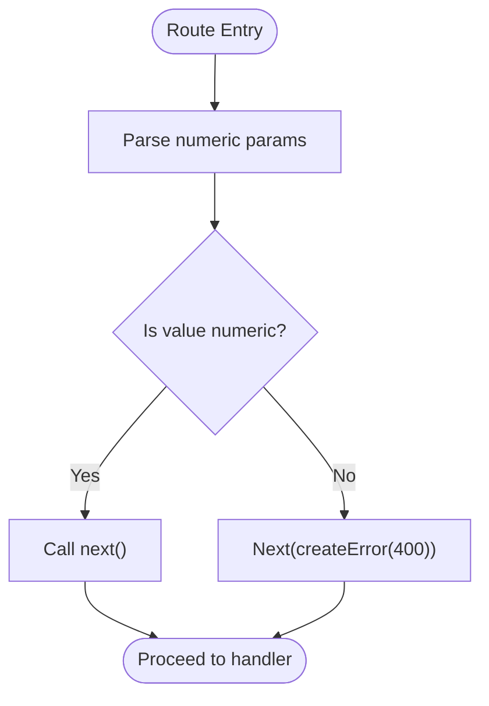

**Diagram sources**
- [index.js:23-30](file://examples/params/index.js#L23-L30)

**Section sources**
- [index.js:23-30](file://examples/params/index.js#L23-L30)
- [index.js:34-41](file://examples/params/index.js#L34-L41)

### Route Mapping Utility for Hierarchical Resources
- A recursive mapping utility registers routes from nested objects.
- Demonstrates hierarchical resource definitions (e.g., users/:uid/pets/:pid).

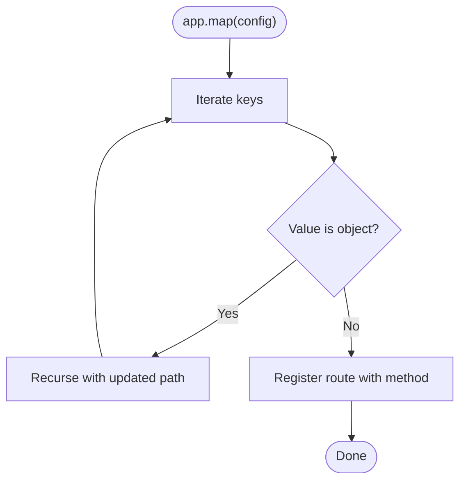

**Diagram sources**
- [index.js:14-29](file://examples/route-map/index.js#L14-L29)

**Section sources**
- [index.js:14-29](file://examples/route-map/index.js#L14-L29)

### Route Middleware for Authorization
- Middleware enforces role-based access (e.g., admin) and ownership checks.
- Chained middleware ensures both identity and permissions before allowing actions.

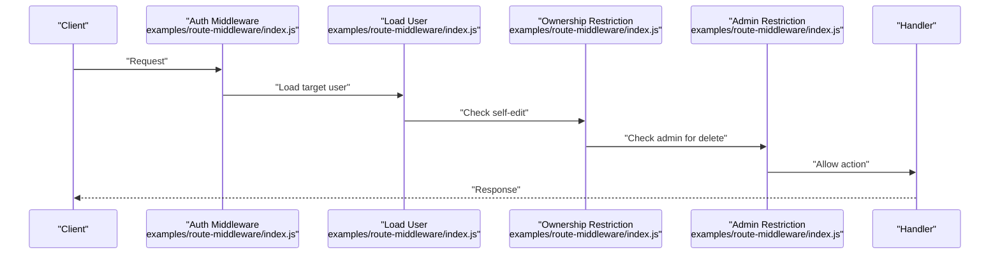

**Diagram sources**
- [index.js:65-68](file://examples/route-middleware/index.js#L65-L68)
- [index.js:25-58](file://examples/route-middleware/index.js#L25-L58)

**Section sources**
- [index.js:25-58](file://examples/route-middleware/index.js#L25-L58)

## Dependency Analysis
- Resource routing depends on a helper that binds HTTP methods to controller actions.
- Versioned routers are independent Express instances mounted under versioned prefixes.
- Web service composes middleware for authentication and centralized error handling.
- MVC controllers rely on shared middleware and a fake database module.
- Error pages module depends on content negotiation and templating.
- Route map utility depends on recursion and dynamic route registration.
- Route middleware composes multiple middleware functions for authorization.

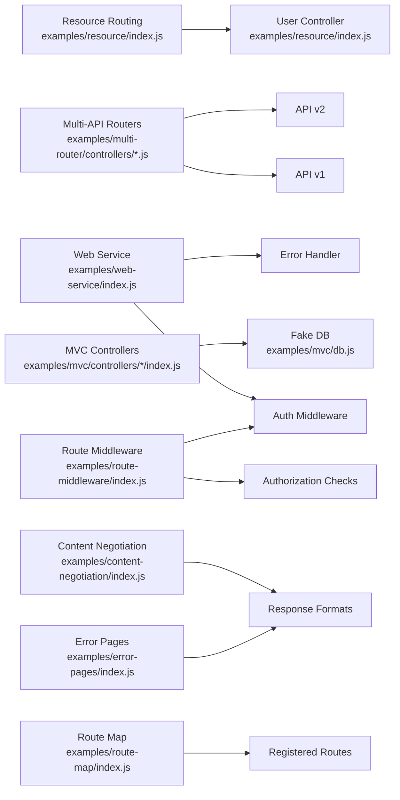

**Diagram sources**
- [index.js:13-26](file://examples/resource/index.js#L13-L26)
- [index.js:5-15](file://examples/multi-router/controllers/api_v1.js#L5-L15)
- [index.js:5-15](file://examples/multi-router/controllers/api_v2.js#L5-L15)
- [index.js:30-42](file://examples/web-service/index.js#L30-L42)
- [index.js:98-111](file://examples/web-service/index.js#L98-L111)
- [index.js:11-22](file://examples/mvc/controllers/user/index.js#L11-L22)
- [index.js:12-17](file://examples/mvc/db.js#L12-L17)
- [index.js:9-27](file://examples/content-negotiation/index.js#L9-L27)
- [index.js:63-97](file://examples/error-pages/index.js#L63-L97)
- [index.js:14-29](file://examples/route-map/index.js#L14-L29)
- [index.js:25-58](file://examples/route-middleware/index.js#L25-L58)

**Section sources**
- [index.js:13-26](file://examples/resource/index.js#L13-L26)
- [api_v1.js:5-15](file://examples/multi-router/controllers/api_v1.js#L5-L15)
- [api_v2.js:5-15](file://examples/multi-router/controllers/api_v2.js#L5-L15)
- [index.js:30-42](file://examples/web-service/index.js#L30-L42)
- [index.js:98-111](file://examples/web-service/index.js#L98-L111)
- [index.js:11-22](file://examples/mvc/controllers/user/index.js#L11-L22)
- [index.js:12-17](file://examples/mvc/db.js#L12-L17)
- [index.js:9-27](file://examples/content-negotiation/index.js#L9-L27)
- [index.js:63-97](file://examples/error-pages/index.js#L63-L97)
- [index.js:14-29](file://examples/route-map/index.js#L14-L29)
- [index.js:25-58](file://examples/route-middleware/index.js#L25-L58)

## Performance Considerations
- Prefer explicit status codes to avoid ambiguity and reduce client-side parsing overhead.
- Use content negotiation efficiently; cache responses when appropriate to reduce computation.
- Minimize synchronous work in middleware; defer heavy operations to asynchronous handlers.
- Keep route handlers small and delegate to service-layer functions for maintainability and testability.

## Troubleshooting Guide
- API key validation failures: ensure the query parameter matches expected values and that middleware is mounted on the correct path.
- 404 responses: verify route registration and that the final middleware is reached only when no route matches.
- Parameter parsing errors: confirm numeric parameters are provided and convert them early; propagate errors with appropriate status codes.
- Authorization failures: check middleware order and that user identity and permissions are set before route handlers.

**Section sources**
- [index.js:30-42](file://examples/web-service/index.js#L30-L42)
- [index.js:63-97](file://examples/error-pages/index.js#L63-L97)
- [index.js:23-30](file://examples/params/index.js#L23-L30)
- [index.js:25-58](file://examples/route-middleware/index.js#L25-L58)

## Conclusion
These examples illustrate RESTful patterns in Express.js: mapping CRUD operations to HTTP methods, structuring resource endpoints, using middleware for authentication and authorization, implementing versioning, and handling errors consistently. By combining these patterns, developers can build predictable, maintainable, and standards-aligned REST APIs.

## Appendices
- RESTful route design checklist:
  - Use nouns for resource names (pluralization varies by team convention).
  - Map HTTP methods to actions: GET (read), POST (create), PUT/PATCH (update), DELETE (remove).
  - Return appropriate status codes: 200, 201, 204, 400, 401, 403, 404, 422, 500.
  - Support content negotiation for multiple response formats.
  - Implement query parameters for filtering, sorting, and pagination.
  - Use middleware for cross-cutting concerns (auth, logging, validation).
  - Document endpoints and version your API clearly.